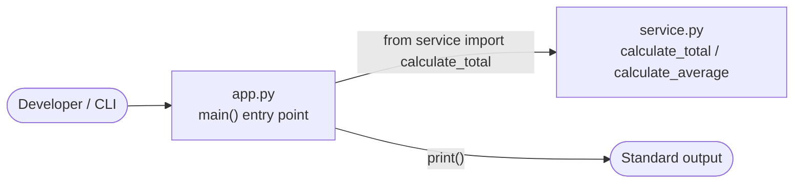
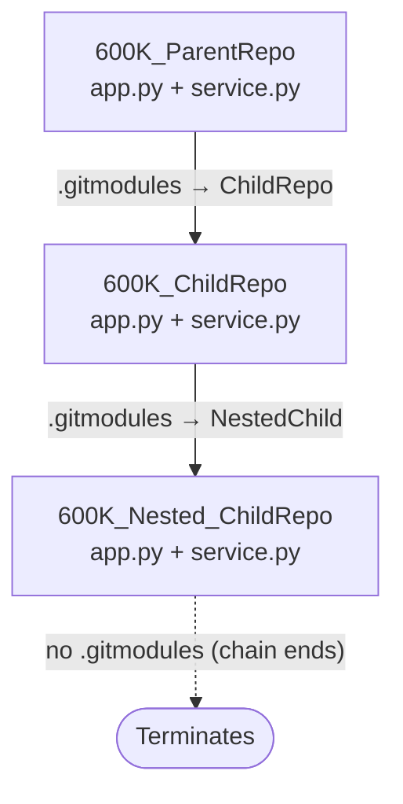
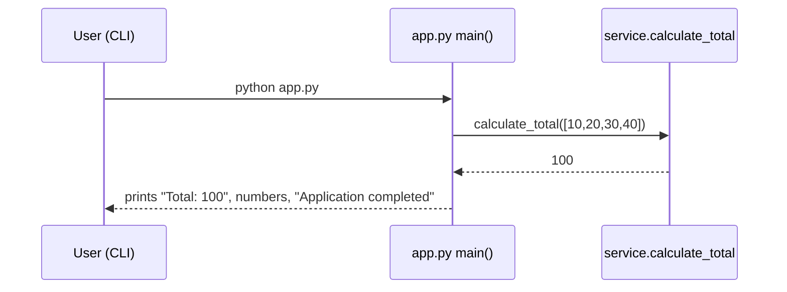

# 600K_ParentRepo

`600K_ParentRepo` is a minimal, dependency-free Python command-line demonstration that sums a fixed list of numbers and prints the results to standard output. It is **deterministic**: the hard-coded input list `[10, 20, 30, 40]` (`Source: app.py:L4`) always produces `Total: 100`. The entire program consists of two small, self-contained modules — an **entry point** (`app.py`) and a **computation library** (`service.py`) — with no third-party dependencies (`Source: app.py:L1-L16`).

The repository's defining structural characteristic is a **three-tier nested Git submodule chain**: `600K_ParentRepo` → `600K_ChildRepo` → `600K_Nested_ChildRepo`, described in [Project Structure](#project-structure) and the [Architecture Diagrams](#architecture-diagrams).

## Table of Contents

- [Overview](#overview)
- [Project Structure](#project-structure)
- [Prerequisites](#prerequisites)
- [Setup Instructions](#setup-instructions)
- [API / Function Reference](#api--function-reference)
  - [`calculate_total(numbers)`](#calculate_totalnumbers)
  - [`calculate_average(numbers)`](#calculate_averagenumbers)
  - [`main()`](#main)
- [Usage & Deployment Guide](#usage--deployment-guide)
- [Code Walkthrough](#code-walkthrough)
- [Architecture Diagrams](#architecture-diagrams)
- [Limitations](#limitations)

## Overview

The program orchestrates a single, simple workflow: it builds a fixed list of four integers, sums them with a helper from the computation library, and prints the total, each number, and a completion message (`Source: app.py:L1-L16`). Because the input is hard-coded (`Source: app.py:L4`), every run is **deterministic** and produces exactly the same output — `Total: 100`, the four numbers, then `Application completed`.

The codebase is intentionally small and procedural:

- **`app.py`** — the *entry point*. Defines `main()` and runs it under the standard `if __name__ == "__main__":` guard (`Source: app.py:L15-L16`).
- **`service.py`** — the *computation library*. Exports two pure numeric helpers, `calculate_total` and `calculate_average` (`Source: service.py:L1-L14`).

There is no HTTP/REST interface, no database, no configuration surface, and no third-party dependency; the only import anywhere is the local `from service import calculate_total` (`Source: app.py:L1`).

## Project Structure

The root repository contains two Python modules, this README, and Git/composition metadata. The `ChildRepo/` directory is a Git submodule that itself contains a further `NestedChild` submodule (`Source: .gitmodules`).

```text
600K_ParentRepo/
├── app.py         # entry point: main()
├── service.py     # computation library: calculate_total, calculate_average
├── README.md      # this document
├── .gitmodules    # declares the ChildRepo submodule
├── .blitzyignore  # ignores *.csv
└── ChildRepo/     # Git submodule (600K_ChildRepo) → contains NestedChild submodule
```

| File | Role |
|------|------|
| `app.py` | Entry point; defines and runs `main()` (`Source: app.py:L3-L13`). |
| `service.py` | Computation library; exports `calculate_total` and `calculate_average` (`Source: service.py:L1-L14`). |
| `README.md` | This project document. |
| `.gitmodules` | Declares the `ChildRepo` submodule (`Source: .gitmodules`). |
| `.blitzyignore` | Ignores `*.csv` files (for example, the ~16 MB `large.csv`). |
| `ChildRepo/` | Git submodule `600K_ChildRepo`; itself contains a `NestedChild` submodule (`Source: ChildRepo/.gitmodules`). |

The full three-tier chain is `600K_ParentRepo` → `600K_ChildRepo` → `600K_Nested_ChildRepo`; the deepest tier declares no submodules of its own, so the chain terminates there. See [Architecture Diagrams](#architecture-diagrams) for a visual of this composition.

## Prerequisites

- **Python 3.6+** — the program uses only standard language features (f-strings and `for` loops). Verified on **Python 3.12.3** (`Source: app.py:L1-L16`).
- **Git** — required to clone the repository and initialize its nested submodules.

This project has **zero third-party dependencies**. The only import anywhere in the codebase is the local `from service import calculate_total` (`Source: app.py:L1`); there is no `requirements.txt`, `setup.py`, `pyproject.toml`, or any other dependency manifest.

## Setup Instructions

Because the repository's defining characteristic is its nested submodule chain, clone **with submodules** so that `ChildRepo/` and its `NestedChild` submodule are populated:

```bash
git clone --recurse-submodules <repository-url>
cd 600K_ParentRepo
```

If you already cloned the repository *without* `--recurse-submodules`, initialize and fetch the submodules afterward:

```bash
git submodule update --init --recursive
```

There is **nothing to install** — no `pip install`, no virtual environment, and no dependency manifest exist (`Source: app.py:L1`). Once the sources are present, you can run the program immediately (see [Usage & Deployment Guide](#usage--deployment-guide)).

> `<repository-url>` is a placeholder for the repository's clone URL. The submodule URLs follow the `github.com/lakshya-blitzy/...` pattern (`Source: .gitmodules`).

## API / Function Reference

This project exposes **no HTTP or REST interface**. Its "API" is the public **Python function surface** of the computation library and the entry point. All three public functions are documented below, each with a parameter/return table and a usage example that reproduces verified behavior.

### `calculate_total(numbers)`

Returns the sum of an iterable of numbers by accumulation (`Source: service.py:L1-L7`).

| Parameter | Type | Description |
|-----------|------|-------------|
| `numbers` | iterable of numeric values | The values to add together (for example, a list of `int` or `float`). |

| Returns | Description |
|---------|-------------|
| number | The accumulated total of all elements. Returns `0` for an empty iterable. |

```python
>>> from service import calculate_total
>>> calculate_total([10, 20, 30, 40])
100
>>> calculate_total([])
0
```

### `calculate_average(numbers)`

Returns the arithmetic mean of a sized collection of numbers (`Source: service.py:L10-L14`).

| Parameter | Type | Description |
|-----------|------|-------------|
| `numbers` | sized collection of numeric values | The values to average (must support `len()` when non-empty). |

| Returns | Description |
|---------|-------------|
| number | The mean, computed as `calculate_total(numbers) / len(numbers)`. Returns `0` when `numbers` is empty/falsy — the `if not numbers` guard short-circuits before the division, so a falsy input never triggers a `ZeroDivisionError`. |

```python
>>> from service import calculate_average
>>> calculate_average([10, 20, 30, 40])
25.0
>>> calculate_average([])
0
```

> **Note:** `calculate_average` is defined but **currently unused** by `app.py`; it is documented here for completeness of the public function surface (`Source: service.py:L10`).

### `main()`

Orchestrates the aggregation workflow (`Source: app.py:L3-L13`).

| Parameter | Type | Description |
|-----------|------|-------------|
| *(none)* | — | `main()` takes no arguments. |

| Returns | Description |
|---------|-------------|
| `None` | `main()` returns nothing; it communicates solely through console side effects. |

**Side effects:** prints `Total: 100`, then each number on its own line, then `Application completed`. `main()` is invoked under the `if __name__ == "__main__":` guard, so it runs when the file is executed directly but not when it is imported (`Source: app.py:L15-L16`).

## Usage & Deployment Guide

Run the entry point from the repository root:

```bash
python app.py
```

Expected output (verified under Python 3.12.3, exit code 0):

```text
Total: 100
10
20
30
40
Application completed
```

### What "deployment" means here

This project is a **self-contained CLI script**, not a hosted service. "Deployment" therefore means running or distributing the script directly. There is no server to host, no ports to expose, no configuration files, no environment variables, and no command-line arguments — the input list is hard-coded (`Source: app.py:L4`).

### Submodule caveat

The `ChildRepo` and `NestedChild` tiers replicate the same demonstration, but the **deepest tier (`NestedChild`) is NOT runnable**: its `service.py` duplicates the entry-point code and therefore does not define `calculate_total`, so the import cannot be resolved and the tier raises a failed/circular import (`Source: ChildRepo/NestedChild/service.py:L1`). See [Limitations](#limitations) for details.

### Optional: view docstrings with `pydoc`

The standard-library `pydoc` tool (bundled with Python, no installation required) can render the modules' docstrings to HTML:

```bash
python -m pydoc -w app service
```

## Code Walkthrough

A narrated, block-by-block explanation of both source files.

### `app.py` (entry point)

1. **Import.** `from service import calculate_total` brings the summation helper into scope; it is the only import in the program (`Source: app.py:L1`).
2. **Build input.** Inside `main()`, the fixed list `numbers = [10, 20, 30, 40]` is constructed (`Source: app.py:L4`).
3. **Compute total.** `total = calculate_total(numbers)` delegates summation to the computation library, yielding `100` for this input (`Source: app.py:L6`).
4. **Print the total.** `print(f"Total: {total}")` writes `Total: 100` using an f-string (`Source: app.py:L8`).
5. **Print each number.** A `for` loop prints each element on its own line (`Source: app.py:L10-L11`).
6. **Print completion.** `print("Application completed")` writes the final line (`Source: app.py:L13`).
7. **Entry guard.** `if __name__ == "__main__": main()` runs the workflow only when the file is executed directly, not when it is imported (`Source: app.py:L15-L16`).

### `service.py` (computation library)

- **`calculate_total`** initializes an accumulator `total = 0`, iterates over `numbers` adding each element with augmented assignment (`total += number`), and returns the accumulated sum (`Source: service.py:L1-L7`).
- **`calculate_average`** returns `0` immediately for a falsy input (for example, an empty list); otherwise it divides the total by the element count: `calculate_total(numbers) / len(numbers)` (`Source: service.py:L10-L14`).

## Architecture Diagrams

Three diagrams describe the runtime relationships and the repository composition. GitHub renders the fenced `mermaid` blocks below natively — no build step is required.

### Runtime call flow



### Nested-submodule composition



### `main()` execution sequence



## Limitations

The following characteristics are **documented, not defects to be fixed** in this task:

- **Hard-coded input.** The list `[10, 20, 30, 40]` is fixed in source; the program accepts no arguments, configuration, or environment variables (`Source: app.py:L4`).
- **No error handling.** The functions assume well-formed numeric iterables; passing a non-iterable or a non-numeric argument raises the corresponding built-in exception at runtime.
- **Unused capability.** `calculate_average` is defined in the computation library but is never called by `app.py` (`Source: service.py:L10`).
- **Non-runnable deepest tier.** `ChildRepo/NestedChild` cannot run because its `service.py` duplicates the entry-point code and therefore cannot resolve `calculate_total` (`Source: ChildRepo/NestedChild/service.py:L1`).
- **Ignored data files.** `*.csv` files (for example, the ~16 MB `large.csv`) are ignored via `.blitzyignore` and are not part of the program.
