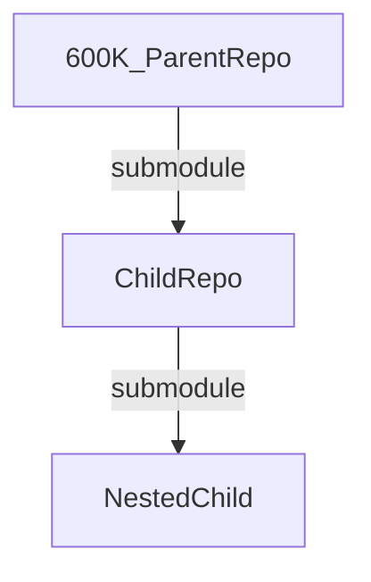
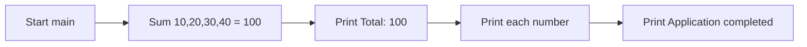

# 600K_ParentRepo

A minimal, standard-library-only Python demonstration that sums a fixed list of
numbers and prints the results. Its direct-execution entry point is `app.py`
[Source: app.py:L17], which delegates the summation to the local `service`
module [Source: app.py:L15]. This repository sits at the **top of a two-level Git
submodule tree** — `600K_ParentRepo` → `ChildRepo` → `NestedChild`
[Source: .gitmodules, ChildRepo/.gitmodules].

## Overview

`600K_ParentRepo` is a small teaching/demonstration project with **no
third-party dependencies** — it relies solely on the Python standard library and
targets **Python 3.6+**. The program builds the hard-coded list
`[10, 20, 30, 40]`, computes its total with `calculate_total`, prints the total,
prints each individual number, and finishes with an `Application completed`
message [Source: app.py:L17].

The repository is intentionally tiny and consists of exactly two source files
plus this README:

- `app.py` — the runnable entry point; defines `main()` and imports
  `calculate_total` from the local `service` module [Source: app.py:L15, app.py:L17].
- `service.py` — the computation module; defines `calculate_total` and
  `calculate_average` [Source: service.py:L18, service.py:L44].

Beyond the code, this repository is also the **root of a submodule tree**: it
declares one submodule, `ChildRepo`, which in turn declares its own
`NestedChild` submodule [Source: .gitmodules, ChildRepo/.gitmodules]. See
[Repository and Submodule Composition](#repository-and-submodule-composition)
for details.

## Table of Contents

- [Overview](#overview)
- [Prerequisites](#prerequisites)
- [Setup and Installation](#setup-and-installation)
- [Project Structure](#project-structure)
- [Repository and Submodule Composition](#repository-and-submodule-composition)
- [API Documentation](#api-documentation)
- [Deployment and How to Run](#deployment-and-how-to-run)
- [Usage Examples](#usage-examples)
- [Inline Code Explanations](#inline-code-explanations)
- [Known Issues and Notes](#known-issues-and-notes)

## Prerequisites

| Requirement | Version | Notes |
|-------------|---------|-------|
| Python | 3.6 or newer | Requires Python 3.6+ because the source uses f-strings [Source: app.py:L36]; only the standard library is used. Verified by executing `python3 app.py` on **Python 3.13.7** in this environment, which produced the expected output (see [Deployment and How to Run](#deployment-and-how-to-run)). |
| Git | Any recent version | Required to clone this repository **and its submodules** [Source: .gitmodules, ChildRepo/.gitmodules]. |

There are **no third-party runtime dependencies** and no dependency manifest —
repository inventory shows no `requirements.txt`, `setup.py`, or `pyproject.toml`
in the repository root, and the only import in `app.py` is the intra-repository
`from service import calculate_total` [Source: app.py:L15]. The project runs with
a stock Python interpreter out of the box.

## Setup and Installation

Because the project is the root of a submodule tree, the submodules are integral
to it and **must be fetched recursively**. Choose one of the two workflows below.

**Fresh clone (recommended)** — clone the parent and all nested submodules in a
single step:

```bash
git clone --recursive <repository-url>
```

**Existing checkout** — if you already cloned the repository without
`--recursive`, initialize and fetch every submodule (including the nested one):

```bash
git submodule update --init --recursive
```

The `--recursive` / `--init --recursive` flags are important: they ensure both
the `ChildRepo` submodule and its nested `NestedChild` submodule are populated
[Source: .gitmodules, ChildRepo/.gitmodules]. Without them, the submodule directories will be empty.

> **Security note:** Use your own repository URL in place of `<repository-url>`.
> The submodule URLs referenced in this document are the clean, public URLs
> declared in `.gitmodules`; never embed access tokens or credentials in a clone
> URL that you share.

## Project Structure

The parent repository is intentionally small — two Python source files plus this
README at its root — with the broader system composed through nested Git
submodules. The on-disk layout at the repository root is:

```text
600K_ParentRepo/
├── README.md      # this document
├── app.py         # entry point; defines main()  [Source: app.py:L17]
├── service.py     # calculate_total / calculate_average  [Source: service.py:L18, service.py:L44]
└── ChildRepo/     # Git submodule → embeds NestedChild  [Source: .gitmodules, ChildRepo/.gitmodules]
```

In this layout, `app.py` is the runnable entry point that defines `main()` and
imports `calculate_total` from the local `service` module
[Source: app.py:L15, app.py:L17]; `service.py` provides the `calculate_total` and
`calculate_average` helpers [Source: service.py:L18, service.py:L44]; and
`ChildRepo/` is the first-level Git submodule that itself embeds the `NestedChild`
submodule, forming the `600K_ParentRepo` → `ChildRepo` → `NestedChild` tree
[Source: .gitmodules, ChildRepo/.gitmodules].

> **Note:** The detailed submodule graph — including the `NestedChild` leaf and
> the `graph TD` diagram — is provided in the adjacent
> [Repository and Submodule Composition](#repository-and-submodule-composition)
> section below, which this section complements rather than duplicates.

## Repository and Submodule Composition

This repository declares a single submodule in `.gitmodules` [Source: .gitmodules]:

| Submodule path | Source URL |
|----------------|------------|
| `ChildRepo` | `https://github.com/lakshya-blitzy/600K_ChildRepo.git` |

`ChildRepo` is itself a Git repository that declares a further `NestedChild`
submodule (`https://github.com/lakshya-blitzy/600K_Nested_ChildRepo.git`)
[Source: ChildRepo/.gitmodules], producing a two-level tree. Each repository is independent, with its own history
and README:

- **This repository** (`600K_ParentRepo`) — you are here.
- **[ChildRepo](ChildRepo/README.md)** — the first-level submodule; see its own
  README for details, including how it embeds `NestedChild`.



## API Documentation

The public functions live in `service.py` (the computation helpers) and `app.py`
(the entry point). Terminology is consistent across the whole submodule tree:
`calculate_total`, `calculate_average`, and `main`.

### `calculate_total(numbers)`

Iteratively sums a numeric iterable. [Source: service.py:L18]

```python
def calculate_total(numbers): ...
```

| Parameter | Type | Description |
|-----------|------|-------------|
| `numbers` | list of int/float | The numeric values to sum. Elements are assumed to be numeric. |

**Returns:** `int` / `float` — the accumulated total of all elements. Returns
`0` for an empty input (the natural result of summing zero elements).

**Behavior:** walks the input once, adding each element to a running `total`,
then returns it. It is a pure function: it performs no I/O and does not mutate
its argument.

**Example:**

```python
from service import calculate_total

calculate_total([10, 20, 30, 40])  # -> 100
```

### `calculate_average(numbers)`

Computes the arithmetic mean of a sized numeric collection such as a list or
tuple. [Source: service.py:L44]

```python
def calculate_average(numbers): ...
```

| Parameter | Type | Description |
|-----------|------|-------------|
| `numbers` | list/tuple of int/float (a *sized* collection) | The numeric values to average. Must support `len()`; unsized iterables such as generators are not supported. |

**Returns:** `int` / `float` — the total divided by the number of elements
(`calculate_total(numbers) / len(numbers)`). Returns `0` for an empty/falsey
input, which guards against division by zero. [Source: service.py:L44]

Because the mean is computed with `len(numbers)`, `numbers` must be a sized
collection (for example a `list` or `tuple`); passing an unsized iterable such
as a generator raises `TypeError`. [Source: service.py:L44]

> **Note:** `calculate_average` is **defined but never invoked** anywhere in the
> project — `main()` uses only `calculate_total`. It is documented here for
> completeness and full API coverage.

**Example:**

```python
from service import calculate_average

calculate_average([10, 20, 30, 40])  # -> 25.0
calculate_average([])                 # -> 0
```

### `main()`

The direct-execution entry point of the application. [Source: app.py:L17]

```python
def main(): ...
```

| Parameter | Type | Description |
|-----------|------|-------------|
| _(none)_ | — | `main()` takes no arguments. |

**Returns:** `None` — results are written to standard output.

**Behavior:** builds the fixed list `[10, 20, 30, 40]`, delegates the summation
to `calculate_total`, prints `Total: 100`, prints each number on its own line,
and finally prints `Application completed` [Source: app.py:L17]. The
`calculate_total` symbol is imported from the local `service` module
[Source: app.py:L15].

**Example:**

```python
from app import main

main()  # prints: Total: 100 / 10 / 20 / 30 / 40 / Application completed
```

## Deployment and How to Run

This is a **standalone standard-library Python script** — there is **no
container image, no cloud deployment, and no build step**. Running it is simply
a matter of invoking the interpreter on the entry point from the repository root:

```bash
python app.py
```

Expected standard output — verified by executing `python3 app.py` on
**Python 3.13.7** (exit code 0), produced by `main()` [Source: app.py:L17]:

```text
Total: 100
10
20
30
40
Application completed
```

The control flow of `main()` is:



## Usage Examples

This section explicitly collects the runnable examples for the project. Every
example below reflects **actual observed behavior** — the parent application runs
successfully and exits with status code 0. (For the full reference of each
function, see [API Documentation](#api-documentation); for the run/deployment
narrative and control-flow diagram, see
[Deployment and How to Run](#deployment-and-how-to-run).)

### Running the application

Run the entry point with the Python interpreter from the repository root:

```bash
python app.py
```

Verified standard output — produced by `main()` and reproduced by executing
`python3 app.py` on **Python 3.13.7** (exit code 0) [Source: app.py:L17]:

```text
Total: 100
10
20
30
40
Application completed
```

### Using the library functions

The computation helpers in `service.py` can also be imported and reused directly
in your own code:

```python
from service import calculate_total, calculate_average

calculate_total([10, 20, 30, 40])    # -> 100    [Source: service.py:L18]
calculate_total([])                  # -> 0      [Source: service.py:L18]

calculate_average([10, 20, 30, 40])  # -> 25.0   [Source: service.py:L44]
calculate_average([])                # -> 0      [Source: service.py:L44]
```

`calculate_total` sums a numeric iterable, returning `0` for an empty input
[Source: service.py:L18], and `calculate_average` returns the arithmetic mean,
returning `0` for empty/falsey input to guard against division by zero
[Source: service.py:L44]. As noted in the API reference, `calculate_average` is
**defined but never invoked** by `main()`; it is shown here for completeness and
full API coverage [Source: service.py:L44].

### Invoking `main()` programmatically

The entry point itself can be driven from another module by importing `main`:

```python
from app import main

main()  # prints: Total: 100 / 10 / 20 / 30 / 40 / Application completed  [Source: app.py:L17]
```

Because `app.py` guards its entry point with `if __name__ == "__main__":`,
importing `app` produces no side effects until `main()` is called explicitly
[Source: app.py:L45-L46].

## Inline Code Explanations

- **The accumulation (summation) loop** — inside `calculate_total`, a running
  `total` starts at `0` and each element of `numbers` is added to it as the loop
  iterates; the accumulated value is returned once the loop completes
  [Source: service.py:L38-L39]. This single-pass accumulation is what turns
  `[10, 20, 30, 40]` into `100`.

- **The `if __name__ == "__main__":` guard** — at the bottom of `app.py`, this
  guard calls `main()` **only when the file is executed directly**
  (e.g. `python app.py`). When `app.py` is imported as a module instead, the
  guard is skipped so importing has no side effects [Source: app.py:L45-L46].

- **`calculate_average` is defined but never called** — the module exposes
  `calculate_average` [Source: service.py:L44], but `main()` invokes only
  `calculate_total`. The averaging helper is available for reuse but is not part
  of the program's runtime path.

## Known Issues and Notes

- **Nested submodule runtime error (documented as-is, not fixed).** In the
  `NestedChild` submodule, `ChildRepo/NestedChild/service.py` and its own
  `app.py` were byte-for-byte identical at the pre-documentation baseline (the
  nested repository's original `Create app.py` / `Create service.py` commits,
  before any docstrings were added — established by comparing the two files at
  that baseline revision, where they shared an identical checksum). Adding
  docstrings and comments has since made the two files differ textually, but
  their non-documentation statements and control flow remain equivalent. Because
  of that original duplication, `service.py` defines `main()`
  [Source: ChildRepo/NestedChild/service.py:L47] and imports `calculate_total`
  from `service` [Source: ChildRepo/NestedChild/service.py:L45] rather than
  defining `calculate_total` / `calculate_average`. As a result, running
  `ChildRepo/NestedChild/app.py` [Source: ChildRepo/NestedChild/app.py:L48]
  raises a circular `ImportError` at runtime and exits with a non-zero status
  (exit code 1) — verified by executing `python3 app.py` in that directory on
  Python 3.13.7 (empty standard output). This behavior is preserved as-is. The
  in-depth documentation of this defect — including the canonical error message —
  now lives in the `NestedChild` submodule's own **completed** README at
  [ChildRepo/NestedChild/README.md](ChildRepo/NestedChild/README.md).

- **This repository runs correctly.** The parent `app.py` and `ChildRepo/app.py`
  execute and produce the output shown in
  [Deployment and How to Run](#deployment-and-how-to-run); only the nested
  submodule is affected by the issue above.
