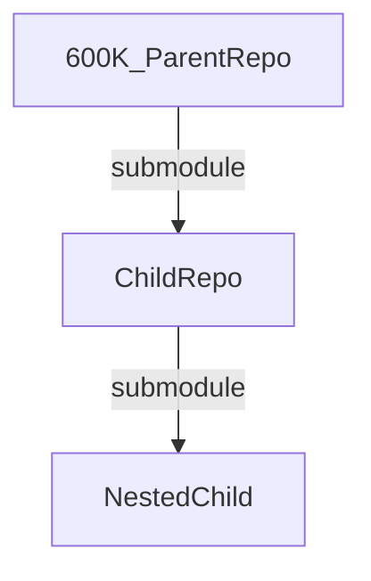
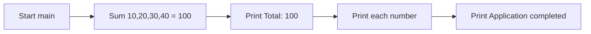

# 600K_ParentRepo

A minimal, standard-library-only Python demonstration that sums a fixed list of
numbers and prints the results. Its direct-execution entry point is `app.py`
[Source: app.py:L3], which delegates the summation to the local `service`
module [Source: app.py:L1]. This repository sits at the **top of a two-level Git
submodule tree** — `600K_ParentRepo` → `ChildRepo` → `NestedChild`
[Source: .gitmodules].

## Overview

`600K_ParentRepo` is a small teaching/demonstration project with **no
third-party dependencies** — it relies solely on the Python standard library and
targets **Python 3.6+**. The program builds the hard-coded list
`[10, 20, 30, 40]`, computes its total with `calculate_total`, prints the total,
prints each individual number, and finishes with an `Application completed`
message [Source: app.py:L3].

The repository is intentionally tiny and consists of exactly two source files
plus this README:

- `app.py` — the runnable entry point; defines `main()` and imports
  `calculate_total` from the local `service` module [Source: app.py:L1, app.py:L3].
- `service.py` — the computation module; defines `calculate_total` and
  `calculate_average` [Source: service.py:L1, service.py:L10].

Beyond the code, this repository is also the **root of a submodule tree**: it
declares one submodule, `ChildRepo`, which in turn declares its own
`NestedChild` submodule [Source: .gitmodules]. See
[Repository and Submodule Composition](#repository-and-submodule-composition)
for details.

## Table of Contents

- [Overview](#overview)
- [Prerequisites](#prerequisites)
- [Setup and Installation](#setup-and-installation)
- [Repository and Submodule Composition](#repository-and-submodule-composition)
- [API Documentation](#api-documentation)
- [Deployment and How to Run](#deployment-and-how-to-run)
- [Inline Code Explanations](#inline-code-explanations)
- [Known Issues and Notes](#known-issues-and-notes)

## Prerequisites

| Requirement | Version | Notes |
|-------------|---------|-------|
| Python | 3.6 or newer | Verified working with Python 3.12.3. Uses only the standard library. |
| Git | Any recent version | Required to clone this repository **and its submodules**. |

There are **no third-party runtime dependencies** and no dependency manifest
(no `requirements.txt`, `setup.py`, `pyproject.toml`, etc.) — the project runs
with a stock Python interpreter out of the box.

## Setup and Installation

Because the project is the root of a submodule tree, the submodules are integral
to it and **must be fetched recursively**. Choose one of the two workflows below.

**Fresh clone (recommended)** — clone the parent and all nested submodules in a
single step:

```bash
git clone --recursive <repository-url>
```

**Existing checkout** — if you already cloned the repository without
`--recursive`, initialize and fetch every submodule (including the nested one):

```bash
git submodule update --init --recursive
```

The `--recursive` / `--init --recursive` flags are important: they ensure both
the `ChildRepo` submodule and its nested `NestedChild` submodule are populated
[Source: .gitmodules]. Without them, the submodule directories will be empty.

> **Security note:** Use your own repository URL in place of `<repository-url>`.
> The submodule URLs referenced in this document are the clean, public URLs
> declared in `.gitmodules`; never embed access tokens or credentials in a clone
> URL that you share.

## Repository and Submodule Composition

This repository declares a single submodule in `.gitmodules` [Source: .gitmodules]:

| Submodule path | Source URL |
|----------------|------------|
| `ChildRepo` | `https://github.com/lakshya-blitzy/600K_ChildRepo.git` |

`ChildRepo` is itself a Git repository that declares a further `NestedChild`
submodule (`https://github.com/lakshya-blitzy/600K_Nested_ChildRepo.git`),
producing a two-level tree. Each repository is independent, with its own history
and README:

- **This repository** (`600K_ParentRepo`) — you are here.
- **[ChildRepo](ChildRepo/README.md)** — the first-level submodule; see its own
  README for details, including how it embeds `NestedChild`.



## API Documentation

The public functions live in `service.py` (the computation helpers) and `app.py`
(the entry point). Terminology is consistent across the whole submodule tree:
`calculate_total`, `calculate_average`, and `main`.

### `calculate_total(numbers)`

Iteratively sums a numeric iterable. [Source: service.py:L1]

```python
def calculate_total(numbers)
```

| Parameter | Type | Description |
|-----------|------|-------------|
| `numbers` | list of int/float | The numeric values to sum. Elements are assumed to be numeric. |

**Returns:** `int` / `float` — the accumulated total of all elements. Returns
`0` for an empty input (the natural result of summing zero elements).

**Behavior:** walks the input once, adding each element to a running `total`,
then returns it. It is a pure function: it performs no I/O and does not mutate
its argument.

**Example:**

```python
from service import calculate_total

calculate_total([10, 20, 30, 40])  # -> 100
```

### `calculate_average(numbers)`

Computes the arithmetic mean of a numeric iterable. [Source: service.py:L10]

```python
def calculate_average(numbers)
```

| Parameter | Type | Description |
|-----------|------|-------------|
| `numbers` | list of int/float | The numeric values to average. |

**Returns:** `int` / `float` — the total divided by the number of elements
(`calculate_total(numbers) / len(numbers)`). Returns `0` for an empty/falsey
input, which guards against division by zero. [Source: service.py:L10]

> **Note:** `calculate_average` is **defined but never invoked** anywhere in the
> project — `main()` uses only `calculate_total`. It is documented here for
> completeness and full API coverage.

**Example:**

```python
from service import calculate_average

calculate_average([10, 20, 30, 40])  # -> 25.0
calculate_average([])                 # -> 0
```

### `main()`

The direct-execution entry point of the application. [Source: app.py:L3]

```python
def main()
```

| Parameter | Type | Description |
|-----------|------|-------------|
| _(none)_ | — | `main()` takes no arguments. |

**Returns:** `None` — results are written to standard output.

**Behavior:** builds the fixed list `[10, 20, 30, 40]`, delegates the summation
to `calculate_total`, prints `Total: 100`, prints each number on its own line,
and finally prints `Application completed` [Source: app.py:L3]. The
`calculate_total` symbol is imported from the local `service` module
[Source: app.py:L1].

**Example:**

```python
from app import main

main()  # prints: Total: 100 / 10 / 20 / 30 / 40 / Application completed
```

## Deployment and How to Run

This is a **standalone standard-library Python script** — there is **no
container image, no cloud deployment, and no build step**. Running it is simply
a matter of invoking the interpreter on the entry point from the repository root:

```bash
python app.py
```

Expected standard output (verified with `python3 app.py`):

```text
Total: 100
10
20
30
40
Application completed
```

The control flow of `main()` is:



## Inline Code Explanations

- **The accumulation (summation) loop** — inside `calculate_total`, a running
  `total` starts at `0` and each element of `numbers` is added to it as the loop
  iterates; the accumulated value is returned once the loop completes
  [Source: service.py:L4-L5]. This single-pass accumulation is what turns
  `[10, 20, 30, 40]` into `100`.

- **The `if __name__ == "__main__":` guard** — at the bottom of `app.py`, this
  guard calls `main()` **only when the file is executed directly**
  (e.g. `python app.py`). When `app.py` is imported as a module instead, the
  guard is skipped so importing has no side effects [Source: app.py:L1, app.py:L3].

- **`calculate_average` is defined but never called** — the module exposes
  `calculate_average` [Source: service.py:L10], but `main()` invokes only
  `calculate_total`. The averaging helper is available for reuse but is not part
  of the program's runtime path.

## Known Issues and Notes

- **Nested submodule runtime error (documented as-is, not fixed).** In the
  `NestedChild` submodule, `ChildRepo/NestedChild/service.py` is a byte-for-byte
  duplicate of its own `app.py`: it defines `main()` and imports
  `calculate_total` rather than defining `calculate_total` / `calculate_average`.
  As a result, running `ChildRepo/NestedChild/app.py` raises a circular
  `ImportError` at runtime. This behavior is preserved as-is; see the
  `NestedChild` repository's README for the in-depth description.

- **This repository runs correctly.** The parent `app.py` and `ChildRepo/app.py`
  execute and produce the output shown in
  [Deployment and How to Run](#deployment-and-how-to-run); only the nested
  submodule is affected by the issue above.

- **Data files are out of scope.** A large `*.csv` data file present in the
  repository is excluded from documentation by `.blitzyignore` and is not part
  of the runnable program.
