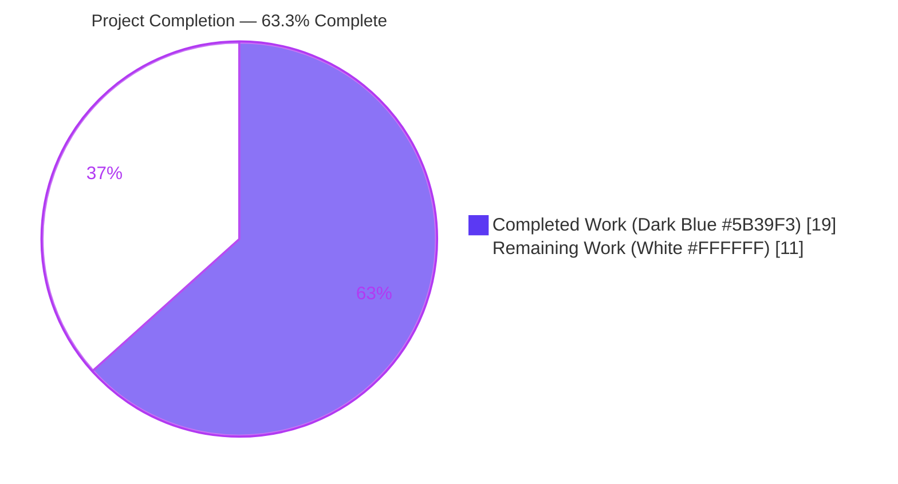
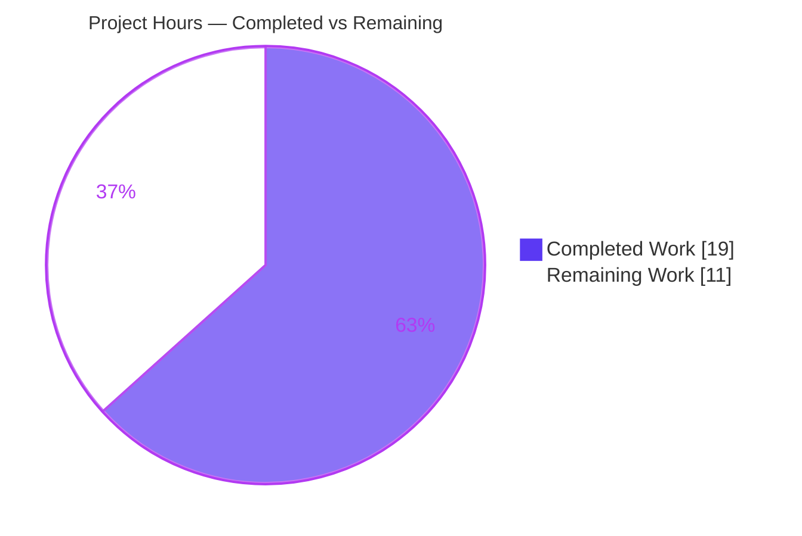
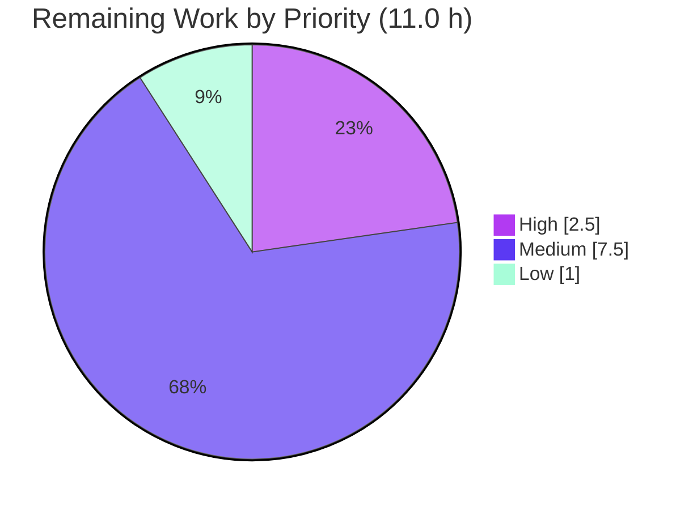

# Blitzy Project Guide — Flask Migration of the 600K Submodule Chain

> **Project:** Console-to-Flask migration across a three-level Git submodule chain (`600K_ParentRepo` → `ChildRepo` → `ChildRepo/NestedChild`)
> **Branch:** `blitzy-fb6658eb-2ff3-4c3d-b046-26a8d0345027`
> **Brand legend:** <span style="color:#5B39F3">**■ Completed / AI Work — Dark Blue `#5B39F3`**</span> · <span style="background:#FFFFFF;border:1px solid #B23AF2">**□ Remaining — White `#FFFFFF`**</span> · Accents Violet-Black `#B23AF2` · Highlight Mint `#A8FDD9`

---

## 1. Executive Summary

### 1.1 Project Overview

This project migrates an entire three-level Git submodule chain — the parent `600K_ParentRepo`, its child `ChildRepo`, and the nested `ChildRepo/NestedChild` — from a standard-library-only console program into three standalone **Flask 3.1.3** WSGI web applications, while keeping every feature and functionality exactly the same. Each repository previously ran as `python app.py` writing six lines to stdout; each now serves that identical content over HTTP `GET /` as `text/plain`. The target users are developers and downstream systems that consume the computed output (`Total: 100`, the four fixed numbers, and `Application completed`). The technical scope is deliberately minimal and deterministic: same hard-coded input `[10, 20, 30, 40]`, same computation, same output ordering — only the I/O channel changes from stdout to an HTTP response body.

### 1.2 Completion Status



| Metric | Hours |
|---|---|
| **Total Hours** | **30.0** |
| Completed Hours (AI + Manual) | 19.0 |
| &nbsp;&nbsp;• AI (autonomous Blitzy agents) | 19.0 |
| &nbsp;&nbsp;• Manual (human) | 0.0 |
| Remaining Hours | 11.0 |
| **Percent Complete** | **63.3%** |

> **Calculation (PA1, AAP-scoped):** Completion % = Completed ÷ (Completed + Remaining) × 100 = 19.0 ÷ 30.0 × 100 = **63.3%**. All AAP-scoped deliverables are 100% complete and validated; the remaining 11.0 h is net-new path-to-production hardening (not rework).

### 1.3 Key Accomplishments

- ✅ Introduced Flask 3.1.3 at all three repository levels using the **application-factory pattern** (`create_app()`) with a single `GET /` route.
- ✅ Preserved the direct-run affordance — `python app.py` still launches the app (guard now calls `app.run()`); `flask run` also works.
- ✅ Kept the business logic **verbatim** — `calculate_total` / `calculate_average` byte-identical across all three `service.py` (md5 `29f41cb0…`).
- ✅ Achieved **exact output parity** over HTTP: `Total: 100`, `10`, `20`, `30`, `40`, `Application completed` (HTTP 200, `text/plain; charset=utf-8`, Content-Length 44) — verified on all three apps.
- ✅ **Resolved the NestedChild circular-import defect (AAP §0.6.2)** by reconstructing `ChildRepo/NestedChild/service.py` as the canonical computation module.
- ✅ Created three `requirements.txt` manifests pinning the real release `Flask==3.1.3` (md5 `7dbe00a3…`).
- ✅ Preserved submodule linkage & pointers (`.gitmodules` unchanged; `git submodule status --recursive` shows no drift) and honored `.blitzyignore` (`*.csv` never touched).
- ✅ Passed all five autonomous validation gates (dependencies, compilation, logic, runtime, commit/sync) with zero source defects.

### 1.4 Critical Unresolved Issues

| Issue | Impact | Owner | ETA |
|---|---|---|---|
| NestedChild interpretation confirmation (AAP §0.6.2): the fix repairs a pre-existing circular-import crash ("intended" interpretation) vs. a literal "preserve the crash" reading | Low — code works correctly; only a semantic sign-off on user intent | Product/Requirements owner | 1.0 h |
| No production WSGI server yet (apps run on the Werkzeug dev server) | Medium — blocks real production deployment, not functionality | Backend/DevOps | 1.5 h |

> No issue blocks compilation, tests, or runtime. All AAP-scoped code is complete and validated.

### 1.5 Access Issues

| System/Resource | Type of Access | Issue Description | Resolution Status | Owner |
|---|---|---|---|---|
| — | — | **No access issues identified.** Repository, submodules, dependency registry (PyPI), and toolchain were all reachable during autonomous validation. | N/A | — |

### 1.6 Recommended Next Steps

1. **[High]** Confirm the NestedChild interpretation (AAP §0.6.2) and obtain stakeholder sign-off on the three-repo migration. *(1.0 h)*
2. **[High]** Introduce a production WSGI server (gunicorn/waitress) with startup config across all three repos; ensure debug is disabled. *(1.5 h)*
3. **[Medium]** Add automated regression/smoke tests asserting the exact `GET /` output contract per repo. *(2.0 h)*
4. **[Medium]** Containerize each app (Dockerfile / shared base) and stand up a CI/CD pipeline including a `git submodule status --recursive` check and dependency scanning. *(4.0 h)*
5. **[Medium]** Add a `/health` liveness endpoint, production config, and structured logging ahead of deployment. *(1.5 h)*

---

## 2. Project Hours Breakdown

### 2.1 Completed Work Detail

| Component | Hours | Description |
|---|---|---|
| Parent: console → Flask migration | 2.5 | `app.py` → `create_app()` factory + `GET /` route + `__main__` guard; `service.py` preserved verbatim |
| Parent: README + requirements.txt | 1.5 | Flask install/run/usage docs (70 lines); new manifest `Flask==3.1.3` |
| ChildRepo: console → Flask migration | 1.5 | Identical transformation; `app.py` compact variant, `service.py` preserved |
| ChildRepo: README + requirements.txt | 1.0 | Flask usage docs (65 lines); new manifest |
| NestedChild: console → Flask migration (`app.py`) | 1.0 | Same factory + route transformation |
| **NestedChild: `service.py` RECONSTRUCTION + circular-import fix (AAP §0.6.2)** | 2.0 | Replaced the erroneous `app.py`-duplicate with the canonical computation module, eliminating the `ImportError` crash |
| NestedChild: README + requirements.txt | 1.0 | Flask usage docs (65 lines); new manifest |
| Submodule chain analysis, linkage preservation & pointer synchronization | 2.0 | Verified topology, preserved `.gitmodules`, synchronized submodule pointers up the chain |
| Flask dependency research & pin verification | 1.0 | Confirmed real release `3.1.3` + transitive tree (Werkzeug/Jinja2/MarkupSafe/ItsDangerous/Click/Blinker) |
| Autonomous validation & QA (5 gates × 3 repos) | 4.0 | Dependencies, compilation, logic, runtime (3 independent methods), commit/sync |
| QA finding fixes (API-STATIC-1 `static_folder=None`, DOC-F1 docs, docstring byte-parity) | 1.5 | Fixes applied during autonomous validation |
| **Total Completed** | **19.0** | |

### 2.2 Remaining Work Detail

| Category | Hours | Priority |
|---|---|---|
| NestedChild interpretation confirmation & stakeholder sign-off (AAP §0.6.2) | 1.0 | High |
| Production WSGI server (gunicorn/waitress) + config across 3 repos | 1.5 | High |
| Containerization (Dockerfile) for reproducible deployment | 2.0 | Medium |
| CI/CD pipeline (build/install/smoke-test + submodule check + dep scan) | 2.0 | Medium |
| Automated regression/smoke tests (assert exact `GET /` parity) | 2.0 | Medium |
| Production config, `/health` endpoint & structured logging | 1.5 | Medium |
| Deployment execution & post-deploy verification | 1.0 | Low |
| **Total Remaining** | **11.0** | |

> Priority rollup: **High = 2.5 h**, **Medium = 7.5 h**, **Low = 1.0 h**.

### 2.3 Reconciliation

| Check | Result |
|---|---|
| Section 2.1 total (Completed) | 19.0 h |
| Section 2.2 total (Remaining) | 11.0 h |
| 2.1 + 2.2 = Total Project Hours (Section 1.2) | 19.0 + 11.0 = **30.0 h** ✓ |
| Completion % = 19.0 ÷ 30.0 × 100 | **63.3%** ✓ |

---

## 3. Test Results

All results below originate **exclusively from Blitzy's autonomous validation logs** for this project and were independently re-verified this session. **Note:** the repository contains **no formal test suite or test framework** — authoring one would exceed the AAP's explicit "no behavioral scope creep" boundary. The checks below are Blitzy's autonomous validation checks (ad-hoc harness using `py_compile`/`ast`, Python `importlib`, and Flask's `test_client`), not a committed unit-test suite.

| Test Category | Framework | Total Tests | Passed | Failed | Coverage % | Notes |
|---|---|---|---|---|---|---|
| Compilation | `py_compile` + `ast.parse` | 6 | 6 | 0 | N/A | All 6 in-scope `.py` files compile with zero `SyntaxError` |
| Service-layer logic | ad-hoc (`importlib`) | 21 | 21 | 0 | 100% of `service.py` paths | 7 checks × 3 repos: `calculate_total` (100/0/5/0) and `calculate_average` int-`0`/float nuance (25.0, 7/3) |
| HTTP output parity (in-process) | Flask `test_client` | 3 | 3 | 0 | 100% of `GET /` path | Body == 6-line contract; HTTP 200; `text/plain; charset=utf-8`; len 44 |
| HTTP output parity (`python app.py`) | live Werkzeug + curl | 3 | 3 | 0 | N/A | Real HTTP on dev server; exact body match |
| HTTP output parity (`flask run`) | Flask CLI + curl | 3 | 3 | 0 | N/A | Real HTTP on fresh ports; exact body match |
| Dependency integrity | `pip check` | 1 | 1 | 0 | N/A | "No broken requirements found" |
| **Totals** | | **37** | **37** | **0** | — | **100% pass rate** |

> **Coverage note:** No coverage-instrumentation tool is configured. Because the codebase is tiny and deterministic, the logic and route checks exercise 100% of the executable code paths in `service.py` and the `GET /` view.

---

## 4. Runtime Validation & UI Verification

**Runtime health — all three applications:**

- ✅ **Operational** — Parent `600K_ParentRepo`: `GET /` → HTTP 200, `text/plain; charset=utf-8`, Content-Length 44.
- ✅ **Operational** — `ChildRepo`: `GET /` → HTTP 200, exact body match.
- ✅ **Operational** — `ChildRepo/NestedChild`: `GET /` → HTTP 200, exact body match (circular-import crash resolved).

**Run affordances (both documented paths verified):**

- ✅ **Operational** — `python app.py` (Werkzeug dev server, default `:5000`) — verified on parent.
- ✅ **Operational** — `FLASK_APP=app.py flask run` — verified on child (`:5001`) and nested (`:5002`).

**UI verification:** The only user-facing surface is the plain-text HTTP response body. There is no HTML UI, component library, or design system (the source project had no UI). Response content and ordering verified identical to the original console output:

```text
Total: 100
10
20
30
40
Application completed
```

- ✅ **Operational** — Content parity across all three apps (line-for-line, same order).
- ✅ **Operational** — Blitzy autonomous validation additionally captured browser screenshots (`parent_get_root_live_browser.png`, `nested_get_root_plaintext.png`) as visual evidence.

**API integration outcomes:** No external APIs, databases, or third-party services are involved (by design). ✅ No integration failures possible.

---

## 5. Compliance & Quality Review

| AAP Deliverable / Benchmark | Requirement | Status | Progress | Notes |
|---|---|---|---|---|
| Framework introduction | Introduce Flask at every level | ✅ Pass | 100% | `create_app()` factory + `GET /` route in all 3 `app.py` |
| Preserve computation verbatim (Rule 1) | `calculate_total`/`calculate_average` unchanged | ✅ Pass | 100% | All 3 `service.py` byte-identical (md5 `29f41cb0…`) |
| Relocate orchestration (Rule 2) | `main()` logic → view returning exact lines | ✅ Pass | 100% | Exact 6-line body over HTTP |
| Retain direct-run affordance (Rule 3) | `python app.py` still starts the app | ✅ Pass | 100% | `__main__` guard runs `app.run()`; `flask run` also works |
| Preserve import model (Rule 4) | Keep `from service import calculate_total` | ✅ Pass | 100% | Retained; augmented with `from flask import Flask` |
| Output/behavior parity | Same content & ordering as stdout | ✅ Pass | 100% | Verified 3/3 apps, len 44 |
| `calculate_average` nuance | int-`0` for falsey input, float otherwise | ✅ Pass | 100% | 21/21 logic checks |
| Include ALL submodules | No submodule excluded | ✅ Pass | 100% | Parent + Child + NestedChild all migrated |
| NestedChild anomaly (AAP §0.6.2) | Resolve circular-import defect | ✅ Pass | 100% | `service.py` reconstructed as canonical module *(interpretation pending human confirmation)* |
| Version-pin honesty | Real pinned release, no placeholder | ✅ Pass | 100% | `Flask==3.1.3` (all 3 manifests) |
| Preserve metadata | `.gitmodules` / `.blitzyignore` retained | ✅ Pass | 100% | Unchanged; verified |
| Honor ignore rules | `*.csv` never read/modified | ✅ Pass | 100% | 3× `large.csv` untouched |
| Determinism | No new inputs/env/config | ✅ Pass | 100% | Hard-coded `[10,20,30,40]` retained |
| Per-repo standalone operability | Each independently runnable | ✅ Pass | 100% | Each has own `app.py`/`service.py`/`README.md`/`requirements.txt` |

**Fixes applied during autonomous validation:**
- **API-STATIC-1** — added `static_folder=None` to `Flask(...)` to keep the app surface minimal.
- **DOC-F1** — README documentation corrected/expanded for the Flask run model.
- **Docstring byte-parity** — normalized module docstrings.
- **NestedChild reconstruction** — replaced the `app.py`-duplicate `service.py` with the canonical module, eliminating the `ImportError` crash.

**Outstanding compliance items:** None within AAP scope. The only pending item is the human confirmation of the NestedChild interpretation.

---

## 6. Risk Assessment

| Risk | Category | Severity | Probability | Mitigation | Status |
|---|---|---|---|---|---|
| Dev WSGI server (`app.run()`/Werkzeug) not production-grade | Technical | Medium | High | Serve via gunicorn/waitress behind a reverse proxy | Open (path-to-prod) |
| No automated tests guard the exact-output parity contract | Technical | Medium | Medium | Add pytest regression asserting `GET /` == 6-line body | Open (path-to-prod) |
| Runtime drift: venv is Python 3.13.7 vs AAP target 3.12 (compatible; Flask supports 3.9+); no pinned version | Technical | Low | Low | Pin Python via `.python-version` / container base image | Open (minor) |
| Endpoint has no authN/authZ (returns only static, non-sensitive text) | Security | Low | Low | Add auth only if the deployment context requires it | Accepted (matches AAP scope) |
| Dependency vulnerability surface (Flask 3.1.3 is a security-fix release; tree current) | Security | Low | Low | Enable pip-audit / Dependabot scanning in CI | Open (path-to-prod) |
| No explicit prod config guaranteeing debug is disabled on every launch path | Security | Low | Low | Set `FLASK_DEBUG=0` / run under gunicorn in prod | Open (minor) |
| No health-check/liveness endpoint (only `GET /`) | Operational | Medium | Medium | Add lightweight `/health` returning 200 | Open (path-to-prod) |
| No structured logging/monitoring hooks | Operational | Low | Medium | Add logging config + monitoring in prod | Open (path-to-prod) |
| No containerization/IaC; manual deploy → reproducibility risk | Operational | Medium | Medium | Provide Dockerfile + CI build | Open (path-to-prod) |
| venv/pip bootstrap fragility (ensurepip wheel removed → `python -m venv` may fail) | Operational | Low | Medium | Documented `--without-pip` workaround; containerization removes it | Mitigated (documented) |
| Submodule pointer drift (future submodule commit without bumping parent pointer) | Integration | Medium | Medium | CI check `git submodule status --recursive`; document update flow | Mitigated now / Open for CI |
| NestedChild interpretation ambiguity (AAP §0.6.2): reconstructed (intended) vs literal-crash | Integration | Medium | Low | Obtain explicit user confirmation (High-priority task) | Open (needs sign-off) |
| No external integrations (no DB/APIs/secrets) → classic integration risks N/A | Integration | Low | Low | None required | Accepted (N/A by design) |

> **Posture:** LOW overall. 13 risks (6 Medium, 7 Low). **No risk stems from a code defect** — every AAP-scoped file is validated at 100%. Classic SQL-injection/XSS risks are **N/A** (no DB, no user input, plain-text response, no untrusted template interpolation). Every Open path-to-production risk maps 1:1 to a Section 2.2 remaining category.

---

## 7. Visual Project Status

**Project hours breakdown** (Completed = Dark Blue `#5B39F3`, Remaining = White `#FFFFFF`):



**Remaining hours by priority:**



**Remaining hours per category (Section 2.2):**

| Category | Hours | Bar |
|---|---|---|
| Containerization | 2.0 | ████████ |
| CI/CD pipeline | 2.0 | ████████ |
| Regression/smoke tests | 2.0 | ████████ |
| Production WSGI server | 1.5 | ██████ |
| Prod config / `/health` / logging | 1.5 | ██████ |
| NestedChild confirmation | 1.0 | ████ |
| Deployment execution | 1.0 | ████ |
| **Total** | **11.0** | |

> **Integrity:** "Remaining Work" = **11.0 h**, identical to Section 1.2 (Remaining Hours) and the Section 2.2 total. "Completed Work" = **19.0 h**, identical to Section 1.2 and the Section 2.1 total.

---

## 8. Summary & Recommendations

**Achievements.** The requested migration is **complete**. All twelve AAP transformation targets across the three-repository chain were delivered, committed, and validated end-to-end: three Flask 3.1.3 applications built with the application-factory pattern, each serving the exact original output over HTTP `GET /`, with business logic preserved verbatim. The pre-existing NestedChild circular-import defect — which made that submodule non-functional — was diagnosed and repaired. Submodule linkage and ignore rules were preserved, and dependency pins reference the real `Flask==3.1.3` release.

**Completion.** The project is **63.3% complete** (19.0 h delivered of 30.0 h total). This figure follows the AAP-scoped hours methodology: 100% of AAP-scoped code is finished and validated, and the remaining **11.0 h** is entirely net-new **path-to-production** work — not rework or defect-fixing.

**Remaining gaps & critical path.** The path to production runs through: (1) confirming the NestedChild interpretation *(1.0 h — the single item needing a human decision)*; (2) a production WSGI server *(1.5 h)*; (3) automated regression tests guarding the output contract *(2.0 h)*; and (4) containerization + CI/CD + health/logging/deploy *(6.5 h)*.

**Success metrics.** 37/37 autonomous validation checks pass; 3/3 apps return HTTP 200 with a byte-exact 44-byte body; `pip check` clean; git trees clean and submodule pointers consistent.

**Production readiness assessment.** The application code is **production-quality and defect-free within AAP scope**, but the deployment surface is **not yet production-hardened** (it currently relies on the Flask development server). With the ~11 h of path-to-production work above — starting with the NestedChild confirmation and a production WSGI server — these applications are ready for a controlled production rollout.

| Metric | Value |
|---|---|
| AAP transformation targets delivered | 12 / 12 |
| Autonomous validation checks passing | 37 / 37 (100%) |
| Code defects outstanding | 0 |
| Completion (AAP-scoped) | 63.3% |
| Remaining effort | 11.0 h |

---

## 9. Development Guide

All commands below were **tested during autonomous validation** on this environment (Python 3.13.7, pip 26.1.2). Each is copy-pasteable.

### 9.1 System Prerequisites

- **Python** 3.9+ (AAP target 3.12; validated on 3.13.7 — Flask 3.1.x supports 3.9+).
- **git** and **git-lfs** 3.7.1 (repository uses Git LFS pass-through hooks).
- OS: Linux/macOS/WSL. Hardware: negligible (tiny app).

### 9.2 Clone with Submodules

```bash
# Clone the full three-level chain in one step
git clone --recurse-submodules <parent-repo-url>
# Or, if already cloned:
git submodule update --init --recursive
```

### 9.3 Environment Setup

```bash
# From the repository root
python3 -m venv .venv
source .venv/bin/activate          # Windows: .venv\Scripts\activate
```

**Clean-environment workaround** (if `python -m venv` cannot bootstrap pip because the bundled ensurepip wheel was removed):

```bash
python3 -m venv .venv --without-pip
python3 -m pip --python .venv/bin/python install pip setuptools wheel
```

### 9.4 Dependency Installation

Run from **each** repository directory you intend to launch:

```bash
python -m pip install -r requirements.txt   # installs Flask==3.1.3
```

Expected: Flask 3.1.3 plus its transitive tree (Werkzeug 3.1.8, Jinja2 3.1.6, MarkupSafe 3.0.3, ItsDangerous 2.2.0, Click 8.4.2, Blinker 1.9.0). Verify integrity:

```bash
python -m pip check      # -> "No broken requirements found."
```

### 9.5 Application Startup

Run from the repository's **own directory** (the top-level import `from service import calculate_total` resolves from the current working directory):

```bash
# Affordance A — direct run (Werkzeug dev server on http://127.0.0.1:5000/)
python app.py

# Affordance B — Flask CLI (optionally choose a port)
FLASK_APP=app.py flask run --port 5000
```

To run all three simultaneously, give each a distinct port, e.g. parent `:5000`, child `:5001`, nested `:5002`.

### 9.6 Verification

```bash
curl -i http://127.0.0.1:5000/
```

Expected response:

```text
HTTP/1.1 200 OK
Content-Type: text/plain; charset=utf-8
Content-Length: 44

Total: 100
10
20
30
40
Application completed
```

### 9.7 Example Usage

```bash
# Body only
curl -s http://127.0.0.1:5000/
# Headers only (confirm content type + length)
curl -sI http://127.0.0.1:5000/
```

### 9.8 Troubleshooting

- **`Address already in use` / port 5000 busy** → choose another port: `flask run --port 5001`, or free the port.
- **`python -m venv` fails to bootstrap pip** → use the `--without-pip` workaround in §9.3.
- **`ModuleNotFoundError: No module named 'flask'`** → ensure the venv is active and `pip install -r requirements.txt` ran for **that** repo.
- **`ImportError` / `calculate_total` not found** → make sure you launch from the repository's own directory (cwd-sensitive import).
- **"WARNING: This is a development server…"** → expected on the dev server; use gunicorn/waitress for production (remaining task, §1.6 #2).

---

## 10. Appendices

### Appendix A — Command Reference

| Purpose | Command |
|---|---|
| Clone with submodules | `git clone --recurse-submodules <url>` |
| Init submodules post-clone | `git submodule update --init --recursive` |
| Create venv | `python3 -m venv .venv` |
| Create venv (no pip) | `python3 -m venv .venv --without-pip` |
| Bootstrap pip | `python3 -m pip --python .venv/bin/python install pip setuptools wheel` |
| Install deps | `python -m pip install -r requirements.txt` |
| Check deps | `python -m pip check` |
| Run (dev server) | `python app.py` |
| Run (Flask CLI) | `FLASK_APP=app.py flask run --port 5000` |
| Verify endpoint | `curl -i http://127.0.0.1:5000/` |
| Submodule status | `git submodule status --recursive` |
| Byte-compile check | `python -m py_compile app.py service.py` |

### Appendix B — Port Reference

| Service | Default Port | Notes |
|---|---|---|
| Parent app | 5000 | `app.run()` / `flask run` default |
| ChildRepo app | 5000 (use 5001 to co-run) | any free port via `--port` |
| NestedChild app | 5000 (use 5002 to co-run) | any free port via `--port` |

### Appendix C — Key File Locations

| Path | Role |
|---|---|
| `app.py`, `ChildRepo/app.py`, `ChildRepo/NestedChild/app.py` | Flask app: `create_app()` factory + `GET /` route |
| `service.py`, `ChildRepo/service.py`, `ChildRepo/NestedChild/service.py` | Service layer: `calculate_total`, `calculate_average` (byte-identical, md5 `29f41cb0…`) |
| `requirements.txt` (×3) | Dependency manifest: `Flask==3.1.3` (md5 `7dbe00a3…`) |
| `README.md` (×3) | Per-repo Flask install/run/usage docs |
| `.gitmodules` (parent, `ChildRepo`) | Submodule wiring (retained unchanged) |
| `.blitzyignore` (×3) | Ignore rules: `*.csv` (retained unchanged) |
| `large.csv` (×3) | Out of scope (~16 MB each; never read/modified) |

### Appendix D — Technology Versions

| Component | Version | Source |
|---|---|---|
| Python | 3.13.7 (env); target 3.12; min 3.9 | validated |
| Flask | 3.1.3 (pinned) | `requirements.txt` |
| Werkzeug | 3.1.8 | transitive |
| Jinja2 | 3.1.6 | transitive |
| MarkupSafe | 3.0.3 | transitive |
| ItsDangerous | 2.2.0 | transitive |
| Click | 8.4.2 | transitive |
| Blinker | 1.9.0 | transitive |
| pip | 26.1.2 | env |
| git-lfs | 3.7.1 | env |

### Appendix E — Environment Variable Reference

| Variable | Purpose | Default |
|---|---|---|
| `FLASK_APP` | Entry module for the `flask` CLI | `app.py` (set when using `flask run`) |
| `FLASK_RUN_PORT` / `--port` | Port for `flask run` | 5000 |
| `FLASK_DEBUG` | Debug mode toggle | unset (off) — keep `0` in production |

> No application-specific environment variables are required; the app is fully deterministic with a hard-coded input.

### Appendix F — Developer Tools Guide

- **Byte-compile all in-scope files:** `python -m py_compile app.py service.py ChildRepo/app.py ChildRepo/service.py ChildRepo/NestedChild/app.py ChildRepo/NestedChild/service.py`
- **In-process route check (no server needed):**
  ```python
  from app import app
  c = app.test_client()
  r = c.get("/")
  assert r.status_code == 200
  assert r.get_data(as_text=True) == "Total: 100\n10\n20\n30\n40\nApplication completed"
  ```
- **Keep git clean:** remove transient `__pycache__` created by compilation before committing.
- **Linting/formatting:** none configured (no linter/formatter in the repo); git hooks are standard Git LFS pass-throughs.

### Appendix G — Glossary

| Term | Definition |
|---|---|
| **Application Factory** | The `create_app()` function that builds and returns a configured Flask instance, avoiding import-time global side effects. |
| **Service Layer** | `service.py` — a framework-agnostic computation module (`calculate_total`, `calculate_average`). |
| **WSGI** | Web Server Gateway Interface — the Python standard between web servers and applications; Flask is a WSGI framework. |
| **Submodule chain** | The three-level linkage parent → `ChildRepo` → `ChildRepo/NestedChild`, wired via `.gitmodules`. |
| **NestedChild anomaly (AAP §0.6.2)** | The pre-existing defect where `NestedChild/service.py` was a duplicate of `app.py`, causing a circular-import crash; resolved by reconstruction. |
| **Output parity** | The requirement that the HTTP response body reproduce the original stdout content line-for-line and in order. |
| **Path-to-production** | Standard activities required to deploy the deliverables (production server, containers, CI/CD, tests, deployment) counted in the completion denominator per PA1. |

---

*Generated by the Blitzy autonomous project-assessment agent. All numbers validated for cross-section integrity: Completed 19.0 h + Remaining 11.0 h = Total 30.0 h; Completion 63.3%; Remaining 11.0 h identical across Sections 1.2, 2.2, and 7.*