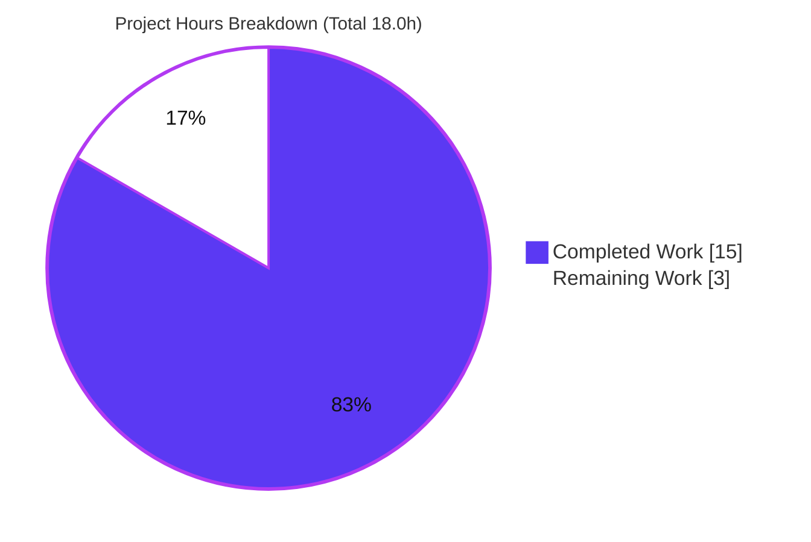
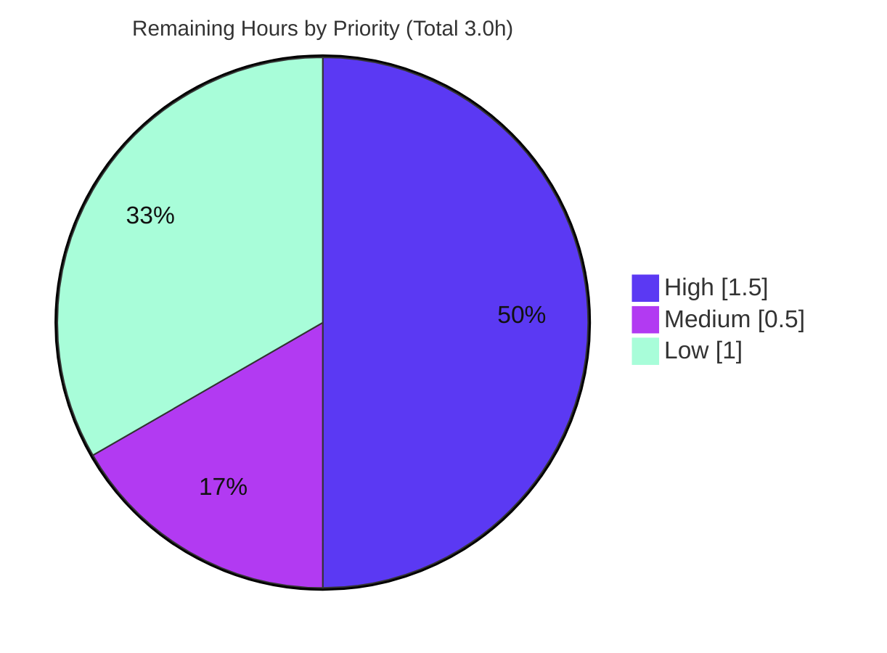
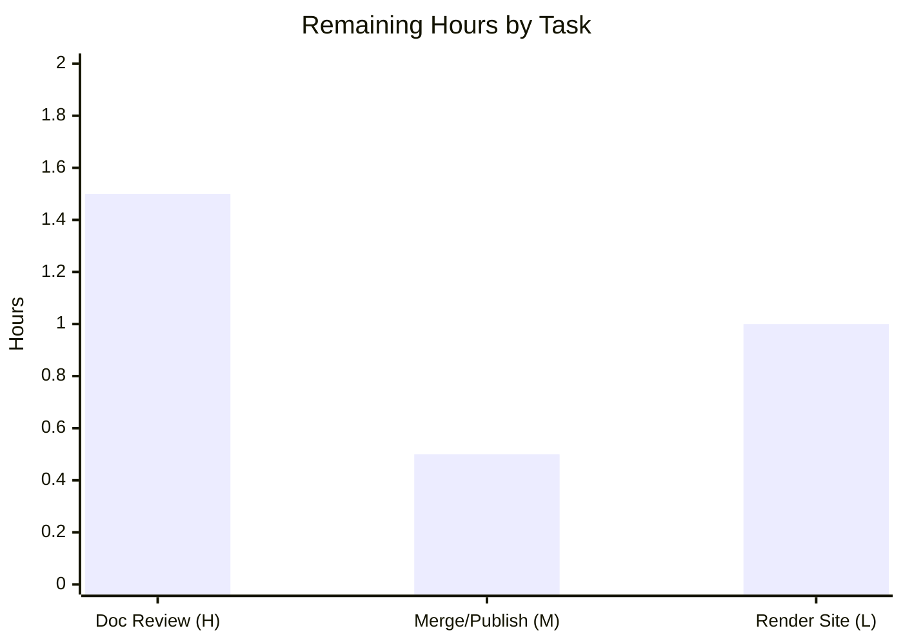

# Blitzy Project Guide — 600K_ParentRepo Documentation

> Comprehensive Python documentation delivery: PEP 257 Google-style docstrings across the application entrypoint and computation library, plus a comprehensive project README (setup, function-level API reference, run/deployment guide, and inline code walkthrough with architecture diagrams).

---

## 1. Executive Summary

### 1.1 Project Overview

This project delivers **complete, source-grounded documentation** for a small Python CLI application (`600K_ParentRepo`). The original request was phrased in JavaScript/Node.js terms (`server.js`, "JSDoc"), but the repository is pure Python with no JavaScript, no `package.json`, and no HTTP surface. The Blitzy platform therefore mapped the intent onto the actual stack: `server.js` → `app.py`, JSDoc → PEP 257 Google-style docstrings, "API documentation" → a function-level reference, and "deployment guide" → a CLI run guide. The deliverables are docstrings added to `app.py` and `service.py` (logic untouched) and a comprehensive `README.md` covering setup, an API/function reference, a run/deployment guide, and an inline code walkthrough with Mermaid diagrams. The target audience is developers cloning and running the program.

### 1.2 Completion Status

The completion percentage is computed using the AAP-scoped, hours-based methodology: **Completed Hours ÷ Total Hours**. All Agent Action Plan (AAP) deliverables are complete and validated; the remaining hours are standard path-to-production activities (human review, merge, optional rendering) that cannot be self-approved by an autonomous agent.


| Metric | Value |
|--------|-------|
| **Total Hours** | 18.0 h |
| **Completed Hours (AI + Manual)** | 15.0 h (15.0 h AI autonomous · 0.0 h manual) |
| **Remaining Hours** | 3.0 h |
| **Percent Complete** | **83.3 %** |

> Color key: **Completed = Dark Blue (#5B39F3)**, **Remaining = White (#FFFFFF)**.

### 1.3 Key Accomplishments

- ✅ **100% docstring coverage** — 3 of 3 public functions (`calculate_total`, `calculate_average`, `main`) and 2 of 2 modules (`app.py`, `service.py`) documented in Google style.
- ✅ **Comprehensive README authored** — a one-line stub (`# app.py`) expanded to a 256-line document with 9 content sections and a Table of Contents.
- ✅ **All four requested topics covered** — Setup (R2), API/Function Reference (R3), Usage & Deployment (R4), and inline Code Walkthrough (R5).
- ✅ **3 Mermaid architecture diagrams** — runtime call flow, nested-submodule composition, and `main()` execution sequence.
- ✅ **Behavior preserved** — logic is docstrings-only; `python app.py` reproduces the exact baseline output (`Total: 100`, the four numbers, `Application completed`); compiles clean.
- ✅ **Fully source-grounded** — 39 `Source:` citations and 10 internal anchors all resolve to valid locations.
- ✅ **Iterated quality** — 4 of the 7 commits are autonomous review/QA corrections (docstring accuracy, README findings, Limitations accuracy).

### 1.4 Critical Unresolved Issues

| Issue | Impact | Owner | ETA |
|-------|--------|-------|-----|
| None | No unresolved issues block release or validation. All AAP deliverables validated production-ready. | — | — |

### 1.5 Access Issues

No access issues identified.

| System/Resource | Type of Access | Issue Description | Resolution Status | Owner |
|-----------------|----------------|-------------------|-------------------|-------|
| Repository (branch `blitzy-010977da-…`) | Git read/write | None — working tree clean, all changes committed | ✅ Resolved | — |
| Third-party services | — | None required (zero external dependencies, no APIs, no credentials) | ✅ N/A | — |

### 1.6 Recommended Next Steps

1. **[High]** Perform a human technical review of the documentation accuracy (README end-to-end, docstrings vs. code, run the example).
2. **[Medium]** Approve the pull request, confirm the 3 Mermaid diagrams render in GitHub's preview, and merge to `main`.
3. **[Low]** *(Optional)* Generate a rendered API docs site with `python -m pydoc -w app service` (zero-install) or `pdoc3`.
4. **[Low]** *(Future enhancement, out of current scope)* Consider extending the same docstring + README treatment to the `ChildRepo` and `NestedChild` submodule tiers (each an independent repository requiring its own PR).

---

## 2. Project Hours Breakdown

### 2.1 Completed Work Detail

| Component | Hours | Description |
|-----------|-------|-------------|
| `app.py` docstrings (module + `main()`) | 1.5 | Module docstring (summary, Run note, expected output) + Google-style `main()` docstring (orchestration, "no arguments", `Returns: None`). Source-cited. |
| `service.py` docstrings (module + 2 functions) | 2.5 | Module docstring + `calculate_total` (Args/Returns/Note) + `calculate_average` (Args/Returns with falsy-input edge case + Raises `TypeError` analysis). |
| README: Overview / Project Structure / Prerequisites / TOC | 1.5 | Purpose & deterministic `Total: 100` behavior, file+submodule structure, Python 3.6+/Git prerequisites, navigable Table of Contents. |
| README: Setup Instructions (R2) | 1.0 | `git clone --recurse-submodules`, submodule init, explicit zero-dependency install path. |
| README: API / Function Reference (R3) | 2.0 | Three function subsections — signatures, parameters, returns, edge cases, usage examples. |
| README: Usage & Deployment Guide (R4) | 1.5 | `python app.py`, verified expected output, "what deployment means here", submodule caveat, `pydoc` usage. |
| README: Code Walkthrough (R5) | 1.5 | Block-by-block narration of `app.py` and `service.py`. |
| README: Architecture Diagrams (3 Mermaid) | 1.0 | Call-flow flowchart, submodule-composition flowchart, `main()` sequence diagram. |
| README: Limitations | 0.5 | Hard-coded input, no error handling, unused `calculate_average`, non-runnable `NestedChild` tier. |
| Autonomous review / QA correction cycles | 1.0 | 4 review/QA commits (docstring accuracy CQS-1/2/3, `calculate_average` correction, README findings, Limitations accuracy QA-1). |
| Validation, behavior preservation & research | 1.0 | `py_compile`, `pyflakes`, runtime baseline diff, doctests, citation/anchor resolution; PEP 257 / tooling research. |
| **Total Completed** | **15.0** | *(matches Completed Hours in Section 1.2)* |

### 2.2 Remaining Work Detail

| Category | Hours | Priority |
|----------|-------|----------|
| Human technical review of documentation accuracy | 1.5 | High |
| PR approval, Mermaid render verification & merge to `main` | 0.5 | Medium |
| *(Optional)* Render API docs HTML site (`pydoc -w` / `pdoc3 0.11.6`) | 1.0 | Low |
| **Total Remaining** | **3.0** | *(matches Remaining Hours in Section 1.2 and Section 7 pie)* |

### 2.3 Hours Reconciliation

- **Completed (2.1)** 15.0 h **+ Remaining (2.2)** 3.0 h **= Total** 18.0 h ✔ (equals Section 1.2 Total).
- **Completion %** = 15.0 ÷ 18.0 = **83.3 %** ✔ (used identically in Sections 1.2, 7, and 8).

---

## 3. Test Results

All results below originate from **Blitzy's autonomous validation logs** for this project and were **independently re-verified** during this assessment (host: Python 3.13.7). No third-party unit-test framework is present — creating a test suite is explicitly out of scope per AAP §0.8 — so verification used compilation checks, static analysis, a functional assertion harness, and README doctests.

| Test Category | Framework | Total Tests | Passed | Failed | Coverage % | Notes |
|---------------|-----------|-------------|--------|--------|-----------|-------|
| Compilation | `py_compile` | 2 | 2 | 0 | 100% of source files | `app.py` + `service.py` parse clean, exit 0 |
| Static Analysis | `pyflakes` | 2 | 2 | 0 | 100% of source files | 0 violations across both modules |
| Functional Verification | Python assertion harness | 6 | 6 | 0 | 100% (3/3 functions) | AAP behavior groups: total, average, empty-input, output baseline, etc. |
| Documentation Doctests | `doctest` | 8 | 8 | 0 | 8/8 README examples | Every interactive README example executed successfully |
| **Total** | — | **18** | **18** | **0** | — | 0 failing, 0 blocked, 0 skipped |

- **Runtime baseline:** `python app.py` output is **byte-exact** vs. the AAP baseline (`Total: 100` / `10` / `20` / `30` / `40` / `Application completed`), exit 0, empty stderr.
- **Function spot-checks (re-verified):** `calculate_total([10,20,30,40]) = 100`, `calculate_total([]) = 0`, `calculate_average([10,20,30,40]) = 25.0`, `calculate_average([]) = 0`.

---

## 4. Runtime Validation & UI Verification

**Runtime Health**
- ✅ **Operational** — `python app.py` runs to completion, exit code 0, empty stderr.
- ✅ **Operational** — Deterministic output matches the documented baseline exactly.
- ✅ **Operational** — `py_compile` and `pyflakes` clean; imports resolve (`from service import calculate_total`).

**Function-Level API Verification** *(the "API" in this project is the public Python function surface — there is no HTTP/REST API)*
- ✅ **Operational** — `calculate_total` returns correct sums, including `0` for empty input.
- ✅ **Operational** — `calculate_average` returns `25.0` for the sample and `0` for falsy input (guarded against `ZeroDivisionError`).
- ✅ **Operational** — `main()` orchestrates and prints as documented.

**UI Verification**
- ⚠ **Not Applicable** — This is a console/CLI program with **no user interface** (no web or GUI surface). No screenshots apply.

**Documentation Rendering**
- ✅ **Operational** — `python -m pydoc app` and `python -m pydoc service` render the new docstrings (NAME/DESCRIPTION).
- ⚠ **Partial (viewer-dependent)** — Mermaid diagrams render natively on GitHub; plain-text/basic Markdown viewers show the fenced source. Documented as expected behavior.

---

## 5. Compliance & Quality Review

Cross-map of AAP deliverables and quality benchmarks to their validated status.

| Benchmark / AAP Deliverable | Requirement | Status | Progress | Notes |
|-----------------------------|-------------|--------|----------|-------|
| R1 — Function/module docstrings | 3/3 functions + 2/2 modules | ✅ Pass | 100% | Google style; `main()` correctly omits Args (takes none) |
| R2 — Setup instructions | Clone + submodules + zero-dep note | ✅ Pass | 100% | `git clone --recurse-submodules`; explicit "no install" |
| R3 — API / function reference | Signatures, params, returns, edge cases | ✅ Pass | 100% | 3 documented functions with usage examples |
| R4 — Deployment / run guide | Run command + expected output + caveats | ✅ Pass | 100% | `python app.py`; submodule & NestedChild caveats |
| R5 — Inline code explanations | Block-by-block walkthrough | ✅ Pass | 100% | Covers `app.py` and `service.py` |
| PEP 257 compliance | Docstring conventions | ✅ Pass | 100% | Triple-quoted, one-line summary + sections |
| Style consistency | Single docstring style | ✅ Pass | 100% | Google style throughout |
| Behavior preservation | No logic change | ✅ Pass | 100% | AST-identical (docstrings stripped); baseline output preserved |
| Source traceability | Cite facts to source | ✅ Pass | 100% | 39 `Source:` citations resolve |
| Internal navigation | Anchors resolve | ✅ Pass | 100% | 10 TOC anchors / 17 internal links resolve |
| Diagram coverage | Required diagrams present | ✅ Pass | 100% | 3 Mermaid diagrams |
| Zero-placeholder policy | No TODO/FIXME/stubs | ✅ Pass | 100% | Only legitimate `<repository-url>` template token |
| Scope discipline | Root repo only | ✅ Pass | 100% | Submodules & `*.csv` untouched |

**Fixes applied during autonomous validation:** docstring-accuracy corrections for `calculate_average` and CQS-1/2/3 in `service.py`; README review findings resolved (added `main()` example, safe `pydoc` commands, source-grounded CSV note); Limitations error-handling accuracy corrected (QA-1).

**Outstanding compliance items:** None. Two cosmetic PEP 8 spacing hints (E302/E305) in `app.py` were **proven pre-existing** and unenforced; correcting them would require whitespace edits that violate the AAP "docstrings-only" constraint, so they were intentionally preserved.

---

## 6. Risk Assessment

| Risk | Category | Severity | Probability | Mitigation | Status |
|------|----------|----------|-------------|------------|--------|
| Documentation drift if source changes later (examples/docstrings go stale) | Technical | Low | Medium (long-term) | 39 `Source:` citations enable traceability; re-verify examples on any code change | Mitigated by design |
| Mermaid diagrams render only in GitHub-compatible viewers | Technical | Low | Low | GitHub renders natively; documented in README | Accepted |
| 2 cosmetic PEP 8 hints (E302/E305) in `app.py` | Technical | Low | N/A (known) | Proven pre-existing & unenforced; preserved per "docstrings-only" constraint | Documented / Accepted |
| No material security exposure | Security | None | N/A | Docs-only change; zero third-party deps; no secrets; no network/HTTP surface | N/A |
| No automated test/CI guards doc-example accuracy over time | Operational | Low | Low | Examples verified at authoring; optional future doctest/CI | Accepted (test suite out of AAP scope) |
| `NestedChild` deepest tier non-runnable (pre-existing circular import) | Operational | Low | N/A | Not introduced here; documented in README Limitations | Documented (AAP forbids fixing) |
| Submodule init required (`--recurse-submodules`) or `ChildRepo/` is empty | Integration | Low | Medium | README Setup documents both clone and `submodule update --init --recursive` | Mitigated |
| Submodule tiers remain undocumented | Integration | Low | Low | Flagged as optional extension (AAP §0.10 A5) | Accepted / Deferred |

**Overall risk posture: LOW.** No high or critical risks; no blocking issues.

---

## 7. Visual Project Status

**Project Hours — Completed vs. Remaining** (Completed = Dark Blue #5B39F3, Remaining = White #FFFFFF)



**Remaining Work by Priority** (accent palette)



**Remaining Hours by Task**



> Integrity check: "Remaining Work" (3.0 h) equals Section 1.2 Remaining Hours and the sum of the Section 2.2 Hours column (1.5 + 0.5 + 1.0 = 3.0 h).

---

## 8. Summary & Recommendations

**Achievements.** Every AAP deliverable is complete and validated. The documentation task translated the JavaScript-flavored request onto the Python repository and produced 100% docstring coverage (3/3 functions, 2/2 modules) plus a comprehensive 256-line README covering all four requested topics — setup, function-level API reference, run/deployment guide, and inline code walkthrough — with 3 Mermaid diagrams and 39 source citations. Logic was never altered: the program still compiles clean and prints the exact `Total: 100` baseline.

**Remaining gaps & critical path.** The project is **83.3% complete** (15.0 h of 18.0 h). The remaining **3.0 h** is entirely path-to-production work that an autonomous agent cannot self-approve: (1) a human technical review of documentation accuracy [High, 1.5 h], (2) PR approval + Mermaid-render verification + merge to `main` [Medium, 0.5 h], and (3) an optional rendered API-docs site [Low, 1.0 h]. There are no defects, no failing tests, and no compilation errors to fix.

**Success metrics.** 18/18 autonomous checks pass (compilation, static analysis, functional verification, doctests); runtime output is byte-exact; all citations and anchors resolve; zero placeholders; scope discipline maintained (submodules and `*.csv` untouched).

**Production-readiness assessment.** The in-scope deliverables are **production-ready today**. After the ~2 h of required human review and merge (Steps 1–2), the documentation can ship. The optional rendering and the submodule-tier extension are enhancements, not blockers.

| Metric | Value |
|--------|-------|
| Completion | 83.3 % (15.0 h / 18.0 h) |
| Autonomous checks passed | 18 / 18 |
| Docstring coverage | 100 % (3/3 functions, 2/2 modules) |
| README topics covered | 4 / 4 requested (+ overview, structure, diagrams, limitations) |
| Overall risk | Low |
| Blocking issues | 0 |

---

## 9. Development Guide

> Every command below was tested on the host (Python 3.13.7, git 2.51.0) and is copy-pasteable. Run all commands from the repository root unless noted.

### 9.1 System Prerequisites

- **Python 3.6+** (AAP verified on 3.12.3; re-verified on 3.13.7). Check: `python3 --version`
- **Git** with submodule support. Check: `git --version`
- No OS-specific requirements; no special hardware.

### 9.2 Environment Setup

- **No virtual environment required** — the project has **zero third-party dependencies** (the only import anywhere is the local `from service import calculate_total`).
- **No environment variables**, **no config files**, **no CLI arguments** — the input list `[10, 20, 30, 40]` is hard-coded in `app.py`.
- **No external services** (no database, cache, or message queue).

### 9.3 Dependency Installation

```bash
# Clone WITH nested submodules
git clone --recurse-submodules <repository-url>
cd 600K_ParentRepo

# If you already cloned without submodules:
git submodule update --init --recursive

# No package installation is required (zero dependencies).
```

### 9.4 Application Startup

```bash
# Run the program (single synchronous CLI process; no ports, no background services)
python app.py
# (python3 app.py also works)
```

### 9.5 Verification Steps

```bash
# 1) Confirm the source parses cleanly (docstrings are inert; guards against indentation errors)
python -m py_compile app.py service.py     # exit 0 expected

# 2) Confirm runtime behavior is unchanged (must match the baseline exactly)
python app.py
# Expected output:
# Total: 100
# 10
# 20
# 30
# 40
# Application completed

# 3) Confirm the public functions directly
python -c "from service import calculate_total, calculate_average; print(calculate_total([10,20,30,40]), calculate_average([10,20,30,40]))"
# Expected: 100 25.0

# 4) Confirm submodule wiring
git submodule status                        # shows the ChildRepo pointer
```

### 9.6 Example Usage — View the New Docstrings

```bash
# Render docstrings to the console (read-only, zero install)
python -m pydoc app
python -m pydoc service

# Optional: generate a static HTML API site
python -m pydoc -w app service              # writes app.html, service.html
# — or with pdoc3 —
pip install pdoc3==0.11.6
pdoc3 --html --output-dir docs app.py service.py
```

### 9.7 Troubleshooting

- **`ModuleNotFoundError: No module named 'service'`** → run from the repository root, where `app.py` and `service.py` reside.
- **`ChildRepo/` is empty** → run `git submodule update --init --recursive`.
- **Running the `ChildRepo/NestedChild` deepest tier fails (circular/failed import)** → this is an **expected, documented limitation** (its `service.py` duplicates the entrypoint). It is intentionally **not** fixed per the AAP; do not treat it as a bug.
- **Mermaid diagrams appear as raw code** → view `README.md` on GitHub (or any Mermaid-aware Markdown viewer), which renders fenced `mermaid` blocks natively.
- **PEP 8 spacing hints (E302/E305) from `pycodestyle`** → cosmetic, pre-existing, and unenforced; intentionally preserved to honor the "docstrings-only" constraint.

---

## 10. Appendices

### Appendix A — Command Reference

| Purpose | Command |
|---------|---------|
| Check Python version | `python3 --version` |
| Check Git version | `git --version` |
| Clone with submodules | `git clone --recurse-submodules <repository-url>` |
| Initialize submodules (post-clone) | `git submodule update --init --recursive` |
| Compile check | `python -m py_compile app.py service.py` |
| Run the program | `python app.py` |
| Static analysis | `python -m pyflakes app.py service.py` |
| View docstrings (console) | `python -m pydoc app` · `python -m pydoc service` |
| Generate HTML docs (stdlib) | `python -m pydoc -w app service` |
| Generate HTML docs (pdoc3) | `pdoc3 --html --output-dir docs app.py service.py` |
| Submodule status | `git submodule status` |

### Appendix B — Port Reference

| Port | Service |
|------|---------|
| — | Not applicable — the program is a single synchronous CLI script; it opens no ports and starts no server. |

### Appendix C — Key File Locations

| Path | Role | Change |
|------|------|--------|
| `README.md` | Comprehensive project documentation | UPDATED (+256 / −1) |
| `app.py` | Application entry point (`main()`) | UPDATED (+40) — docstrings only |
| `service.py` | Computation library (`calculate_total`, `calculate_average`) | UPDATED (+66) — docstrings only |
| `.gitmodules` | Declares the `ChildRepo` submodule | Unchanged |
| `ChildRepo/` | Submodule (independent repo) | Unchanged (pointer `a1c62944`) |
| `.blitzyignore` | Excludes `*.csv` | Unchanged |
| `large.csv` | ~16 MB data file | Ignored (never opened/edited) |

### Appendix D — Technology Versions

| Component | Version | Notes |
|-----------|---------|-------|
| Python | 3.6+ (verified 3.12.3 and 3.13.7) | Standard library only |
| Git | 2.51.0 (host) | Submodule support required |
| Third-party dependencies | None | Zero-dependency posture |
| `pydoc` | Bundled with Python | Optional docstring rendering |
| `pdoc3` | 0.11.6 | Optional HTML generator (PyPI) |
| Mermaid | GitHub-native | No install; renders fenced `mermaid` blocks |

### Appendix E — Environment Variable Reference

| Variable | Purpose |
|----------|---------|
| — | None. The program reads no environment variables and takes no configuration or CLI arguments (input is hard-coded). |

### Appendix F — Developer Tools Guide

- **`pydoc` (recommended, zero-install):** `python -m pydoc <module>` prints docstrings; `python -m pydoc -w <module>` writes HTML. Best fit for this zero-dependency repository.
- **`pdoc3` (optional):** `pip install pdoc3==0.11.6` then `pdoc3 --html --output-dir docs app.py service.py` for a lightweight HTML API site.
- **Mermaid (diagrams):** authored as fenced `mermaid` code blocks; rendered by GitHub with no build step.
- **`py_compile` / `pyflakes`:** fast parse and static checks to confirm docstring additions did not disturb the source.

### Appendix G — Glossary

| Term | Meaning |
|------|---------|
| AAP | Agent Action Plan — the definitive interpretation of the request that governs scope. |
| Docstring | A PEP 257 string literal documenting a module/function; the Python analog of JSDoc. |
| Google style | Docstring convention using `Args:` / `Returns:` / `Raises:` sections. |
| Entry point | `app.py` — the module executed to run the program (`main()`). |
| Computation library | `service.py` — provides `calculate_total` and `calculate_average`. |
| Submodule | A nested, independently versioned Git repository (`ChildRepo`, then `NestedChild`). |
| Path-to-production | Standard activities (review, merge, publish) to ship completed deliverables. |
| Deterministic output | The fixed input always yields `Total: 100` and the same lines. |