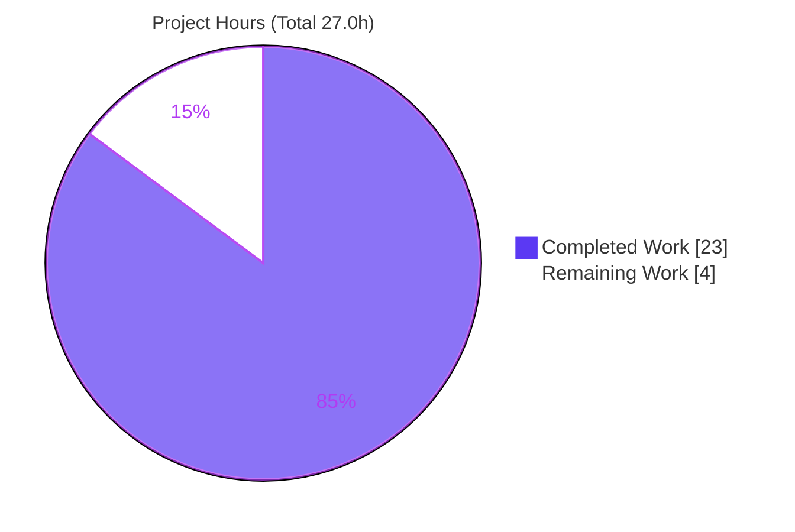
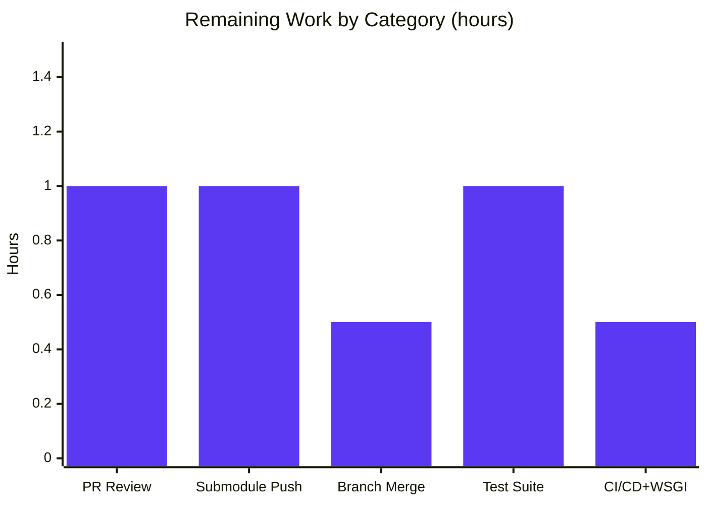

# Blitzy Project Guide — Console-to-Flask Migration Across a 3-Level Submodule Chain

> **Brand legend:** Completed / AI Work = **Dark Blue `#5B39F3`** · Remaining / Not Completed = **White `#FFFFFF`** · Headings / Accents = **Violet-Black `#B23AF2`** · Highlight = **Mint `#A8FDD9`**

---

## 1. Executive Summary

### 1.1 Project Overview

This project migrates a standard-library Python **console program** into a **Python 3 Flask (WSGI) web application**, applied identically across a three-level Git submodule chain: the parent repository `600K_ParentRepo`, its child submodule `600K_ChildRepo`, and the nested leaf submodule `600K_Nested_ChildRepo`. The mandate was strict behavior parity — the HTTP response must reproduce the original stdout output line-for-line. The target users are developers consuming the deterministic `GET /` endpoint. Business impact: modernizes the execution model from a one-shot script into a network-addressable service without altering any computation. Technical scope covers 12 file transformations (9 updates, 3 new manifests) plus resolution of a critical circular-import defect in the nested submodule.

### 1.2 Completion Status

The completion percentage is computed using AAP-scoped, hours-based methodology (PA1): all 12 explicit transformation targets plus supporting and path-to-production work.


| Metric | Hours |
|--------|-------|
| **Total Hours** | **27.0** |
| Completed Hours (AI + Manual) | 23.0 |
| Remaining Hours | 4.0 |
| **Percent Complete** | **85.2%** |

> Formula: `23.0 / (23.0 + 4.0) = 23.0 / 27.0 = 85.2%`. All 12 AAP source-transformation targets are 100% complete and functionally validated; the remaining 4.0 hours are entirely path-to-production (human review, submodule publishing, branch merge, optional hardening).

### 1.3 Key Accomplishments

- ✅ All three console applications migrated to Flask using the **application-factory** pattern (`create_app()`) with a single `GET /` route each.
- ✅ **Behavior parity achieved and verified** — every app returns HTTP 200, `Content-Type: text/plain; charset=utf-8`, and the exact body `Total: 100\n10\n20\n30\n40\nApplication completed` (44 bytes).
- ✅ **Business logic preserved verbatim** — `calculate_total` and `calculate_average` unchanged, including the return-type nuance (`calculate_average([])` returns integer `0`, not `0.0`).
- ✅ **Critical NestedChild defect resolved** — `service.py` (formerly a byte-for-byte duplicate of `app.py` causing an `ImportError` circular-import crash) reconstructed as the canonical computation module.
- ✅ Three `requirements.txt` manifests created, each pinning the verified real release **`Flask==3.1.3`**.
- ✅ **Submodule gitlink integrity verified** across all three levels (Parent→ChildRepo `a92e381`, ChildRepo→NestedChild `dc04a108`); metadata (`.gitmodules` ×2, `.blitzyignore` ×3) retained unchanged; CSV/pycache/venv correctly excluded.
- ✅ Comprehensive per-repository documentation, including a full API/deployment guide in `ChildRepo/README.md`.

### 1.4 Critical Unresolved Issues

| Issue | Impact | Owner | ETA |
|-------|--------|-------|-----|
| NestedChild `blitzy` branch exists locally only (not on its remote) | A fresh `git clone --recursive` cannot resolve the ChildRepo→NestedChild gitlink `dc04a108`; the submodule chain will not fully reproduce until the branch is published | Human (Git admin) | 1.0h |

> No code-level defects remain. All in-scope Python compiles, all applications run, and all 42 autonomous validation checks pass. The single item above is an integration/publishing gap, not a functional bug.

### 1.5 Access Issues

| System/Resource | Type of Access | Issue Description | Resolution Status | Owner |
|-----------------|----------------|-------------------|-------------------|-------|
| `600K_Nested_ChildRepo` remote (GitHub) | Push/write | The `blitzy-fb6658eb-…` branch was created locally during migration but the remote currently exposes only `main`; the branch must be pushed for the gitlink to resolve on clone | Open | Human (Git admin) |
| PyPI (Flask install) | Network egress | The validation host has no internet; a `--without-pip` venv bootstrap workaround was required (documented in §9) | Mitigated (workaround verified) | Human (deployment env) |

> No repository read-permission, credential, or third-party API access issues were identified. The two items above are environment/publishing constraints, both with known resolutions.

### 1.6 Recommended Next Steps

1. **[High]** Review and approve the migration pull request across all three repositories (behavior parity is verified; focus review on submodule linkage). — *1.0h*
2. **[High]** Push the NestedChild `blitzy` branch to its remote and verify a fresh `git clone --recursive` resolves the gitlink `dc04a108`. — *1.0h*
3. **[Medium]** Consolidate/merge the three `blitzy` branches into the canonical branch(es) and re-verify 3-level gitlink integrity post-merge. — *0.5h*
4. **[Low]** Formalize the 42 ad-hoc validation checks into a committed `pytest` suite per repository. — *1.0h*
5. **[Low]** Add a minimal CI workflow and uniform production-WSGI (gunicorn/waitress) guidance across all three repos. — *0.5h*

---

## 2. Project Hours Breakdown

### 2.1 Completed Work Detail

Every component below traces to explicit AAP requirements (Sections 0.2.1 / 0.4.1) or supporting/path-to-production activities performed autonomously.

| Component | Hours | Description |
|-----------|-------|-------------|
| Parent Repository Flask Migration | 4.5 | `app.py` console→Flask factory + `GET /` route (2.0); `service.py` verbatim + docstring (0.5); `README.md` Flask docs (1.5); `requirements.txt` create (0.5) |
| ChildRepo Flask Migration | 6.0 | `app.py` migration with comprehensive docstrings (2.5); `service.py` verbatim (0.5); `README.md` 294-line API/deployment doc (2.5); `requirements.txt` create (0.5) |
| NestedChild Flask Migration + `service.py` Reconstruction | 5.5 | `app.py` migration (2.0); **`service.py` reconstruction to break circular import** (1.5); `README.md` Flask docs (1.5); `requirements.txt` create (0.5) |
| Flask Dependency Research & Version Pinning | 1.0 | Verified latest stable `Flask==3.1.3`, Python ≥3.9 compatibility, transitive dependency set |
| Virtual Environment & Dependency Setup | 1.0 | Shared `.venv`, Flask + transitives installed, `pip check` clean, host `--without-pip` bootstrap resolved |
| Submodule Gitlink Orchestration & Commit Sequencing | 2.0 | Deepest-first commits, gitlink propagation across 3 levels, NestedChild branch creation, integrity verification |
| Metadata Preservation & Scope Enforcement | 0.5 | `.gitmodules` ×2 and `.blitzyignore` ×3 retained unchanged; CSV/pycache/venv excluded |
| Autonomous Validation & Testing | 2.5 | 42 checks (service parity, HTTP behavior, live-server runtime in 2 modes, static compilation) |
| **Total Completed** | **23.0** | Matches Completed Hours in §1.2 |

### 2.2 Remaining Work Detail

Every category is path-to-production; none is an AAP source-transformation gap.

| Category | Hours | Priority |
|----------|-------|----------|
| Human Code Review & PR Approval | 1.0 | High |
| Submodule Remote Publishing (push NestedChild `blitzy` branch) | 1.0 | High |
| Branch Consolidation & Merge to canonical (3 repos) | 0.5 | Medium |
| Automated Test Suite Formalization (commit `pytest` port of validation checks) | 1.0 | Low |
| CI/CD & Production WSGI Hardening (optional) | 0.5 | Low |
| **Total Remaining** | **4.0** | Matches Remaining Hours in §1.2 and §7 |

### 2.3 Hours Reconciliation

| Check | Value | Status |
|-------|-------|--------|
| §2.1 Completed total | 23.0h | ✅ |
| §2.2 Remaining total | 4.0h | ✅ |
| §2.1 + §2.2 | 27.0h = §1.2 Total | ✅ |
| Completion | 23.0 / 27.0 = 85.2% | ✅ |

---

## 3. Test Results

All tests below originate exclusively from Blitzy's autonomous validation execution for this project. **No third-party test framework exists in the repository**, so validation was performed via Flask `test_client`, direct service assertions, live Werkzeug servers, and `py_compile`. Every result was independently re-verified during this assessment.

| Test Category | Framework | Total Tests | Passed | Failed | Coverage % | Notes |
|---------------|-----------|-------------|--------|--------|------------|-------|
| Service-layer parity (Unit) | Python assertions (venv) | 12 | 12 | 0 | 100% (2/2 functions × 3 repos) | `calculate_total([10,20,30,40])==100`, `calculate_total([])==0`, `calculate_average([10,20,30,40])==25.0` (float), `calculate_average([])==0` (int nuance) |
| HTTP route behavior (Integration) | Flask `test_client` | 18 | 18 | 0 | 100% (1/1 route × 3 repos) | status 200, `text/plain; charset=utf-8`, exact body, `url_map==['/']`, `GET /nope`→404, `POST /`→405 |
| Live-server runtime (End-to-End) | Werkzeug + `curl` | 6 | 6 | 0 | 3/3 apps × 2 modes | `flask --app app run` and `python app.py`; all 200 / text-plain / exact body |
| Static compilation | `py_compile` / `-W error` | 6 | 6 | 0 | 100% (6/6 in-scope `.py`) | clean imports, no fatal warnings, no unused imports |
| **Total** | — | **42** | **42** | **0** | **100% functional** | Headline `test_client` suite = 30/30 (12 unit + 18 integration) |

> **Coverage note:** Formal line-coverage tooling (`coverage.py`) was not executed; coverage is expressed functionally (every route and every service function is exercised). Formalizing a committed suite with coverage reporting is Low-priority remaining task HT-4.

---

## 4. Runtime Validation & UI Verification

**Application runtime (all three repositories):**

- ✅ **Operational** — Parent `600K_ParentRepo` Flask app serves `GET /` (verified on live Werkzeug server, port 5055).
- ✅ **Operational** — `ChildRepo` Flask app serves `GET /` (verified live, port 5056).
- ✅ **Operational** — `ChildRepo/NestedChild` Flask app serves `GET /` (verified live, port 5057) — previously crashed on import; now fully functional.

**Endpoint / API verification (`GET /`, each repo):**

- ✅ **Operational** — HTTP `200 OK`.
- ✅ **Operational** — `Content-Type: text/plain; charset=utf-8`, `Content-Length: 44`.
- ✅ **Operational** — Response body byte-exact: `Total: 100\n10\n20\n30\n40\nApplication completed`.
- ✅ **Operational** — `Server: Werkzeug/3.1.8 Python/3.13.7`.

**Error-path verification:**

- ✅ **Operational** — Unknown path (`GET /nope`) → `404 Not Found` (framework default).
- ✅ **Operational** — Disallowed method (`POST /`) → `405 Method Not Allowed` (framework default).
- ✅ **Operational** — URL map contains exactly `['/']` (`static_folder=None` disables the default `/static` route).

**UI verification:**

- ⚠ **Partial (by design)** — There is **no graphical UI**. Per AAP §0.3.4, the sole user-facing surface is the `text/plain` HTTP response, which is fully verified above via `curl` and `test_client`. A prior autonomous run captured `blitzy/screenshots/parent_flask_get_root_200.png` showing the rendered plain-text response. No component library, styling, or interactive elements are in scope.

---

## 5. Compliance & Quality Review

AAP deliverables cross-mapped to quality/compliance benchmarks. Fixes applied during autonomous validation are noted.

| Benchmark / AAP Requirement | Status | Progress | Evidence / Notes |
|-----------------------------|--------|----------|------------------|
| Behavior & output parity (exact 6-line body) | ✅ Pass | 100% | Byte-exact body verified live + `test_client` for all 3 apps |
| `service.py` preserved verbatim (logic unchanged) | ✅ Pass | 100% | Only module docstring added; `calculate_total`/`calculate_average` identical |
| Return-type nuance preserved (`calculate_average([])`→int `0`) | ✅ Pass | 100% | Asserted `type` is `int`, not `float` |
| Flask pinned to verified real release `3.1.3` | ✅ Pass | 100% | All 3 `requirements.txt` byte-identical; `pip check` clean |
| All 12 transformation targets delivered | ✅ Pass | 12/12 | 9 UPDATE + 3 CREATE verified |
| NestedChild circular-import defect resolved | ✅ Pass | 100% | `service.py` reconstructed as canonical module; app runs cleanly |
| Application-factory pattern (`create_app()`) | ✅ Pass | 100% | Present and testable in all 3 apps |
| Direct-run affordance (`if __name__=="__main__": app.run()`) | ✅ Pass | 100% | `python app.py` starts each app |
| Metadata retained unchanged (`.gitmodules`, `.blitzyignore`) | ✅ Pass | 5/5 | Contents confirmed unchanged (`*.csv`) |
| CSV / bytecode / venv excluded | ✅ Pass | 100% | No CSV/pycache/venv committed |
| Per-repository standalone operability | ✅ Pass | 3/3 | Each repo runs independently with its own manifest |
| Submodule gitlink integrity | ✅ Pass | 100% | Parent→ChildRepo & ChildRepo→NestedChild gitlinks MATCH |
| QA fixes applied during validation | ✅ Pass | — | API-STATIC-1 (`static_folder=None`), DOC-F1 (README), QA Issue 2 (docstring byte-parity) all resolved |
| Committed automated test suite | ⚠ Outstanding | 0% | Validation was ad-hoc; formalization deferred to HT-4 (Low) |
| NestedChild branch published to remote | ❌ Outstanding | 0% | Local-only; HT-2 (High) |

---

## 6. Risk Assessment

| Risk | Category | Severity | Probability | Mitigation | Status |
|------|----------|----------|-------------|------------|--------|
| NestedChild `blitzy` branch not on remote → recursive clone cannot resolve gitlink `dc04a108` | Integration | Medium | High | Push branch to `600K_Nested_ChildRepo` remote; verify recursive clone (HT-2) | Open |
| No committed automated test suite (validation ad-hoc) | Technical | Low | Medium | Port 42 checks into `pytest` per repo (HT-4) | Open |
| Dev-server-only (Werkzeug) — not for production traffic | Technical | Low | Low | gunicorn/waitress documented; add uniform guidance (HT-5) | Mitigated (documented) |
| No CI/CD pipeline | Operational | Low | Medium | Add minimal GitHub Actions workflow (HT-5) | Open |
| No Dockerfile / containerization | Operational | Low | Low | Optional; out of AAP scope | Accepted |
| No health-check / monitoring endpoint | Operational | Low | Low | Out of AAP scope for a trivial deterministic app | Accepted |
| 3-level gitlink propagation drift after merge | Integration | Low | Low | Re-verify gitlinks after branch merge (HT-3) | Mitigated (verified locally) |
| Security surface (auth, secrets, injection, XSS) | Security | Low | Low | None applicable — no auth/secrets/user input/DB; static route disabled; Flask 3.1.3 already includes fix GHSA-68rp-wp8r-4726 | Mitigated |

> **Overall risk profile: LOW.** The only above-Low item is the integration/publishing gap (NestedChild branch), which has a clear, quick resolution.

---

## 7. Visual Project Status

**Project hours breakdown** (Completed = Dark Blue `#5B39F3`, Remaining = White `#FFFFFF`):



**Remaining hours by category** (sums to 4.0h — matches §1.2 and §2.2):



| Distribution | Hours | Share |
|--------------|-------|-------|
| Completed Work | 23.0 | 85.2% |
| Remaining Work | 4.0 | 14.8% |
| **Total** | **27.0** | **100%** |

---

## 8. Summary & Recommendations

**Achievements.** The console-to-Flask migration is **functionally complete and validated at 85.2%** of total AAP-scoped effort. All 12 explicit transformation targets — spanning the parent repository and both submodules — are delivered, compile cleanly, and serve the byte-exact required output over HTTP. The most consequential engineering win was diagnosing and repairing the NestedChild circular-import defect (a `service.py` that was a byte-for-byte duplicate of `app.py`), which transformed a previously non-functional submodule into a fully working Flask application identical to its siblings. Behavior parity is exact, including the subtle integer-vs-float return-type nuance of `calculate_average`.

**Remaining gaps.** The 4.0 remaining hours are exclusively path-to-production: human PR review, publishing the local-only NestedChild branch, consolidating branches, and optional test-suite/CI hardening. There are **no outstanding code defects**.

**Critical path to production.** (1) Review & approve → (2) push the NestedChild branch (the one true release blocker for clean recursive cloning) → (3) merge branches and re-verify gitlinks. Steps 4–5 (test suite, CI/CD) are recommended hardening but not release-blocking.

**Success metrics.** 42/42 autonomous validation checks pass (100%); 6/6 in-scope Python files compile; 3/3 applications operational; gitlink integrity verified at all 3 levels; zero unresolved errors.

**Production-readiness assessment.** **Ready for human review and staged release.** The application is stateless, deterministic, and dependency-minimal (single pinned dependency). Recommended posture: publish the NestedChild branch immediately, then deploy behind a production WSGI server (gunicorn/waitress) rather than the Werkzeug dev server.

| Metric | Value |
|--------|-------|
| AAP-scoped completion | 85.2% |
| AAP transformation targets delivered | 12 / 12 |
| Autonomous validation checks passing | 42 / 42 |
| Applications operational | 3 / 3 |
| Unresolved code defects | 0 |
| Release-blocking items | 1 (publish NestedChild branch) |

---

## 9. Development Guide

### 9.1 System Prerequisites

- **Python 3.9+** (project targets 3.12; verified on CPython **3.13.7**).
- **Git** with submodule support (**Git LFS** recommended for the chain).
- **pip** and the `venv` module.
- ~50 MB free disk for the virtual environment and Flask.
- Network access to PyPI for the initial install (see troubleshooting if unavailable).

### 9.2 Environment Setup

Clone the full submodule chain, then create a virtual environment at the parent root (shared by all three repos):

```bash
# 1. Clone with all submodules (parent -> ChildRepo -> NestedChild)
git clone --recursive <parent-repo-url> 600K_ParentRepo
cd 600K_ParentRepo

# If already cloned without --recursive:
git submodule update --init --recursive

# 2. Create the virtual environment
python3 -m venv .venv
source .venv/bin/activate
```

> **Clean-environment note (verified on this host):** `python3 -m venv .venv` may fail while bootstrapping pip (`ensurepip … returned non-zero exit status 1`). If so, create the venv without pip and bootstrap tooling externally:
>
> ```bash
> python3 -m venv .venv --without-pip
> python3 -m pip --python .venv/bin/python install --upgrade pip setuptools wheel
> ```

### 9.3 Dependency Installation

```bash
# From any repo root (parent, ChildRepo, or ChildRepo/NestedChild)
.venv/bin/python -m pip install -r requirements.txt

# Verify (expected: Version: 3.1.3  and  "No broken requirements found.")
.venv/bin/python -m pip show flask
.venv/bin/python -m pip check
```

The parent `.venv` is the shared environment for all three repositories; each `requirements.txt` is byte-identical (`Flask==3.1.3`).

### 9.4 Application Startup

Run from the repository you want to serve (parent, `ChildRepo`, or `ChildRepo/NestedChild`):

```bash
# Option A — direct run (Werkzeug dev server on 127.0.0.1:5000)
.venv/bin/python app.py

# Option B — Flask CLI (supports a custom port for parallel runs)
.venv/bin/flask --app app run              # default port 5000
.venv/bin/flask --app app run --port 5001  # e.g. run several apps side by side
```

### 9.5 Verification Steps

```bash
# With a server running, request the single endpoint:
curl -s http://127.0.0.1:5000/
```

Expected output (exactly six lines, 44 bytes):

```text
Total: 100
10
20
30
40
Application completed
```

Header/behavior checks:

```bash
curl -s -i http://127.0.0.1:5000/ | head -5   # 200 OK; Content-Type: text/plain; charset=utf-8
curl -s -o /dev/null -w "%{http_code}\n" http://127.0.0.1:5000/nope   # 404
curl -s -o /dev/null -w "%{http_code}\n" -X POST http://127.0.0.1:5000/   # 405
```

### 9.6 Example Usage

```bash
# Serve all three apps simultaneously on distinct ports (from parent root):
.venv/bin/flask --app app run --port 5000 &                    # parent
( cd ChildRepo && ../.venv/bin/flask --app app run --port 5001 & )
( cd ChildRepo/NestedChild && ../../.venv/bin/flask --app app run --port 5002 & )

curl -s http://127.0.0.1:5000/   # parent   -> Total: 100 ...
curl -s http://127.0.0.1:5001/   # child    -> Total: 100 ...
curl -s http://127.0.0.1:5002/   # nested   -> Total: 100 ...
```

### 9.7 Troubleshooting

| Symptom | Cause | Resolution |
|---------|-------|------------|
| `ensurepip … non-zero exit status 1` on `venv` creation | Host quirk (in-venv ensurepip fails) | Use `python3 -m venv .venv --without-pip` then bootstrap pip externally (see §9.2) |
| `Address already in use` on startup | Port 5000 occupied | Start with `flask --app app run --port <N>` |
| Submodule directories empty after clone | Cloned without `--recursive` | `git submodule update --init --recursive` |
| Recursive clone fails to fetch NestedChild commit `dc04a108` | NestedChild `blitzy` branch not published to its remote | Push the branch (remaining task **HT-2**), then re-clone |
| `ImportError: cannot import name 'calculate_total'` | Legacy NestedChild defect (pre-migration) | Already resolved — `service.py` is the canonical module on the migrated branch |

### 9.8 Production Note

Do **not** use the Werkzeug development server in production. Serve the module-level `app` (or the `create_app` factory) with a dedicated WSGI server — these are intentionally **not** in `requirements.txt`:

```bash
pip install gunicorn && gunicorn --bind 0.0.0.0:8000 --workers 4 "app:app"
# or
pip install waitress && waitress-serve --host 0.0.0.0 --port 8000 --call app:create_app
```

---

## 10. Appendices

### Appendix A — Command Reference

| Purpose | Command |
|---------|---------|
| Init submodules | `git submodule update --init --recursive` |
| Create venv (fallback) | `python3 -m venv .venv --without-pip` |
| Bootstrap pip | `python3 -m pip --python .venv/bin/python install --upgrade pip setuptools wheel` |
| Install deps | `.venv/bin/python -m pip install -r requirements.txt` |
| Verify Flask | `.venv/bin/python -m pip show flask` |
| Dependency health | `.venv/bin/python -m pip check` |
| Run (direct) | `.venv/bin/python app.py` |
| Run (CLI, custom port) | `.venv/bin/flask --app app run --port <N>` |
| Compile-check | `.venv/bin/python -m py_compile app.py service.py` |
| Smoke test | `curl -s http://127.0.0.1:5000/` |
| Verify gitlink | `git ls-tree HEAD ChildRepo` |

### Appendix B — Port Reference

| Port | Usage |
|------|-------|
| 5000 | Default Werkzeug dev server (`python app.py` / `flask run`) |
| 5001–5002 | Suggested ports for running child/nested apps in parallel |
| 8000 | Suggested production WSGI (gunicorn/waitress) port |

### Appendix C — Key File Locations

| Path | Role |
|------|------|
| `app.py`, `ChildRepo/app.py`, `ChildRepo/NestedChild/app.py` | Flask applications (factory + `GET /`) |
| `service.py`, `ChildRepo/service.py`, `ChildRepo/NestedChild/service.py` | Business logic (`calculate_total`, `calculate_average`) |
| `requirements.txt` (×3) | Dependency manifest — `Flask==3.1.3` |
| `README.md` (×3) | Per-repo Flask usage documentation |
| `.gitmodules` (parent, ChildRepo) | Submodule wiring (retained unchanged) |
| `.blitzyignore` (×3) | Ignore rules — `*.csv` (retained unchanged) |
| `large.csv` (×3) | **Excluded** data (~16 MB each) — never read/edited |

### Appendix D — Technology Versions

| Component | Version |
|-----------|---------|
| Python (runtime verified) | 3.13.7 (targets 3.12; requires ≥3.9) |
| Flask | 3.1.3 (pinned) |
| Werkzeug | 3.1.8 |
| Jinja2 | 3.1.6 |
| MarkupSafe | 3.0.3 |
| ItsDangerous | 2.2.0 |
| Click | 8.4.2 |
| Blinker | 1.9.0 |

### Appendix E — Environment Variable Reference

| Variable | Required | Notes |
|----------|----------|-------|
| — | None | The application is fully deterministic and reads **no** environment variables, configuration, secrets, or request parameters. `FLASK_APP=app` is optional (the CLI auto-detects the module-level `app`). |

### Appendix F — Developer Tools Guide

| Tool | Use |
|------|-----|
| `py_compile` | Static syntax/compile validation of in-scope `.py` files |
| Flask `test_client` | Route/response testing without a live server |
| `curl` | Live endpoint verification (`GET /`, 404, 405) |
| `pip check` | Transitive dependency conflict detection |
| `git ls-tree` / `git submodule status --recursive` | Gitlink and submodule integrity verification |

### Appendix G — Glossary

| Term | Definition |
|------|------------|
| Application Factory | The `create_app()` function that builds and returns the configured Flask instance |
| Gitlink | A submodule reference: the specific commit SHA a parent repo pins for a submodule |
| WSGI | Web Server Gateway Interface — the Python web-app/server contract Flask implements |
| Behavior parity | The migrated HTTP output matches the original stdout output line-for-line |
| Circular import | The pre-migration NestedChild defect where `service.py` imported from itself, crashing on startup |
| Path-to-production | Standard deployment activities (review, publish, merge, CI) beyond source transformation |