# Technical Specification

# 1. Introduction

## 1.1 Executive Summary

#### Project Overview

This repository is a **minimal Python console application** that demonstrates the computation and display of a numeric total over a fixed list of integers. The application logic is deliberately small: a reusable computation module (`service.py`) exposes two pure functions — `calculate_total` and `calculate_average` — and an executable entry point (`app.py`) sums a hard-coded list `[10, 20, 30, 40]` and prints the result to standard output. Running the root application produces the deterministic output `Total: 100`, followed by each number on its own line and the trailing line `Application completed`.

The distinguishing structural characteristic of the project is not its logic but its **composition as a three-level chain of Git submodules**. The root repository links a child submodule (`ChildRepo/`), which in turn links a further nested submodule (`ChildRepo/NestedChild/`). Each level restates a near-identical copy of the same console application, so the repository as a whole reads as a demonstration/reference artifact for modular code separation and nested Git submodule linkage rather than as a domain- or market-facing product.

The table below summarizes the factual profile of the system as observed directly in the codebase.

| Attribute | Observed Finding |
|-----------|------------------|
| Application type | Command-line/console script (no UI, no server, no API) |
| Primary language | Python (executed successfully under Python 3.12.3) |
| Public logic surface | `calculate_total(numbers)` and `calculate_average(numbers)` in `service.py` |
| Repository composition | Parent repo + 2 linked Git submodules (`ChildRepo` → `NestedChild`) |
| External dependencies | None — standard library only; the only import is the local `service` module |
| Persistence / network / I/O | None beyond writing to standard output |
| Total in-scope Python source | 6 files, 92 lines total |
| Tests / CI / build tooling | None present in the repository |

#### Core Business Problem Being Solved

The repository does **not** encode a commercial or domain business problem; no business rules, monetization logic, regulated data, or end-user features are present anywhere in the source. Instead, the codebase addresses a narrow, illustrative technical concern: **separating reusable computation from an executable driver** and **composing repositories through nested Git submodules**. The `service.py` module isolates the arithmetic (accumulating a running total, and dividing that total by the element count for an average), while `app.py` acts as a thin orchestration layer that supplies fixed input data, invokes the computation, and renders results to the console. This clean separation between a computation library and its entry point is the central pattern the project exemplifies.

#### Key Stakeholders and Users

No user roles, authentication, authorization, personas, or access tiers are defined anywhere in the repository — there is no configuration, identity handling, or multi-user surface. Accordingly, the stakeholders below are inferred from the repository's structure and execution model rather than from any explicit specification in the code.

| Stakeholder / User | Interest in the System | Basis in Repository |
|--------------------|------------------------|---------------------|
| Developers / maintainers | Read, run, and extend the computation and submodule structure | Source in `app.py`, `service.py`; submodule config in `.gitmodules` |
| Operators of the CLI | Execute the script to obtain the printed total | `if __name__ == "__main__"` guard in `app.py` invoking `main()` |
| Consumers of the submodule chain | Integrate or clone the parent and its nested submodules | `.gitmodules` at root and in `ChildRepo/` |

#### Expected Business Impact and Value Proposition

Because the project is a small demonstration/reference implementation and not a revenue- or operations-bearing system, its value proposition is **structural and pedagogical rather than commercial**. The repository provides a concrete, runnable example of (1) modular Python design that decouples a computation module from its console entry point, and (2) a multi-level Git submodule topology in which a parent repository nests child and grandchild repositories. No throughput, revenue, cost-reduction, or service-level targets are stated or implied in the source, and none should be inferred. Notably, while the root and first-level applications run successfully, the deepest submodule level is currently **non-functional** because its `service.py` was replaced with a duplicate of `app.py`, producing a circular-import failure — a defect documented in Section 1.2 that materially bounds the value delivered at that level.

## 1.2 System Overview

This section describes the context in which the system exists, a high-level description of its capabilities and components, and the criteria by which its correct operation can be verified. All statements are grounded in the repository's source files and confirmed runtime behavior.

### 1.2.1 Project Context

#### Business Context and Market Positioning

The repository has **no commercial or market positioning encoded in its source**. There is no product configuration, branding, pricing, customer data, or domain model — the three `README.md` files contain only single-line titles (`# app.py`, `# 600K_ChildRepo`, `# 600K_Nested_ChildRepo`) and provide no usage, setup, or product framing. The project is best characterized as a **demonstration/reference implementation** whose purpose is to illustrate a simple modular computation and a nested Git submodule composition, rather than to serve an end market.

#### Current System Limitations

Because this documentation describes an existing repository, the following limitations are observed directly in the code as-is. They are relevant context for any team intending to build on the project.

| Limitation | Observed Evidence |
|------------|-------------------|
| Deepest submodule is broken | `ChildRepo/NestedChild/service.py` is a byte-for-byte duplicate of `app.py`; running `ChildRepo/NestedChild/app.py` raises `ImportError: cannot import name 'calculate_total' from partially initialized module 'service'` |
| Code duplication across levels | Root and `ChildRepo` `app.py`/`service.py` are byte-identical; there is no shared/packaged reuse — each level restates the code |
| Hard-coded input | `main()` operates on a fixed list `[10, 20, 30, 40]`; no arguments, stdin, files, or configuration drive the computation |
| Unused capability | `calculate_average` is defined in `service.py` but never invoked by any `app.py` (only `calculate_total` is imported) |
| No robustness features | No exception handling, input validation, logging, or type annotations exist in any module |
| No quality gates | No tests, CI configuration, linting, build, or packaging tooling exist anywhere in the repository |

#### Integration with the Existing Enterprise Landscape

The system performs **no external integration**. There are no network calls, databases, message queues, file I/O, environment-variable reads, or third-party libraries — the only import statement in the codebase is the local `from service import calculate_total`, and the sole observable side effect is writing to standard output. The single integration mechanism present is **Git submodule linkage**: the root `.gitmodules` links `ChildRepo` (remote `https://github.com/lakshya-blitzy/600K_ChildRepo.git`) and `ChildRepo/.gitmodules` links `NestedChild` (remote `https://github.com/lakshya-blitzy/600K_Nested_ChildRepo.git`).

### 1.2.2 High-Level Description

#### Primary System Capabilities

The functional surface of the system is intentionally narrow and is provided by the `service.py` computation module together with the `app.py` driver:

- **Total computation** — `calculate_total(numbers)` accumulates a running sum starting from `0` and returns it (returning `0` for an empty iterable).
- **Average computation** — `calculate_average(numbers)` returns `0` for a falsey input, otherwise returns `calculate_total(numbers) / len(numbers)`.
- **Result rendering** — `main()` in `app.py` prints the computed total as `Total: {total}`, prints each input number on its own line, and prints `Application completed`.

The root and first-level applications are **deterministic**: given the fixed input `[10, 20, 30, 40]`, they always produce `Total: 100` followed by the four numbers and the completion line, exiting successfully.

#### Major System Components

| Component | File(s) | Responsibility |
|-----------|---------|----------------|
| Console entry point / driver | `app.py` (root, `ChildRepo`, `NestedChild`) | Provide fixed input, invoke `calculate_total`, and print results to stdout under a `__main__` guard |
| Computation module | `service.py` (root, `ChildRepo`) | Expose the pure functions `calculate_total` and `calculate_average` |
| Submodule linkage | `.gitmodules` (root, `ChildRepo`) | Declare nested submodule paths and remote URLs |
| Documentation | `README.md` (each level) | Single-line title identification only |

The following diagram shows the repository's component and submodule topology, including the defect at the deepest level.

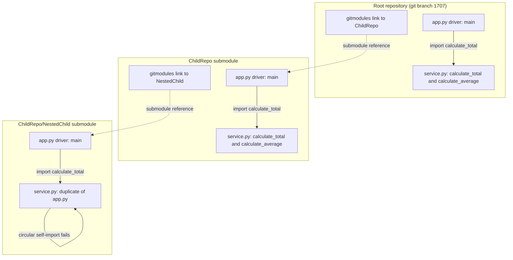
```mermaid
flowchart TD
    subgraph Root["Root repository (git branch 1707)"]
        RGit["gitmodules link to ChildRepo"]
        RApp["app.py driver: main"]
        RSvc["service.py: calculate_total and calculate_average"]
        RApp -->|import calculate_total| RSvc
    end
    subgraph Child["ChildRepo submodule"]
        CGit["gitmodules link to NestedChild"]
        CApp["app.py driver: main"]
        CSvc["service.py: calculate_total and calculate_average"]
        CApp -->|import calculate_total| CSvc
    end
    subgraph Nested["ChildRepo/NestedChild submodule"]
        NApp["app.py driver: main"]
        NSvc["service.py: duplicate of app.py"]
        NApp -->|import calculate_total| NSvc
        NSvc -->|circular self-import fails| NSvc
    end
    RGit -.->|submodule reference| CApp
    CGit -.->|submodule reference| NApp
```

#### Core Technical Approach

The implementation follows a straightforward **procedural, standard-library-only Python** approach:

- **Separation of concerns** — pure, side-effect-free computation is isolated in `service.py`, while all I/O (printing) is confined to `main()` in `app.py`.
- **Module import model** — `app.py` uses `from service import calculate_total`, resolving `service` from the script's own directory; the code therefore expects to be run from the directory that contains a valid `service.py`.
- **Safe importability** — the `if __name__ == "__main__": main()` guard lets `app.py` be imported without executing the workflow, while still running when invoked directly.
- **Composition via submodules** — rather than sharing a package, reuse across levels is expressed by nesting whole repositories as Git submodules.

### 1.2.3 Success Criteria

#### Measurable Objectives

The repository defines **no explicit objectives, targets, or acceptance thresholds** in any file. In the absence of stated goals, the table below records the observable, verifiable behavioral criteria that follow directly from the code and confirmed execution. These are reported as facts about the current state, not as invented targets.

| Objective (verifiable) | Signal | Observed Status |
|------------------------|--------|-----------------|
| Root application executes correctly | Prints `Total: 100`, the four numbers, and `Application completed`; exit code 0 | Verified |
| `ChildRepo` application executes correctly | Identical successful output; exit code 0 | Verified |
| `NestedChild` application executes correctly | Should print a total | Not met — raises `ImportError` (circular import); exit code 1 |
| Output determinism | Fixed input yields a constant result across runs | Verified |

#### Critical Success Factors

The factors that determine whether a given level of the project operates correctly, as evidenced by the source, are: (1) the presence of a valid `service.py` that actually defines `calculate_total` on the import path (the factor violated at the `NestedChild` level); (2) invocation from the directory containing that `service.py` so the top-level import resolves; and (3) consistency of the duplicated sources across submodule levels (currently broken because `NestedChild/service.py` diverged into a copy of `app.py`).

#### Key Performance Indicators (KPIs)

**No KPIs are defined in the repository.** There are no service-level objectives, throughput/latency targets, error-budget definitions, monitoring, metrics, or performance instrumentation present in any file. Consequently, no KPIs can be reported without fabrication, and none are asserted here.

## 1.3 Scope

This section defines what the system, as it exists in the repository, does and does not include. The in-scope items are drawn from observed source and verified behavior; the out-of-scope items enumerate capabilities that are demonstrably absent so that consumers do not assume functionality the code does not provide.

### 1.3.1 In-Scope

#### Core Features and Functionalities

**Must-have capabilities (present and verified).**

| Capability | Where Implemented | Behavior |
|------------|-------------------|----------|
| Sum a list of numbers | `service.py` → `calculate_total` | Accumulates from `0`; returns the total (`0` for empty input) |
| Average a list of numbers | `service.py` → `calculate_average` | Returns `0` for falsey input; else `calculate_total / len` |
| Print total and elements | `app.py` → `main()` | Prints `Total: {total}`, each number, then `Application completed` |

**Primary user workflow.** A single workflow exists: from a directory containing a valid `service.py`, run the entry point (`python app.py` / `python3 app.py`); `main()` computes the total of the fixed list `[10, 20, 30, 40]` and writes the results to standard output. This workflow is verified for the root repository and the `ChildRepo` level (both print `Total: 100` and exit successfully).

**Essential integrations.** The only integration in scope is **Git submodule composition** — the root repository links `ChildRepo`, and `ChildRepo` links `NestedChild`, via their respective `.gitmodules` files and recorded remote URLs.

**Key technical requirements.** A Python 3 interpreter is required (the source uses f-strings, which require Python 3.6+; execution was verified on Python 3.12.3). No dependency manifest or version pin is present, and no third-party packages are needed — the standard library suffices. The top-level `from service import calculate_total` requires that execution occur from a directory whose `service.py` actually defines `calculate_total`.

#### Implementation Boundaries

| Boundary Dimension | In-Scope Definition (as observed) |
|--------------------|-----------------------------------|
| System boundary | A single, short-lived local Python process that writes only to standard output — no server, service, UI, or API |
| User groups covered | Developers/operators who run the CLI directly; no roles, identities, or access tiers exist in the code |
| Geographic / market coverage | None — no localization, regionalization, time zones, currencies, or market targeting appear in any file |
| Data domains included | A single in-memory list of integers (`[10, 20, 30, 40]`); the domain is generic numeric aggregation with no external or persisted data |

### 1.3.2 Out-of-Scope

#### Explicitly Excluded Features and Capabilities

The following capabilities are **not implemented anywhere in the repository** and must not be assumed to exist:

| Excluded Area | Evidence of Absence |
|---------------|---------------------|
| Data persistence (databases, files) | No file I/O or storage code; the only side effect is `print` to stdout |
| Networking / APIs / web / messaging | No sockets, HTTP clients/servers, or message-queue code; no third-party imports |
| Graphical or web user interface | Console output only |
| Authentication / authorization | No identity, credentials, roles, or access control anywhere |
| Configuration / parameterization | No CLI arguments, environment variables, or config files; input is hard-coded |
| Logging, monitoring, metrics | No logging framework, instrumentation, or telemetry |
| Error handling / input validation | No `try`/`except`, type checks, or validation in any module |
| Concurrency / async | All code is synchronous and single-threaded |

#### Future-Phase Considerations

The repository defines **no roadmap, backlog, or planned phases** — no such documentation exists in any file. The items below are candidate remediation activities implied directly by the defects and gaps observed in Section 1.2; they are recorded as logically out-of-scope for the current state, not as committed future work: (1) repairing `ChildRepo/NestedChild/service.py` so it re-supplies `calculate_total`/`calculate_average` instead of duplicating `app.py`; (2) eliminating cross-level source duplication in favor of a shared/packaged module; and (3) exercising the currently unused `calculate_average` capability from a driver.

#### Integration Points Not Covered

No integrations exist beyond Git submodule linkage. Specifically out of scope are database connectivity, external/third-party services, cloud platforms, CI/CD pipelines, container runtimes, and package registries — none of these are configured or referenced in the repository.

#### Unsupported Use Cases

The following use cases are unsupported by the code as written: running the `NestedChild` application (it fails with a circular-import `ImportError`); processing dynamic, user-supplied, or externally sourced input (the input list is fixed); executing `app.py` from a working directory that does not contain a valid `service.py` (the top-level import would fail to resolve); and obtaining an average result from any `app.py` (only `calculate_total` is imported and invoked).

## 1.4 References

The following repository artifacts were inspected as evidence for this Introduction. Runtime behavior, byte-equivalence (md5), Python version, Git history, and submodule status were additionally verified by executing the applications and Git tooling directly against the checkout.

#### Files Examined

- `app.py` — root console entry point; established the fixed input `[10, 20, 30, 40]`, the `calculate_total` invocation, the printed output, and the `__main__` guard.
- `service.py` — root computation module; established the `calculate_total` and `calculate_average` function behavior.
- `README.md` — root documentation; established the single-line title `# app.py` and absence of setup/usage docs.
- `.gitmodules` — root submodule configuration; established the `ChildRepo` link and its remote URL.
- `ChildRepo/app.py` — established byte-identical driver logic at the first submodule level.
- `ChildRepo/service.py` — established byte-identical computation logic at the first submodule level.
- `ChildRepo/README.md` — established the single-line title `# 600K_ChildRepo`.
- `ChildRepo/.gitmodules` — established the `NestedChild` link and its remote URL.
- `ChildRepo/NestedChild/app.py` — established byte-identical driver logic at the deepest level.
- `ChildRepo/NestedChild/service.py` — established the critical defect: a byte-for-byte duplicate of `app.py` causing the circular-import failure.
- `ChildRepo/NestedChild/README.md` — established the single-line title `# 600K_Nested_ChildRepo`.
- `.blitzyignore` (root, `ChildRepo/`, `ChildRepo/NestedChild/`) — established the ignore rule `*.csv`; the `large.csv` files at each level were consequently excluded from inspection.

#### Folders Examined

- `` (repository root) — established top-level structure and the parent of the submodule chain.
- `ChildRepo/` — established the first-level submodule contents.
- `ChildRepo/NestedChild/` — established the deepest submodule contents (the leaf; no `.gitmodules`).

#### Web Sources

- None. No external sources were required; all findings are grounded in the repository and its verified runtime behavior.

# 2. Product Requirements

## 2.1 Feature Catalog

This section decomposes the repository into discrete, testable features. Because the repository contains **no product, requirements, or design documentation** — the three `README.md` files hold only single-line titles (`# app.py`, `# 600K_ChildRepo`, `# 600K_Nested_ChildRepo`) — every feature and requirement below has been reverse-engineered from the observed source and its confirmed runtime behavior. The system is a minimal, standard-library-only Python console application replicated across a three-level Git submodule chain, as established in Section 1.2 (System Overview) and Section 1.3 (Scope). No business rules, monetization, regulated data, network, persistence, or user-management surface exists anywhere in the code; the features therefore describe a computation library, a console driver, and a repository-composition mechanism only.

**Requirements baseline:** v1.0, derived from Git branch `1707` of the parent repository and its linked submodules. Because no versioning metadata is declared in any manifest (none exists), the baseline is anchored to the observed branch and source state at inspection time.

**Feature inventory.** Four discrete features are evident in the repository:

| Feature ID | Feature Name | Priority | Status |
|------------|--------------|----------|--------|
| F-001 | Numeric List Summation (`calculate_total`) | Critical | Completed |
| F-002 | Arithmetic Mean Computation (`calculate_average`) | Low | Completed (defined, not integrated) |
| F-003 | Console Application Orchestration & Result Rendering (`app.py` `main`) | Critical | Completed (root & `ChildRepo`; `NestedChild` instance non-functional) |
| F-004 | Nested Git Submodule Composition (`.gitmodules`) | Medium | Completed (structural) |

**Global assumptions.** (A-1) Requirements are inferred from source and verified execution, not from any stated specification. (A-2) A `Status` of *Completed* means the code is present and, where noted, was observed to run; it does **not** imply any automated test coverage — no tests exist in the repository. (A-3) Priority reflects each feature's importance to the system's own single runnable workflow (computing and printing the total), since no external business drivers are encoded.

**Global constraints.** (C-1) The code is pure Python standard library and requires a Python 3 interpreter supporting f-strings (Python 3.6+); execution was verified on Python 3.12.3. (C-2) Execution must occur from a directory containing a valid `service.py` that defines `calculate_total`. (C-3) Input is hard-coded as `[10, 20, 30, 40]`; there are no arguments, environment variables, stdin, or configuration files. (C-4) There is no exception handling, input validation, logging, or type annotation in any module. (C-5) The deepest submodule level (`ChildRepo/NestedChild/`) is non-functional because its `service.py` is a byte-for-byte duplicate of `app.py`.

### 2.1.1 F-001: Numeric List Summation

#### Feature Metadata

| Attribute | Value |
|-----------|-------|
| Unique ID | F-001 |
| Feature Name | Numeric List Summation (`calculate_total`) |
| Feature Category | Core Computation / Business Logic |
| Priority Level | Critical |
| Status | Completed |

#### Description

**Overview.** A pure function `calculate_total(numbers)` defined in `service.py` initializes an accumulator to `0`, iterates the input with `for number in numbers: total += number`, and returns the accumulated sum. An empty iterable yields `0`.

**Business Value.** This function produces the single numeric result the application exists to display (`Total: 100`). It is the computational core around which the entire demonstration and its submodule replication are organized.

**User Benefits.** Deterministic, repeatable, side-effect-free summation of a list of numbers — the same input always produces the same output.

**Technical Context.** Defined identically in root `service.py` and `ChildRepo/service.py` (md5 `12093c1…`). It is **absent** from `ChildRepo/NestedChild/service.py`, whose contents are a duplicate of `app.py`. The function uses no imports and no external state; it is consumed by the driver via `from service import calculate_total`.

#### Dependencies

| Dependency Type | Detail |
|-----------------|--------|
| Prerequisite Features | None — this is a leaf computation with no internal feature dependencies |
| System Dependencies | Python 3 interpreter; the local `service` module must be resolvable on the import path |
| External Dependencies | None — standard library only; zero third-party packages |
| Integration Requirements | Consumed by F-003 (`app.py`) through the module-level import `from service import calculate_total` |

### 2.1.2 F-002: Arithmetic Mean Computation

#### Feature Metadata

| Attribute | Value |
|-----------|-------|
| Unique ID | F-002 |
| Feature Name | Arithmetic Mean Computation (`calculate_average`) |
| Feature Category | Core Computation / Business Logic |
| Priority Level | Low |
| Status | Completed (defined; not integrated into any driver) |

#### Description

**Overview.** A pure function `calculate_average(numbers)` defined in `service.py` returns `0` when the input is falsey (`if not numbers: return 0`) and otherwise returns `calculate_total(numbers) / len(numbers)`.

**Business Value.** It demonstrates library extensibility — a second reusable computation co-located in the service module — but delivers no observable value in the current workflow because no entry point invokes it.

**User Benefits.** Computes the arithmetic mean of a numeric list, with an empty-input guard that avoids a `ZeroDivisionError`. Returns a floating-point value for non-empty input (e.g., `25.0` for `[10, 20, 30, 40]`).

**Technical Context.** Defined in root and `ChildRepo` `service.py`; absent from `NestedChild`. It reuses F-001 internally. Critically, it is **never imported or invoked** anywhere — every `app.py` imports only `calculate_total` — so it is currently dead/unused code (also noted as an "Unused capability" limitation in Section 1.2.1).

#### Dependencies

| Dependency Type | Detail |
|-----------------|--------|
| Prerequisite Features | F-001 — `calculate_average` calls `calculate_total(numbers)` internally |
| System Dependencies | Python 3 interpreter; the local `service` module on the import path |
| External Dependencies | None — standard library only |
| Integration Requirements | None currently — no driver imports or calls this function |

### 2.1.3 F-003: Console Application Orchestration & Result Rendering

#### Feature Metadata

| Attribute | Value |
|-----------|-------|
| Unique ID | F-003 |
| Feature Name | Console Application Orchestration & Result Rendering (`app.py` `main`) |
| Feature Category | Application Entry Point / Presentation |
| Priority Level | Critical |
| Status | Completed for root & `ChildRepo` (verified); `NestedChild` instance non-functional |

#### Description

**Overview.** The `main()` function in `app.py` supplies the fixed input list `[10, 20, 30, 40]`, invokes `calculate_total`, prints `Total: {total}`, then prints each number on its own line, and finally prints `Application completed`. Execution is guarded by `if __name__ == "__main__": main()`.

**Business Value.** This is the runnable product — the only user-facing workflow — turning the computation into visible console output.

**User Benefits.** A single command (`python3 app.py`) produces deterministic, human-readable output; the `__main__` guard also allows the module to be imported without triggering the workflow.

**Technical Context.** `app.py` is byte-identical at all three levels (md5 `a7f6989…`). It depends on a valid `service.py` providing `calculate_total` on the import path. Verified to run successfully at the root and `ChildRepo` levels (`Total: 100`, exit code 0); the `NestedChild` instance fails at import time because its `service.py` does not define `calculate_total`.

#### Dependencies

| Dependency Type | Detail |
|-----------------|--------|
| Prerequisite Features | F-001 — the driver cannot compute or print a total without `calculate_total` |
| System Dependencies | Python 3 interpreter; a valid `service.py` present in the execution directory |
| External Dependencies | None — standard library only; sole side effect is writing to standard output |
| Integration Requirements | Imports F-001 (`from service import calculate_total`); replicated across repository levels by F-004 |

### 2.1.4 F-004: Nested Git Submodule Composition

#### Feature Metadata

| Attribute | Value |
|-----------|-------|
| Unique ID | F-004 |
| Feature Name | Nested Git Submodule Composition (`.gitmodules`) |
| Feature Category | Repository Composition / Packaging |
| Priority Level | Medium |
| Status | Completed (structurally present) |

#### Description

**Overview.** A three-level Git submodule chain composes the project: the root repository links `ChildRepo` (remote `https://github.com/lakshya-blitzy/600K_ChildRepo.git`); `ChildRepo` links `NestedChild` (remote `https://github.com/lakshya-blitzy/600K_Nested_ChildRepo.git`); and `NestedChild` is the leaf with no further `.gitmodules`.

**Business Value.** This is the distinguishing structural characteristic of the artifact — it demonstrates repository-level modular composition and nested submodule linkage rather than in-language packaging or shared libraries.

**User Benefits.** Cloning the parent with `--recurse-submodules` retrieves the entire nested structure; each level ships an independently runnable copy of the application (subject to the `NestedChild` defect at the leaf).

**Technical Context.** Declared by `.gitmodules` at the root and inside `ChildRepo`; the `.git` gitlink files confirm the nested module layout (`gitdir: ../.git/modules/ChildRepo` and `gitdir: ../../.git/modules/ChildRepo/modules/NestedChild`). Because reuse is expressed by nesting whole repositories, the application source is duplicated across levels rather than shared, which is the root cause of the cross-level divergence at `NestedChild`.

#### Dependencies

| Dependency Type | Detail |
|-----------------|--------|
| Prerequisite Features | None |
| System Dependencies | Git with submodule support |
| External Dependencies | GitHub-hosted remotes under `github.com/lakshya-blitzy` (`600K_ChildRepo`, `600K_Nested_ChildRepo`) |
| Integration Requirements | The sole integration mechanism in the system; it composes the repositories that contain F-001, F-002, and F-003 |


## 2.2 Functional Requirements

Each feature from Section 2.1 is expanded below into numbered, testable functional requirements using the ID format `F-XXX-RQ-YYY`. Priority uses the MoSCoW scale (Must-Have / Should-Have / Could-Have) and complexity is rated High / Medium / Low. Acceptance criteria are stated as concrete, reproducible checks; those referencing return values and printed output were confirmed by executing the code on Python 3.12.3. Because the repository defines **no performance targets, SLAs, or KPIs** (confirmed in Section 1.2.3), the *Performance Criteria* rows record only the observed algorithmic characteristics and the fact that no numeric targets exist.

### 2.2.1 F-001: Numeric List Summation — Requirements

#### Requirement Details

| Requirement ID | Description | Priority | Complexity |
|----------------|-------------|----------|------------|
| F-001-RQ-001 | Compute and return the arithmetic sum of all elements in the input iterable `numbers` | Must-Have | Low |
| F-001-RQ-002 | Return `0` for an empty iterable (accumulator initialized to `0` before iteration) | Must-Have | Low |

#### Acceptance Criteria

| Requirement ID | Acceptance Criteria |
|----------------|---------------------|
| F-001-RQ-001 | `calculate_total([10, 20, 30, 40])` returns `100`; `calculate_total([5])` returns `5`; the return value is an `int` for integer input |
| F-001-RQ-002 | `calculate_total([])` returns `0` |

#### Technical Specifications

| Aspect | Specification |
|--------|---------------|
| Input Parameters | `numbers` — an iterable of numbers (observed usage: a `list` of `int`); no type annotation or default |
| Output / Response | The numeric sum returned to the caller (no printing/side effects); `int` for `int` inputs |
| Performance Criteria | Single O(n) sequential pass, fully in-memory; no throughput/latency targets are defined in the repository |
| Data Requirements | In-memory iterable only; no persistence, files, or external data |

#### Validation Rules

| Rule Type | Specification |
|-----------|---------------|
| Business Rules | Sum is accumulated from `0` by sequential addition; the sum of an empty iterable is `0` |
| Data Validation | None — no type or range checks; a non-numeric element would raise an unhandled `TypeError` at runtime |
| Security Requirements | None applicable — no external input, no I/O, no privileged operations |
| Compliance Requirements | None — no regulated data or external standards are referenced anywhere in the source |

### 2.2.2 F-002: Arithmetic Mean Computation — Requirements

#### Requirement Details

| Requirement ID | Description | Priority | Complexity |
|----------------|-------------|----------|------------|
| F-002-RQ-001 | Return the arithmetic mean `calculate_total(numbers) / len(numbers)` for non-empty input | Should-Have | Low |
| F-002-RQ-002 | Guard falsey/empty input by returning `0`, preventing a `ZeroDivisionError` | Must-Have | Low |

#### Acceptance Criteria

| Requirement ID | Acceptance Criteria |
|----------------|---------------------|
| F-002-RQ-001 | `calculate_average([10, 20, 30, 40])` returns `25.0`; `calculate_average([5])` returns `5.0`; the return value is a `float` |
| F-002-RQ-002 | `calculate_average([])` returns `0` |

#### Technical Specifications

| Aspect | Specification |
|--------|---------------|
| Input Parameters | `numbers` — an iterable of numbers; must support both truth-testing (`if not numbers`) and `len()`, so a sized collection such as a `list` is required |
| Output / Response | The `float` mean returned to the caller for non-empty input; the literal `int` `0` for falsey input; no printing |
| Performance Criteria | O(n) — delegates to `calculate_total` plus one `len()` call; no numeric performance targets are defined |
| Data Requirements | In-memory sized collection; no persistence or external data |

#### Validation Rules

| Rule Type | Specification |
|-----------|---------------|
| Business Rules | Falsey input → `0`; otherwise mean = total ÷ element count |
| Data Validation | Falsey check only (`if not numbers`); no numeric-type validation; a one-shot generator would defeat both the guard and `len()` |
| Security Requirements | None applicable — pure in-memory computation with no external input or I/O |
| Compliance Requirements | None referenced in the source |

*Integration note:* F-002 is fully implemented but **not invoked by any driver** — no `app.py` imports or calls `calculate_average` (only `calculate_total` is imported). It is therefore verifiable only by direct function call, not through the application workflow (F-003).

### 2.2.3 F-003: Console Application Orchestration & Result Rendering — Requirements

#### Requirement Details

| Requirement ID | Description | Priority | Complexity |
|----------------|-------------|----------|------------|
| F-003-RQ-001 | Define the fixed input list `[10, 20, 30, 40]` and compute its total via `calculate_total` | Must-Have | Low |
| F-003-RQ-002 | Print `Total: {total}`, then each number on its own line, then `Application completed` to stdout | Must-Have | Low |
| F-003-RQ-003 | Execute `main()` only when run as a script, via the `if __name__ == "__main__"` guard | Should-Have | Low |

#### Acceptance Criteria

| Requirement ID | Acceptance Criteria |
|----------------|---------------------|
| F-003-RQ-001 | With the fixed list, the computed total equals `100` |
| F-003-RQ-002 | Running `python3 app.py` at root/`ChildRepo` prints `Total: 100`, then `10`, `20`, `30`, `40` (each on its own line), then `Application completed`; process exits with code `0` |
| F-003-RQ-003 | Importing `app.py` as a module produces no output (does not run `main()`); direct invocation runs it |

#### Technical Specifications

| Aspect | Specification |
|--------|---------------|
| Input Parameters | None external — the list is hard-coded in `main()`; no CLI arguments, stdin, environment variables, or config files |
| Output / Response | Six lines written to standard output; exit code `0` on success |
| Performance Criteria | A single short-lived process with an O(n) print loop; no latency/throughput targets are defined |
| Data Requirements | A fixed in-memory list `[10, 20, 30, 40]`; no persistence |

#### Validation Rules

| Rule Type | Specification |
|-----------|---------------|
| Business Rules | Output is deterministic for the fixed input; the total prints before the elements; the completion line prints last |
| Data Validation | None — no argument or input validation exists; a valid `service.py` exposing `calculate_total` must be resolvable on the import path (violated at `NestedChild`, yielding `ImportError` and exit code `1`) |
| Security Requirements | None applicable — no external input is accepted; the only side effect is writing to stdout |
| Compliance Requirements | None referenced in the source |

### 2.2.4 F-004: Nested Git Submodule Composition — Requirements

#### Requirement Details

| Requirement ID | Description | Priority | Complexity |
|----------------|-------------|----------|------------|
| F-004-RQ-001 | The root `.gitmodules` declares the `ChildRepo` submodule with its path and remote URL | Must-Have | Low |
| F-004-RQ-002 | `ChildRepo/.gitmodules` declares the `NestedChild` submodule with its path and remote URL | Must-Have | Low |
| F-004-RQ-003 | `NestedChild` is the leaf level and declares no further submodule | Could-Have | Low |

#### Acceptance Criteria

| Requirement ID | Acceptance Criteria |
|----------------|---------------------|
| F-004-RQ-001 | Root `.gitmodules` contains `[submodule "ChildRepo"]` with `path = ChildRepo` and `url = https://github.com/lakshya-blitzy/600K_ChildRepo.git` |
| F-004-RQ-002 | `ChildRepo/.gitmodules` contains `[submodule "NestedChild"]` with `path = NestedChild` and `url = https://github.com/lakshya-blitzy/600K_Nested_ChildRepo.git` |
| F-004-RQ-003 | No `.gitmodules` file exists under `ChildRepo/NestedChild/` |

#### Technical Specifications

| Aspect | Specification |
|--------|---------------|
| Input Parameters | Git submodule configuration (`.gitmodules`) plus the recorded gitlink commit pointers in each superproject tree |
| Output / Response | A nested working tree `Root → ChildRepo → NestedChild` produced by `git clone --recurse-submodules` |
| Performance Criteria | Not applicable — a structural/packaging feature with no runtime performance semantics |
| Data Requirements | One submodule `path` and remote `url` per non-leaf level; gitlink pointers in the parent trees |

#### Validation Rules

| Rule Type | Specification |
|-----------|---------------|
| Business Rules | Each non-leaf level nests exactly one child submodule; the leaf level declares none |
| Data Validation | None enforced in-repository; Git validates submodule configuration during checkout |
| Security Requirements | Remotes are public HTTPS GitHub URLs; no credentials, tokens, or secrets are present in any file |
| Compliance Requirements | None referenced in the source |


## 2.3 Feature Relationships

This section documents only the relationships that are directly evident in the source and configuration. The system is small, so the relationship graph is correspondingly sparse: one code-level import binding, one intra-module call, and the Git submodule linkage that replicates the features across levels.

### 2.3.1 Feature Dependency Map

The diagram shows the dependency direction (an arrow points from a feature to the feature it depends on). F-002 has an outgoing dependency on F-001 but **no incoming edge**, which visually reflects that nothing in the workflow invokes it. F-004 (dashed edges) does not call the other features at runtime; it replicates their source across the three repository levels.

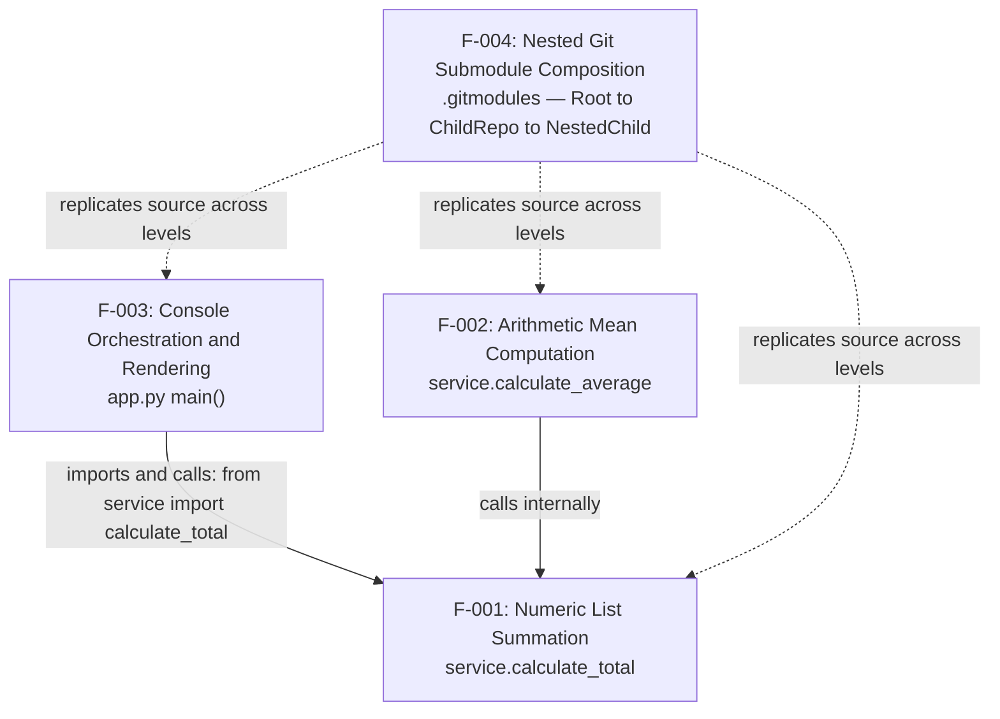
```mermaid
flowchart TD
    F004["F-004: Nested Git Submodule Composition<br/>.gitmodules — Root to ChildRepo to NestedChild"]
    F003["F-003: Console Orchestration and Rendering<br/>app.py main()"]
    F002["F-002: Arithmetic Mean Computation<br/>service.calculate_average"]
    F001["F-001: Numeric List Summation<br/>service.calculate_total"]

    F003 -->|"imports and calls: from service import calculate_total"| F001
    F002 -->|"calls internally"| F001
    F004 -.->|"replicates source across levels"| F003
    F004 -.->|"replicates source across levels"| F002
    F004 -.->|"replicates source across levels"| F001
```

**Reading the map.** F-003 depends on F-001 through the module-level import; F-002 depends on F-001 through an internal function call; F-004 composes the repositories that contain F-001, F-002, and F-003. At the `NestedChild` leaf, the replicated F-001 is missing (its `service.py` is a copy of `app.py`), which is why the replicated F-003 cannot run there.

### 2.3.2 Integration Points

| Integration Point | Type | Features Linked | Mechanism |
|-------------------|------|-----------------|-----------|
| Service import | Code (intra-repository) | F-003 → F-001 | `from service import calculate_total`, resolved from the script's own directory |
| Average-to-total call | Code (intra-module) | F-002 → F-001 | Direct call to `calculate_total(numbers)` inside `calculate_average` in `service.py` |
| Submodule linkage | Repository composition | F-004 composes F-001/F-002/F-003 | `.gitmodules` (`path` + `url`) and recorded gitlink commit pointers |
| Standard output | Environment / output | F-003 → OS stdout | Python `print()` builtin (the only external side effect) |

No other integration points exist. As established in Section 1.3.2, there are **no** network sockets, HTTP clients/servers, databases, message queues, file I/O, environment-variable reads, or third-party libraries anywhere in the code.

### 2.3.3 Shared Components

| Shared Component | Shared By | Notes |
|------------------|-----------|-------|
| `service.py` computation module | F-001 and F-002 (both defined here); imported by F-003 | Pure, side-effect-free functions; present at root and `ChildRepo`; the `NestedChild` file of this name is a duplicate of `app.py`, so the shared component is effectively missing there |
| `app.py` console-driver pattern | F-003 at each repository level | Byte-identical (md5 `a7f6989…`) at root, `ChildRepo`, and `NestedChild` |
| Duplicated source across levels | All features, via F-004 | Root and `ChildRepo` sources are byte-identical; reuse is by whole-repository nesting, **not** a packaged/shared library, so there is no single shared code artifact — each level restates the code |

### 2.3.4 Common Services

The only "service" abstraction in the system is the local `service` module (F-001/F-002); the driver (F-003) treats it as its computation provider. The shared runtime commons are the **Python 3 interpreter and its standard library**, plus the **standard output stream** used for rendering.

Explicitly, there are **no** shared platform services of the kind found in larger systems — no database, cache, message broker, API gateway, authentication/authorization service, configuration service, service discovery, or centralized logging/telemetry. None are configured or referenced in any file, consistent with the out-of-scope determinations in Section 1.3.2.


## 2.4 Implementation Considerations

For each feature, the considerations below are grounded in the observed source. Several dimensions are intentionally reported as "none defined" or "not applicable": the repository states **no performance, scalability, or security targets** (Section 1.2.3), so this section records observed characteristics and structural risks rather than fabricated requirements. A cross-cutting theme is that reuse is achieved by duplicating whole repositories via submodules (F-004) rather than by a shared package, which drives most of the maintenance risk below.

### 2.4.1 F-001: Numeric List Summation

| Dimension | Consideration |
|-----------|---------------|
| Technical Constraints | Pure standard-library Python; relies on `+=` being defined for elements (numeric expected); no type hints; must be importable as the `service` module; a non-numeric element raises an unhandled `TypeError` |
| Performance Requirements | O(n) single pass; trivial for the fixed 4-element list; no numeric targets defined; the built-in `sum()` would be faster but an explicit accumulation loop is used |
| Scalability Considerations | Operates on a fully materialized in-memory iterable; memory scales linearly with input size; no streaming, chunking, or concurrency; no scale targets defined |
| Security Implications | None material — no external input, no I/O, no privileged operations; the data is caller-supplied in-process |
| Maintenance Requirements | A 14-line function duplicated at two levels (root and `ChildRepo`); any change must be re-applied per level because there is no shared package; no tests guard the behavior; the function is absent at the `NestedChild` level |

### 2.4.2 F-002: Arithmetic Mean Computation

| Dimension | Consideration |
|-----------|---------------|
| Technical Constraints | Depends on F-001; requires a sized collection (uses `len()`) and a truthiness-testable input (the empty guard `if not numbers`); returns a mixed type (`int` `0` for empty vs. `float` otherwise); standard library only |
| Performance Requirements | O(n) — delegates to `calculate_total` plus one `len()`; no targets defined |
| Scalability Considerations | In-memory; needs the whole collection materialized for `len()`, so it is unusable with a one-shot generator; no concurrency; no scale targets defined |
| Security Implications | None material — pure in-memory computation with no external input or I/O |
| Maintenance Requirements | Dead/unused code (no driver or test exercises it), creating risk of silent behavioral drift; duplicated at root and `ChildRepo`; absent at `NestedChild` |

### 2.4.3 F-003: Console Application Orchestration & Result Rendering

| Dimension | Consideration |
|-----------|---------------|
| Technical Constraints | Must be executed from a directory containing a valid `service.py` (top-level `from service import calculate_total`); input is hard-coded; no argument parsing; no exception handling, so any import/runtime error is unhandled; f-strings require Python 3.6+ (verified on 3.12.3) |
| Performance Requirements | A single short-lived process with an O(n) print loop; negligible for four items; no targets defined |
| Scalability Considerations | Single-threaded and synchronous; one run per process; not designed for batch or large input (the list is fixed); no concurrency or parallelism |
| Security Implications | Writes only to standard output and accepts no external/untrusted input; module resolution from the script's own directory implies trust in whatever `service.py` is present there |
| Maintenance Requirements | `app.py` is byte-identical across all three levels, so changes must be propagated to each; the `NestedChild` instance is broken because its `service.py` lacks `calculate_total`; no tests and no logging exist to aid diagnosis |

### 2.4.4 F-004: Nested Git Submodule Composition

| Dimension | Consideration |
|-----------|---------------|
| Technical Constraints | Requires Git with submodule support; the nested chain must be fetched recursively (e.g., `git clone --recurse-submodules`); each superproject pins a specific child commit (gitlink); the leaf declares no submodule |
| Performance Requirements | No runtime performance semantics; clone/checkout cost scales with the number and size of submodules; no targets defined |
| Scalability Considerations | Each additional level multiplies duplicated source and clone overhead; because whole repositories are nested rather than sharing a library, the pattern scales poorly for genuine code reuse |
| Security Implications | Remotes are public HTTPS GitHub URLs with no credentials or secrets in configuration; supply-chain trust rests in those remotes and the pinned submodule commits |
| Maintenance Requirements | Cross-level duplication means a fix (e.g., repairing the `NestedChild` `service.py`) must be made in the corresponding submodule repository and the parent's gitlink pointer updated; divergence is already present at the leaf level |


## 2.5 Requirements Traceability Matrix

This matrix traces every functional requirement from Section 2.2 to its implementing code and its verification status. It is baselined at requirements version v1.0 (Git branch `1707`). Verification status reflects behavior observed by directly reading and executing the code on Python 3.12.3, not the existence of any automated test suite (none exists).

### 2.5.1 Requirement-to-Code Traceability

| Requirement ID | Feature | Code Evidence | Verification Status |
|----------------|---------|---------------|---------------------|
| F-001-RQ-001 | F-001 | `service.py` → `calculate_total` (root, `ChildRepo`) | Verified — returns `100` for `[10,20,30,40]`, `5` for `[5]` |
| F-001-RQ-002 | F-001 | `service.py` → `calculate_total` (accumulator initialized to `0`) | Verified — returns `0` for `[]` |
| F-002-RQ-001 | F-002 | `service.py` → `calculate_average` (`calculate_total / len`) | Verified by direct call — returns `25.0` for `[10,20,30,40]`; not exercised by any driver |
| F-002-RQ-002 | F-002 | `service.py` → `calculate_average` (`if not numbers: return 0`) | Verified by direct call — returns `0` for `[]` |
| F-003-RQ-001 | F-003 | `app.py` → `main()` (`numbers = [10,20,30,40]`; `calculate_total`) | Verified — computed total is `100` (root, `ChildRepo`) |
| F-003-RQ-002 | F-003 | `app.py` → `main()` print statements | Verified at root & `ChildRepo` (exact stdout, exit `0`); FAILS at `NestedChild` (`ImportError`, exit `1`) |
| F-003-RQ-003 | F-003 | `app.py` → `if __name__ == "__main__": main()` | Verified — import yields no output; direct invocation runs `main()` |
| F-004-RQ-001 | F-004 | `.gitmodules` (root) | Verified — `[submodule "ChildRepo"]` with `path` + `url` present |
| F-004-RQ-002 | F-004 | `ChildRepo/.gitmodules` | Verified — `[submodule "NestedChild"]` with `path` + `url` present |
| F-004-RQ-003 | F-004 | `ChildRepo/NestedChild/` (no `.gitmodules`) | Verified — no `.gitmodules` exists under the leaf |

### 2.5.2 Feature Coverage Summary

| Feature | Requirements | Priority | Verification Outcome |
|---------|--------------|----------|----------------------|
| F-001 Numeric List Summation | F-001-RQ-001, F-001-RQ-002 | Critical | Fully verified |
| F-002 Arithmetic Mean Computation | F-002-RQ-001, F-002-RQ-002 | Low | Verified by direct call only; not reachable through the application workflow |
| F-003 Console Orchestration & Rendering | F-003-RQ-001, F-003-RQ-002, F-003-RQ-003 | Critical | Verified at root & `ChildRepo`; non-functional at `NestedChild` |
| F-004 Nested Git Submodule Composition | F-004-RQ-001, F-004-RQ-002, F-004-RQ-003 | Medium | Verified (structural) |

### 2.5.3 Related Diagrams and Specifications

- **Component & submodule topology (process flowchart):** Section 1.2.2 contains the repository's component/submodule flowchart, including the depicted defect at the `NestedChild` level; it is the authoritative structural diagram for F-003 and F-004.
- **Feature dependency map:** Section 2.3.1 (above) provides the feature-level dependency flowchart complementing the traceability rows for F-001, F-002, and F-003.
- **Success criteria:** Section 1.2.3 records the verified/not-met behavioral objectives that correspond to F-003-RQ-002 across the three levels.
- **Scope boundaries:** Section 1.3.1 (In-Scope capabilities) and Section 1.3.2 (Out-of-Scope, including the unsupported `NestedChild` run and the unused-average use case) bound the requirements in this section.
- **Evidence base:** Section 1.4 (References) enumerates the same source artifacts cited in the traceability rows above.


## 2.6 References

All requirements, relationships, and considerations in this section were derived from the repository artifacts below. Runtime behavior, byte-equivalence (md5), function edge cases, and the Python version were additionally confirmed by executing the code directly against the checkout on branch `1707`.

#### Files Examined

- `app.py` — root console entry point; established F-003 (fixed input `[10,20,30,40]`, `calculate_total` invocation, the printed output sequence, and the `__main__` guard).
- `service.py` — root computation module; established F-001 (`calculate_total`) and F-002 (`calculate_average`) behavior and their edge cases.
- `README.md` — root documentation; established the single-line title `# app.py` and the absence of any product/requirements documentation.
- `.gitmodules` — root submodule configuration; established F-004-RQ-001 (`ChildRepo` link and remote URL).
- `ChildRepo/app.py` — established the byte-identical driver at the first submodule level.
- `ChildRepo/service.py` — established the byte-identical computation module at the first submodule level.
- `ChildRepo/README.md` — established the single-line title `# 600K_ChildRepo`.
- `ChildRepo/.gitmodules` — established F-004-RQ-002 (`NestedChild` link and remote URL).
- `ChildRepo/NestedChild/app.py` — established the byte-identical driver at the leaf level.
- `ChildRepo/NestedChild/service.py` — established the defect underlying the `NestedChild` non-functional status (a byte-for-byte duplicate of `app.py` causing the circular-import `ImportError`).
- `ChildRepo/NestedChild/README.md` — established the single-line title `# 600K_Nested_ChildRepo`.
- `.blitzyignore` (root, `ChildRepo/`, `ChildRepo/NestedChild/`) — established the ignore rule `*.csv`; the `*.csv` artifacts at each level were consequently excluded from inspection and are not documented.
- `__pycache__/service.cpython-312.pyc` — corroborated the Python 3.12 execution target used to verify behavior.

#### Folders Examined

- `` (repository root) — established the top-level structure and the parent of the submodule chain.
- `ChildRepo/` — established the first-level submodule contents.
- `ChildRepo/NestedChild/` — established the leaf submodule contents (no `.gitmodules`).

#### Related Technical Specification Sections

- Section 1.2 (System Overview), including 1.2.1 (Project Context / limitations), 1.2.2 (High-Level Description with the component & submodule flowchart), and 1.2.3 (Success Criteria) — cross-referenced for feature framing, the defect topology, and verified behavioral objectives.
- Section 1.3 (Scope), including 1.3.1 (In-Scope) and 1.3.2 (Out-of-Scope) — cross-referenced for capability and boundary alignment.
- Section 1.4 (References) — shares the same evidence base of inspected artifacts.

#### Web Sources

- None. All findings are grounded in the repository and its verified runtime behavior; no external sources were required.


# 3. Technology Stack

## 3.1 Programming Languages

The technology stack of this system is deliberately narrow. As established in Sections 1.1–1.3 and the Feature Catalog (Section 2.1), the repository is a minimal Python console application replicated across a three-level Git submodule chain (Root → `ChildRepo` → `ChildRepo/NestedChild`). Exactly **one programming language is present in the repository — Python** — and every source file relies solely on the language's built-in facilities, with no third-party runtime. Every statement below is grounded in the observed source; where the repository declares nothing (for example, a pinned interpreter version), that absence is reported plainly rather than filled with an assumed value.

### 3.1.1 Language Inventory by Component and Platform

The system targets a single platform: a short-lived, local command-line/console process (Section 1.3.1). There is no web, mobile, desktop-GUI, or native application surface, so none of the frontend or native languages that a full-stack default would imply (TypeScript, Swift, Kotlin, Objective-C) are present or applicable. The table below inventories every executable and supporting textual format actually found in the repository.

| Component / Platform | Language / Format | Source Files (per submodule level) | Role |
|----------------------|-------------------|-------------------------------------|------|
| Console entry point / driver | Python 3 | `app.py` | Supplies fixed input, invokes computation, prints results to stdout |
| Computation module | Python 3 | `service.py` | Defines the pure functions `calculate_total` and `calculate_average` |
| Repository composition metadata | Git submodule config (INI-style, declarative) | `.gitmodules` (root, `ChildRepo`) | Declares submodule paths and remote URLs — not executable code |
| Documentation | Markdown | `README.md` (each level) | Single-line title only |
| Ignore rules | Git ignore pattern (declarative) | `.blitzyignore` (each level) | Excludes `*.csv` |

**Python is the sole programming (executable) language.** The `.gitmodules`, `.blitzyignore`, and `README.md` files are declarative configuration and documentation formats, not code. The Python source is byte-identical across levels for the driver (`app.py`) and for the functional computation module (`service.py` at the root and `ChildRepo`), confirming that the same single-language footprint is replicated rather than diversified across the submodule chain. In total the repository contains six Python files spanning 92 lines.

### 3.1.2 Runtime and Version Requirements

The repository declares no version pin — there is no manifest (`pyproject.toml`, `setup.py`, `setup.cfg`), no `.python-version` file, and no CI matrix stating a target interpreter. Version requirements must therefore be derived from the source syntax and the compiled artifacts observed in the checkout.

| Attribute | Value | Evidence |
|-----------|-------|----------|
| Language | Python 3 | Every `.py` file; Section 1.1 records the primary language as Python |
| Minimum language version (syntactic) | Python 3.6+ | `app.py` uses an f-string (`f"Total: {total}"`); f-strings were introduced in Python 3.6. No other version-gating syntax (walrus operator, `match`, PEP 604 unions) appears |
| Verified interpreter (runtime) | CPython 3.12.3 | Interpreter available in the verification environment; execution confirmed in Sections 1.2.3 and 1.3.1 |
| Compiled bytecode target | CPython 3.12 | `__pycache__/service.cpython-312.pyc` is present at all three levels, proving the `service` module was imported and compiled by a CPython 3.12 interpreter |
| Declared version pin | None | No manifest, no `python_requires`, no `.python-version` anywhere in the repository |

**Interpretation.** The code is portable across the modern Python 3 line: the only hard syntactic floor is Python 3.6 (f-strings), while the concrete, observed runtime is CPython 3.12.3. Because no version is pinned, the effective interpreter is simply whichever `python3` is resolved on the host `PATH`.

**Security implication.** The absence of a pinned interpreter and of any third-party runtime means there is no dependency lockfile to keep current and no transitive supply-chain surface to patch; the only version-management concern is that the code will silently run on any Python 3.6+ interpreter present on the host, including an end-of-life one, since nothing enforces a supported baseline.

### 3.1.3 Language Selection Criteria and Rationale

The repository contains no design documentation that states why Python was chosen (the three `README.md` files hold only single-line titles). The criteria below are therefore reverse-engineered from the observed implementation — they describe the properties of the workload that the choice of Python satisfies, not an asserted business decision.

| Selection Criterion | How Python Satisfies It (as observed) |
|---------------------|----------------------------------------|
| Minimal ceremony for a tiny CLI | The entire program is two small scripts run directly with `python3 app.py`; no compilation, linking, or project scaffolding is required |
| Zero-dependency execution | The workload (sum a list, print results) is fully served by language built-ins (`print`, f-strings, `for`, `len`, `/`), so no runtime beyond the interpreter is needed |
| Readability of a reference/demonstration artifact | The procedural style and explicit accumulation loop in `calculate_total` favor didactic clarity over terseness (Section 2.4 notes the built-in `sum()` would be faster, but an explicit loop is used) |
| Cross-platform portability | Pure standard-library Python runs unchanged on any OS with a compatible interpreter; nothing in the source is platform-specific |
| Clean separation of concerns | Python modules make it natural to isolate pure computation (`service.py`) from I/O and orchestration (`app.py`), the central pattern the project exemplifies (Section 1.1) |

### 3.1.4 Language-Level Constraints and Dependencies

The following constraints follow directly from the code and are consistent with the global constraints in Section 2.1 and the implementation considerations in Section 2.4.

- **First-party import only.** The single import statement anywhere in the codebase is the local `from service import calculate_total`. There are no standard-library imports and no third-party imports; the sole dependency is the co-located `service` module.
- **Working-directory / import-path constraint.** Because `service` is a top-level (not package-qualified) import, it resolves from the script's own directory. The application must be executed from a directory that contains a valid `service.py` defining `calculate_total` (Section 2.1 constraint C-2).
- **Dynamic typing, no annotations.** No type hints, `__future__` imports, or decorators exist in any file. Inputs are assumed to be numeric and summable; a non-numeric element would raise an unhandled `TypeError` (Section 2.4.1).
- **Return-type variability.** `calculate_average` returns an `int` `0` for a falsey input but a `float` otherwise (division), a language-level behavior worth noting for any consumer.
- **Leaf-level defect.** At `ChildRepo/NestedChild`, `service.py` is a byte-for-byte duplicate of `app.py` rather than the computation module, so its top-level `from service import calculate_total` becomes a self-referential circular import and the level fails with `ImportError` (Sections 1.2.1 and 2.1). This is a source-content defect, not a language limitation.

**Security implication.** Top-level module resolution from the script's own directory means the program implicitly trusts whatever `service.py` is present on the resolution path; combined with the total absence of external/untrusted input (the input list is hard-coded and the only side effect is writing to stdout), the language-level attack surface is limited to the local files that ship with each submodule level.

The diagram below summarizes the single-language composition across the three submodule levels, including the defective leaf.

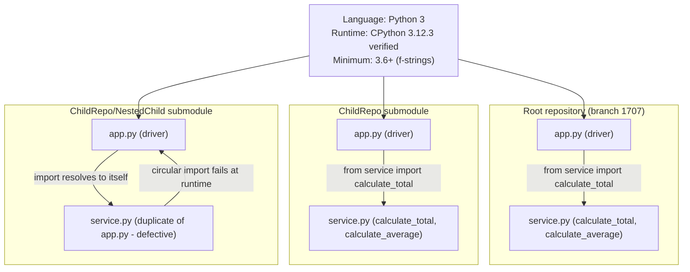
```mermaid
flowchart TD
    Lang["Language: Python 3<br/>Runtime: CPython 3.12.3 verified<br/>Minimum: 3.6+ (f-strings)"]
    subgraph RootLevel["Root repository (branch 1707)"]
        RApp["app.py (driver)"]
        RSvc["service.py (calculate_total, calculate_average)"]
        RApp -->|from service import calculate_total| RSvc
    end
    subgraph ChildLevel["ChildRepo submodule"]
        CApp["app.py (driver)"]
        CSvc["service.py (calculate_total, calculate_average)"]
        CApp -->|from service import calculate_total| CSvc
    end
    subgraph NestedLevel["ChildRepo/NestedChild submodule"]
        NApp["app.py (driver)"]
        NSvc["service.py (duplicate of app.py - defective)"]
        NApp -->|import resolves to itself| NSvc
        NSvc -->|circular import fails at runtime| NApp
    end
    Lang --> RApp
    Lang --> CApp
    Lang --> NApp
```


## 3.2 Frameworks, Libraries, and Open-Source Dependencies

This subsection consolidates two closely related stack dimensions — application frameworks/libraries and open-source dependencies — because for this repository both resolve to the same evidence-based finding: **none are present.** The system is a pure standard-library-only Python program (Sections 1.1, 1.3.1, and constraint C-1 in Section 2.1) with no dependency manifest of any kind. Rather than list technologies the code does not use, this subsection documents the verified absence, its justification, and precisely which built-in facilities the code does rely on.

### 3.2.1 Application Frameworks

**No application framework is used anywhere in the repository.** A recursive scan of all source files found only the single local import `from service import calculate_total`; there are no imports of, or configuration for, any framework.

| Framework Category | Representative Technologies (default-stack expectation) | Present? | Evidence of Absence |
|--------------------|--------------------------------------------------------|----------|---------------------|
| Web / API framework | Flask, Django, FastAPI | No | No HTTP server/client code; no framework import; no web-server entry point (Section 1.3.2) |
| CLI framework | Click, Typer | No | The command line is handled by a bare `if __name__ == "__main__": main()` guard, not a CLI framework |
| AI / orchestration framework | LangChain | No | No AI, model, or orchestration code exists in any file |
| Test framework | pytest, unittest | No | No test files, no `import unittest`/`pytest`, no test directory (Section 1.1 — "Tests / CI / build tooling: None present") |

**Justification.** The functional surface — summing a fixed list and printing the result — is trivially served by the Python `__main__` idiom and built-in functions, so no framework is warranted. Introducing one would add dependency weight without serving any observed requirement. This is consistent with the project's character as a minimal demonstration/reference artifact (Section 1.1).

### 3.2.2 Open-Source Dependencies, Package Management, and Registries

**The repository declares and vendors zero third-party or open-source dependencies.** There is no dependency manifest, no lock file, no vendored package tree, and consequently no package-registry (e.g., PyPI) footprint to resolve or audit.

| Dependency Facet | Finding | Evidence |
|------------------|---------|----------|
| Dependency manifest | None | No `requirements.txt`, `pyproject.toml`, `setup.py`, `setup.cfg`, or `Pipfile` anywhere in the repository |
| Lock file | None | No `poetry.lock`, `Pipfile.lock`, or `requirements.*.txt` pinned set |
| Third-party packages | None | The only import in the codebase is the first-party local module `service`; no external package is imported (Section 1.1 — "External dependencies: None — standard library only") |
| Package registry usage | None | Nothing is installed or referenced from PyPI or any other registry; no index configuration is present |
| Vendored / bundled code | None | No `vendor/`, `site-packages`, `node_modules`, or embedded third-party sources exist |

**Compatibility requirements.** Because there are no frameworks or libraries, there are **no inter-dependency or version-compatibility constraints to manage** — no transitive version resolution, no peer-dependency ranges, and no framework-to-runtime compatibility matrix. The single compatibility requirement for the whole system is the Python interpreter version documented in Section 3.1.2 (Python 3.6+ syntactically; CPython 3.12.3 verified).

**Security implication.** A zero-dependency posture removes the entire third-party supply-chain attack surface: there are no dependency CVEs to track, no transitive packages to patch, and no registry-integrity or dependency-confusion risks. The trade-off — that any future capability must be implemented from scratch or introduced with new dependency-management tooling that does not yet exist — is a maintenance consideration rather than a security one (Section 2.4).

### 3.2.3 Standard-Library and Language Built-in Usage

For completeness, the following enumerates what the code actually depends on at runtime. Notably, the repository does not even import Python standard-library **modules** (no `os`, `sys`, `csv`, `json`, `argparse`, or `logging`); it uses only functions and syntax from the interpreter's built-in namespace.

| Built-in Facility | Where Used | Purpose |
|-------------------|-----------|---------|
| `print()` | `app.py` → `main()` | Renders the total, each number, and the completion message to standard output |
| f-string formatting | `app.py` → `main()` | Formats `f"Total: {total}"` (this is the sole Python 3.6+ requirement) |
| `for ... in` iteration | `app.py`, `service.py` | Iterates the input list to accumulate and to print |
| Augmented assignment `+=` | `service.py` → `calculate_total` | Accumulates the running sum |
| `len()` and `/` | `service.py` → `calculate_average` | Divides the total by the element count for the mean |

Because the entire runtime need is met by the interpreter's built-in namespace, the "supporting library" layer of this system is effectively the Python language and its bundled standard library — with no external augmentation, no version pins, and no registry dependencies.


## 3.3 Databases, Storage, and Third-Party Services

This subsection consolidates the data-tier and external-service dimensions of the stack. As established in Sections 1.2.1, 1.3.2, and 2.4, the system performs **no external integration and no persistence beyond writing to standard output**. Every category below is reported as absent based on the observed source (no relevant imports, drivers, SDKs, configuration, or credentials exist anywhere in the repository). These categories are documented explicitly — rather than omitted — so that consumers do not assume infrastructure the code does not provide, especially given how much a conventional full-stack default would imply.

### 3.3.1 Databases and Data Persistence

**No database of any kind is present or referenced.** There is no relational or NoSQL database, no ORM or query builder, no database driver/connector, no connection string, and no schema or migration artifact.

| Category | Default-Stack Expectation | Present? | Evidence |
|----------|---------------------------|----------|----------|
| Primary database | MongoDB (or any SQL/NoSQL store) | No | No database driver import, no connection configuration, no schema/migration files |
| Secondary database | Any | No | None referenced in source or configuration |
| ORM / data-access layer | Any | No | No ORM import; data is a plain in-memory Python list |

**Data persistence strategy.** There is none in the durable sense. The only "data" in the system is the hard-coded in-memory list `[10, 20, 30, 40]` created inside `main()` (Section 2.1, constraint C-3), and the only output is transient text written to standard output. No state survives process exit: the program is a deterministic, stateless computation that reads nothing and writes nothing to disk.

### 3.3.2 Caching and Storage Services

**No caching layer or storage service is present.** The program performs no file I/O whatsoever — its sole side effect is `print()` to standard output — so there is no file, object, or blob storage in use, and nothing to cache.

| Category | Default-Stack Expectation | Present? | Evidence |
|----------|---------------------------|----------|----------|
| In-memory / distributed cache | Redis, Memcached | No | No cache client import or configuration |
| Object / blob storage | AWS S3 or equivalent | No | No storage SDK; no upload/download code |
| Local file storage | Filesystem reads/writes | No | No `open()` or file-handling calls anywhere; the only I/O is stdout (Section 1.2.1) |

### 3.3.3 External APIs, Authentication, Monitoring, and Cloud Services

**No third-party service integration exists.** There are no network calls, no external API clients, no authentication provider, no telemetry, and no cloud-platform bindings.

| Service Category | Default-Stack Expectation | Present? | Evidence |
|------------------|---------------------------|----------|----------|
| External APIs / integrations | REST/GraphQL clients, SDKs | No | No HTTP client, socket, or messaging code; no third-party imports (Section 1.3.2) |
| Authentication / authorization | Auth0 (OAuth/OIDC/identity) | No | No identity, credential, token, role, or access-control code anywhere (Section 1.3.2) |
| Monitoring / observability | APM, metrics, tracing | No | No logging framework, metrics, or telemetry — the code has no logging at all (Sections 1.3.2, 2.4) |
| Cloud services | AWS (compute, managed services) | No | No cloud SDK (e.g., `boto3`), no cloud configuration, no environment-variable reads |

**The only external references in the repository are development-time Git submodule remotes**, not runtime services: the root `.gitmodules` points to `https://github.com/lakshya-blitzy/600K_ChildRepo.git` and `ChildRepo/.gitmodules` points to `https://github.com/lakshya-blitzy/600K_Nested_ChildRepo.git`. These are public HTTPS GitHub repositories used to compose the source tree (documented in Section 3.4), not APIs the application calls at runtime.

**Security implication.** Because the system has no database, no storage, no network integration, and no authentication, it holds no secrets, credentials, connection strings, API keys, or tokens, and exposes no listening port or network endpoint. The supply-chain trust surface is limited to the two public Git remotes and their pinned submodule commits (Section 2.4.4), which are fetched only during source composition and carry no embedded credentials.


## 3.4 Development and Deployment Tooling

This subsection documents the tooling required to develop, compose, run, and (notionally) deploy the system. The observed toolchain is minimal: a Python interpreter to execute the code and Git to compose the nested submodule structure. There is no build system, no containerization, and no CI/CD — each of these is verified absent below, consistent with Sections 1.1, 1.3.2, and 2.4.

### 3.4.1 Development Tools and Runtime Environment

Only two tools are required, and both were confirmed in the verification environment. The repository ships no editor, linter, formatter, or pre-commit configuration (no `.editorconfig`, `.flake8`, `.pylintrc`, `pyproject.toml` `[tool.*]` sections, or `.pre-commit-config.yaml`).

| Tool | Version (verified) | Role | Notes |
|------|--------------------|------|-------|
| CPython interpreter | 3.12.3 | Executes `app.py`/`service.py` | Minimum syntactic floor is Python 3.6 (f-strings, Section 3.1.2); no version is pinned by the repo |
| Git (with submodule support) | 2.43.0 | Version control and nested submodule composition | The distinguishing structural tool of the project (feature F-004) |

No dedicated development dependencies exist because there is nothing to install: development and execution use the interpreter directly against the source files.

### 3.4.2 Version Control and Nested Submodule Composition

Git is the sole substantive tooling in the stack, and its submodule mechanism is the project's defining structural characteristic (Feature F-004, Sections 1.1 and 2.1). The repository is composed as a **three-level chain of Git submodules**.

| Level | Path | Pinned Commit (gitlink) | Remote URL |
|-------|------|-------------------------|------------|
| Root (superproject) | `.` (branch `1707`) | — | — |
| Child submodule | `ChildRepo` | `a1c6294` (`heads/1707`) | `https://github.com/lakshya-blitzy/600K_ChildRepo.git` |
| Grandchild submodule | `ChildRepo/NestedChild` | `915ff60` | `https://github.com/lakshya-blitzy/600K_Nested_ChildRepo.git` |

- **Declaration.** `.gitmodules` at the root declares `ChildRepo`; `ChildRepo/.gitmodules` declares `NestedChild`; `NestedChild` is the leaf (no further `.gitmodules`).
- **Physical layout.** The gitlink files confirm the nested module layout: `ChildRepo/.git` contains `gitdir: ../.git/modules/ChildRepo`, and `ChildRepo/NestedChild/.git` contains `gitdir: ../../.git/modules/ChildRepo/modules/NestedChild`.
- **Retrieval requirement.** The full tree must be fetched recursively, e.g., `git clone --recurse-submodules`; each superproject pins a specific child commit, so the composition is deterministic (Section 2.4.4).
- **Integration/maintenance implication.** Because reuse is expressed by nesting whole repositories rather than sharing a package, source is duplicated across levels; a fix (such as repairing the `NestedChild` `service.py`) must be committed in the corresponding child repository and the parent's gitlink pointer updated (Section 2.4.4).

**Security implication.** The submodule remotes are public HTTPS GitHub URLs with no embedded credentials or secrets; supply-chain trust rests entirely on those remotes and the pinned commit SHAs.

### 3.4.3 Build System, Containerization, and CI/CD

All three of these categories are **verified absent.** A recursive search of the repository found none of the associated artifacts.

| Category | Default-Stack Expectation | Present? | Evidence of Absence |
|----------|---------------------------|----------|---------------------|
| Build system | Make / packaging backend | No | No `Makefile`, `setup.py`, `pyproject.toml`, or build backend; code runs directly as scripts with no build/compile step |
| Packaging / distribution | wheel / sdist | No | No packaging metadata; nothing is published or installable via `pip` |
| Containerization | Docker | No | No `Dockerfile`, `docker-compose.yml`, or `.dockerignore` anywhere |
| Infrastructure as Code | Terraform | No | No `.tf`/`.tfvars` files; no infrastructure definitions |
| CI/CD | GitHub Actions | No | No `.github/workflows/`, `.circleci/`, `.gitlab-ci.yml`, or `Jenkinsfile`; Section 1.1 confirms "Tests / CI / build tooling: None present" |

### 3.4.4 Execution and Deployment Model

The system has no deployment pipeline in the conventional sense; "deployment" is simply obtaining the source and running a script. The observed model is:

1. **Obtain source** — clone the parent repository recursively so all submodule levels are populated (`git clone --recurse-submodules`).
2. **Provide runtime** — ensure a Python 3.6+ interpreter (CPython 3.12.3 verified) is available on `PATH`; no dependency installation is required because there are no dependencies.
3. **Run** — from a directory containing a valid `service.py`, execute `python3 app.py`. The root and `ChildRepo` levels produce the deterministic output `Total: 100`, the four numbers, and `Application completed`, exiting successfully; the `NestedChild` level fails with a circular-import `ImportError` because its `service.py` is a duplicate of `app.py` (Sections 1.2.3 and 2.1).

There is no install step, no service/daemon, no port binding, and no packaging — the program is a short-lived, single-invocation local process. The diagram below summarizes the end-to-end development-to-execution workflow.

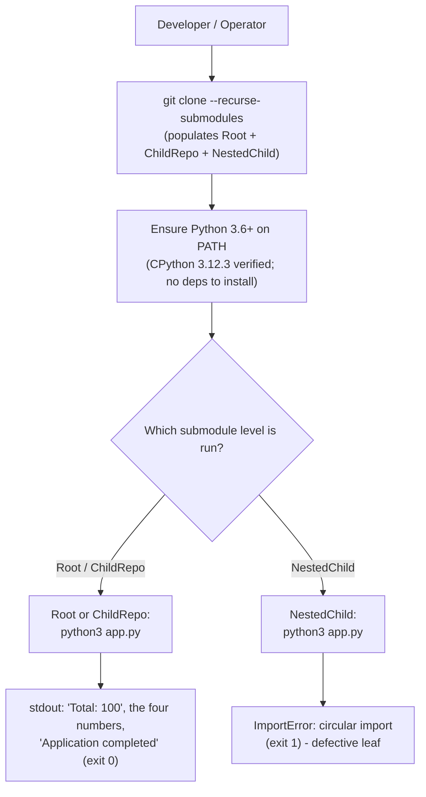
```mermaid
flowchart TD
    Dev["Developer / Operator"]
    Clone["git clone --recurse-submodules<br/>(populates Root + ChildRepo + NestedChild)"]
    Env["Ensure Python 3.6+ on PATH<br/>(CPython 3.12.3 verified; no deps to install)"]
    Level{"Which submodule level is run?"}
    RootRun["Root or ChildRepo:<br/>python3 app.py"]
    NestedRun["NestedChild:<br/>python3 app.py"]
    OK["stdout: 'Total: 100', the four numbers,<br/>'Application completed' (exit 0)"]
    Fail["ImportError: circular import<br/>(exit 1) - defective leaf"]
    Dev --> Clone
    Clone --> Env
    Env --> Level
    Level -->|Root / ChildRepo| RootRun
    Level -->|NestedChild| NestedRun
    RootRun --> OK
    NestedRun --> Fail
```


## 3.5 References

The following repository artifacts and previously written specification sections were examined as evidence for this Technology Stack section. CSV files present in the tree are excluded from inspection per the repository's `.blitzyignore` rules and are not referenced here.

**Files examined**

- `app.py` (root) - Console entry point; established the sole language (Python), the only import (`from service import calculate_total`), and the f-string usage that sets the Python 3.6+ floor
- `service.py` (root) - Computation module defining `calculate_total`/`calculate_average`; confirmed no imports, no type hints, and standard-library-only logic
- `README.md` (root) - Single-line title (`# app.py`); confirmed no dependency, setup, or tooling documentation
- `.gitmodules` (root) - Declared the `ChildRepo` submodule and its public HTTPS GitHub remote
- `.blitzyignore` (root) - Established the `*.csv` exclusion honored throughout this section
- `ChildRepo/app.py`, `ChildRepo/service.py` - Confirmed the byte-identical replication of the functional application at the second level
- `ChildRepo/README.md` - Single-line title (`# 600K_ChildRepo`)
- `ChildRepo/.gitmodules` - Declared the `NestedChild` submodule and its public HTTPS GitHub remote
- `ChildRepo/NestedChild/app.py`, `ChildRepo/NestedChild/service.py` - Confirmed the defective leaf: `service.py` is a duplicate of `app.py`, causing the circular-import failure
- `ChildRepo/NestedChild/README.md` - Single-line title (`# 600K_Nested_ChildRepo`)
- `ChildRepo/.git`, `ChildRepo/NestedChild/.git` - Gitlink files confirming the nested module layout
- `__pycache__/service.cpython-312.pyc` (present at all three levels) - Bytecode artifact proving the code was compiled/executed by CPython 3.12

**Folders examined**

- `` (repository root) - Established the top-level inventory and the absence of any manifest, build, container, IaC, or CI/CD tooling
- `ChildRepo/` - Second-level submodule; confirmed the same minimal Python/submodule structure
- `ChildRepo/NestedChild/` - Leaf submodule; confirmed the same structure and the defective `service.py`

**Terminal verifications**

- Recursive search for dependency manifests, lock files, Dockerfiles, Terraform, and CI directories - Confirmed none exist
- Import/annotation scan across all `.py` files - Confirmed the only import is the local `service` module; no type hints, decorators, or `__future__` imports
- `python3 --version` (3.12.3) and `git --version` (2.43.0) - Established verified tool versions
- `git submodule status --recursive` - Established the pinned submodule commits (`ChildRepo` @ `a1c6294`, `NestedChild` @ `915ff60`) and branch `1707`

**Cross-referenced specification sections**

- `1.1 Executive Summary` - Language (Python), zero external dependencies, source size (6 files / 92 lines), and "no tests/CI/build tooling" finding
- `1.2 System Overview` - Standard-library-only technical approach, submodule topology, and the leaf-level defect
- `1.3 Scope` - Python 3 interpreter requirement (3.6+; verified 3.12.3), no version pin, and the explicit out-of-scope list (databases, networking, cloud, CI/CD, containers, package registries)
- `2.1 Feature Catalog` - Feature inventory (F-001–F-004), global constraints C-1–C-5, and submodule remotes
- `2.4 Implementation Considerations` - Standard-library constraints, submodule retrieval/maintenance model, and security posture of the public remotes


# 4. Process Flowchart

## 4.1 System Workflows

Section 4 documents the process flows of the system **exactly as implemented in the repository**. Every diagram and rule below is derived from the source files (`app.py`, `service.py`, `.gitmodules`) and from runtime behavior confirmed on Python 3.12.3; no workflow, actor, timing target, or integration is asserted that is not present in the code. As established in Sections 1.2 (System Overview) and 2.3 (Feature Relationships), the system is a **single-process, standard-library-only Python console application** replicated across a three-level Git submodule chain (Root → `ChildRepo` → `ChildRepo/NestedChild`). It exposes no web server, HTTP API, database, message queue, scheduler, or file I/O; its only runtime input is a hard-coded list literal and its only side effect is writing to standard output.

**Diagram notation.** Flowcharts use stadium nodes (`([ ])`) for start/end points, rectangles for process steps, and diamonds (`{ }`) for decision points; subgraphs act as swim lanes that separate the participating actors and components. Sequence diagrams model system/component interactions over time. The feature identifiers (F-001…F-004) and requirement identifiers (F-XXX-RQ-YYY) referenced throughout are defined in Sections 2.1 and 2.2.

### 4.1.1 Core Business Processes

The system has exactly **one end-to-end runnable process**: the *compute-and-render-total* workflow. It is orchestrated by `main()` in `app.py` (feature **F-003**), which computes a sum using `calculate_total` from `service.py` (feature **F-001**) over the fixed list `[10, 20, 30, 40]` and renders the result to the console. The `calculate_average` function (**F-002**) is defined but participates in **no runnable process**, because no driver imports or calls it; it therefore does not appear in the end-to-end flow and is documented as a standalone process flow in Section 4.2.3.

**High-level system workflow (with swim lanes).** The diagram traces a single invocation from the operator's shell command, through the interpreter, the driver, and the computation module, and back to console output. The two decision diamonds capture the only branch points in the process: whether the imported `service` module actually exposes `calculate_total` (the branch that fails at the `NestedChild` leaf) and the `__main__` guard.

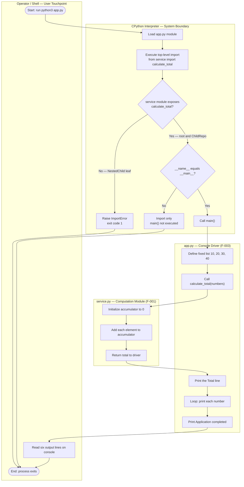
```mermaid
flowchart TD
    subgraph LaneUser["Operator / Shell — User Touchpoint"]
        Start(["Start: run python3 app.py"])
        ViewOut["Read six output lines on console"]
        Done(["End: process exits"])
    end
    subgraph LaneRuntime["CPython Interpreter — System Boundary"]
        LoadApp["Load app.py module"]
        DoImport["Execute top-level import<br/>from service import calculate_total"]
        DecImport{"service module exposes<br/>calculate_total?"}
        DecGuard{"__name__ equals __main__?"}
        CallMain["Call main()"]
        FailImport["Raise ImportError<br/>exit code 1"]
        NoRun["Import only<br/>main() not executed"]
    end
    subgraph LaneDriver["app.py — Console Driver (F-003)"]
        DefInput["Define fixed list 10, 20, 30, 40"]
        InvokeTotal["Call calculate_total(numbers)"]
        PrintTotal["Print the Total line"]
        LoopPrint["Loop: print each number"]
        PrintDone["Print Application completed"]
    end
    subgraph LaneService["service.py — Computation Module (F-001)"]
        InitAcc["Initialize accumulator to 0"]
        SumLoop["Add each element to accumulator"]
        ReturnTotal["Return total to driver"]
    end

    Start --> LoadApp
    LoadApp --> DoImport
    DoImport --> DecImport
    DecImport -->|"No — NestedChild leaf"| FailImport
    FailImport --> Done
    DecImport -->|"Yes — root and ChildRepo"| DecGuard
    DecGuard -->|"No"| NoRun
    NoRun --> Done
    DecGuard -->|"Yes"| CallMain
    CallMain --> DefInput
    DefInput --> InvokeTotal
    InvokeTotal --> InitAcc
    InitAcc --> SumLoop
    SumLoop --> ReturnTotal
    ReturnTotal --> PrintTotal
    PrintTotal --> LoopPrint
    LoopPrint --> PrintDone
    PrintDone --> ViewOut
    ViewOut --> Done
```

**End-to-end user journey.** The sole user touchpoint is the command line; there is no GUI, interactive prompt, or configuration step. The journey below reflects the verified successful path at the root and `ChildRepo` levels.

| Step | Actor / Component | Action | Observable Result |
|------|-------------------|--------|-------------------|
| 1 | Operator (shell) | Runs `python3 app.py` from a directory containing a valid `service.py` | Process starts |
| 2 | CPython runtime | Executes the top-level `from service import calculate_total` | `calculate_total` bound (root & `ChildRepo`) |
| 3 | CPython runtime | Evaluates the `if __name__ == "__main__"` guard | `main()` invoked |
| 4 | `app.py` `main()` | Defines `numbers = [10, 20, 30, 40]`, calls `calculate_total` | Total `100` returned |
| 5 | `app.py` `main()` | Prints `Total: 100`, each number on its own line, then `Application completed` | Six lines on stdout |
| 6 | Operator (shell) | Reads output; process exits with code `0` | Journey complete |

**Decision points.** Only three branch points exist in the process, all grounded in the source:

| Decision Point | Location | Condition | Outcome |
|----------------|----------|-----------|---------|
| Import resolution | `app.py` line 1 (import executed by interpreter) | Does the resolved `service` module define `calculate_total`? | Yes → continue (root, `ChildRepo`); No → `ImportError`, exit `1` (`NestedChild`) |
| Script guard | `app.py` line 15 | `__name__ == "__main__"`? | True → run `main()`; False → module imported without output |
| Summation loop bound | `service.py` `calculate_total` | Are there remaining elements to add? | Continue accumulating; an empty list exits the loop immediately and returns `0` |

**Error-handling path (overview).** The single observed failure path is the `NestedChild` leaf: its `service.py` is a byte-for-byte duplicate of `app.py`, so the load-time import re-enters the partially initialized `service` module and raises `ImportError: cannot import name 'calculate_total' from partially initialized module 'service' (most likely due to a circular import)`, terminating with exit code `1`. There is no `try`/`except` anywhere in the codebase, so the interpreter's default handler prints the traceback to stderr. This path is detailed as an error-handling flowchart in Section 4.3.2.

**Timing / SLA considerations.** No timing constraints, latency budgets, throughput targets, or SLAs are defined anywhere in the repository (confirmed in Section 1.2.3). The process is short-lived and fully synchronous: a single O(n) summation over a four-element list followed by an O(n) print loop, executed in one thread with no waits, retries, or timeouts.

### 4.1.2 Integration Workflows

Because the application performs no external communication, "integration" in this system is limited to two mechanisms, both evident in the source:

1. **Intra-process module binding** — the driver `app.py` integrates with the computation module `service.py` through the load-time statement `from service import calculate_total` (integration point F-003 → F-001 in Section 2.3.2). Data flows one way in (the `numbers` list argument) and one way out (the integer total returned to the driver).
2. **Repository composition via Git submodules** — the `.gitmodules` files link the three repository levels (feature **F-004**). This is a checkout-time integration performed by Git, not a runtime one.

**Module-interaction sequence (integration sequence diagram).** The diagram models both branches of the import: the successful binding used at the root and `ChildRepo` levels, and the circular-import failure at the `NestedChild` leaf.

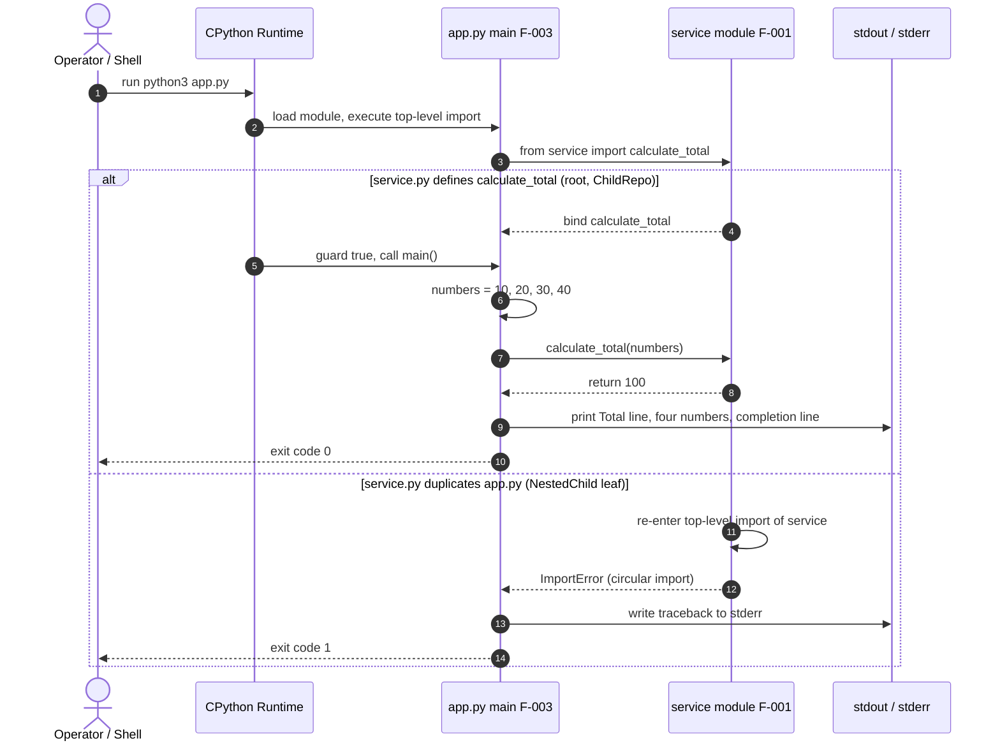
```mermaid
sequenceDiagram
    autonumber
    actor Dev as Operator / Shell
    participant PY as CPython Runtime
    participant APP as app.py main F-003
    participant SVC as service module F-001
    participant OUT as stdout / stderr

    Dev->>PY: run python3 app.py
    PY->>APP: load module, execute top-level import
    APP->>SVC: from service import calculate_total
    alt service.py defines calculate_total (root, ChildRepo)
        SVC-->>APP: bind calculate_total
        PY->>APP: guard true, call main()
        APP->>APP: numbers = 10, 20, 30, 40
        APP->>SVC: calculate_total(numbers)
        SVC-->>APP: return 100
        APP->>OUT: print Total line, four numbers, completion line
        APP-->>Dev: exit code 0
    else service.py duplicates app.py (NestedChild leaf)
        SVC->>SVC: re-enter top-level import of service
        SVC-->>APP: ImportError (circular import)
        APP->>OUT: write traceback to stderr
        APP-->>Dev: exit code 1
    end
```

**Repository composition and checkout-time data flow.** Feature F-004 is realized when Git assembles the nested working tree. The sequence below shows the recursive fetch of each level's gitlink pointer during a `--recurse-submodules` clone; the recorded pointers observed in this checkout are `ChildRepo` at `a1c6294` and `NestedChild` at `915ff60`.

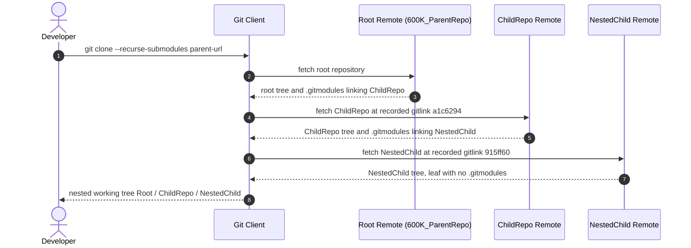
```mermaid
sequenceDiagram
    autonumber
    actor User as Developer
    participant Git as Git Client
    participant R0 as Root Remote (600K_ParentRepo)
    participant R1 as ChildRepo Remote
    participant R2 as NestedChild Remote

    User->>Git: git clone --recurse-submodules parent-url
    Git->>R0: fetch root repository
    R0-->>Git: root tree and .gitmodules linking ChildRepo
    Git->>R1: fetch ChildRepo at recorded gitlink a1c6294
    R1-->>Git: ChildRepo tree and .gitmodules linking NestedChild
    Git->>R2: fetch NestedChild at recorded gitlink 915ff60
    R2-->>Git: NestedChild tree, leaf with no .gitmodules
    Git-->>User: nested working tree Root / ChildRepo / NestedChild
```

**Integration points summary.** The complete set of integration points (from Section 2.3.2) is:

| Integration Point | Type | Direction | Mechanism |
|-------------------|------|-----------|-----------|
| Service import | Code (intra-process) | F-003 → F-001 | `from service import calculate_total`, resolved from the script's own directory |
| Average-to-total call | Code (intra-module) | F-002 → F-001 | Direct call to `calculate_total(numbers)` inside `calculate_average` (unused at runtime) |
| Submodule linkage | Repository composition (checkout-time) | Root → ChildRepo → NestedChild | `.gitmodules` `path`/`url` plus recorded gitlink commit pointers |
| Standard output | Process → environment | F-003 → stdout | Python `print()` builtin (only external side effect) |

**API interactions, event processing, and batch processing — none present.** These integration categories from the section prompt are documented here as explicit, evidence-based absences:

- **API interactions** — there is no HTTP client or server, no REST/gRPC/GraphQL surface, and no network socket in the code; the only `import` statement anywhere is the local `from service import calculate_total`.
- **Event processing flows** — there is no message queue, broker, event loop, callback registration, or publish/subscribe mechanism; execution is a single linear call chain with no asynchronous dispatch.
- **Batch processing sequences** — there is no scheduler, cron entry, job runner, or bulk data-pipeline construct; the program processes one hard-coded four-element list in a single synchronous pass. The nearest batch-like sequence is the one-time `git clone --recurse-submodules` traversal shown above, which is a repository checkout rather than a data-processing batch.

## 4.2 Detailed Process Flows and Validation Rules

This section provides a detailed process flow for each core feature — the console driver (F-003), the summation function (F-001), the mean function (F-002), and the nested submodule composition (F-004) — followed by the consolidated validation-rule and checkpoint analysis. All flows are grounded in `app.py` (16 lines) and `service.py` (14 lines) and the requirement identifiers defined in Section 2.2.

### 4.2.1 Console Application Execution Flow (F-003)

The console driver `app.py` is the system's only executable entry point. Its `main()` function realizes requirements F-003-RQ-001 (operate on the fixed list and compute a total of `100`), F-003-RQ-002 (render the exact output sequence and exit `0`), and F-003-RQ-003 (invoke `main()` only under the `if __name__ == "__main__"` guard at line 15). The detailed flow below includes the process's single **system boundary** (the CPython process), its single **user touchpoint** (the shell command), and both terminal paths — the successful exit `0` and the `ImportError` exit `1`.

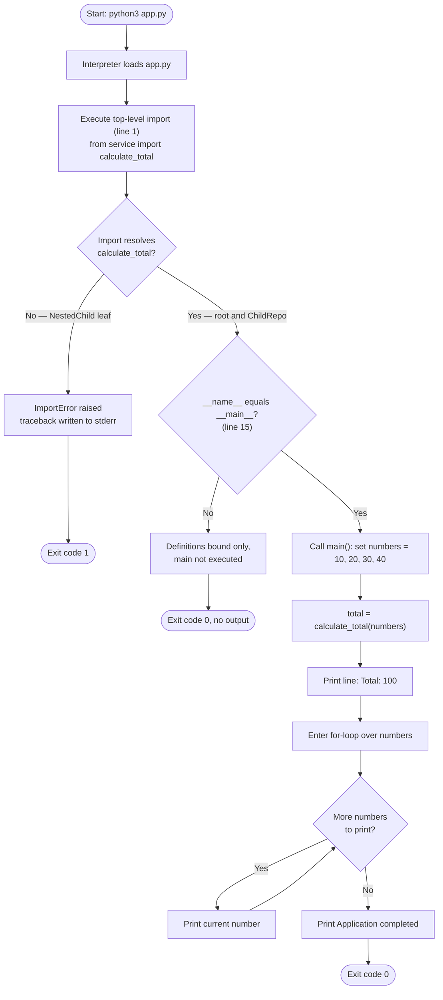
```mermaid
flowchart TD
    A(["Start: python3 app.py"]) --> B["Interpreter loads app.py"]
    B --> C["Execute top-level import (line 1)<br/>from service import calculate_total"]
    C --> D{"Import resolves<br/>calculate_total?"}
    D -->|"No — NestedChild leaf"| E["ImportError raised<br/>traceback written to stderr"]
    E --> F(["Exit code 1"])
    D -->|"Yes — root and ChildRepo"| G{"__name__ equals __main__?<br/>(line 15)"}
    G -->|"No"| H["Definitions bound only,<br/>main not executed"]
    H --> I(["Exit code 0, no output"])
    G -->|"Yes"| J["Call main(): set numbers = 10, 20, 30, 40"]
    J --> K["total = calculate_total(numbers)"]
    K --> L["Print line: Total: 100"]
    L --> M["Enter for-loop over numbers"]
    M --> N{"More numbers<br/>to print?"}
    N -->|"Yes"| O["Print current number"]
    O --> N
    N -->|"No"| P["Print Application completed"]
    P --> Q(["Exit code 0"])
```

**Error states and recovery.** The only error state is the load-time `ImportError` at the `NestedChild` leaf. There is no in-process recovery — no `try`/`except`, retry, or fallback exists — so recovery is strictly operational: run the driver from a directory whose `service.py` actually defines `calculate_total` (constraint C-2, Section 2.1). **Timing.** Execution is synchronous and short-lived, with no I/O waits, timers, or SLAs; the total work is one summation pass plus a five-line print sequence.

### 4.2.2 Numeric List Summation Process (F-001)

`calculate_total(numbers)` (service.py lines 1-7) initializes an accumulator to `0`, adds each element in a `for` loop, and returns the accumulated value. It satisfies F-001-RQ-001 (`calculate_total([10, 20, 30, 40])` → `100`, `[5]` → `5`, integer input yields integer output) and F-001-RQ-002 (empty list → `0`).

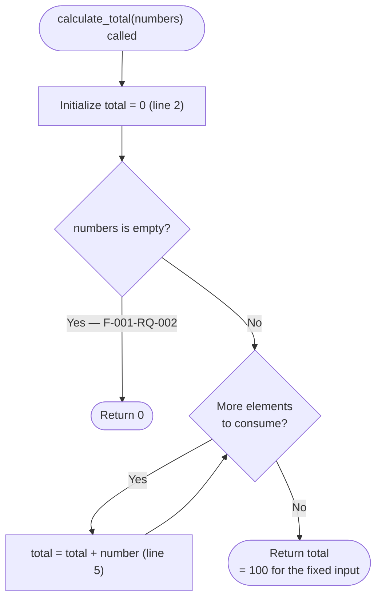
```mermaid
flowchart TD
    A(["calculate_total(numbers) called"]) --> B["Initialize total = 0 (line 2)"]
    B --> C{"numbers is empty?"}
    C -->|"Yes — F-001-RQ-002"| D(["Return 0"])
    C -->|"No"| E{"More elements<br/>to consume?"}
    E -->|"Yes"| F["total = total + number (line 5)"]
    F --> E
    E -->|"No"| G(["Return total<br/>= 100 for the fixed input"])
```

**Note on the empty-list decision.** The source contains no explicit emptiness conditional; the empty-list guarantee is an emergent property of the `for` loop, whose body never executes for an empty iterable, so the initial `0` is returned unchanged. The decision diamond above is drawn explicitly to document the F-001-RQ-002 behavior verified at runtime, not to imply a separate `if` statement in the code.

### 4.2.3 Arithmetic Mean Computation Process (F-002)

`calculate_average(numbers)` (service.py lines 10-14) guards against an empty input with `if not numbers: return 0` (line 11-12), otherwise returns `calculate_total(numbers) / len(numbers)`. This satisfies F-002-RQ-002 (empty → `0`) and F-002-RQ-001 (non-empty → float mean, e.g. `[10, 20, 30, 40]` → `25.0`, `[5]` → `5.0`). The division delegates to `calculate_total`, which is integration point F-002 → F-001 (Section 2.3.2).

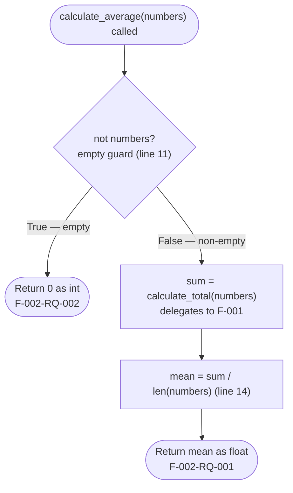
```mermaid
flowchart TD
    A(["calculate_average(numbers) called"]) --> B{"not numbers?<br/>empty guard (line 11)"}
    B -->|"True — empty"| C(["Return 0 as int<br/>F-002-RQ-002"])
    B -->|"False — non-empty"| D["sum = calculate_total(numbers)<br/>delegates to F-001"]
    D --> E["mean = sum / len(numbers) (line 14)"]
    E --> F(["Return mean as float<br/>F-002-RQ-001"])
```

**Note on the unused path.** This flow is **never triggered at runtime**: no driver imports or calls `calculate_average` (verified by repository-wide search — it appears only at `service.py:10` and `ChildRepo/service.py:10`, and is absent entirely from the `NestedChild` leaf). The function is therefore dead code with respect to the executable process. A secondary observation is a return-type asymmetry — the empty branch returns the integer `0` while the non-empty branch returns a `float` — which is preserved here because it reflects the code exactly.

### 4.2.4 Nested Submodule Composition and Broken-Leaf Flow (F-004)

Feature F-004 is the three-level Git submodule chain. The root `.gitmodules` links `ChildRepo` (F-004-RQ-001) and `ChildRepo/.gitmodules` links `NestedChild` (F-004-RQ-002); the `NestedChild` leaf declares no further submodule (F-004-RQ-003). The flow below shows both the composition (dashed gitlink edges with the recorded commit pointers) and the divergent runtime outcomes per level. The critical defect is isolated to the leaf: `NestedChild/service.py` is a byte-for-byte duplicate of `app.py` (identical md5 `a7f6989…`), so importing `service` re-enters the same partially initialized module.

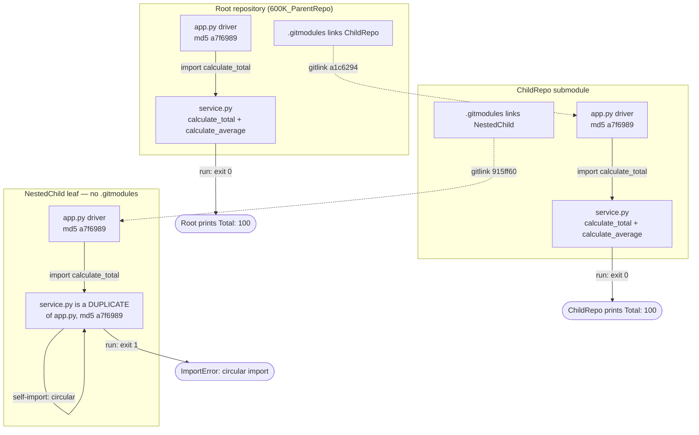
```mermaid
flowchart TD
    subgraph Root["Root repository (600K_ParentRepo)"]
        RA["app.py driver<br/>md5 a7f6989"]
        RS["service.py<br/>calculate_total + calculate_average"]
        RG[".gitmodules links ChildRepo"]
        RA -->|"import calculate_total"| RS
    end
    subgraph Child["ChildRepo submodule"]
        CA["app.py driver<br/>md5 a7f6989"]
        CS["service.py<br/>calculate_total + calculate_average"]
        CG[".gitmodules links NestedChild"]
        CA -->|"import calculate_total"| CS
    end
    subgraph Nested["NestedChild leaf — no .gitmodules"]
        NA["app.py driver<br/>md5 a7f6989"]
        NS["service.py is a DUPLICATE<br/>of app.py, md5 a7f6989"]
        NA -->|"import calculate_total"| NS
        NS -->|"self-import: circular"| NS
    end
    RG -.->|"gitlink a1c6294"| CA
    CG -.->|"gitlink 915ff60"| NA
    RS -->|"run: exit 0"| OKR(["Root prints Total: 100"])
    CS -->|"run: exit 0"| OKC(["ChildRepo prints Total: 100"])
    NS -->|"run: exit 1"| FAILN(["ImportError: circular import"])
```

### 4.2.5 Validation Rules, Authorization, and Regulatory Compliance Checkpoints

This sub-section consolidates the business rules and data-validation requirements enforced at each process step, following the validation taxonomy used in Section 2.2 (Business Rules / Data Validation / Security Requirements / Compliance Requirements).

**Business rules and data validation matrix.**

| Process Step | Business Rule (enforced by code) | Data Validation Present | Authorization | Compliance |
|--------------|----------------------------------|-------------------------|---------------|------------|
| Summation — F-001 | Return the arithmetic sum; empty input returns `0` | None — assumes an iterable of numbers; no type, `None`, or bounds checks | None | None |
| Mean — F-002 | `mean = total / count`; empty input returns `0` via guard | Emptiness guard only (`if not numbers`); no element-type validation | None | None |
| Driver input — F-003-RQ-001 | Operate on the fixed list `[10, 20, 30, 40]` (total must be `100`) | None — the value is a hard-coded literal, not read from any external source | None | None |
| Driver output — F-003-RQ-002 | Print `Total: 100`, then each number on its own line, then `Application completed`; exit `0` | None | None | None |
| Script guard — F-003-RQ-003 | Execute `main()` only when run as the main module | N/A (structural guard) | None | None |
| Submodule declaration — F-004 | Root and `ChildRepo` each declare a submodule with `path` and `url`; the leaf declares none | Structural only — presence/absence of `.gitmodules` and gitlink pointers | None (public HTTPS URLs) | None |

**Authorization checkpoints — none.** The repository contains no authentication, authorization, access-control, session, credential, or permission logic of any kind. The only actor is the local operator who runs the interpreter; there are no protected resources or identity concepts. This matches the "Security Requirements: none applicable" determinations recorded per feature in Section 2.2.

**Regulatory compliance checks — none.** There is no handling of personal, financial, or otherwise regulated data; no encryption, audit logging, consent, or data-retention logic; and no compliance-gating anywhere in the code. The system operates entirely on a hard-coded four-element integer list and writes plain text to standard output, so the "Compliance Requirements: none applicable" determinations in Section 2.2 hold across all features.

**Operational precondition (business rule).** The one enforceable operational rule is the execution precondition captured as constraint C-2 in Section 2.1: `app.py` must be executed from a working directory whose `service.py` defines `calculate_total`. This precondition is satisfied at the root and `ChildRepo` levels and violated at the `NestedChild` leaf, which is the root cause of the exit-code-`1` failure documented in Sections 4.2.1 and 4.3.2.

## 4.3 Technical Implementation

This section documents the state-management and error-handling characteristics of the process flows, strictly as observed in `app.py` and `service.py`. Because the system is a single synchronous process with no external resources, several enterprise concerns in the section prompt (persistence, caching, transactions, retries) are documented here as explicit, evidence-based absences rather than mechanisms.

### 4.3.1 State Management

The application maintains **no durable state**. All state is transient and in-memory, confined to local variables that live only for the duration of a single process invocation: `numbers` (the input list), `total` (the accumulator in `calculate_total`), and `number` (the loop variable). The state transition diagram below models the process lifecycle from launch to termination, including both the successful and failing terminal states.

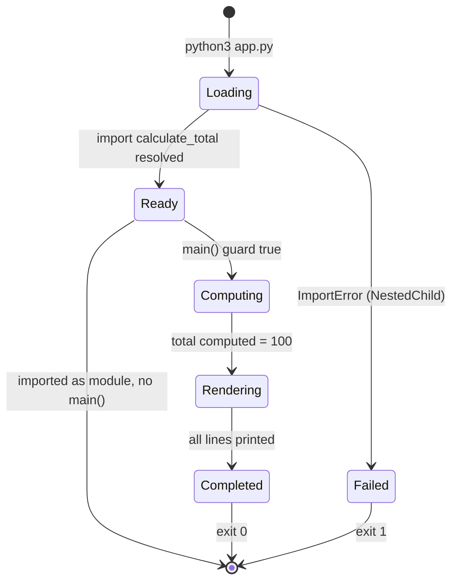
```mermaid
stateDiagram-v2
    [*] --> Loading: python3 app.py
    Loading --> Ready: import calculate_total resolved
    Loading --> Failed: ImportError (NestedChild)
    Ready --> Computing: main() guard true
    Ready --> [*]: imported as module, no main()
    Computing --> Rendering: total computed = 100
    Rendering --> Completed: all lines printed
    Completed --> [*]: exit 0
    Failed --> [*]: exit 1
```

**Data persistence, caching, and transaction boundaries.** The following table records each state concern against its implementation in the repository:

| State Concern | Implementation | Evidence |
|---------------|----------------|----------|
| In-memory state | Local variables `numbers`, `total`, `number`, discarded at process exit | `app.py` `main()`, `service.py` `calculate_total` |
| Data persistence point | None — no database, no file writes, no serialization | No file-open/write, ORM, or storage client anywhere in the code |
| Caching requirement | None — every run recomputes from the hard-coded literal | No memoization or cache store present |
| Transaction boundary | None — the process invocation is the sole (non-transactional) unit of work | No transactional resource exists to bound |

There are no persistence points because the program never writes to disk; the only files present are source files and the `large.csv` that is excluded by `.blitzyignore` and never referenced by the code. There is no caching layer and no transactional resource, so the computation is fully deterministic and repeatable — each invocation reproduces `Total: 100` from first principles.

### 4.3.2 Error Handling

The codebase contains **no explicit error handling** — there is no `try`/`except`, no custom exception, and no error-logging call anywhere in `app.py` or `service.py`. The one error condition that actually occurs is the `NestedChild` circular-import failure. The flowchart below traces that failure mode end to end, from launch to the exit-code-`1` termination.

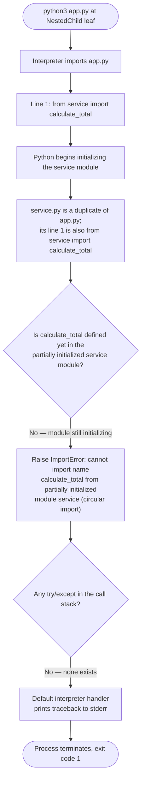
```mermaid
flowchart TD
    A(["python3 app.py at NestedChild leaf"]) --> B["Interpreter imports app.py"]
    B --> C["Line 1: from service import calculate_total"]
    C --> D["Python begins initializing the service module"]
    D --> E["service.py is a duplicate of app.py;<br/>its line 1 is also from service import calculate_total"]
    E --> F{"Is calculate_total defined yet in the<br/>partially initialized service module?"}
    F -->|"No — module still initializing"| G["Raise ImportError: cannot import name<br/>calculate_total from partially initialized<br/>module service (circular import)"]
    G --> H{"Any try/except in the call stack?"}
    H -->|"No — none exists"| I["Default interpreter handler<br/>prints traceback to stderr"]
    I --> J(["Process terminates, exit code 1"])
```

**Retry, fallback, notification, and recovery.** The section prompt's error-handling mechanisms map to the repository as follows:

| Capability | Present? | Evidence / Behavior |
|------------|----------|---------------------|
| `try`/`except` handling | No | No exception-handling construct exists in `app.py` or `service.py` |
| Retry mechanism | No | No loop, backoff, or re-attempt wraps the import or computation |
| Fallback process | No | No alternate module or default result is substituted on failure |
| Error notification flow | Default only | An uncaught exception causes the interpreter to print a traceback to stderr; there is no logging framework, alerting, or error-reporting integration |
| Logging / monitoring | No | No `logging` import, log statements, or metrics anywhere |
| Recovery procedure | Manual / operational | Replace the duplicated `NestedChild/service.py` with the correct computation module (or execute from a directory whose `service.py` defines `calculate_total`) |

**Failure mode summary.** The failure is deterministic and load-time, not runtime-data-dependent: because `NestedChild/service.py` is byte-identical to `app.py`, importing `service` executes `from service import calculate_total` against a module still in the middle of its own initialization, so the name is not yet bound and Python raises `ImportError: cannot import name 'calculate_total' from partially initialized module 'service' (most likely due to a circular import)`. With no handler present, the process exits with code `1`. The root and `ChildRepo` levels do not exhibit this failure because their `service.py` correctly defines the computation functions, allowing the import to resolve and the process to complete with exit code `0`.

## 4.4 References

The process flows, diagrams, and validation rules in this section were derived from direct inspection of the following repository files and folders, and from runtime verification on Python 3.12.3 (branch `1707`).

**Repository files examined:**

- `app.py` - Root console driver (F-003); established the `main()` orchestration, the top-level `from service import calculate_total` (line 1), the fixed input `[10, 20, 30, 40]`, the print sequence, and the `if __name__ == "__main__"` guard (line 15).
- `service.py` - Root computation module; established `calculate_total` (lines 1-7, accumulator loop, empty → `0`) for F-001 and `calculate_average` (lines 10-14, empty guard → `0`, else float mean) for F-002, and the F-002 → F-001 internal delegation.
- `.gitmodules` - Root submodule declaration (F-004-RQ-001) linking `ChildRepo` with `path` and `url`.
- `.blitzyignore` - Ignore rules (`*.csv`); confirmed the `large.csv` artifact is excluded and never referenced by the code, supporting the "no file persistence" finding.
- `ChildRepo/app.py` - Second-level driver; byte-identical to root `app.py` (md5 `a7f6989…`); confirmed the successful exit-`0` path at the `ChildRepo` level.
- `ChildRepo/service.py` - Second-level computation module; byte-identical to root `service.py` (md5 `12093c1…`).
- `ChildRepo/.gitmodules` - Second-level submodule declaration (F-004-RQ-002) linking `NestedChild`.
- `ChildRepo/NestedChild/app.py` - Leaf driver; byte-identical to root `app.py`.
- `ChildRepo/NestedChild/service.py` - The defect source; byte-for-byte duplicate of `app.py` (md5 `a7f6989…`) rather than the computation module, producing the circular-import `ImportError` and exit code `1` (F-004-RQ-003: leaf has no `.gitmodules`).

**Repository folders examined:**

- `` (repository root) - Established the top-level layout (`app.py`, `service.py`, `.gitmodules`, `.blitzyignore`, `README.md`) and the entry point for the root execution flow.
- `ChildRepo/` - Confirmed the second level of the submodule chain and its replicated file set.
- `ChildRepo/NestedChild/` - Confirmed the leaf level (no `.gitmodules`) and the location of the circular-import defect.

**Cross-referenced Technical Specification sections:**

- `1.2 System Overview` - System framing (demonstration/reference implementation), major-component naming, success criteria, and the absence of KPIs/timing targets.
- `2.1 Feature Catalog` - Feature identifiers F-001…F-004, their priorities/status, and global constraints C-1…C-5 (including the C-2 execution precondition).
- `2.2 Functional Requirements` - Requirement identifiers (F-XXX-RQ-YYY), acceptance criteria, and the validation-rule taxonomy (Business Rules / Data Validation / Security / Compliance) with the "not applicable" determinations for security and compliance.
- `2.3 Feature Relationships` - The four integration points and the intra-process/checkout-time integration model used in Section 4.1.2.

# 5. System Architecture

## 5.1 High-Level Architecture

This section establishes the architectural big picture of the system. Every statement is grounded in the repository's source files — `app.py`, `service.py`, and `.gitmodules` at each of the three repository levels — and in runtime behavior verified on CPython 3.12.3. The system is deliberately minimal, so the architecture is documented faithfully at that scale: enterprise concerns that are frequently present in larger systems (persistence, caching, networking, authentication, orchestration) are absent here and are reported as explicit, evidence-based absences rather than assumed capabilities.

### 5.1.1 System Overview

**Overall architecture style and rationale.** The system is a **single-process, single-threaded, procedural Python console application** built exclusively on the CPython standard library. There is no application framework, long-running service, or runtime infrastructure of any kind. Each of the three repository levels (Root, `ChildRepo`, `ChildRepo/NestedChild`) is an independently runnable script invoked directly as `python3 app.py`. Reverse-engineered from the code, the rationale for this style is scope-driven: the entire functional task is to sum a fixed four-element list and print the result, so a monolithic script paired with one pure computation helper is the minimal structure that satisfies the requirement. No distribution, message passing, durable state, or concurrency is required by the task, and none is implemented (consistent with Sections 1.2 and 4.1).

**Key architectural principles and patterns.** The following patterns are directly observable in the source:

- **Separation of concerns (layered split).** Pure, side-effect-free computation is isolated in `service.py`, while all input/output (printing) is confined to `main()` in `app.py`. The computation layer has zero knowledge of presentation.
- **Explicit dependency via module import.** The driver depends on the computation module through a single load-time binding, `from service import calculate_total` (`app.py` line 1) — the only import statement anywhere in the codebase.
- **Safe importability (main-guard pattern).** The `if __name__ == "__main__": main()` guard (`app.py` lines 15–16) allows the module to be imported without executing the workflow, while still running when invoked directly.
- **Composition over packaging.** Reuse across levels is expressed by nesting whole repositories as Git submodules (`.gitmodules`) rather than by a shared or published library. Root and `ChildRepo` sources are byte-identical (md5 `a7f6989…` for `app.py`, `12093c1…` for `service.py`); each level restates the code.
- **Determinism.** With a fixed input literal and no external state, every successful run reproduces `Total: 100` from first principles.

**System boundaries and major interfaces.** The system has one runtime boundary and one checkout-time boundary:

- **Process boundary (runtime).** One operating-system process per invocation; all state is in-memory and discarded at exit.
- **Input interface.** No external input source exists — the input is a hard-coded list literal `[10, 20, 30, 40]` (`app.py` line 4). There are no command-line arguments, standard input reads, files, environment variables, or configuration.
- **Output interface.** The single external side effect is plain text written to the operating-system standard-output stream via the `print()` builtin.
- **Internal component interface.** The contract between the driver and the computation module is the import binding `from service import calculate_total` together with the `calculate_total(numbers)` call.
- **Checkout-time boundary.** Git submodule remotes over HTTPS, declared in `.gitmodules`, assemble the nested working tree. This is a repository-composition concern handled by the Git client, not a runtime interface of the running program.

### 5.1.2 Core Components

The system comprises four architectural components. To respect the four-column limit, the requested "Critical Considerations" attribute is presented in a companion table immediately below the primary component table.

| Component | Primary Responsibility | Key Dependencies |
|-----------|------------------------|------------------|
| Console driver — `app.py` (F-003) | Provide the fixed input, orchestrate the computation, and render results to stdout under a `__main__` guard | `service.calculate_total`; CPython `print()` builtin |
| Computation module — `service.py` (F-001, F-002) | Expose the pure functions `calculate_total` (summation) and `calculate_average` (mean) | None — the module has no imports |
| Submodule composition — `.gitmodules` (F-004) | Declare nested submodule paths and remote URLs linking the three repository levels | Git client with submodule support |
| CPython runtime + standard output | Host the process and carry its output text | Python 3 interpreter (verified 3.12.3) |

The integration points and critical considerations for each component are:

| Component | Integration Points | Critical Considerations |
|-----------|--------------------|-------------------------|
| Console driver — `app.py` | Imports the `service` module; writes six lines to OS stdout | Must run from a directory containing a valid `service.py` for the top-level import to resolve; hard-coded input fixes behavior; no argument/stdin/config path |
| Computation module — `service.py` | Imported by `app.py`; `calculate_average` calls `calculate_total` internally | `calculate_average` is never invoked by any driver (dead code); no input validation or type hints; `calculate_total` returns `0` for empty input |
| Submodule composition — `.gitmodules` | Git HTTPS remotes at checkout time; recorded gitlink commit pointers | At the `NestedChild` leaf the replicated `service.py` is a duplicate of `app.py`, so that level fails at import (circular import, exit 1); the leaf has no `.gitmodules` |
| CPython runtime + stdout | Hosts `app.py`/`service.py`; stdout stream to the terminal | Requires Python 3.6+ (f-strings); no version pin exists in the repository; stdout is the only output sink — no logging or metrics |

### 5.1.3 Data Flow Description

**Primary data flow between components.** The system executes a single, linear, fully in-process data pipeline. `main()` in `app.py` creates the list literal `[10, 20, 30, 40]` (line 4) and passes it by reference to `calculate_total(numbers)` (line 6). `calculate_total` (`service.py` lines 2–7) initializes an accumulator to `0`, adds each element in order, and returns the integer total (`100`). `main()` then formats and prints `Total: 100` (line 8), iterates the same list printing each element on its own line (lines 10–11), and prints `Application completed` (line 13). Data therefore flows one way in (the list argument) and one way out (the integer return), and finally to standard output.

**Integration patterns and protocols.** The only inter-component "protocol" at runtime is a **Python function call across a module-import boundary** — the load-time `from service import calculate_total`. There is no serialization, wire protocol, inter-process communication, or network transport of any kind. The single cross-repository integration pattern is **Git submodule composition**, exchanged over HTTPS at checkout time rather than at runtime.

**Data transformation points.** Two transformations occur on the runtime path:

- **Reduction** — the list of integers is reduced to a single integer sum inside `calculate_total` (`service.py`).
- **Text serialization** — the integer total is formatted into the string `Total: {total}` via an f-string, and each integer is converted to its printed text representation by `print()`. (`calculate_average` would additionally transform the sum into a floating-point mean via division, but it is not on any runtime path.)

**Key data stores and caches.** There are **none**. All state is transient, in-memory local data (`numbers`, `total`, `number`) that exists only for the duration of one process invocation and is discarded at exit, consistent with Section 4.3.1. No database, file write, serialization target, memoization, or cache layer exists in any module; every run recomputes the result from the hard-coded literal. The only non-source data artifact in the tree is a `.csv` file that is excluded by `.blitzyignore` and is never referenced by any code.

### 5.1.4 External Integration Points

The running program performs **no runtime external integration** — there are no network sockets, HTTP clients or servers, databases, message queues, or file I/O anywhere in the code (confirmed across Sections 1.2, 2.3, and 4.1). The only external touchpoints are (a) Git submodule remotes consumed at checkout time and (b) the operating-system standard-output stream at runtime, both hosted on the CPython execution platform. To respect the four-column limit, service-level expectations are described in prose beneath the table.

| System | Integration Type | Protocol / Format | Data Exchange Pattern |
|--------|------------------|-------------------|------------------------|
| `600K_ChildRepo` Git remote | Repository composition (checkout-time) | HTTPS / Git; `.gitmodules` INI-style config | Recursive submodule fetch of recorded gitlink `a1c6294` |
| `600K_Nested_ChildRepo` Git remote | Repository composition (checkout-time, nested) | HTTPS / Git; `.gitmodules` INI-style config | Recursive submodule fetch of gitlink `915ff60` (recorded, not initialized in this checkout) |
| OS standard output (stdout) | Runtime output stream | Plain-text lines via `print()` | One-way write (six lines on the successful path) |
| CPython interpreter + standard library | Execution platform | Python 3 (verified 3.12.3) | In-process hosting of `app.py` and `service.py` |

**SLA requirements.** No service-level agreements, availability targets, latency budgets, or throughput requirements are defined anywhere in the repository (confirmed in Section 1.2.3). The two checkout-time Git fetches depend on the external availability of the public GitHub remotes declared in `.gitmodules`, but no availability or performance target is stated for them. The runtime process makes no external calls, is short-lived, and is fully synchronous, so no runtime SLA applies or can be asserted without fabrication.

## 5.2 Component Details

This section details each major architectural component and provides the required interaction, state-transition, and sequence diagrams. The system has three documentable components — the console driver, the computation module, and the submodule composition — hosted on the CPython 3 execution platform. The diagrams here are architecture-centric and complement the process-flow diagrams in Sections 4.1 and 4.3 rather than repeating them.

### 5.2.1 Console Driver — `app.py` (F-003)

- **Purpose and responsibilities.** The entry point and orchestration/presentation layer. It supplies the fixed input, invokes the computation, and renders the results to standard output. It owns every I/O side effect in the system.
- **Technologies and frameworks.** Pure CPython 3 (verified on 3.12.3), standard library only. It uses language builtins — `print()`, f-strings (requiring Python 3.6+), `for` iteration, and the `if __name__ == "__main__"` guard idiom. No third-party framework is used or referenced.
- **Key interfaces and APIs.** It **consumes** the `service` module through `from service import calculate_total` (line 1) and the call `calculate_total(numbers)` (line 6). It **exposes** a single public, parameterless function `main()` (line 3) with no return value. Its externally observable contract is a six-line stdout output on success (`Total: 100`, then `10`, `20`, `30`, `40`, then `Application completed`), invoked via the command `python3 app.py`.
- **Data persistence requirements.** None. It uses only the transient local variables `numbers`, `total`, and `number`; nothing is written to disk, serialized, or retained after the process exits.
- **Scaling considerations.** Single-threaded, synchronous, and O(n) over the input list (n = 4). There is no concurrency, parallelism, or resource pooling. Because the driver is stateless apart from its stdout side effect, independent invocations do not interfere and could be run in parallel as separate processes, but nothing in the code coordinates, batches, or distributes work.

### 5.2.2 Computation Module — `service.py` (F-001, F-002)

- **Purpose and responsibilities.** The pure computation layer. It exposes two side-effect-free functions — `calculate_total(numbers)` (summation) and `calculate_average(numbers)` (arithmetic mean) — and performs no I/O.
- **Technologies and frameworks.** Pure CPython 3 with **no imports at all**; it relies only on builtins (`len`, arithmetic operators, `for`). No framework is present.
- **Key interfaces and APIs.** The public API is two module-level functions. `calculate_total(numbers)` (lines 1–7) initializes an accumulator to `0`, adds each element, and returns the sum (an `int` for integer input, `0` for an empty iterable). `calculate_average(numbers)` (lines 10–14) returns `0` for a falsey input, otherwise `calculate_total(numbers) / len(numbers)` (a `float`), and calls `calculate_total` internally. Only `calculate_total` is imported by any driver; `calculate_average` is defined but never invoked at runtime.
- **Data persistence requirements.** None. The functions are pure, holding no state beyond the local `total` accumulator; results are neither cached nor stored.
- **Scaling considerations.** The summation is a single O(n) pass; computing the average re-sums the list (a second O(n) pass). Both functions are deterministic and referentially transparent, so their outputs are memoizable in principle, but no cache is implemented or required. They carry no shared mutable state, so they are inherently free of concurrency hazards.

### 5.2.3 Submodule Composition — `.gitmodules` (F-004)

- **Purpose and responsibilities.** Declares the nested submodule linkage that composes the three repository levels into a single working tree. This is a checkout-time structural component, not a runtime one.
- **Technologies and frameworks.** Git submodules, configured through the INI-style `.gitmodules` file (`path` and `url` keys). The root links `ChildRepo` (remote `600K_ChildRepo.git`); `ChildRepo` links `NestedChild` (remote `600K_Nested_ChildRepo.git`). The `NestedChild` leaf has no `.gitmodules`.
- **Key interfaces and APIs.** The Git submodule mechanism — `.gitmodules` entries plus recorded gitlink commit pointers (`ChildRepo` at `a1c6294`; `NestedChild` at `915ff60`). It is consumed via `git clone --recurse-submodules` or `git submodule update --init --recursive`.
- **Data persistence requirements.** The gitlink pointers and `.gitmodules` configuration are persisted in Git metadata and history at checkout time; the running program itself persists nothing.
- **Scaling considerations.** Composition depth scales by adding submodule levels, each fetched recursively. The current chain is three levels deep, with the leaf uninitialized in this checkout (`git submodule status` shows it prefixed `-`). Deeper nesting increases clone/fetch time and widens the surface for the source-duplication defect observed at the leaf.

### 5.2.4 Component Interaction Diagram

The diagram below shows how the components of a single runnable level interact within one CPython process, plus the checkout-time composition edge. It complements the repository-topology view in Section 1.2.2 by focusing on runtime interaction edges and responsibilities.

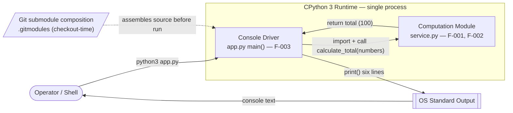
```mermaid
flowchart LR
    Operator(["Operator / Shell"])
    Compose[/"Git submodule composition<br/>.gitmodules (checkout-time)"/]
    subgraph Runtime["CPython 3 Runtime — single process"]
        direction TB
        Driver["Console Driver<br/>app.py main() — F-003"]
        Service["Computation Module<br/>service.py — F-001, F-002"]
        Driver -->|"import + call calculate_total(numbers)"| Service
        Service -->|"return total (100)"| Driver
    end
    Stdout[["OS Standard Output"]]
    Operator -->|"python3 app.py"| Driver
    Driver -->|"print() six lines"| Stdout
    Stdout -->|"console text"| Operator
    Compose -.->|"assembles source before run"| Driver
```

### 5.2.5 State Transition Diagram

The diagram models the driver/process lifecycle from launch to termination, including the successful terminal state (exit 0), the import-failure terminal state at the `NestedChild` leaf (exit 1), and the import-only "idle" path when the guard is false. It complements Section 4.3.1 by expanding the driver's internal rendering states.

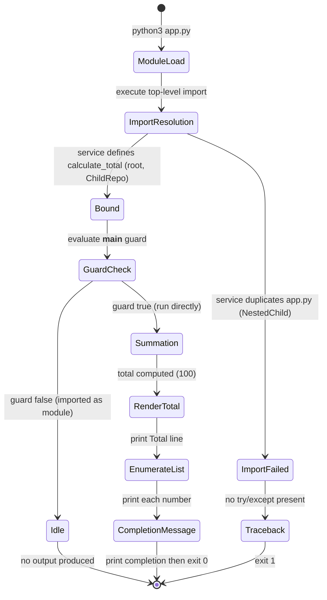
```mermaid
stateDiagram-v2
    [*] --> ModuleLoad: python3 app.py
    ModuleLoad --> ImportResolution: execute top-level import
    ImportResolution --> Bound: service defines calculate_total (root, ChildRepo)
    ImportResolution --> ImportFailed: service duplicates app.py (NestedChild)
    Bound --> GuardCheck: evaluate __main__ guard
    GuardCheck --> Idle: guard false (imported as module)
    GuardCheck --> Summation: guard true (run directly)
    Summation --> RenderTotal: total computed (100)
    RenderTotal --> EnumerateList: print Total line
    EnumerateList --> CompletionMessage: print each number
    CompletionMessage --> [*]: print completion then exit 0
    ImportFailed --> Traceback: no try/except present
    Traceback --> [*]: exit 1
    Idle --> [*]: no output produced
```

### 5.2.6 Sequence Diagram — Compute-and-Render Flow

The sequence diagram traces the internal call flow of the successful run at the root and `ChildRepo` levels, highlighting the accumulator loop inside `calculate_total` and the three print operations in `main()`. The load-time import-failure branch at the `NestedChild` leaf is documented in Sections 4.1.2 and 4.3.2 and is not repeated here.

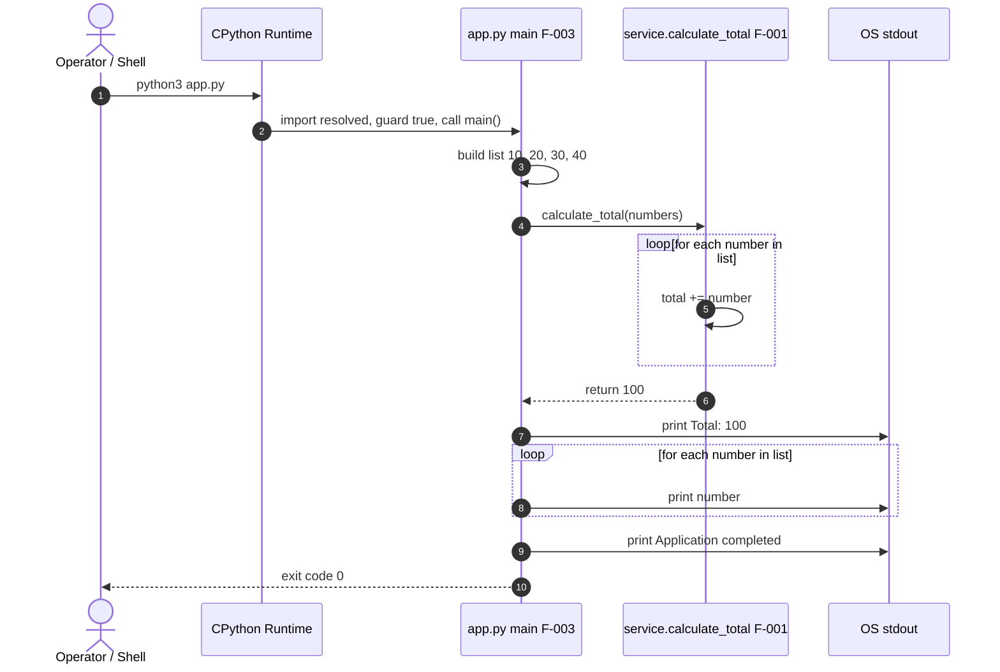
```mermaid
sequenceDiagram
    autonumber
    actor Op as Operator / Shell
    participant PY as CPython Runtime
    participant APP as app.py main F-003
    participant SVC as service.calculate_total F-001
    participant OUT as OS stdout

    Op->>PY: python3 app.py
    PY->>APP: import resolved, guard true, call main()
    APP->>APP: build list 10, 20, 30, 40
    APP->>SVC: calculate_total(numbers)
    loop for each number in list
        SVC->>SVC: total += number
    end
    SVC-->>APP: return 100
    APP->>OUT: print Total: 100
    loop for each number in list
        APP->>OUT: print number
    end
    APP->>OUT: print Application completed
    APP-->>Op: exit code 0
```

## 5.3 Technical Decisions

The repository contains no design documents, RFCs, or ADRs of its own — the three `README.md` files hold only single-line titles. The decisions below are therefore **reverse-engineered from the implemented code and configuration** and are presented as "as-built" decisions: each is inferred from what the code does and, equally important, from what it deliberately omits. No rationale, tradeoff, or consequence is asserted that is not directly supported by observed evidence.

### 5.3.1 Key Decisions and Tradeoffs

The table summarizes the five decision areas requested by the specification. Detailed rationale follows beneath it.

| Concern | As-Built Decision | Rationale (evidence) | Tradeoff / Consequence |
|---------|-------------------|----------------------|-------------------------|
| Architecture style | Single-process, single-threaded procedural console script | Task is to sum a fixed list and print; only `app.py` + `service.py` exist; no external actors | Trivial to run and reason about, but no packaging for reuse, no scalability, and source is duplicated across levels |
| Communication pattern | In-process function call over a module import (`from service import calculate_total`) | The only import in the codebase; no network, IPC, or messaging present | Zero serialization/latency overhead, but tight coupling to file layout — must run from a directory with a valid `service.py` |
| Data storage | None — transient in-memory locals only | No database, file write, or serialization anywhere in the code | Deterministic and infrastructure-free, but no durability, history, or state between runs |
| Caching | None — recompute from the literal every run | No memoization or cache store; computation is O(n) over four elements | Maximum simplicity with negligible cost at this scale; no meaningful benefit is forgone |
| Security mechanism | None implemented; relies on the OS process boundary and the absence of any runtime external surface | No authentication, authorization, cryptography, network, or secrets; only public HTTPS Git remotes at checkout | Very small attack surface (no runtime input or network), but no defense-in-depth and no input validation |

**Architecture style decisions and tradeoffs.** The as-built choice is the smallest architecture that satisfies the task: a directly runnable script (`app.py`) with one computation helper (`service.py`). Alternatives such as a packaged/installable library, a long-running service or HTTP API, or a multi-service design are not implemented — there is no manifest, server, or interface for them. The tradeoff is stark clarity and zero operational overhead at the cost of reuse and scalability; notably, "reuse" is achieved by duplicating whole repositories via submodules (Section 5.3.2, ADR-004), which is what allows the `NestedChild` copy to diverge and break.

**Communication pattern choices.** The single communication mechanism is a synchronous, in-process Python function call bound at load time through `from service import calculate_total`. This is the lowest-overhead option and is appropriate given that the driver and computation live in the same process. Its tradeoff is coupling to the filesystem layout: the import resolves `service` from the script's own directory, so the program must be launched from a directory that contains a valid `service.py`. This exact coupling is the root of the `NestedChild` failure, where `service.py` is a duplicate of `app.py`.

**Data storage solution rationale.** No storage solution is used because none is needed: the input is a hard-coded literal and the output is stdout. Introducing a database or file store would add infrastructure and failure modes with no functional benefit for a deterministic four-element computation. The consequence is that the system holds no state between runs and produces no persisted artifact.

**Caching strategy justification.** No caching is implemented. The computation is a single O(n) pass over four integers, so the cost of recomputing on every run is negligible and a cache would add complexity (invalidation, storage) without measurable gain. Because the functions are pure and deterministic, memoization would be *correct* if ever warranted, but it is unwarranted at this scale.

**Security mechanism selection.** No security mechanism is present, and the rationale — reverse-engineered from the code — is the near-total absence of an attack surface at runtime: there is no external input (fixed literal), no network or file I/O, no secrets, and no privileged operation. The only external interaction is the checkout-time fetch of the two **public** GitHub submodule remotes over HTTPS, declared without credentials in `.gitmodules`. The relevant residual risk is therefore not a runtime security control but a **composition-integrity** issue: the duplicated `NestedChild/service.py` demonstrates that submodule content can diverge from expectations, which teams should mitigate with source-integrity review rather than a runtime guard.

### 5.3.2 Architecture Decision Records (ADRs)

The following ADRs capture the significant decisions embodied in the current implementation. Each status is recorded as **As-built / Accepted**, meaning the decision is observed in the shipped code rather than proposed.

| ADR | Decision | Status | Key Consequence |
|-----|----------|--------|-----------------|
| ADR-001 | Single-process, procedural console application | As-built / Accepted | Minimal and deterministic; no scalability or service surface |
| ADR-002 | Separate pure computation (`service.py`) from I/O (`app.py`) | As-built / Accepted | Clean, testable core; coupling expressed through the import path |
| ADR-003 | Standard-library-only, zero third-party dependencies | As-built / Accepted | No supply-chain or version-management burden; no framework features |
| ADR-004 | Reuse via nested Git submodules rather than a shared package | As-built / Accepted | Whole-repository composition; source duplication and the leaf defect |
| ADR-005 | Hard-coded input with stdout-only output | As-built / Accepted | Fully deterministic; not configurable or reusable as a data tool |
| ADR-006 | No explicit error handling (rely on interpreter default) | As-built / Accepted | Maximum simplicity; unhandled `ImportError` at `NestedChild` (exit 1) |

- **ADR-001 — Single-process procedural console application.** *Context:* the task is a one-shot arithmetic computation with console output. *Decision:* implement it as a directly executable script rather than a service, library, or distributed system. *Consequences:* the system is easy to run and fully deterministic, but offers no horizontal scaling, packaging, or API.
- **ADR-002 — Separate computation from I/O.** *Context:* the driver needs a result to print. *Decision:* isolate pure functions in `service.py` and confine all printing to `main()` in `app.py`. *Consequences:* the computation core is side-effect-free and independently testable; the dependency is expressed as a load-time import, which couples execution to the working directory.
- **ADR-003 — Standard-library-only, zero dependencies.** *Context:* the computation needs only arithmetic and printing. *Decision:* use no third-party packages and provide no dependency manifest. *Consequences:* there is nothing to install, pin, or audit for vulnerabilities, but also no framework capabilities (routing, ORM, logging) are available.
- **ADR-004 — Reuse via nested Git submodules.** *Context:* the same program is represented at three repository levels. *Decision:* compose whole repositories as nested submodules (`.gitmodules`) instead of publishing a shared package. *Consequences:* levels can evolve independently, but the source is duplicated (byte-identical at root and `ChildRepo`) and one copy (`NestedChild/service.py`) has diverged into a duplicate of `app.py`, breaking that level.
- **ADR-005 — Hard-coded input, stdout-only output.** *Context:* a demonstration computation. *Decision:* embed the list `[10, 20, 30, 40]` in `main()` and emit results only to stdout. *Consequences:* runs are perfectly repeatable, but the program cannot process arbitrary data without code changes.
- **ADR-006 — No explicit error handling.** *Context:* the happy path at the root and `ChildRepo` levels never raises. *Decision:* add no `try`/`except`, validation, or logging; rely on the interpreter's default handler. *Consequences:* the code stays minimal, but the one real failure — the `NestedChild` circular import — surfaces as an uncaught traceback with exit code `1` (detailed in Section 4.3.2).

### 5.3.3 Decision Tree — Architecture Selection

The decision tree traces how the observed requirements lead to the as-built architecture. At each branch, the alternative (`Yes`) paths are labeled as *not implemented*, so the tree documents the reasoning without asserting capabilities that do not exist in the code.

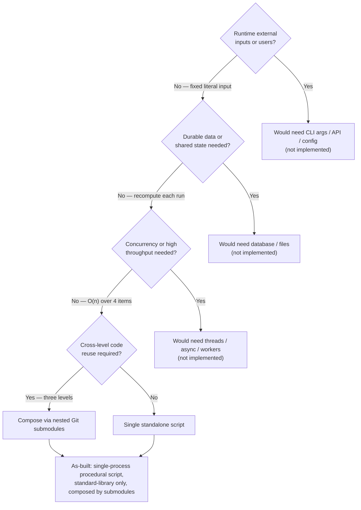
```mermaid
flowchart TD
    Q1{"Runtime external<br/>inputs or users?"}
    Q1 -->|"No — fixed literal input"| Q2{"Durable data or<br/>shared state needed?"}
    Q1 -->|"Yes"| ALT1["Would need CLI args / API / config<br/>(not implemented)"]
    Q2 -->|"No — recompute each run"| Q3{"Concurrency or high<br/>throughput needed?"}
    Q2 -->|"Yes"| ALT2["Would need database / files<br/>(not implemented)"]
    Q3 -->|"No — O(n) over 4 items"| Q4{"Cross-level code<br/>reuse required?"}
    Q3 -->|"Yes"| ALT3["Would need threads / async / workers<br/>(not implemented)"]
    Q4 -->|"Yes — three levels"| ASUB["Compose via nested Git submodules"]
    Q4 -->|"No"| ASINGLE["Single standalone script"]
    ASUB --> RESULT["As-built: single-process procedural script,<br/>standard-library only, composed by submodules"]
    ASINGLE --> RESULT
```

## 5.4 Cross-Cutting Concerns

Cross-cutting concerns that are standard in production systems are, for this repository, almost entirely **absent by design** — the system is a short-lived, standard-library-only console program with no service surface, no state, and no external runtime dependencies. Each concern below is documented as observed: where a mechanism is absent it is reported as an evidence-based absence together with its operational implication, and where a real behavior exists (the interpreter's default error handling) it is documented precisely. The table gives an at-a-glance view; the subsections that follow provide detail.

| Concern | Implemented? | Observed Behavior / Evidence |
|---------|--------------|------------------------------|
| Monitoring & observability | No | Only signals are the process exit code and stdout text; no metrics, health checks, or instrumentation |
| Logging & tracing | No | No `logging` import or log/trace statements; results go to stdout via `print()`; a traceback goes to stderr on failure |
| Error handling | Default only | No `try`/`except` anywhere; interpreter default handler; the `NestedChild` `ImportError` yields exit code `1` |
| Authentication & authorization | No | No users, credentials, or access control; the runtime exposes no protected resource |
| Performance requirements / SLAs | None defined | O(n) over four items in a single synchronous pass; no latency/throughput/availability targets anywhere |
| Disaster recovery | None (stateless) | No state or service to recover; source is recoverable from Git; the `NestedChild` defect is fixed by restoring a valid `service.py` |

### 5.4.1 Monitoring and Observability

No monitoring or observability approach is implemented. There are no metrics, counters, health-check endpoints, readiness/liveness probes, or telemetry exporters anywhere in the code (consistent with Section 2.3.4). For a one-shot console process, the only observable signals are the **process exit code** (`0` for the successful root and `ChildRepo` runs, `1` for the `NestedChild` failure) and the **text emitted to stdout/stderr**. Operationally, "observing" this system means capturing those two signals from the shell; there is no dashboard, no alerting, and no runtime state to inspect.

### 5.4.2 Logging and Tracing

No logging or tracing strategy exists. The codebase contains no `import logging`, no logger configuration, no log statements, and no distributed-tracing constructs (spans, correlation IDs, or context propagation). The `print()` calls in `main()` are **application output, not structured logging** — they carry the computed result rather than diagnostic events. The only diagnostic artifact the system can produce is the **traceback written to stderr** by the interpreter when the `NestedChild` import fails; it is not routed to any log sink, file, or aggregator.

### 5.4.3 Error Handling Patterns

There is **no explicit error-handling pattern** in the code — no `try`/`except`, no custom exception types, no retry, no fallback, and no error-notification flow (consistent with Section 4.3.2). Error handling is therefore whatever the CPython default handler provides. On the successful path (root and `ChildRepo`), no exception is raised for the fixed input, and `calculate_total` returns `0` for an empty list without error. The one real failure is the `NestedChild` load-time circular import: because `NestedChild/service.py` is a byte-for-byte duplicate of `app.py`, the top-level `from service import calculate_total` re-enters the partially initialized `service` module, raising `ImportError` that, with no handler present, prints a traceback to stderr and exits with code `1`. The diagram below models the complete error surface, showing both where an error arises and the single (default) path it follows to termination.

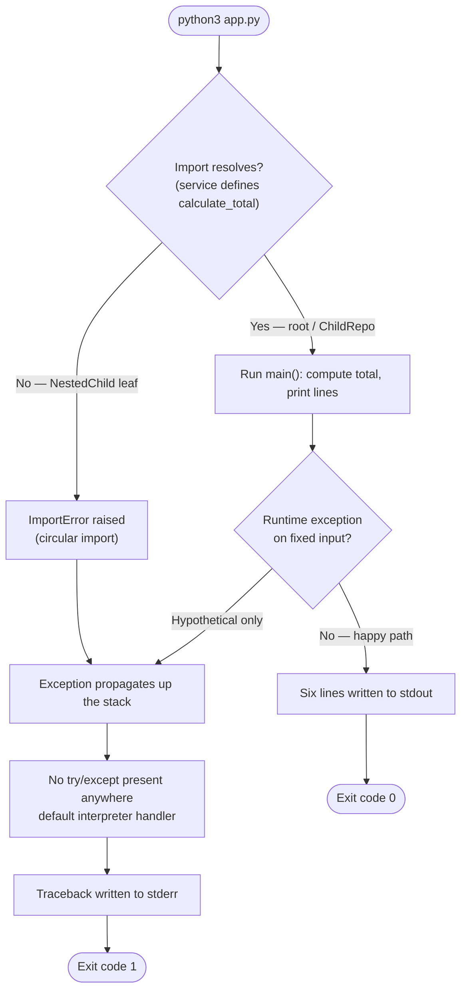
```mermaid
flowchart TD
    Start(["python3 app.py"]) --> Imp{"Import resolves?<br/>(service defines calculate_total)"}
    Imp -->|"No — NestedChild leaf"| Err1["ImportError raised<br/>(circular import)"]
    Imp -->|"Yes — root / ChildRepo"| Run["Run main(): compute total, print lines"]
    Run --> RunErr{"Runtime exception<br/>on fixed input?"}
    RunErr -->|"No — happy path"| Ok["Six lines written to stdout"]
    RunErr -->|"Hypothetical only"| Prop["Exception propagates up the stack"]
    Err1 --> Prop
    Prop --> NoHandler["No try/except present anywhere<br/>default interpreter handler"]
    NoHandler --> Trace["Traceback written to stderr"]
    Trace --> Exit1(["Exit code 1"])
    Ok --> Exit0(["Exit code 0"])
```

### 5.4.4 Authentication and Authorization

No authentication or authorization framework is present, and none is applicable: the runtime program has no users, sessions, credentials, roles, tokens, or protected resources, and it performs no network or privileged operations. The only credential-adjacent facet of the system is that the submodule remotes in `.gitmodules` are **public HTTPS GitHub URLs declared without credentials**, so composition relies on anonymous, read-only clone access at checkout time. Who may execute the script is governed entirely by the operating system's file and process permissions, which are outside the application's own scope.

### 5.4.5 Performance Requirements and SLAs

No performance requirements or SLAs are defined anywhere in the repository (confirmed in Sections 1.2.3 and 4.1.1). The workload is trivial and bounded: an O(n) summation followed by an O(n) print loop over a fixed four-element list, executed on a single thread with no waits, timeouts, retries, or asynchronous work. There are no latency budgets, throughput targets, concurrency limits, or availability objectives to state, and none can be asserted without fabrication. Performance is effectively dominated by interpreter start-up rather than by the computation itself.

### 5.4.6 Disaster Recovery

No disaster-recovery procedures are encoded, and the system's stateless nature makes most DR concerns inapplicable: there are no backups, replicas, failover targets, or recovery objectives (RPO/RTO) because there is **no persistent state or long-running service to recover**. Two forms of recovery are nonetheless relevant and evidence-based: (1) **source recovery** — every level's code is recoverable from Git, with the submodule remotes recorded in `.gitmodules` and pinned gitlink commits (`ChildRepo` at `a1c6294`, `NestedChild` at `915ff60`); and (2) **defect recovery** — the known `NestedChild` failure is remediated operationally by replacing the duplicated `NestedChild/service.py` with a correct computation module (or by executing from a directory whose `service.py` defines `calculate_total`), as described in Section 4.3.2. A fresh run is idempotent and immediate, so effective recovery from a failed invocation is simply to correct the source and re-run.

## 5.5 References

The following repository artifacts, Technical Specification sections, and verification evidence were examined and cited in the preparation of Section 5.

**Repository source files**

- `app.py` — Root console driver / entry point (F-003); established `main()`, the fixed input `[10, 20, 30, 40]`, the `from service import calculate_total` binding, and the six-line stdout contract.
- `service.py` — Root computation module (F-001, F-002); established `calculate_total` (summation) and the unused `calculate_average` (mean).
- `ChildRepo/app.py` — First-level submodule driver; byte-identical to root `app.py` (md5 `a7f6989…`).
- `ChildRepo/service.py` — First-level submodule computation module; byte-identical to root `service.py` (md5 `12093c1…`).
- `ChildRepo/NestedChild/app.py` — Leaf-level driver; byte-identical to root `app.py`.
- `ChildRepo/NestedChild/service.py` — The anomalous duplicate of `app.py` (md5 `a7f6989…`) that causes the leaf's circular-import `ImportError`.

**Configuration, metadata, and documentation files**

- `.gitmodules` — Root submodule declaration linking `ChildRepo` (remote `https://github.com/lakshya-blitzy/600K_ChildRepo.git`).
- `ChildRepo/.gitmodules` — Nested submodule declaration linking `NestedChild` (remote `https://github.com/lakshya-blitzy/600K_Nested_ChildRepo.git`).
- `README.md`, `ChildRepo/README.md`, `ChildRepo/NestedChild/README.md` — Single-line title documents (`# app.py`, `# 600K_ChildRepo`, `# 600K_Nested_ChildRepo`); confirmed the absence of design/usage documentation.
- `.blitzyignore` (root, `ChildRepo/`, `ChildRepo/NestedChild/`) — Each contains only `*.csv`; confirmed the `.csv` artifact is excluded and unreferenced by code.

**Repository folders**

- `/` (repository root) — Top-level minimal Python console app and root submodule host.
- `ChildRepo/` — First submodule level (initialized at gitlink `a1c6294`).
- `ChildRepo/NestedChild/` — Leaf submodule level (recorded but uninitialized gitlink `915ff60`; no `.gitmodules`).

**Cross-referenced Technical Specification sections**

- `1.2 System Overview` — Project context, high-level description/topology, and the absence of KPIs/objectives (1.2.3).
- `2.3 Feature Relationships` — Integration points, shared components, and common services (2.3.2, 2.3.4).
- `4.1 System Workflows` — High-level workflow and integration sequence diagrams (4.1.1, 4.1.2).
- `4.3 Technical Implementation` — State management (4.3.1) and error-handling (4.3.2) baselines used to keep Section 5 diagrams complementary.

**Verification evidence (runtime and tooling)**

- CPython 3.12.3 execution — Confirmed successful runs at root and `ChildRepo` (`Total: 100`, exit `0`) and the `NestedChild` circular-import failure (exit `1`).
- `git submodule status --recursive` — Confirmed the nested composition and recorded gitlink pointers (`ChildRepo` at `a1c6294`; `ChildRepo/NestedChild` at `915ff60`, uninitialized).
- Source inspection (`md5sum`, import/usage grep) — Confirmed byte-identity across levels, the single `from service import calculate_total` import, the unused `calculate_average`, and the absence of manifests, frameworks, databases, caching, networking, logging, error handling, authentication, tests, CI/CD, and containerization.

# 6. SYSTEM COMPONENTS DESIGN

## 6.1 Core Services Architecture

### 6.1.1 Applicability Assessment and Architectural Classification

**Core Services Architecture is not applicable for this system.**

The repository does not implement — and its single, bounded task does not require — microservices, a distributed architecture, or any distinct, independently deployable service components. Every one of the three repository levels (Root, `ChildRepo`, and `ChildRepo/NestedChild`) is the same artifact: a single-process, single-threaded, synchronous CPython console application that is invoked directly as `python3 app.py`, computes the sum of a hard-coded four-element list, prints the result to standard output, and exits. There is no long-running service, no network surface, no inter-process communication, and no runtime infrastructure of any kind. This classification is fully consistent with Section 5.1 (High-Level Architecture), which documents the system as a "single-process, single-threaded, procedural Python console application," and with Section 1.3.2 (Scope — Out-of-Scope), which records networking, APIs, messaging, persistence, authentication, and concurrency as demonstrably absent.

Because there is no service topology to describe, the concerns enumerated in this section's scope — inter-service communication, service discovery, load balancing, circuit breakers, auto-scaling, failover, and service degradation — have no runtime surface in this codebase. Rather than leave the section empty, the sub-sections that follow record each of the three scoped areas (Service Components in 6.1.2, Scalability Design in 6.1.3, Resilience Patterns in 6.1.4) and document, with direct repository evidence, precisely why each concern is absent or reduces to a trivial in-process or operational equivalent. The required diagrams are retained and are used to illustrate the *actual* (non-service) architecture so a reader can see concretely why the service-oriented concepts do not apply.

#### 6.1.1.1 Observed Architecture and Component Classification

At runtime the system consists of exactly one operating-system process per invocation, holding all state in memory and discarding it at exit. Within that process, the console driver in `app.py` calls one pure computation helper in `service.py` through a single load-time import binding (`from service import calculate_total`, `app.py` line 1) and then writes six plain-text lines to standard output. There is exactly one runtime boundary — the process boundary — and one checkout-time boundary formed by the Git submodule remotes declared in `.gitmodules`.

The table below classifies each architectural element of the system and states whether it constitutes a deployable service. Notably, despite its filename, `service.py` is not a network or deployable "service": it is an ordinary Python module of pure functions consumed by an in-process `import`.

| Architectural Element | What It Actually Is | Is It a Deployable/Network Service? |
|-----------------------|---------------------|-------------------------------------|
| `app.py` — console driver (F-003) | In-process entry point; orchestrates compute + stdout under a `__main__` guard | No — a script's `main()` run to completion |
| `service.py` — computation module (F-001, F-002) | In-process pure-function library (`calculate_total`, `calculate_average`) | No — imported code, invoked by function call, not an endpoint |
| `.gitmodules` — submodule composition (F-004) | Declares nested source-repository links over HTTPS | No — clone/checkout-time source composition |
| CPython runtime + stdout | Execution host and single output stream | No — runtime platform, not an addressable service |

#### 6.1.1.2 Basis for the Non-Applicability Determination

The determination is evidence-based. The table maps the defining indicators of a service-oriented or distributed architecture against what the repository actually contains. A comprehensive scan of all six in-scope `.py` files found the only import statement anywhere to be the local `from service import calculate_total`; there are no infrastructure or manifest files (no Dockerfile, Kubernetes/compose manifests, Terraform, or dependency manifests) present.

| Service-Architecture Indicator | Present? | Evidence in Repository |
|--------------------------------|----------|------------------------|
| Multiple independently deployable services | No | One `app.py` + one `service.py` per level; a single process per run |
| Network / IPC communication (HTTP, gRPC, messaging) | No | No sockets, HTTP, or queue code; sole import is `from service import calculate_total` |
| Service discovery / registry | No | No registry client, DNS-SD, or config; import resolves from the local directory |
| Load balancing / reverse proxy | No | Single process, single invocation; no proxy, LB, or fan-out |
| Circuit breakers / retry / fallback | No | No `try`/`except`, retry, or fallback logic in any module |
| Independent per-service data stores | No | No database, file I/O, or state; input is a hard-coded list literal |
| Containerization / orchestration | No | No Dockerfile, Kubernetes/compose manifests, or IaC files |

Because none of these indicators is present, the system is classified as a single-process console application — a monolith at the smallest possible scale — and the remainder of Section 6.1 documents the scoped service-architecture concerns as evidence-based absences.

#### 6.1.1.3 Service Interaction Model and Submodule Composition

The following diagram is the "service interaction" view rendered for the *actual* architecture. It shows that all meaningful interaction occurs inside one process as a synchronous function call, that the only external touchpoint at runtime is the standard-output stream, and that the inter-service channels one would document for a distributed system (network APIs, messaging, service discovery, load balancing) are absent from the repository.

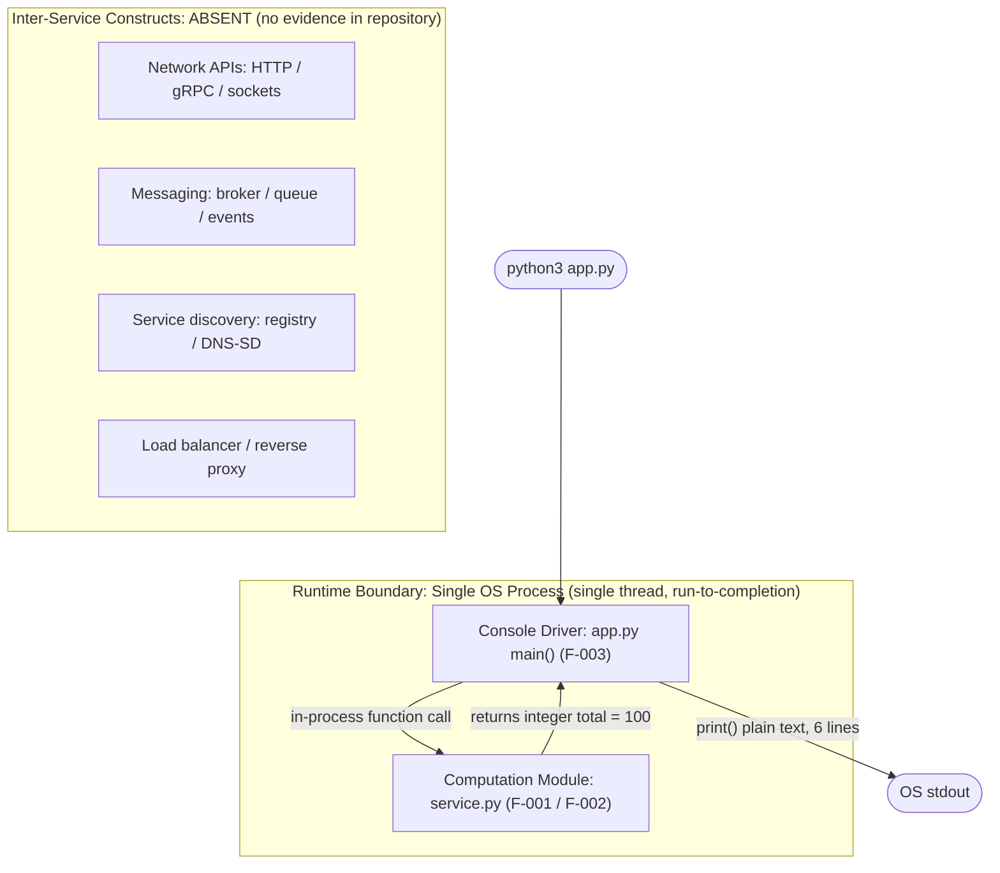
```mermaid
flowchart TD
    subgraph Proc["Runtime Boundary: Single OS Process (single thread, run-to-completion)"]
        Driver["Console Driver: app.py main() (F-003)"]
        Comp["Computation Module: service.py (F-001 / F-002)"]
        Driver -->|"in-process function call"| Comp
        Comp -->|"returns integer total = 100"| Driver
    end
    Invoke(["python3 app.py"]) --> Driver
    Driver -->|"print() plain text, 6 lines"| Out(["OS stdout"])
    subgraph Absent["Inter-Service Constructs: ABSENT (no evidence in repository)"]
        Net["Network APIs: HTTP / gRPC / sockets"]
        Bus["Messaging: broker / queue / events"]
        Disc["Service discovery: registry / DNS-SD"]
        LB["Load balancer / reverse proxy"]
    end
```

**Diagram 6.1-1 — Actual service-interaction model (single bounded context).** The conceptual grouping labeled "Absent" enumerates the distributed-system channels that do not exist here; they are shown only to make the non-applicability concrete.

The multi-repository structure could superficially suggest a distributed system, but it is not one. The `.gitmodules` files link three repositories — Root → `ChildRepo` → `ChildRepo/NestedChild` — over public HTTPS remotes that are resolved by the Git client at clone/checkout time, before any code runs (consistent with Section 5.1.1's "composition over packaging" and Section 1.3.1's Git-submodule integration). The linked repositories are not deployed, network-addressable, or communicating processes; at runtime each level is executed independently as its own isolated single process. Consequently, the submodule chain is a source-tree composition mechanism, not a runtime service mesh, and it does not introduce any inter-service communication, discovery, or coordination concern.

### 6.1.2 Service Components Assessment

This sub-section addresses each service-component concern named in the section scope. None applies in the distributed sense because the system runs entirely inside one process; where a concern has a meaningful in-process analogue (boundaries, communication), that analogue is documented precisely, and where it has none (discovery, load balancing, circuit breaking, retry/fallback), the absence is recorded with evidence.

| Service-Component Concern | Applicable to This System? | In-Process Reality / Evidence |
|---------------------------|----------------------------|-------------------------------|
| Service boundaries & responsibilities | Only as code boundaries | Module split `app.py` (driver/I/O) vs `service.py` (computation); one process boundary |
| Inter-service communication | No | Single synchronous in-process call: `from service import calculate_total` then a function call/return |
| Service discovery | No | Python import resolution from the local directory; no registry, DNS-SD, or config |
| Load balancing | No | One process, one invocation, one fixed workload; no proxy, replica, or fan-out |
| Circuit breaker | No | No failure detection or short-circuit state; no remote calls to protect; no `try`/`except` |
| Retry & fallback | No | No retry/backoff loops and no fallback branch; an error propagates to exit code `1` |

#### 6.1.2.1 Service Boundaries and Responsibilities

There are no service boundaries. The only boundaries in the system are (a) an intra-process **module boundary** between the console driver (`app.py`) and the computation module (`service.py`), and (b) the single **operating-system process boundary**. Responsibilities are cleanly separated along the module boundary, as documented in Section 5.1.1: `app.py` owns orchestration and all input/output — it defines the fixed input list `[10, 20, 30, 40]`, invokes the computation, and prints results via `print()` — while `service.py` owns pure, side-effect-free computation (`calculate_total` performs the summation, and `calculate_average` computes a mean). Notably, `calculate_average` is defined but never imported or invoked by any driver, so it is dead code on every runtime path (consistent with Section 5.1.2).

These are code-organization boundaries expressing separation of concerns, not service boundaries: neither module is independently deployable, independently versioned at runtime, or network-addressable. They share a single call stack, a single memory space, and a single lifecycle, and they are bound together at import time rather than integrated over any transport.

#### 6.1.2.2 Inter-Service Communication Patterns

There is no inter-service communication. The sole cross-component interaction at runtime is a **synchronous, in-process Python function call**. The driver binds the callee at module load through `from service import calculate_total` (`app.py` line 1 — the only import statement anywhere in the codebase) and then calls `calculate_total(numbers)`, receiving the integer result directly on the call stack. As documented in Section 5.1.3, no serialization, wire protocol, HTTP/gRPC exchange, message broker, event bus, shared memory, or inter-process communication is involved. Data flows one way in (the list passed by reference) and one way out (the integer total returned by value), entirely within one call stack; the only external side effect is one-way plain text written to standard output. There is therefore no communication pattern to secure, version, throttle, or trace at a service level.

#### 6.1.2.3 Service Discovery, Load Balancing, Circuit Breaking, and Retry/Fallback

The remaining four service-component concerns have no presence in the repository and no runtime surface to which they could apply:

- **Service discovery — none.** Component "location" is resolved statically by the Python import system when the module loads: the interpreter locates `service.py` on `sys.path` (in practice, the script's own directory) and binds `calculate_total`. This is static, local module resolution, not a discovery registry or DNS-based service location. The failure mode is instructive: at the `ChildRepo/NestedChild` leaf, `service.py` does not define `calculate_total` (it duplicates `app.py`), so resolution fails at import with an `ImportError` (see Sections 4.3.2 and 5.4.3).
- **Load balancing — none.** A single process executes the single, fixed workload in one synchronous pass. There is no replication, work queue, fan-out, reverse proxy, or load balancer, and therefore nothing to distribute or balance.
- **Circuit breaker — none.** There is no failure-detection logic, error-rate threshold, or short-circuit state machine, and there are no remote or fallible downstream calls that a breaker would protect. The codebase contains no `try`/`except` constructs at all (Section 5.4.3).
- **Retry and fallback — none.** There are no retry loops, backoff timers, or alternative fallback code paths. On the fixed input the happy path is deterministic and always succeeds; where an error can arise (the `NestedChild` import), it is neither retried nor handled — it propagates uncaught and terminates the process with exit code `1` (Sections 4.3.2 and 5.4.3).

### 6.1.3 Scalability Design Assessment

No scalability design is present in the system, and none is required by its fixed, trivial workload. This sub-section records each scalability concern from the section scope against the observed reality. The summary table gives the at-a-glance assessment; the diagram illustrates the actual run-to-completion execution model and the (unconfigured) scaling dimensions; the sub-sub-sections provide the detail. All statements are grounded in the repository and in the workload characterization already documented in Section 5.4.5.

| Scalability Concern | Configured in System? | Observed Reality / Evidence |
|---------------------|-----------------------|-----------------------------|
| Horizontal scaling | No | Stateless script could run as independent copies, but nothing coordinates them and the fixed workload needs none |
| Vertical scaling | Not applicable | Trivial, bounded CPU/memory footprint (O(n), n=4); no resource pressure to relieve |
| Auto-scaling triggers & rules | No | No metrics, thresholds, policies, or orchestrator; nothing to observe or trigger |
| Resource allocation strategy | OS-default only | Short-lived process; no limits/requests, cgroups, pools, or container/manifest |
| Performance optimization | Minimal by design | Explicit O(n) loop (not built-in `sum()`); no caching; time dominated by interpreter start-up |
| Capacity planning | None defined | No throughput/latency/availability targets or SLAs anywhere in the repository |

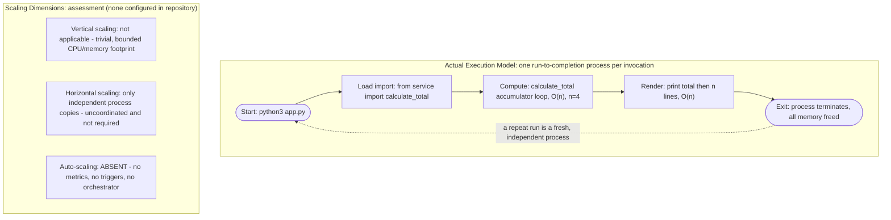
```mermaid
flowchart TD
    subgraph Exec["Actual Execution Model: one run-to-completion process per invocation"]
        S(["Start: python3 app.py"]) --> I["Load import: from service import calculate_total"]
        I --> C["Compute: calculate_total accumulator loop, O(n), n=4"]
        C --> P["Render: print total then n lines, O(n)"]
        P --> E(["Exit: process terminates, all memory freed"])
    end
    E -.->|"a repeat run is a fresh, independent process"| S
    subgraph Scale["Scaling Dimensions: assessment (none configured in repository)"]
        V["Vertical scaling: not applicable - trivial, bounded CPU/memory footprint"]
        H["Horizontal scaling: only independent process copies - uncoordinated and not required"]
        A["Auto-scaling: ABSENT - no metrics, no triggers, no orchestrator"]
    end
```

**Diagram 6.1-2 — Scalability architecture (actual execution model and scaling-dimension assessment).** The linear pipeline is the entire runtime lifecycle; the "Scaling Dimensions" grouping records that no scaling mechanism is configured.

#### 6.1.3.1 Horizontal and Vertical Scaling Approach

No scaling approach is designed or configured. The workload is fixed and trivial: `calculate_total` performs an O(n) accumulator loop and `main()` an O(n) print loop over a hard-coded four-element list, all on a single thread with no waits, timeouts, or asynchronous work (Section 5.4.5).

- **Vertical scaling** (allocating more CPU/RAM to the process) is not applicable. The process footprint is negligible and bounded by the four-element input plus a single integer accumulator; there is no resource pressure that scaling up would relieve.
- **Horizontal scaling** (adding instances) has no implemented mechanism. Because the program is completely stateless and deterministic (Section 5.1.1), the only conceivable horizontal model is executing additional independent copies of the script as separate operating-system processes. However, nothing in the repository coordinates, partitions, load-balances, or aggregates such copies, and the fixed single-list workload provides no reason to run more than one. Each invocation is fully isolated and recomputes the identical result from first principles.

#### 6.1.3.2 Auto-Scaling Triggers and Resource Allocation

- **Auto-scaling — none.** There are no metrics, health signals, utilization thresholds, scaling policies, or orchestration platform (no container runtime, Kubernetes/compose manifests, or cloud autoscaler), consistent with Section 1.3.2. There is nothing to observe and therefore nothing that could trigger a scale-out or scale-in event.
- **Resource allocation — OS-default only.** Each run is a short-lived process that receives whatever CPU and memory the operating system grants by default. The repository defines no resource requests or limits, cgroup constraints, thread pools, connection pools, or memory ceilings, because it contains no container image, deployment manifest, or configuration file of any kind (Sections 1.3.2 and 5.1.4). All resources are released in full the instant the process exits.

#### 6.1.3.3 Performance Optimization and Capacity Planning

- **Performance optimization — minimal by design.** The computation uses an explicit accumulation loop rather than the built-in `sum()`; Section 2.4 notes that `sum()` would be marginally faster, so the code favors clarity over micro-optimization. There is no caching or memoization — every run recomputes the total from the hard-coded literal (Section 5.1.3) — and no batching, pooling, lazy evaluation, or concurrency. As recorded in Section 5.4.5, end-to-end time is dominated by interpreter start-up rather than by the arithmetic itself.
- **Capacity planning — none defined and none required.** No throughput, latency, concurrency, or availability targets exist anywhere in the repository (Sections 1.2.3 and 5.4.5), so there are no capacity figures to plan against. The working set is bounded by the fixed four-integer input plus one integer accumulator, and each process terminates immediately after printing, so the system imposes no sustained capacity demand. Meaningful capacity guidance would first require introducing variable input, a workload profile, and explicit performance targets — none of which the current code contains.

### 6.1.4 Resilience Patterns Assessment

No resilience patterns are implemented in the code, which is expected for a stateless, short-lived console program with no service surface and no external runtime dependencies. This sub-section records each resilience concern from the section scope, distinguishing genuine (interpreter-default) behavior from absent mechanisms, and documents the two evidence-based recovery paths that do exist operationally. The assessment is consistent with Sections 5.4.3 (error handling) and 5.4.6 (disaster recovery).

| Resilience Concern | Implemented? | Observed Reality / Recovery Evidence |
|--------------------|--------------|--------------------------------------|
| Fault tolerance mechanisms | No | No `try`/`except`, retry, fallback, or timeout; interpreter default handler; empty-list input returns `0` without error |
| Disaster recovery procedures | None (stateless) | No state/service to recover; source recoverable from Git; `NestedChild` defect fixed by restoring a valid `service.py` |
| Data redundancy approach | None (no runtime data) | Nothing to replicate; only source-code duplication across levels via submodule composition |
| Failover configuration | None | Single process; no standby, replica, or promoted backup; outcome is binary |
| Service degradation policies | None | No partial/degraded mode or feature flags; full success (exit `0`) or full failure (exit `1`) |

```mermaid
flowchart TD
    subgraph Recovery["Recovery Model: stateless and idempotent (operational, per Section 5.4.6)"]
        FixSrc["Restore a valid service.py (defect recovery) or clone source from the Git remote"]
        Rerun["Re-run as a fresh, independent process"]
        FixSrc --> Rerun
    end
    Run(["Invocation: python3 app.py"]) --> Detect{"Fault encountered?"}
    Detect -->|"No: root / ChildRepo on fixed input"| Ok(["Full success: 6 lines to stdout, exit 0"])
    Detect -->|"Yes: NestedChild circular import"| NoPat["No in-process resilience pattern: no retry, fallback, circuit breaker, failover, or degraded mode"]
    NoPat --> Fail(["Uncaught ImportError, traceback to stderr, exit 1"])
    Fail --> FixSrc
    Rerun --> Detect
```

**Diagram 6.1-3 — Resilience pattern implementation (fault model and manual, idempotent recovery loop).** The diagram shows that no automated in-process resilience pattern exists between fault detection and process termination, and that recovery is an operational re-run after correcting the source.

#### 6.1.4.1 Fault Tolerance and Service Degradation

**Fault tolerance.** The code contains no fault-tolerance mechanisms — there are no `try`/`except` blocks, custom exception types, retries, fallbacks, timeouts, or bulkheads anywhere (Section 5.4.3). Error handling is therefore entirely the CPython default handler. On the successful path (Root and `ChildRepo`), the fixed input never raises an exception, and `calculate_total` even tolerates an empty list gracefully by returning `0` rather than erroring — a small, incidental robustness property noted in Section 5.4.3, although the drivers always pass the non-empty fixed list. The one real fault — the `NestedChild` load-time circular import — is not tolerated: it surfaces as an uncaught `ImportError` and terminates the process.

**Service degradation.** There is no service-degradation policy and no partial or degraded operating mode. The program's outcome is binary: it either completes the entire workflow and exits `0`, or it fails and exits `1` (Section 5.4.3). There are no feature flags, no optional subsystems that could be shed under pressure, and no reduced-functionality path. With a single synchronous workflow and no load or downstream dependency, graceful degradation has neither a trigger nor a target.

#### 6.1.4.2 Failover Configuration and Data Redundancy

**Failover.** No failover is configured. There is a single process with no standby instance, replica, secondary node, or health-checked primary/backup arrangement, and no orchestrator that could promote a replacement. A failed invocation is simply a failed invocation; recovery is a manual re-run (see 6.1.4.3), not an automated failover.

**Data redundancy.** No data-redundancy approach exists, because there is no runtime data to make redundant. The system is stateless, holding only transient in-memory values that are discarded at exit, with no database, file, cache, or replicated store (Sections 5.1.3 and 5.4.6). The only redundancy present is at the **source-code** level: `app.py` and `service.py` are byte-identical across the Root and `ChildRepo` levels, because each level restates the code rather than sharing a packaged library (Section 5.1.1). This duplication is a composition characteristic, not a resilience mechanism — and, tellingly, an *erroneous* duplication is precisely what breaks the `NestedChild` level, where `service.py` is a copy of `app.py` rather than the computation module.

#### 6.1.4.3 Disaster Recovery Procedures

No disaster-recovery procedures are encoded, and the system's stateless nature makes conventional DR (backups, replicas, RPO/RTO objectives) inapplicable — there is no persistent state or long-running service to recover (Section 5.4.6). Two evidence-based recovery paths nonetheless exist and are reflected in Diagram 6.1-3:

- **Source recovery.** Every level's code is recoverable from Git; the submodule remotes are recorded in `.gitmodules` and pinned to specific gitlink commits (`ChildRepo` at `a1c6294`, `NestedChild` at `915ff60`), so the working tree can be reassembled by cloning with submodules (Sections 5.1.4 and 5.4.6).
- **Defect recovery.** The known `NestedChild` failure is remediated operationally by replacing the duplicated `NestedChild/service.py` with a correct computation module — or by executing from a directory whose `service.py` defines `calculate_total` — as described in Sections 4.3.2 and 5.4.6.

Because every run is idempotent and immediate, recovery from a failed invocation is simply to correct the source and re-run: a fresh, independent process then reproduces the deterministic result (`Total: 100` on the successful levels) with no residual state to reconcile.

### 6.1.5 References

The following repository artifacts and Technical Specification sections were examined and cited as evidence for the determinations in Section 6.1. No external (web) sources were required, and no `.csv` files were accessed (all are excluded by `.blitzyignore`).

**Repository source files (direct evidence).**

- `app.py` — the console driver / entry point present at each level; established the sole `import` (`from service import calculate_total`), the `main()` orchestration, the hard-coded input, and stdout-only output
- `service.py` — the computation module (`calculate_total`, `calculate_average`); confirmed it is dependency-free, side-effect-free, and returns `0` for empty input (`calculate_average` is unused)
- `.gitmodules` (repository root and `ChildRepo/`) — established the Root → `ChildRepo` → `NestedChild` submodule composition and its public HTTPS remotes; confirmed it is checkout-time source linkage, not a runtime service topology
- `ChildRepo/app.py`, `ChildRepo/service.py` — confirmed the `ChildRepo` level is a byte-identical, independently runnable copy (source redundancy)
- `ChildRepo/NestedChild/service.py` — the defective duplicate of `app.py` that causes the `NestedChild` circular-import failure (exit code `1`), used as the illustrative fault throughout

**Repository folders (structure and evidence of absence).**

- `` (repository root) — established the top-level structure and the absence of any Dockerfile, dependency manifest, IaC, CI/CD, or service/orchestration configuration
- `ChildRepo/` — first submodule level; mirrors the root layout
- `ChildRepo/NestedChild/` — leaf submodule level; has no `.gitmodules`

**Cross-referenced Technical Specification sections.**

- 1.2.3 System Overview (Success Criteria) — no KPIs, SLAs, or measurable objectives defined
- 1.3.1 / 1.3.2 Scope — in-scope Git-submodule composition; out-of-scope networking/APIs/messaging, persistence, authentication, concurrency, containers, and CI/CD
- 2.4 Implementation Considerations — explicit accumulation loop versus the built-in `sum()`
- 4.3.2 Technical Implementation (Error Handling) — the `NestedChild` circular-import failure and its remediation
- 5.1 High-Level Architecture (5.1.1–5.1.4) — architecture style, core components, data flow, and external integration points
- 5.4 Cross-Cutting Concerns (5.4.3, 5.4.5, 5.4.6) — error handling, performance requirements/SLAs, and disaster recovery

## 6.2 Database Design

### 6.2.1 Applicability Determination and Data-Handling Overview

**Database Design is not applicable to this system.**

The repository implements a single-process CPython console application whose entire behavior is to sum a fixed, hard-coded list of integers and print the results to standard output. It declares no database engine, no persistent data store, no object-relational mapper (ORM), no schema, no migration tooling, and no cache tier. Every unit of application state is an ordinary in-memory Python object that exists only for the duration of one interpreter invocation and is released when the process exits. The only durable artifacts in the entire repository are its version-controlled source files.

This determination is drawn from an exhaustive inspection of all six in-scope Python source files — `app.py` and `service.py` at the root, `ChildRepo/`, and `ChildRepo/NestedChild/` levels — together with every configuration and manifest location in the tree. It is fully consistent with **Section 3.3 (Databases, Storage, and Third-Party Services)**, which records that no database of any kind is present or referenced, and with **Section 6.1 (Core Services Architecture)**, which classifies the system as a single-process, run-to-completion console application. Data persistence, storage, and database connectivity are also explicitly enumerated among the out-of-scope concerns in **Section 1.3.2**.

#### Persistence Indicator Assessment

Because "Database Design" presupposes a persistence tier, the table below records the standard indicators of such a tier and the direct repository evidence for their absence. A repository-wide search across all `*.py`, `*.txt`, `*.cfg`, `*.ini`, `*.toml`, `*.yaml`, `*.yml`, `*.json`, `*.env`, `*.md`, and `*.sql` locations returned zero matches for any database, ORM, driver, cache, or storage token.

| Persistence Indicator | Present? | Evidence in Repository |
| --- | --- | --- |
| Relational or NoSQL database engine | No | No engine referenced; no `.sql`, `.db`, or `.sqlite` files exist anywhere in the tree |
| ORM / query builder / data-mapper | No | No import of `sqlalchemy`, `django`, `sequelize`, `typeorm`, `prisma`, or `pymongo`; the only import in the codebase is the local `from service import calculate_total` |
| Database driver / connector | No | No `psycopg`, `mysqlclient`, `sqlite3`, `pymongo`, or `redis` import in any of the six `.py` files |
| Connection string / DSN / credentials | No | No `.env`, settings module, or configuration file exists; the code holds no host, port, user, or password literal |
| Schema / DDL / migration artifacts | No | No `.sql` files, no `migrations/`, `alembic/`, or `prisma/` directories anywhere in scope |
| Cache tier (Redis / Memcached) | No | No cache client imported or configured |
| Object / blob / file storage | No | No `boto3`, S3, or blob-storage client present |
| File input/output | No | Zero `open()`, `read()`, or `write()` calls exist; the sole side effect of the program is `print()` to `stdout` |
| Dependency manifest declaring data libraries | No | No `requirements.txt`, `pyproject.toml`, `setup.py`, `Pipfile`, or lockfile exists at any level |

#### Runtime Data-Handling Overview

The complete "data" handled by the system is a small set of transient, in-memory Python objects created and consumed within a single call to `main()` in `app.py`. None of these objects is serialized, indexed, keyed, or written to any durable medium. The table below is the exhaustive inventory of application state.

| In-Memory Element | Python Type | Value at Runtime | Lifetime |
| --- | --- | --- | --- |
| `numbers` (`app.py` L4) | `list[int]` | `[10, 20, 30, 40]` | Single process invocation |
| `total` (`service.py` L2–L7) | `int` | `100` | Single process invocation |
| `number` loop variable (`app.py` L10) | `int` | `10`, `20`, `30`, `40` in turn | Single loop iteration |
| Rendered output lines (`app.py` L8, L11, L13) | `str` | `"Total: 100"`, `"10"`…`"40"`, `"Application completed"` | Transient — written to `stdout` |

The end-to-end movement of this data is depicted in Diagram 6.2-1. The `numbers` literal is created in the console driver (`app.py`), passed by reference to the computation module (`service.py`), reduced to a single integer accumulator, formatted into plain-text lines, and emitted to the operating system's standard-output stream. No branch of this flow reaches a database, file, cache, or network sink; on process exit, all in-memory objects are discarded.

```mermaid
flowchart TD
    Start(["Invocation: python3 app.py"]) --> Lit
    subgraph Proc["Single OS Process - in-memory only (no persistence tier)"]
        Lit["Source literal in app.py main() line 4:<br/>numbers = [10, 20, 30, 40]"]
        Acc["Transient accumulator in service.calculate_total:<br/>total = 0 then total += number (O of n)"]
        Fmt["Format results via print() in app.py"]
        Lit -->|"list passed by reference"| Acc
        Acc -->|"returns int total = 100"| Fmt
    end
    Fmt -->|"6 plain-text lines"| Out(["OS stdout (transient sink)"])
    Fmt -->|"on process exit"| Gone(["All in-memory data discarded<br/>no DB / file / cache written"])
```

*Diagram 6.2-1: End-to-end data flow. All data is ephemeral and confined to one process; no persistent store participates.*

A `.blitzyignore` policy at each repository level excludes `*.csv` artifacts from scope. Independently of that policy, no source file performs any file input/output — there is no `open()` call anywhere in the codebase — so no external file participates in the data flow and no `.csv` artifact is read, parsed, or referenced by the application. The system therefore has neither an internal database nor an external file-based data source.

The remaining sub-sections (6.2.2 through 6.2.5) address each area required by the Database Design template — schema design, data management, compliance, and performance optimization — and record, with evidence, why each is not applicable to a system that maintains no data at rest.

### 6.2.2 Schema Design

Schema design is not applicable to this system. There is no database, and therefore no tables, collections, documents, keyspaces, or schema definition language (DDL) of any kind. No `.sql` file, ORM model class, or migration script exists anywhere in the repository. The material below documents each schema-design concern from the template and records the direct evidence for its absence, modeling the program's transient in-memory objects only where doing so satisfies a required deliverable (the entity-relationship diagram).

#### 6.2.2.1 Entity Relationships and Data Models

The system persists no entities and defines no relationships between stored records. The computation module (`service.py`) declares only two plain functions — `calculate_total(numbers)` (L1–L7) and `calculate_average(numbers)` (L10–L14) — and neither defines a class, a data model, an ORM mapping, or a typed record structure. The console driver (`app.py`) constructs a single Python list literal and iterates it. There are consequently no primary keys, foreign keys, joins, cardinality rules, or referential constraints to describe.

To satisfy the required entity-relationship diagram (ERD) deliverable, Diagram 6.2-2 models the program's transient in-memory objects *as if* they were entities. This is a conceptual illustration only: the depicted "entities" are ordinary Python objects that exist for a single process invocation, carry no identity or key, are never written to a store, and are discarded at process exit.

```mermaid
erDiagram
    NUMBER_LIST ||--o{ LIST_ELEMENT : "contains (by position)"
    NUMBER_LIST {
        list numbers "transient in-memory literal"
        int length "fixed = 4 elements"
    }
    LIST_ELEMENT {
        int value "one of 10, 20, 30, 40"
    }
    RUNNING_TOTAL {
        int total "accumulator final value 100 (never stored)"
    }
```

*Diagram 6.2-2: Conceptual ERD of the transient in-memory data. These are Python objects, not database tables — there is no persistence, key, or storage engine behind them.*

The relationship shown (a `NUMBER_LIST` "contains" ordered `LIST_ELEMENT` values) is realized purely by Python list ordering established at `app.py` L4; `RUNNING_TOTAL` is the standalone accumulator produced by `service.py` L2–L7 and holds no reference to the list once computed. The literal value of the list is fixed in source (identified as constraint C-3 in **Section 2.1**), so the "data model" cannot vary at runtime and admits no external input.

#### 6.2.2.2 Indexing, Constraints, and Partitioning

**Indexing strategy.** No indexes exist because there is no queryable data at rest. There is no primary, secondary, composite, covering, full-text, or spatial index anywhere in the system.

| Index Target | Index Type | Status |
| --- | --- | --- |
| (none) | — | No database exists; zero indexes are defined or required |

**Constraints.** No database-level constraints exist. The only value-validation logic in the entire codebase is the empty-input guard inside `calculate_average` (`service.py` L11–L12), which returns integer `0` when the argument is falsy; this is an application-level defensive branch, not a schema constraint, and it is unreachable in the delivered execution path because `calculate_average` is never invoked by `app.py`. The table below documents every constraint category and its status.

| Constraint Category | Database-Level | Application-Level Analog |
| --- | --- | --- |
| Primary key | None | None — objects carry no identity |
| Foreign key / referential | None | None |
| Unique | None | None |
| Not-null / type | None | Implicit Python duck typing; no runtime validation |
| Check / domain | None | `calculate_average` empty-list guard returns `0` (`service.py` L11–L12) |

**Partitioning approach.** No data partitioning, sharding, or table partitioning applies, as there is no dataset at rest to divide. The only partitioning concept present in the repository is *source-code* partitioning across a three-level Git submodule chain (root → `ChildRepo` → `ChildRepo/NestedChild`, declared in the `.gitmodules` files and detailed in **Section 3.4**). That is a checkout-time composition mechanism for source files and is unrelated to runtime data partitioning.

#### 6.2.2.3 Replication Configuration and Backup Architecture

**Replication configuration.** No database replication is configured because there is no database. There is no primary/replica topology, no read replica, no write-ahead-log (WAL), oplog, or binlog shipping, and no clustering or quorum mechanism. Diagram 6.2-3 contrasts the two concepts a reader might conflate: the *source-code redundancy* that genuinely exists in this repository (identical `app.py` and `service.py` copies distributed across the submodule chain) versus the *database replication constructs* that are entirely absent.

```mermaid
flowchart TD
    subgraph SrcRedundancy["Source-code redundancy - checkout-time composition (NOT data replication)"]
        Root["Root repo: app.py + service.py (byte-identical)"]
        Child["ChildRepo submodule @ a1c6294:<br/>app.py + service.py (identical copy)"]
        Nested["NestedChild submodule @ 915ff60:<br/>app.py + service.py (defective duplicate)"]
        Root -->|".gitmodules HTTPS remote"| Child
        Child -->|".gitmodules HTTPS remote"| Nested
    end
    subgraph DataRepl["Database replication constructs: ABSENT (no evidence in repository)"]
        Primary["Primary / writer node"]
        Replica["Read replica / hot standby"]
        Ship["WAL / oplog / binlog shipping"]
    end
```

*Diagram 6.2-3: Replication architecture. The left cluster is source-file redundancy across Git submodules (a build-time trait); the right cluster lists database replication constructs that do not exist here.*

The byte-for-byte duplication of `app.py` (md5 `a7f6989…`) and `service.py` (md5 `12093c1e…`) across the root and `ChildRepo` levels is a source-composition characteristic (feature F-004), not a data-replication mechanism, and provides no runtime redundancy of any persisted state. Consistent with **Section 6.1.4.2**, this redundancy applies to source files at checkout time, not to data at run time. The `ChildRepo/NestedChild/service.py` copy is itself a defective duplicate of `app.py` (same `a7f6989…` hash rather than the computation module), which is why the nested application fails with a circular-import `ImportError` at startup (see **Section 4.3.2**).

**Backup architecture.** There is no data backup requirement because the system holds no data at rest — there is nothing to back up beyond the source code itself. Source-code durability is provided entirely by Git version control and the public HTTPS submodule remotes declared in `.gitmodules` (`https://github.com/lakshya-blitzy/600K_ChildRepo.git` and `https://github.com/lakshya-blitzy/600K_Nested_ChildRepo.git`). The submodules are pinned to specific commits — `ChildRepo` at `a1c6294…` and `ChildRepo/NestedChild` at `915ff60…` — which fixes exactly which source revision each level composes. This aligns with the stateless disaster-recovery posture documented in **Section 5.4.6**, in which recovery consists solely of restoring source from version control rather than restoring any database or data volume.

### 6.2.3 Data Management

Data management is not applicable to this system in the database sense. With no persistent store, there is no data to migrate, version, archive, cache, or retrieve from durable media. The only "storage and retrieval" that occurs is the construction and reading of an in-memory Python list within a single process, as shown in Diagram 6.2-1. Each template concern is addressed below with its supporting evidence.

**Migration procedures.** There is no schema and no data store, so there are no migrations. The repository contains no migration framework or directory (`alembic/`, `migrations/`, `prisma/migrations/`, Django migrations), no versioned DDL scripts, and no seed/fixture data files. Adding, removing, or reshaping "data" means editing a source literal (the `numbers` list at `app.py` L4) and committing the change through Git — there is no runtime migration path.

**Versioning strategy.** Versioning applies exclusively to source code, not to data. Source revisions are tracked in Git (the repository is on branch `1707`), and cross-repository composition is version-pinned through submodule gitlinks: `ChildRepo` is fixed at commit `a1c6294…` and `ChildRepo/NestedChild` at `915ff60…` (see **Section 3.4**). There is no data-schema version, no record-level version column, and no API/payload versioning, because the system exposes no schema, records, or interface.

**Archival policies.** No archival tier or policy exists. Because no records are ever written, there is nothing to age out, tier to cold storage, or purge. The application produces only transient standard-output text, which is not captured or retained by the program itself.

**Data storage and retrieval mechanisms.** Storage is limited to process memory. The list is *stored* by binding a literal to the local name `numbers` (`app.py` L4) and *retrieved* by passing that reference to `calculate_total` and by the subsequent `for number in numbers` iteration (`app.py` L10). Results are *rendered* — not stored — via `print()` to `stdout` (`app.py` L8, L11, L13). No `open()`, database query, network call, or cache lookup participates in either the storage or the retrieval path.

**Caching policies.** No caching layer of any kind is present: there is no in-process memoization, no `functools.lru_cache` decorator, and no external cache client (Redis, Memcached). Each invocation recomputes the sum from scratch in a single O(n) pass over the four-element list; there is no cache to populate, invalidate, or expire.

| Data-Management Concern | Status | Basis in Repository |
| --- | --- | --- |
| Migration procedures | Not applicable | No schema/store; no migration tooling or scripts exist |
| Versioning strategy | Source-only | Git branch `1707`; submodules pinned at `a1c6294…` / `915ff60…` |
| Archival policies | Not applicable | No records written; nothing to archive or purge |
| Storage & retrieval | In-memory only | List bound at `app.py` L4; read via `calculate_total` and `for` loop; results to `stdout` |
| Caching policies | None | No memoization and no cache client in any of the six `.py` files |

### 6.2.4 Compliance Considerations

Database-related compliance considerations are not applicable to this system, because compliance obligations of this class attach to stored data, and this system stores no data. There are no records at rest, no personal or sensitive information, no credentials, and no data-access surface to govern. Each template concern is nonetheless documented below so the absence is explicit and auditable.

**Data retention rules.** No retention policy exists or is required. The only data the program creates are the transient in-memory objects inventoried in Section 6.2.1, all of which are released at process exit; nothing is written to durable media, so there is no retention period to define, enforce, or expire.

**Backup and fault-tolerance policies.** No data backup is required, as there is no data at rest to protect. Fault tolerance for the *source* is provided by Git version control and the public HTTPS submodule remotes recorded in `.gitmodules`, with each level pinned to a specific commit (`ChildRepo` at `a1c6294…`, `ChildRepo/NestedChild` at `915ff60…`). The runtime is stateless and run-to-completion, so recovery from any failure is simply re-invocation; consistent with **Section 5.4.6**, disaster recovery entails restoring source from version control rather than any database or data volume.

**Privacy controls.** No privacy controls are needed because the system processes no personal data. The only values handled are the hard-coded integers `10, 20, 30, 40` (`app.py` L4). Consistent with **Section 3.3**, the codebase holds no secrets, credentials, connection strings, API keys, or tokens, and it opens no listening port, so there is no confidential data flow to encrypt, mask, or redact.

**Audit mechanisms.** No audit mechanism exists. The system implements no logging, tracing, or audit-trail facility (there is no use of the `logging` module and no audit sink); its sole observable output is the six plain-text lines printed to `stdout`. There is no data-access event to record because there is no data store to access.

**Access controls.** No database access-control model (users, roles, grants, row-level security) exists, because there is no database. As documented in **Section 5.4.5**, access to the program is governed entirely by the host operating system's file and process permissions over the source files and the interpreter; the application enforces no authentication or authorization of its own.

| Compliance Concern | Status | Basis in Repository |
| --- | --- | --- |
| Data retention rules | Not applicable | No persisted data; all state released at process exit |
| Backup & fault tolerance | Source-only, stateless | Git remotes + pinned submodules; recovery is re-invocation (Section 5.4.6) |
| Privacy controls | Not applicable | Only hard-coded integers; no PII, secrets, or credentials (Section 3.3) |
| Audit mechanisms | None | No `logging`/audit facility; output limited to `stdout` |
| Access controls | OS-level only | No DB/auth model; governed by OS file/process permissions (Section 5.4.5) |

### 6.2.5 Performance Optimization

Database performance optimization is not applicable to this system. Every technique in this category presupposes a database, queries, or connections — none of which exist here. The system's only computation is a single synchronous O(n) accumulation over a fixed four-element list (`service.py` L2–L7), which runs to completion in one pass with no I/O wait. No performance targets, throughput goals, or latency budgets are defined for the system (see **Section 1.2.3**, which records that no KPIs or SLAs exist). Each optimization concern is documented below with its evidence.

**Query optimization patterns.** There are no queries to optimize. The system issues no SQL, no query-builder calls, and no query plans; data access is a direct Python list iteration, not a query against an engine that could be tuned, explained, or indexed.

**Caching strategy.** No caching is used at any layer. Because the workload is a fixed, trivial computation executed once per invocation, there is no result set, page, or object to cache; the sum is recomputed each run. (This mirrors the "no caching policies" finding in Section 6.2.3.)

**Connection pooling.** No connection pool exists because the system opens no connections. There is no database, socket, or network client to pool; the process performs only local, in-memory work and writes to `stdout`.

**Read/write splitting.** Read/write splitting is not applicable, as there is neither a database nor a primary/replica topology to route reads and writes across. All "reads" and "writes" are ordinary in-memory variable accesses within a single thread of one process.

**Batch processing approach.** There is no batch-processing subsystem. The application processes one fixed, in-memory list in a single pass per invocation; there is no batching, chunking, bulk-insert, queue, or job-scheduling mechanism. The summation is implemented as an explicit accumulator loop rather than the Python built-in `sum()` (a design characteristic noted in **Section 2.4**), but this is a stylistic choice on a four-element input and carries no persistence or batch-throughput implication.

| Optimization Technique | Applicable? | Rationale |
| --- | --- | --- |
| Query optimization | No | No queries; access is direct list iteration |
| Caching strategy | No | Fixed trivial workload recomputed per run; nothing to cache |
| Connection pooling | No | No database, socket, or network connections are opened |
| Read/write splitting | No | No database or primary/replica topology exists |
| Batch processing | No | Single fixed O(n) pass over four integers per invocation |

### 6.2.6 References

The following repository artifacts and previously authored specification sections were examined as the evidentiary basis for this section.

**Repository files and folders**

- `app.py` — Root console driver (F-003); established the hard-coded list literal `[10, 20, 30, 40]` (L4), the in-memory summation call (L6), the `stdout`-only output via `print()` (L8, L11, L13), and the `__main__` guard (L15–L16). Confirmed the complete absence of file/database I/O.
- `service.py` — Root computation module (F-001/F-002); established the pure in-memory `calculate_total` accumulator (L1–L7) and the unused `calculate_average` with its empty-input guard (L10–L14). Confirmed no imports, no persistence, and no I/O.
- `.gitmodules` — Declared the `ChildRepo` submodule and its public HTTPS remote; established that the only external references are development-time Git remotes, not runtime data services.
- `ChildRepo/` — First-level submodule (pinned at commit `a1c6294…`); contained byte-identical `app.py`/`service.py` copies, evidencing source-code redundancy rather than data replication.
- `ChildRepo/.gitmodules` — Declared the `NestedChild` submodule and its HTTPS remote, completing the three-level composition chain.
- `ChildRepo/NestedChild/` — Leaf submodule (recorded at commit `915ff60…`); contained the defective `service.py` duplicate that produces the startup circular-import failure.
- `ChildRepo/NestedChild/service.py` — Byte-for-byte duplicate of `app.py` (md5 `a7f6989…`); evidenced that the "service" module here is not the computation module.
- `.blitzyignore` (root, `ChildRepo/`, `ChildRepo/NestedChild/`) — Each excludes `*.csv`; confirmed CSV artifacts are out of scope and, independently, unreferenced by any code.
- `README.md` (each level) — Minimal single-line headings; contained no schema, data, or configuration information.

**Technical Specification sections cross-referenced**

- `Section 1.2.3 Success Criteria` — Confirmed no KPIs or SLAs are defined for the system.
- `Section 1.3.2 Out-of-Scope` — Confirmed data persistence and database connectivity are explicitly out of scope.
- `Section 2.1 Feature Catalog` — Source of constraint C-3 (the hard-coded input list).
- `Section 2.4 Implementation Considerations` — Basis for the explicit accumulator vs. built-in `sum()` design note.
- `Section 3.3 Databases, Storage, and Third-Party Services` — Primary consistency anchor: no database is present or referenced; no secrets/credentials are held.
- `Section 3.4 Development and Deployment Tooling` — Basis for the Git submodule composition and commit-pinning description.
- `Section 4.3.2 Technical Implementation` — Basis for the `NestedChild` circular-import `ImportError` (exit code 1).
- `Section 5.4.5 Cross-Cutting Concerns (Access)` — Basis for the OS-level file/process access-control statement.
- `Section 5.4.6 Cross-Cutting Concerns (Disaster Recovery)` — Basis for the stateless recovery / source-from-Git posture.
- `Section 6.1 Core Services Architecture` — Sibling "not applicable" pattern and terminology; Section 6.1.4.2 established that source-code redundancy is a composition trait, not a data-replication mechanism.

## 6.3 Integration Architecture

### 6.3.1 Applicability Determination and Integration Landscape

**Integration Architecture is not applicable for this system.**

The repository does not integrate with any external system or service at runtime. Every level of the three-level submodule chain (Root, `ChildRepo`, and `ChildRepo/NestedChild`) is the same artifact: a single-process, single-threaded, synchronous CPython console application invoked as `python3 app.py`. It reads a hard-coded four-element list, computes a sum in memory, writes six plain-text lines to standard output, and exits. It opens no socket, binds no port, issues no network request, reads no file, and consumes no third-party API, SDK, message broker, or cloud service. An exhaustive, case-insensitive scan of all six in-scope `.py` files, both `.gitmodules` files, and the `README.md` files found the only cross-boundary references anywhere to be the two Git submodule remote URLs declared in `.gitmodules`; the sole `import` statement in the entire codebase is the local `from service import calculate_total`.

This determination is consistent with the sibling sections of this specification: Section 3.2 records zero frameworks and zero third-party dependencies; Section 3.3 states that the only external references in the repository are development-time Git submodule remotes, not runtime services; Section 5.1 characterizes the system as a single-process, single-threaded, procedural Python console application whose only inter-component protocol is a Python function call; Section 6.1 classifies the system as having no service topology; and Section 1.3.2 (Scope — Out-of-Scope) records networking, APIs, and messaging as demonstrably absent.

Because there is no runtime integration surface, the concerns enumerated in this section's scope — API protocol, authentication, authorization, rate limiting, versioning, and documentation; event, queue, stream, and batch message processing; and third-party, legacy, and gateway external systems — have no implementation in the codebase. Rather than leave the section empty, the sub-sections that follow record each scoped area (API Design in 6.3.2, Message Processing in 6.3.3, External Systems in 6.3.4) and document, with direct repository evidence, precisely why each concern is absent or reduces to a trivial in-process or checkout-time equivalent. The required diagrams are retained and used to illustrate the *actual* (non-integrated) architecture so a reader can see concretely why the integration concepts do not apply. The only external dependencies of any kind — the two Git submodule remotes — are documented explicitly in Section 6.3.4.

#### 6.3.1.1 Observed Integration Landscape and Touchpoint Classification

At runtime the system consists of exactly one operating-system process per invocation. Within that process, the console driver in `app.py` calls the computation module `service.py` through a single load-time import binding and receives an integer result on the call stack; the process's only outward-facing action is writing plain text to standard output. The only other touchpoints are the Git submodule remotes, which are contacted by the Git client at clone/checkout time — before any application code runs — to assemble the source tree. The table below classifies every boundary the system touches and whether it constitutes an external-system integration.

| Touchpoint | Boundary and Timing | Integration Classification |
|------------|---------------------|----------------------------|
| `app.py` and `service.py` (`from service import calculate_total`) | Intra-process module boundary; runtime | Not an integration — in-process function call |
| `print()` to OS standard output | Process-to-operating-system; runtime | Platform I/O boundary — one-way plain text, not a service |
| `600K_ChildRepo.git` remote | Git client to GitHub; checkout-time | External dependency — source composition (not runtime) |
| `600K_Nested_ChildRepo.git` remote | Git client to GitHub; checkout-time | External dependency — source composition (not runtime) |

#### 6.3.1.2 Basis for the Non-Applicability Determination

The determination is evidence-based. The table maps the defining indicators of an integrated system against what the repository actually contains. No manifest, configuration, or infrastructure file that would declare an integration is present anywhere in scope.

| Integration Indicator | Present? | Evidence in Repository |
|-----------------------|----------|------------------------|
| HTTP / REST / gRPC / GraphQL API (server or client) | No | No web framework or server bind; sole import is `from service import calculate_total` |
| Message broker / queue / event bus / stream | No | No Kafka/RabbitMQ/SQS/Redis/Celery references; keyword scan returns zero matches |
| Third-party SDK / cloud client | No | No `boto3`/`requests`/`urllib`; no environment-variable reads; no credentials |
| API gateway / reverse proxy / ingress | No | No gateway or proxy config; the process binds no listening port |
| Webhook / callback endpoint | No | No HTTP server and no route or endpoint declaration |
| External file / data-feed exchange | No | No file I/O (`open()` absent from all modules); `*.csv` files unreferenced by any code |
| Git submodule remotes (checkout-time) | Yes — dev-time only | Two public HTTPS GitHub remotes in `.gitmodules`, resolved before any code runs |

Because no runtime integration indicator is present, the system is classified as a self-contained console application, and the remainder of Section 6.3 documents the scoped integration concerns as evidence-based absences.

#### 6.3.1.3 Integration Landscape Diagram

The following diagram is the integration-flow view rendered for the *actual* architecture. It shows the single runtime process boundary, the one-way standard-output touchpoint, the checkout-time submodule remotes that compose the source tree, and — grouped as "ABSENT" — the runtime integration channels that do not exist in the repository.

```mermaid
flowchart TD
    subgraph Sys["Runtime System Boundary: single OS process"]
        Driver["Console Driver: app.py main() (F-003)"]
        Comp["Computation Module: service.py (F-001 / F-002)"]
        Driver -->|"in-process function call"| Comp
        Comp -->|"returns integer total = 100"| Driver
    end
    subgraph Absent["Runtime External Integration Channels: ABSENT (no repository evidence)"]
        API["REST / gRPC / GraphQL API endpoint"]
        MQ["Message broker / queue / event bus"]
        DB["Database / external datastore"]
        TP["Third-party service / SDK / webhook"]
    end
    Dev(["Developer / CI checkout"]) -->|"git clone --recurse-submodules"| Clone{{"Git client resolves submodules"}}
    Clone -->|"HTTPS / Git (checkout-time)"| GH1["GitHub remote 600K_ChildRepo.git @ a1c6294"]
    Clone -->|"HTTPS / Git (checkout-time)"| GH2["GitHub remote 600K_Nested_ChildRepo.git @ 915ff60"]
    GH1 --> Tree["Assembled source tree: Root / ChildRepo / NestedChild"]
    GH2 --> Tree
    Tree -->|"python3 app.py"| Driver
    Driver -->|"print() plain text, one-way"| Out(["OS stdout stream"])
```

**Diagram 6.3-1 — Integration landscape (single process, checkout-time source composition, absent runtime channels).** The grouping labeled "ABSENT" enumerates the external-integration channels that do not exist here; they are shown only to make the non-applicability concrete. The only external dependencies are the two Git submodule remotes, which are contacted at checkout time, not at runtime.

### 6.3.2 API Design

No application programming interface is exposed or consumed over any network, socket, or inter-process transport. The system defines no HTTP routes, no RPC services, no GraphQL schema, and no WebSocket endpoints, and it acts as a client to none. The only interface of any kind is the **in-process module boundary** between the console driver and the computation module, expressed as `from service import calculate_total` (`app.py` line 1) followed by a direct function call. Consequently, each API-design concern in this section's scope is recorded below as an evidence-based absence.

| API Concern | Applicable? | Evidence / In-Process Reality |
|-------------|-------------|-------------------------------|
| Protocol (REST/gRPC/GraphQL/WebSocket) | No | Synchronous in-process Python call; no wire protocol or transport |
| Authentication | No | No clients, endpoints, credentials, or auth code |
| Authorization | No | No roles, permissions, scopes, or tokens |
| Rate limiting | No | Single synchronous invocation; no throttling surface |
| Versioning | No | No network contract; callee bound at import; source pinned via submodule gitlinks |
| Documentation (OpenAPI/Swagger) | No | No API spec files; `README.md` is a one-line title |

#### 6.3.2.1 Protocol Specifications

There is no network or IPC protocol. The single cross-component interaction at runtime is a synchronous, in-process Python function call: the driver binds `calculate_total` at module load through `from service import calculate_total` and then calls `calculate_total(numbers)`, receiving the integer result directly on the call stack. The input list `[10, 20, 30, 40]` is passed by reference and the integer total is returned by value; as documented in Section 5.1.3, no serialization, wire format, HTTP/gRPC exchange, or message envelope is involved. The only outward protocol is the operating system's standard-output stream, over which the process writes six lines of plain text in one direction. The diagram below contrasts this single in-process API surface with the network API surface and the API cross-cutting concerns that are absent.

```mermaid
flowchart TD
    subgraph Proc["In-Process API Surface: the ONLY interface present"]
        Caller["Consumer: app.py main() (F-003)"]
        Callee["Provider: service.calculate_total(numbers) (F-001)"]
        Caller -->|"from service import calculate_total (load-time bind)"| Callee
        Callee -->|"integer return on call stack"| Caller
    end
    subgraph NetAbsent["Network / Remote API Surface: ABSENT"]
        REST["REST / HTTP endpoint"]
        GQL["GraphQL schema"]
        GRPC["gRPC / protobuf service"]
        WS["WebSocket / streaming"]
    end
    subgraph Concerns["API Cross-Cutting Concerns: NOT APPLICABLE"]
        Auth["Authentication / Authorization"]
        Rate["Rate limiting / throttling"]
        Ver["Versioning strategy"]
        Doc["OpenAPI / Swagger documentation"]
    end
```

**Diagram 6.3-2 — API architecture (the in-process call boundary is the only interface; network surface and cross-cutting concerns are absent).** The single populated grouping is the intra-process import-and-call binding; the "ABSENT" and "NOT APPLICABLE" groupings enumerate the network API surface and the API management concerns that have no presence in the repository.

#### 6.3.2.2 Authentication and Authorization Framework

No authentication method and no authorization framework exist, because there is no API, endpoint, session, or protected resource to guard. The codebase contains no users, credentials, sessions, roles, permissions, scopes, API keys, or tokens (consistent with Sections 3.3 and 5.4.4), and it reads no environment variables or secret material of any kind. Who may execute the program is governed entirely by the operating system's file and process permissions, which are outside the application's scope. Because the submodule remotes are public, read-only GitHub URLs declared without credentials (Section 5.4.4), even the one external touchpoint requires no authentication.

#### 6.3.2.3 Rate Limiting, Versioning, and Documentation Standards

- **Rate limiting — none.** There is no throttling, quota, concurrency limit, or back-pressure mechanism, and no surface on which one could act. Each invocation performs exactly one synchronous pass and exits; there is no request stream to rate-limit.
- **Versioning — none (no runtime API contract).** There is no API version scheme (no URI version segment, header negotiation, or content-type versioning) because there is no network contract. The only interface — the `calculate_total` function signature — is bound at import time and shares the module's lifecycle. Source-level version control does exist (the repository is on Git branch `1707`, and the submodule links are pinned to exact gitlink commits `a1c6294` for `ChildRepo` and `915ff60` for `NestedChild`), but this is a source-composition guarantee described in Sections 3.4 and 5.1.4, not a runtime API-versioning strategy.
- **Documentation standards — none.** No API documentation artifact is present: there is no OpenAPI/Swagger, RAML, API Blueprint, WSDL, or protobuf definition, and the functions carry no docstrings. The three `README.md` files are single-line titles (`# app.py`, `# 600K_ChildRepo`, and `# 600K_Nested_ChildRepo`) and document no interface.

### 6.3.3 Message Processing

The system performs no message processing. It neither produces nor consumes messages via any broker, queue, topic, or stream, and it runs no event loop, worker, scheduler, or batch job. The only data the process emits is plain text written synchronously to standard output by the `print()` built-in. Each message-processing concern in this section's scope is recorded below as an evidence-based absence.

| Message-Processing Concern | Present? | Evidence |
|----------------------------|----------|----------|
| Event processing patterns | No | No event loop, emitter, handler, or callback; `main()` is linear |
| Message queue architecture | No | No SQS/RabbitMQ/Kafka/Redis; no producer or consumer code |
| Stream processing | No | No streaming framework; a fixed in-memory list processed in one pass |
| Batch processing | No | One hard-coded list `[10, 20, 30, 40]`; no scheduler, cron, or job runner |
| Error handling strategy | Interpreter default only | No `try`/`except`; an uncaught error yields a stderr traceback and exit `1` |

#### 6.3.3.1 Event Processing and Message Queue Architecture

No event-processing pattern and no message-queue architecture are present. There is no event loop, publisher/subscriber, emitter, or handler registry; `main()` executes a fixed linear sequence — compute, then print — with no dispatch or callback. There is no message broker or queue of any kind (no Amazon SQS, RabbitMQ, Apache Kafka, Redis, or in-process queue), no producer or consumer, no topic or subscription, and therefore no delivery-guarantee, ordering, partitioning, or acknowledgement semantics to specify. The diagram below shows the only messaging path that exists — a synchronous `print()` to standard output — alongside the asynchronous messaging infrastructure and processing patterns that are absent.

```mermaid
flowchart LR
    subgraph Runtime["Runtime Message Path: the ONLY messaging that occurs"]
        Main["app.py main() (F-003)"]
        Emit["print() built-in"]
        Std(["OS stdout stream"])
        Main -->|"6 plain-text lines, synchronous, one-way"| Emit
        Emit --> Std
    end
    subgraph Broker["Asynchronous Messaging Infrastructure: ABSENT"]
        Q["Message queue (SQS / RabbitMQ)"]
        K["Event stream (Kafka / Kinesis)"]
        T["Pub/Sub topic"]
        DLQ["Dead-letter / retry channel"]
    end
    subgraph Pat["Processing Patterns: NONE CONFIGURED"]
        EV["Event-driven consumer / producer"]
        SP["Stream processing"]
        BP["Batch scheduler / cron"]
    end
```

**Diagram 6.3-3 — Message flow (the only "message" is a synchronous print to standard output; brokers, queues, streams, and processing patterns are absent).** The single populated grouping is the synchronous stdout write path; the "ABSENT" and "NONE CONFIGURED" groupings enumerate the asynchronous messaging infrastructure and processing patterns that have no presence in the repository.

#### 6.3.3.2 Stream and Batch Processing Flows

- **Stream processing — none.** No stream-processing framework, windowing, or continuous-query mechanism is present. The `numbers` list is a bounded, fixed four-element collection held entirely in memory and traversed once; it is not an unbounded or continuously arriving data stream.
- **Batch processing — a single fixed workload, no batch infrastructure.** The nearest analogue to a "batch" is the one synchronous pass `calculate_total` makes over the hard-coded list (an O(n) accumulator loop, n = 4) followed by the print loop in `main()`. There is no batch scheduler, job queue, chunking, partitioning, checkpoint, cron trigger, or external batch runner; the workload is neither parameterized nor externally supplied. Each invocation processes the identical fixed input and exits.

#### 6.3.3.3 Error Handling Strategy

Message- and integration-level error handling reduces to the CPython default, because there is no messaging or integration layer to fail. The codebase contains no `try`/`except` blocks, custom exceptions, retries, back-off, dead-letter queues, or compensation logic anywhere (consistent with Section 5.4.3). On the successful levels (Root and `ChildRepo`) the fixed input raises no exception and the process exits `0` after printing. The one real fault is not an integration failure but a load-time defect: at the `ChildRepo/NestedChild` leaf, `service.py` is a byte-identical duplicate of `app.py` rather than the computation module, so `from service import calculate_total` triggers a self-referential circular import that surfaces as an uncaught `ImportError`, prints a traceback to standard error, and terminates the process with exit code `1` (Sections 4.3.2 and 5.4.3). There is no automated recovery path; remediation is operational (restore a correct `service.py`) and the re-run is idempotent.

### 6.3.4 External Systems

The only external systems the repository references are two public GitHub repositories linked as Git submodules. These are the system's sole external dependencies, and they are consumed by the Git client at clone/checkout time to compose the source tree — they are never called, queried, or contacted while the program runs. No third-party service, legacy system, API gateway, or external service contract participates in the running system. All external dependencies are enumerated in the table below.

| External Dependency | Integration Type | Protocol / Format | Consumption Timing |
|---------------------|------------------|-------------------|--------------------|
| `600K_ChildRepo.git` (gitlink `a1c6294`) | Git submodule remote | HTTPS / Git | Checkout / clone time |
| `600K_Nested_ChildRepo.git` (gitlink `915ff60`) | Nested Git submodule remote | HTTPS / Git | Checkout / clone time |
| OS standard-output stream | Platform output boundary | Plain text, one-way | Runtime |
| CPython interpreter | Execution platform | Native OS process | Runtime |

#### 6.3.4.1 Third-Party Integration and Legacy System Interfaces

- **Third-party integrations — none.** The system integrates with no third-party service, API, or SDK. As documented in Sections 3.2 and 3.3, there are no frameworks, no client libraries, no cloud-provider SDKs, and no external APIs; the code uses only the CPython built-in namespace (`print`, f-strings, `for`, `+=`, `len`, and `/`). No environment variables are read and no configuration selects an external endpoint.
- **Legacy system interfaces — none.** There are no adapters, protocol bridges, file-drop directories, database links, screen-scrapers, or message gateways to any legacy system. The repository contains no interface layer of any kind; each level is a self-contained script whose only collaborator is its local `service` module.

#### 6.3.4.2 API Gateway Configuration and External Service Contracts

- **API gateway — none.** There is no API gateway, reverse proxy, ingress controller, or edge router, and no configuration for one. The process binds no listening port and exposes no route, so there is nothing to place behind a gateway (consistent with Sections 3.3 and 6.1).
- **External service contracts — none.** No external service contract exists: there is no OpenAPI/Swagger document, WSDL, protobuf/Avro schema, published SLA, or negotiated interface with any external party (consistent with the absence of KPIs and SLAs recorded in Section 1.2.3). The only contract-like artifacts are the submodule gitlink pins — exact commit SHAs (`a1c6294` and `915ff60`) that fix which source revisions compose the tree — which are a source-composition guarantee, not a runtime service contract.

#### 6.3.4.3 External Dependency Resolution (Git Submodule Remotes)

The system's only external dependencies are resolved once, at checkout time, and never touched again at runtime. The root `.gitmodules` declares submodule `ChildRepo` at remote `https://github.com/lakshya-blitzy/600K_ChildRepo.git`, and `ChildRepo/.gitmodules` declares the nested submodule `NestedChild` at `https://github.com/lakshya-blitzy/600K_Nested_ChildRepo.git`. Both are public HTTPS URLs declared without credentials, so the Git client resolves them by anonymous, read-only clone (Section 5.4.4). Each link is pinned to a specific gitlink commit — `ChildRepo` at `a1c6294` and `NestedChild` at `915ff60` — so the composed source tree is deterministic. As recorded in Section 5.1.4, the `NestedChild` gitlink is recorded but not initialized in the working checkout (it appears with a leading `-` in `git submodule status`). The sequence below shows this checkout-time resolution and emphasizes that runtime execution makes no external calls.

```mermaid
sequenceDiagram
    actor Dev as Developer / CI
    participant Git as Git client
    participant R1 as GitHub 600K_ChildRepo.git
    participant R2 as GitHub 600K_Nested_ChildRepo.git
    participant FS as Local working tree

    Note over Dev,FS: Checkout-time source composition - the only external dependency resolution
    Dev->>Git: git clone --recurse-submodules (root repo)
    Git->>FS: write Root app.py, service.py, .gitmodules
    Git->>R1: HTTPS fetch submodule ChildRepo @ a1c6294
    R1-->>Git: ChildRepo objects (public, read-only)
    Git->>FS: checkout ChildRepo/
    Git->>R2: HTTPS fetch nested submodule NestedChild @ 915ff60
    R2-->>Git: NestedChild objects (public, read-only)
    Git->>FS: checkout ChildRepo/NestedChild/
    Note over Dev,FS: Runtime makes NO external calls - reads in-source data, writes stdout only
```

**Diagram 6.3-4 — Checkout-time external dependency resolution (the only external interaction; runtime makes no external calls).** The diagram shows the two public HTTPS GitHub remotes being fetched by the Git client to assemble the source tree at pinned gitlink commits; once the tree is composed, program execution is entirely self-contained and contacts no external system.

### 6.3.5 References

The following repository artifacts and Technical Specification sections were examined and cited as evidence for the determinations in Section 6.3. No external (web) sources were required, and no `.csv` files were accessed (all are excluded by `.blitzyignore`).

**Repository source files (direct evidence).**

- `app.py` — the console driver / entry point; established the sole `import` (`from service import calculate_total`), the hard-coded input, the synchronous compute-then-`print()` flow, and stdout-only output with no network or file I/O
- `service.py` — the computation module (`calculate_total`, `calculate_average`); confirmed it is dependency-free and side-effect-free, with no imports, no I/O, and no external calls
- `.gitmodules` (repository root) — declared the `ChildRepo` submodule and its public HTTPS remote; established the only external dependency at the root level
- `ChildRepo/.gitmodules` — declared the nested `NestedChild` submodule and its public HTTPS remote
- `README.md` (root, `ChildRepo/`, and `ChildRepo/NestedChild/`) — confirmed single-line titles that document no interface or integration
- `ChildRepo/NestedChild/service.py` — the defective duplicate of `app.py` that causes the load-time circular-import failure (exit `1`), cited in the error-handling assessment

**Repository folders (structure and evidence of absence).**

- `` (repository root) — established the top-level structure and the absence of any server, gateway, broker, SDK, manifest, or integration configuration
- `ChildRepo/` — first submodule level; mirrors the root layout
- `ChildRepo/NestedChild/` — leaf submodule level; has no `.gitmodules`

**Cross-referenced Technical Specification sections.**

- 1.2.3 System Overview (Success Criteria) — no KPIs, SLAs, or external-service targets defined
- 1.3.2 Scope (Out-of-Scope) — networking, APIs, and messaging recorded as out of scope
- 3.2 Frameworks, Libraries, and Open-Source Dependencies — zero frameworks and zero third-party or client dependencies
- 3.3 Databases, Storage, and Third-Party Services — no external services; submodule remotes are development-time only
- 3.4 Development and Deployment Tooling — Git submodule composition and gitlink pinning
- 5.1 High-Level Architecture (5.1.3, 5.1.4) — in-process data flow with no serialization or IPC; external integration points
- 5.4 Cross-Cutting Concerns (5.4.3, 5.4.4) — default error handling; credential-less public submodule remotes
- 6.1 Core Services Architecture — no service topology and no inter-service communication
- 6.2 Database Design — no persistence, cache, or datastore

## 6.4 Security Architecture

### 6.4.1 Security Architecture Applicability and Posture

**Detailed Security Architecture is not applicable for this system.**

The repository is a single-process, short-lived, standard-library-only Python console application that computes the sum of a hard-coded four-element list (`[10, 20, 30, 40]`) and writes the result to standard output. It has no authentication, authorization, session, credential, cryptographic, network, persistence, or configuration surface of any kind. A comprehensive scan of all six in-scope `.py` files found the only import statement anywhere to be the local `from service import calculate_total`, and an exhaustive keyword sweep for security-relevant constructs (authentication, tokens, sessions, passwords, encryption, TLS, secrets, roles, permissions, audit) returned zero matches. This determination is consistent with Section 1.3.2 (which records authentication/authorization, configuration/parameterization, networking, and persistence as demonstrably absent), Section 3.3.3 (the system "holds no secrets, credentials, connection strings, API keys, or tokens, and exposes no listening port or network endpoint"), and Section 5.4.4 (no authentication or authorization framework is present or applicable).

Because there is no application-level security surface, the security domains scoped for this section — an authentication framework, an authorization system, and data-protection controls — have nothing in this codebase to govern. Rather than leave the section empty, the sub-sections that follow record each scoped domain (Authentication in 6.4.2, Authorization in 6.4.3, Data Protection in 6.4.4) as an evidence-based absence, describe the standard baseline security practices that apply instead (consolidated in 6.4.5), and retain the required diagrams to illustrate the system's actual (minimal) trust boundaries so a reader can see concretely why the application-level mechanisms do not apply. The classification mirrors the sibling determinations in Section 6.1 (Core Services Architecture not applicable), Section 6.2 (Database Design not applicable), and Section 6.3 (Integration Architecture not applicable).

| Security Domain | Present in Code? | Evidence / Governing Layer |
|-----------------|------------------|----------------------------|
| Authentication (identity, MFA, sessions, tokens, passwords) | No | No user/credential/session/token code; execution is gated only by the host OS login and file permissions (Sections 1.3.1, 5.4.4) |
| Authorization (RBAC, permissions, resource ACLs, policy enforcement) | No | No roles/permissions/guards; access governed by OS file and process permissions (Sections 1.3.1, 5.4.4) |
| Data protection (encryption, key management, masking, secure comms) | No | No cryptography, no persisted data, no network transport; sole output is transient stdout (Sections 3.3.1–3.3.3) |
| Secrets & credential management | No | Holds no secrets, keys, or tokens; submodule remotes are public HTTPS with no credentials (Section 3.3.3) |
| Audit logging | No | No `logging` import or audit trail; only observable signals are the exit code and stdout text (Section 5.4.2) |

Standard, baseline security controls do apply to the system — but they live below the application, in the operating system, the CPython runtime, and the Git/source-composition layer, rather than in the code itself. These are enumerated in overview in 6.4.1.2 and consolidated as a control matrix in 6.4.5.

#### 6.4.1.1 Observed Attack Surface and Trust Boundaries

The system exposes an unusually small attack surface, which is itself the primary security-relevant finding. There are exactly two trust boundaries:

- **Runtime process boundary.** Each invocation is one operating-system process that holds all state in memory and discards it at exit (consistent with Sections 5.1.1 and 6.1.1.1). Critically, the application reads **no untrusted input**: the only data is the hard-coded in-source list literal, and there are no command-line arguments, environment-variable reads, configuration files, standard-input reads, file reads, or network sockets (Sections 1.3.2 and 3.3.2). The absence of any external input channel removes the injection, deserialization, path-traversal, and parsing attack classes that dominate typical threat models. The single output sink is one-way plain text written to standard output via `print()`.
- **Checkout-time boundary.** The `.gitmodules` files link the Root → `ChildRepo` → `ChildRepo/NestedChild` source tree over public HTTPS GitHub remotes, resolved by the Git client before any code runs (Sections 1.3.1, 3.4). These remotes are declared without credentials and are fetched anonymously and read-only, so the supply-chain trust surface is limited to the two public repositories and their pinned submodule commits (`ChildRepo` at `a1c6294`, `NestedChild` at `915ff60`), as documented in Sections 3.3.3 and 5.4.6.

The following diagram renders these boundaries as security zones. It shows the trusted operator workstation zone, the CPython process runtime zone nested within it, the separate checkout-time source-composition zone, and — explicitly — the network-perimeter, identity, database, and secrets zones that a conventional deployment would contain but which are **absent** here.

```mermaid
flowchart TD
    Operator["Developer / Operator<br/>(OS user account)"]
    subgraph Host["Trusted Zone: Operator Workstation (local host)"]
        OSGate["OS Filesystem + Process<br/>Permission Model"]
        subgraph Proc["Runtime Zone: Single CPython Process"]
            Driver["Console Driver<br/>app.py (F-003)"]
            Comp["Computation Module<br/>service.py (F-001 / F-002)"]
            Mem["In-Memory Data<br/>list 10,20,30,40 - transient"]
            Driver -->|"import + call"| Comp
            Comp -->|"total = 100"| Driver
            Driver --> Mem
        end
        Std["OS stdout / Terminal<br/>plain text, 6 lines"]
        OSGate -->|"grants execute per file perms"| Driver
        Driver --> Std
    end
    Operator --> OSGate
    subgraph Checkout["Checkout-Time Zone: Source Composition (pre-runtime)"]
        GitCli["Git Client<br/>clone --recurse-submodules"]
        GH["Public GitHub Remotes over HTTPS<br/>anonymous, no credentials"]
        Tree["Materialized Source Tree<br/>pinned a1c6294 / 915ff60"]
        GitCli -->|"fetch"| GH
        GH -->|"checkout"| Tree
    end
    Tree -.->|"provides source, then Git exits"| OSGate
    subgraph Absent["Security Zones NOT Present (no repository evidence)"]
        DMZ["Network perimeter / DMZ / firewall"]
        AuthZone["Authenticated zone / identity boundary"]
        DataZone["Database / persistence zone"]
        Secrets["Secrets / key-management store"]
    end
```

**Diagram 6.4-1 — Security zone model (actual trust boundaries).** All meaningful execution occurs inside a single process in the trusted local zone; the only cross-boundary flows are the pre-runtime, credential-less submodule fetch and the runtime one-way stdout write. The "Security Zones NOT Present" grouping enumerates the perimeter, identity, data, and secrets zones that do not exist in this system and is shown only to make the non-applicability concrete.

#### 6.4.1.2 Standard Security Practices Applied Instead

Because the application implements no security mechanisms of its own, security is provided entirely by the layers beneath it. The following baseline practices are the ones that meaningfully apply to a system of this shape; each is expanded, with status and rationale, in the consolidated control matrix of Section 6.4.5:

- **Operating-system access control** — who may read, write, or execute the scripts (and therefore run the program) is governed by standard filesystem and process permissions, outside the application's scope (Section 5.4.4).
- **Least privilege by default** — the process runs with the invoking user's privileges and performs no privileged or network operations, so it neither requires nor requests elevation.
- **Source integrity and provenance** — every level's source is version-controlled in Git and pinned to specific submodule commits, giving a verifiable, reproducible source tree (Section 5.4.6).
- **Minimal supply-chain surface** — the code uses only the Python standard library with zero third-party dependencies and no dependency manifest, eliminating package-registry and transitive-dependency risk (Section 3.2).
- **No secrets in the repository** — there are no credentials, keys, tokens, or connection strings to leak, rotate, or protect (Section 3.3.3).
- **No network exposure** — the program opens no listening port and initiates no outbound runtime connection, so it presents no remotely reachable attack surface (Section 3.3.3).

### 6.4.2 Authentication Framework

**No authentication framework is present, and none is applicable.** The runtime program has no users, sessions, credentials, roles, or tokens, and it performs no network or privileged operations (Section 5.4.4). The single workflow is a direct local invocation (`python3 app.py`) that runs to completion; the only identity concept in the entire system is the operating-system user account under which the interpreter is launched, and that identity is established by the host OS before the application starts.

This sub-section records each authentication concern from the section scope as an evidence-based absence and identifies the standard operating-system control that governs the concern instead. The table below serves as the authentication control matrix for the system.

| Authentication Concern | Implemented in Application? | Governing Standard Practice / Evidence |
|------------------------|-----------------------------|----------------------------------------|
| Identity management | No | No user store, account model, or identity provider; the only identity is the OS user account that launches the process (Sections 1.3.1, 5.4.4) |
| Multi-factor authentication (MFA) | No | No primary authentication exists, so there is no factor to augment; any MFA belongs to the operator's OS/workstation login, not the application |
| Session management | No | Single run-to-completion process; no session, cookie, login lifecycle, or timeout; in-memory state discarded at exit (Section 6.1.1.1) |
| Token handling | No | No API keys, bearer/JWT/OAuth tokens, or refresh tokens issued, stored, transmitted, or validated (Sections 3.3.3, 6.3.2.2) |
| Password policies | No | No passwords, secrets, or credential store; nothing to hash, rotate, or enforce complexity on (Section 3.3.3) |

#### 6.4.2.1 Identity Management and Multi-Factor Authentication

No identity-management subsystem exists. There is no user registry, account provisioning, directory integration (LDAP/Active Directory), federated identity, or identity provider of any kind; the security keyword sweep found no identity, login, or credential constructs anywhere in the six in-scope `.py` files. The only identity relevant to the system is the operating-system principal under which `python3 app.py` is executed, which the host establishes at login before the interpreter runs. Section 1.3.1 records explicitly that "no roles, identities, or access tiers exist in the code."

Because there is no application-level authentication step, multi-factor authentication has nothing to strengthen. There is no first factor (password, key, or certificate) to which a second factor could be added. Any MFA present in an operator's environment is a property of that operator's OS or workstation sign-in and organizational policy — entirely outside this codebase — and is neither invoked nor observable by the application.

#### 6.4.2.2 Session Management and Token Handling

There is no session management. The system is a synchronous, single-invocation process that starts, computes, prints, and exits, with no login lifecycle, session identifier, session store, cookie, idle timeout, or renewal mechanism (consistent with Sections 6.1.1.1 and 6.2.3). Each run is fully isolated, and no state persists between invocations.

Likewise, there is no token handling of any kind. No API keys, bearer tokens, JWTs, OAuth/OIDC flows, refresh tokens, or signed cookies are issued, persisted, transmitted, or validated — confirmed by Section 6.3.2.2 (no API authentication surface) and Section 3.3.3 (the system holds no tokens or credentials). The only cross-boundary artifacts anywhere are the credential-less public Git submodule remotes consumed at checkout time, which are source-composition inputs, not runtime authentication tokens.

#### 6.4.2.3 Password Policies

No password policy applies, because the system stores and verifies no passwords. There is no credential store, no password hashing (the sweep found no `hashlib`, `bcrypt`, `scrypt`, `pbkdf2`, or `hmac` usage), and no complexity, expiry, rotation, lockout, or reuse rules to enforce. Any password policy that governs whether an operator can log in to the host and reach a shell is an operating-system and organizational control, not a function of this application.

#### 6.4.2.4 Authentication Flow (Operating-System Delegated)

Because the application authenticates nothing, the only "authentication" in the end-to-end flow is the identity-and-permission check the operating system performs before the interpreter runs. The diagram models this: the OS validates that the invoking user holds a valid session and the filesystem permission to read and execute the scripts; if both checks pass, the CPython process starts and proceeds with no further authentication; execution then completes successfully (exit code `0` on the Root and `ChildRepo` levels) or fails at import (exit code `1` on the `NestedChild` leaf, per Sections 4.3.2 and 5.4.3).

```mermaid
flowchart TD
    Start(["Operator runs: python3 app.py"]) --> OSAuthN{"OS-level identity:<br/>invoking user is a valid<br/>authenticated OS account?"}
    OSAuthN -->|"No valid OS session"| Denied["Shell / OS denies execution<br/>handled by operating system"]
    OSAuthN -->|"Yes - existing OS login/session"| Perm{"Filesystem permission:<br/>may this user read/execute<br/>app.py and service.py?"}
    Perm -->|"No"| PermDenied["OS raises permission error<br/>outside application scope"]
    Perm -->|"Yes"| Proc["CPython process starts"]
    Proc --> NoAuthN["Application performs NO authentication:<br/>no login, credentials, MFA,<br/>sessions, or tokens"]
    NoAuthN --> RunOrFail{"local service module<br/>defines calculate_total?"}
    RunOrFail -->|"Yes: root / ChildRepo"| Run["main computes and prints<br/>exit 0"]
    RunOrFail -->|"No: NestedChild leaf"| Fail["ImportError, exit 1"]
```

**Diagram 6.4-2 — Authentication flow (operating-system delegated).** The two decision points are OS controls performed before and at process start; the application itself contributes no authentication step. This is the entire authentication surface of the system.

### 6.4.3 Authorization System

**No authorization system is present, and none is applicable.** There are no roles, permissions, access-control lists, policy rules, or protected resources in the codebase; every function executes unconditionally once the process starts (Sections 1.3.1, 5.4.4). Authorization — deciding who may run the program and what it may touch — is delegated entirely to the operating system's file and process permission model, which is outside the application's scope.

This sub-section records each authorization concern from the section scope as an evidence-based absence. The table below serves as the authorization control matrix for the system.

| Authorization Concern | Implemented in Application? | Governing Standard Practice / Evidence |
|-----------------------|-----------------------------|----------------------------------------|
| Role-based access control (RBAC) | No | No roles, groups, or role assignments; "no roles, identities, or access tiers exist in the code" (Section 1.3.1) |
| Permission management | No | No permission model, grants, or scopes; OS file permissions determine who may read/execute the scripts (Section 5.4.4) |
| Resource authorization | No | No protected endpoints, records, or objects; the only runtime resource is stdout, already governed by the OS (Sections 6.2, 6.3.2) |
| Policy enforcement points (PEP) | No | No guards, middleware, decorators, or conditional checks; `main()` calls `calculate_total` and `print()` unconditionally (Section 5.4.3) |
| Audit logging | No | No `logging` import or audit trail; only signals are the exit code and stdout text (Section 5.4.2) |

#### 6.4.3.1 Role-Based Access Control and Permission Management

No role-based access control or permission model exists. There are no roles, groups, scopes, claims, entitlements, or role-to-permission mappings anywhere in the code, and no configuration that could define them (Sections 1.3.1, 1.3.2). The keyword sweep found no `role`, `permission`, `acl`, or `policy` constructs. The only privilege boundary in the entire system is the operating-system user's own privilege set, which the process inherits at launch; the application neither elevates, drops, nor checks privileges. As Section 1.3.1 states, "no roles, identities, or access tiers exist in the code," so there is nothing for an RBAC or permission-management layer to administer.

#### 6.4.3.2 Resource Authorization and Policy Enforcement Points

No resource authorization is performed, because there are no protected resources. The system exposes no network endpoints (Section 6.3.2), reads and writes no database records (Section 6.2), touches no files, and performs no privileged operations. The only runtime resource the program interacts with is the standard-output stream, and access to a process's stdout is already governed by the operating system that launched it.

Correspondingly, there are **no policy enforcement points**. No guards, middleware, request filters, decorators, or conditional authorization checks appear anywhere; the driver's `main()` invokes `calculate_total(numbers)` and then `print(...)` unconditionally, with no gate interposed between caller and operation. Section 5.4.3 confirms there are no `try`/`except` or conditional control constructs guarding execution. A reference-monitor or policy-decision-point / policy-enforcement-point separation therefore has no attachment surface in this codebase.

#### 6.4.3.3 Audit Logging

No audit logging exists. The codebase contains no `logging` import, no logger configuration, no audit trail, and no security-event recording (Section 5.4.2); the `print()` calls emit the computed arithmetic result, not security or access events. The only forensic signals produced by a run are the process **exit code** (`0` for the successful Root and `ChildRepo` levels, `1` for the `NestedChild` failure) and the **text written to stdout/stderr**, either of which a host, shell, or CI harness may capture externally. Because no authentication or authorization events occur, there are no such events to record; producing a genuine audit log would require introducing logging infrastructure that the current code does not contain.

#### 6.4.3.4 Authorization Flow (Operating-System Delegated)

The authorization decision is made once, by the operating system, before the process is allowed to read and execute the scripts. If the invoking user holds the required read/execute rights, the process starts and inherits that user's privileges; thereafter the application performs no authorization of its own, and all functions run unconditionally to produce the six lines of output. The diagram below models this OS-delegated flow and enumerates the policy-enforcement constructs that are not present.

```mermaid
flowchart TD
    Start(["Authenticated OS user invokes<br/>python3 app.py"]) --> FileAuthZ{"OS authorization:<br/>user holds read/execute rights<br/>on the script files?"}
    FileAuthZ -->|"No"| Deny["OS denies access<br/>PermissionError, outside app"]
    FileAuthZ -->|"Yes"| Priv["Process inherits the invoking<br/>user's OS privileges"]
    Priv --> AppAuthZ["Application performs NO authorization:<br/>no roles, permissions, ACLs,<br/>policy checks, or protected resources"]
    AppAuthZ --> AllOps["All functions execute unconditionally:<br/>calculate_total then print"]
    AllOps --> Out(["6 lines to stdout, exit 0"])
    subgraph AbsentPEP["Policy Enforcement Points NOT Present"]
        NoRBAC["RBAC / role checks"]
        NoACL["Resource ACLs"]
        NoGuard["Guards / middleware / decorators"]
        NoAudit["Authorization audit log"]
    end
```

**Diagram 6.4-3 — Authorization flow (operating-system delegated).** The single authorization gate is the OS filesystem/process permission check; once past it, the application applies no further authorization. The "Policy Enforcement Points NOT Present" grouping lists the application-level constructs that do not exist in the codebase.

### 6.4.4 Data Protection

**No data-protection mechanisms are present, and none is applicable.** The system processes no sensitive, personal, or regulated data, persists nothing, and transmits nothing over a network at runtime. The entire data inventory is one transient in-memory list of four integer literals (`[10, 20, 30, 40]`) plus a single integer accumulator, both discarded at process exit; the only output is transient plain text written to standard output (Sections 3.3.1, 6.2.1). There is therefore no data at rest, no data in transit over a network, and no data classified as confidential.

This sub-section records each data-protection concern from the section scope as an evidence-based absence. The table below serves as the data-protection control matrix for the system.

| Data-Protection Concern | Implemented? | Standard Practice / Evidence |
|-------------------------|--------------|------------------------------|
| Encryption standards (at rest / in transit) | No | No cryptography; no data at rest and no runtime network transport to encrypt (Sections 3.3.1–3.3.3) |
| Key management | No | No keys, certificates, or key store; nothing to generate, rotate, or protect (Section 3.3.3) |
| Data masking rules | No | No sensitive or PII fields; the only data is four non-sensitive integer literals (Section 6.2.1) |
| Secure communication | Transport-layer only, outside app | No runtime network I/O; the sole encrypted channel is public HTTPS for the checkout-time Git fetch (Sections 3.3.3, 6.3) |
| Compliance controls | None applicable | No personal/financial/health data processed, stored, or transmitted (Sections 1.3.1, 6.2.4) |

#### 6.4.4.1 Encryption Standards and Key Management

No encryption is implemented, and none is needed. The keyword sweep found no cryptographic usage of any kind (`hashlib`, `ssl`, `cryptography`, `hmac`, `aes`, `rsa`, and equivalents are all absent). There is **no data at rest** to encrypt — no database, no files, no cache, no persisted state (Sections 3.3.1, 3.3.2, 6.2) — and **no runtime data in transit** over a network to protect (Section 3.3.3). Consequently there is no key material to manage: no symmetric keys, private keys, certificates, or key stores to generate, distribute, rotate, escrow, or destroy, and no key-management service or hardware security module. The only transport that uses encryption is external to the application: cloning the submodules occurs over HTTPS (TLS) to public GitHub, which is a Git-client/transport-layer property rather than application code and carries no credentials (Section 3.3.3).

#### 6.4.4.2 Data Masking and Data Classification

No data-masking rules apply, because the system handles no sensitive data. The complete data inventory (Section 6.2.1) is the four integer literals in the list and the derived integer total (`100`) — non-personal, non-confidential, non-regulated values that appear verbatim in the source and in the program's own output by design. There is no data-classification scheme (public/internal/confidential/restricted), and no field-level masking, redaction, tokenization, or pseudonymization, because no field warrants it. Section 1.3.1 characterizes the data domain as "generic numeric aggregation with no external or persisted data."

#### 6.4.4.3 Secure Communication

No secure-communication mechanism is implemented at runtime, because the program performs no network communication at all: it opens no socket, issues no HTTP request, and exposes no listening port or endpoint (Sections 3.3.3, 6.3.1). The single runtime output channel is a one-way write to the local standard-output stream, which never leaves the host. The only encrypted channel associated with the project is the transport used by the Git client during source composition: the submodule remotes are public HTTPS GitHub URLs (`https://github.com/lakshya-blitzy/600K_ChildRepo.git` and `https://github.com/lakshya-blitzy/600K_Nested_ChildRepo.git`), so the fetch benefits from TLS in transit — but this occurs before any code runs and is a property of Git and GitHub, not of the application (Sections 3.3.3, 3.4).

#### 6.4.4.4 Compliance Controls

No regulatory compliance controls are implemented, and — based on the observed code — none is triggered. The repository declares no compliance obligations, no data-protection policy, and no certification artifacts. Because the system processes, stores, and transmits no personal, financial, health, or otherwise regulated data (Sections 1.3.1, 6.2.4), the common data-protection regimes have no data subject to them within this codebase. The table below documents this applicability assessment; it is an evidence-based statement about what the code does, not a legal determination or a certification claim.

| Regulatory / Compliance Regime | Triggered by This Codebase? | Basis in Observed Evidence |
|--------------------------------|-----------------------------|----------------------------|
| GDPR / personal-data privacy | No | No personal data collected, stored, or processed; only four integer literals (Sections 1.3.1, 6.2.4) |
| PCI DSS (payment-card data) | No | No cardholder or payment data; no persistence or network transport (Sections 3.3.1–3.3.3) |
| HIPAA (protected health information) | No | No health or PHI data of any kind is present or referenced |
| SOC 2 / general data-handling controls | Not applicable as coded | No service, tenant data, or trust-boundary data flows; standalone local computation (Sections 1.3.1, 6.1) |

Any compliance obligation would attach to a deployment or organization that adopts or extends the code — for example, if it were modified to ingest real, regulated data — rather than to the current computation, which handles none.

### 6.4.5 Standard Security Practices and Compliance Posture

Because detailed application-level security architecture is not applicable, this sub-section consolidates the baseline security controls that **do** apply to the system — all provided by the operating system, the CPython runtime, and the Git/source-composition layer rather than by the code — and records the overall compliance posture. Together with the per-domain matrices in 6.4.2–6.4.4, this is the system's complete security control picture.

#### 6.4.5.1 Security Control Matrix (Baseline Controls)

The matrix below enumerates each baseline control domain, its status for this system, and the practice that satisfies it. These are the standard practices followed in lieu of a bespoke security architecture.

| Control Domain | Status | Applicable Practice and Rationale |
|----------------|--------|-----------------------------------|
| Access control (authentication/authorization) | Delegated to OS | Who may run the scripts, and what they may touch, is governed by OS login and file/process permissions; the application enforces nothing (Sections 5.4.4, 6.4.2, 6.4.3) |
| Least privilege | Satisfied by default | The process runs with the invoking user's privileges, performs no privileged or network operation, and never requests elevation |
| Input-surface minimization | Satisfied by design | No CLI arguments, environment variables, config, files, stdin, or network input; input is a hard-coded literal, removing injection and parsing attack classes (Sections 1.3.2, 6.4.1.1) |
| Network exposure | None | No listening port and no outbound runtime connection, so there is no remotely reachable attack surface (Section 3.3.3) |
| Secrets management | Not required | No credentials, keys, tokens, or connection strings exist anywhere in the repository (Section 3.3.3) |
| Cryptography | Not required | No data at rest or runtime network transport to protect, and no key material to manage (Section 6.4.4.1) |
| Source integrity & provenance | Git-enforced | Source is version-controlled and submodules are pinned (`ChildRepo` @ `a1c6294`, `NestedChild` @ `915ff60`) for a reproducible checkout over public HTTPS (Sections 3.4, 5.4.6) |
| Supply-chain hygiene | Minimal surface | Standard-library-only with zero third-party dependencies and no dependency manifest, eliminating package-registry and transitive-dependency risk (Section 3.2) |
| Logging & auditability | External only | No in-application logging; the observable signals are the exit code and stdout/stderr, capturable by the host or shell (Section 5.4.2) |
| Error handling (fail-safe) | Interpreter default | No `try`/`except`; a failure surfaces as a traceback and a non-zero exit code, defaulting to a safe stop rather than silent continuation (Sections 5.4.3, 6.1.4.1) |

The overall posture is that of a **minimal-attack-surface local utility**: the strongest security property is the near-total absence of exposure (no network, no untrusted input, no secrets, no persistence), and the controls that matter are the host operating system's standard access-control model and Git's source-integrity guarantees. Hardening this system is therefore an operational concern — apply appropriate file permissions, run as an unprivileged user, and verify submodule commit pins — rather than a matter of adding code.

#### 6.4.5.2 Compliance Posture and Requirements

The repository declares **no explicit compliance requirements**, security policy, or certification artifacts: there is no `SECURITY.md`, no policy or governance file, and no compliance configuration in the in-scope file inventory. The de facto posture follows directly from the system's shape and is summarized below.

| Compliance Dimension | Repository State | Implication |
|----------------------|------------------|-------------|
| Declared security policy | None present | No documented vulnerability-reporting or hardening policy ships with the repository |
| Regulated-data obligations (GDPR / PCI DSS / HIPAA) | Not triggered | No personal, payment, or health data is processed, stored, or transmitted (Section 6.4.4.4) |
| Third-party / vendor compliance | Two public Git remotes only | Anonymous, read-only checkout-time dependency; there is no runtime vendor or data processor to assess (Sections 3.3.3, 6.3.4) |
| Licensing / provenance | Git-tracked, submodule-pinned | Reproducible source provenance; no `LICENSE` file is present at the repository root |

As documented in 6.4.4.4, the common data-protection regimes are not triggered by the code as written, because no regulated data exists within it. Any future compliance obligation — data-protection, payment, health-information, or service-trust — would attach only upon a material change to the system's behavior (for example, introducing real data ingestion, persistence, a network service, or user accounts), at which point the corresponding authentication, authorization, and data-protection controls documented as absent in 6.4.2–6.4.4 would need to be designed and implemented.

### 6.4.6 References

The following repository artifacts and Technical Specification sections were examined and cited as evidence for the determinations in Section 6.4. No external (web) sources were required, and no `.csv` files were accessed — all are excluded by `.blitzyignore` and none is referenced by any source file.

**Repository source files (direct evidence).**

- `app.py` — the console driver / entry point; confirmed the sole import is the local `from service import calculate_total`, the input is a hard-coded list, the only output is stdout, and there are no authentication, authorization, credential, session, token, or cryptographic constructs
- `service.py` — the computation module (`calculate_total`, `calculate_average`); confirmed it is dependency-free and side-effect-free, with no cryptography, secrets, or I/O
- `.gitmodules` (repository root and `ChildRepo/`) — established the submodule remotes are public HTTPS GitHub URLs declared without credentials, and the pinned gitlink commits (`ChildRepo` @ `a1c6294`, `NestedChild` @ `915ff60`) used as the sole supply-chain trust surface
- `ChildRepo/app.py`, `ChildRepo/service.py` — byte-identical copies confirming the same absence of any security surface at the `ChildRepo` level
- `ChildRepo/NestedChild/app.py`, `ChildRepo/NestedChild/service.py` — the leaf level and its defective duplicate (source of the `NestedChild` import failure); confirmed still no security surface
- `README.md` (each level) — single-line documents; confirmed no security policy, hardening guidance, or credentials
- `.blitzyignore` (each level) — the `*.csv` exclusion; confirmed the ignored CSV files are neither security-relevant nor referenced by any code

**Repository folders (structure and evidence of absence).**

- `` (repository root) — established the top-level structure and the absence of any authentication, secrets, cryptographic, policy, `SECURITY.md`, `LICENSE`, or configuration files
- `ChildRepo/` — first submodule level; mirrors the root layout with no added security surface
- `ChildRepo/NestedChild/` — leaf submodule level; has no `.gitmodules` and no security surface

**Cross-referenced Technical Specification sections.**

- 1.3.1 / 1.3.2 Scope — user groups with no roles/identities/access tiers; out-of-scope authentication/authorization, configuration/parameterization, networking, and persistence
- 3.2 Frameworks, Libraries, and Open-Source Dependencies — standard-library-only, zero third-party dependencies (supply-chain surface)
- 3.3 Databases, Storage, and Third-Party Services (3.3.1–3.3.3) — no persistence, no secrets/credentials/tokens, no listening port; the only external references are the public Git remotes
- 3.4 Development and Deployment Tooling — Git submodule composition and pinned commits
- 5.1 High-Level Architecture — single-process architecture and the runtime process / checkout-time boundaries
- 5.4 Cross-Cutting Concerns (5.4.2, 5.4.3, 5.4.4, 5.4.6) — logging/observability, error handling, authentication & authorization, and disaster recovery
- 6.1 Core Services Architecture — the established "not applicable" determination pattern, shared terminology, and exit-code behavior
- 6.2 Database Design (6.2.1, 6.2.4) — the transient in-memory data inventory and absence of retained/regulated data
- 6.3 Integration Architecture (6.3.1, 6.3.2, 6.3.4) — absence of runtime integrations, API authentication, and external service contracts

## 6.5 Monitoring and Observability

This section documents the monitoring and observability posture of the repository. As with the sibling determinations in Section 6.1 (Core Services Architecture not applicable), Section 6.3 (Integration Architecture not applicable), and Section 6.4 (Detailed Security Architecture not applicable), the assessment here is grounded strictly in observed repository evidence and confirmed runtime behavior; where a monitoring mechanism is absent, that absence is reported as an evidence-based fact together with the basic operational practice that applies in its place.

### 6.5.1 Monitoring and Observability Applicability and Approach

**Detailed Monitoring Architecture is not applicable for this system.**

The repository is a single-process, short-lived, standard-library-only Python console application that computes the sum of a hard-coded four-element list (`[10, 20, 30, 40]`) and writes six plain-text lines to standard output before exiting. Each invocation runs to completion in a single synchronous pass and then terminates, so there is no long-running service, no network surface, no persistent state, and therefore no runtime to observe over time. A keyword sweep across all six in-scope `.py` files returned zero matches for every monitoring, logging, tracing, metrics, health-check, and alerting construct (`logging`, `logger`, `metric`, `prometheus`, `statsd`, `opentelemetry`, `trace`, `span`, `health`, `alert`, `pagerduty`, `sla`, `slo`, and equivalents); the only I/O construct present anywhere is the `print()` builtin (12 occurrences). This determination is consistent with Section 5.4.1 (no monitoring or observability approach is implemented), Section 5.4.2 (no logging or tracing), Section 1.2.3 (no KPIs defined), and Section 5.1.2 (stdout is the only output sink — no logging or metrics).

Because there is no service to instrument, the monitoring domains scoped for this section — metrics collection, log aggregation, distributed tracing, alert management, and dashboards — have nothing in this codebase to collect from, aggregate, or visualize. Rather than leave the section empty, the sub-sections that follow record each scoped area as an evidence-based absence (Monitoring Infrastructure in 6.5.2, Observability Patterns in 6.5.3, Incident Response in 6.5.4), describe the basic monitoring practices that apply instead, and retain the required Mermaid diagrams to illustrate the system's actual (minimal) observability surface so a reader can see concretely why the infrastructure-level mechanisms do not apply. The classification mirrors the sibling determinations in Section 6.1 (Core Services Architecture not applicable), Section 6.3 (Integration Architecture not applicable), and Section 6.4 (Detailed Security Architecture not applicable).

| Monitoring Capability | Present in Repository? | Evidence |
|-----------------------|------------------------|----------|
| Metrics collection | No | No metrics/Prometheus/StatsD/OpenTelemetry code; keyword sweep returned zero matches |
| Log aggregation | No | No `logging` import or log sink; `print()` emits application output to stdout only (Section 5.4.2) |
| Distributed tracing | No | No spans, correlation IDs, or context propagation in any module (Section 5.4.2) |
| Alert management | No | No alerting rules, thresholds, or notification integrations anywhere in the tree |
| Dashboards | No | No Grafana/visualization configuration; the terminal is the only output surface |
| Health checks / probes | No | No HTTP server, endpoint, or readiness/liveness probe; the process is one-shot |

The only two signals a run produces — the process exit code and the text written to stdout/stderr — are described in 6.5.1.1, and the basic practices that consume them are consolidated in 6.5.1.2.

#### 6.5.1.1 Observed Signals and Instrumentation Surface

The system's entire "instrumentation surface" consists of exactly two externally observable signals, both produced by the operating system and the CPython runtime rather than by application code:

- **Process exit code.** A run terminates with exit code `0` on the successful Root and `ChildRepo` levels and exit code `1` on the `ChildRepo/NestedChild` level, where a load-time circular import raises an uncaught `ImportError` (verified by execution; consistent with Sections 4.3.2 and 5.4.3). The exit code is the single most reliable machine-readable health signal the system emits.
- **Standard output / standard error text.** On the successful path the program writes six deterministic plain-text lines to stdout — `Total: 100`, then the four input values (`10`, `20`, `30`, `40`) one per line, then `Application completed` — and nothing to stderr. On the failure path it writes no stdout and emits an interpreter traceback to stderr. These `print()` lines are **application output, not structured log events** (Section 5.4.2); the only diagnostic artifact is the traceback the interpreter writes on failure.

There is no third signal: no metrics endpoint, no log file, no telemetry export, and no in-process counters or timers. "Observing" this system therefore means capturing these two signals from the shell, host, or job scheduler that launched it. The following diagram renders this observability surface, contrasting the two real signals with the monitoring infrastructure that a conventional deployment would contain but which is absent here.

```mermaid
flowchart TD
    Invoke(["Operator / Scheduler runs: python3 app.py"])
    subgraph Runtime["Monitored Unit: single CPython process (run-to-completion)"]
        Proc["app.py main(): compute total, print six lines"]
        Sig1["Signal 1: process EXIT CODE (0 success / 1 failure)"]
        Sig2["Signal 2: STDOUT / STDERR text (six lines, or traceback)"]
        Proc --> Sig1
        Proc --> Sig2
    end
    Invoke --> Proc
    Sig1 --> Obs["Observation point: shell / terminal / job scheduler"]
    Sig2 --> Obs
    Obs --> Human["Manual inspection by an operator"]
    subgraph Absent["Monitoring Infrastructure NOT Present (no repository evidence)"]
        MC["Metrics collector: Prometheus / StatsD"]
        LA["Log aggregator: ELK / Loki"]
        TR["Tracing backend: OpenTelemetry / Jaeger"]
        AM["Alert manager: Alertmanager / PagerDuty"]
        DASH["Dashboards: Grafana / Kibana"]
    end
```

**Diagram 6.5-1 — Monitoring architecture (actual observability surface).** All observation reduces to capturing the exit code and the stdout/stderr text from the shell or scheduler that ran the process. The "Monitoring Infrastructure NOT Present" grouping enumerates the collection, aggregation, tracing, alerting, and dashboard tiers that do not exist in this system and is shown only to make the non-applicability concrete.

#### 6.5.1.2 Basic Monitoring Practices Applied Instead

Because the application implements no monitoring of its own, the practices that meaningfully apply are the standard shell- and host-level checks appropriate to a one-shot console utility. Each is grounded in the two observed signals and lives outside the application (Section 5.4.1):

- **Exit-code checking.** Treat a non-zero exit code as failure. A minimal wrapper captures the status directly from the shell:

```bash
python3 app.py; echo "exit=$?"   # exit=0 on the Root/ChildRepo success path
```

- **Standard-output / standard-error capture.** Redirect and retain stdout and stderr per run so the computed result and any traceback are preserved for inspection; the host, shell, or a CI/cron harness is the natural retention point since the program writes to no file of its own.
- **Completion-sentinel verification.** The final stdout line, `Application completed`, is a deterministic completion sentinel: its presence confirms `main()` ran end-to-end, and its absence indicates an incomplete or failed run.
- **Result verification.** On the fixed input the first line is always `Total: 100`; comparing the emitted total against this known-good value is a lightweight correctness check for the successful levels.
- **Scheduler / job status (if externally scheduled).** No scheduler, cron entry, or CI pipeline is configured in the repository (Section 1.2.1). If the script were placed under such an orchestrator, that orchestrator's per-job success/failure status — driven by the same exit code — would become the aggregation point; nothing additional would need to be added to the application.

These practices require no code changes and no additional infrastructure; they are entirely operational and rely only on the exit code and the deterministic text the program already produces.

### 6.5.2 Monitoring Infrastructure

No monitoring infrastructure is configured anywhere in the repository. This sub-section records each infrastructure concern named in the section scope — metrics collection, log aggregation, distributed tracing, alert management, and dashboard design — against the observed reality. The summary table gives the at-a-glance assessment; the sub-sub-sections provide the detail and the required dashboard-layout diagram. Every statement is grounded in the source scan and the runtime behavior established in 6.5.1.

| Infrastructure Component | Configured in Repository? | Observed Reality / Evidence |
|--------------------------|---------------------------|-----------------------------|
| Metrics collection | No | No counters, gauges, timers, or exporter; no Prometheus/StatsD/OpenTelemetry client (zero keyword matches) |
| Log aggregation | No | No `logging` import, no log file, no shipper/agent; `print()` writes to stdout only (Section 5.4.2) |
| Distributed tracing | No | Single in-process call stack; no spans, trace IDs, or context propagation (Sections 5.1.3, 5.4.2) |
| Alert management | No | No alert rules, thresholds, or notifier integration; no config file of any kind (Section 6.4) |
| Dashboard design | No | No visualization tool or config; the operator terminal (stdout) is the only display surface |

#### 6.5.2.1 Metrics Collection and Log Aggregation

**Metrics collection — none.** The codebase defines no metrics of any kind: there are no counters, gauges, histograms, or timers, no in-process metric registry, and no metrics exporter or scrape endpoint. The keyword sweep found no `prometheus`, `statsd`, `opentelemetry`, or `metric` usage in any of the six `.py` files, and there is no HTTP surface on which a `/metrics` endpoint could be exposed (consistent with Section 6.3.1's absence of runtime integrations). The only quantitative value the program produces is the computed total (`100`) printed as application output, which is a domain result rather than an operational metric.

**Log aggregation — none.** There is no logging subsystem to aggregate. The code contains no `import logging`, no logger configuration, no log levels, and no structured-logging calls; it writes exclusively via `print()` to standard output (Section 5.4.2). Consequently there is no log file, rotation policy, log-shipping agent (e.g., Fluent Bit/Filebeat), or central log store, and nothing that could forward records to an aggregation backend such as ELK or Loki. Any retention of the emitted text is an external responsibility of the shell, host, or scheduler that captures the process's stdout/stderr streams (see 6.5.1.2). The single diagnostic artifact the system can generate is the interpreter traceback written to stderr on the `NestedChild` failure, which is likewise not routed to any sink.

#### 6.5.2.2 Distributed Tracing

No distributed tracing is present, and none is applicable. The system executes as a single synchronous, in-process pipeline — `main()` in `app.py` calls `calculate_total()` in `service.py` through one load-time import binding and receives the result on the same call stack (Section 5.1.3). There is no second process, service, thread, or network hop across which a trace would span, and the source contains no trace/span constructs, correlation or request identifiers, context propagation, or tracing SDK (zero matches for `trace`, `span`, `opentelemetry`, `otel`). The multi-repository submodule chain (Root → `ChildRepo` → `NestedChild`) could superficially suggest a distributed topology, but as documented in Section 6.1.1.3 it is a checkout-time source-composition mechanism, not communicating runtime services; each level is executed independently as its own isolated single process. There is therefore no causal chain of calls to correlate and nothing for a tracer to observe.

#### 6.5.2.3 Alert Management and Dashboard Design

**Alert management — none.** No alerting infrastructure exists: there are no alert rules, thresholds, silence/inhibition policies, or notification integrations (e.g., Alertmanager, PagerDuty, e-mail, or webhooks), and there is no configuration file of any kind in which such rules could live (the repository contains no YAML/JSON/TOML/INI files). Failure is surfaced only passively — through the process exit code and any stderr traceback — and must be noticed by whoever ran the process. The basic, convention-based conditions an operator would watch for are enumerated as an alert threshold matrix in Section 6.5.4.1; they are manual checks over the two observed signals, not configured alerts.

**Dashboard design — none.** There is no dashboard tooling (no Grafana, Kibana, or equivalent) and no dashboard definition or datasource configuration. The de-facto "dashboard" for this system is the operator's terminal, where the six deterministic stdout lines and the process exit status constitute the entire display. The diagram below renders that console output as a dashboard-style layout — the only visualization the system actually offers — alongside the exit-code status indicator and the dashboard tooling that is absent.

```mermaid
flowchart TD
    subgraph Terminal["De-facto Dashboard: operator terminal (stdout stream)"]
        P1["Result panel: 'Total: 100'"]
        P2["Detail panel: input values 10, 20, 30, 40 (one per line)"]
        P3["Completion panel: 'Application completed' (success sentinel)"]
        P1 --> P2 --> P3
    end
    subgraph Status["Status Indicator: process exit code"]
        E0["exit 0 -> success (Root / ChildRepo)"]
        E1["exit 1 -> failure (NestedChild traceback to stderr)"]
    end
    subgraph AbsentDash["Dashboard Tooling NOT Present (no repository evidence)"]
        G["Grafana / Kibana panels"]
        TSChart["Time-series charts"]
        Gauge["Gauges / heatmaps / SLO burn-down"]
    end
```

**Diagram 6.5-2 — Dashboard layout (actual display surface).** The only "dashboard" is the plain-text console output plus the exit-code status; the "Dashboard Tooling NOT Present" grouping lists the visualization components that do not exist in this system.

### 6.5.3 Observability Patterns

No observability patterns are implemented in code, which is expected for a stateless, run-to-completion console program with no service surface. This sub-section records each pattern named in the section scope — health checks, performance metrics, business metrics, SLA monitoring, and capacity tracking — as an evidence-based absence, and documents the basic, deterministic signals that stand in for them. The summary table gives the at-a-glance assessment; the sub-sub-sections provide the metrics-definition and SLA-requirements tables mandated by the output format.

| Observability Pattern | Implemented? | Observed Reality / Evidence |
|-----------------------|--------------|-----------------------------|
| Health checks | No | No probe endpoint; health is inferred post-hoc from exit code + completion sentinel (6.5.1.1) |
| Performance metrics | No | No timing/latency instrumentation; O(n) over four items, dominated by interpreter start-up (Section 5.4.5) |
| Business metrics | No | No metric emission; the sole domain output is the printed total `100` (Section 1.2.2) |
| SLA monitoring | No | No SLAs/SLOs defined anywhere to monitor against (Sections 1.2.3, 5.1.4, 5.4.5) |
| Capacity tracking | No | Bounded workload (four integers + one accumulator); no resource metrics or limits (Section 6.1.3) |

#### 6.5.3.1 Health Checks

No health-check mechanism exists in the code. There is no HTTP server or endpoint, and therefore no `/health`, `/healthz`, readiness, or liveness probe (zero matches for `health`, `healthz`, `readiness`, `liveness`), consistent with the absence of any network surface documented in Sections 6.1 and 6.3. Because the program is a one-shot process rather than a long-running service, there is no continuously running instance whose health could be polled; "health" is instead a **post-hoc, per-run determination** made from the two observed signals — a run is healthy if it exits with code `0` and its stdout ends with the `Application completed` sentinel, and unhealthy otherwise (for example, the `NestedChild` level, which exits `1` with no output). This run-and-verify check is the only health-assessment pattern the system supports, and it is performed externally by the shell or scheduler, not by the application.

#### 6.5.3.2 Performance and Business Metrics

**Performance metrics — none.** The code contains no timing, latency, or throughput instrumentation: there are no timers, stopwatches, `time`/`perf_counter` calls, or duration counters. The workload is trivial and bounded — `calculate_total` performs an O(n) accumulator loop and `main()` an O(n) print loop over a fixed four-element list on a single thread with no waits or asynchronous work — and, as recorded in Section 5.4.5, end-to-end time is dominated by interpreter start-up rather than by the arithmetic itself. No performance target exists against which such a metric could be evaluated.

**Business metrics — none.** No business or domain metrics are emitted or recorded. The single domain output is the computed total (`100`), printed as the `Total: {total}` line for human consumption rather than exported as an event or counter (Section 1.2.2). The `calculate_average` function that could produce a second domain value is defined but never invoked by any driver, so it is dead code on every runtime path (Sections 5.1.2, 6.1.2.1) and emits nothing.

The table below defines the only deterministic, observable signals a run produces. These are the de-facto "metrics" of the system — derived from confirmed runtime behavior, not from any instrumentation in the code — and they are the values the basic practices of 6.5.1.2 check.

| Observable Signal (De-facto Metric) | Source | Expected Value (deterministic) |
|--------------------------------------|--------|--------------------------------|
| Process exit code | OS process status | `0` (Root / `ChildRepo`); `1` (`NestedChild`) |
| Stdout line count | `print()` output | `6` lines on the success path |
| Result line | First stdout line | `Total: 100` (fixed input `[10, 20, 30, 40]`) |
| Completion sentinel | Last stdout line | `Application completed` |

#### 6.5.3.3 SLA Monitoring and Capacity Tracking

**SLA monitoring — no SLAs defined.** No service-level agreements, service-level objectives, availability targets, latency budgets, throughput requirements, or error budgets are defined anywhere in the repository; this is confirmed independently in Section 1.2.3 (no KPIs), Section 5.1.4 (no SLA requirements), and Section 5.4.5 (no performance requirements or SLAs). There is consequently nothing for an SLA-monitoring layer to measure or enforce, and none can be asserted without fabrication. The table below documents the SLA requirements as an evidence-based applicability assessment rather than inventing numeric targets.

| SLA Dimension | Defined in Repository? | Basis in Observed Evidence |
|---------------|------------------------|----------------------------|
| Availability / uptime | No | No long-running service; one-shot process with no runtime to keep available (Section 5.1.4) |
| Latency / response time | No | No latency budget; O(n) over four items, dominated by interpreter start-up (Section 5.4.5) |
| Throughput | No | No throughput target; a single fixed workload is processed per invocation (Section 5.4.5) |
| Error budget / success rate | No | No SLO or error budget; "success" is exit `0` plus the expected stdout (Section 1.2.3) |

The two checkout-time Git fetches depend on the external availability of the public GitHub submodule remotes declared in `.gitmodules`, but no availability or performance target is stated for them either (Section 5.1.4), and they occur before any code runs.

**Capacity tracking — none and none required.** No capacity metrics, resource-utilization tracking, quotas, or limits exist. The working set is bounded and constant — the four-integer input list plus a single integer accumulator — and each process terminates immediately after printing, releasing all resources at exit, so the system imposes no sustained capacity demand (consistent with Section 6.1.3.3). There is no resource-request/limit configuration, cgroup constraint, or orchestrator that could observe utilization, because the repository contains no container image, deployment manifest, or configuration file of any kind. Meaningful capacity tracking would first require introducing variable input, a workload profile, and explicit performance targets — none of which the current code contains.

### 6.5.4 Incident Response

No formal incident-response tooling is configured in the repository — there is no alerting platform, on-call rotation, ticketing integration, or post-mortem template. However, the system does have one known, reproducible failure mode (the `ChildRepo/NestedChild` circular import) with a documented remediation, so this sub-section provides a concrete, evidence-based runbook for it in addition to recording each scoped concern. The summary table gives the assessment; the sub-sub-sections cover alert routing and escalation (with the required alert-flow diagram and threshold matrix), the runbook, and the post-mortem / improvement-tracking posture.

| Incident-Response Concern | Formalized in Repository? | Observed Reality / Evidence |
|---------------------------|---------------------------|-----------------------------|
| Alert routing | No | No routing rules or notifiers; failure surfaces passively via exit code + stderr (6.5.1.1) |
| Escalation procedures | No | No on-call, severity tiers, or escalation policy; a single operator inspects the run |
| Runbooks | Informal (evidence-based) | One known failure (`NestedChild` circular import) with a documented fix (Sections 4.3.2, 5.4.6) |
| Post-mortem processes | No | No post-mortem template or incident log; Git history is the only record (Section 1.2.1) |
| Improvement tracking | Version control only | No issue tracker/CHANGELOG; changes are tracked as Git commits and pinned submodule commits |

#### 6.5.4.1 Alert Routing and Escalation

**Alert routing — none configured.** There is no automated alert routing: no alert rules, severity labels, routing trees, notification channels (PagerDuty, e-mail, chat, webhooks), or silence/inhibition logic, and no configuration file in which any of these could be defined. A failure is not pushed anywhere; it is surfaced passively through the process exit code and any stderr traceback and must be observed by whoever launched the run (Section 6.5.2.3).

**Escalation procedures — none formalized.** No on-call schedule, severity classification, or escalation policy exists in the repository. For a locally invoked single-operator utility, escalation reduces to the operator consulting the runbook in 6.5.4.2, the source files, and the Git history; there is no second tier to escalate to.

The diagram below models the actual, exit-code-and-sentinel-driven response loop, and the alert threshold matrix that follows enumerates the basic conditions an operator would watch. These thresholds are **conventions derived from the deterministic runtime behavior, not alerts configured in the repository.**

```mermaid
flowchart TD
    Run(["Run finishes: python3 app.py"]) --> Chk{"Exit code 0 AND stdout ends with 'Application completed'?"}
    Chk -->|"Yes (Root / ChildRepo)"| Ok(["Success: no alert; six lines retained"])
    Chk -->|"No (e.g. NestedChild)"| Detect["Failure detected: non-zero exit and/or missing sentinel"]
    Detect --> Notify["Manual notification: operator reads shell / job output"]
    Notify --> Triage["Triage: inspect stderr traceback (e.g. ImportError)"]
    Triage --> RB["Apply runbook remediation (Section 6.5.4.2)"]
    RB --> Rerun["Re-run as a fresh, independent process"]
    Rerun --> Chk
    subgraph AbsentAlert["Automated Alert Routing NOT Present (no repository evidence)"]
        AR["Alert routing rules / severity labels"]
        PD["On-call escalation / PagerDuty"]
        WH["Webhook / e-mail / chat notifiers"]
    end
```

**Diagram 6.5-3 — Alert flow (manual, exit-code-driven response loop).** Detection, notification, triage, and remediation are all manual operator actions over the two observed signals; the "Automated Alert Routing NOT Present" grouping lists the routing and escalation components that do not exist in this system.

The following alert threshold matrix documents the minimal conditions an operator would check. Each condition is grounded in confirmed deterministic behavior; none is a configured alarm.

| Monitored Condition | Trigger (basic convention, not configured) | Operator Response |
|---------------------|---------------------------------------------|-------------------|
| Process exit code | Value is not `0` | Treat as failure; inspect stderr and apply the runbook (6.5.4.2) |
| Completion sentinel | `Application completed` absent from stdout | Treat the run as incomplete; investigate the truncation/failure |
| Result line | `Total: 100` absent on Root / `ChildRepo` | Investigate an unexpected computation or environment change |
| Stderr output | Any traceback emitted | Read the exception type; for `ImportError`, apply the `NestedChild` runbook |

#### 6.5.4.2 Runbooks

The repository ships no runbook documents, but exactly one operational failure is known, reproducible, and root-caused, so a concrete runbook is warranted. The `ChildRepo/NestedChild` level fails at import because its `service.py` is a byte-for-byte duplicate of `app.py` (it does not define `calculate_total`); the top-level `from service import calculate_total` therefore re-enters the partially initialized `service` module and raises `ImportError` (circular import), terminating with exit code `1` (verified by execution; Sections 4.3.2, 5.4.3).

- **Symptom.** Running `ChildRepo/NestedChild/app.py` produces no stdout and an `ImportError: cannot import name 'calculate_total' from partially initialized module 'service' (most likely due to a circular import)` traceback on stderr; the process exits `1`.
- **Diagnosis.** Confirm that `NestedChild/service.py` contains the driver code (an `import` and a `main()` printing `Total:`) instead of the `calculate_total`/`calculate_average` function definitions found in the Root and `ChildRepo` `service.py`.
- **Remediation.** Replace the duplicated `NestedChild/service.py` with a correct computation module that defines `calculate_total` (matching the Root/`ChildRepo` module), or execute from a directory whose `service.py` defines `calculate_total`, as described in Sections 4.3.2, 5.4.6, and 6.1.4.3.
- **Verification.** Re-run the level; a healthy run prints the six deterministic lines ending in `Application completed` (with `Total: 100`) and exits `0`, satisfying the health check in 6.5.3.1.
- **Recovery note.** Because every run is stateless and idempotent, recovery is simply to correct the source and re-run; there is no residual state to reconcile (Section 5.4.6).

For the Root and `ChildRepo` levels no failure runbook is required on the fixed input: those levels are deterministic and always succeed, and `calculate_total` even tolerates an empty list by returning `0` without error (Section 6.1.4.1).

#### 6.5.4.3 Post-Mortem and Improvement Tracking

**Post-mortem processes — none.** The repository contains no post-mortem template, incident log, `CHANGELOG`, or `.github` issue/PR templates, and there is no ticketing or incident-management integration (consistent with the "no quality gates / no CI" observation in Section 1.2.1). There is therefore no formalized process for capturing incident timelines, root-cause analyses, or action items; the only durable record of what changed and when is the Git commit history.

**Improvement tracking — version control only.** Change and improvement tracking is handled entirely by Git. The Root history records the incremental construction of the project (initial commit, then addition of `app.py`, `service.py`, `.blitzyignore`, and the child submodule), and reproducibility across levels is anchored by the pinned submodule commits recorded in `.gitmodules` (`ChildRepo` at `a1c6294`, `NestedChild` at `915ff60`, per Sections 5.4.6 and 6.4.1.1). Any correction — including the `NestedChild` fix in 6.5.4.2 — would be tracked as a commit and, for the submodules, as an updated gitlink pointer. Instituting a genuine post-mortem or improvement-tracking discipline would require adding process artifacts (an issue tracker, incident template, or `CHANGELOG`) that the current repository does not contain.

### 6.5.5 References

The following repository artifacts and Technical Specification sections were examined and cited as evidence for the determinations in Section 6.5. The two observable signals (exit code and stdout/stderr text) were confirmed by first-hand execution of each level, and the absence of monitoring/logging/tracing/alerting constructs was confirmed by a keyword sweep across all six in-scope `.py` files. No external (web) sources were required, and no `.csv` files were accessed — all are excluded by `.blitzyignore` and none is referenced by any source file.

**Repository source files (direct evidence).**

- `app.py` — the console driver / entry point; established the six-line deterministic stdout (`Total: 100`, the four values, `Application completed`), the exit-code-`0` success path, the `print()`-only output, and the sole import (`from service import calculate_total`)
- `service.py` — the computation module (`calculate_total`, `calculate_average`); confirmed it is dependency-free and side-effect-free, with no logging, metrics, or instrumentation
- `.gitmodules` (repository root and `ChildRepo/`) — established the submodule remotes and the pinned commits (`ChildRepo` @ `a1c6294`, `NestedChild` @ `915ff60`) referenced by the improvement-tracking discussion
- `ChildRepo/app.py`, `ChildRepo/service.py` — byte-identical copies confirming the same successful signals (exit `0`, six lines) at the `ChildRepo` level
- `ChildRepo/NestedChild/service.py` — the defective duplicate of `app.py` that causes the `ImportError` circular-import failure (exit `1`), used as the subject of the runbook in 6.5.4.2
- `ChildRepo/NestedChild/app.py` — the failing level's driver; confirmed the no-stdout / stderr-traceback / exit-`1` failure signal
- `README.md` (each level) — single-line title documents; confirmed no operational, monitoring, or runbook documentation ships with the repository
- `.blitzyignore` (each level) — the `*.csv` exclusion; confirmed the ignored files are neither monitoring-relevant nor referenced by any code

**Repository folders (structure and evidence of absence).**

- `` (repository root) — established the top-level structure and the absence of any metrics, logging, tracing, alerting, dashboard, CI/CD, container, or configuration files
- `ChildRepo/` — first submodule level; mirrors the root layout with no monitoring surface
- `ChildRepo/NestedChild/` — leaf submodule level; the source of the single known failure signal

**Cross-referenced Technical Specification sections.**

- 1.2 System Overview (1.2.1–1.2.3) — system description; "no KPIs are defined"; current limitations (no logging, no tests/CI/build tooling)
- 4.3.2 Technical Implementation (Error Handling) — the `NestedChild` circular-import failure and its remediation (runbook basis)
- 5.1 High-Level Architecture (5.1.2, 5.1.3, 5.1.4) — stdout as the only output sink, the in-process data flow, and the absence of SLA requirements
- 5.4 Cross-Cutting Concerns (5.4.1, 5.4.2, 5.4.5, 5.4.6) — monitoring/observability, logging/tracing, performance/SLAs, and disaster-recovery determinations
- 6.1 Core Services Architecture — the established "not applicable" pattern, exit-code behavior, and scalability/capacity assessment
- 6.3 Integration Architecture — the absence of runtime integrations and network surface
- 6.4 Security Architecture — the sibling "not applicable" pattern and the audit-logging absence (only signals are exit code + stdout)

## 6.6 Testing Strategy

### 6.6.1 Testing Approach

This section documents the testing posture of the repository. Consistent with the sibling determinations in Section 6.1 (Core Services Architecture not applicable), Section 6.3 (Integration Architecture not applicable), Section 6.4 (Detailed Security Architecture not applicable), and Section 6.5 (Detailed Monitoring Architecture not applicable), the assessment here is grounded strictly in observed repository evidence and confirmed runtime behavior. Where a testing capability is absent, that absence is reported as an evidence-based fact together with the basic, proportionate practice that applies in its place.

**Detailed Testing Strategy is not applicable for this system.**

The repository is a minimal, standard-library-only Python console application replicated across a three-level Git submodule chain (Root → `ChildRepo` → `ChildRepo/NestedChild`). Its entire functional surface consists of two pure, deterministic helper functions in `service.py` — `calculate_total(numbers)` and `calculate_average(numbers)` — plus a fixed-data console driver, `main()` in `app.py`, that sums the hard-coded list `[10, 20, 30, 40]` and prints six plain-text lines to standard output before exiting. A comprehensive, multi-layered test strategy (cross-service integration suites, API contract tests, database integration, browser-based end-to-end automation, cross-browser matrices, and load/performance testing) has **nothing to exercise** in this codebase, because the components those layers target do not exist here. The proportionate and sufficient approach is therefore **basic unit testing** of the two computation functions, complemented by a lightweight command-line smoke/acceptance check of the driver.

It is equally important to record the current state as observed: **no tests exist in the repository today.** An exhaustive scan found no test files (no `test_*.py`, `*_test.py`, `*spec*`, or `conftest.py`), no test-framework imports (`unittest`, `pytest`, `nose`, `mock`) or `assert` statements in any of the six `.py` files, and no test/coverage configuration (`pytest.ini`, `tox.ini`, `.coveragerc`). This is consistent with Section 3.2.1, which records the test-framework category as "No — no test files, no `import unittest`/`pytest`, no test directory," and with Section 1.1's "Tests / CI / build tooling: None present." Everything documented below as a *unit-testing approach* is therefore **forward-looking and recommended** — it describes the basic approach that would be used — while every expected value cited is grounded in first-hand execution of the actual modules under CPython 3.12.3.

The following factors establish why the higher testing tiers are not applicable, each verified directly against the source:

- **No service, process, or network boundaries.** The program is a single synchronous in-process call stack; `main()` invokes `calculate_total()` through one load-time import binding on the same stack (Sections 6.1, 6.3). There are no communicating services to integrate-test.
- **No API surface.** There is no HTTP/REST/GraphQL/RPC server or client, no route handler, and no request/response contract (Sections 3.2.1, 6.3). API testing has no endpoint to target.
- **No database or persistent state.** No database, ORM, file store, or cache exists (Section 6.2); the program holds a four-integer list and a single accumulator in memory and writes only to stdout. There is no data layer to integration-test.
- **No user interface.** There is no GUI, web front-end, or browser surface, so UI automation and cross-browser testing have no rendering target.
- **No external dependencies.** The repository declares and vendors zero third-party packages (Section 3.2.2); the only runtime touchpoints are the OS stdout stream and the checkout-time Git submodule fetches. There is no external service to mock at runtime.
- **Deterministic, hard-coded input.** The sole input is the literal `[10, 20, 30, 40]`, making every output fully predictable (`Total: 100`), so there is no variable-input, environment, or configuration space to explore.
- **No test infrastructure present.** No test framework, CI/CD pipeline, or coverage tooling is configured anywhere (Sections 3.2.1, 3.4.3), so there is no automation harness to describe as existing.

The test strategy matrix below records the applicability of each testing level scoped by the section prompt against this observed reality. It is the at-a-glance basis for the remainder of the section; the sub-sub-sections that follow provide the detail.

| Testing Level | Applicable to This System? | Scope in This System (evidence-based) |
|---------------|----------------------------|----------------------------------------|
| Unit testing | Yes (basic) | The two pure functions `calculate_total` / `calculate_average` in `service.py` — the only meaningfully testable units |
| Integration testing | Minimal / mostly N/A | Only boundary is the `app.py` → `service.py` import binding; no services, APIs, or database to integrate |
| End-to-end (E2E) testing | Yes (CLI smoke only) | Run `python3 app.py`; assert the six-line stdout and exit code; no UI/browser to automate |
| Performance / load testing | Not applicable | No SLAs/KPIs defined (Sections 1.2.3, 5.4.5); O(n) over four items dominated by interpreter start-up |
| UI / cross-browser testing | Not applicable | No UI or browser surface exists in the repository |
| Security testing | Minimal (see 6.6.3) | No untrusted input, network, auth, secrets, or dependencies; near-zero attack surface |

The diagram below renders the recommended **test execution flow** — how the basic unit and smoke tests would run across the three submodule levels and reduce to a single machine-readable signal (the runner exit code), mirroring the exit-code convention already established for this system in Section 6.5.

```mermaid
flowchart TD
    Start(["Developer / operator runs: python3 -m unittest discover"])
    Discover["Discover test_*.py in the working directory (per level)"]
    Start --> Discover
    subgraph Levels["Per submodule level (executed independently)"]
        Root["Root: import service; run TestService + TestApp"]
        Child["ChildRepo: import service; run TestService + TestApp"]
        Nested["NestedChild: import fails -> circular ImportError (negative case)"]
    end
    Discover --> Root
    Discover --> Child
    Discover --> Nested
    Root --> Collect["Collect pass/fail/error counts + assertion diffs"]
    Child --> Collect
    Nested --> Collect
    Collect --> Gate{"All tests passed?"}
    Gate -->|"Yes"| Ok(["Exit 0: suite green; results text to stderr"])
    Gate -->|"No"| Bad(["Exit non-zero: failures/errors to stderr"])
```

**Diagram 6.6-1 — Test execution flow (recommended basic suite).** Detection of failure reduces to the runner's non-zero exit code and the human-readable summary it prints, requiring no additional infrastructure. The `NestedChild` level is shown as a deliberate negative case because its `service.py` is a byte-for-byte duplicate of `app.py` and fails at import (documented in Sections 4.3.2 and 6.5.4.2).

#### 6.6.1.1 Unit Testing

Unit testing is the only substantive testing level that applies to this system, and it targets the two pure functions in `service.py`. Because those functions take simple iterables and return deterministic scalars with no side effects, unit testing here is straightforward arrange-act-assert with inline data. The approach below was validated by authoring and running a temporary suite against the real modules (six tests, all passing, runner exit `0`) and then removing it so the repository remains unmodified.

**Testing frameworks and tools.** The recommended framework is Python's built-in **`unittest`** module, with **`unittest.mock`** available for the one place isolation is useful (see mocking, below). This choice is deliberate and consistent with the technology stack: `unittest` ships with the interpreter, so it preserves the repository's **zero-dependency posture** (Section 3.2.2) — no manifest, lock file, or package-registry footprint is introduced. Execution uses the interpreter directly via `python3 -m unittest discover`. `pytest` is a viable and ergonomic alternative, but adopting it would introduce the project's first third-party dependency and require dependency-management tooling that does not currently exist (Section 3.4.3); it is therefore noted as optional rather than recommended.

| Tool | Role | Dependency Impact |
|------|------|-------------------|
| `unittest` (stdlib) | Test framework, discovery, assertions, runner | None — bundled with CPython |
| `unittest.mock` (stdlib) | Patch/stub for stdout capture or driver isolation | None — bundled with CPython |
| `io` + `contextlib` (stdlib) | `redirect_stdout` capture for the driver smoke test | None — bundled with CPython |
| `coverage.py` (third-party, optional) | Statement/branch coverage measurement | Adds one dev-only dependency (not currently present) |

**Test organization structure.** Because the sole import in the codebase is the top-level, non-package-qualified `from service import calculate_total`, which resolves from the script's own directory (Section 3.1.4, constraint C-2), test modules must be **co-located with the code they exercise at each submodule level** and run from that directory. The recommended layout places a `test_service.py` (and, for the driver smoke test, a `test_app.py`) alongside `service.py`/`app.py` in each level, discovered with `python3 -m unittest discover` executed from within that level. A single central `tests/` directory is intentionally avoided because the flat, working-directory-relative import would not resolve `service` from a nested test folder without path manipulation.

| Level | Modules Under Test | Recommended Test Modules |
|-------|--------------------|--------------------------|
| Root (`.`) | `service.py`, `app.py` | `test_service.py`, `test_app.py` (co-located) |
| `ChildRepo/` | `service.py`, `app.py` | `test_service.py`, `test_app.py` (co-located) |
| `ChildRepo/NestedChild/` | `app.py` (defective `service.py`) | `test_app.py` documenting the expected `ImportError` |

**Mocking strategy.** Mocking is **largely unnecessary** because the functions are pure and dependency-free — there are no databases, network calls, clocks, or randomness to isolate. Two narrow uses apply: (1) capturing the driver's console output for the smoke test via `contextlib.redirect_stdout(io.StringIO())` (preferred, stdlib, no patching required); and (2) optionally isolating `main()` from the real computation by patching the imported symbol with `unittest.mock.patch("app.calculate_total")` to assert the driver's formatting and control flow independently of `service.py`. Neither requires a third-party mocking library.

**Code coverage requirements.** No coverage target is defined or enforced anywhere in the repository (there is no `.coveragerc`, no CI gate, and no coverage tool present). As a recommended baseline, the two functions in `service.py` should reach **100% statement and branch coverage**, which is trivially attainable: the module contains only a handful of executable statements and a single branch (the `if not numbers` empty-guard in `calculate_average`). Because there is no automation to enforce it (Section 3.4.3), any coverage figure would be an advisory quality target rather than a merge-blocking gate; measuring it would require adding `coverage.py` as a dev-only dependency (or using the stdlib `trace` module for a coarse approximation).

**Test naming conventions.** Following `unittest` discovery rules, test files are named `test_*.py`, test classes subclass `unittest.TestCase`, and test methods are prefixed `test_`. Method names should be behavior-descriptive so a failure is self-explanatory — for example `test_calculate_total_sums_positive_integers`, `test_calculate_total_empty_list_returns_zero`, `test_calculate_average_empty_returns_int_zero`, and `test_calculate_total_rejects_non_numeric_input`.

**Test data management.** Test data is managed as **small inline literals** with deterministic expected constants; no external data files, fixtures directory, or database seeding is involved. The canonical happy-path input mirrors the application's own hard-coded list, `[10, 20, 30, 40]`, whose expected results are fixed and verified: `calculate_total → 100` (int) and `calculate_average → 25.0` (float). Edge cases use equally small literals — `[]` (empty, exercising the guard and the empty-sum path), `[5]` (single element), `[-1, 1]` (cancelling values → `0`), `[1.5, 2.5]` (float sum → `4.0`), and `["a", "b"]` (invalid, expected to raise `TypeError`). Multiple cases per function are best expressed with `subTest` parameterization. Note that `.csv` files are excluded from the project by `.blitzyignore` and are not referenced by any code, so no file-based test data is used.

The table below is the recommended unit-test case matrix; every "Expected Result" was confirmed by executing the real `service.py` under CPython 3.12.3.

| Function | Input (inline literal) | Expected Result (verified) |
|----------|------------------------|-----------------------------|
| `calculate_total` | `[10, 20, 30, 40]` | `100` (int) |
| `calculate_total` | `[]` | `0` (int — empty-sum path) |
| `calculate_total` | `["a", "b"]` | raises `TypeError` (unhandled) |
| `calculate_average` | `[10, 20, 30, 40]` | `25.0` (float) |
| `calculate_average` | `[]` | `0` (int — `if not numbers` guard) |
| `calculate_average` | `[4]` | `4.0` (float) |

**Example test pattern.** The following illustrative `unittest` module (validated to pass, runner exit `0`) demonstrates the arrange-act-assert pattern for both the pure functions and the exception path:

```python
import unittest
from service import calculate_total, calculate_average

class TestService(unittest.TestCase):
    def test_calculate_total_sums_fixed_list(self):
        self.assertEqual(calculate_total([10, 20, 30, 40]), 100)
    def test_calculate_average_empty_returns_zero(self):
        self.assertEqual(calculate_average([]), 0)
    def test_calculate_total_rejects_non_numeric(self):
        with self.assertRaises(TypeError):
            calculate_total(["a", "b"])
```

Note that `calculate_average` is defined but never invoked by any driver (it is dead code on every runtime path, per Sections 5.1.2 and 6.5.3.2); it is nonetheless a public, importable function and should be unit-tested on its own merits as shown.

The diagram below renders the **test data flow** for a single unit-test case — how inline test data moves through arrange, act, and assert to produce a pass/fail result — which is identical in shape for every case in the matrix above.

```mermaid
flowchart LR
    TD["Inline test data<br/>(e.g. [10,20,30,40], [], ['a','b'])"]
    Arrange["Arrange: bind input + expected constant"]
    Act["Act: call calculate_total / calculate_average<br/>(or app.main with captured stdout)"]
    Assert["Assert: assertEqual / assertRaises"]
    Result{"Actual matches expected?"}
    Pass(["Test passes"])
    Fail(["Test fails: report actual vs expected"])
    TD --> Arrange --> Act --> Assert --> Result
    Result -->|"Yes"| Pass
    Result -->|"No"| Fail
```

**Diagram 6.6-2 — Test data flow (single unit-test case).** All test data originates as in-source literals, is passed directly to the pure function under test, and is compared against a deterministic expected constant; no external data source, database, or fixture file participates.

#### 6.6.1.2 Integration Testing

Integration testing is **mostly not applicable** to this system because there are no independently deployed or communicating components to integrate. The single genuine integration boundary is the in-process **import binding** between the driver and the computation module — `app.py`'s `from service import calculate_total` resolving to the real `service.py` — plus, at checkout time, the composition of the three submodule levels. Each scoped integration concern is assessed against the observed reality below.

| Integration Concern | Applicable? | Observed Reality / Evidence |
|---------------------|-------------|-----------------------------|
| Service integration approach | Minimal | Only the `app.py` → `service.py` import boundary on one call stack; no separate services (Sections 6.1, 6.3) |
| API testing strategy | No | No HTTP/REST/GraphQL/RPC endpoint or web server exists (Sections 3.2.1, 6.3) |
| Database integration testing | No | No database, ORM, or persistence layer anywhere (Section 6.2) |
| External service mocking | No | Zero third-party/runtime external services; nothing to mock (Section 3.2.2) |
| Test environment management | Trivial | A single interpreter and a working directory containing a valid `service.py`; no services to provision |

- **Service integration approach.** The one meaningful integration test verifies that the driver integrates correctly with the *real* (unmocked) `service` module: running `main()` end-to-end and asserting that it produces `Total: 100`. A second, composition-level integration check verifies that each submodule level's `app.py` and `service.py` resolve together — this is precisely the check that surfaces the `NestedChild` defect, where the co-located `service.py` is a duplicate of `app.py` and the import fails (Section 6.5.4.2).
- **API testing strategy.** Not applicable. There is no service interface to contract-test; the only external "contract" is the CLI's deterministic stdout, which is covered by the end-to-end smoke test in Section 6.6.1.3.
- **Database integration testing.** Not applicable. With no data store, there are no schemas, migrations, transactions, or connection pools to integrate-test.
- **External service mocking.** Not applicable at runtime. The only external touchpoints are the public HTTPS Git submodule remotes fetched at checkout (`600K_ChildRepo.git`, `600K_Nested_ChildRepo.git`, per Section 3.4.2); these are a build/composition concern that occurs before any code runs, not a runtime dependency requiring test doubles.
- **Test environment management.** Managing the "environment" reduces to ensuring a Python 3.6+ interpreter is on `PATH` (CPython 3.12.3 verified) and that tests execute from a directory containing a valid `service.py`. There are no containers, databases, message brokers, or external services to stand up or tear down; the three submodule level directories constitute the only distinct "environments," and they differ only in which co-located `service.py` is present.

#### 6.6.1.3 End-to-End Testing

End-to-end testing for this system is a **command-line smoke/acceptance check**: invoking the program exactly as a user would (`python3 app.py`) and asserting its complete observable contract — the six deterministic stdout lines and the process exit code. There is no UI, browser, or downstream system in the flow, so E2E here is narrow, fast, and fully deterministic. Each scoped E2E concern is assessed below.

| E2E Concern | Applicable? | Observed Reality / Evidence |
|-------------|-------------|-----------------------------|
| E2E test scenarios | Yes (CLI) | Run the driver; assert stdout content + exit code per level |
| UI automation approach | No | No GUI/web UI; no Selenium/Cypress/Playwright target exists |
| Test data setup/teardown | None required | Stateless, idempotent; hard-coded input; process exit releases all state |
| Performance testing | Not applicable | No SLAs/thresholds defined (Sections 1.2.3, 5.4.5); trivial bounded workload |
| Cross-browser testing | Not applicable | No browser or web rendering surface |

- **E2E test scenarios.** Three scenarios cover the whole system: (1) **Root success** — running `app.py` prints exactly six lines (`Total: 100`, then `10`, `20`, `30`, `40`, then `Application completed`) and exits `0`; (2) **`ChildRepo` success** — byte-identical behavior and exit `0`; (3) **`NestedChild` negative case** — the process emits no stdout, writes an `ImportError` (circular import) traceback to stderr, and exits `1`. Scenarios 1 and 2 can be automated in-process by capturing stdout around `app.main()` (validated pattern in Section 6.6.1.1) or as a subprocess asserting the exit code; scenario 3 documents the known defect (Section 6.5.4.2) as an explicit expectation.
- **UI automation approach.** Not applicable. There is no graphical or web interface, so no browser-driving automation framework is warranted or possible; the "user interface" is the terminal, and the stdout assertion above is its complete acceptance check.
- **Test data setup/teardown.** None is required. Every run is **stateless and idempotent** with hard-coded input, so there is no database to seed, no fixture files to stage, and no shared state to reset. "Teardown" is simply process exit, which releases all resources (consistent with Sections 6.1.3 and 6.5.4.2).
- **Performance testing requirements.** Not applicable. No performance requirements, latency budgets, throughput targets, or SLAs are defined anywhere in the repository (Sections 1.2.3, 5.4.5). The workload is a bounded O(n) sum and print over four elements whose end-to-end time is dominated by interpreter start-up rather than the arithmetic; there is no threshold against which a performance test could pass or fail. If a smoke timing were ever captured, it would be advisory only.
- **Cross-browser testing strategy.** Not applicable. With no browser or web-rendering surface, there is no browser matrix to cover.

### 6.6.2 Test Automation

No test automation is configured anywhere in the repository. This is a verified absence rather than an omission: as established in Section 3.4.3, there is no `.github/workflows/`, `.circleci/`, `.gitlab-ci.yml`, or `Jenkinsfile`, and there is no build system, container definition, or configuration file of any kind in which automation could be declared. Because the recommended test suite (Section 6.6.1) is a small set of deterministic `unittest` cases runnable directly by the interpreter, the automation concerns scoped by the section prompt are documented below as their observed reality plus the minimal, exit-code-driven practice that applies — the same operational signal already established for this system in Section 6.5.

| Automation Concern | Configured in Repository? | Observed Reality / Basic Practice |
|--------------------|---------------------------|-----------------------------------|
| CI/CD integration | No | No pipeline files anywhere (Section 3.4.3); tests run by manual `python3 -m unittest` |
| Automated test triggers | No | No push/PR/schedule triggers; invocation is manual and on-demand |
| Parallel test execution | No (not required) | Tiny deterministic suite; levels are independent and *could* run as parallel jobs |
| Test reporting | No (text + exit code) | `unittest` prints human-readable results to stderr and sets the process exit code |
| Failed test handling | Exit code only | Non-zero runner exit code is the failure signal; assertion diffs printed to stderr |
| Flaky test management | Not applicable | Fully deterministic tests; no source of nondeterminism exists |

**CI/CD integration.** There is no continuous-integration or continuous-delivery pipeline in the repository, and none can be inferred (Section 3.4.3 confirms all pipeline categories "verified absent"). Consequently there is no automated build, no test stage, and no deployment stage; "deployment" for this system is simply cloning the source recursively and running a script (Section 3.4.4). If CI were ever introduced consistent with the stack, the minimal, zero-dependency form would be a workflow that checks out submodules recursively and runs `python3 -m unittest discover` in each level — but this is a recommendation, not an observed configuration.

**Automated test triggers.** No triggers are configured. There is no on-push, on-pull-request, scheduled (cron), or tag-based trigger because there is no CI system to host them. Tests are therefore run **manually and on demand** by a developer or operator. A recommended trigger set, were automation added, would be on push and on pull request to the working branch (`1707`), plus an optional scheduled run; none of this exists today.

**Parallel test execution.** Parallelism is **not required** and is not configured. The recommended suite comprises only a handful of fast, independent, in-memory test cases whose total runtime is dominated by interpreter start-up, so sequential execution in a single `unittest` process is entirely sufficient. The one place parallelism could naturally map is the submodule chain: because the three levels (Root, `ChildRepo`, `NestedChild`) are executed independently and share no runtime state (Section 6.1), they could be run as separate parallel jobs or matrix entries if CI were introduced — an optimization, not a necessity.

**Test reporting requirements.** No structured test-reporting format (JUnit XML, HTML, or coverage report) is defined or produced, and there is no reporting tool present. The `unittest` runner's native output is the report: a per-test progress line and a summary (`Ran N tests`, `OK` or a failure/error count) written to stderr, together with the process exit code as the machine-readable outcome. This is consistent with the system-wide observation (Section 6.5) that the two meaningful signals are stdout/stderr text and the exit code. Generating JUnit-style XML for a CI dashboard would require adding a third-party reporter (for example `unittest-xml-reporting`), which is not present.

**Failed test handling.** On any failure or error, the `unittest` runner **exits with a non-zero status** and prints the failing test's name, an `AssertionError` (or other exception) with the actual-vs-expected diff, and a traceback to stderr. This non-zero exit is the single reliable, machine-readable failure signal and is the natural hook for a quality gate (Section 6.6.3). The behavior aligns with the application's own failure convention: the `NestedChild` level already exits `1` on its circular-import `ImportError` (Section 6.5.4.2), so a runner asserting that level would surface the defect as a failed test until the underlying `service.py` is corrected.

**Flaky test management.** Flaky-test management is **not applicable** because the tests cannot be flaky. Every input is a hard-coded literal, the functions under test are pure and deterministic, and there is no concurrency, network I/O, wall-clock or random dependency, filesystem state, or external service anywhere in the flow (Sections 6.1, 6.3). With no source of nondeterminism, repeated runs of the same test always yield the same result, so no retry, quarantine, or flake-detection mechanism is warranted. The lone caveat is environmental rather than flaky: a test must be executed from a directory containing a valid `service.py` (the working-directory import constraint C-2, Section 3.1.4); running from the wrong directory produces a deterministic `ImportError`, not intermittent behavior.

The diagram below renders the recommended **test environment architecture** — the minimal footprint required to execute the suite — alongside the conventional test infrastructure that is verified absent from this repository.

```mermaid
flowchart TD
    subgraph Host["Test host: any OS with CPython 3.6+ (3.12.3 verified) - no third-party packages"]
        Interp["CPython interpreter"]
        subgraph Checkout["Source checkout: git clone --recurse-submodules"]
            L1["Root/: app.py + service.py + test_*.py"]
            L2["ChildRepo/: app.py + service.py + test_*.py"]
            L3["NestedChild/: app.py + service.py (defective)"]
        end
        Runner["Runner: python3 -m unittest discover (in-process, sequential)"]
        Interp --> Runner
        Checkout --> Runner
        Runner --> Sig["Signals: stderr pass/fail summary + process exit code"]
    end
    subgraph Absent["Test Infrastructure NOT Present (no repository evidence)"]
        CI["CI runners / pipeline (GitHub Actions, GitLab CI, Jenkins)"]
        Cont["Containers / VMs (Docker, docker-compose)"]
        DB["Test databases / seed data / fixture services"]
        Br["Browsers / device farms / Selenium grid"]
    end
```

**Diagram 6.6-3 — Test environment architecture (actual + absent tiers).** The entire test environment is a single interpreter running against a recursive checkout; the "Test Infrastructure NOT Present" grouping enumerates the CI, container, database, and browser tiers that do not exist in this system and is shown only to make the minimal footprint concrete. Resource requirements are correspondingly negligible and are detailed in Section 6.6.3.

### 6.6.3 Quality Metrics

No quality metrics, targets, or gates are defined anywhere in the repository. There is no coverage configuration, no CI to enforce thresholds, and no documented KPIs or SLAs (Sections 1.2.3, 3.4.3, 5.4.5). Rather than fabricate numeric targets, this sub-section records each scoped metric as an evidence-based applicability assessment and states the recommended baseline appropriate to a deterministic, standard-library-only utility. The summary matrix gives the at-a-glance position; the paragraphs below add detail, including the security-testing and test-execution-resource requirements called for by the section scope.

| Quality Metric | Defined in Repository? | Recommended Baseline (advisory) |
|----------------|------------------------|----------------------------------|
| Code coverage target | No | 100% statement + branch coverage of `service.py` (trivially attainable) |
| Test success rate | No | 100% pass on Root / `ChildRepo`; `NestedChild` fails until its `service.py` is fixed |
| Performance test threshold | No | None applicable — no SLA/latency/throughput target exists |
| Quality gate | No | Single gate: `python3 -m unittest` must exit `0` |
| Documentation requirement | No | Document how to run tests and the expected six-line output |

**Code coverage targets.** No coverage target is defined or measured (there is no `.coveragerc`, coverage tool, or CI gate). The recommended advisory target is **100% statement and branch coverage of `service.py`**, which is realistic because the module contains only a small number of executable statements and exactly one branch — the `if not numbers` empty-guard in `calculate_average`. The unit-test case matrix in Section 6.6.1.1 already exercises both the guard-true path (`[]`) and the guard-false path (non-empty input), so full coverage of `service.py` is achieved by that matrix. `app.py`'s `main()` is covered by the driver smoke test (Section 6.6.1.3). Because there is no automation, any coverage figure is an advisory quality indicator, not a merge-blocking threshold.

**Test success rate requirements.** No success-rate requirement is defined. The recommended standard is a **100% pass rate for the Root and `ChildRepo` levels**, which is achievable because those levels are fully deterministic and always produce `Total: 100` and exit `0` (verified). The `ChildRepo/NestedChild` level is the documented exception: its `service.py` is a duplicate of `app.py`, so any test that imports its `service` module or runs its `app.py` will fail with a circular-import `ImportError` until the defect is remediated (Sections 4.3.2, 6.5.4.2). A negative test asserting this expected failure keeps the suite green while explicitly documenting the known defect; the suite turns fully green for all three levels only once `NestedChild/service.py` is corrected.

**Performance test thresholds.** Not applicable. No performance thresholds — latency budgets, throughput targets, or resource ceilings — are defined anywhere in the repository (Sections 1.2.3, 5.4.5). The workload is a bounded O(n) computation over four integers whose end-to-end time is dominated by interpreter start-up rather than the arithmetic, so there is no meaningful performance metric to threshold or regression-test. Any captured timing would be advisory only.

**Quality gates.** No quality gate exists (there is no CI, linter, coverage floor, or branch-protection rule — Sections 1.2.1, 3.4.3). The single recommended, zero-dependency gate is the **test-runner exit code**: `python3 -m unittest` must exit `0` for a change to be considered acceptable. This reuses the exit-code convention already established as the system's primary machine-readable health signal (Section 6.5) and requires no additional tooling. Secondary advisory gates (coverage floor, static analysis) would each require introducing tooling the repository does not currently contain.

**Documentation requirements.** No test documentation exists; the three `README.md` files contain only single-line titles (`# app.py`, `# 600K_ChildRepo`, `# 600K_Nested_ChildRepo`), and there is no `CONTRIBUTING`, testing guide, or docstring anywhere. The recommended baseline is to document, per level, **how to run the tests** (`python3 -m unittest discover` from the level directory), the **working-directory requirement** (constraint C-2, Section 3.1.4), and the **expected output** (the six deterministic stdout lines and exit `0`). Capturing these would make the deterministic behavior a self-checking specification.

**Security testing requirements.** Security testing needs are **minimal**, reflecting a near-zero attack surface established in Sections 3.1.4, 3.2.2, and 6.4. There is no untrusted or external input (the input list is hard-coded), no network or API surface, no authentication or authorization, no secrets in source (the submodule remotes are public HTTPS URLs with no embedded credentials, Section 3.4.2), and no third-party dependencies (so there is no CVE or supply-chain surface to scan, Section 3.2.2). The table below records each security-testing category against this reality.

| Security Test Category | Applicable? | Basis in Observed Evidence |
|------------------------|-------------|----------------------------|
| Dependency / SCA scanning | No | Zero third-party dependencies; nothing to scan (Section 3.2.2) |
| Static analysis (SAST) | Low value | ~92 LOC of pure arithmetic; no injection, I/O, or auth sinks |
| Dynamic / penetration (DAST) | No | No network, API, or service surface to probe (Section 6.3) |
| Secrets scanning | Low value | No secrets in source; public remotes only (Section 3.4.2) |
| Import-path trust check | Advisory | Top-level `from service import ...` trusts the co-located `service.py` (Section 3.1.4) |

The one security-relevant verification specific to this system is confirming that the `service` import resolves only to a trusted, co-located module — the same working-directory trust boundary noted in Section 3.1.4 — since the program implicitly trusts whatever `service.py` is present on the resolution path. This is a configuration/operational check rather than a penetration test.

**Resource requirements for test execution.** Test execution requires **only a Python 3.6+ interpreter** (CPython 3.12.3 verified) and a recursive source checkout; there are no other resource requirements because there are no dependencies to install, no database or service to provision, no container runtime, and no browser. CPU and memory demands are negligible — the suite holds a few small lists and integer accumulators in memory and completes in well under a second, dominated by interpreter start-up. No network access is needed at test time (the Git submodule fetch happens earlier, at checkout). The table below summarizes the footprint.

| Resource | Requirement | Basis |
|----------|-------------|-------|
| Runtime | CPython 3.6+ (3.12.3 verified) | Only the interpreter is needed; stdlib `unittest` (Section 3.1.2) |
| Third-party packages | None | Zero-dependency posture preserved by using stdlib only (Section 3.2.2) |
| CPU / memory | Negligible | Bounded four-integer workload; sub-second, start-up-dominated (Section 5.4.5) |
| Network / services / browser | None | No DB, external service, container, or UI to provision (Sections 6.2, 6.3) |

### 6.6.4 References

The following repository artifacts and Technical Specification sections were examined and cited as evidence for the determinations in Section 6.6. The absence of any test, CI, coverage, and test-framework artifacts was confirmed by an exhaustive filename and keyword scan across the repository; all expected test values were confirmed by first-hand execution of the modules under CPython 3.12.3, and the recommended `unittest` patterns were validated by running a temporary co-located suite (six tests, all passing, runner exit `0`) that was then removed so the repository remains unmodified. No external (web) sources were required, and no `.csv` files were accessed — all are excluded by `.blitzyignore` and none is referenced by any source file.

**Repository source files (direct evidence).**

- `service.py` — the computation module defining `calculate_total` and `calculate_average`; established the pure, deterministic, side-effect-free units under test and the single `if not numbers` branch relevant to coverage
- `app.py` — the console driver / entry point; established the six-line deterministic stdout, the exit-`0` success path, the `print()`-only output, and the working-directory-relative `from service import calculate_total` import that shapes test organization
- `ChildRepo/app.py`, `ChildRepo/service.py` — byte-identical copies confirming the same testable behavior and success signals at the `ChildRepo` level
- `ChildRepo/NestedChild/service.py` — the defective duplicate of `app.py` that produces the circular-import `ImportError`; basis for the `NestedChild` negative test case and the success-rate exception
- `ChildRepo/NestedChild/app.py` — the failing level's driver; confirmed the no-stdout / stderr-traceback / exit-`1` failure signal used as the E2E negative scenario
- `.gitmodules` (repository root and `ChildRepo/`) — established the public HTTPS submodule remotes (checkout-time, no runtime dependency to mock) and the recursive-checkout requirement for the test environment
- `README.md` (each level) — single-line title documents; confirmed no test documentation, contributing guide, or usage instructions ship with the repository
- `.blitzyignore` (each level) — the `*.csv` exclusion; confirmed no file-based test data is used and that `.csv` artifacts are neither test-relevant nor referenced by any code

**Repository folders (structure and evidence of absence).**

- `` (repository root) — established the top-level structure and the absence of any test directory, CI/CD configuration, coverage config, dependency manifest, or build tooling
- `ChildRepo/` — first submodule level; mirrors the root layout with the same testable surface and no test infrastructure
- `ChildRepo/NestedChild/` — leaf submodule level; source of the single known failure used as the negative test case

**Cross-referenced Technical Specification sections.**

- 1.1 Executive Summary — "Tests / CI / build tooling: None present"; the minimal Python console application characterization
- 1.2 System Overview (1.2.1, 1.2.3) — current limitations (no tests/CI/linting); "no KPIs are defined," anchoring the absence of quality/performance targets
- 3.1 Programming Languages (3.1.2, 3.1.4) — Python 3.6+ floor / CPython 3.12.3 verified; the top-level import-path (working-directory) constraint C-2 that drives test organization and the import-trust security check
- 3.2 Frameworks, Libraries, and Open-Source Dependencies (3.2.1, 3.2.2) — test-framework category recorded as "No"; the zero-dependency posture underpinning the stdlib-`unittest` recommendation and the absence of a dependency-scanning need
- 3.4 Development and Deployment Tooling (3.4.2, 3.4.3, 3.4.4) — CI/CD, build system, and containerization "verified absent"; public HTTPS submodule remotes; the clone-and-run execution model
- 4.3 Technical Implementation (4.3.2) — the `NestedChild` circular-import failure and remediation, basis for the negative test case
- 5.1 High-Level Architecture (5.1.2) — stdout as the only output sink; `calculate_average` unused on every runtime path
- 5.4 Cross-Cutting Concerns (5.4.5) — no performance requirements or SLAs, anchoring the "performance testing not applicable" determination
- 6.1 Core Services Architecture — the established "not applicable" pattern; single-process, single-threaded, stateless execution
- 6.2 Database Design — the absence of any database or persistence layer, anchoring the "database integration testing not applicable" determination
- 6.3 Integration Architecture — the absence of runtime integrations, network, and API surface
- 6.4 Security Architecture — the sibling "not applicable" pattern and the minimal attack surface underpinning the security-testing assessment
- 6.5 Monitoring and Observability (6.5.3, 6.5.4) — the exit-code-and-stdout signal convention reused here as the failure signal and quality gate; the `NestedChild` runbook

# 7. User Interface Design

## 7.1 User Interface Assessment

The system defined in this repository has **no user interface**, so this section is intentionally minimal. The applicable determination is stated below and substantiated with direct evidence from the source tree.

> **No user interface required.**

The application is a non-interactive, standard-library-only Python console program whose sole observable output is plain text written to standard output. It presents no graphical, web, or interactive terminal interface, accepts no user input, and renders no screens. This determination is grounded in a complete inspection of the repository and is consistent with Sections 1.2 (System Overview), 1.3 (Scope), 2.1 (Feature Catalog), and 5.1 (High-Level Architecture) of this specification.

**Evidence supporting the determination**

- **No UI source or assets exist.** The complete documentable inventory is limited to Python modules (`app.py`, `service.py`), single-line `README.md` files, and Git metadata (`.gitmodules`, `.blitzyignore`). There are no HTML, CSS, JavaScript/TypeScript, JSX/TSX, Vue, or Svelte files; no HTML templates; no static or image assets; and no frontend build manifests (no `package.json`, bundler configuration, or `index.html`) anywhere in the tree.
- **No UI frameworks are imported.** A scan of every Python module for GUI toolkits (tkinter, PyQt/PySide, wxPython, kivy), web frameworks (Flask, Django, FastAPI, bottle, streamlit, gradio, dash), and terminal-UI libraries (curses, rich, textual) returns no matches. The only import statement anywhere in the codebase is `from service import calculate_total`.
- **Output is stdout-only.** The `main()` function in `app.py` produces its entire result through the `print()` builtin. Section 5.1 confirms that the single external side effect is plain text written to the operating-system standard-output stream.
- **No user input is accepted.** The input is a hard-coded list literal `[10, 20, 30, 40]`; there are no `input()` calls, command-line arguments (`argparse` / `sys.argv`), environment variables, or configuration files. There is therefore no interactive surface for a user to engage.
- **Specification alignment.** Section 1.3 (Scope) explicitly lists a "Graphical or web user interface" as out-of-scope ("Console output only") and defines the system boundary as having "no server, service, UI, or API".

**Only human-observable output (non-UI context)**

For completeness, the only human-observable output of the runnable application is the deterministic text emitted to the console when the entry point (`app.py`) is executed. This console text is a one-shot batch print sequence, not a designed or interactive user interface — there are no screens, navigation, controls, styling, or input affordances:

```text
Total: 100
10
20
30
40
Application completed
```

**Disposition of the requested UI design topics**

Because no interface exists, each element that the User Interface Design section would normally document is Not Applicable, as summarized below.

| Requested UI Element | Applicability | Basis in the Repository |
|----------------------|---------------|-------------------------|
| Core UI technologies | Not applicable | No GUI/web/terminal-UI frameworks or frontend toolchain are present; the only import is `from service import calculate_total` |
| UI use cases | Not applicable | The single workflow is non-interactive batch computation printed to stdout; there are no user-facing UI journeys |
| UI / backend interaction boundaries | Not applicable | There is no client/server split; the only runtime boundaries are an in-process function call and the OS stdout stream (per Section 5.1) |
| UI schemas | Not applicable | No forms, view models, DTOs, or presentation data contracts exist; output is unstructured plain text |
| Screens required | Not applicable | No screens, pages, views, or routes exist; there are no HTML/templates/components in the repository |
| User interactions | Not applicable | No input handling of any kind — input is a hard-coded literal; there are no `input()` calls, CLI arguments, or event handlers |
| Visual design considerations | Not applicable | No styling, theming, layout, typography, color, or asset system exists; output is unstyled console text |

## 7.2 References

The following repository files, folders, and previously authored specification sections were examined as evidence for the determination in Section 7.1.

**Repository files inspected**

- `app.py` — Root console entry point; `main()` computes the total of a hard-coded list and writes results to standard output via `print()`; the only import is `from service import calculate_total`. Established that the sole output channel is stdout and that no UI framework is used.
- `service.py` — Root computation module (`calculate_total`, `calculate_average`); pure functions with no imports and no I/O. Confirmed there is no presentation, rendering, or interface logic.
- `ChildRepo/app.py` — First-level submodule console entry point, identical in behavior to the root `app.py` (stdout-only, no UI).
- `ChildRepo/service.py` — First-level submodule computation module, identical to the root `service.py`.
- `ChildRepo/NestedChild/app.py` — Deepest-level console entry point, same stdout-only print workflow.
- `ChildRepo/NestedChild/service.py` — Deepest-level module (a duplicate of `app.py`); still contains no UI code.
- `README.md` (root, `ChildRepo/`, `ChildRepo/NestedChild/`) — Single-line title files (`# app.py`, `# 600K_ChildRepo`, `# 600K_Nested_ChildRepo`); contain no UI documentation, screens, or design guidance.
- `.gitmodules` (root, `ChildRepo/`) — Git submodule composition metadata; confirmed as a repository-composition mechanism, not a runtime interface.
- `.blitzyignore` (root, `ChildRepo/`, `ChildRepo/NestedChild/`) — Each excludes only `*.csv`; honored throughout (no CSV file was viewed or documented).

**Repository folders inspected**

- `/` (repository root) — Full top-level inventory; established the absence of any UI source, templates, static/image assets, or frontend build manifests.
- `ChildRepo/` — First-level submodule; confirmed the same minimal, UI-free structure.
- `ChildRepo/NestedChild/` — Leaf submodule; confirmed no UI artifacts, directories, or assets.

**Cross-referenced specification sections**

- `1.2 System Overview` — Confirmed the sole observable side effect is writing to standard output.
- `1.3 Scope` — Explicitly lists a graphical or web user interface as out-of-scope ("Console output only") and defines the system boundary as having no UI or API.
- `2.1 Feature Catalog` — Confirmed no feature (F-001 through F-004) describes a user interface; F-003's "presentation" is stdout text only.
- `5.1 High-Level Architecture` — Confirmed the output interface is plain text via `print()` and that no external input interface exists (hard-coded list literal).

# 8. Infrastructure

## 8.1 Infrastructure Applicability and Build/Distribution Model

This section documents the infrastructure needed to build, deploy, operate, and monitor the system. Every determination is grounded strictly in observed repository artifacts and in runtime behavior verified on CPython 3.12.3, following the same evidence-based approach used for the sibling "not applicable" determinations in Section 6.1 (Core Services Architecture), Section 6.3 (Integration Architecture), Section 6.4 (Security Architecture), and Section 6.5 (Monitoring and Observability).

**Detailed Infrastructure Architecture is not applicable for this system.**

The repository is a standalone, single-process, single-threaded, standard-library-only Python console application. Each of its three levels (Root, `ChildRepo`, and `ChildRepo/NestedChild`) is an independently runnable script that computes the sum of a hard-coded four-element list (`[10, 20, 30, 40]`) and writes six plain-text lines to standard output before exiting. There is no long-running service, no network listener, no persistent state, no database, and no third-party dependency, so there is nothing to provision, host, scale, or keep available. As established in Section 3.4.4, "deployment" reduces to obtaining the source and running a script.

Because there is no deployable service, this section documents only the minimal build and distribution requirements that actually apply (8.1.3), and records each conventional infrastructure domain — cloud services (8.3), containerization (8.4), orchestration (8.5), CI/CD (8.6), and infrastructure monitoring (8.7) — as an evidence-based absence together with the basic practice that applies in its place. The required infrastructure, network, environment-promotion, and deployment-workflow diagrams are retained throughout so a reader can see concretely why infrastructure-level mechanisms do not apply.

### 8.1.1 System Classification and Rationale for Non-Applicability

The table below classifies the system against the attributes that determine infrastructure needs. Each attribute is drawn from observed evidence and confirmed runtime behavior.

| Classification Attribute | Observed Value | Infrastructure Implication |
|---|---|---|
| Artifact type | Standalone console script (no package or service) | Nothing to host or expose |
| Runtime lifetime | Short-lived, run-to-completion process | No uptime target; nothing to keep available |
| Concurrency model | Single process, single thread, synchronous | No load balancing or scaling surface |
| External interfaces | stdout only at runtime; Git HTTPS at checkout | No network listener to route or secure |
| Persistent state | None (all state in-memory, discarded at exit) | No storage, backup, or data-recovery surface |
| Dependencies | CPython standard library only (zero third-party) | No dependency infrastructure or registry |

The rationale is scope-driven: the entire task is a deterministic local arithmetic-and-print operation, so a plain interpreter invocation is the minimal and sufficient execution model. Introducing cloud, container, orchestration, or CI/CD infrastructure would add operational surface with no functional benefit to the code as it exists.

### 8.1.2 Evidence of Absent Infrastructure

A recursive scan of the repository confirmed that none of the artifacts associated with deployment infrastructure exist at any level. This corroborates the "verified absent" findings recorded in Section 3.4.3.

| Infrastructure Domain | Expected Artifact | Present? |
|---|---|---|
| Infrastructure as Code | `*.tf`/`*.tfvars`, Pulumi, CloudFormation, Ansible | No |
| Containerization | `Dockerfile`, `docker-compose.yml`, `.dockerignore` | No |
| Orchestration | Kubernetes/Helm manifests, deployment `*.yaml` | No |
| CI/CD | `.github/workflows/`, `.gitlab-ci.yml`, `Jenkinsfile` | No |
| Cloud configuration | Provider SDK/config, service definitions | No |
| Build / packaging | `Makefile`, `setup.py`, `pyproject.toml`, lockfiles | No |
| Monitoring / config | Metrics/log/alert config, any `*.yaml`/`*.ini`/`*.toml` | No |

The only configuration files present anywhere are `.gitmodules` (submodule declarations) and `.blitzyignore` (a `*.csv` exclusion); neither defines any runtime or deployment infrastructure.

### 8.1.3 Execution Topology, Build/Distribution Model, and Cost

The system's entire "infrastructure" is a single local execution host plus a checkout-time dependency on public GitHub remotes. The diagram renders this actual topology and contrasts it with the deployment infrastructure that is absent.

```mermaid
flowchart TD
    Dev["Developer / Operator<br/>single workstation, any OS"]
    subgraph Host["Local Execution Host - no server or daemon"]
        Git["Git 2.43.0 client<br/>submodule composition"]
        Py["CPython 3.12.3 interpreter<br/>Python 3.6+ floor, no version pin"]
        Proc["Transient process: python3 app.py<br/>single-threaded, run-to-completion"]
        Std["stdout: six deterministic lines"]
        Py --> Proc
        Proc --> Std
    end
    subgraph Ext["External - checkout-time only"]
        GH["GitHub HTTPS remotes<br/>600K_ChildRepo, 600K_Nested_ChildRepo"]
    end
    Dev --> Git
    Git -.->|"clone --recurse-submodules over HTTPS 443"| GH
    Dev --> Py
    subgraph Absent["Deployment Infrastructure NOT Present - no repository evidence"]
        Cloud["Cloud accounts / VMs / managed services"]
        Cont["Container images / registries"]
        Orch["Orchestrators / clusters"]
        CICD["CI/CD pipelines / artifact stores"]
    end
```

**Diagram 8.1-1 — Infrastructure architecture (actual execution topology).** The runnable system is one transient CPython process on a local host whose only runtime output is stdout; the sole external touchpoint is the checkout-time HTTPS fetch of the public submodule remotes. The "Deployment Infrastructure NOT Present" grouping enumerates the cloud, container, orchestration, and CI/CD tiers that do not exist in this system and is shown only to make the non-applicability concrete.

**Build and distribution model.** There is no build step: the source runs directly as scripts (Section 3.4.3). Distribution is by Git submodule composition — the parent superproject pins specific child commits, so a recursive clone reproduces a deterministic tree (Section 3.4.2). The minimal requirements are:

- **Build:** none required — no compilation, packaging, or dependency installation; the CPython interpreter loads `app.py`/`service.py` directly, generating only transient `__pycache__/*.pyc` bytecode caches.
- **Distribution:** `git clone --recurse-submodules` of the superproject, which materializes the Root, `ChildRepo`, and `NestedChild` levels from their pinned commits (`ChildRepo` @ `a1c6294`, `NestedChild` @ `915ff60`).
- **Runtime prerequisite:** a CPython 3.6+ interpreter on `PATH` (3.12.3 verified); no dependencies to install.

**Cost.** Because the system runs locally on an existing workstation using open-source tooling and public repositories, its incremental infrastructure cost is effectively zero. The estimates below reflect the absence of any paid infrastructure anywhere in the repository.

| Cost Component | Basis | Estimated Recurring Cost |
|---|---|---|
| Compute / execution host | Existing developer or operator workstation; no dedicated servers | $0 incremental |
| Python runtime (CPython) | PSF open-source license | $0 |
| Version control (Git) | Open-source client | $0 |
| Source hosting (GitHub) | Public submodule remotes; no private-repo or registry fees observed | $0 |
| Cloud / containers / orchestration / CI/CD | None provisioned or referenced | $0 |
| **Total** | — | **$0 recurring** |

## 8.2 Deployment Environment

The system has no dedicated deployment environment in the conventional sense: it executes as a short-lived local process rather than being deployed to a hosted target. This sub-section assesses the target environment that actually applies and the (minimal) environment-management practices around it, recording each scoped concern as an evidence-based fact.

### 8.2.1 Target Environment Assessment

**Environment type.** The execution environment is a **local developer/operator host (workstation)** — it is not on-premises server infrastructure, cloud, hybrid, or multi-cloud. No server, virtual machine, managed platform, or hosted environment is provisioned or referenced anywhere in the repository. The only requirement of the host is that a CPython 3.6+ interpreter and a Git client are available on `PATH` (Section 3.4.1).

**Geographic distribution.** None. The runtime process is entirely local and makes no network calls, so there is no multi-region, replication, or edge-distribution requirement. The single geographic consideration is that the **checkout-time** Git submodule fetch requires network reachability of the public GitHub remotes (`github.com`); this occurs before any code runs.

**Resource requirements.** The workload is trivial and bounded, so resource needs are minimal. The values below combine measured runtime behavior (peak resident memory and wall time captured on CPython 3.12.3) with conservative sizing guidelines.

| Resource | Measured / Observed | Recommended Minimum |
|---|---|---|
| CPU | Single-threaded; one core exercised for ~15 ms wall time | 1 core (any modern CPU) |
| Memory | Peak RSS ≈ 11.5 MB (interpreter baseline + 4-element list) | 64 MB headroom |
| Storage | Tracked source < 1 KB per level; small transient `.pyc` caches | < 5 MB for the working tree (excluding the Python installation) |
| Network | None at runtime; outbound HTTPS (443) at checkout only | Outbound HTTPS for the initial recursive clone |

**Compliance and regulatory requirements.** None are defined or triggered. There is no PII, regulated data handling, authentication, audit logging, encryption requirement, or compliance configuration anywhere in the tree (consistent with Section 6.4). The program processes a hard-coded integer list and prints to standard output, so no regulatory regime is engaged by the code as written.

**Network architecture.** The only network touchpoint is the checkout-time HTTPS fetch of the submodule remotes; the running program has no network surface. The diagram distinguishes the checkout-time boundary from the (networkless) runtime.

```mermaid
flowchart LR
    Dev["Developer / Operator"]
    subgraph Runtime["Runtime - LOCAL ONLY, no network surface"]
        Proc["python3 app.py process"]
        SO["stdout - local terminal"]
        Proc --> SO
    end
    subgraph Checkout["Checkout-time boundary - before code runs"]
        GitC["Git client"]
    end
    Dev --> GitC
    GitC -->|"HTTPS 443 git fetch"| GH["github.com<br/>public submodule remotes"]
    Dev --> Proc
```

**Diagram 8.2-1 — Network architecture.** The runtime process performs no networking of any kind; the sole network boundary is the one-time HTTPS submodule fetch performed by the Git client during checkout.

### 8.2.2 Environment Management

**Infrastructure as Code (IaC).** No IaC is used. There are no Terraform, Pulumi, CloudFormation, or Ansible artifacts (Section 3.4.3). Environment provisioning is manual and trivial — ensure the interpreter and Git are on `PATH` — and requires no declarative infrastructure definitions.

**Configuration management.** No configuration management exists. There are no configuration files, environment-variable reads, or command-line arguments; runtime behavior is fixed entirely by the hard-coded list literal `[10, 20, 30, 40]` in `app.py` (Section 5.1.1). In effect the source is the configuration, and it is versioned in Git.

**Environment promotion strategy.** No dev/staging/production tiers exist. The repository's analogue to promotion is the propagation of a change through the Git submodule chain: a fix is committed and pushed in the relevant child repository, then the parent superproject advances its gitlink pointer to the new child commit and commits that pointer bump (Section 3.4.2). This is the only "promotion" workflow the composition supports.

```mermaid
flowchart TD
    Edit["Edit source in a child repo<br/>e.g. ChildRepo or NestedChild"]
    Commit["Commit change in that repo<br/>new commit SHA"]
    Push["Push to the GitHub remote"]
    Bump["Advance the parent gitlink pointer<br/>to the new child commit"]
    CommitParent["Commit the pointer bump in the superproject"]
    Verify["Re-run python3 app.py and verify<br/>Total: 100 and exit 0"]
    Edit --> Commit
    Commit --> Push
    Push --> Bump
    Bump --> CommitParent
    CommitParent --> Verify
    subgraph AbsentEnv["Traditional dev / staging / prod tiers NOT Present"]
        DevE["dev environment"]
        StgE["staging environment"]
        PrdE["prod environment"]
    end
```

**Diagram 8.2-2 — Environment promotion flow.** Promotion is expressed as Git submodule pointer advancement across the Root → `ChildRepo` → `NestedChild` chain, not as movement between hosted environment tiers, which do not exist here.

**Backup and disaster recovery.** The distributed nature of Git combined with the public GitHub remotes declared in `.gitmodules` constitutes the backup and recovery mechanism: every commit is reproducible from the remote, and the superproject pins exact child commits so the composition is deterministic. Because every run is **stateless and idempotent**, there is no runtime data to back up or restore — recovery is simply re-cloning the pinned commits and re-running (the disaster-recovery determination in Section 5.4.6). The single known, reproducible failure mode — the `ChildRepo/NestedChild` circular-import `ImportError` — has a documented remediation runbook in Section 6.5.4.2; recovery from it is to correct the duplicated `service.py` and re-run, with no residual state to reconcile.

## 8.3 Cloud Services

**Cloud services are not used by this system, and detailed cloud architecture is not applicable.**

No cloud provider, SDK, credential, region setting, or managed-service configuration exists anywhere in the repository (Sections 3.3 and 3.4.3). The application runs as a local process and makes no runtime network calls (Section 5.1.4), so there is no cloud provider to select, no managed service to provision or version, and no high-availability, cost-optimization, or cloud-security posture to define.

The only externally hosted dependency is **source hosting**: the Git submodule remotes are public GitHub repositories (`600K_ChildRepo` and `600K_Nested_ChildRepo`) that are consumed once at checkout time (Section 5.1.4). In this role GitHub is a code host used for repository composition, not a runtime cloud service that the application invokes; it is documented as an external dependency in Section 8.6.1.

| Cloud Services Concern | Applicable? | Basis in Observed Evidence |
|---|---|---|
| Provider selection & justification | No | No cloud provider referenced; the program runs locally |
| Core services & versions | No | No managed compute/storage/database/queue services used |
| High availability design | No | Short-lived local process; nothing to keep available |
| Cost optimization strategy | No | No cloud spend; recurring cost is $0 (Section 8.1.3) |
| Security & compliance | No | No cloud attack surface; see Section 6.4 |

## 8.4 Containerization

**Containerization is not used by this system, and detailed container architecture is not applicable.**

A recursive scan found no `Dockerfile`, `docker-compose.yml`, `.dockerignore`, or any other container-image definition at any level (Section 3.4.3). The system is a short-lived script with zero third-party dependencies, so there is no dependency closure or runtime environment that needs to be packaged into an image — the CPython interpreter plus the two source files (`app.py`, `service.py`) are sufficient to run it, and there is no build step to containerize (Section 8.1.3).

| Containerization Concern | Applicable? | Basis in Observed Evidence |
|---|---|---|
| Container platform selection | No | No Docker/OCI/Podman artifacts present |
| Base image strategy | No | No image built; the interpreter runs source directly |
| Image versioning approach | No | No images to version; source is versioned in Git |
| Build optimization techniques | No | No build/compile/packaging step exists |
| Security scanning requirements | No | No image to scan; zero third-party dependencies to audit |

The only related observation grounded in the repository is that the interpreter version is **not pinned** (Section 3.4.1); containerizing against a fixed base image (for example, an official `python:3.x-slim` image) would be the conventional way to pin it if reproducibility across hosts ever became a requirement. This is noted only for completeness — no such image or requirement exists in the repository today.

## 8.5 Orchestration

**Orchestration is not required by this system, and detailed orchestration architecture is not applicable.**

There is no Kubernetes, Helm, Docker Swarm, Nomad, or Compose manifest anywhere in the repository (Section 3.4.3), and — more fundamentally — there is nothing to orchestrate. The program is a single, short-lived, single-threaded process with no long-running service to keep alive, no replicas, no inter-service communication, and no scaling dimension (Sections 5.1.1 and 6.1). Each invocation runs to completion and exits, releasing all resources.

| Orchestration Concern | Applicable? | Basis in Observed Evidence |
|---|---|---|
| Platform selection | No | No orchestrator manifests present |
| Cluster architecture | No | No cluster; a single local host runs the script |
| Service deployment strategy | No | No service; the script is invoked directly |
| Auto-scaling configuration | No | Single fixed workload; no scaling surface (Section 6.1.3) |
| Resource allocation policies | No | No cgroup limits/requests; the process releases all resources at exit |

Should the script ever be run on a schedule, an external scheduler (for example, cron or a CI job) — not a container orchestrator — would drive it, consuming the same process exit-code signal described in Section 6.5.1.2. No such scheduler is configured in the repository.

## 8.6 CI/CD Pipeline

No CI/CD pipeline is configured anywhere in the repository — there is no automated build, test, or deployment orchestration (`.github/workflows/`, `.gitlab-ci.yml`, `Jenkinsfile`, or `.circleci/` are all absent, per Section 3.4.3). This sub-section documents the manual, minimal build-and-deployment workflow that applies instead, mapping each scoped concern to observed reality.

### 8.6.1 Build Pipeline

The "build" is a no-op: source runs directly under the interpreter with no compilation, packaging, or dependency resolution.

- **Source control triggers.** None. There are no pipeline definitions, webhooks, or automation hooks; Git commits and submodule pointer updates are the only version-control events, and they trigger no automated process.
- **Build environment requirements.** A host with a CPython 3.6+ interpreter (3.12.3 verified) and a Git 2.43.0 client on `PATH` (Section 3.4.1). Nothing else is needed.
- **Dependency management.** None required. The code imports only the local `service` module and CPython built-ins — there are zero third-party dependencies and no manifest or lockfile (Sections 3.2 and 3.4.1). The only external artifacts consumed are the two GitHub submodule remotes fetched at checkout, enumerated below.
- **Artifact generation and storage.** No build artifacts are produced. The only generated files are transient `__pycache__/*.pyc` bytecode caches created by the interpreter at import time; they are neither distributed nor stored deliberately. The de-facto distribution artifact is the Git-tracked source itself.
- **Quality gates.** None. There are no tests, linters, formatters, type-checkers, coverage tools, or CI checks anywhere (Sections 1.2.1 and 3.4.3). The only correctness gate is the manual run-and-verify check described under post-deployment validation in 8.6.2.

The complete set of external dependencies the pipeline touches is small and fixed:

| Dependency | Role | Version | Consumed When |
|---|---|---|---|
| CPython interpreter | Execution runtime | 3.12.3 verified (3.6+ floor) | Every runtime invocation |
| Git client | Version control / submodule composition | 2.43.0 | Checkout time |
| `600K_ChildRepo.git` (GitHub) | Submodule source remote | pinned `a1c6294` | Checkout time |
| `600K_Nested_ChildRepo.git` (GitHub) | Nested submodule source remote | pinned `915ff60` | Checkout time |

No third-party libraries, package registries, or private artifact stores are involved.

### 8.6.2 Deployment Pipeline

"Deployment" is obtaining the source and running a script (Section 3.4.4); there is no service to cut over, so conventional release-orchestration strategies do not apply.

- **Deployment strategy.** No blue-green, canary, or rolling strategy is used or needed — there is no running instance to replace and no traffic to shift. Each run is an independent, stateless local invocation.
- **Environment promotion workflow.** Expressed as Git submodule gitlink pointer advancement across the Root → `ChildRepo` → `NestedChild` chain (detailed in Section 8.2.2), not as movement between hosted environments.
- **Rollback procedures.** Because runs are stateless and idempotent, rollback is trivial: `git checkout`/`git revert` to a prior commit and reset the submodule gitlink to the prior child commit, then re-run. There is no data migration or state reconciliation to unwind (Section 5.4.6).
- **Post-deployment validation.** Run the script and confirm the deterministic six-line stdout ending with `Application completed` and an exit code of `0` — the health check defined in Section 6.5.3.1. On the `NestedChild` level this validation surfaces the known circular-import `ImportError` (exit `1`).
- **Release management.** No formal release process exists — no version tags, `CHANGELOG`, or release artifacts are present. Releases are expressed as Git commits and pinned submodule commits (Section 6.5.4.3).

```mermaid
flowchart TD
    Start(["Obtain / update source"])
    Clone["git clone --recurse-submodules<br/>Root + ChildRepo + NestedChild"]
    Env["Ensure CPython 3.6+ on PATH<br/>3.12.3 verified; no deps to install"]
    Level{"Which level is executed?"}
    RunOK["Root / ChildRepo:<br/>python3 app.py"]
    RunFail["NestedChild:<br/>python3 app.py"]
    Validate{"exit 0 AND stdout ends with<br/>Application completed?"}
    Success(["Success: Total: 100 and six lines"])
    Fail(["Failure: ImportError traceback, exit 1<br/>apply runbook Section 6.5.4.2"])
    Start --> Clone
    Clone --> Env
    Env --> Level
    Level -->|Root / ChildRepo| RunOK
    Level -->|NestedChild| RunFail
    RunOK --> Validate
    RunFail --> Validate
    Validate -->|Yes| Success
    Validate -->|No| Fail
```

**Diagram 8.6-1 — Deployment workflow.** The end-to-end "deploy" is a clone-then-run sequence validated by the exit code and completion sentinel; there is no build stage, no artifact promotion, and no automated release orchestration.

## 8.7 Infrastructure Monitoring

**Infrastructure monitoring is not applicable for this system.**

As established in detail in Section 6.5 (Monitoring and Observability), the system is a single-process, short-lived console application with no runtime to observe over time; a keyword sweep of all in-scope `.py` files returned zero matches for any metrics, logging, tracing, or alerting construct, and the only two signals a run emits are the process exit code and the stdout/stderr text. Equally important for this section, there is no provisioned infrastructure to monitor: no cloud services, containers, orchestrators, or hosts beyond a local workstation exist (Sections 8.2–8.5).

| Monitoring Concern | Present? | Basis / Practice That Applies Instead |
|---|---|---|
| Resource monitoring | No | No agents or host-metric collection; a run uses ≈ 11.5 MB / ≈ 15 ms (Section 8.2.1) |
| Performance metrics collection | No | No timing or throughput instrumentation (Section 6.5.3.2) |
| Cost monitoring & optimization | No | No cloud spend to monitor; recurring cost is $0 (Section 8.1.3) |
| Security monitoring | No | No network, authentication, or audit surface to monitor (Section 6.4) |
| Compliance auditing | No | No audit logging or compliance regime exists (Sections 6.4 and 6.5.4.3) |

The only operational signals available — the process exit code (`0` on the successful Root/`ChildRepo` levels, `1` on the defective `NestedChild` level) and the deterministic stdout — are consumed by the basic, external practices documented in Section 6.5.1.2: exit-code checking, stdout/stderr capture, completion-sentinel verification, and result verification against the known-good `Total: 100`. These are host- and shell-level checks performed by whoever runs the program; they are not infrastructure monitoring and require no additional infrastructure, agents, or configuration.

## 8.8 References

The following repository artifacts and Technical Specification sections were examined and cited as evidence for the determinations in Section 8. The absence of build, container, orchestration, IaC, cloud, and CI/CD artifacts was confirmed by a recursive filesystem scan; the runtime facts (CPython 3.12.3, Git 2.43.0, branch `1707`, submodule gitlinks `a1c6294`/`915ff60`) and the resource measurements (peak RSS ≈ 11.5 MB, wall time ≈ 15 ms, exit code `0`) were confirmed by first-hand inspection and execution. No external (web) sources were required, and no `.csv` files were accessed — all are excluded by `.blitzyignore` and none is referenced by any source file.

**Repository source files (direct evidence).**

- `app.py` — the console driver / entry point; established the hard-coded input `[10, 20, 30, 40]`, the six-line deterministic stdout, the run-to-completion single-process model, and the sole import (`from service import calculate_total`)
- `service.py` — the computation module; confirmed it is dependency-free and imports no third-party or standard-library packages (basis for the "zero dependencies" build/distribution findings)
- `.gitmodules` (repository root and `ChildRepo/`) — established the submodule remotes and the pinned commits (`ChildRepo` @ `a1c6294`, `NestedChild` @ `915ff60`) underpinning the distribution and environment-promotion model
- `ChildRepo/app.py`, `ChildRepo/service.py` — byte-identical functional level; confirmed the same successful execution signals used for post-deployment validation
- `ChildRepo/NestedChild/app.py`, `ChildRepo/NestedChild/service.py` — the defective leaf whose duplicated `service.py` produces the circular-import failure mode referenced in rollback/validation
- `README.md` (each level) — single-line title documents; confirmed no build, deployment, or operational documentation ships with the repository
- `.blitzyignore` (each level) — the `*.csv` exclusion; confirmed the ignored files are neither infrastructure-relevant nor referenced by any code

**Repository folders (structure and evidence of absence).**

- `` (repository root) — established the top-level structure and the absence of any IaC, container, orchestration, cloud, CI/CD, build, or monitoring configuration
- `ChildRepo/` — first submodule level; mirrors the root layout with no infrastructure artifacts
- `ChildRepo/NestedChild/` — leaf submodule level (no `.gitmodules`); source of the single known deployment-validation failure

**Cross-referenced Technical Specification sections.**

- 1.2 System Overview — system description and current limitations (no tests / CI / build tooling)
- 3.2 Frameworks, Libraries, and Open-Source Dependencies — the zero-third-party-dependency finding
- 3.3 Databases, Storage, and Third-Party Services — absence of databases, storage, cloud, and external services
- 3.4 Development and Deployment Tooling — verified toolchain (CPython 3.12.3, Git 2.43.0), the submodule chain and pinned SHAs, the "verified absent" build/containerization/CI/CD table, and the execution/deployment model
- 5.1 High-Level Architecture — the single-process procedural model, the process and checkout-time boundaries, stdout as the only output, and the absence of SLAs
- 5.4 Cross-Cutting Concerns — the disaster-recovery (5.4.6) and performance (5.4.5) determinations
- 6.1 Core Services Architecture — the established "not applicable" pattern and the scalability/capacity assessment
- 6.4 Security Architecture — the absence of a network, authentication, audit, and compliance surface
- 6.5 Monitoring and Observability — the two observable signals, the monitoring "not applicable" determination, the `NestedChild` runbook (6.5.4.2), and the release/improvement-tracking posture (6.5.4.3)

# 9. Appendices

## 9.1 Additional Technical Information

This appendix consolidates verifiable, full-precision technical facts that support and extend the main body of the specification but were only summarized (or abbreviated) elsewhere. Every value below was observed directly in the repository checkout at `/tmp/blitzy/600K_ParentRepo/1707_78f911` (Git branch `1707`) and verified with standard tooling (`md5sum`, `sha256sum`, `wc`, `git submodule status`, and direct execution on CPython 3.12.3). Nothing here is inferred or invented; where the repository declares nothing, that absence is stated plainly. This material is purely additive — the authoritative feature, requirement, architecture, and infrastructure narratives remain in Sections 1–8.

Three cross-cutting facts established earlier frame everything in this appendix: (1) the system is a standard-library-only Python 3 console application (Sections 3.1, 3.2); (2) it is replicated across a three-level Git submodule chain, Root → `ChildRepo` → `ChildRepo/NestedChild` (Sections 1.1, 5.1); and (3) the deepest level is defective because its `service.py` is a byte-for-byte duplicate of `app.py` (Sections 1.2.1, 2.1, 3.1.4). The reference tables below quantify each of these with exact identifiers.

### 9.1.1 Source Artifact Integrity Reference

Sections 2.1 and 5.1 cite the source checksums only in truncated form (`app.py` md5 `a7f6989…`, `service.py` md5 `12093c1…`). The tables below record the complete, verified integrity data for every in-scope source artifact so the exact tree can be reproduced and validated. The `.csv` files present in the tree are excluded by `.blitzyignore` and are deliberately omitted; transient `__pycache__/*.pyc` bytecode caches are build byproducts (Section 8.1.3), not source, and are likewise excluded.

**Per-file inventory.** The repository contains eleven in-scope source files spanning the three levels. The `Content md5 (prefix)` column keys each file to a unique content blob detailed in the next table.

| File Path | Size (bytes) | Lines | Content md5 (prefix) |
|-----------|-------------:|------:|----------------------|
| `app.py` | 273 | 16 | `a7f6989…` |
| `service.py` | 237 | 14 | `12093c1…` |
| `README.md` | 8 | 0 | `a028069…` |
| `.gitmodules` | 102 | 3 | `5340b3a…` |
| `ChildRepo/app.py` | 273 | 16 | `a7f6989…` |
| `ChildRepo/service.py` | 237 | 14 | `12093c1…` |
| `ChildRepo/README.md` | 16 | 0 | `ddba962…` |
| `ChildRepo/.gitmodules` | 113 | 3 | `84078816…` |
| `ChildRepo/NestedChild/app.py` | 273 | 16 | `a7f6989…` |
| `ChildRepo/NestedChild/service.py` | 273 | 16 | `a7f6989…` |
| `ChildRepo/NestedChild/README.md` | 23 | 0 | `89c505a…` |

The `README.md` files report `0` lines because each holds a single title with no trailing newline (`# app.py` = 8 bytes; `# 600K_ChildRepo` = 16 bytes; `# 600K_Nested_ChildRepo` = 23 bytes). The six Python files total 92 lines, matching the count cited in Section 1.1.

**Unique executable content blobs (full checksums).** Although six Python files exist, they contain only **two** distinct Python source contents. This is the cryptographic evidence for the byte-identity and the leaf defect described throughout Sections 1–3.

| Content Role (blob) | Full md5 | Full sha256 |
|---------------------|----------|-------------|
| App/driver source (`app.py`) | `a7f6989f2b3303c418c206a8cb50afa0` | `07d614b33e91b39384a7e8893f2c6a19acc0a64071c90a13b32f61c1cc996f32` |
| Service/computation source (`service.py`) | `12093c1ea77dacf8eae4882d46326222` | `19753021b293536303dd962028c973b78500402d1e1374fe69f253207808f02b` |

**Blob distribution and the leaf defect.** The app/driver blob occupies **four** file slots, while the service/computation blob occupies only **two**. Critically, the app/driver blob is present at `ChildRepo/NestedChild/service.py` — the slot that should hold the service blob. Because the two blobs are cryptographically distinct and `ChildRepo/NestedChild/service.py` shares the app blob's exact md5 and sha256, the duplication asserted in Sections 1.2.1 and 3.1.4 is proven byte-for-byte rather than merely observed. The diagram maps each blob to the file slots it occupies.

```mermaid
flowchart LR
    subgraph Blobs["Two distinct source contents"]
        AppBlob["App/driver blob<br/>md5 a7f6989…<br/>sha256 07d614b3…"]
        SvcBlob["Service blob<br/>md5 12093c1…<br/>sha256 19753021…"]
    end
    subgraph Slots["Six Python file slots"]
        RA["Root app.py"]
        RS["Root service.py"]
        CA["ChildRepo app.py"]
        CS["ChildRepo service.py"]
        NA["NestedChild app.py"]
        NS["NestedChild service.py<br/>(should be Service blob)"]
    end
    AppBlob --> RA
    AppBlob --> CA
    AppBlob --> NA
    AppBlob --> NS
    SvcBlob --> RS
    SvcBlob --> CS
```

The single misdirected edge (`App/driver blob → NestedChild service.py`) is the entire root cause of the `NestedChild` circular-import failure: the module named `service` at that level contains the driver's `from service import calculate_total` instead of the function definitions, and therefore imports from itself.

### 9.1.2 Submodule Pin and Initialization-State Reference

Sections 3.4.2, 5.1.4, and 8.1.3 reference the submodule pins in abbreviated form (`a1c6294`, `915ff60`). This appendix records the complete 40-character commit identifiers, the superproject HEAD, and the precise Git-reported initialization state of each level, which reconciles the seemingly divergent notes across those sections.

| Level | Full Commit SHA | Ref / Branch | Git-reported state |
|-------|-----------------|--------------|--------------------|
| Root (superproject) | `c77daf28a5cff5320d1de9a997d53c3c37803a19` | branch `1707` (HEAD) | Working checkout |
| `ChildRepo` | `a1c629449c281ae95d86c1672c3890541d683654` | `heads/1707` | Initialized (status prefix space) |
| `ChildRepo/NestedChild` | `915ff60a2ef846af380b0b2288b0ab09676ae63c` | recorded gitlink | Reported uninitialized (status prefix `-`) |

Two nuances are worth recording explicitly:

- **Pin consistency at the first level.** The superproject's recorded gitlink for `ChildRepo` (`a1c6294…`) is identical to `ChildRepo`'s own current HEAD (`a1c629449c281ae95d86c1672c3890541d683654`), so the composition is internally consistent at that level and a recursive checkout reproduces the exact tree deterministically (Section 2.4.4).
- **Leaf initialization state.** `git submodule status --recursive` prints `ChildRepo/NestedChild` with a leading `-`, meaning Git treats the nested submodule as **not initialized**, even though the `NestedChild` working-tree files (`app.py`, `service.py`, `README.md`) are physically present and executable (they run and fail with the circular-import `ImportError`). This reconciles the note in Section 5.1.4 ("recorded, not initialized in this checkout") with the runnable-but-defective behavior described in Sections 2.1 and 3.4.4.

The gitlink files confirm the nested physical layout stated in Sections 2.1.4 and 3.4.2: `ChildRepo/.git` contains `gitdir: ../.git/modules/ChildRepo`, and `ChildRepo/NestedChild/.git` contains `gitdir: ../../.git/modules/ChildRepo/modules/NestedChild`. The leaf declares no submodule of its own (no `NestedChild/.gitmodules` with content), so the chain terminates there.

### 9.1.3 Environment and Reproducibility Reference

This is a consolidated, copy-ready reproduction reference. The exact toolchain versions verified in the inspection environment are recorded below; note that the repository itself pins **no** interpreter or tool version (Section 3.1.2), so these are the observed runtime, not a repository requirement.

| Tool | Verified Version | Role |
|------|------------------|------|
| CPython | 3.12.3 | Executes `app.py`/`service.py`; syntactic floor is Python 3.6+ (f-strings); no version pin in repo |
| Git | 2.43.0 | Version control and recursive submodule composition (Feature F-004) |

**Reproduction procedure.** Distribution is by recursive Git clone; there is no build, install, or dependency-resolution step (Sections 3.4.4, 8.1.3):

```bash
git clone --recurse-submodules <superproject-url>
python3 app.py            # run from the Root or ChildRepo level
```

**Verified deterministic output (Root and `ChildRepo`).** Both levels write the following six lines to standard output and exit with code `0`:

```text
Total: 100
10
20
30
40
Application completed
```

**Verified failure (`ChildRepo/NestedChild`).** Running `python3 app.py` at the leaf terminates with a non-zero exit code (`1`) and the following error, because its `service.py` is the app/driver blob (Section 9.1.1) and thus imports from itself:

```text
ImportError: cannot import name 'calculate_total' from partially
initialized module 'service' (most likely due to a circular import)
```

The result is fully deterministic across runs: with the hard-coded input `[10, 20, 30, 40]` and no external state, the Root and `ChildRepo` levels always produce `Total: 100`, and the `NestedChild` level always fails identically. No configuration, environment variable, command-line argument, or network access alters this behavior (Sections 1.2, 5.1).

## 9.2 Glossary

The following definitions clarify terms used throughout this specification, phrased as they apply to this specific repository. Each term appears in one or more of Sections 1–8; definitions are grounded in the observed source and verified behavior rather than in generic textbook usage.

**Repository composition and version-control terms**

| Term | Definition (as used in this system) |
|------|-------------------------------------|
| Git submodule | A complete repository embedded inside another repository at a fixed path and pinned to a specific commit. The project nests two: `ChildRepo` inside the root, and `NestedChild` inside `ChildRepo` (Feature F-004). |
| Superproject | The outer repository that records a submodule pointer. The root repository is `ChildRepo`'s superproject, and `ChildRepo` is `NestedChild`'s superproject. |
| Gitlink | The recorded pointer to the exact commit a submodule is pinned to, and the small `.git` file that redirects a submodule working tree to its Git metadata (e.g., `gitdir: ../.git/modules/ChildRepo`). |
| Recursive clone | A clone that also fetches nested submodules, invoked as `git clone --recurse-submodules`; required to populate all three levels of this project. |
| Leaf (level) | The deepest submodule in the chain, which declares no further submodule of its own. Here that is `ChildRepo/NestedChild`. |
| Requirements baseline | The versioned reference point for the reverse-engineered requirements, anchored in this document to `v1.0` derived from Git branch `1707` (Section 2.1). |

**Python language and runtime terms**

| Term | Definition (as used in this system) |
|------|-------------------------------------|
| CPython | The reference C implementation of Python and the verified runtime for this project (version 3.12.3); the source runs on any CPython 3.6+ interpreter. |
| Standard library | The modules bundled with CPython. This project imports **no** standard-library modules; it uses only the interpreter's built-in namespace (Section 3.2.3). |
| Built-in namespace | Functions and types available without any `import`, such as `print()`, `len()`, and `for`; these satisfy the entire runtime need of the code. |
| f-string | A formatted string literal (PEP 498), introduced in Python 3.6. The only 3.6+-gating syntax present, used as `f"Total: {total}"` in `app.py`. |
| Main guard (`__main__` guard) | The idiom `if __name__ == "__main__":` that runs `main()` only when the file is executed directly, allowing the module to be imported without side effects. |
| Bytecode cache (`__pycache__` / `.pyc`) | The compiled-bytecode files CPython writes when a module is imported; a transient build byproduct, not source (Section 8.1.3). |
| Augmented assignment | The `+=` operator, used in `calculate_total` to add each element to the running total. |
| Circular (self-referential) import | An import that depends on a not-yet-initialized module — here, `NestedChild/service.py` executes `from service import calculate_total` against itself, raising `ImportError` (Sections 1.2.1, 9.1). |

**Computation and behavior terms**

| Term | Definition (as used in this system) |
|------|-------------------------------------|
| Pure function | A function whose result depends only on its inputs and that produces no side effects. `calculate_total` and `calculate_average` are pure. |
| Accumulator | The running-sum variable `total`, initialized to `0` and incremented per element inside `calculate_total`. |
| Falsey value | A value treated as `False` in a boolean test (e.g., an empty list). It triggers the `if not numbers` guard in `calculate_average`, which returns `0`. |
| Side effect | An observable effect beyond a return value. The only side effect in the system is writing text to standard output via `print()`. |
| Standard output (stdout) | The default OS text-output stream; the single runtime output sink of the program (six lines on the successful path). |
| Determinism / deterministic | The property that identical input yields identical output on every run. The fixed list `[10, 20, 30, 40]` always yields `Total: 100`. |
| Byte-identical | Files whose contents are exactly equal (same checksum). Root and `ChildRepo` `app.py`/`service.py` are byte-identical (Section 9.1.1). |
| Dead / unused code | Code that exists but is never executed. `calculate_average` is defined but imported/called by no driver (Sections 1.2.1, 2.4.2). |
| Big-O / O(n) | Asymptotic-complexity notation. `calculate_total` performs a single linear pass, so its time cost grows proportionally with input size (Section 2.4.1). |

**Application and documentation-method terms**

| Term | Definition (as used in this system) |
|------|-------------------------------------|
| Console / CLI application | A program invoked from a command line that reads/writes plain text; the system is a console script with no UI, server, or API (Section 1.1). |
| Run-to-completion (short-lived) process | A process that starts, performs its work synchronously, and exits, with no long-running service or daemon (Sections 5.1, 8.1.1). |
| Reference / demonstration implementation | Code whose purpose is to illustrate a pattern (modular computation + nested submodules) rather than serve a market or encode business rules (Section 1.1). |
| Reverse-engineered requirements | Requirements inferred from observed source and verified execution because no written specification exists in the repository (Section 2.1, assumption A-1). |
| Working-directory / import-path constraint | The requirement to execute from a directory containing a valid `service.py` that defines `calculate_total`, so the top-level import resolves (constraint C-2). |

## 9.3 Acronyms

The table below expands the acronyms and abbreviations that appear across this specification. Because the system is a minimal, standard-library-only Python console application, many of these acronyms are used in the document to describe capabilities that are **verified absent** (for example, API, CI/CD, IaC, VM); the "Usage in this document" column notes that context so the expansions are not mistaken for present features.

| Acronym | Expanded Form | Usage in This Document |
|---------|---------------|------------------------|
| API | Application Programming Interface | Cited as absent — the system exposes no API surface (Sections 1.1, 3.2). |
| CI/CD | Continuous Integration / Continuous Delivery (Deployment) | Verified absent — no pipeline configuration exists (Sections 3.4.3, 8.6). |
| CLI | Command-Line Interface | The application's execution model (`python3 app.py`) (Sections 1.1, 3.1). |
| CSV | Comma-Separated Values | The `*.csv` files excluded by `.blitzyignore`; never referenced by any code (Sections 3.1.1, 5.1.3). |
| CVE | Common Vulnerabilities and Exposures | Noted as none to track given the zero-dependency posture (Section 3.2). |
| GUI | Graphical User Interface | Listed as out-of-scope — no graphical surface exists (Section 1.3.2). |
| HTTP | Hypertext Transfer Protocol | Cited as absent at runtime — no HTTP server or client (Section 5.1). |
| HTTPS | Hypertext Transfer Protocol Secure | Transport for checkout-time submodule fetches from GitHub (Sections 3.4.2, 8.1). |
| IaC | Infrastructure as Code | Verified absent — no Terraform/Pulumi/CloudFormation/Ansible (Sections 3.4.3, 8.1.2). |
| ID | Identifier | Prefix scheme for features, requirements, and constraints (e.g., `F-001`) (Section 2). |
| INI | Initialization (configuration-file format) | Describes the declarative `.gitmodules` format (Sections 3.1, 5.1). |
| I/O | Input / Output | Cited as absent beyond standard output — no file or network I/O (Sections 1.2, 5.1). |
| KPI | Key Performance Indicator | None defined anywhere in the repository (Section 1.2.3). |
| MD5 | Message-Digest Algorithm 5 | Checksum establishing byte-identity of duplicated sources (Sections 2.1, 9.1). |
| OS | Operating System | Host of the process and of the standard-output stream (Sections 5.1, 8.1). |
| PEP | Python Enhancement Proposal | Referenced for language features (f-strings; PEP 604 union syntax) (Section 3.1). |
| PSF | Python Software Foundation | Licensor of the open-source CPython runtime (Section 8.1.3). |
| PyPI | Python Package Index | The package registry, unused given zero third-party dependencies (Section 3.2.2). |
| RQ | Requirement | Segment of requirement identifiers of the form `F-XXX-RQ-YYY` (Section 2.2). |
| SDK | Software Development Kit | Cited among absent cloud-provider configuration (Section 8.1.2). |
| SHA | Secure Hash Algorithm | SHA-256 checksums used for source-integrity verification (Section 9.1.1). |
| SLA | Service-Level Agreement | None defined — no availability, latency, or throughput target (Section 5.1.4). |
| stdin | Standard Input | Cited as unused — the program reads no standard input (Sections 1.2, 5.1). |
| stdout | Standard Output | The single runtime output sink, written via `print()` (Sections 5.1, 8.1). |
| UI | User Interface | None present — the application is console-only (Sections 1.1, 7.1). |
| URL | Uniform Resource Locator | The submodule remote addresses declared in `.gitmodules` (Sections 2.1.4, 3.4.2). |
| VM | Virtual Machine | Listed among absent deployment infrastructure (Section 8.1.3). |

**Identifier prefixes.** In addition to the acronyms above, this document uses short prefixes for reverse-engineered planning identifiers (Section 2): `F-` denotes a Feature (e.g., `F-001` Numeric List Summation), `C-` denotes a global Constraint (e.g., `C-2` working-directory/import-path constraint), and `A-` denotes a global Assumption (e.g., `A-1`). Combined with `RQ` above, requirement identifiers take the composite form `F-XXX-RQ-YYY`.

## 9.4 References

This appendix was derived exclusively from direct inspection of the repository checkout and from cross-referencing the already-authored sections of this specification. No external web sources were consulted.

**Repository files examined**

- `app.py` — Root console driver; established the app/driver content blob (md5 `a7f6989…`, sha256 `07d614b3…`), the `main()` behavior, the f-string usage, and the hard-coded input `[10, 20, 30, 40]`.
- `service.py` — Root computation module; established the service content blob (md5 `12093c1…`, sha256 `19753021…`) and the `calculate_total`/`calculate_average` definitions.
- `README.md` — Root documentation; established the 8-byte single-line title (`# app.py`).
- `.gitmodules` — Root submodule declaration; established the `ChildRepo` path and remote URL.
- `ChildRepo/app.py`, `ChildRepo/service.py` — Established byte-identity with the root sources (same checksums).
- `ChildRepo/README.md` — Established the 16-byte title (`# 600K_ChildRepo`).
- `ChildRepo/.gitmodules` — Established the `NestedChild` path and remote URL.
- `ChildRepo/NestedChild/app.py` — Established byte-identity with the root driver.
- `ChildRepo/NestedChild/service.py` — Established the leaf defect: identical checksum to `app.py`, proving it is a byte-for-byte copy of the driver rather than the computation module.
- `ChildRepo/NestedChild/README.md` — Established the 23-byte title (`# 600K_Nested_ChildRepo`).
- `.blitzyignore` (root, `ChildRepo/`, `ChildRepo/NestedChild/`) — Established the `*.csv` exclusion rule; the excluded `.csv` files were not viewed.
- `ChildRepo/.git`, `ChildRepo/NestedChild/.git` — Gitlink files establishing the nested module layout (`gitdir` pointers).

**Repository folders examined**

- `` (repository root) — Confirmed the top-level structure (four files plus `ChildRepo/`) and Git branch `1707`.
- `ChildRepo/` — First submodule level; confirmed its files and the `NestedChild` linkage.
- `ChildRepo/NestedChild/` — Leaf submodule level; confirmed its files, the absence of a further `.gitmodules`, and the runtime failure.

**Verification tooling and commands**

- `md5sum`, `sha256sum`, `wc` — Computed the full checksums and sizes in Section 9.1.1.
- `git submodule status` / `--recursive`, `git rev-parse`, `git branch`, `git log` — Established the full commit SHAs, superproject HEAD (`c77daf2…`), branch, and initialization state in Section 9.1.2.
- `git --version`, `python3 --version`, direct execution of `python3 app.py` at each level — Verified the toolchain (Git 2.43.0, CPython 3.12.3), the deterministic output, and the `NestedChild` `ImportError` in Section 9.1.3.

**Cross-referenced specification sections**

- Section 1.1 (Executive Summary) — Project characterization; 6 files / 92 lines; truncated md5 forms.
- Section 1.2 (System Overview) — Observed limitations, success criteria, and the absence of KPIs.
- Section 1.3 (Scope) — Out-of-scope surfaces (e.g., GUI/web UI).
- Section 2.1 (Feature Catalog) — Feature IDs (F-001–F-004), constraints (C-1–C-5), assumptions (A-1–A-3), requirements baseline v1.0, and the gitlink layout.
- Section 2.2 (Functional Requirements) — The `F-XXX-RQ-YYY` requirement-identifier scheme.
- Section 2.4 (Implementation Considerations) — O(n) complexity, cross-level duplication, and recursive-clone guidance.
- Section 3.1 (Programming Languages) — Python version floor (3.6+), CPython 3.12.3, and PEP references.
- Section 3.2 (Frameworks, Libraries, and Open-Source Dependencies) — Absence of frameworks/dependencies; PyPI and CVE context; built-in usage.
- Section 3.4 (Development and Deployment Tooling) — Git 2.43.0, submodule pins, and gitlink paths.
- Section 5.1 (High-Level Architecture) — Architecture style, stdout as the sole sink, gitlink pins, and the absence of an SLA.
- Section 7.1 (User Interface Assessment) — Console-only application (no UI).
- Section 8.1 (Infrastructure Applicability and Build/Distribution Model) — Absent infrastructure (IaC, VM, SDK), PSF licensing, and zero recurring cost.
- Section 8.6 (CI/CD Pipeline) — Verified absence of CI/CD tooling.

