# Technical Specification

# 1. Introduction

## 1.1 Executive Summary

This Technical Specification documents **`600K_ParentRepo`**, a deliberately minimal, standard-library-only Python program that sums a fixed list of numbers and prints the results, packaged as the top of a nested Git-submodule tree. The root project contains a two-file program — a direct-execution entry point (`app.py`) and a reusable calculation module (`service.py`) — alongside a comprehensive `README.md` and a `.gitmodules` descriptor that links a child repository (`ChildRepo`), which in turn links a further nested repository (`ChildRepo/NestedChild`). The same two-file structure is replicated at each of the three repository levels.

The evidenced behavior is a single, fixed workflow. `app.py` imports `calculate_total` from `service.py`, sums the hard-coded list `[10, 20, 30, 40]`, and writes the result and each element to standard output. Executing the root `app.py` on Python 3.12.3 prints `Total: 100`, the four numbers on separate lines, and the closing line `Application completed`, exiting with status code `0`.

**Project at a glance:**

| Attribute | Value (as evidenced in the repository) |
| --- | --- |
| Project / origin | `600K_ParentRepo`, hosted under the GitHub account `lakshya-blitzy` |
| Language & runtime | Python; f-string usage in `app.py` requires Python 3.6+; verified on Python 3.12.3 |
| Codebase size | 282 lines across 6 Python files (three `app.py` + three `service.py`) |
| Runtime dependencies | None — standard library only; the sole import anywhere is `from service import calculate_total` |
| Repository structure | Parent repository plus two nested Git submodules (`ChildRepo` → `NestedChild`) |
| Documentation | Comprehensive `README.md` (278 lines) plus module/function docstrings at the root and `ChildRepo`; the `NestedChild` `README.md` is a one-line title |
| Manifests / tests / CI | None present (no `requirements.txt`, `setup.py`, `pyproject.toml`, test suite, or CI configuration) |

**Core business problem.** The repository contains no business, product, or requirements documentation, and it should not be read as solving a commercial problem. Judged strictly on its contents, the project's evidenced purpose is technical and illustrative: it demonstrates (a) a clean separation between an application entry point (`app.py`) and a reusable calculation service (`service.py`), and (b) the composition of independent repositories through nested Git submodules. The Git history reinforces this reading — the 18-commit log on branch `2007_01` is dominated by scaffolding and documentation activity (for example, commit subjects such as "docs: expand README with setup, submodule composition, API reference, deployment guide" and "Adding Blitzy Technical Specifications"). The system is therefore best characterized as a scaffold / reference example rather than a production business system.

**Key stakeholders and users.** No stakeholder, persona, or ownership documentation exists in the repository. The only evidenced participants, inferred from executable behavior and repository metadata, are summarized below:

| Stakeholder / User | Evidenced role |
| --- | --- |
| Developer / reader | Runs `python app.py` to execute the demonstration and reads or imports `service.py` to reuse `calculate_total` / `calculate_average` |
| Hosting account / maintainer | The `lakshya-blitzy` GitHub account that hosts the parent repository and both submodule remotes declared in `.gitmodules` |

**Expected business impact and value proposition.** The repository documents no quantified business impact, revenue objective, or value proposition, and none should be inferred. As a demonstration artifact, its value is strictly educational and illustrative: it provides a compact, dependency-free, well-documented example of the entry-point/service separation pattern and of nested Git submodule composition. One material caveat is carried forward from the current code: the deepest submodule (`ChildRepo/NestedChild`) is non-functional because its `service.py` is a byte-for-byte duplicate of its `app.py` and therefore never defines `calculate_total`; running that copy raises a circular-import `ImportError` and exits with status `1`. Only the root and first-level (`ChildRepo`) programs execute successfully.

## 1.2 System Overview

This system overview describes the repository's context, its capabilities and components, and the criteria against which its behavior can be verified. All statements are grounded in the repository's files and observed runtime behavior; where this section's structure calls for information the repository does not document (market positioning, service-level agreements, key performance indicators, and the like), that absence is stated explicitly rather than inferred.

### 1.2.1 Project Context

**Business context and market positioning.** The repository documents no business context, target market, or competitive positioning. The root and `ChildRepo` `README.md` files are comprehensive but strictly *technical* — they cover an overview, prerequisites, setup/installation, submodule composition, an API reference, and a run guide — and contain no problem statement, product description, revenue goal, or market analysis. The `ChildRepo/NestedChild` `README.md` is only a one-line title (`# 600K_Nested_ChildRepo`). The Git history is consistent with this reading: the 18 commits on branch `2007_01` carry scaffolding- and documentation-oriented subjects. On the available evidence the project is positioned as a demonstration / scaffold example rather than a market-facing product.

**Current system limitations.** There is no evidence that this project replaces or upgrades a predecessor system; no legacy references, migration notes, or deprecated modules exist. The relevant limitations are intrinsic to the current code:

- The application operates only on a hard-coded input list (`[10, 20, 30, 40]` in `app.py`); it accepts no command-line arguments, files, or interactive input.
- `service.py` defines `calculate_average`, but no entry point ever calls it, so that capability exists in code yet is unexercised by the workflow.
- The deepest submodule, `ChildRepo/NestedChild`, is broken: its `service.py` is a byte-for-byte duplicate of its `app.py`, so it does not define `calculate_total`, and executing `NestedChild/app.py` raises a circular-import `ImportError`.

**Integration with the existing enterprise landscape.** At runtime the system integrates with nothing external — it has zero third-party dependencies, performs no network, database, or file I/O, and its only import statement anywhere is the intra-repository `from service import calculate_total`. The only integration expressed in the repository is at the source-composition level: the root `.gitmodules` declares a submodule link to `ChildRepo` (`https://github.com/lakshya-blitzy/600K_ChildRepo.git`), and `ChildRepo/.gitmodules` declares a further link to `NestedChild` (`https://github.com/lakshya-blitzy/600K_Nested_ChildRepo.git`). These links are pinned to specific commits (`ChildRepo` at `63b3f43`, `NestedChild` at `d57c9dd`).

### 1.2.2 High-Level Description

**Primary system capabilities.** The system exposes a small, pure calculation API and a single standard-output workflow, replicated at each repository level:

| Capability | Location | Behavior |
| --- | --- | --- |
| Summation (F-001) | `service.py` → `calculate_total(numbers)` | Iteratively accumulates and returns the sum; returns `0` for empty input |
| Average (F-002) | `service.py` → `calculate_average(numbers)` | Returns `0` for falsy input, otherwise `calculate_total(numbers) / len(numbers)`; defined but not invoked by any entry point |
| Fixed workflow (F-003) | `app.py` → `main()` | Sums `[10, 20, 30, 40]`, prints `Total: 100`, prints each number, prints `Application completed` |
| Submodule composition (F-004) | `.gitmodules` (build-time) | Links the parent to `ChildRepo` and `ChildRepo` to `NestedChild`, replicating the structure at each level |

**Major system components.** The repository comprises the following first-order components, mirrored across the three repository levels:

| Component | Type | Responsibility |
| --- | --- | --- |
| `app.py` | Entry point | Defines `main()` under an `if __name__ == "__main__"` guard; orchestrates the fixed-list workflow and stdout output |
| `service.py` | Utility module | Provides the pure `calculate_total` and `calculate_average` functions; no imports, classes, or module-level state |
| `README.md` | Documentation | Comprehensive at the root (278 lines) and `ChildRepo` (273 lines); a one-line title at `NestedChild` |
| `.gitmodules` | Configuration | Declares the child Git submodule and its remote URL (absent at the leaf `NestedChild`) |
| `ChildRepo`, `NestedChild` | Submodules | Nested repositories mirroring the same two-file structure |

The relationships among these components are summarized below.

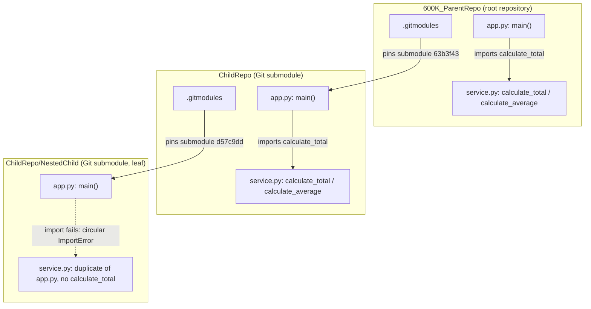
```mermaid
flowchart TD
    subgraph Parent["600K_ParentRepo (root repository)"]
        direction TB
        PGit[".gitmodules"]
        PApp["app.py: main()"]
        PSvc["service.py: calculate_total / calculate_average"]
        PApp -->|"imports calculate_total"| PSvc
    end
    subgraph Child["ChildRepo (Git submodule)"]
        direction TB
        CGit[".gitmodules"]
        CApp["app.py: main()"]
        CSvc["service.py: calculate_total / calculate_average"]
        CApp -->|"imports calculate_total"| CSvc
    end
    subgraph Nested["ChildRepo/NestedChild (Git submodule, leaf)"]
        direction TB
        NApp["app.py: main()"]
        NSvc["service.py: duplicate of app.py, no calculate_total"]
        NApp -.->|"import fails: circular ImportError"| NSvc
    end
    PGit -->|"pins submodule 63b3f43"| CApp
    CGit -->|"pins submodule d57c9dd"| NApp
```

**Core technical approach.** The design applies a straightforward separation of concerns: `app.py` is a thin orchestrator that delegates arithmetic to `service.py`, whose functions are pure (no I/O, no shared mutable state, no side effects beyond their return values). The program is standard-library-only and portable across Python 3.6+ (the sole version-sensitive feature is f-string formatting in `app.py`). Repository composition is achieved with native Git submodules nested two levels deep, with each level intended to mirror the same minimal two-file structure. The executable logic at the root and `ChildRepo` is equivalent, though the two files are no longer byte-identical because each carries its own docstrings and inline comments.

### 1.2.3 Success Criteria

The repository does **not** define any formal objectives, service-level agreements (SLAs), or key performance indicators (KPIs) — there are no performance budgets, monitoring hooks, benchmarks, or acceptance tests anywhere in the codebase. No KPIs are therefore asserted here. What can be stated are the objectively verifiable behaviors observed by executing the code, which serve as the only de-facto acceptance criteria:

| Verifiable behavior (observed) | Expected result |
| --- | --- |
| Run root `python app.py` | Prints `Total: 100`, then `10`, `20`, `30`, `40`, then `Application completed`; exits with code `0` |
| Run `ChildRepo/app.py` | Produces output identical to the root program; exits with code `0` |
| Run `ChildRepo/NestedChild/app.py` | Fails with a circular-import `ImportError`; empty standard output; exits with code `1` |
| `calculate_total([10, 20, 30, 40])` | Returns `100` (empty input returns `0`) |

**Critical success factor.** Correct execution depends on each `app.py` being co-located with a `service.py` that actually defines `calculate_total`. This factor is satisfied at the root and `ChildRepo` levels but violated at `ChildRepo/NestedChild`, where `service.py` is a duplicate of `app.py`; consequently `NestedChild/app.py` fails at import time. Full success of the demonstration across all three levels is therefore not currently achieved — a factual current-state finding, preserved as-is in the code and documentation.

## 1.3 Scope

This section delimits what the repository actually implements (in-scope) versus what it deliberately or incidentally does not (out-of-scope). Both lists are derived strictly from the files present and their observed behavior; the repository contains no scope statement, roadmap, or requirements document, so no forward-looking commitments are inferred.

### 1.3.1 In-Scope

**Core features and functionalities.** The following capabilities are implemented and constitute the whole of the system's behavior:

| Element | In-scope detail |
| --- | --- |
| Summation capability (F-001) | `calculate_total(numbers)` in `service.py` — the reusable primitive invoked by the workflow; returns the accumulated sum (`0` for empty input) |
| Average capability (F-002) | `calculate_average(numbers)` in `service.py` — defined and available for reuse; returns `0` for falsy input, otherwise sum ÷ count |
| Primary user workflow (F-003) | `main()` in `app.py` — sums the fixed list `[10, 20, 30, 40]` and prints `Total: 100`, each number, and `Application completed` |
| Essential integration (F-004) | Intra-repository import `from service import calculate_total`; source-level composition via nested Git submodules declared in `.gitmodules` |
| Key technical requirements | Python 3.6+ runtime; standard library only; no build, packaging, or dependency-installation step |

**Implementation boundaries.** The system's operating envelope is intentionally narrow:

| Boundary dimension | Coverage (as evidenced) |
| --- | --- |
| System boundary | Single-process, run-to-completion Python script that writes only to standard output; no arguments, configuration, network, or persistence |
| User groups covered | Developers who execute or read the example; no authentication, authorization, or multi-user concepts |
| Geographic / market coverage | Not applicable — no localization, deployment target, or market scope is documented |
| Data domains included | A single in-memory list of integers (`[10, 20, 30, 40]`); no external data source is read |

### 1.3.2 Out-of-Scope

**Excluded and absent capabilities.** The repository implements none of the following, and this specification treats them as out-of-scope:

| Area | Status (as evidenced) |
| --- | --- |
| Input handling (CLI args, stdin, files) | Out of scope — input is hard-coded; no argument parsing or file/stdin I/O exists |
| Error handling & logging | Out of scope — no validation, `try`/`except`, or logging anywhere |
| Configuration & environment | Out of scope — no config files, environment variables, or runtime flags |
| Persistence, database, network / API | Out of scope — no such code and zero external dependencies |
| Concurrency / asynchronous execution | Out of scope — all functions are synchronous |
| Packaging, tests, CI/CD, containerization | Out of scope — no manifests, test suite, pipelines, or `Dockerfile` |

**Data excluded by policy.** CSV data files (pattern `*.csv`, including a `large.csv` present at every repository level) are excluded from documentation and use per the repository's `.blitzyignore` files; no code reads them in any case.

**Integration points not covered.** No external integration points — network or web APIs, databases, message queues, caches, or third-party services — are implemented or declared anywhere in the codebase, and none are asserted here. The only connections that exist are the in-scope intra-repository import and the build-time Git submodule links.

**Capabilities present but not exercised, and unsupported use cases.**

- `calculate_average` is defined in `service.py` but is never invoked by any entry point; its execution is outside the demonstrated workflow.
- The `ChildRepo/NestedChild` demonstration is an unsupported use case: its `service.py` duplicates its `app.py` and lacks `calculate_total`, so `NestedChild/app.py` fails at import time with a circular-import `ImportError` (exit code `1`, empty standard output).
- Any use requiring variable, user-supplied, or streamed input is unsupported, because the workflow operates exclusively on the hard-coded list.

**Future-phase considerations.** The repository documents no roadmap, backlog, milestone, or `TODO`/`FIXME` markers. No future phases are committed within the codebase, and none are asserted here; the observed `NestedChild` defect is recorded above as a factual current-state finding rather than a planned enhancement.

## 1.4 References

The following repository files, folders, and metadata were inspected as evidence for this Introduction. No external web sources were used.

**Root repository (`600K_ParentRepo`)**

- `README.md` - comprehensive project documentation (278 lines); established the project's purpose, prerequisites (Python 3.6+, Git), setup/installation, submodule composition, API reference, run guide, and the documented `NestedChild` known issue.
- `app.py` - the direct-execution entry point defining `main()` under the `__main__` guard; established the fixed-list summation workflow, the `from service import calculate_total` import, and the standard-output behavior.
- `service.py` - established the `calculate_total` and `calculate_average` definitions and their pure, side-effect-free behavior (`calculate_average` defined but never invoked).
- `.gitmodules` - established the `ChildRepo` submodule declaration and its remote URL.
- `.blitzyignore` - established the `*.csv` exclusion rule honored throughout this section.
- `tech_spec.md` - root-level file confirmed byte-identical to the documentation specification; noted for completeness.

**First-level submodule (`ChildRepo/`)**

- `ChildRepo/` - folder; the first nested Git submodule, mirroring the root two-file structure.
- `ChildRepo/README.md` - comprehensive documentation (273 lines), title `# 600K_ChildRepo`.
- `ChildRepo/app.py` - entry point whose executable logic is equivalent to the root (carries its own docstrings, so not byte-identical); produced identical successful runtime output.
- `ChildRepo/service.py` - helper module whose executable logic is equivalent to the root `service.py`.
- `ChildRepo/.gitmodules` - established the `NestedChild` submodule declaration and its remote URL.

**Second-level submodule (`ChildRepo/NestedChild/`)**

- `ChildRepo/NestedChild/` - folder; the deepest nested Git submodule (a leaf, with no `.gitmodules`).
- `ChildRepo/NestedChild/README.md` - a one-line title (`# 600K_Nested_ChildRepo`).
- `ChildRepo/NestedChild/app.py` - verified byte-identical to its sibling `service.py`.
- `ChildRepo/NestedChild/service.py` - the defect: a duplicate of `app.py` that does not define `calculate_total`, causing the circular-import `ImportError`.

**Documentation directory**

- `blitzy/documentation/Technical Specifications.md` - the existing reverse-engineered specification; consulted for Feature Catalog terminology (F-001–F-004) and Introduction framing, with its quantitative details re-verified against current code.

**Repository metadata**

- Git history and configuration (branch `2007_01`, 18-commit log, and `git submodule status --recursive` showing the pins `ChildRepo` = `63b3f43` and `NestedChild` = `d57c9dd`) - established the scaffolding/documentation nature of the project and the nested-submodule topology.
- Runtime execution of `app.py` at each level with Python 3.12.3 - established the verified standard output at the root and `ChildRepo`, and the `NestedChild` circular-import failure (exit code `1`, empty standard output).

# 2. Product Requirements

## 2.1 Feature Catalog

This catalog enumerates the discrete, independently testable features that are actually evidenced in the repository. Four features — F-001 through F-004 — constitute the entire behavior of the system, consistent with the capability inventory in Section 1.2 System Overview (§1.2.2). Feature identifiers are carried forward verbatim from that section to preserve end-to-end traceability. Because the repository is a deliberately minimal, standard-library-only demonstration (see Section 1.1 Executive Summary), the catalog is intentionally small; no features beyond those observed directly in `app.py`, `service.py`, and the `.gitmodules` descriptors are asserted. All four features are replicated at each level of the `600K_ParentRepo → ChildRepo → NestedChild` submodule tree; the functional analysis below is stated once and applies at every level except where the NestedChild leaf defect is explicitly noted.

### 2.1.1 Feature Overview

The following two tables classify the feature set. Status values are restricted to the standard lifecycle vocabulary (Proposed / Approved / In Development / Completed); operational nuances that fall outside that vocabulary are captured in the accompanying note column.

| Feature ID | Feature Name | Category | Priority |
| --- | --- | --- | --- |
| F-001 | List Summation (`calculate_total`) | Core Calculation Service | Critical |
| F-002 | Arithmetic Mean (`calculate_average`) | Core Calculation Service | Low |
| F-003 | Fixed-List Entry-Point Workflow (`main`) | Application Workflow / CLI Entry Point | Critical |
| F-004 | Nested Git-Submodule Composition | Repository Composition (Build-Time) | Medium |

| Feature ID | Status | Operational Note |
| --- | --- | --- |
| F-001 | Completed | Implemented and exercised at the root and `ChildRepo` levels |
| F-002 | Completed | Implemented but never invoked by any entry point (dormant API) |
| F-003 | Completed | Runs successfully at root and `ChildRepo`; the equivalent copy fails at the `NestedChild` leaf |
| F-004 | Completed | Submodules declared and pinned; the deepest (`NestedChild`) leaf is non-functional at runtime |

### 2.1.2 F-001: List Summation (`calculate_total`)

| Attribute | Value |
| --- | --- |
| Unique ID | F-001 |
| Feature Name | List Summation |
| Feature Category | Core Calculation Service |
| Priority | Critical |
| Status | Completed |
| Primary Source Artifact | `service.py` → `calculate_total(numbers)` (L18–L41) |

**Overview.** `calculate_total(numbers)` initializes a running accumulator to `0`, performs a single `for`-loop pass over a numeric iterable adding each element, and returns the accumulated total; an empty iterable naturally returns `0` (`service.py` L35, L38–L39, L41).

**Business Value.** This is the single reusable arithmetic primitive on which the demonstration's headline output (`Total: 100`) depends. It embodies the clean entry-point/service separation pattern that Section 1.1 identifies as the repository's evidenced purpose.

**User Benefits.** Developers can import and reuse the helper with `from service import calculate_total` without installing any third-party dependency. Because it is deterministic and side-effect-free, it is trivial to reason about and to test.

**Technical Context.** A pure function with no imports, no classes, no module-level state, no I/O, and no mutation of its argument (`service.py` module docstring L9–L11). It targets Python 3.6+ and is replicated with functionally equivalent logic at the root and `ChildRepo` tiers.

| Dependency Type | Detail |
| --- | --- |
| Prerequisite Features | None — F-001 is the base computation primitive |
| System Dependencies | Python 3.6+ interpreter; Python standard library only (no imports in `service.py`) |
| External Dependencies | None |
| Integration Requirements | Consumed by F-003 (`main` calls it — `app.py` L34) and by F-002 (`calculate_average` delegates to it — `service.py` L78); must be importable as `from service import calculate_total` |

### 2.1.3 F-002: Arithmetic Mean (`calculate_average`)

| Attribute | Value |
| --- | --- |
| Unique ID | F-002 |
| Feature Name | Arithmetic Mean |
| Feature Category | Core Calculation Service |
| Priority | Low |
| Status | Completed (defined but never invoked) |
| Primary Source Artifact | `service.py` → `calculate_average(numbers)` (L44–L78) |

**Overview.** `calculate_average(numbers)` returns `0` for empty/falsey input (guarding against division by zero) and otherwise returns `calculate_total(numbers) / len(numbers)` (`service.py` L75–L76, L78).

**Business Value.** It rounds out the calculation API for completeness and reuse and illustrates internal composition, since it delegates its summation to F-001 rather than re-implementing it.

**User Benefits.** The helper is available for import and reuse and safely handles the empty-input edge case by returning `0` instead of raising an error.

**Technical Context.** Because the mean is computed with `len(numbers)`, the argument must be a *sized* collection such as a `list` or `tuple`; unsized iterables such as generators raise `TypeError` (`service.py` docstring L69–L71). The function is defined but never invoked by any entry point — `main()` uses only `calculate_total` (`service.py` note L54–L56, confirmed by inspection).

| Dependency Type | Detail |
| --- | --- |
| Prerequisite Features | F-001 — delegates summation to `calculate_total` |
| System Dependencies | Python 3.6+ interpreter; standard library only |
| External Dependencies | None |
| Integration Requirements | None active — the function is not wired into any workflow; exercising it would require a new caller |

### 2.1.4 F-003: Fixed-List Entry-Point Workflow (`main`)

| Attribute | Value |
| --- | --- |
| Unique ID | F-003 |
| Feature Name | Fixed-List Entry-Point Workflow |
| Feature Category | Application Workflow / CLI Entry Point |
| Priority | Critical |
| Status | Completed (root and `ChildRepo`; non-functional at the `NestedChild` leaf) |
| Primary Source Artifact | `app.py` → `main()` (L17–L46) |

**Overview.** `main()` builds the hard-coded list `[10, 20, 30, 40]`, delegates summation to `calculate_total`, prints `Total: 100`, prints each number on its own line in order, and finally prints `Application completed`; it returns `None` and writes only to standard output (`app.py` L32, L34, L36, L39–L40, L42).

**Business Value.** This is the end-to-end demonstration that ties the calculation service to observable output — the project's headline behavior as framed in Section 1.1.

**User Benefits.** A single command, `python app.py`, produces deterministic output and exits with status code `0`, with no arguments or configuration required.

**Technical Context.** The entry point imports `calculate_total` from the local `service` module (`app.py` L15) and is guarded by `if __name__ == "__main__":`, so importing `app` has no side effects (`app.py` L45–L46). It requires Python 3.6+ because of the f-string at L36. The workflow is replicated at `ChildRepo` (`main` at `ChildRepo/app.py` L16); at `NestedChild` the equivalent workflow fails at import time (see F-004 and Section 2.4).

| Dependency Type | Detail |
| --- | --- |
| Prerequisite Features | F-001 — `main` calls `calculate_total` |
| System Dependencies | Python 3.6+; standard library only; a co-located `service.py` that defines `calculate_total` |
| External Dependencies | None |
| Integration Requirements | Intra-repository import `from service import calculate_total`; must be run from the directory containing both `app.py` and `service.py` |

### 2.1.5 F-004: Nested Git-Submodule Composition

| Attribute | Value |
| --- | --- |
| Unique ID | F-004 |
| Feature Name | Nested Git-Submodule Composition |
| Feature Category | Repository Composition (Build-Time) |
| Priority | Medium |
| Status | Completed (declared and pinned; deepest leaf non-functional at runtime) |
| Primary Source Artifact | `.gitmodules` (root) and `ChildRepo/.gitmodules` |

**Overview.** The root `.gitmodules` declares a single submodule, `ChildRepo` (remote `https://github.com/lakshya-blitzy/600K_ChildRepo.git`), and `ChildRepo/.gitmodules` declares `NestedChild` (remote `https://github.com/lakshya-blitzy/600K_Nested_ChildRepo.git`), producing the two-level tree `600K_ParentRepo → ChildRepo → NestedChild`. Each level mirrors the same two-file structure.

**Business Value.** It demonstrates the composition of independent repositories through native Git submodules — a build-time / source-structure concern rather than a runtime capability — which Section 1.1 identifies as one of the two things the project illustrates.

**User Benefits.** A single recursive clone (`git clone --recursive <repository-url>`) or `git submodule update --init --recursive` populates all levels in one step (root `README.md`, Setup and Installation).

**Technical Context.** The submodules are pinned to specific commits — `ChildRepo` at `63b3f43` and `NestedChild` at `d57c9dd` (verified via `git submodule status --recursive`). `NestedChild` is a leaf with no `.gitmodules`, and its `README.md` is a one-line title. The leaf is non-functional at runtime because its `service.py` duplicates its `app.py` (see Section 2.4.4).

| Dependency Type | Detail |
| --- | --- |
| Prerequisite Features | None — build-time composition, independent of the runtime features |
| System Dependencies | Git (any recent version) |
| External Dependencies | GitHub-hosted remotes under the `lakshya-blitzy` account (`600K_ChildRepo.git`, `600K_Nested_ChildRepo.git`) |
| Integration Requirements | Recursive clone/init to populate submodules; network access to GitHub at clone time |

## 2.2 Functional Requirements

Each feature is decomposed into numbered requirements using the identifier format `F-XXX-RQ-YYY`. Because the repository defines no formal service-level agreements, key performance indicators, or automated test suite (§1.2.3), acceptance criteria are grounded in objectively reproducible runtime behavior and the pure-function contracts documented in the source; every criterion below was confirmed by direct execution on Python 3.12.3. Priority uses the Must-Have / Should-Have / Could-Have scale, and Complexity is rated relative to this minimal codebase. For each requirement group there are four tables — Requirement Details, Acceptance Criteria, Technical Specifications, and Validation Rules — each limited to at most four columns.

### 2.2.1 F-001 Requirements — List Summation

| Requirement ID | Description | Priority | Complexity |
| --- | --- | --- | --- |
| F-001-RQ-001 | Sum all elements of a numeric iterable in a single pass and return the accumulated total | Must-Have | Low |
| F-001-RQ-002 | Return `0` for an empty iterable | Must-Have | Low |
| F-001-RQ-003 | Behave as a pure function — perform no I/O and do not mutate the input | Should-Have | Low |

| Requirement ID | Acceptance Criteria (Testable) |
| --- | --- |
| F-001-RQ-001 | `calculate_total([10, 20, 30, 40])` returns `100`; `calculate_total([5])` returns `5` |
| F-001-RQ-002 | `calculate_total([])` returns `0` |
| F-001-RQ-003 | The input list is unchanged after the call; no standard-output, file, or network access occurs |

| Specification Aspect | Detail |
| --- | --- |
| Input Parameters | `numbers`: an iterable of numeric values (int/float); elements are assumed numeric |
| Output / Response | `int` or `float` — the accumulated sum returned to the caller; no standard-output side effect |
| Performance Criteria | Single traversal, O(n) time and O(1) extra space (one accumulator); no formal budget defined (§1.2.3) |
| Data Requirements | An in-memory numeric iterable; no persistence or external data source |

| Validation Category | Rule |
| --- | --- |
| Business Rules | Summing zero elements yields `0` (the arithmetic identity for an empty sum) |
| Data Validation | No explicit validation; non-numeric elements raise `TypeError`, and a non-iterable argument raises `TypeError` (both uncaught) |
| Security Requirements | None applicable — no I/O, no external input, no secrets handled |
| Compliance Requirements | None defined in the repository |

### 2.2.2 F-002 Requirements — Arithmetic Mean

| Requirement ID | Description | Priority | Complexity |
| --- | --- | --- | --- |
| F-002-RQ-001 | Compute the arithmetic mean of a sized numeric collection as sum ÷ count | Should-Have | Low |
| F-002-RQ-002 | Return `0` for empty/falsey input to guard against division by zero | Should-Have | Low |

| Requirement ID | Acceptance Criteria (Testable) |
| --- | --- |
| F-002-RQ-001 | `calculate_average([10, 20, 30, 40])` returns `25.0` |
| F-002-RQ-002 | `calculate_average([])` returns `0` |

| Specification Aspect | Detail |
| --- | --- |
| Input Parameters | `numbers`: a *sized* numeric collection (list/tuple) that supports `len()` |
| Output / Response | `int` or `float` — the mean, or `0` for empty/falsey input |
| Performance Criteria | Delegates one O(n) pass to `calculate_total` plus one `len()` evaluation; no formal budget |
| Data Requirements | An in-memory sized collection; unsized iterables such as generators are unsupported |

| Validation Category | Rule |
| --- | --- |
| Business Rules | Empty/falsey input yields `0`, avoiding a `ZeroDivisionError` |
| Data Validation | No explicit validation; an unsized iterable raises `TypeError` at `len()`, and non-numeric elements raise `TypeError` during summation |
| Security Requirements | None applicable — pure function, no I/O |
| Compliance Requirements | None defined in the repository |

### 2.2.3 F-003 Requirements — Fixed-List Entry-Point Workflow

| Requirement ID | Description | Priority | Complexity |
| --- | --- | --- | --- |
| F-003-RQ-001 | Print `Total: 100` for the fixed list `[10, 20, 30, 40]` | Must-Have | Low |
| F-003-RQ-002 | Print each input number on its own line, in original order | Must-Have | Low |
| F-003-RQ-003 | Print `Application completed` as the final line and exit with status code `0` | Must-Have | Low |
| F-003-RQ-004 | Execute `main()` only on direct execution; importing `app` must have no side effects | Should-Have | Low |

| Requirement ID | Acceptance Criteria (Testable) |
| --- | --- |
| F-003-RQ-001 | Running `python app.py` prints `Total: 100` as the first line |
| F-003-RQ-002 | Output lines two through five are `10`, `20`, `30`, `40` in that order |
| F-003-RQ-003 | The final standard-output line is `Application completed`; the process exits with code `0` |
| F-003-RQ-004 | `import app` produces no standard output (guard at `app.py` L45–L46) |

| Specification Aspect | Detail |
| --- | --- |
| Input Parameters | None — the list `[10, 20, 30, 40]` is hard-coded (`app.py` L32); no CLI arguments, stdin, or files |
| Output / Response | Six standard-output lines; function return value `None`; process exit code `0` |
| Performance Criteria | Run-to-completion single process with six stdout writes; no formal budget (§1.2.3) |
| Data Requirements | A single in-memory list of four integers |

| Validation Category | Rule |
| --- | --- |
| Business Rules | Output is deterministic for the fixed input; the printed total is always `100` |
| Data Validation | None — the input is constant, so there is no user input to validate |
| Security Requirements | None applicable — standard-output only; no external input, secrets, network, or file I/O; the `__main__` guard prevents import-time side effects |
| Compliance Requirements | None defined in the repository |

### 2.2.4 F-004 Requirements — Nested Git-Submodule Composition

| Requirement ID | Description | Priority | Complexity |
| --- | --- | --- | --- |
| F-004-RQ-001 | Root `.gitmodules` declares the `ChildRepo` submodule with its remote URL | Must-Have | Low |
| F-004-RQ-002 | `ChildRepo/.gitmodules` declares the `NestedChild` submodule with its remote URL | Must-Have | Low |
| F-004-RQ-003 | A recursive clone/init populates both submodule levels at their pinned commits | Should-Have | Medium |

| Requirement ID | Acceptance Criteria (Testable) |
| --- | --- |
| F-004-RQ-001 | `.gitmodules` maps path `ChildRepo` to `https://github.com/lakshya-blitzy/600K_ChildRepo.git` |
| F-004-RQ-002 | `ChildRepo/.gitmodules` maps path `NestedChild` to `https://github.com/lakshya-blitzy/600K_Nested_ChildRepo.git` |
| F-004-RQ-003 | `git submodule status --recursive` reports `ChildRepo` at `63b3f43` and `NestedChild` at `d57c9dd` |

| Specification Aspect | Detail |
| --- | --- |
| Input Parameters | Clone/init flags: `--recursive` or `--init --recursive` |
| Output / Response | Populated `ChildRepo/` and `ChildRepo/NestedChild/` working trees at the pinned SHAs |
| Performance Criteria | Bounded by network and Git operations; no formal budget defined |
| Data Requirements | Read access to the two GitHub remotes at clone time |

| Validation Category | Rule |
| --- | --- |
| Business Rules | Each level mirrors the same two-file (`app.py` + `service.py`) structure; `NestedChild` is a leaf with no `.gitmodules` |
| Data Validation | Submodule entries pin specific commits; omitting `--recursive` leaves the submodule directories empty |
| Security Requirements | Use clean public URLs; never embed access tokens or credentials in a shared clone URL (root `README.md` security note) |
| Compliance Requirements | None defined in the repository |

## 2.3 Feature Relationships

The relationships documented here are limited strictly to those directly evidenced by import statements, function calls, and submodule declarations in the source. No relationships are inferred beyond that evidence, and — consistent with §1.3.2 — there are no external integration points (network/API, database, message queue, cache, or third-party service) anywhere in the codebase.

### 2.3.1 Feature Dependency Map

The runtime features form a two-level dependency chain rooted at the summation primitive (F-001); the build-time composition feature (F-004) replicates that runtime feature set at every level of the submodule tree. The dashed edge denotes a relationship that exists in code but is never exercised at runtime.

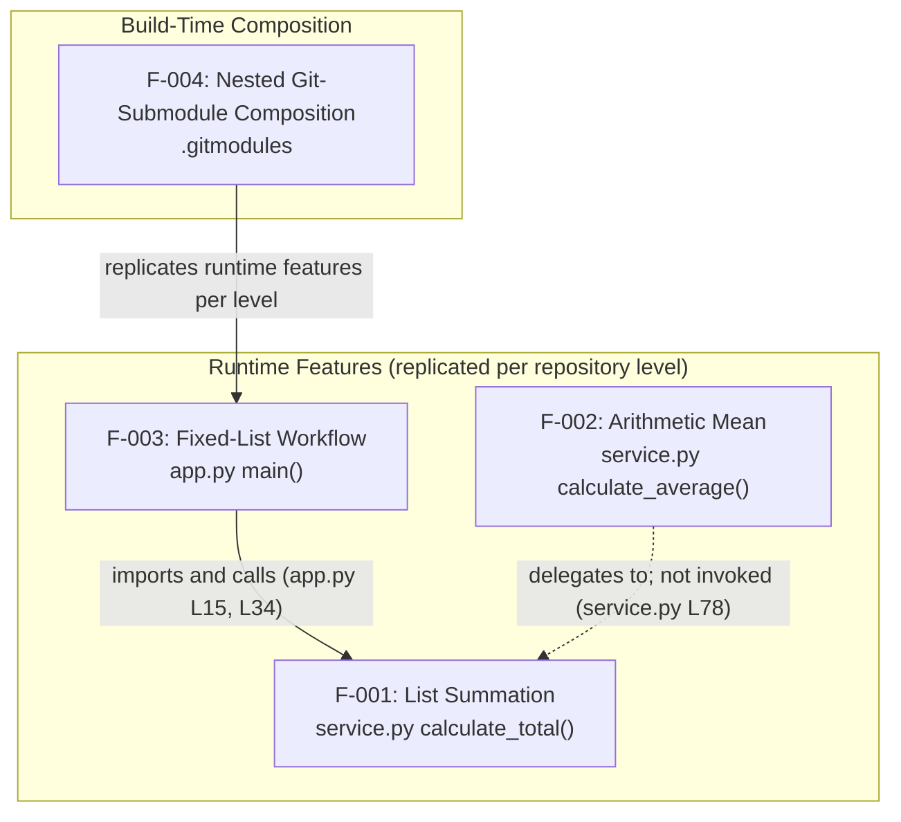
```mermaid
flowchart TD
    subgraph Runtime["Runtime Features (replicated per repository level)"]
        direction TB
        F003["F-003: Fixed-List Workflow<br/>app.py main()"]
        F001["F-001: List Summation<br/>service.py calculate_total()"]
        F002["F-002: Arithmetic Mean<br/>service.py calculate_average()"]
    end
    subgraph BuildTime["Build-Time Composition"]
        direction TB
        F004["F-004: Nested Git-Submodule Composition<br/>.gitmodules"]
    end
    F003 -->|"imports and calls (app.py L15, L34)"| F001
    F002 -.->|"delegates to; not invoked (service.py L78)"| F001
    F004 -->|"replicates runtime features per level"| F003
```

### 2.3.2 Integration Points

All integration is intra-process (a single Python module import and function call) or build-time (Git submodule declarations). The evidenced integration points are:

| Integration Point | Type | Evidence |
| --- | --- | --- |
| `from service import calculate_total` | Intra-process module import (F-003 → F-001) | `app.py` L15; `ChildRepo/app.py` L14 |
| `calculate_total(numbers)` invocation | Function call (F-003 → F-001) | `app.py` L34 |
| `calculate_total(numbers) / len(numbers)` | Internal delegation (F-002 → F-001) | `service.py` L78 |
| Root → `ChildRepo` submodule link | Build-time Git submodule (F-004) | `.gitmodules` |
| `ChildRepo` → `NestedChild` submodule link | Build-time Git submodule (F-004) | `ChildRepo/.gitmodules` |

### 2.3.3 Shared Components

The system's structure is a two-file pattern — an entry-point module and a calculation module — replicated across all three repository levels. The following components are shared in the sense that each hosts one or more features and is reproduced at every level:

| Shared Component | Role | Features Hosted |
| --- | --- | --- |
| `service.py` | Pure calculation module (no imports, classes, or state) | F-001, F-002 |
| `app.py` | Entry-point orchestrator under an `__main__` guard | F-003 |
| `.gitmodules` | Git submodule declaration (absent at the `NestedChild` leaf) | F-004 |

At the root and `ChildRepo` levels these components carry functionally equivalent logic (they differ only by their docstrings and inline comments, so they are not byte-identical). At the `NestedChild` leaf the two files are byte-for-byte identical to each other, which is the root cause of the leaf defect analyzed in §2.4.4.

### 2.3.4 Common Services

The only common service in the system is the calculation service embodied by `service.py`. Within it, `calculate_total` (F-001) is the single shared primitive consumed by both the fixed-list workflow (F-003, via import and call) and the average helper (F-002, via internal delegation). There is no service framework, dependency-injection container, message bus, shared runtime process, or other cross-cutting service beyond this module-level reuse — the repository has zero third-party dependencies and performs no I/O other than the standard-output writes in F-003.

## 2.4 Implementation Considerations

This section records the technical constraints, performance and scalability characteristics, security implications, and maintenance factors for each feature, drawn directly from the source. Because the repository defines no formal SLAs, benchmarks, tests, or CI (§1.3.2), performance and scalability entries describe intrinsic algorithmic characteristics rather than measured or contracted targets.

### 2.4.1 F-001: List Summation

| Dimension | Detail |
| --- | --- |
| Technical Constraints | Pure function in `service.py` (L18) with no imports, classes, or module-level state; accumulates from `total = 0` in a single `for` loop and returns the running total. Elements are assumed numeric (`service.py` docstring L26-27); returns `0` for an empty iterable. The module documents a Python 3.6+ target (`service.py` L11-12); behavior verified on Python 3.12.3. |
| Performance Requirements | Linear O(n) time, O(1) auxiliary space, single traversal of the input. No numeric performance target is defined in the repository. |
| Scalability Considerations | Synchronous, single-threaded, fully in-memory; cost grows linearly with input length. In the shipped workflow (F-003) the input is a fixed 4-element list, so runtime cost is negligible. No streaming or parallel execution is provided. |
| Security Implications | Minimal attack surface: performs no I/O, accepts no external input, and uses no `eval`/deserialization. It trusts caller-supplied data and performs no type validation, so non-numeric elements propagate a `TypeError` from the `+=` operation. |
| Maintenance Requirements | Fully documented via docstrings; no unit tests exist. The function is replicated with equivalent logic at the root and `ChildRepo` levels (and at the `NestedChild` leaf), so any change must be applied at each level independently. |

### 2.4.2 F-002: Arithmetic Mean

| Dimension | Detail |
| --- | --- |
| Technical Constraints | Defined in `service.py` (L44); delegates summation to `calculate_total` and divides by `len(numbers)` (L78). Requires a *sized* collection (list/tuple); unsized iterables such as generators raise `TypeError` because `len()` is evaluated (docstring L69-71). Division-by-zero is guarded by returning `0` for empty/falsey input (L75-76). |
| Performance Requirements | O(n) — one pass in `calculate_total` plus O(1) `len()` and division. No performance target is defined. |
| Scalability Considerations | Same linear, in-memory characteristics as F-001. Because the function is never invoked (see below), it contributes no runtime footprint. |
| Security Implications | Same minimal surface as F-001: pure, no I/O, no external input. |
| Maintenance Requirements | Dormant API — defined but never invoked anywhere in the project (`service.py` docstring L54-56; §1.2.2). Being both untested and unused, it carries a latent risk of behavioral drift; it is also triplicated across the three repository levels. |

### 2.4.3 F-003: Fixed-List Entry-Point Workflow

| Dimension | Detail |
| --- | --- |
| Technical Constraints | Orchestrated by `main()` in `app.py` (L17); imports `calculate_total` (L15) and operates on the hardcoded list `[10, 20, 30, 40]` (L32). Accepts no command-line arguments or external input and writes only to standard output. Execution is gated by an `if __name__ == "__main__"` guard (L45-46), so importing the module produces no side effects (verified: `import app` yields no stdout). Depends on F-001. |
| Performance Requirements | Trivial fixed workload of four elements; wall-clock cost is dominated by standard-output writes. No performance target is defined. |
| Scalability Considerations | Single-shot batch execution; the input is not parameterized and there is no concurrency, so the feature does not scale beyond its fixed list without code change. |
| Security Implications | Writes only to stdout and reads no external input, leaving no injection or input-parsing attack surface. |
| Maintenance Requirements | No tests or CI; logic is triplicated across levels. Verified functional at the root and `ChildRepo` levels (prints `Total: 100`, the four operands, then `Application completed`; exit code 0). It is **non-functional at the `NestedChild` leaf** because of the circular-import defect analyzed in §2.4.4. |

### 2.4.4 F-004: Nested Git-Submodule Composition

| Dimension | Detail |
| --- | --- |
| Technical Constraints | Build-time only, declared in `.gitmodules` (root → `ChildRepo`) and `ChildRepo/.gitmodules` (`ChildRepo` → `NestedChild`). Population requires a recursive clone/update; submodules are pinned to specific commit SHAs (`ChildRepo` at `63b3f43`, `NestedChild` at `d57c9dd`) whose remotes are external GitHub repositories under the `lakshya-blitzy` account. `NestedChild` is declared and pinned but not initialized in the working checkout. |
| Performance Requirements | No runtime cost; the only cost is clone/fetch time proportional to the number and size of submodules. |
| Scalability Considerations | Fixed three-level depth (parent → `ChildRepo` → `NestedChild`); each level replicates the same two-file (`app.py` + `service.py`) pattern rather than sharing code. |
| Security Implications | Supply-chain: pinning to explicit commit SHAs provides reproducibility and integrity of the referenced revisions, but availability and integrity depend on the external GitHub remotes; no submodule signature verification is evidenced in the repository. |
| Maintenance Requirements | The deepest leaf is defective (see analysis below) and is recorded as a Known Issue in `README.md`. Because the two-file pattern is copied per level, corrective and evolutionary changes must be propagated to each level individually. |

#### 2.4.4.1 NestedChild Circular-Import Defect

The `NestedChild` leaf is non-functional. Its `service.py` and `app.py` are byte-for-byte identical, and both begin with `from service import calculate_total`. Consequently `service.py` attempts to import a symbol from itself, and `calculate_total` is never actually defined at the leaf. Running `python3 app.py` at `NestedChild` produces no standard output and exits with code 1, raising `ImportError: cannot import name 'calculate_total' from partially initialized module 'service' (most likely due to a circular import)`.

This defect degrades two features at the deepest level only: F-003 (the workflow cannot run) and F-004 (the composition's deepest leaf is broken). The root and `ChildRepo` levels are unaffected. The corrective action is to make `NestedChild/service.py` *define* `calculate_total` (and `calculate_average`) as the root and `ChildRepo` modules do, rather than importing the name from itself.

## 2.5 Traceability Matrix

This matrix traces every functional requirement defined in §2.2 back to its source artifact and forward to the evidence that verifies it, and links each feature to the related specification sections. Because the repository contains no automated test suite or CI (§1.3.2), verification is by first-hand execution and static inspection of the source at the current `HEAD` (branch `2007_01`, commit `9ba0477`), performed on Python 3.12.3.

### 2.5.1 Feature-to-Requirement-to-Source Matrix

| Requirement ID | Requirement Summary | Source Artifact (file:line) |
| --- | --- | --- |
| F-001-RQ-001 | Sum a numeric iterable in a single pass | `service.py` L35-41 |
| F-001-RQ-002 | Return `0` for an empty iterable | `service.py` L35, L41 |
| F-001-RQ-003 | Behave as a pure, side-effect-free function | `service.py` L9-11, L18-41 |
| F-002-RQ-001 | Compute mean as total ÷ count (→ 25.0 for the sample) | `service.py` L78 |
| F-002-RQ-002 | Return `0` for empty/falsey input (no division by zero) | `service.py` L75-76 |
| F-003-RQ-001 | Sum the fixed list and print `Total: 100` | `app.py` L34, L36 |
| F-003-RQ-002 | Print each operand on its own line | `app.py` L39-40 |
| F-003-RQ-003 | Print `Application completed` and exit 0 | `app.py` L42 |
| F-003-RQ-004 | Produce no side effects on import (`__main__` guard) | `app.py` L45-46 |
| F-004-RQ-001 | Root repository declares the `ChildRepo` submodule | `.gitmodules` |
| F-004-RQ-002 | `ChildRepo` declares the `NestedChild` submodule | `ChildRepo/.gitmodules` |
| F-004-RQ-003 | Submodules resolve to pinned commit SHAs | Git submodule pins (`63b3f43`, `d57c9dd`) |

### 2.5.2 Requirement-to-Verification Matrix

| Requirement ID | Verification Method | Expected / Observed Result |
| --- | --- | --- |
| F-001-RQ-001 | Function invocation | `calculate_total([10,20,30,40])` → `100` |
| F-001-RQ-002 | Function invocation | `calculate_total([])` → `0` |
| F-001-RQ-003 | Static inspection + module import | No I/O or mutation; `import app` emits no stdout |
| F-002-RQ-001 | Function invocation | `calculate_average([10,20,30,40])` → `25.0` |
| F-002-RQ-002 | Function invocation | `calculate_average([])` → `0` |
| F-003-RQ-001 | Runtime execution (`python3 app.py`) | First stdout line `Total: 100` (root & `ChildRepo`) |
| F-003-RQ-002 | Runtime execution | Lines `10`, `20`, `30`, `40` printed in order |
| F-003-RQ-003 | Runtime execution + exit code | Final line `Application completed`; exit code `0` |
| F-003-RQ-004 | Module import | `import app` produces no stdout |
| F-004-RQ-001 | Static file inspection | `.gitmodules` declares `ChildRepo` remote/path |
| F-004-RQ-002 | Static file inspection | `ChildRepo/.gitmodules` declares `NestedChild` |
| F-004-RQ-003 | Git submodule state inspection | `ChildRepo` → `63b3f43`; `NestedChild` → `d57c9dd` |

### 2.5.3 Cross-Reference Matrix

Each feature is linked to the requirements sections that specify it and to the Section 1 context that frames it. The process/behavior view for all runtime features is the dependency map in §2.3.1.

| Feature ID | Requirements Sections | Related Context Sections |
| --- | --- | --- |
| F-001 | §2.1.2, §2.2.1, §2.4.1 | §1.2.2, §1.2.3, §2.3.1 |
| F-002 | §2.1.3, §2.2.2, §2.4.2 | §1.2.2, §2.3.1 |
| F-003 | §2.1.4, §2.2.3, §2.4.3 | §1.2.2, §1.2.3, §2.3.1, §2.4.4.1 |
| F-004 | §2.1.5, §2.2.4, §2.4.4 | §1.2.2, §1.3, §2.4.4.1 |

### 2.5.4 Assumptions, Constraints, and Requirement Versioning

**Assumptions.** The following assumptions are stated in or implied by the source and its docstrings:

- Inputs to the calculation functions are numeric; the functions perform no type validation (`service.py` L26-27).
- `calculate_average` (F-002) is invoked only with sized collections; unsized iterables raise `TypeError` (`service.py` L69-71).
- The runtime targets Python 3.6+ per the module docstring (`service.py` L11-12); all behavior above was confirmed on Python 3.12.3.
- Full composition (F-004) assumes a recursive submodule clone/update with access to the external GitHub remotes under the `lakshya-blitzy` account.

**Constraints.** The following constraints bound these requirements and are evidenced by the repository's contents:

- Standard-library only — no third-party runtime dependencies and no dependency manifest (`requirements.txt`, `setup.py`, and `pyproject.toml` are absent).
- No automated tests and no CI configuration exist, so all acceptance criteria are behavior-based (§1.3.2).
- Feature logic is replicated across the three repository levels rather than shared, so requirements must be satisfied independently at each level.
- The `NestedChild` leaf does not satisfy F-003 (and thus breaks the deepest level of F-004) because of the circular-import defect documented in §2.4.4.1.

**Requirement Versioning.** These requirements constitute the baseline set (v1.0) for the current `HEAD` of branch `2007_01` (commit `9ba0477`). They are reverse-engineered from the source rather than maintained in a separate requirements register; consequently the authoritative version reference is the Git revision itself, and any change to `app.py`, `service.py`, `.gitmodules`, or the submodule pins constitutes a new requirement baseline.

## 2.6 References

The following repository artifacts and specification sections were examined first-hand and cited as evidence throughout Section 2. No external web sources were used; all behavior was verified by direct inspection and execution of the source at branch `2007_01`, commit `9ba0477`.

**Source Files**

- `app.py` — Root entry-point; established F-003 (`main()`, the fixed list `[10, 20, 30, 40]`, the `Total:` and per-operand prints, `Application completed`, and the `__main__` guard) and its dependency on F-001 via `from service import calculate_total`.
- `service.py` — Root calculation module; established F-001 (`calculate_total`) and F-002 (`calculate_average`), their return values and edge cases, and the module-level purity/no-state constraints and Python 3.6+ target.
- `ChildRepo/app.py` — Second-level entry-point; confirmed the two-file pattern and functional equivalence to the root workflow.
- `ChildRepo/service.py` — Second-level calculation module; confirmed replication of F-001/F-002.
- `ChildRepo/NestedChild/app.py` — Leaf entry-point; confirmed it is byte-identical to the leaf `service.py` and imports `calculate_total` from `service`.
- `ChildRepo/NestedChild/service.py` — Leaf calculation module; established the circular-import defect (imports `calculate_total` from itself) analyzed in §2.4.4.1.
- `ChildRepo/NestedChild/README.md` — Leaf documentation, reviewed alongside the defect analysis.
- `README.md` — Project overview and Known Issues; corroborated the documented `NestedChild` defect.

**Configuration and Submodule Declarations**

- `.gitmodules` — Root submodule declaration; established F-004-RQ-001 (the `ChildRepo` link).
- `ChildRepo/.gitmodules` — Second-level submodule declaration; established F-004-RQ-002 (the `NestedChild` link).

**Folders (Submodule Tree)**

- `ChildRepo/` — Second-level submodule, pinned at commit `63b3f43`; contained the mirrored `app.py`/`service.py` and its own `.gitmodules`.
- `ChildRepo/NestedChild/` — Third-level (leaf) submodule, declared and pinned at commit `d57c9dd`; contained the defective mirrored files.

**Governance Files Consulted**

- `.blitzyignore` (root, `ChildRepo/`, `ChildRepo/NestedChild/`) — Each excludes `*.csv`; the CSV data files at every level were therefore neither read nor documented.

**Cross-Referenced Specification Sections**

- §1.1 Executive Summary — System purpose and demonstration intent.
- §1.2 System Overview — Source of the canonical feature identifiers (§1.2.2) and de-facto acceptance criteria (§1.2.3) reused throughout Section 2.
- §1.3 Scope — Boundary that confirms the absence of external integrations, tests, and CI (§1.3.2).
- §1.4 References — Governing definitions and terminology.

# 3. Technology Stack

## 3.1 Programming Languages

The system's technology stack is deliberately minimal. The entire codebase is implemented in a **single programming language — Python** — using only the language's built-in features and standard library; there are no third-party runtime dependencies, no build or packaging tooling, and no database, network, or cloud services (each documented in the sub-sections that follow). This section inventories the language, its versions, and the rationale, grounded strictly in the repository's source files.

Python is the only programming, scripting, templating, markup, or query language present anywhere in the repository. The complete source inventory is six Python modules — a paired `app.py` (entry point) and `service.py` (numeric helpers) replicated at each of the three repository tiers — totaling 282 lines including docstrings and comments. Markdown (`README.md`) is documentation and `.gitmodules` is Git configuration; neither is application code. A repository-wide, non-ignored file-extension census confirms this composition: 6 `.py`, 4 `.pyc` (generated bytecode), 4 `.md`, 3 `.blitzyignore`, and 2 `.gitmodules`.

### 3.1.1 Language Inventory by Component

Because the design intentionally mirrors the same two-file structure at every level of the Git-submodule tree (`600K_ParentRepo → ChildRepo → NestedChild`), the language mapping is uniform across all components:

| Component / Tier | Language | Source Files | Role |
| --- | --- | --- | --- |
| Root (`600K_ParentRepo`) | Python (3.6+) | `app.py` (46 lines), `service.py` (78 lines) | Entry-point orchestration + pure numeric helpers |
| `ChildRepo` (submodule) | Python (3.6+) | `ChildRepo/app.py` (48 lines), `ChildRepo/service.py` (78 lines) | Mirror of the root workflow and helpers |
| `ChildRepo/NestedChild` (leaf submodule) | Python (3.6+) | `NestedChild/app.py` (16 lines), `NestedChild/service.py` (16 lines) | Bare duplicate leaf (undocumented; see defect note) |

Key characteristics observed in the source:

- **Separation of concerns.** `app.py` is a thin orchestrator whose `main()` builds a fixed list, delegates arithmetic to `service.py`, and prints results; `service.py` provides pure, side-effect-free functions (`calculate_total`, `calculate_average`) documented as having "no imports, no classes, and no module-level state."
- **Uniform vocabulary.** The same identifiers (`calculate_total`, `calculate_average`, `main`) recur at every tier, so the language footprint is identical across components.
- **Leaf divergence.** The `NestedChild/app.py` and `NestedChild/service.py` files are 16 lines each — the bare, undocumented duplicate that produces the leaf's circular-import defect (see §3.1.2 and cross-referenced §2.4.4).

### 3.1.2 Version Constraints, Selection Rationale, and Dependencies

**Version floor — Python 3.6+.** The minimum supported interpreter is Python 3.6, driven by the use of f-string literal formatting in the entry point (`app.py:L36`):

```python
total = calculate_total(numbers)
print(f"Total: {total}")   # f-string formatting requires Python >= 3.6
```

Beyond f-strings the code uses only basic control flow and built-ins, so any modern CPython 3.x satisfies the requirement.

**Observed toolchain — CPython 3.12.** The repository's compiled bytecode caches (`__pycache__/*.cpython-312.pyc`, four files) carry the CPython 3.12 bytecode magic number `cb0d0d0a`, and the interpreter available in the environment reports Python 3.12.3; §2.4 records that behavior was verified on Python 3.12.3. The root `README.md` prerequisites table additionally documents successful verification on **Python 3.13.7**. In summary, the source is written to a conservative **3.6+** floor while the artifacts present were produced by **CPython 3.12**, and execution has been confirmed on both 3.12.3 and 3.13.7.

| Attribute | Value | Evidence |
| --- | --- | --- |
| Minimum language version | Python 3.6+ | f-strings in `app.py:L36`; `service.py` docstring "targets Python 3.6+" |
| Observed compile toolchain | CPython 3.12 | `__pycache__/service.cpython-312.pyc` magic `cb0d0d0a`; interpreter 3.12.3 |
| Documented verification | Python 3.13.7 and 3.12.3 | root `README.md` prerequisites; §2.4 Implementation Considerations |

**Selection rationale.** As a teaching / demonstration scaffold (§1.2), Python with a standard-library-only, built-in-only design maximizes portability and eliminates any installation, dependency-resolution, or build step — the root `README.md` states "the project runs with a stock Python interpreter out of the box." The pure-function style of `service.py` keeps the helpers trivially reusable and testable, and the standard-library-only constraint makes the code forward-compatible across subsequent 3.x releases without any dependency pinning.

**Constraints and dependencies.** The only import statement anywhere in the codebase is the **intra-repository** `from service import calculate_total` (`app.py:L15`); there are no standard-library or third-party imports. This creates a single structural constraint: each `app.py` must be co-located with a `service.py` that actually **defines** `calculate_total`. That invariant holds at the root and `ChildRepo` tiers but is **violated at the `NestedChild` leaf**, where `service.py` is a byte-for-byte duplicate of `app.py` and therefore re-issues `from service import calculate_total` against itself, producing a circular-import `ImportError` (exit code 1, empty standard output). This is a documented, preserved defect analyzed in §2.4.4. The language choice itself imposes no other external constraints — no runtime, operating-system, or hardware-architecture lock-in beyond a CPython 3.6+ interpreter.

## 3.2 Frameworks &amp; Libraries

No application framework or third-party library is used anywhere in the system. The repository contains no dependency manifest and no import of any external package; the codebase relies exclusively on the Python language and, in practice, touches only language built-ins. This is a deliberate design property of the demonstration scaffold (§1.2) rather than an omission.

**Framework surface.** There is no web, CLI, GUI, ORM, testing, or AI/agent framework in the codebase. None of the frameworks commonly assumed for such a stack are present — a targeted inventory found no Flask/Django/FastAPI, no Langchain or model SDK, and no front-end or native-application toolchain. The application's control flow is hand-written in plain Python: `app.py` orchestrates through a `main()` function guarded by `if __name__ == "__main__"`, and `service.py` exposes plain module-level functions.

| Framework / library category | Status | Evidence |
| --- | --- | --- |
| Web / API framework | None | No such imports; no network I/O anywhere (§1.2, §1.3.2) |
| CLI / argument-parsing framework | None | Input is a hard-coded list; the only import is the intra-repo `service` import (`app.py:L15`) |
| AI / agent framework | None | No `langchain` or model-SDK imports present |
| ORM / database library | None | No database code or drivers (see §3.5) |
| Testing framework | None | No `pytest`/`unittest` usage and no test files (see §3.6) |
| UI / front-end framework | None | Repository is Python-only; no JavaScript/TypeScript sources (§3.1) |

**Standard-library usage.** The only "library" available to the code is the Python Standard Library, and the code uses it only implicitly through built-in functions and operators — `print()`, `len()`, the `for` loop, and the `+`/`+=`/`/` arithmetic operators. There are **no `import` statements that resolve to standard-library modules**; the single import anywhere is the intra-repository `from service import calculate_total` (§3.1.2). Accordingly, `service.py` is documented as having "no imports, no classes, and no module-level state."

**Compatibility requirements.** Because there are no frameworks or libraries, there are no inter-package version-compatibility constraints, dependency-resolution requirements, or transitive-dependency trees to manage. The sole compatibility requirement is the language-level one established in §3.1.2: a CPython interpreter at version **3.6 or newer** (for f-string support). The code has been observed to run unchanged on CPython 3.12.3 and, per the root `README.md`, 3.13.7.

**Justification.** For a minimal teaching/demonstration project, avoiding frameworks and libraries removes all installation and dependency-management friction and keeps the example readable end-to-end. It also yields a stable, forward-compatible baseline: standard-library-only, built-in-only code needs no version pinning and no periodic dependency upgrades.

**Security implications.** The absence of third-party frameworks and libraries eliminates the corresponding attack surface — there is no dependency supply chain to compromise, no known-vulnerability (CVE) exposure inherited from external packages, and no framework configuration to harden. The residual security considerations are intrinsic to the hand-written code: for example, `calculate_total`/`calculate_average` perform no input validation, so a non-numeric element would propagate a `TypeError` (§2.4), which is a property of the code rather than of any framework.

## 3.3 Open Source Dependencies

The system has **no open-source or third-party package dependencies**. Every item requested for this sub-section — third-party/open-source libraries, package dependencies, package registries, and pinned versions — resolves to *none* for this codebase, verified by both the absence of any dependency manifest and the absence of any external import.

**No dependency manifests.** The repository contains no `requirements.txt`, `setup.py`, `setup.cfg`, `pyproject.toml`, `Pipfile`, `poetry.lock`, or any other manifest/lock file at any tier — confirmed by a recursive search over all non-ignored paths. The root `README.md` states this explicitly: there are "no third-party runtime dependencies and no dependency manifest."

**No package-registry usage.** Because nothing is declared or imported, no package registry (PyPI, conda-forge, and the like) is consulted, and there is no install step (`pip install`, `poetry install`, etc.). The application runs directly on a stock interpreter.

| Requested item | Finding for this system |
| --- | --- |
| Third-party / open-source libraries | None |
| Package dependencies (direct or transitive) | None |
| Package registries | None used (no PyPI / conda) |
| Pinned dependency versions | None (no manifest or lock file) |

**Only versioned dependency is the runtime.** The single versioned piece of software the code depends on is the Python interpreter/runtime itself — minimum **Python 3.6+**, observed **CPython 3.12** (§3.1.2). CPython is itself open-source software, but it is the execution environment, not a packaged library dependency bundled with the project, and it is not vendored into the repository.

**External repository references (not package dependencies).** The only external references declared anywhere are the **Git submodule remotes**, public GitHub HTTPS URLs recorded in `.gitmodules` and `ChildRepo/.gitmodules`:

| Submodule | Remote URL | Pinned commit |
| --- | --- | --- |
| `ChildRepo` | `https://github.com/lakshya-blitzy/600K_ChildRepo.git` | `63b3f43` |
| `NestedChild` | `https://github.com/lakshya-blitzy/600K_Nested_ChildRepo.git` | `d57c9dd` |

These are a **source-composition mechanism resolved at checkout time** (via a recursive `git clone` / `git submodule update`), not packaged library dependencies pulled from a package index. They are described as an external integration in §3.4 and as part of the development/deployment model in §3.6. Consequently there is no transitive dependency tree, no dependency-vulnerability surface inherited from packaged libraries, and no version-pinning maintenance beyond the submodule commit SHAs themselves.

## 3.4 Third-Party Services

At runtime the system integrates with **no third-party services of any kind**. It performs no network, HTTP, or socket I/O; makes no external or web-API calls; uses no authentication/identity provider; emits no telemetry to any monitoring or observability platform; and provisions no cloud resources. This is consistent with the system's scope (§1.2, §1.3.2), which records that "no external integration points — network or web APIs, databases, message queues, caches, or third-party services — are implemented or declared anywhere in the codebase."

None of the externally hosted services commonly assumed for such a stack are present — there is no cloud platform (AWS/Azure/GCP), no managed authentication service (e.g., Auth0), and no monitoring/APM tool.

| Service category | Status | Evidence |
| --- | --- | --- |
| External / web APIs | None | No network I/O; the only import is intra-repository (§1.2) |
| Authentication / identity services | None | No auth code, tokens, or provider configuration (§1.3.2) |
| Monitoring / observability / telemetry | None | No logging, metrics, or tracing hooks (§2.4, §1.3.2) |
| Cloud services (compute / storage / managed) | None | Runs as a local script; no cloud SDKs or configuration |
| Source hosting (build/checkout time only) | GitHub | Submodule remotes in `.gitmodules`, `ChildRepo/.gitmodules` |

**The single external touchpoint: GitHub (checkout-time only).** The one external service the project interacts with is **GitHub**, and only during source acquisition — not at application runtime. The submodule remotes are public GitHub HTTPS repositories under the `lakshya-blitzy` account:

- `ChildRepo` → `https://github.com/lakshya-blitzy/600K_ChildRepo.git` (pinned at `63b3f43`)
- `NestedChild` → `https://github.com/lakshya-blitzy/600K_Nested_ChildRepo.git` (pinned at `d57c9dd`)

The integration mechanism is Git over HTTPS: a recursive `git clone --recursive` (or `git submodule update --init --recursive`) fetches these remotes and populates the working tree. Once checked out, executing the program touches nothing external.

**Integration requirements and security implications.** Populating the tree requires network access to GitHub and a Git client (§3.6); the remotes are pinned to explicit commit SHAs, which provides reproducibility and integrity of the *referenced revisions*. However, availability and integrity ultimately depend on the external GitHub remotes, and the repository evidences **no submodule signature or commit verification** (§2.4.4) — a supply-chain consideration. The root `README.md` adds an operational security note: use clean, token-free clone URLs and "never embed access tokens or credentials in a clone URL that you share."

## 3.5 Databases &amp; Storage

The system uses **no database and no persistent storage of any kind**. There is no primary or secondary database, no data-persistence layer, no caching service, and no external storage service. All data is held in memory for the duration of a single run and emitted only to standard output.

**No databases.** No relational database (PostgreSQL, MySQL, SQLite, etc.), NoSQL store (e.g., MongoDB), embedded database, driver, or ORM appears anywhere in the codebase — there are no database imports, connection strings, schemas, or query code (§1.3.2). None of the databases commonly assumed for such a stack are present.

**Data-persistence strategy: none (in-memory, ephemeral).** The workflow's only data is the hard-coded in-memory list `[10, 20, 30, 40]` constructed in `main()` (`app.py`); the computed total and each element are written to standard output, after which the process exits and nothing is retained. The program reads no files and writes no files — it "performs no network, database, or file I/O" (§1.2). Persistence is therefore neither implemented nor required.

**Caching: none.** No in-process or external cache (e.g., Redis, Memcached) exists. The only cache-like artifact in the tree is the CPython `__pycache__/` directory containing compiled `*.cpython-312.pyc` bytecode; this is a **Python bytecode import cache produced by the interpreter, not an application data cache** (its role is discussed in §3.6).

**Storage services: none.** There is no object/blob storage (e.g., S3), no file store, and no volume or mount. The CSV files present at each tier are excluded from use and documentation by the repository's `.blitzyignore` (`*.csv`) and are not read by any code in any case (§1.3.2).

| Storage concern | Status | Evidence |
| --- | --- | --- |
| Primary database | None | No DB imports, drivers, schemas, or connection strings (§1.3.2) |
| Secondary database | None | No secondary datastore of any kind |
| Persistence strategy | In-memory only, ephemeral | Hard-coded list in `app.py`; output to stdout; no file/DB I/O (§1.2) |
| Caching | None (bytecode cache only) | `__pycache__/*.cpython-312.pyc` is a bytecode import cache, not a data cache |
| Storage services | None | No object/blob/file store; `*.csv` excluded via `.blitzyignore` |

**Security implications.** With no datastore, no persisted data, and no external storage, there is no data-at-rest, no credentials or connection secrets to manage, and no storage-layer attack surface. The system's only output channel is standard output.

## 3.6 Development &amp; Deployment

The development-and-deployment model is deliberately minimal and matches the standard-library-only design: edit Python source, run it directly with a CPython interpreter, and compose the multi-repository tree with native Git submodules. The repository defines **no build system, no packaging, no containerization, and no CI/CD tooling** — an alignment explicitly recorded in scope, where "Packaging, tests, CI/CD, containerization" are out of scope with "no manifests, test suite, pipelines, or `Dockerfile`" (§1.3.2).

### 3.6.1 Development Tooling

Only two tools are required to develop and run the system: a CPython interpreter and Git.

| Tool | Version | Role | Evidence |
| --- | --- | --- | --- |
| CPython interpreter | 3.6+ min; CPython 3.12 observed (3.12.3); 3.13.7 documented | Runs the program; the only runtime (§3.1.2) | `__pycache__/*.cpython-312.pyc` magic `cb0d0d0a`; root `README.md` prerequisites |
| Git | Any recent version (2.43.0 observed) | Version control and submodule composition/acquisition | `.gitmodules`, `ChildRepo/.gitmodules`; root `README.md` prerequisites |

No editor/IDE configuration, linter, formatter, type-checker, pre-commit hook, or test configuration is committed to the repository — there is no `.editorconfig`, `.flake8`, `mypy.ini`, `.pre-commit-config.yaml`, or `tox.ini` at any tier. Development is therefore "bring your own editor," with the interpreter as the only mandatory tool.

### 3.6.2 Build System

There is **no build system.** No `Makefile`, build script, task runner, or packaging configuration (`setup.py`, `pyproject.toml`) exists. As standard-library-only Python, the code requires no compilation or bundling step before execution; the only "build" is the **implicit bytecode compilation** performed by the interpreter on first import, which produces the `__pycache__/*.cpython-312.pyc` caches. Those bytecode caches are the only build-like artifacts present in the repository. There is no distributable artifact (no wheel, sdist, or archive) and no packaging metadata.

### 3.6.3 Containerization and CI/CD

No containerization, orchestration, infrastructure-as-code, or continuous-integration/delivery tooling is present:

| Concern | Status | Evidence |
| --- | --- | --- |
| Containerization | None | No `Dockerfile`, `docker-compose`, or Kubernetes manifests; `README.md`: "no container or cloud deployment" |
| CI/CD pipelines | None | No `.github/workflows`, GitLab CI, Jenkins, or other pipeline configuration (§1.3.2) |
| Infrastructure as Code | None | No Terraform/CloudFormation or provisioning code |
| Automated tests / quality gates | None | No test suite or test framework; verification is manual (§2.4) |

The de-facto quality gate is manual execution and inspection of standard output, as captured by the success criteria in §1.2.3.

### 3.6.4 Deployment and Run Model

Deployment is simply direct execution of a script from a checked-out working tree; there is no deployment target, packaging, or release process.

- **Acquire.** Clone recursively so the submodules populate: `git clone --recursive <repository-url>`, or for an existing checkout, `git submodule update --init --recursive` (root `README.md`).
- **Run.** From a given tier's directory, execute `python app.py` (use `python3 app.py` where `python` resolves to Python 2).
- **Observe.** The root and `ChildRepo` programs print `Total: 100`, each operand, then `Application completed`, exiting 0; the `NestedChild` leaf fails at import with a circular-import `ImportError` (empty stdout, exit 1) — the preserved defect analyzed in §2.4.4.

The end-to-end acquisition-and-run workflow, including the checkout-time GitHub integration (§3.4) and the per-tier runtime outcomes, is:

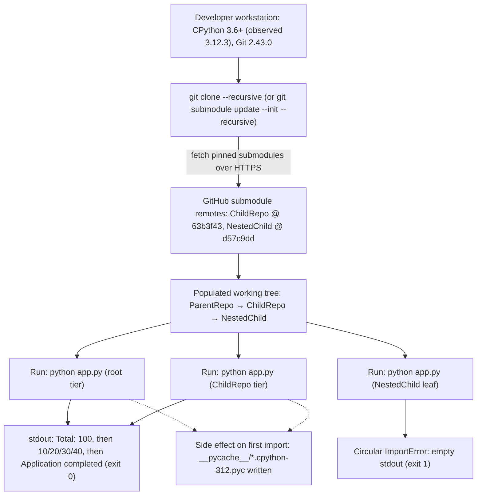
```mermaid
flowchart TD
    Dev["Developer workstation: CPython 3.6+ (observed 3.12.3), Git 2.43.0"]
    Clone["git clone --recursive (or git submodule update --init --recursive)"]
    GH["GitHub submodule remotes: ChildRepo @ 63b3f43, NestedChild @ d57c9dd"]
    Tree["Populated working tree: ParentRepo → ChildRepo → NestedChild"]
    RunRoot["Run: python app.py (root tier)"]
    RunChild["Run: python app.py (ChildRepo tier)"]
    RunNested["Run: python app.py (NestedChild leaf)"]
    OK["stdout: Total: 100, then 10/20/30/40, then Application completed (exit 0)"]
    Fail["Circular ImportError: empty stdout (exit 1)"]
    Bytecode["Side effect on first import: __pycache__/*.cpython-312.pyc written"]

    Dev --> Clone
    Clone -->|fetch pinned submodules over HTTPS| GH
    GH --> Tree
    Tree --> RunRoot
    Tree --> RunChild
    Tree --> RunNested
    RunRoot --> OK
    RunChild --> OK
    RunNested --> Fail
    RunRoot -.-> Bytecode
    RunChild -.-> Bytecode
```

## 3.7 References

The following repository files, folders, direct environment observations, and previously authored specification sections were examined as evidence for this section. No web sources were used.

**Files**

- `app.py` — Root entry point; established the f-string usage (`app.py:L36`) that sets the Python 3.6+ floor, the sole intra-repository import `from service import calculate_total` (`app.py:L15`), and the fixed-list `main()` workflow.
- `service.py` — Root helper module; established the pure `calculate_total`/`calculate_average` functions, the documented "no imports, no classes, and no module-level state," and the Python 3.6+ target.
- `.gitmodules` — Root Git submodule declaration; established the `ChildRepo` remote URL.
- `README.md` — Root project documentation; established the prerequisites (Python 3.6+, verified on 3.13.7; Git any recent version), the "no third-party runtime dependencies and no dependency manifest" statement, the recursive clone/update commands, "the project runs with a stock Python interpreter out of the box," the tokenless-clone-URL security note, and "no container or cloud deployment."
- `ChildRepo/app.py`, `ChildRepo/service.py` — Established the mirrored Python implementation at the middle tier.
- `ChildRepo/.gitmodules` — Established the `NestedChild` remote URL.
- `ChildRepo/README.md` — Established the middle-tier prerequisites table (Python / Git / third-party packages = None), "no container or cloud deployment," and the `NestedChild` known-issue.
- `ChildRepo/NestedChild/app.py`, `ChildRepo/NestedChild/service.py` — Established the 16-line duplicate leaf files whose self-import produces the circular `ImportError` defect.
- `__pycache__/service.cpython-312.pyc` (and the other three `*.cpython-312.pyc` caches) — Established the observed CPython 3.12 toolchain via bytecode magic number `cb0d0d0a`.
- `.blitzyignore` (root, `ChildRepo/`, `ChildRepo/NestedChild/`) — Established the `*.csv` exclusion honored throughout this section.

**Folders**

- `__pycache__/` (each tier) — Contained the CPython bytecode caches; the only build-like artifacts (§3.6.2) and a bytecode cache rather than a data cache (§3.5).
- `ChildRepo/` — Contained the first-level submodule tier mirroring the root two-file structure.
- `ChildRepo/NestedChild/` — Contained the leaf submodule tier exhibiting the circular-import defect.

**Direct environment observations**

- `python3 --version` → Python 3.12.3 and `git --version` → git version 2.43.0 — established the observed toolchain versions.
- File-extension census and recursive manifest search over all non-ignored paths — established the absence of dependency manifests, configuration files, `Dockerfile`, `Makefile`, shell scripts, and CI/CD configuration.

**Cross-referenced specification sections**

- §1.2 System Overview — zero runtime external integration; demonstration-scaffold context; §1.2.3 run-outcome success criteria.
- §1.3 Scope — §1.3.2 out-of-scope boundary (packaging, tests, CI/CD, containerization; no database/network/API) and the `*.csv` exclusion.
- §2.4 Implementation Considerations — behavior verified on Python 3.12.3, the minimal security surface, and the §2.4.4 `NestedChild` circular-import defect with the submodule SHA-pinning supply-chain note.

# 4. Process Flowchart

## 4.1 System Workflows

This chapter documents the executable workflows of the repository exactly as the code performs them. The system is a deliberately minimal, standard-library-only Python program that is replicated across a three-level Git-submodule tree (`600K_ParentRepo` → `ChildRepo` → `ChildRepo/NestedChild`); it exposes no web server, network endpoint, message broker, scheduler, database, or user interface. Consequently its "workflows" are the deterministic, run-to-completion process-execution flows of the command-line entry point (`app.py`, feature F-003), the pure calculation helpers it delegates to (`service.py`, features F-001 and F-002), and the build-time submodule composition that reproduces this structure at every tier (`.gitmodules`, feature F-004).

Every flow below is grounded in the source and in observed runtime behavior. Where a workflow concern named by this section's template does not exist in the code — event processing, message queues, batch scheduling, service-level timing — that absence is stated explicitly rather than inferred. The repository defines no service-level agreements (SLAs) or key performance indicators (KPIs) anywhere (§1.2.3), so the diagrams describe control flow and outcomes rather than time budgets; timing is discussed further in §4.2.

### 4.1.1 Core Business Processes

The repository's one end-to-end business process is the **fixed-list summation workflow** (F-003, `app.py` → `main()`): an operator runs the entry point from a repository tier, the program sums the hard-coded list `[10, 20, 30, 40]`, prints the total and each operand, and terminates with a completion message. There is exactly one human touchpoint — the command-line invocation `python app.py` — and one output channel, standard output. The behavior is deterministic: for the fixed input the program always prints `Total: 100`, the four operands `10`, `20`, `30`, `40`, and `Application completed`, then exits with status code `0` (requirements F-003-RQ-001 through F-003-RQ-003, verified by execution).

**End-to-end user journey.** A developer or operator on a workstation with CPython 3.6+ (§3.6.1) invokes `python app.py` from one of the repository tiers. At module load, `app.py` imports `calculate_total` from the co-located `service` module (`app.py` L15). The `if __name__ == "__main__"` guard (`app.py` L45) then decides whether the program is being executed directly (run `main()`) or merely imported (do nothing — F-003-RQ-004). When executed directly, `main()` builds the fixed list, delegates the arithmetic to `calculate_total` (F-001), writes six lines to standard output, and returns, at which point the process exits `0`. The journey has no interactive prompts, arguments, files, or network calls.

**High-level system workflow.** The following swim-lane flowchart shows the full end-to-end process across the four participating boundaries (Operator, `app.py`, `service.py`, standard output/OS) and captures the two governing decision points — import resolution and the `__main__` guard — plus the one intrinsic error path (the `NestedChild` leaf, whose duplicated `service.py` fails to define `calculate_total`).

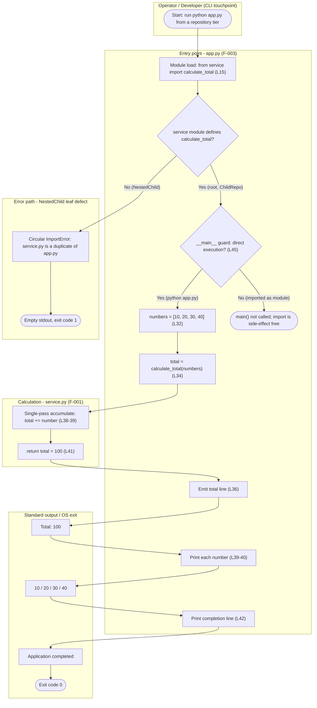
```mermaid
flowchart TD
    subgraph Operator["Operator / Developer (CLI touchpoint)"]
        direction TB
        OpStart(["Start: run python app.py from a repository tier"])
    end
    subgraph AppTier["Entry point - app.py (F-003)"]
        direction TB
        Load["Module load: from service import calculate_total (L15)"]
        ImportOK{"service module defines calculate_total?"}
        Guard{"__main__ guard: direct execution? (L45)"}
        Build["numbers = [10, 20, 30, 40] (L32)"]
        Call["total = calculate_total(numbers) (L34)"]
        PrintT["Emit total line (L36)"]
        LoopP["Print each number (L39-40)"]
        PrintC["Print completion line (L42)"]
        NoOp(["main() not called; import is side-effect free"])
    end
    subgraph SvcTier["Calculation - service.py (F-001)"]
        direction TB
        Sum["Single-pass accumulate: total += number (L38-39)"]
        Ret["return total = 100 (L41)"]
    end
    subgraph OutTier["Standard output / OS exit"]
        direction TB
        L1["Total: 100"]
        L2["10 / 20 / 30 / 40"]
        L3["Application completed"]
        Exit0(["Exit code 0"])
    end
    subgraph ErrTier["Error path - NestedChild leaf defect"]
        direction TB
        ImpErr["Circular ImportError: service.py is a duplicate of app.py"]
        Exit1(["Empty stdout, exit code 1"])
    end
    OpStart --> Load
    Load --> ImportOK
    ImportOK -->|"No (NestedChild)"| ImpErr
    ImpErr --> Exit1
    ImportOK -->|"Yes (root, ChildRepo)"| Guard
    Guard -->|"No (imported as module)"| NoOp
    Guard -->|"Yes (python app.py)"| Build
    Build --> Call
    Call --> Sum
    Sum --> Ret
    Ret --> PrintT
    PrintT --> L1
    L1 --> LoopP
    LoopP --> L2
    L2 --> PrintC
    PrintC --> L3
    L3 --> Exit0
```

**Decision points.** The workflow contains a small, fully enumerable set of branch points. Each is a pure control-flow decision on in-memory data or on the interpreter's execution mode — there are no data-driven branches beyond loop termination and the empty-input guard.

| Decision Point | Location | Branch Outcomes | Related Requirement |
| --- | --- | --- | --- |
| Import resolution | `app.py` L15 / `service.py` | `service` defines `calculate_total` → proceed; duplicate module (`NestedChild`) → circular `ImportError` | Defect analysis (§1.2.3) |
| `__main__` execution guard | `app.py` L45 | Direct run → call `main()`; imported → no side effects | F-003-RQ-004 |
| Print-loop continuation | `app.py` L39 | More operands → `print(number)`; none left → print completion line | F-003-RQ-002 |
| Accumulation-loop continuation | `service.py` L38 | More elements → `total += number`; none/empty → `return total` (`0` if empty) | F-001-RQ-001, F-001-RQ-002 |
| Empty-input guard (mean) | `service.py` L75 | Empty/falsey → `return 0`; otherwise → compute mean | F-002-RQ-002 |

**Detailed process flow — F-003 (fixed-list entry-point workflow).** The entry point is a strictly linear sequence with two decisions: the `__main__` guard and the print loop. The summation itself is delegated (the `Call` step) to F-001.

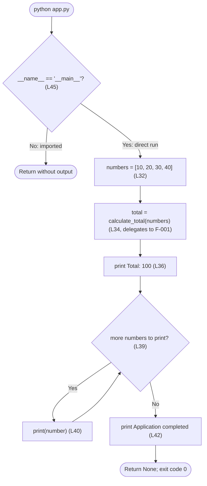
```mermaid
flowchart TD
    Start(["python app.py"]) --> G{"__name__ == '__main__'? (L45)"}
    G -->|"No: imported"| Imp(["Return without output"])
    G -->|"Yes: direct run"| N["numbers = [10, 20, 30, 40] (L32)"]
    N --> C["total = calculate_total(numbers) (L34, delegates to F-001)"]
    C --> PT["print Total: 100 (L36)"]
    PT --> D{"more numbers to print? (L39)"}
    D -->|"Yes"| P["print(number) (L40)"]
    P --> D
    D -->|"No"| AC["print Application completed (L42)"]
    AC --> E(["Return None; exit code 0"])
```

**Detailed process flow — F-001 (list summation).** `calculate_total` is a pure function: it initializes an accumulator to `0`, makes exactly one pass over the iterable adding each element, and returns the accumulated total. An empty iterable simply never enters the loop body, so the natural result is `0` (F-001-RQ-002). It performs no I/O and does not mutate its argument (F-001-RQ-003).

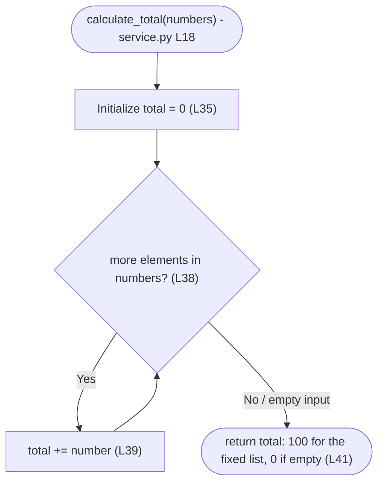
```mermaid
flowchart TD
    S(["calculate_total(numbers) - service.py L18"]) --> T["Initialize total = 0 (L35)"]
    T --> D{"more elements in numbers? (L38)"}
    D -->|"Yes"| A["total += number (L39)"]
    A --> D
    D -->|"No / empty input"| R(["return total: 100 for the fixed list, 0 if empty (L41)"])
```

**Detailed process flow — F-002 (arithmetic mean).** `calculate_average` is a catalogued feature but is **defined and never invoked** by any entry point (§2.3.4); it is documented here for completeness. It guards against division by zero by returning `0` for empty/falsey input, and otherwise delegates summation to F-001 before dividing by the element count.

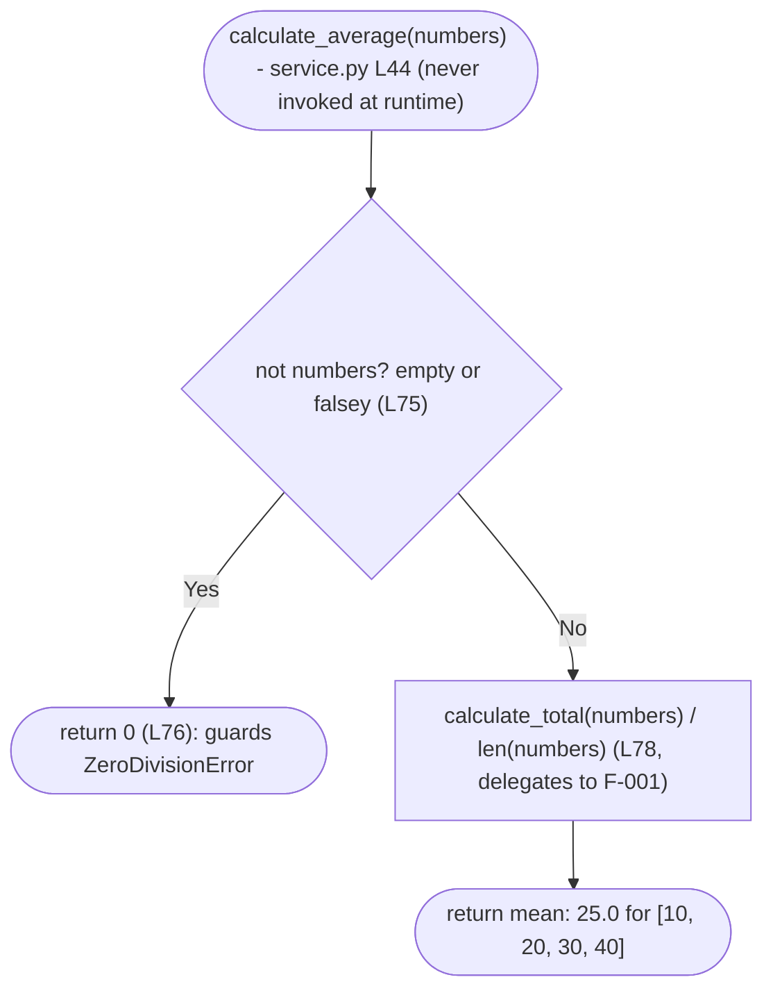
```mermaid
flowchart TD
    S(["calculate_average(numbers) - service.py L44 (never invoked at runtime)"]) --> G{"not numbers? empty or falsey (L75)"}
    G -->|"Yes"| Z(["return 0 (L76): guards ZeroDivisionError"])
    G -->|"No"| C["calculate_total(numbers) / len(numbers) (L78, delegates to F-001)"]
    C --> R(["return mean: 25.0 for [10, 20, 30, 40]"])
```

**Error-handling paths.** Only one error path is intrinsic to the shipped code: the `ChildRepo/NestedChild` leaf raises a circular `ImportError` at module load because its `service.py` is a byte-for-byte duplicate of its `app.py` and therefore never defines `calculate_total` (empty stdout, exit code `1`). Additional, input-dependent error conditions (`TypeError` for non-numeric or non-iterable input) exist in the pure functions but cannot be triggered by the fixed workflow, which always supplies a valid four-integer list. All error handling — including the complete error-state catalog, propagation model, and (absent) recovery mechanisms — is detailed in §4.3.2.

### 4.1.2 Integration Workflows

This system has **no runtime integration** with any external system: it has zero third-party dependencies, opens no sockets, performs no database or file I/O, and its only import statement anywhere is the intra-repository `from service import calculate_total` (§1.2.1, §2.3.2). The only cross-system interaction expressed in the repository is at the **source-composition (build) level**, where Git fetches submodule content from GitHub during a recursive clone (F-004). Each template concern is addressed below, with absences stated explicitly.

**Data flow between systems.** At runtime the entire data flow is intra-process and in-memory: the hard-coded list `[10, 20, 30, 40]` flows from `main()` into `calculate_total`, the returned scalar `100` flows back to `main()`, and six text lines flow out to standard output. No data crosses a process, host, or network boundary at runtime. The only inter-system data movement is **build-time**: `git clone --recursive` (or `git submodule update --init --recursive`) transfers the pinned submodule working trees from the GitHub remotes into the local checkout (§3.6.4).

**API interactions.** The sole "API" is the **intra-process Python function-call contract** between the entry point and the calculation module: the import `from service import calculate_total` (`app.py` L15; `ChildRepo/app.py` L14) followed by the call `calculate_total(numbers)` (`app.py` L34). There is no REST, HTTP, gRPC, GraphQL, or command-line-argument interface; the program accepts no external request of any kind.

**Event processing flows.** None. The program is fully synchronous and imperative — there is no event loop, callback, signal handler, message consumer, `async`/`await` coroutine, thread, or publish/subscribe mechanism anywhere in the codebase. `service.py` explicitly has "no imports, no classes, and no module-level state," and no such constructs appear in any tier.

**Batch processing sequences.** The concept applies in two limited senses. (1) **Runtime batch job:** the program is itself a single run-to-completion batch — it processes one fixed dataset in a single pass and exits, with no scheduler, cron, queue, or trigger driving it. (2) **Build-time batch acquisition:** the recursive submodule clone is a batch sequence that fetches all three tiers in dependency order (F-004).

The runtime intra-process interaction is shown as an integration sequence diagram across the participating boundaries:

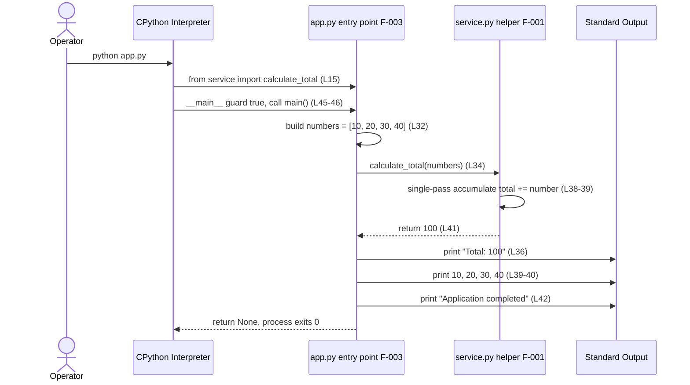
```mermaid
sequenceDiagram
    actor Operator
    participant Runtime as CPython Interpreter
    participant App as app.py entry point F-003
    participant Svc as service.py helper F-001
    participant Out as Standard Output
    Operator->>Runtime: python app.py
    Runtime->>App: from service import calculate_total (L15)
    Runtime->>App: __main__ guard true, call main() (L45-46)
    App->>App: build numbers = [10, 20, 30, 40] (L32)
    App->>Svc: calculate_total(numbers) (L34)
    Svc->>Svc: single-pass accumulate total += number (L38-39)
    Svc-->>App: return 100 (L41)
    App->>Out: print "Total: 100" (L36)
    App->>Out: print 10, 20, 30, 40 (L39-40)
    App->>Out: print "Application completed" (L42)
    App-->>Runtime: return None, process exits 0
```

The build-time submodule acquisition (F-004) is the only integration that reaches outside the local host; it contacts the GitHub remotes declared in `.gitmodules` and `ChildRepo/.gitmodules`, fetching each submodule at its pinned commit:

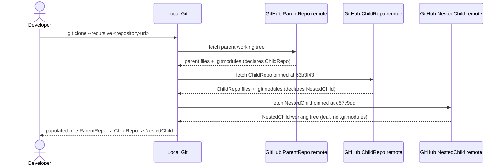
```mermaid
sequenceDiagram
    actor Dev as Developer
    participant Git as Local Git
    participant P as GitHub ParentRepo remote
    participant C as GitHub ChildRepo remote
    participant N as GitHub NestedChild remote
    Dev->>Git: git clone --recursive <repository-url>
    Git->>P: fetch parent working tree
    P-->>Git: parent files + .gitmodules (declares ChildRepo)
    Git->>C: fetch ChildRepo pinned at 63b3f43
    C-->>Git: ChildRepo files + .gitmodules (declares NestedChild)
    Git->>N: fetch NestedChild pinned at d57c9dd
    N-->>Git: NestedChild working tree (leaf, no .gitmodules)
    Git-->>Dev: populated tree ParentRepo -> ChildRepo -> NestedChild
```

## 4.2 Flowchart Requirements and Validation Rules

This section applies the standard flowchart-requirement checklist — start/end points, process steps, decision diamonds, system boundaries, user touchpoints, error states, recovery paths, and timing/SLA — to each major workflow identified in §4.1, and then consolidates the validation rules that govern each step. Because the system is a fixed-input, standard-library-only program with no external I/O, several checklist items resolve to "not present"; those are recorded explicitly so the mapping is complete rather than implied.

### 4.2.1 Workflow Elements and Timing Considerations

The table below maps every required flowchart element onto the three major workflows: the runtime entry-point workflow (F-003), the pure calculation functions it drives (F-001 summation and the defined-but-unused F-002 mean), and the build-time submodule composition (F-004).

| Flowchart Element | Runtime Workflow (F-003) | Calculation Functions (F-001 / F-002) | Build-Time Composition (F-004) |
| --- | --- | --- | --- |
| Start point | `python app.py` invocation (`app.py` L45–L46) | Call to `calculate_total` / `calculate_average` (`service.py` L18 / L44) | `git clone --recursive` (root `README.md`, §3.6.4) |
| End point(s) | Print `Application completed` → exit `0`; or import-time `ImportError` → exit `1` on the `NestedChild` leaf | `return total` (L41) / `return mean` or `return 0` (L76, L78) | Populated three-tier working tree at pinned SHAs |
| Key process steps | Build list (L32) → delegate sum (L34) → print total (L36) → print-loop (L39–40) → print completion (L42) | Init accumulator (L35) → single-pass add (L38–39) / empty-guard (L75) then divide (L78) | Fetch parent → fetch `ChildRepo` @ 63b3f43 → fetch `NestedChild` @ d57c9dd |
| Decision diamonds | `__main__` guard (L45); print-loop continuation (L39) | Accumulation-loop continuation (L38); empty-input guard (L75) | `--recursive` supplied? (populate vs. empty submodule dirs) |
| System boundaries | Operator CLI ↔ CPython process ↔ standard output/OS | In-process function-call boundary only | Local Git ↔ GitHub remotes over HTTPS |
| User touchpoints | Single CLI invocation; no prompts/args/stdin | None — internal API consumed only by `main()` | Single clone/init command |
| Error states | `NestedChild` circular `ImportError` (empty stdout, exit `1`) | `TypeError` for non-numeric/non-iterable/unsized input (uncaught) | Failed/omitted fetch → empty submodule directories |
| Recovery paths | None automated; operator re-runs after fixing co-located `service.py` | None; exception propagates to interpreter | Manual `git submodule update --init --recursive` |
| Timing / SLA | None defined; sub-second run-to-completion | None; O(n) single pass, O(1) extra space | None; bounded by network + Git operations |

**Timing and SLA considerations.** The repository defines **no** service-level agreement, latency budget, timeout, deadline, retry interval, or scheduled-execution window anywhere in the code or documentation (§1.2.3, §2.2). What can be stated is the observed and structural behavior: the root and `ChildRepo` programs complete effectively instantaneously — a single O(n) pass over four integers plus six standard-output writes, exiting `0`; `calculate_total` runs in O(n) time and O(1) extra space (one accumulator, per §2.2 F-001 performance criteria). The only time-variable step is the build-time submodule acquisition (F-004), whose duration is bounded solely by network latency and Git operations, with "no formal budget defined" (§2.2 F-004). No component contains a timer, backoff, or deadline construct.

### 4.2.2 Validation Rules

Because the runtime workflow operates on hard-coded input and performs no external I/O, its validation surface is intentionally minimal. The rules below consolidate the four per-feature **Validation Rules** tables from §2.2 (Business Rules, Data Validation, Security/Authorization, Compliance) and map them onto the workflow steps.

| Validation Category | Rule as Implemented | Evidence / Requirement |
| --- | --- | --- |
| Business rule (F-001) | Summing zero elements yields `0` (arithmetic identity for the empty sum) | `service.py` L35–L41; F-001-RQ-002 |
| Business rule (F-002) | Empty/falsey input yields `0`, avoiding a `ZeroDivisionError` | `service.py` L75–L76; F-002-RQ-002 |
| Business rule (F-003) | Output is deterministic for the fixed input; the printed total is always `100` | `app.py` L32–L42; F-003-RQ-001 |
| Business rule (F-004) | Each tier mirrors the two-file structure; submodule entries pin specific commits; `NestedChild` is a leaf with no `.gitmodules` | `.gitmodules`, `ChildRepo/.gitmodules`; F-004-RQ-001/002 |
| Data validation (F-001/F-002) | No explicit validation; non-numeric element → `TypeError`; non-iterable argument → `TypeError`; unsized iterable → `TypeError` at `len()` (all uncaught) | `service.py`; §2.2 F-001/F-002 validation tables |
| Data validation (F-003) | None — the input is a constant, so there is no user input to validate | `app.py` L32; F-003 validation table |
| Data validation (F-004) | Submodule pins specific commits; omitting `--recursive` leaves submodule directories empty | `.gitmodules`; F-004-RQ-003 |
| Authorization checkpoints | None — no authentication, authorization, access control, or secret handling at any step; the workflow reads no credentials and writes only to standard output | §2.2 (Security Requirements: "None applicable") |
| Regulatory compliance checks | None defined in the repository at any step | §2.2 (Compliance Requirements: "None defined") |

**Authorization and compliance posture.** No workflow step performs an authorization check or a regulatory-compliance check, because the program handles no user, no external input, no secrets, and no regulated data (§2.2). The single security-adjacent rule in the repository is documentation-level guidance attached to F-004: use clean public URLs and never embed access tokens or credentials in a shared clone URL (root `README.md` security note). This is advisory guidance, not an enforced checkpoint in code.

**Data-validation posture (implicit).** Validation in the calculation functions is not performed by an explicit guard; it is delegated to Python's runtime type system. `calculate_total` feeds each element directly into `total += number`, so a non-numeric element raises `TypeError` at the `+` operator and a non-iterable argument raises `TypeError` at the `for` statement — both propagate uncaught. The fixed workflow (F-003) never triggers these paths because it always supplies a valid four-integer list. The implicit validation behavior is shown below.

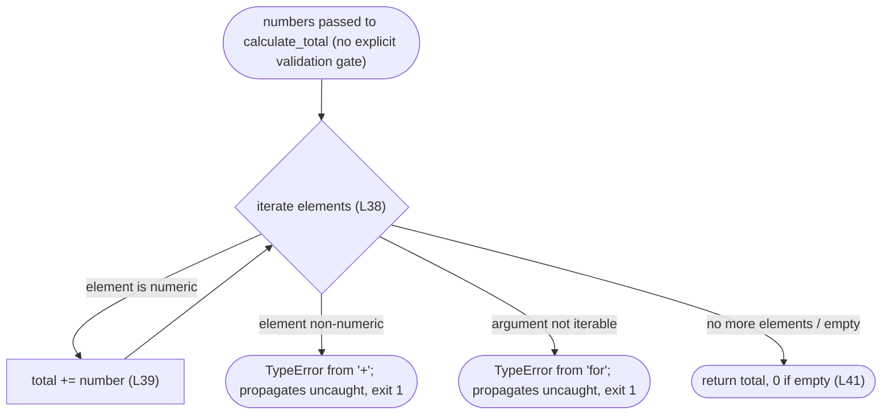
```mermaid
flowchart TD
    Start(["numbers passed to calculate_total (no explicit validation gate)"]) --> Loop{"iterate elements (L38)"}
    Loop -->|"element is numeric"| Add["total += number (L39)"]
    Add --> Loop
    Loop -->|"element non-numeric"| TErr(["TypeError from '+'; propagates uncaught, exit 1"])
    Loop -->|"argument not iterable"| TErr2(["TypeError from 'for'; propagates uncaught, exit 1"])
    Loop -->|"no more elements / empty"| Ret(["return total, 0 if empty (L41)"])
```

## 4.3 Technical Implementation

This section documents the state-management and error-handling implementation behind the workflows in §4.1. The program is built from pure functions with only ephemeral, in-memory state and no persistence, caching, or transaction layer, and it contains no explicit error-handling constructs (no `try`/`except`, retry, or fallback logic). Each template item is therefore either mapped to the concrete mechanism that exists or explicitly recorded as absent.

### 4.3.1 State Management

**State transitions.** Two kinds of state are meaningful in this system: the **process lifecycle** and the **accumulator** inside `calculate_total`. The process lifecycle proceeds from interpreter start, through import resolution and the `__main__` guard, to a terminal exit; the `NestedChild` leaf diverges into a failed terminal state at import time. This lifecycle is shown as a state-transition diagram.

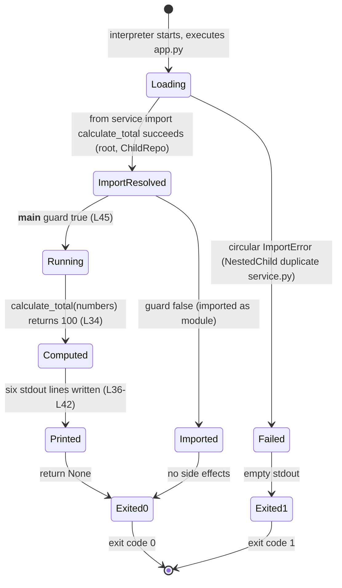
```mermaid
stateDiagram-v2
    [*] --> Loading: interpreter starts, executes app.py
    Loading --> ImportResolved: from service import calculate_total succeeds (root, ChildRepo)
    Loading --> Failed: circular ImportError (NestedChild duplicate service.py)
    ImportResolved --> Running: __main__ guard true (L45)
    ImportResolved --> Imported: guard false (imported as module)
    Running --> Computed: calculate_total(numbers) returns 100 (L34)
    Computed --> Printed: six stdout lines written (L36-L42)
    Printed --> Exited0: return None
    Imported --> Exited0: no side effects
    Failed --> Exited1: empty stdout
    Exited0 --> [*]: exit code 0
    Exited1 --> [*]: exit code 1
```

The second state machine is the running total accumulated in a single pass over the fixed list. It starts at `0` and advances deterministically with each element, ending at `100` (F-001-RQ-001):

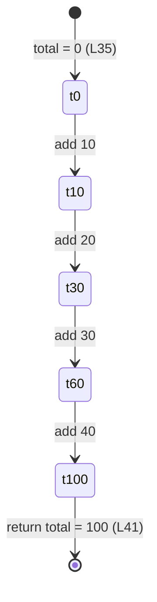
```mermaid
stateDiagram-v2
    [*] --> t0: total = 0 (L35)
    t0 --> t10: add 10
    t10 --> t30: add 20
    t30 --> t60: add 30
    t60 --> t100: add 40
    t100 --> [*]: return total = 100 (L41)
```

**Data persistence points.** The workflow persists **no application data**. It writes only to standard output (transient), reads no files or databases, and holds all data in memory for the lifetime of the process. The single persistence-like artifact anywhere in the system is the interpreter's **implicit bytecode cache** — `__pycache__/*.cpython-312.pyc` — written the first time a module is imported (§3.6.2). That cache is an interpreter optimization, not application state, and is regenerated automatically; it never carries workflow data between runs.

**Caching requirements.** None. There is no application-level cache, memoization, or result store — `calculate_total` recomputes the sum on every call, and each program run recomputes from scratch. The only cache present is the bytecode cache noted above, which belongs to the interpreter toolchain rather than the workflow.

**Transaction boundaries.** None. The system has no database, no atomic multi-step unit of work, and no rollback/commit semantics. Each execution is an **independent, idempotent** process: because `calculate_total` and `calculate_average` are pure and share no mutable module-level state (§2.3.4), re-running `python app.py` any number of times yields byte-identical output with no accumulated or partial state to reconcile.

### 4.3.2 Error Handling

The program contains **no explicit error-handling code** — there are no `try`/`except` blocks, no retry loops, and no custom exception types. Errors therefore surface through Python's default uncaught-exception mechanism: a traceback printed to standard error and a non-zero exit code. The error catalog below enumerates every failure mode evidenced in the code.

| Error State | Trigger | Handling / Notification | Recovery |
| --- | --- | --- | --- |
| Circular `ImportError` | `NestedChild/service.py` duplicates `app.py`, so `service` never defines `calculate_total` and imports itself | Uncaught; traceback to stderr; exit `1`; empty stdout | Manual — provide a real `service.py` defining `calculate_total` (preserved as-is, not fixed) |
| `TypeError` (non-numeric element) | A non-numeric element reaches `total += number` | Uncaught; traceback to stderr; exit `1` | Manual — supply numeric input; not reachable via the fixed list |
| `TypeError` (non-iterable argument) | A non-iterable argument reaches the `for` loop | Uncaught; traceback to stderr; exit `1` | Manual — supply an iterable |
| `TypeError` (unsized iterable) | An unsized iterable reaches `len()` in `calculate_average` | Uncaught; traceback to stderr; exit `1` | Manual — supply a sized collection; `calculate_average` is never invoked (§2.3.4) |
| `ZeroDivisionError` | Would occur on empty input to `calculate_average` | **Guarded** — `if not numbers: return 0` (L75–L76) returns before dividing | Not raised; defensive fallback value |

The runtime error-handling control flow — import failure vs. success, and the implicit type check on the summation path — is shown below.

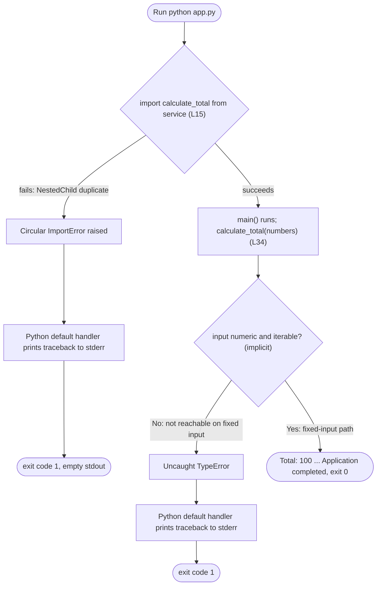
```mermaid
flowchart TD
    Run(["Run python app.py"]) --> Imp{"import calculate_total from service (L15)"}
    Imp -->|"fails: NestedChild duplicate"| IE["Circular ImportError raised"]
    IE --> Notify1["Python default handler prints traceback to stderr"]
    Notify1 --> X1(["exit code 1, empty stdout"])
    Imp -->|"succeeds"| Exec["main() runs; calculate_total(numbers) (L34)"]
    Exec --> TypeChk{"input numeric and iterable? (implicit)"}
    TypeChk -->|"No: not reachable on fixed input"| TE["Uncaught TypeError"]
    TE --> Notify2["Python default handler prints traceback to stderr"]
    Notify2 --> X1b(["exit code 1"])
    TypeChk -->|"Yes: fixed-input path"| OK(["Total: 100 ... Application completed, exit 0"])
```

**Retry mechanisms.** None. No component retries a failed operation; there is no backoff, attempt counter, or circuit breaker anywhere in the code.

**Fallback processes.** None at the workflow level. The only defensive fallback is a **value**, not a process: `calculate_average` returns `0` for empty/falsey input (L75–L76) to avoid division by zero (F-002-RQ-002). `calculate_total` has no fallback because returning `0` for an empty iterable is the natural result of the accumulation, not a special case.

**Error notification flows.** The sole notification channel is Python's default uncaught-exception handler, which writes a traceback to standard error and sets the process exit code to `1`. There is no logging framework, no structured log, no metrics emission, and no alerting or monitoring hook — consistent with the repository's absence of any observability tooling. For the `NestedChild` defect the canonical stderr message is `ImportError: cannot import name 'calculate_total' from partially initialized module 'service' (most likely due to a circular import)`.

**Recovery procedures.** Recovery is entirely manual and, because each run is stateless and idempotent (§4.3.1), requires no cleanup. For an input-driven `TypeError` the caller simply supplies valid input and re-invokes. For the `NestedChild` circular-import defect, recovery requires replacing the duplicated `service.py` with a proper calculation module; this is intentionally documented as-is and left unrepaired (§1.2.3). There is no automated recovery, self-healing, or compensating action in the system.

## 4.4 References

The following repository files, folders, cross-referenced specification sections, and observations were used as evidence for the workflows, diagrams, and validation rules in this chapter.

**Repository files examined**

- `app.py` — Root entry point; established the F-003 workflow steps and decision points: import (L15), `main()` (L17), fixed list `[10, 20, 30, 40]` (L32), delegation to `calculate_total` (L34), the total/number/completion prints (L36, L39–L40, L42), and the `__main__` guard (L45–L46).
- `service.py` — Root calculation module; established F-001 `calculate_total` (accumulator L35, single-pass loop L38–L39, `return` L41) and F-002 `calculate_average` (empty-input guard L75–L76, delegation-and-divide L78, defined-but-never-invoked).
- `README.md` — Root documentation; established the run model, expected standard output, verified exit behavior, the F-004 security note (no credentials in clone URLs), and the documented `NestedChild` circular-import defect.
- `ChildRepo/app.py` — Mirrored entry point; established the equivalent workflow with import at L14 and `main()` at L16.
- `ChildRepo/service.py` — Mirrored calculation module (`calculate_total` L18, `calculate_average` L44).
- `ChildRepo/README.md` — Mirrored documentation confirming the same run model and defect note at the middle tier.
- `ChildRepo/NestedChild/app.py` — Leaf entry point (16 lines); established the self-import that triggers the error path (`from service import calculate_total` at L1).
- `ChildRepo/NestedChild/service.py` — Byte-for-byte duplicate of the leaf `app.py`; established the root cause of the circular `ImportError` (it defines `main()` instead of `calculate_total`).
- `.gitmodules` — Root submodule declaration; established the build-time F-004 edge parent → `ChildRepo`.
- `ChildRepo/.gitmodules` — Established the F-004 edge `ChildRepo` → `NestedChild` (leaf has no `.gitmodules`).

**Repository folders examined**

- `ChildRepo/` — First-level submodule tier; confirmed the replicated two-file `app.py`/`service.py` structure that runs correctly (exit 0).
- `ChildRepo/NestedChild/` — Leaf submodule tier; confirmed the broken duplicate arrangement that fails at import (exit 1).

**Runtime verification (direct execution)**

- Executed `python3 app.py` at the root and `ChildRepo` tiers — confirmed the six-line output (`Total: 100`, `10`, `20`, `30`, `40`, `Application completed`) and exit code `0`.
- Executed `python3 app.py` at the `ChildRepo/NestedChild` tier — confirmed empty standard output, exit code `1`, and the circular `ImportError` on standard error.

**Specification cross-references**

- §1.2 System Overview — integration absence (§1.2.1) and de-facto success criteria / absence of SLAs and KPIs (§1.2.3).
- §2.2 Functional Requirements — feature and requirement identifiers (F-001…F-004, `F-XXX-RQ-YYY`) and the per-feature Business Rules / Data Validation / Security / Compliance tables cited throughout §4.2.
- §2.3 Feature Relationships — dependency edges (F-003→F-001, F-002→F-001, F-004→F-003), integration-point inventory, shared components, and common services.
- §3.6 Development &amp; Deployment — run/acquisition model, absence of build/CI/CD tooling, and the implicit bytecode-cache artifact referenced in §4.3.1.

**Web sources**

- None. All findings are grounded in direct repository inspection and observed runtime behavior; no external sources were consulted for this section.

# 5. System Architecture

## 5.1 High-Level Architecture

This section documents the architecture of `600K_ParentRepo` exactly as it exists in the repository. The system is a deliberately minimal, standard-library-only Python demonstration whose entire executable behavior is a single fixed-list summation printed to standard output, replicated at each tier of a Git-submodule tree (`600K_ParentRepo → ChildRepo → NestedChild`). Consistent with the evidence-based determinations in §1.2, §2.3, and §3.6, the discussion below records the architecture that is present and explicitly marks as *Not applicable* the architectural concerns (distributed services, persistence, messaging, external runtime integration, formal SLAs) that the codebase does not implement, rather than inventing them.

### 5.1.1 System Overview

**Architectural style.** The system is a single-process, monolithic command-line program built exclusively on the CPython standard library. Within that one process it applies a two-layer *separation-of-concerns* pattern: a thin entry-point/orchestration layer (`app.py`) sits above a pure computation layer (`service.py`), and the orchestrator delegates all arithmetic to the computation module (`from service import calculate_total`, `app.py` L15; `total = calculate_total(numbers)`, L34). This same two-file pattern is reproduced at every tier of a three-repository composition that is wired together at build time by native Git submodules (`.gitmodules`, `ChildRepo/.gitmodules`), forming the tree `600K_ParentRepo → ChildRepo → NestedChild`.

**Rationale.** The repository is positioned as a demonstration / teaching scaffold rather than a market-facing product (§1.2.1). The architecture therefore optimizes for simplicity, portability, and a zero-dependency operational surface: there is no framework, dependency-injection container, service boundary, or runtime process split, so a reader can comprehend the whole system end to end. The two-module split still models a real, reusable design — a pure, testable computation core behind a replaceable orchestration shell — at the smallest possible scale.

**Key architectural principles and patterns (evidenced in code).**

- **Separation of concerns / layering** — orchestration (`app.py` → `main()`, feature F-003) is cleanly separated from computation (`service.py` → `calculate_total`/`calculate_average`, features F-001/F-002).
- **Pure functions** — the `service.py` helpers perform no I/O, hold no module-level state, and do not mutate their arguments (module docstring, `service.py` L9–L11), which makes them deterministic and independently testable.
- **Import safety via the `__main__` guard** — `app.py` invokes `main()` only under `if __name__ == "__main__":` (L45–L46), so importing the module produces no side effects.
- **Internal composition / delegation** — `calculate_average` reuses `calculate_total` rather than re-implementing summation (`service.py` L78).
- **Structural replication (mirroring)** — the identical `app.py`/`service.py` pair recurs at each tier; the root and `ChildRepo` copies are functionally equivalent, differing only by docstrings and comments (§2.3.3).
- **Build-time composition** — repositories are linked as pinned Git submodules (F-004); there is no cross-tier *runtime* coupling of any kind (§2.3).
- **Standard-library-only / dependency-free** — the only import anywhere in the tree is the intra-repository `from service import calculate_total` (§3.1, §3.3).

**System boundaries and major interfaces.**

- **Runtime boundary** — a single operating-system process running one CPython 3.6+ interpreter. The root and `ChildRepo` programs write six lines to standard output and exit with status code `0` (verified by execution; §1.2.3).
- **Sole runtime output interface** — the process's standard-output stream, plus the integer process exit code. There is no GUI, HTTP endpoint, or API surface.
- **Sole runtime input** — the hard-coded list literal `[10, 20, 30, 40]` (`app.py` L32). The program accepts no command-line arguments, environment variables, files, or interactive/network input.
- **Intra-process interface** — a Python module import followed by a direct function call (`from service import calculate_total`; `calculate_total(numbers)`), the only integration in the runtime path (§2.3.2).
- **Build-time / acquisition boundary** — Git and the GitHub-hosted submodule remotes reached over HTTPS during a recursive clone or `git submodule update --init --recursive` (§3.4, §3.6.4).
- **Explicit non-boundaries** — no network sockets, database connections, message queues, or application file I/O are opened at runtime. The only file the runtime writes is the implicit CPython bytecode cache `__pycache__/*.cpython-312.pyc`, produced as a side effect of import (§4.3.1).

### 5.1.2 Core Components

The architecturally significant components are the two source modules replicated at each tier (`app.py`, `service.py`), the submodule-declaration manifest (`.gitmodules`), and the two submodule tiers themselves (`ChildRepo`, `ChildRepo/NestedChild`). Because the output-format standard limits any table to four columns, the requested "Core Components" attributes are presented as two paired tables: the first covers responsibility, dependencies, and integration points; the second covers critical considerations. Terminology (F-001–F-004) is carried forward verbatim from §2.1 for traceability.

*Table 1 — Responsibilities, dependencies, and integration points*

| Component | Primary Responsibility | Key Dependencies | Integration Points |
| --- | --- | --- | --- |
| `app.py` — entry-point orchestrator (F-003) | Define `main()` under the `__main__` guard; build the fixed list, delegate summation, and write the results and exit status to stdout | Co-located `service.py` (`calculate_total`); CPython 3.6+ standard library | Imports `service` (L15); calls `calculate_total(numbers)` (L34); writes to standard output (L36, L39–L40, L42) |
| `service.py` — pure computation module (F-001/F-002) | Provide `calculate_total` (single-pass sum) and `calculate_average` (mean) as pure, side-effect-free helpers | None — no imports, classes, or module-level state | Consumed by `app.py` via import + call; `calculate_average` delegates internally to `calculate_total` (L78) |
| `.gitmodules` — submodule manifest (F-004) | Declare the child submodule path and its pinned remote URL at build time | Git | Links root → `ChildRepo`; the nested `ChildRepo/.gitmodules` links `ChildRepo` → `NestedChild` |
| `ChildRepo` — first-level submodule | Independently runnable mirror of the two-file pattern (middle tier) | Git; its own co-located `service.py` | Pinned at commit `63b3f43`; embeds `NestedChild`; runs standalone (exit 0) |
| `ChildRepo/NestedChild` — leaf submodule | Leaf mirror of the pattern; non-functional at runtime (preserved defect) | Git | Pinned at commit `d57c9dd`; its `app.py` and `service.py` are byte-identical → circular `ImportError` |

*Table 2 — Critical considerations*

| Component | Critical Considerations |
| --- | --- |
| `app.py` | Requires a co-located `service.py` that actually defines `calculate_total`; requires Python 3.6+ (f-string at L36); operates only on the hard-coded list, with no external input path |
| `service.py` | Deterministic and reusable; `calculate_average` is defined but never invoked (dormant API, F-002); non-numeric elements or unsized iterables surface as an uncaught `TypeError` (§2.4) |
| `.gitmodules` | Absent at the `NestedChild` leaf; pins exact commit SHAs; requires a recursive clone/init to populate all tiers (§3.6.4) |
| `ChildRepo` | Functionally equivalent to the root (differs only by docstrings/comments, not byte-identical); execution verified to exit 0 |
| `ChildRepo/NestedChild` | Broken at import time by construction; documented and preserved as-is, not repaired (§2.4.4); the leaf has no `.gitmodules` and only a one-line README |

### 5.1.3 Data Flow Description

**Primary runtime data flow.** All runtime data movement is in-memory and confined to a single process. When the root or `ChildRepo` program runs, `main()` constructs the list literal `[10, 20, 30, 40]` (`app.py` L32) and passes it by reference to `calculate_total` (L34). `calculate_total` walks the list once, accumulating a running total, and returns the scalar `100` (`service.py` L35, L38–L39, L41). `main()` then formats that scalar into the string `Total: 100` via an f-string and writes it to standard output (L36), iterates the same list to write each element on its own line (L39–L40), and finally writes `Application completed` (L42). No datum leaves the process except as bytes on the stdout stream, and the process exits with status `0`.

**Integration patterns and protocols.** At runtime the only integration mechanism is an intra-process Python module import followed by a direct, synchronous function call (§2.3.2); arguments are passed in memory with no serialization, marshaling, or network protocol. There is no request/response, publish/subscribe, message-queue, or batch-transfer pattern anywhere in the runtime path. The only cross-repository integration is *build-time*: Git resolves the pinned submodule commits and fetches them from the GitHub remotes over HTTPS during a recursive clone or init (§3.4, §3.6.4).

**Data transformation points.** There is exactly one computational transformation — the accumulation loop in `calculate_total`, which reduces an ordered collection of numbers to a single scalar sum (`service.py` L38–L39). A second, presentational transformation converts that integer to text through f-string interpolation for stdout (`app.py` L36). The dormant `calculate_average` would introduce a divide-by-count transformation (`service.py` L78) but is never invoked (F-002).

**Key data stores and caches.** The system has no application data store, database, or cache; it performs no persistence and no file or network I/O at runtime (§3.5, §1.2). The list and the running accumulator exist only in process memory for the duration of `main()`. The single persisted artifact is the CPython bytecode cache (`__pycache__/*.cpython-312.pyc`) that the interpreter writes as a side effect of importing `service` on first run — a compilation cache, not an application data store (§3.6.2, §4.3.1).

The end-to-end runtime data flow for the working (root / `ChildRepo`) tiers is:

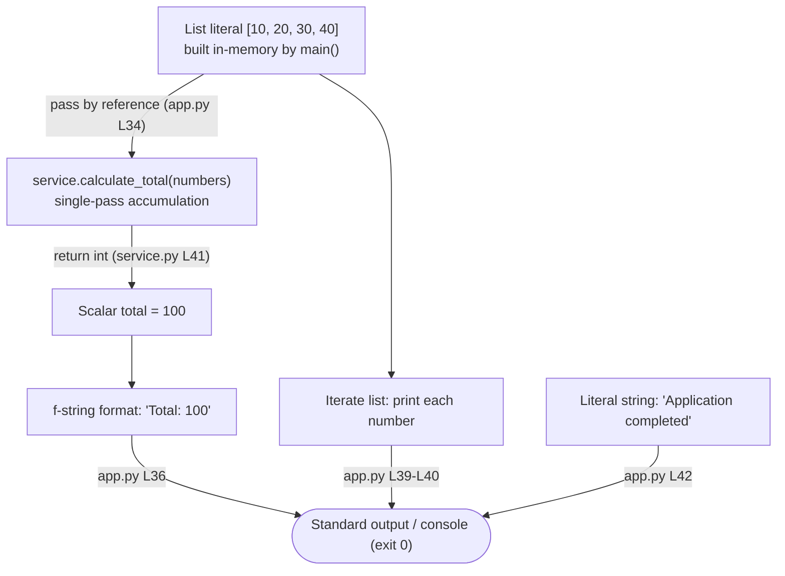
```mermaid
flowchart TD
    Lit["List literal [10, 20, 30, 40]<br/>built in-memory by main()"]
    Calc["service.calculate_total(numbers)<br/>single-pass accumulation"]
    Total["Scalar total = 100"]
    FmtT["f-string format: 'Total: 100'"]
    Loop["Iterate list: print each number"]
    Done["Literal string: 'Application completed'"]
    Stdout(["Standard output / console (exit 0)"])

    Lit -->|"pass by reference (app.py L34)"| Calc
    Calc -->|"return int (service.py L41)"| Total
    Total --> FmtT
    FmtT -->|"app.py L36"| Stdout
    Lit --> Loop
    Loop -->|"app.py L39-L40"| Stdout
    Done -->|"app.py L42"| Stdout
```

### 5.1.4 External Integration Points

At runtime the system integrates with no external systems: it opens no sockets, connects to no database or message broker, and calls no third-party API or service (§1.2.1, §1.3.2). The only integrations expressed anywhere in the repository are build-time Git-submodule links to GitHub-hosted remotes, exercised once during a recursive clone/initialization (F-004, §3.4). The table below adapts the requested five attributes to the four-column standard by combining "Data Exchange Pattern" and "Protocol/Format" into a single column.

| System Name | Integration Type | Exchange Pattern / Protocol | SLA Requirements |
| --- | --- | --- | --- |
| GitHub — `600K_ChildRepo.git` | Build-time Git submodule remote (F-004) | One-time recursive fetch/clone; Git over HTTPS | None defined in repository |
| GitHub — `600K_Nested_ChildRepo.git` | Build-time Git submodule remote (F-004) | One-time recursive fetch/clone; Git over HTTPS | None defined in repository |
| Standard output / console | Runtime output stream (process-local; not an external system) | Line-oriented text via `print()` | None defined in repository |
| Runtime external services (DB, API, queue, cache) | None present | Not applicable — no network/DB/file I/O | Not applicable |

No service-level agreements, uptime targets, latency budgets, or throughput guarantees are defined anywhere in the codebase or documentation (§1.2.3); the "SLA Requirements" column therefore records the factual absence rather than asserting invented figures. The GitHub remotes are third-party infrastructure whose availability affects clone-time success only — once the working tree is populated, the program runs entirely offline with no external runtime dependency.

## 5.2 Component Details

This section details each architecturally significant component along five dimensions — purpose and responsibilities, technologies and frameworks, key interfaces and APIs, data-persistence requirements, and scaling considerations — followed by the required component-interaction, state-transition, and sequence diagrams. The three runtime/build components are the pure computation module (`service.py`), the entry-point orchestrator (`app.py`), and the Git-submodule composition (`.gitmodules` and the two submodule tiers). All facts are grounded in the source; where a dimension has no implementation, the absence is stated explicitly rather than inferred.

### 5.2.1 Computation Module — `service.py` (F-001, F-002)

**Purpose and responsibilities.** `service.py` is the system's only common service (§2.3.4): it supplies the reusable arithmetic primitives and contains no orchestration or I/O. `calculate_total` reduces a numeric iterable to its sum; `calculate_average` computes the arithmetic mean by delegating summation to `calculate_total`. The module has no imports, no classes, and no module-level state, and every function is side-effect-free (module docstring, `service.py` L9–L11).

**Technologies and frameworks.** Pure Python targeting 3.6+ with **no imports at all** — the code uses only language built-ins (`for`, `+`, `/`, `len`). No third-party library, framework, or standard-library module is used (§3.1, §3.3).

**Key interfaces and APIs.**

```python
def calculate_total(numbers): ...    # F-001: single-pass sum; returns 0 for empty
def calculate_average(numbers): ...  # F-002: mean; returns 0 for falsey; delegates to calculate_total
```

- `calculate_total(numbers) -> int | float` — initializes an accumulator to `0`, adds each element in one pass, and returns the total; empty input returns `0` (`service.py` L35, L38–L39, L41).
- `calculate_average(numbers) -> int | float` — returns `0` for empty/falsey input, otherwise `calculate_total(numbers) / len(numbers)`; requires a *sized* collection (unsized iterables raise `TypeError`), and is **defined but never invoked** by any entry point (`service.py` L44, L75–L76, L78).
- Consumption interface: `from service import calculate_total` (imported by `app.py` L15).

**Data-persistence requirements.** None. The functions are stateless and persist nothing; they hold no cache and touch no store. The only on-disk artifact associated with the module is the interpreter-written bytecode cache `__pycache__/service.cpython-312.pyc`, a compilation side effect, not application state (§4.3.1).

**Scaling considerations.** `calculate_total` is **O(n)** time in the number of elements and **O(1)** additional space (a single scalar accumulator); it is iterative, so it incurs no recursion-depth limit. Purity and the absence of shared state make the helper inherently thread-/reentrancy-safe, though the system never runs it concurrently. Because there is no service runtime, horizontal/vertical scaling, load balancing, and pooling are **Not applicable**; "scale" here is bounded solely by the algorithmic complexity of the helper and the (fixed, four-element) input.

### 5.2.2 Entry-Point Orchestrator — `app.py` (F-003)

**Purpose and responsibilities.** `app.py` is the thin orchestration shell for a tier. Its `main()` builds the fixed list, delegates summation to the computation module, renders the results to standard output, and returns — writing only to stdout and holding no state (`app.py` L17–L46). The `if __name__ == "__main__":` guard (L45–L46) ensures that importing the module has no side effects.

**Technologies and frameworks.** Pure Python 3.6+ (the f-string at L36 sets the minimum version), standard library only, with a single intra-repository import (`from service import calculate_total`, L15). There is no CLI-parsing framework (no `argparse`), configuration loader, or logging framework.

**Key interfaces and APIs.**

- `main() -> None` — the direct-execution entry point; takes no arguments and writes results to stdout (`app.py` L17, L36, L39–L40, L42).
- Command-line interface: `python app.py`, which runs `main()` via the `__main__` guard and exits `0` on success.
- Inbound dependency: the `calculate_total` symbol imported from the co-located `service` module (L15) and called at L34.

**Data-persistence requirements.** None at runtime; output is transient stdout. As with the service module, importing produces a bytecode cache (`__pycache__/app.cpython-312.pyc`) as a side effect only (§3.6.2).

**Scaling considerations.** Execution is a single synchronous pass: an **O(n)** delegation to `calculate_total` plus an **O(n)** print loop over the same fixed list, then process exit. There is no server loop, concurrency, or long-lived state, so runtime scaling has no dimension — the only "scaling" action is re-invoking the script. Because the input is hard-coded (`app.py` L32), throughput is fixed and independent of environment.

### 5.2.3 Git-Submodule Composition — `.gitmodules` and the Submodule Tiers (F-004)

**Purpose and responsibilities.** This build-time component composes three independent repositories into a nested tree using native Git submodules. The root `.gitmodules` declares the `ChildRepo` submodule, and `ChildRepo/.gitmodules` declares the `NestedChild` submodule, producing `600K_ParentRepo → ChildRepo → NestedChild`; each edge is pinned to a specific commit. There is no runtime coupling between tiers (§2.3) — composition is purely a source-structure concern.

**Technologies and frameworks.** Git submodules described by INI-style `.gitmodules` manifests, resolved against GitHub-hosted HTTPS remotes. This is not a Python component and executes no application code.

**Key interfaces and APIs.**

- Root `.gitmodules` — maps path `ChildRepo` → `https://github.com/lakshya-blitzy/600K_ChildRepo.git`.
- `ChildRepo/.gitmodules` — maps path `NestedChild` → `https://github.com/lakshya-blitzy/600K_Nested_ChildRepo.git`.
- Acquisition interface: `git clone --recursive <url>` or `git submodule update --init --recursive` (§3.6.4).
- Pinned commits (gitlinks): `ChildRepo` at `63b3f43`, `NestedChild` at `d57c9dd`.

**Data-persistence requirements.** The pinned submodule reference (gitlink SHA) is persisted in the superproject's tree/index alongside `.gitmodules`; each submodule's own contents and history persist in its own `.git`. No *application* data is persisted.

**Scaling considerations.** The composition scales structurally by adding submodule edges/levels (the repository already demonstrates two edges across three tiers), and each tier evolves independently with its own history. Acquisition cost grows roughly linearly with the number of submodules fetched over HTTPS at clone time; there is no runtime scaling implication because submodules impose no runtime dependency. A structural caveat is preserved at the leaf: `ChildRepo/NestedChild` is composed at build time but **non-functional at runtime** because its `app.py` and `service.py` are byte-identical, yielding a circular `ImportError` (§2.4.4).

### 5.2.4 Component Interaction, State, and Sequence Diagrams

**Component interaction.** The diagram below shows the intra-tier runtime interaction (orchestrator → computation module → stdout) that succeeds at the root and `ChildRepo` tiers, the broken leaf interaction at `NestedChild`, and the build-time submodule composition edges (dashed) that link the tiers.

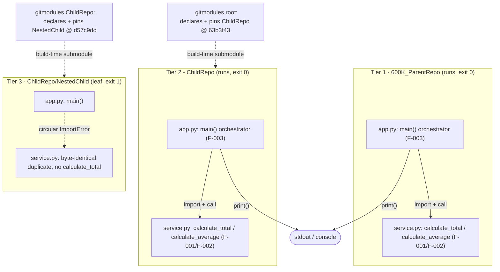
```mermaid
flowchart TD
    RGit[".gitmodules root:<br/>declares + pins ChildRepo @ 63b3f43"]
    CGit[".gitmodules ChildRepo:<br/>declares + pins NestedChild @ d57c9dd"]
    Console(["stdout / console"])

    subgraph Root["Tier 1 - 600K_ParentRepo (runs, exit 0)"]
        direction TB
        RApp["app.py: main() orchestrator (F-003)"]
        RSvc["service.py: calculate_total / calculate_average (F-001/F-002)"]
        RApp -->|"import + call"| RSvc
    end

    subgraph Child["Tier 2 - ChildRepo (runs, exit 0)"]
        direction TB
        CApp["app.py: main() orchestrator (F-003)"]
        CSvc["service.py: calculate_total / calculate_average (F-001/F-002)"]
        CApp -->|"import + call"| CSvc
    end

    subgraph Nested["Tier 3 - ChildRepo/NestedChild (leaf, exit 1)"]
        direction TB
        NApp["app.py: main()"]
        NSvc["service.py: byte-identical duplicate; no calculate_total"]
        NApp -.->|"circular ImportError"| NSvc
    end

    RApp -->|"print()"| Console
    CApp -->|"print()"| Console
    RGit -.->|"build-time submodule"| Child
    CGit -.->|"build-time submodule"| Nested
```

**State transition.** At the component (process) level, an application tier moves through interpreter start-up, service import, and the summation/print sequence. The success path (root / `ChildRepo`) ends in `Completed` (exit 0); the leaf's failed import ends in `ImportFailed` (exit 1).

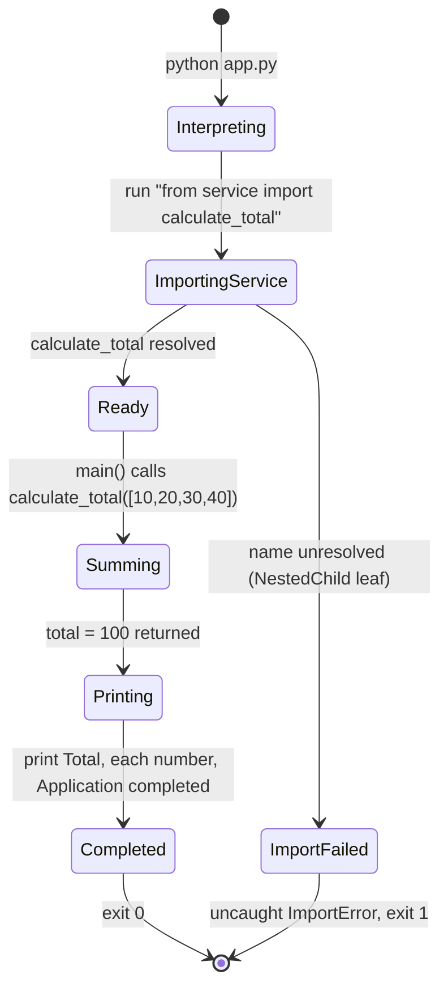
```mermaid
stateDiagram-v2
    [*] --> Interpreting: python app.py
    Interpreting --> ImportingService: run "from service import calculate_total"
    ImportingService --> Ready: calculate_total resolved
    ImportingService --> ImportFailed: name unresolved (NestedChild leaf)
    Ready --> Summing: main() calls calculate_total([10,20,30,40])
    Summing --> Printing: total = 100 returned
    Printing --> Completed: print Total, each number, Application completed
    Completed --> [*]: exit 0
    ImportFailed --> [*]: uncaught ImportError, exit 1
```

**Sequence — successful summation flow (root / `ChildRepo`).** This is the system's single key runtime flow. The build-time recursive-acquisition sequence is documented in §3.6.4 and §4.1.2 and is not duplicated here.

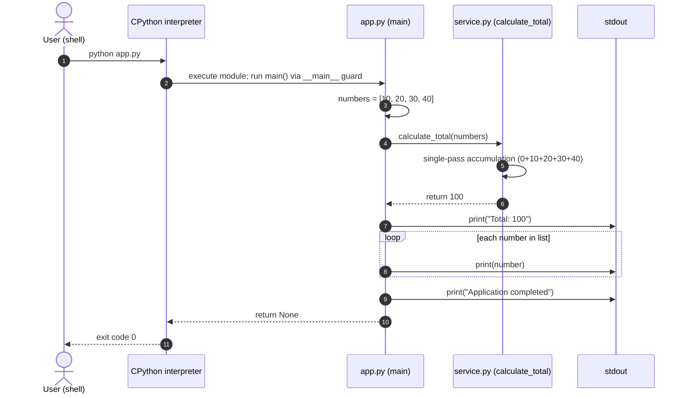
```mermaid
sequenceDiagram
    autonumber
    actor User as User (shell)
    participant Py as CPython interpreter
    participant App as app.py (main)
    participant Svc as service.py (calculate_total)
    participant Out as stdout

    User->>Py: python app.py
    Py->>App: execute module#59; run main() via __main__ guard
    App->>App: numbers = [10, 20, 30, 40]
    App->>Svc: calculate_total(numbers)
    Svc->>Svc: single-pass accumulation (0+10+20+30+40)
    Svc-->>App: return 100
    App->>Out: print("Total: 100")
    loop each number in list
        App->>Out: print(number)
    end
    App->>Out: print("Application completed")
    App-->>Py: return None
    Py-->>User: exit code 0
```

## 5.3 Technical Decisions

The decisions recorded here are the ones actually expressed by the repository's code, manifests, and documentation. Because the project is a deliberately minimal demonstration (§1.1, §1.2.1), many decisions are decisions *not* to adopt a mechanism (persistence, networking, concurrency, authentication); these are documented as intentional, scope-driven choices consistent with the out-of-scope list in §1.3.2, together with their rationale and accepted tradeoffs — not as omissions to be inferred around.

### 5.3.1 Architecture Style Decisions and Tradeoffs

The overarching decision is a single-process, monolithic, standard-library-only Python program with an internal two-module separation of concerns, whose structure is replicated across pinned Git submodules. Each sub-decision and its accepted tradeoff:

| Decision | Rationale | Accepted Tradeoff |
| --- | --- | --- |
| Monolithic single-process script (not a service/microservice) | Scope is a single fixed-list summation; nothing to distribute; easiest to read and run | No independently deployable/scalable units — none are needed |
| Two-module split: `app.py` orchestrator over pure `service.py` | Keeps computation pure and testable and the orchestration shell replaceable | Minor indirection for a one-line sum, accepted for clarity and reuse |
| Standard-library-only, zero dependencies | Runs on stock CPython 3.6+ with no build or supply-chain burden (§3.3) | Cannot leverage third-party libraries; any helper must be hand-rolled (trivial here) |
| Structural replication (mirror `app.py`/`service.py` per tier) | A reader moving between tiers meets an identical shape (§2.3.3) | Duplication and drift risk — realized as the `NestedChild` leaf defect |
| Native Git submodules for composition (not a monorepo or package dependency) | Demonstrates composition of independent repos with pinned reproducibility (F-004) | Requires recursive clone; leaf tiers can break independently (§2.4.4) |

The dominant theme is *radical simplicity*: every choice trades capability the project does not need for transparency and portability it does.

### 5.3.2 Communication Pattern Choices

The only communication in the runtime path is an intra-process, synchronous, in-memory Python function call reached through a module import (§2.3.2). No network, RPC, event, or message-broker pattern is used anywhere.

| Concern | Decision | Rationale |
| --- | --- | --- |
| Inter-component communication | Direct synchronous function call (`import` + call) | One process, one call path — zero latency and no serialization |
| Program output | Line-oriented text to stdout via `print()` | Human-observable demonstration output; no machine consumer contract |
| Cross-tier communication | None at runtime (build-time submodule pins only) | Tiers are independent by design; no runtime coupling (§2.3) |
| Asynchrony / messaging / events | Not adopted | No concurrency or external actors; would add complexity for no benefit |

### 5.3.3 Data Storage and Caching Decisions

**Data storage.** The system stores nothing. It uses no database, no files, and no external storage; the list and accumulator live only in process memory, and the sole output is transient stdout (§3.5). This is appropriate because there is no data domain to persist — the input is hard-coded and the output is a demonstration with no downstream consumer or audit requirement.

**Caching.** There is no application-level cache. The only cache present is the interpreter's own bytecode cache (`__pycache__/*.cpython-312.pyc`), which CPython writes automatically on first import; it is a compilation optimization, not an architectural decision (§3.6.2, §4.3.1). Application caching is unjustified because the computation is O(n) over four elements and effectively free to recompute.

| Concern | Decision | Rationale |
| --- | --- | --- |
| Primary data store | None (stateless; in-memory only) | No data domain to persist; hard-coded input, transient output |
| Durable output | None (stdout only) | Demonstration output; no consumer, retention, or audit need |
| Application cache | None | Recomputing an O(n)/4-element sum is negligible |
| Bytecode cache | Implicit `__pycache__/*.cpython-312.pyc` | Interpreter default that speeds re-import; not an application concern |

### 5.3.4 Security Mechanism Selection

Security decisions follow from the minimal attack surface established in §2.4: with no network, file, or interactive input at runtime, and no `eval`/`exec` or deserialization, there is nothing to authenticate, authorize, or validate against an untrusted source.

| Concern | Decision / Mechanism | Rationale / Note |
| --- | --- | --- |
| Authentication / authorization | None | No users, sessions, network endpoints, or protected resources — Not applicable |
| Input validation | None; fail-fast on bad types | Input is trusted and hard-coded; non-numeric or unsized inputs raise an uncaught `TypeError` (§2.4) |
| Runtime attack surface | Minimized: no I/O, no `eval`/deserialization | Pure computation plus stdout; nothing exploitable at runtime |
| Supply-chain integrity | Submodule commit pinning (`63b3f43` / `d57c9dd`) over HTTPS | Reproducible checkout; no signature verification; keep credentials out of clone URLs (root `README.md` security note) |

### 5.3.5 Architecture Decision Records and Decision Tree

The following Architecture Decision Records (ADRs) capture the load-bearing choices in a durable form. All are **Accepted** and reflect the current codebase.

**ADR-01 — Standard-library-only, zero-dependency runtime.**
*Context:* a tiny demonstration that must run anywhere with minimal setup. *Decision:* depend on nothing beyond CPython 3.6+; the only import is the intra-repository `from service import calculate_total`. *Consequences:* trivial portability and no supply-chain/build burden, at the cost of forgoing third-party functionality (none required).

**ADR-02 — Two-module separation of concerns.**
*Context:* even a one-line sum benefits from a clean seam. *Decision:* isolate pure computation in `service.py` behind a thin `app.py` orchestrator invoked under an `__main__` guard. *Consequences:* computation is reusable and side-effect-free and orchestration is replaceable; a small amount of indirection is accepted.

**ADR-03 — Intra-process synchronous call as the only communication.**
*Context:* single process, single call path. *Decision:* communicate by direct function call; emit results as text to stdout. *Consequences:* no serialization, latency, or protocol surface; no support for remote consumers (not needed).

**ADR-04 — Stateless design with no persistence or application cache.**
*Context:* no data domain; input hard-coded. *Decision:* keep all state in memory and write only to stdout; rely on the interpreter's bytecode cache alone. *Consequences:* nothing survives the process; recomputation is negligible; no storage/caching operational burden.

**ADR-05 — Native Git submodules with pinned commits for composition.**
*Context:* demonstrate composing independent repositories. *Decision:* declare submodules in `.gitmodules`, pinned to exact commits, populated by recursive clone. *Consequences:* reproducible multi-tier checkout with independent histories; recursive acquisition is required and a leaf tier can break independently (the preserved `NestedChild` defect).

**ADR-06 — No authentication/authorization or input validation (fail-fast).**
*Context:* no untrusted input or protected resource. *Decision:* implement no auth and no validation; allow invalid input types to raise an uncaught `TypeError`. *Consequences:* minimal attack surface and simple code; robustness against malformed input is intentionally not provided (§2.4).

The decision tree below traces how the minimal architecture is reached; the branch labelled "(this system)" marks the path the repository actually takes at each decision point.

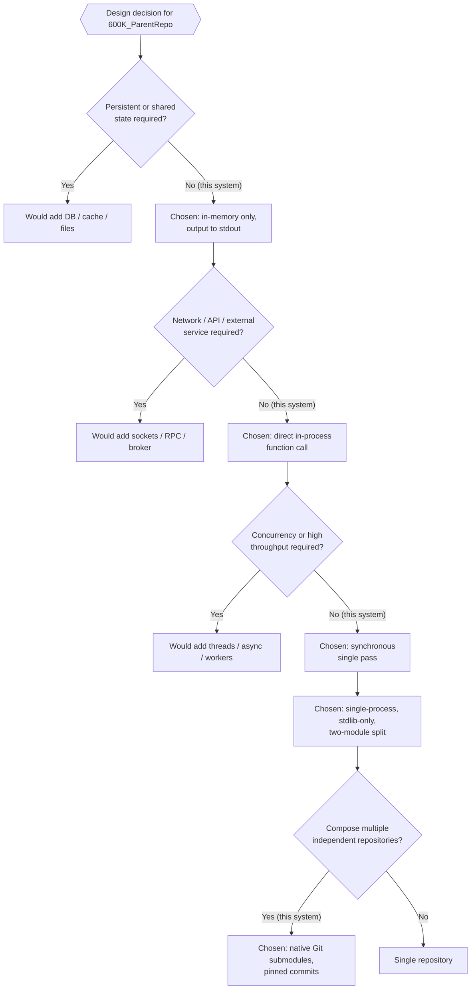
```mermaid
flowchart TD
    Start{{"Design decision for 600K_ParentRepo"}}
    Q1{"Persistent or shared<br/>state required?"}
    Q2{"Network / API / external<br/>service required?"}
    Q3{"Concurrency or high<br/>throughput required?"}
    Q4{"Compose multiple<br/>independent repositories?"}

    A1["Would add DB / cache / files"]
    A2["Would add sockets / RPC / broker"]
    A3["Would add threads / async / workers"]

    NoStore["Chosen: in-memory only,<br/>output to stdout"]
    NoNet["Chosen: direct in-process<br/>function call"]
    NoConc["Chosen: synchronous<br/>single pass"]
    Mono["Chosen: single-process, stdlib-only,<br/>two-module split"]
    Sub["Chosen: native Git submodules,<br/>pinned commits"]
    Single["Single repository"]

    Start --> Q1
    Q1 -->|Yes| A1
    Q1 -->|"No (this system)"| NoStore
    NoStore --> Q2
    Q2 -->|Yes| A2
    Q2 -->|"No (this system)"| NoNet
    NoNet --> Q3
    Q3 -->|Yes| A3
    Q3 -->|"No (this system)"| NoConc
    NoConc --> Mono
    Mono --> Q4
    Q4 -->|"Yes (this system)"| Sub
    Q4 -->|No| Single
```

## 5.4 Cross-Cutting Concerns

Cross-cutting concerns are documented here as they actually exist. For a standard-library-only script with no network surface, no persistence, and no service runtime, most operational concerns (monitoring frameworks, distributed tracing, authentication, formal SLAs, disaster recovery tooling) are genuinely absent; each is reported with the evidence for that determination rather than described aspirationally. Error handling is the one concern with substantive, observable behavior and is treated in the most depth, including the required error-handling flow diagram.

### 5.4.1 Monitoring, Observability, Logging, and Tracing

The system contains no monitoring, metrics, health-check, or telemetry instrumentation, and no logging or tracing framework — there is no `import logging`, no counters, and no correlation/span identifiers anywhere in the code (§1.2.3). Its entire observable surface consists of three interpreter-level signals: the lines written to **standard output** (six lines on a successful run), any Python traceback written to **standard error** on failure, and the **process exit code** (`0` on success, `1` at the broken leaf). Observability is therefore achieved by direct human inspection of that output, which is also the project's de-facto quality gate (§1.2.3, §3.6.3).

| Concern | Mechanism present | Note |
| --- | --- | --- |
| Metrics / monitoring | None | No instrumentation, counters, or health checks |
| Logging | None (framework); `print()` to stdout | No `logging` module; success output is six plain lines |
| Distributed tracing | None | Single process; no spans or correlation IDs |
| Observable signals | stdout + stderr + exit code | The only signals; inspected manually |

### 5.4.2 Error Handling Patterns

The code contains **no `try`/`except` blocks**; it follows a *fail-fast, fail-loud* pattern in which any error propagates to the interpreter's default handler, which prints a traceback to standard error and exits non-zero (§4.3.2). There are no retries, no fallback paths, and no notification mechanism beyond that default stderr traceback; recovery is manual. Three behaviors are relevant:

- **Circular import at the `NestedChild` leaf (realized).** Because `ChildRepo/NestedChild/app.py` and `service.py` are byte-identical, importing `service` re-enters a partially initialized module and `calculate_total` never resolves, raising `ImportError` **before `main()` runs** — empty stdout, traceback to stderr, exit `1` (verified; §2.4.4).
- **Invalid input types (latent).** A non-numeric element makes the `+=` accumulation raise an uncaught `TypeError`; passing an unsized iterable to `calculate_average` raises `TypeError` at `len()`. These propagate uncaught (§2.4). The `TypeError` in `calculate_average` is latent because that function is never invoked (F-002).
- **The single defensive guard (explicit).** `calculate_average` returns `0` for empty/falsey input, deliberately avoiding a `ZeroDivisionError` (`service.py` L75–L76) — the only explicit error-avoidance logic in the codebase.

The runtime error-handling flow for an application tier is:

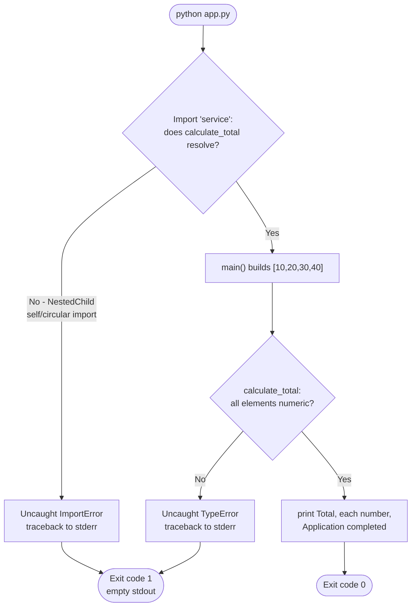
```mermaid
flowchart TD
    Start(["python app.py"]) --> Imp{"Import 'service':<br/>does calculate_total resolve?"}
    Imp -->|"No - NestedChild<br/>self/circular import"| Err["Uncaught ImportError<br/>traceback to stderr"]
    Err --> Exit1(["Exit code 1<br/>empty stdout"])
    Imp -->|Yes| Run["main() builds [10,20,30,40]"]
    Run --> Sum{"calculate_total:<br/>all elements numeric?"}
    Sum -->|No| TErr["Uncaught TypeError<br/>traceback to stderr"]
    TErr --> Exit1
    Sum -->|Yes| Print["print Total, each number,<br/>Application completed"]
    Print --> Exit0(["Exit code 0"])
```

### 5.4.3 Authentication and Authorization

There is no authentication or authorization framework, and none is applicable: the runtime has no users, sessions, roles, tokens, or protected resources, and exposes no network endpoint to guard (§2.4, §1.3.2). The only security-relevant control anywhere in the project is build-time — submodules are pinned to exact commits and fetched over HTTPS, and the root `README.md` cautions against embedding credentials in clone URLs (detailed as ADR-06 and in §5.3.4). No runtime access control exists or is required.

### 5.4.4 Performance Requirements and SLAs

No performance requirements, service-level agreements, latency or throughput budgets, benchmarks, or KPIs are defined anywhere in the codebase or documentation (§1.2.3). The values below are therefore **observed intrinsic characteristics**, not commitments.

| Aspect | Defined requirement | Observed characteristic |
| --- | --- | --- |
| Latency / response time | None | Runtime is dominated by interpreter start-up, not computation |
| Throughput | None | A single synchronous run; not a serving workload |
| Time complexity | None | `calculate_total` is O(n) single pass (n = 4, fixed) |
| Space complexity | None | O(1) extra memory (a single accumulator) |

The first execution additionally pays a one-time bytecode-compilation cost that is cached in `__pycache__` and amortized on subsequent runs (§3.6.2).

### 5.4.5 Disaster Recovery

No disaster-recovery procedures, backups, replication, failover, or RTO/RPO targets are defined — a direct consequence of the system holding no data and provisioning no infrastructure (§3.6, §1.3.2). Because the runtime is stateless, "recovery" reduces to re-running the program or re-acquiring the source; the authoritative source of truth is the set of Git repositories, restorable by a recursive clone from the pinned GitHub remotes (§3.4).

| Scenario | Recovery approach |
| --- | --- |
| Failed or aborted run | Re-run `python app.py`; stateless, nothing to restore |
| Lost working tree | Re-clone recursively from the pinned GitHub remotes (`git clone --recursive`) |
| Corrupt bytecode cache | Regenerated automatically by the interpreter on the next import |
| `NestedChild` leaf failure | Not auto-recoverable; requires a source fix and is preserved as-is (§2.4.4) |

## 5.5 References

The following files, folders, runtime observations, and specification sections were examined as evidence for Section 5.

**Repository files**

- `app.py` — root entry-point orchestrator; established `main()`, the fixed list `[10, 20, 30, 40]` (L32), the `calculate_total` import (L15) and call (L34), the stdout writes (L36, L39–L40, L42), and the `__main__` guard (L45–L46) that make up F-003.
- `service.py` — root computation module; established the pure `calculate_total` (L18, L35, L38–L39, L41) and the defined-but-uninvoked `calculate_average` with its empty-input guard (L44, L75–L76, L78), plus the "no imports/classes/state" property (L9–L11) — features F-001/F-002.
- `.gitmodules` — root submodule manifest; established the F-004 build-time link to `ChildRepo` and its remote URL.
- `README.md` — root documentation; established the two-level submodule topology, Python 3.6+/std-lib-only prerequisites, the "no container/cloud/build step" deployment model, the recursive-clone workflow, and the credentials-in-URL security note.
- `ChildRepo/app.py`, `ChildRepo/service.py` — established the functionally equivalent middle-tier mirror of the root modules (`main` at L16; `calculate_total` at L18, `calculate_average` at L44).
- `ChildRepo/.gitmodules` — established the F-004 link from `ChildRepo` to `NestedChild` and its remote URL.
- `ChildRepo/README.md` — established the middle-tier documentation and the "documented as-is, not repaired" stance on defects.
- `ChildRepo/NestedChild/app.py`, `ChildRepo/NestedChild/service.py` — established the byte-identical 16-line leaf files that cause the circular `ImportError` (root cause of the leaf defect).
- `ChildRepo/NestedChild/README.md` — established that the leaf carries only a one-line title.

**Folders**

- `ChildRepo/` — the first-level submodule tier (pinned at `63b3f43`).
- `ChildRepo/NestedChild/` — the leaf submodule tier (pinned at `d57c9dd`), non-functional at runtime.
- `__pycache__/` (root and per tier) — contained the CPython 3.12 bytecode caches (`*.cpython-312.pyc`), the only persisted, compilation-only artifacts.

**Runtime verification (observed behavior)**

- Executing `python3 app.py` at the root and `ChildRepo` tiers — confirmed the six-line stdout output and exit code `0`.
- Executing `python3 app.py` at `ChildRepo/NestedChild` — confirmed the circular-import `ImportError`, empty stdout, and exit code `1`.
- `git submodule status --recursive` and `cmp` — confirmed the submodule pins (`63b3f43`, `d57c9dd`) and the byte-identical leaf files.

**Cross-referenced specification sections**

- §1.1 Executive Summary; §1.2 System Overview (1.2.1 context, 1.2.2 components, 1.2.3 success criteria/absence of SLAs/KPIs); §1.3 Scope (1.3.2 out-of-scope).
- §2.1 Feature Catalog (F-001–F-004); §2.3 Feature Relationships (2.3.2 integration points, 2.3.3 shared components, 2.3.4 common services); §2.4 Implementation Considerations (2.4.4 NestedChild defect; security/attack-surface findings).
- §3.1 Programming Languages; §3.3 Open Source Dependencies; §3.4 Third-Party Services; §3.5 Databases & Storage; §3.6 Development & Deployment (3.6.2 build/bytecode, 3.6.3 CI-CD/quality gate, 3.6.4 run model).
- §4.1 System Workflows (4.1.2 integration/sequence); §4.3 Technical Implementation (4.3.1 state management/persistence, 4.3.2 error handling).

# 6. SYSTEM COMPONENTS DESIGN

## 6.1 Core Services Architecture

### 6.1.1 Core Services Architecture Applicability Assessment

**Core Services Architecture is not applicable for this system.**

`600K_ParentRepo` is a deliberately minimal, standard-library-only Python program whose entire executable behavior is a single fixed-list summation written to standard output (§5.1). It is **not** composed of microservices, distributed services, or independently deployable service components that communicate over a network, and it therefore contains none of the constructs — service registries, load balancers, message brokers, circuit breakers, replica sets, auto-scalers — that a Core Services Architecture exists to describe. This determination is grounded in direct inspection of every source file, the complete absence of service/infrastructure tooling, and runtime behavior verified by execution; it is consistent with the "single-process, monolithic" architecture recorded in §5.1.1 and the explicit "not a service/microservice" decision in §5.3.1 (ADR-01, ADR-03).

**A note on the `service.py` naming.** The repository contains a module named `service.py`, but this is a *source-file / module* name, not a networked service. `service.py` is a pure, in-process function library (`calculate_total`, `calculate_average`) with no imports, no module-level state, and no I/O (Source: `service.py` L9–L11). It is consumed only through an ordinary Python import followed by a direct function call inside the same process (`from service import calculate_total`, Source: `app.py` L15), never over a wire protocol.

The table below evaluates each defining trait of a distributed / service-oriented architecture against the repository evidence.

| Distributed-Services Trait | Present? | Evidence in Repository |
| --- | --- | --- |
| Independently deployable service units | No | One process per tier; a single `python app.py` entry point under the `__main__` guard (Source: `app.py` L45–L46); §5.3.1 records "no independently deployable/scalable units — none are needed" |
| Inter-service network communication | No | Only the intra-process call `from service import calculate_total` (Source: `app.py` L15, L34); no sockets, HTTP, or RPC (§5.3.2, ADR-03) |
| Service discovery / registry | No | No registry or endpoint configuration exists; modules are resolved by the Python import machinery on `sys.path` |
| Load balancer / reverse proxy | No | No server, listener, or replicas exist; a run is a single synchronous invocation |
| Message broker / event bus | No | No queue, topic, or event mechanism anywhere; asynchrony/messaging is "Not adopted" (§5.3.2) |
| Circuit-breaker / retry / fallback libraries | No | No third-party libraries at all; the only import tree-wide is `from service import calculate_total` |

**The submodule tree is a build-time composition, not a runtime service topology.** The three-tier hierarchy `600K_ParentRepo → ChildRepo → NestedChild` is wired exclusively by native Git submodules declared in `.gitmodules` (root → `ChildRepo`) and `ChildRepo/.gitmodules` (`ChildRepo` → `NestedChild`), pinned to commits `63b3f43` and `d57c9dd` respectively (feature F-004, §5.1.1). Each tier is an *independent copy of the same program* that runs in its own isolated process; there is no runtime call, data exchange, or coupling across tiers (§5.3.2). The tiers are related only at source-acquisition time via a recursive clone.

*Diagram 6.1.1 — System Topology and Execution Model: build-time submodule composition (top) versus the isolated single-process runtime of any one tier (bottom). Neither constitutes a networked service topology.*

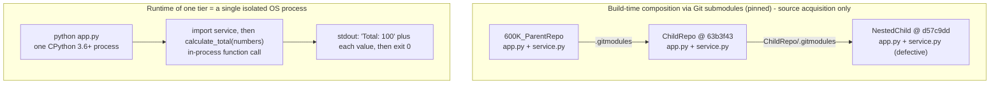
```mermaid
flowchart TD
    subgraph BuildTime["Build-time composition via Git submodules (pinned) - source acquisition only"]
        P["600K_ParentRepo<br/>app.py + service.py"]
        C["ChildRepo @ 63b3f43<br/>app.py + service.py"]
        N["NestedChild @ d57c9dd<br/>app.py + service.py (defective)"]
        P -->|".gitmodules"| C
        C -->|"ChildRepo/.gitmodules"| N
    end
    subgraph Runtime["Runtime of one tier = a single isolated OS process"]
        Proc["python app.py<br/>one CPython 3.6+ process"]
        Call["import service, then calculate_total(numbers)<br/>in-process function call"]
        Out["stdout: 'Total: 100' plus each value, then exit 0"]
        Proc --> Call --> Out
    end
```

Because the system implements none of the constructs that a Core Services Architecture governs, sub-sections 6.1.2–6.1.4 address each concern within this section's scope (service components, scalability design, resilience patterns) by recording the actual minimal design and marking the specific distributed-systems patterns as *Not applicable*, together with supporting evidence — rather than inventing behavior the codebase does not contain. This mirrors the evidence-based treatment in §5.1, §5.3, and §5.4.

### 6.1.2 Service Components

No networked or independently deployable services exist in this system, so the classic service-component concerns (network boundaries, discovery, load balancing, circuit breaking) have nothing to act upon. The only decomposition present is the intra-process, two-module *separation of concerns* described in §5.1.2 and §5.3.1: a thin orchestrator (`app.py`, feature F-003) delegates all computation to a pure helper module (`service.py`, features F-001/F-002). These two modules are documented here as the system's "components," and each distributed-systems concern is then explicitly resolved against the evidence.

**Component boundaries and responsibilities.** The two modules form a single logical boundary — one process, one call path — with `app.py` depending on `service.py` and never the reverse.

| Module (Component) | Primary Responsibility | Boundary & Coupling |
| --- | --- | --- |
| `app.py` — orchestrator (F-003) | Build the fixed list `[10, 20, 30, 40]`, delegate summation, and write the total, each value, and `Application completed` to stdout (Source: `app.py` L32, L34, L36, L39–L42) | Depends on `service.calculate_total` via import (L15) and call (L34); writes only to stdout; invokes `main()` solely under the `__main__` guard (L45–L46) |
| `service.py` — computation (F-001/F-002) | Provide `calculate_total` (single-pass sum) and `calculate_average` (mean; dormant, never invoked) as pure, side-effect-free helpers (Source: `service.py` L18, L44) | No imports, classes, or module-level state; consumed by `app.py`; `calculate_average` delegates internally to `calculate_total` (L78) |

**Distributed-systems concerns, resolved against the evidence.** Each concern required by this section maps to an in-process reality or is factually absent — nothing here is asserted that the code does not contain.

| Service-Component Concern | Applicability | Actual Mechanism / Evidence |
| --- | --- | --- |
| Service boundaries & responsibilities | Module-level only | Two-module split (`app.py` orchestrator, `service.py` computation); no network/service boundary (§5.1.2) |
| Inter-service communication patterns | Not applicable | Single intra-process, synchronous, in-memory function call via import (`from service import calculate_total`; `calculate_total(numbers)`, Source: `app.py` L15, L34); no serialization or protocol (ADR-03, §5.3.2) |
| Service discovery mechanisms | Not applicable | No registry, DNS, or endpoint configuration; the dependency is resolved statically by the Python import system at process start |
| Load balancing strategy | Not applicable | No server, listener, or replicas; a run is one synchronous pass that then exits |
| Circuit breaker patterns | Not applicable | No remote or failure-prone dependency to protect; error handling is fail-fast with no `try`/`except` (§5.4.2) |
| Retry & fallback mechanisms | Not applicable | No retries or fallback paths exist (§5.4.2); the sole defensive behavior is `calculate_average` returning `0` for empty/falsey input (Source: `service.py` L75–L76) |

The only runtime interaction in the entire system is therefore the single in-process delegation illustrated below.

*Diagram 6.1.2 — Service Interaction (runtime): the sole interaction is an in-process function call from the `app.py` orchestrator to the `service.py` computation module; there is no network hop, message broker, or remote endpoint.*

```mermaid
sequenceDiagram
    participant Shell as OS / Shell
    participant App as app.py (orchestrator)
    participant Svc as service.py (computation)
    participant Out as Standard output
    Shell->>App: python app.py invokes main() via __main__ guard (L45-46)
    App->>App: build fixed list of four numbers (L32)
    App->>Svc: calculate_total(numbers) in-process call (L34)
    Svc-->>App: return total 100 (L41)
    App->>Out: print the total line (L36)
    App->>Out: print each number (L39-40)
    App->>Out: print Application completed (L42)
```

### 6.1.3 Scalability Design

Scalability mechanisms are not applicable to this system. The workload is a single, synchronous, `O(n)` summation over a fixed four-element list executed once per invocation, after which the process exits (§5.4.4). There is no server, no concurrent request load, no shared state, and no elastic infrastructure to scale — a run either completes and exits `0` or fails fast and exits non-zero (§5.4.2). Consistent with §5.3.1, "no independently deployable/scalable units" exist because none are needed.

Each concern required by this section is recorded below against the evidence.

| Scalability Concern | Applicability | Actual Behavior / Evidence |
| --- | --- | --- |
| Horizontal scaling approach | Not applicable | No service to replicate; "scaling out" reduces to launching another independent `python app.py` process with no coordination or shared state |
| Vertical scaling approach | Not applicable (trivial) | Computation is `O(n)` time over n = 4 fixed elements and `O(1)` extra memory; runtime is dominated by interpreter start-up, not the sum (§5.4.4) |
| Auto-scaling triggers & rules | Not applicable | No orchestrator (no Kubernetes HPA, no cloud auto-scaling group), no metrics, and no thresholds; the repository contains no container or infrastructure manifest (no Dockerfile, Compose file, or YAML) |
| Resource allocation strategy | Not applicable | The program runs within one stock CPython process; no CPU/memory requests, limits, or quotas are declared anywhere |
| Performance optimization techniques | Intrinsic only | A single-pass accumulation loop (Source: `service.py` L38–L39); CPython's implicit bytecode cache (`__pycache__/*.cpython-312.pyc`) amortizes recompilation on re-import (§5.3.3), but no application-level optimization, concurrency, or caching is implemented |
| Capacity planning guidelines | Not applicable | Input is hard-coded and fixed; no throughput target, benchmark, SLA, or KPI is defined anywhere (§5.4.4) |

**The only "scaling" dimension present is compositional, not operational.** Additional tiers are introduced by declaring further Git submodules in a `.gitmodules` manifest (feature F-004, §5.1.1), not by provisioning runtime capacity. This grows the *source tree*, not serving capacity, and introduces no runtime coupling between tiers.

*Diagram 6.1.3 — Scalability Model: every invocation is a single, stateless CPython process that performs the O(n) work and exits; the only way to "scale" is to re-invoke independently. There is no load-balancing, auto-scaling, or resource-quota layer (shown as absent by design).*

```mermaid
flowchart TD
    Start(["Manual trigger: python app.py"])
    Proc["Single CPython process<br/>(no server, no daemon, no worker pool)"]
    Work["service.calculate_total - O(n) single pass, O(1) memory<br/>(n = 4, fixed input)"]
    Exit(["Write stdout, exit 0, process terminates"])
    Repeat["To 'scale' - re-invoke independently<br/>(embarrassingly parallel, unorchestrated)"]
    Absent["Not applicable by design: horizontal/vertical auto-scaling,<br/>load balancing, resource quotas, capacity targets"]
    Start --> Proc --> Work --> Exit
    Exit -.->|"re-invoke"| Repeat
    Repeat -.-> Start
```

### 6.1.4 Resilience Patterns

The system implements a deliberate *fail-fast, fail-loud* model (§5.4.2) with no built-in fault tolerance, redundancy, or failover — appropriate for a stateless, single-process demonstration that holds no data and provisions no infrastructure. Where recovery is meaningful at all, it is achieved by re-executing the program or re-acquiring the source, as already established in §5.4.5. Each concern required by this section is recorded below against the evidence.

| Resilience Concern | Applicability | Actual Behavior / Evidence |
| --- | --- | --- |
| Fault tolerance mechanisms | Not applicable (fail-fast) | No `try`/`except` anywhere; any error propagates to the interpreter, printing a traceback to stderr and exiting `1` (§5.4.2) |
| Disaster recovery procedures | Not applicable (stateless) | No backups, replication, or RTO/RPO targets; recovery = re-run `python app.py`, or recursively re-clone from the pinned GitHub remotes (§5.4.5) |
| Data redundancy approach | Not applicable | No data is stored — input is hard-coded and output is transient stdout (§5.3.3); *source* redundancy is provided by the Git remotes and pinned commit SHAs (ADR-05) |
| Failover configurations | Not applicable | No replicas, standby instances, or health checks; a single process with no orchestrator to fail over to |
| Service degradation policies | Not applicable | No graceful-degradation path; the one defensive guard is `calculate_average` returning `0` for empty/falsey input (Source: `service.py` L75–L76), while the `NestedChild` leaf fails hard rather than degrading |

**The one realized failure mode illustrates the fail-fast model.** The deepest tier is preserved with a known defect: `ChildRepo/NestedChild/app.py` and `service.py` are byte-identical, so importing `service` re-enters a partially initialized module and `calculate_total` never resolves, raising `ImportError` *before* `main()` runs — empty stdout, a traceback to stderr, and exit code `1` (verified by execution; §5.4.2, §2.4.4). It is documented and preserved as-is, not auto-recovered.

**What resilience the system does exhibit is build-time and stateless.** Because the runtime holds no state, a failed run leaves nothing to roll back and can simply be re-run; the authoritative source of truth is the set of pinned Git repositories, fully restorable by a recursive clone (§5.4.5). The interpreter's bytecode cache regenerates automatically if it is deleted or corrupted (§5.4.5).

*Diagram 6.1.4 — Resilience / Failure-Handling Flow: errors propagate fail-fast to a non-zero exit; recovery is manual re-execution or recursive re-clone. There is no automatic fault tolerance, failover, or graceful degradation.*

```mermaid
flowchart TD
    Run(["python app.py"])
    Imp{"Import 'service':<br/>does calculate_total resolve?"}
    Valid{"Inputs valid<br/>(all numeric)?"}
    OK(["Print results, exit 0"])
    Fail["Uncaught exception<br/>traceback to stderr, exit 1"]
    Rec["Recovery: manual re-run, or recursive<br/>re-clone from pinned GitHub remotes"]
    Run --> Imp
    Imp -->|"No: NestedChild circular import"| Fail
    Imp -->|Yes| Valid
    Valid -->|"No: uncaught TypeError (latent)"| Fail
    Valid -->|Yes| OK
    Fail -.->|"stateless: nothing to roll back"| Rec
    Rec -.-> Run
```

### 6.1.5 References

The following repository artifacts and specification sections were examined as evidence for this section. All line-number citations reflect the files as currently committed; runtime behavior was confirmed by direct execution of each tier.

**Repository files examined**

- `app.py` — Root entry-point orchestrator (F-003); established the single-process execution model, the `__main__` guard (L45–L46), the fixed input list (L32), the in-process delegation `from service import calculate_total` / `calculate_total(numbers)` (L15, L34), and the stdout writes (L36, L39–L42).
- `service.py` — Root pure-computation module (F-001/F-002); established the absence of imports/state/I-O (L9–L11), the single-pass `calculate_total` loop (L18, L38–L39, L41), and the sole defensive guard in `calculate_average` (L44, L75–L76, L78).
- `.gitmodules` — Root submodule manifest; established the build-time link `600K_ParentRepo → ChildRepo` (feature F-004).
- `ChildRepo/.gitmodules` — Middle-tier submodule manifest; established the build-time link `ChildRepo → NestedChild`.
- `ChildRepo/app.py`, `ChildRepo/service.py` — Mirror tier; confirmed a functionally equivalent, independently runnable copy (exit 0) with no runtime coupling to the parent.
- `ChildRepo/NestedChild/app.py`, `ChildRepo/NestedChild/service.py` — Defective leaf tier; confirmed the byte-identical files that cause the circular-import `ImportError` (exit 1, empty stdout) cited as the one realized failure mode.
- `README.md` — Project documentation; corroborated the standard-library-only, zero-dependency runtime and the recursive-clone acquisition model.
- `.blitzyignore` (root, `ChildRepo/`, `ChildRepo/NestedChild/`) — Each contains only `*.csv`; honored by excluding all CSV files from inspection and documentation.
- `__pycache__/*.cpython-312.pyc` — CPython bytecode cache; cited as the only implicit, auto-regenerated persisted artifact (not an application data store).

**Repository folders examined**

- `ChildRepo/` — First-level Git submodule tier (pinned at `63b3f43`).
- `ChildRepo/NestedChild/` — Leaf Git submodule tier (pinned at `d57c9dd`; no `.gitmodules`).

**Cross-referenced specification sections**

- §5.1 High-Level Architecture (incl. §5.1.1 System Overview, §5.1.2 Core Components) — single-process/monolithic architecture, component boundaries, and runtime interfaces.
- §5.3 Technical Decisions (incl. §5.3.1 architecture-style tradeoffs, §5.3.2 communication patterns, §5.3.3 storage/caching; ADR-01, ADR-03, ADR-05) — the explicit "not a service/microservice" and stateless decisions.
- §5.4 Cross-Cutting Concerns (incl. §5.4.2 Error Handling, §5.4.4 Performance/SLAs, §5.4.5 Disaster Recovery) — fail-fast behavior, absence of SLAs/KPIs, and stateless recovery model.
- §2.4 Implementation Considerations (§2.4.4) — the preserved `NestedChild` circular-import defect.
- Feature identifiers F-001–F-004 — carried forward verbatim from §2.1 for traceability.

## 6.2 Database Design

### 6.2.1 Database Design Applicability Assessment

**Database Design is not applicable to this system.**

`600K_ParentRepo` is a deliberately minimal, standard-library-only Python program whose entire executable behavior is a single fixed-list summation written to standard output. It defines **no database, no persistent datastore, and no durable file of any kind**, and it neither reads from nor writes to any storage medium at runtime. This determination is grounded in direct inspection of every source file, verification that no dependency or datastore configuration exists anywhere in the tree, and first-hand runtime observation. It is fully consistent with §3.5 ("no database and no persistent storage of any kind") and §5.3.3 / ADR-04 ("the system stores nothing").

**Why there is no database to design.** The program's only data is created, transformed, printed, and discarded within a single synchronous process. The sole import tree-wide is the intra-repository `from service import calculate_total` (`app.py` L15) — there is no database driver, ORM, connection pool, or query builder to import. There is no schema, no DDL, no migration tooling, and no data-access layer. Running `python3 app.py` was verified to create zero files (a before/after file-system comparison showed no new artifacts) and to emit only the lines `Total: 100`, the four input values, and `Application completed` before exiting `0`.

| Database / Persistence Facet | Status | Supporting Evidence |
| --- | --- | --- |
| Relational or NoSQL database | None | No driver, ORM, connection string, or query code; only import is `from service import calculate_total` (`app.py` L15) |
| Persistent datastore or output file | None | No `open`/`read`/`write` calls; `python3 app.py` creates no files and writes only stdout (`app.py` L36–L42) |
| Schema, DDL, or migrations | None | No `.sql` files and no `migrations/`, `models/`, or `schema/` directory anywhere in the tree |
| Dependency or datastore configuration | None | No `requirements.txt`, `setup.py`, `pyproject.toml`, `Dockerfile`, or `.env`; standard-library only (§3.5) |
| In-memory working data | Ephemeral only | Hard-coded list `[10, 20, 30, 40]` (`app.py` L32) and integer accumulator (`service.py` L35), discarded at process exit |
| `__pycache__/*.cpython-312.pyc` | Not application data | CPython bytecode import cache, auto-regenerated; explicitly not a data store (§3.5, §5.3.3) |
| CSV files in the tree | Excluded and unused | `large.csv` at each tier is excluded by `.blitzyignore` (`*.csv`) and is read by no code (§3.5) |

The only data path that exists in the entire system is the ephemeral, in-memory lifecycle shown below: values are constructed in source, summed in memory, written to standard output, and destroyed when the process exits. There is no persistence boundary anywhere along this path.

*Diagram 6.2.1 — Data Flow / Data Lifecycle: the complete, ephemeral in-memory data path from a hard-coded literal to transient standard output. No stage reads or writes a database, file, cache, or any other durable store.*

```mermaid
flowchart LR
    Src["Hard-coded literal in source<br/>numbers = list of four ints<br/>(app.py L32)"]
    Mem["In-memory single-pass sum<br/>service.calculate_total<br/>(service.py L35-L41)"]
    Tot["Transient integer total = 100<br/>returned to caller<br/>(app.py L34)"]
    Out["stdout: 'Total: 100', each value,<br/>'Application completed'<br/>(app.py L36-L42)"]
    Exit(["Process exits 0<br/>all in-memory data discarded - nothing persisted"])
    Src --> Mem --> Tot --> Out --> Exit
```

Because no datastore exists, sub-sections 6.2.2 through 6.2.5 address each database-design concern required by this template — schema design, data management, compliance, and performance — by recording the actual (minimal, in-memory) reality and marking each specific database mechanism *Not applicable* with its supporting evidence, mirroring the evidence-based approach adopted in §6.1. This keeps the specification complete and explicit rather than silent about mechanisms the code does not contain.

### 6.2.2 Schema Design

There is no database schema in this system: no tables, collections, entities, keys, indexes, or constraints are defined anywhere, because no datastore exists (§3.5, §5.3.3). This sub-section documents (a) the only data the program actually manipulates — a transient in-memory list and a derived integer accumulator — and (b) records each schema-design concern from the specification template as *Not applicable*, with supporting evidence.

**Entity relationships.** There are no persistent entities and therefore no persistent entity relationships. The only data the program handles is an in-memory Python `list` of four integers and a derived integer accumulator, both of which live solely on the process heap for the duration of one run (`app.py` L32, L34; `service.py` L35). For completeness — and to satisfy the ERD requirement — the conceptual, ephemeral shape of this runtime data is depicted below; it is emphatically **not** a database schema, and no such tables or documents are created, keyed, indexed, or persisted anywhere.

*Diagram 6.2.2.A — Conceptual (Ephemeral) Data Model: an ERD-style depiction of the transient in-memory values the program manipulates during a single run. These are runtime Python objects, not persisted tables; there are no primary keys, foreign keys, or indexes.*

```mermaid
erDiagram
    INPUT_LIST ||--o{ NUMERIC_ELEMENT : "holds in memory"
    INPUT_LIST ||--|| ACCUMULATOR : "summed into transient"
    INPUT_LIST {
        list numbers "hard-coded 10 20 30 40, app.py L32, ephemeral"
    }
    NUMERIC_ELEMENT {
        number value "int or float, iterated once, never stored"
    }
    ACCUMULATOR {
        number total "running sum 100, app.py L34, discarded at exit"
    }
```

**Data models and structures.** The system's complete data model consists of two transient runtime structures and one output stream, none of which are persisted.

| Runtime Structure | Type and Definition | Persistence |
| --- | --- | --- |
| `numbers` | Python `list` of four `int` literals `[10, 20, 30, 40]` (`app.py` L32) | In-memory only; discarded at exit |
| `total` (accumulator) | Scalar `int`/`float`, initialized to `0`, accumulated in a single loop (`service.py` L35–L41) | In-memory only; returned then printed |
| Program output | Line-oriented text emitted via `print()` (`app.py` L36–L42) | Transient stdout; never stored |

**Indexing strategy (all indexes documented).** No indexes exist because there is no table, collection, or query workload to index. The table below enumerates each index category for completeness.

| Index Category | Status | Evidence |
| --- | --- | --- |
| Primary / clustered index | None | No tables or DDL exist |
| Secondary / non-clustered index | None | No datastore or query workload to optimize |
| Full-text / spatial / composite | None | No searchable text, geospatial, or multi-column data |

**Constraints (all constraints documented).** No integrity constraints are defined; the sole input-shape expectation is enforced by fail-fast runtime behavior rather than a declared database constraint.

| Constraint Category | Status | Evidence |
| --- | --- | --- |
| Primary / foreign key | None | No entities or relations are defined |
| Unique / check / not-null | None | No schema or DDL; the numeric-element expectation is enforced at runtime, not declaratively (§5.3.4, ADR-06) |
| Default / trigger | None | No datastore to which defaults or triggers could attach |

**Partitioning approach.** Not applicable. The entire dataset is a fixed four-element in-memory list; there is no table, no data volume, and no storage engine to partition. Horizontal partitioning, vertical partitioning, and sharding are all irrelevant to a single O(n) pass over four elements held on the heap (`service.py` L38–L39).

**Replication configuration.** Not applicable — with no database there is no primary/replica topology, no write-ahead-log or binlog streaming, and no replica set or quorum. The three-tier structure `600K_ParentRepo → ChildRepo → NestedChild` is a **build-time source-code composition** via native Git submodules pinned to commits `63b3f43` and `d57c9dd` (§5.3.1 / ADR-05, §6.1.1), not runtime data replication: each tier is an independent copy of the program that runs in its own process with no shared datastore and no cross-tier data exchange. The diagram below contrasts the absent database-replication topology with the source composition that actually exists.

*Diagram 6.2.2.B — Replication Architecture: database primary/replica replication does not exist (top); the only "replication" present is build-time duplication of source across pinned Git submodule tiers (bottom), which carries no runtime data and no datastore.*

```mermaid
flowchart TD
    subgraph DBRepl["Database replication topology - NOT APPLICABLE (no database exists)"]
        Primary["Primary DB node"]
        Replica["Replica / standby node"]
        Primary -.->|"WAL / binlog stream does not exist"| Replica
    end
    subgraph SrcComp["What actually exists: build-time SOURCE composition (not data replication)"]
        Parent["600K_ParentRepo<br/>app.py + service.py"]
        Child["ChildRepo @ 63b3f43<br/>independent copy"]
        Nested["NestedChild @ d57c9dd<br/>defective copy"]
        Parent -->|".gitmodules recursive clone"| Child
        Child -->|"ChildRepo/.gitmodules"| Nested
    end
```

**Backup architecture.** Not applicable. With no datastore and no persisted data, there is nothing to back up: there are no snapshots, dumps, point-in-time-recovery logs, or backup schedules, and no recovery-time or recovery-point objectives (§6.1.4 confirms "no backups, replication, or RTO/RPO targets"). The authoritative source of truth is the set of pinned Git repositories, fully restorable by a recursive clone, and the interpreter's bytecode cache regenerates automatically if it is deleted (§6.1.4, §5.3.3).

| Backup Concern | Status | Evidence |
| --- | --- | --- |
| Data backups / snapshots / PITR | None (nothing to back up) | Stateless; no persisted data (§5.3.3, §6.1.4) |
| Recovery objectives (RTO / RPO) | None defined | No SLAs or recovery targets anywhere (§6.1.4) |
| Source-of-truth durability | Git remotes + pinned commits | Recursive re-clone restores all tiers (§6.1.1, ADR-05) |

### 6.2.3 Data Management

The system performs no data management because it manages no persistent data. Each concern in this area is recorded below against the repository evidence. The only "storage and retrieval" that occurs is loading a hard-coded literal from source into memory and emitting results to standard output; the only cache present is the interpreter's bytecode cache, which is not application data.

**Migration procedures.** Not applicable. There is no schema to evolve and no data to migrate. The repository contains no migration framework (no Alembic, Django migrations, Flyway, or Liquibase), no `migrations/` directory, and no versioned DDL. This is confirmed by the absence of any such tooling or directory in the tree and by the standard-library-only, zero-dependency runtime (§3.5).

**Versioning strategy.** Data versioning is not applicable — no data records or schema versions exist. What is versioned is the *source code*, via Git, and the multi-tier composition is pinned for reproducibility: the parent pins `ChildRepo` at commit `63b3f43` and `ChildRepo` pins `NestedChild` at `d57c9dd` (`.gitmodules`, `ChildRepo/.gitmodules`; §5.3.1 / ADR-05). This is source/version control, not database schema or data versioning.

**Archival policies.** Not applicable. No data is retained beyond a single process lifetime, so there is nothing to archive, tier, or expire. Output is transient standard output that the program itself does not persist (`app.py` L36–L42; §5.3.3).

**Data storage and retrieval mechanisms.** The only "storage" is process memory and the only "retrieval" is loading a source-level literal into that memory; there is no persistent read/write path.

| Operation | Mechanism | Evidence |
| --- | --- | --- |
| Write / store | In-memory only (list + accumulator on the heap) | `numbers` literal and `total` accumulator (`app.py` L32, L34; `service.py` L35) |
| Read / retrieve | Source-level literal loaded at runtime, iterated once | Hard-coded list summed by `calculate_total` (`service.py` L38–L39) |
| Output / emit | Line-oriented text to standard output | `print()` calls (`app.py` L36–L42) |
| Persistent / durable I/O | None | No file/DB/network I/O anywhere; a run creates no files |

**Caching policies.** There is no application-level cache — no in-process memoization and no external cache such as Redis or Memcached — and none is warranted because recomputing a four-element O(n) sum is negligible (§5.3.3 / ADR-04). The only cache-like artifact in the tree is CPython's bytecode import cache (`__pycache__/*.cpython-312.pyc`), which the interpreter writes automatically on first import to speed re-import; it is a compilation optimization, not an application data cache, and it holds no program data (§3.5, §5.3.3).

| Caching Concern | Status | Evidence |
| --- | --- | --- |
| Application / query cache | None | No memoization or cache client; recompute is trivial (§5.3.3, ADR-04) |
| Distributed cache (Redis, etc.) | None | No cache service, client library, or configuration exists |
| Bytecode import cache | Present (not data) | `__pycache__/*.cpython-312.pyc`, auto-generated by CPython (§3.5, §5.3.3) |

### 6.2.4 Compliance Considerations

Compliance considerations that presuppose stored or personal data do not apply here: the system persists no data, collects no personal or user information, exposes no interface, and enforces no access model. Each concern is recorded below against the evidence, consistent with the security posture in §5.3.4 (ADR-06) and the stateless model in §5.3.3.

**Data retention rules.** Not applicable — nothing is retained. The only data is the hard-coded input and the transient computed total, both discarded when the process exits; there is no persisted record subject to a retention or deletion schedule (`app.py` L32–L42; §5.3.3).

**Backup and fault-tolerance policies.** No data backups exist because there is no data to protect, and the runtime implements a deliberate fail-fast model with no redundancy or failover (§6.1.4). A failed run leaves nothing to roll back and is simply re-executed; the durable source of truth is the set of pinned Git repositories, restorable by a recursive clone (§6.1.1, §6.1.4). The corresponding backup architecture is detailed in 6.2.2.

**Privacy controls.** Not applicable — the system processes no personal, user, or sensitive data. Its only input is a hard-coded list of integer literals; it collects nothing, stores nothing, and transmits nothing over a network. With no data at rest and no data in transit, there is no PII/PHI handling, no encryption requirement, and no consent or data-subject workflow. §3.5 records that there is "no data-at-rest, no credentials or connection secrets to manage."

**Audit mechanisms.** No database or application audit logging exists (no audit tables, change-data-capture, or access logs), because there is no datastore and no protected operation to audit. The only record of program activity is the transient standard output printed during a run (`app.py` L36–L42). Change history for the *source* is provided by the Git commit log, not by an application audit trail.

**Access controls.** Not applicable at the data layer. There are no users, roles, sessions, credentials, or protected resources, and the program has no authentication or authorization mechanism — §5.3.4 / ADR-06 records "None" for authentication/authorization because there are "no users, sessions, network endpoints, or protected resources." Any access control that applies is provided entirely by the host operating system's file permissions on the source files, which is outside the application's scope.

| Compliance Concern | Status | Evidence |
| --- | --- | --- |
| Data retention | None (nothing retained) | Transient input/output discarded at exit (§5.3.3) |
| Backup / fault tolerance | None (fail-fast, stateless) | No redundancy or failover; recover by re-run or re-clone (§6.1.4) |
| Privacy / PII controls | Not applicable | No personal data collected, stored, or transmitted (§3.5) |
| Audit logging | None (stdout only) | No audit tables or logs; Git log covers source history (§5.3.4) |
| Access control / authentication | None | No users, roles, or protected resources (§5.3.4, ADR-06) |

### 6.2.5 Performance Optimization

Database-oriented performance optimization is not applicable because there are no queries, connections, replicas, or datasets to optimize. The only computation is a single synchronous O(n) pass over four elements, whose runtime is dominated by interpreter start-up rather than the work itself (§6.1.3). Each optimization concern is recorded below against the evidence.

**Query optimization patterns.** Not applicable — there are no queries. The workload is a single-pass accumulation loop that visits each of the four elements exactly once (`service.py` L38–L39), an inherently optimal O(n) traversal with O(1) extra memory; there is no query planner, execution plan, or index to tune (§6.1.3).

**Caching strategy.** No caching strategy is implemented and none is warranted: recomputing the O(n) / four-element sum is effectively free, so there is no result cache, memoization, or cache-invalidation policy (§5.3.3 / ADR-04). The interpreter's `__pycache__/*.cpython-312.pyc` bytecode cache is the only cache present, and it accelerates module re-import, not data access (§3.5, §5.3.3). Caching policies are detailed in 6.2.3.

**Connection pooling.** Not applicable. There is no database, network socket, or other poolable resource; the sole "connection" is the in-process Python import `from service import calculate_total` (`app.py` L15), resolved once by the import machinery at start-up. No pool, driver, or connection lifecycle exists (§5.3.2 / ADR-03).

**Read/write splitting.** Not applicable. With no database and no primary/replica topology, there is no read or write path to route or split (see 6.2.2, Replication configuration). All work occurs in a single process against in-memory values.

**Batch processing approach.** Not applicable. The program processes one fixed, hard-coded list per invocation in a single synchronous pass and then exits; there is no batch scheduler, bulk-load path, job queue, or chunking of large datasets (`app.py` L32–L42; §6.1.3). The single loop already handles the entire four-element input in one traversal.

| Optimization Concern | Status | Evidence |
| --- | --- | --- |
| Query optimization | Not applicable (no queries) | Optimal single-pass O(n) loop over 4 items (`service.py` L38–L39) |
| Caching strategy | None (recompute is trivial) | No result cache; bytecode cache only (§5.3.3, ADR-04) |
| Connection pooling | Not applicable | Only an in-process import; no sockets or drivers (`app.py` L15; ADR-03) |
| Read/write splitting | Not applicable | No database, no replicas, single process (6.2.2) |
| Batch processing | Not applicable | One fixed list, one synchronous pass per run (`app.py` L32–L42) |

The only intrinsic performance characteristic worth recording is that the computation is trivial and bounded — O(n) time over a fixed n = 4 with O(1) additional memory — and no throughput target, benchmark, SLA, or KPI is defined anywhere in the repository (§6.1.3).

### 6.2.6 References

The following repository artifacts, runtime observations, and specification sections were examined as evidence for this section. All line-number citations reflect the files as currently committed; runtime behavior was confirmed by direct execution.

**Repository files examined**

- `app.py` — Root entry-point orchestrator; established the hard-coded in-memory list `[10, 20, 30, 40]` (L32), the in-process delegation via `from service import calculate_total` (L15) and `calculate_total(numbers)` (L34), the stdout writes (L36–L42), and the complete absence of any persistence or file I/O.
- `service.py` — Root computation module; established the pure, side-effect-free single-pass summation (L35–L41) with no imports, classes, module-level state, or I/O, and the transient integer accumulator.
- `.gitmodules` — Root submodule manifest; established the build-time link `600K_ParentRepo → ChildRepo` (pinned `63b3f43`), used to distinguish source composition from data replication.
- `ChildRepo/.gitmodules` — Middle-tier submodule manifest; established the build-time link `ChildRepo → NestedChild` (pinned `d57c9dd`).
- `.blitzyignore` (root, `ChildRepo/`, `ChildRepo/NestedChild/`) — Each contains only `*.csv`; honored by excluding all CSV files (`large.csv` at every tier) from inspection and documentation.
- `__pycache__/*.cpython-312.pyc` — CPython bytecode import cache; cited as the only cache-like artifact in the tree and confirmed to be a compilation optimization, not an application data store.
- Runtime verification — Executing `python3 app.py` produced only the expected stdout (`Total: 100`, the four values, `Application completed`, exit 0) and created zero files (verified by a before/after file-system comparison), confirming the stateless, in-memory-only, no-persistence behavior.

**Repository folders examined**

- `ChildRepo/` — First-level Git submodule tier (independent copy of the program; pinned at `63b3f43`); confirmed no shared datastore across tiers.
- `ChildRepo/NestedChild/` — Leaf Git submodule tier (pinned at `d57c9dd`); the defective copy, confirming that cross-tier relationships are build-time only, not runtime data links.

**Cross-referenced specification sections**

- §3.5 Databases & Storage — Authoritative determination of "no database and no persistent storage of any kind," the storage-concern status table, the clarification that `__pycache__` is a bytecode (not data) cache, and the exclusion of `*.csv`.
- §5.3 Technical Decisions — §5.3.1 (architecture-style decisions and submodule commit pinning, ADR-05), §5.3.2 (intra-process communication, ADR-03), §5.3.3 (data-storage and caching decisions: "the system stores nothing," ADR-04), and §5.3.4 (security mechanism selection: no authentication/authorization, ADR-06).
- §6.1 Core Services Architecture — §6.1.1 (three-tier submodule topology as build-time composition), §6.1.3 (scalability/performance: single O(n) pass, no SLAs/KPIs), and §6.1.4 (resilience: "no backups, replication, or RTO/RPO targets," stateless recovery); also the precedent for evidence-based "not applicable" treatment.

No external web sources were used; every claim in this section is grounded in direct repository evidence and the cross-referenced specification sections above.

## 6.3 Integration Architecture

### 6.3.1 Integration Architecture Applicability

**Integration Architecture is not applicable for this system.**

`600K_ParentRepo` is a deliberately minimal, standard-library-only Python program whose entire runtime behavior is a single fixed-list summation written to standard output. It exposes no network interface, consumes no external service, and processes no messages; consequently it contains none of the constructs that an Integration Architecture exists to describe — APIs, protocol endpoints, authentication/authorization layers, rate limiters, message queues, event streams, batch pipelines, API gateways, or third-party service clients.

This determination is grounded in direct inspection of every source file across all three repository tiers, an exhaustive search for networking/API/messaging constructs, and first-hand runtime execution. It is consistent with the single-process, monolithic architecture recorded in §5.1 and §6.1, the "not a service/microservice" and "intra-process synchronous call as the only communication" decisions in §5.3 (ADR-01, ADR-03), and the "no third-party services of any kind" finding in §3.4. The scope statement in §1.3.2 (quoted in §3.4) is explicit: "no external integration points — network or web APIs, databases, message queues, caches, or third-party services — are implemented or declared anywhere in the codebase."

Rather than omit the required content or invent behavior the code does not contain, sub-sections 6.3.2–6.3.4 address each concern in this section's scope (API design, message processing, external systems) by recording the actual minimal design and marking the specific integration patterns as *Not applicable*, together with supporting evidence. This mirrors the evidence-based treatment already used in §3.4, §5.3, and §6.1.

#### 6.3.1.1 Evidence Summary

The table below evaluates every integration dimension named in this section's prompt against the repository evidence. Each is factually absent at runtime; the sole external relationship is a *build-time* Git submodule composition, not a runtime integration.

| Integration Dimension | Present at Runtime? | Evidence in Repository |
| --- | --- | --- |
| API / protocol endpoint (HTTP, REST, gRPC, socket) | No | No server or listener; the only import tree-wide is the intra-repository `from service import calculate_total` (Source: `app.py` L15) |
| Authentication / authorization | No | No users, sessions, tokens, or protected resources (§5.3.4, ADR-06) |
| Rate limiting / throttling | No | No request path or endpoint exists to throttle |
| API versioning / published API docs (OpenAPI/Swagger) | No | No API surface; helpers are described only by docstrings and `README.md`, with "no machine consumer contract" (§5.3.2) |
| Message queue / broker / event bus | No | No queue, topic, or broker; asynchrony/messaging is "Not adopted" (§5.3.2) |
| Stream processing | No | No streaming runtime, framework, or continuous data source anywhere |
| Batch processing pipeline | No | No scheduler, job runner, or file/DB batch source; input is a hard-coded list (Source: `app.py` L32) |
| Third-party service / SDK / cloud client | No | No third-party libraries at all; "the system integrates with no third-party services of any kind" (§3.4) |
| API gateway / reverse proxy | No | No server to front; a run is one synchronous `python app.py` invocation |
| External data store / cache | No | Stateless; in-memory only with transient stdout (§5.3.3, ADR-04) |
| Source composition via Git submodules | Build-time only | `.gitmodules` remotes fetched by recursive clone *before* execution; no runtime coupling (§3.4, ADR-05) |

#### 6.3.1.2 The Single External Touchpoint (Build-Time Only)

The one external service the project touches is **GitHub**, and only during source acquisition — never at application runtime. The submodule remotes declared in `.gitmodules` (root) and `ChildRepo/.gitmodules` are public GitHub HTTPS repositories, pinned to explicit commits; a recursive `git clone --recursive` (or `git submodule update --init --recursive`) fetches them and populates the working tree. Once checked out, executing the program touches nothing external. Because this interaction is a version-control/source-composition concern rather than a service integration, it is documented in full in §6.3.4 and cross-referenced from §3.4 and §5.3.5 (ADR-05).

#### 6.3.1.3 Verification Methodology

The "not applicable" determination rests on four independent, direct observations of the repository (not inference):

- **Exhaustive source read** — all six `.py` files across the three tiers (`app.py`/`service.py` at root, `ChildRepo/`, and `ChildRepo/NestedChild/`) were read in full. The only import statement anywhere is `from service import calculate_total`; `service.py` declares no imports at all.
- **Construct search** — a case-insensitive search across the codebase for networking, API, messaging, cloud, and database constructs (for example `socket`, `http`, `requests`, `flask`, `fastapi`, `grpc`, `kafka`, `pika`, `celery`, `boto3`, `redis`, `sqlalchemy`, `websocket`, `openapi`, `jwt`, `oauth`) returned **zero matches**, as did a search for I/O and process primitives (`open`, `connect`, `subprocess`, `os.environ`, `sys.argv`, `input`).
- **Manifest / configuration audit** — the tree contains no dependency manifest (`requirements.txt`, `setup.py`, `pyproject.toml`), no container or CI configuration (`Dockerfile`, Compose, YAML), and no API-description artifact (OpenAPI/Swagger).
- **Runtime observation** — executing `python app.py` produces deterministic standard output (`Total: 100`, each value, then `Application completed`) and exits `0`, opening no network sockets and reading no external resource.

#### 6.3.1.4 System Boundary

The following diagram shows the closed, single-process runtime boundary. No runtime call crosses into any external system; the only external arrow (from GitHub) is a build-time source-acquisition step that completes before the program runs.

*Diagram 6.3.1 — Integration/System Boundary: a self-contained CPython process performs an in-process function call and writes to stdout. Networked APIs, message brokers, and third-party services are absent by design; the only external relationship (GitHub submodule fetch) occurs at build time, not runtime.*

```mermaid
flowchart TD
    subgraph Host["Local host: one CPython 3.6+ process (no sockets opened)"]
        Entry["python app.py<br/>main() under __main__ guard (L45-L46)"]
        Svc["service.calculate_total<br/>in-process function call (L34)"]
        Std["stdout: 'Total: 100' + values + 'Application completed'"]
        Entry -->|"import + call (L15, L34)"| Svc
        Svc -->|"return 100 (L41)"| Entry
        Entry -->|"print() (L36, L39-L42)"| Std
    end
    subgraph Absent["Absent at runtime by design (no integration surface)"]
        NoNet["No HTTP / REST / gRPC / socket endpoint"]
        NoMq["No message queue / broker / event bus"]
        NoExt["No third-party service / cloud SDK / database"]
    end
    subgraph BuildTime["Build-time only, before execution"]
        GH["GitHub submodule remotes over HTTPS<br/>git clone --recursive"]
    end
    GH -.->|"source acquisition only"| Host
    Host -.->|"no runtime call crosses this boundary"| Absent
```

### 6.3.2 API Design Assessment

Networked/web API design is **not applicable** to this system: there is no HTTP, REST, gRPC, GraphQL, or socket endpoint anywhere in the codebase, and therefore no protocol, authentication, authorization, rate-limiting, or versioning surface to design. The only "interface" the program offers is an **in-process Python module API** — the public callables `calculate_total`, `calculate_average`, and `main` — which is reached by an ordinary `import` and a direct function call within the same process (`from service import calculate_total`, Source: `app.py` L15), never over a wire protocol (ADR-03, §5.3.2). Each API-design concern named in this section's prompt is resolved against the evidence below.

#### 6.3.2.1 API-Design Concerns (Resolved Against the Evidence)

| API-Design Concern | Applicability | Actual Mechanism / Evidence |
| --- | --- | --- |
| Protocol specification | Not applicable | No wire protocol; the sole invocation is an in-process function call via import (`from service import calculate_total`; `calculate_total(numbers)`, Source: `app.py` L15, L34) — "no serialization, latency, or protocol surface" (ADR-03) |
| Authentication methods | Not applicable | No users, sessions, tokens, or endpoints to authenticate (§5.3.4, ADR-06) |
| Authorization framework | Not applicable | No protected resources, roles, or scopes; nothing to authorize (§5.3.4) |
| Rate-limiting strategy | Not applicable | No request ingress to throttle; a run is one synchronous pass that then exits |
| Versioning approach | Not applicable | No published API to version; the only versioning present is *source-level* pinning of submodule commits (ADR-05), not an API contract version |
| Documentation standards | Docstrings + README (no API spec) | No OpenAPI/Swagger artifact; the public callables are documented by Python docstrings and the `README.md` "API Documentation" section (Source: `README.md` L108–L201), which §5.3.2 notes carries "no machine consumer contract" |

#### 6.3.2.2 The In-Process Module API (What Exists in Lieu of a Service API)

The repository does expose a small, pure calculation surface, but it is a *module/library* API consumed inside a single process, not a service API exposed to external clients. Its access mechanism is the Python import system resolving modules on `sys.path`; there is no network hop, no request/response envelope, and no external consumer. The `README.md` documents these three callables consistently across every tier (`calculate_total`, `calculate_average`, `main`).

| Callable (module API) | Access Mechanism | Contract / Behavior |
| --- | --- | --- |
| `calculate_total(numbers)` | `from service import calculate_total` (in-process) | Single-pass sum of a numeric iterable; returns `0` for empty input (Source: `service.py` L18, L41) |
| `calculate_average(numbers)` | `from service import calculate_average` (in-process) | Mean = `calculate_total(numbers) / len(numbers)`; returns `0` for empty/falsey; **defined but never invoked** (Source: `service.py` L44, L75–L76, L78) |
| `main()` | `python app.py` (`__main__` guard) or `from app import main` | Runs the fixed workflow and writes results to stdout; returns `None` (Source: `app.py` L17, L45–L46) |

This module API is neither versioned by URL/media type nor described by a machine-readable schema; the input contract is trusted and un-validated (non-numeric or unsized inputs raise an uncaught `TypeError`, per §5.3.4/ADR-06), reflecting the demonstration scope.

#### 6.3.2.3 API Architecture

The diagram contrasts the in-process module API (reached by shell invocation or Python import on the same host) with the networked API concerns that are absent by design. No API gateway, authentication layer, protocol endpoint, or versioning scheme sits in front of the code.

*Diagram 6.3.2 — API Architecture: local consumers reach the code either by running `python app.py` or by importing the modules in-process. There is no protocol endpoint, gateway, auth, rate limiter, or versioned contract; the entire "networked API surface" box is absent by design.*

```mermaid
flowchart TD
    subgraph Consumers["Consumers (local, same host only)"]
        Shell["OS shell: python app.py"]
        Importer["Python code: from app / service import ..."]
    end
    subgraph ModuleAPI["In-process module API (Python import surface, no protocol)"]
        AppMod["app.py : main()"]
        SvcMod["service.py : calculate_total(), calculate_average()"]
        AppMod -->|"in-process call (L34)"| SvcMod
    end
    subgraph NoNetwork["Networked API surface: absent by design"]
        NoProto["No HTTP / REST / gRPC / GraphQL endpoint"]
        NoAuth["No authentication / authorization / rate limiting"]
        NoVer["No URL/media-type versioning, no OpenAPI spec"]
    end
    Shell -->|"invoke via __main__ guard (L45-L46)"| AppMod
    Importer -.->|"import"| ModuleAPI
    ModuleAPI -.->|"never exposed over"| NoNetwork
```

### 6.3.3 Message Processing Assessment

Message processing is **not applicable** to this system. There is no message queue, broker, event bus, stream processor, or batch pipeline anywhere in the codebase — "No network, RPC, event, or message-broker pattern is used anywhere" and asynchrony/messaging is explicitly "Not adopted" (§5.3.2). The only runtime data movement is an in-process, synchronous function call followed by line-oriented writes to standard output; nothing is ever serialized, enqueued, published, or consumed. Each message-processing concern named in this section's prompt is resolved below, and the one concern with genuine substance — error handling — is documented in detail in 6.3.3.2.

#### 6.3.3.1 Message-Processing Concerns (Resolved Against the Evidence)

| Message-Processing Concern | Applicability | Actual Mechanism / Evidence |
| --- | --- | --- |
| Event processing patterns | Not applicable | No event source, emitter, handler, or dispatch loop; execution is a single linear pass through `main()` (Source: `app.py` L32–L42) |
| Message queue architecture | Not applicable | No queue, topic, or broker (RabbitMQ, Kafka, SQS, Redis, etc.); the search for such constructs returned zero matches (§5.3.2) |
| Stream processing design | Not applicable | No streaming runtime or continuous source; the input is a bounded, fixed list of four integers (Source: `app.py` L32) |
| Batch processing flows | Not applicable | No scheduler, job runner, or batch source; the summation runs once per manual `python app.py` invocation, then the process exits |
| Error-handling strategy | Fail-fast (see 6.3.3.2) | No `try`/`except` anywhere; uncaught exceptions propagate to a stderr traceback and a non-zero exit (§5.4.2) |

#### 6.3.3.2 Error-Handling Strategy

Because there is no message pipeline, there is no dead-letter queue, retry policy, redelivery, or poison-message handling to describe. What the system does implement is a deliberate **fail-fast, fail-loud** model (§5.4.2, §6.1.4): the codebase contains no `try`/`except` blocks, so any error propagates uncaught to the interpreter, which prints a traceback to `stderr` and exits with code `1`. Input is trusted and un-validated by design (ADR-06, §5.3.4). The table records the concrete failure and success paths observed.

| Failure / Success Scenario | Handling | Outcome |
| --- | --- | --- |
| Non-numeric or unsized input to a helper | None (fail-fast) | Uncaught `TypeError`; traceback to stderr; exit `1` (§5.3.4, ADR-06) |
| Empty / falsey input to `calculate_average` | Defensive guard | Returns `0` to avoid division by zero — the only defensive branch in the code (Source: `service.py` L75–L76) |
| `ChildRepo/NestedChild` circular import | None (preserved defect) | `ImportError: cannot import name 'calculate_total' from partially initialized module 'service'` raised before `main()` runs; empty stdout; exit `1` (§6.1.4, §2.4.4) |
| Successful run (root, `ChildRepo`) | Normal completion | Deterministic stdout (`Total: 100`, values, `Application completed`); exit `0` |

The one *realized* failure mode is the deepest submodule tier: `ChildRepo/NestedChild/service.py` imports `calculate_total` from `service` (itself) and defines `main()` instead of defining the helper, so importing `service` re-enters a partially initialized module and the symbol never resolves. This defect is documented and preserved as-is, not recovered; recovery for any failure is manual re-execution (the runtime is stateless, so there is nothing to roll back), as established in §6.1.4.

#### 6.3.3.3 Message Flow and Key-Flow Sequence

The first diagram reframes the runtime "message flow" as what it actually is — a single-threaded chain of in-process calls terminating at stdout — alongside the message infrastructure that is absent by design. The second diagram is a sequence view of the one key flow.

*Diagram 6.3.3a — Message Flow: the only runtime data movement is an in-process call chain from `main()` through `calculate_total` to stdout. No message ever leaves the process; queues, event buses, and stream processors are absent by design.*

```mermaid
flowchart LR
    subgraph InProcess["Runtime data movement = in-process calls (single thread)"]
        Main["app.py main() (L17)"]
        Data["numbers = [10,20,30,40] (L32)"]
        Calc["service.calculate_total(numbers) (L34)"]
        Total["total = 100 (L41)"]
        Sink["stdout via print() (L36, L39-L42)"]
        Main --> Data --> Calc --> Total --> Sink
    end
    subgraph AbsentMsg["Message infrastructure: absent by design"]
        Q["No queue / topic / broker"]
        E["No event bus / publisher / subscriber"]
        St["No stream processor / consumer group"]
    end
    InProcess -.->|"no message ever leaves the process"| AbsentMsg
```

*Diagram 6.3.3b — Key-Flow Sequence: the end-to-end interaction for a successful run. Every arrow is a local, synchronous step within one process; there is no network hop or asynchronous handoff.*

```mermaid
sequenceDiagram
    participant Shell as OS / Shell
    participant App as app.py main()
    participant Svc as service.calculate_total
    participant Out as stdout
    Shell->>App: python app.py (invoke via __main__ guard, L45-L46)
    App->>App: build fixed list [10,20,30,40] (L32)
    App->>Svc: calculate_total(numbers) in-process call (L34)
    Svc-->>App: return 100 (L41)
    App->>Out: print "Total: 100" (L36)
    App->>Out: print each value (L39-L40)
    App->>Out: print "Application completed" (L42)
    App-->>Shell: exit 0
```

### 6.3.4 External Systems Assessment

Integration with external systems is **not applicable at runtime**. The program calls no third-party service, exposes no gateway, and interfaces with no legacy system; "the system integrates with no third-party services of any kind" (§3.4). The single external relationship in the entire project is a **build-time** one: the source tree is composed from public GitHub repositories via native Git submodules, fetched once at checkout and never touched again while the program runs (ADR-05). That relationship — the only external dependency the repository declares — is documented in full in 6.3.4.2.

#### 6.3.4.1 External-System Concerns (Resolved Against the Evidence)

| External-System Concern | Applicability | Actual Mechanism / Evidence |
| --- | --- | --- |
| Third-party integration patterns | Not applicable (runtime) | No third-party service at runtime and zero third-party libraries; the only import tree-wide is `from service import calculate_total` (§3.4, ADR-01) |
| Legacy system interfaces | Not applicable | No predecessor system, adapter, connector, or migration code; "no legacy references, migration notes, or deprecated modules exist" (§1.2.1) |
| API gateway configuration | Not applicable | No API to front; no gateway, reverse proxy, ingress, or server of any kind exists |
| External service contracts | Build-time submodule pins only | No SLAs, wire schemas, or service contracts; the only external "contract" is source-level submodule commit pinning fetched from GitHub before execution (§3.4, ADR-05) |

#### 6.3.4.2 External Dependencies (Build-Time Only)

The project's only external dependencies are two public GitHub repositories referenced as Git submodules and pinned to explicit commits. The integration mechanism is **Git over HTTPS**: a recursive `git clone --recursive` (or `git submodule update --init --recursive`) fetches these remotes and populates the working tree, establishing the topology `600K_ParentRepo → ChildRepo → NestedChild`. Once the tree is checked out, executing any tier touches nothing external.

| External Dependency (build-time) | Remote URL | Pinned Commit |
| --- | --- | --- |
| `ChildRepo` submodule (declared in root `.gitmodules`) | `https://github.com/lakshya-blitzy/600K_ChildRepo.git` | `63b3f43` |
| `NestedChild` submodule (declared in `ChildRepo/.gitmodules`) | `https://github.com/lakshya-blitzy/600K_Nested_ChildRepo.git` | `d57c9dd` |

Beyond these submodule remotes, populating and running the tree requires only environmental prerequisites — a Git client and a stock CPython 3.6+ interpreter — with no dependency manifest or package registry involved (§3.6). Two properties of this build-time integration are worth recording:

- **Reproducibility via pinning.** Both remotes are pinned to exact commit SHAs, which fixes the referenced revisions for a reproducible checkout (ADR-05). However, availability and integrity ultimately depend on the external GitHub remotes, and the repository evidences **no submodule signature or commit verification** — a supply-chain consideration noted in §2.4.4 and §5.3.4.
- **Credential hygiene.** The `README.md` adds an operational security note: use clean, token-free clone URLs and never embed access tokens or credentials in a shared clone URL (Source: `README.md` L80–L83).

#### 6.3.4.3 Integration Flow

The diagram separates the two phases explicitly. The upper region is the build-time source composition (the only place an external system — GitHub — appears); the lower region is the runtime, where each tier executes as an isolated process with no external calls and no cross-tier coupling.

*Diagram 6.3.4 — Integration Flow: GitHub participates only during recursive clone (build time). At runtime each tier is a self-contained process that sums, prints, and exits — no call ever crosses back to GitHub or between tiers.*

```mermaid
flowchart TD
    subgraph BuildTime["Build-time: source composition via Git over HTTPS (before execution)"]
        Dev["Developer / CI: git clone --recursive"]
        GH["GitHub (github.com/lakshya-blitzy)"]
        Parent["600K_ParentRepo working tree"]
        ChildSM["ChildRepo @ 63b3f43 (root .gitmodules)"]
        NestedSM["NestedChild @ d57c9dd (ChildRepo/.gitmodules)"]
        Dev --> GH
        GH -->|"fetch pinned commits"| Parent
        Parent -->|"submodule"| ChildSM
        ChildSM -->|"submodule"| NestedSM
    end
    subgraph Runtime["Runtime: each tier is an isolated process (no external calls)"]
        Run["python app.py -> in-process sum -> stdout -> exit 0"]
        Iso["No runtime call, data exchange, or coupling across tiers or to GitHub"]
        Run --- Iso
    end
    BuildTime -.->|"after checkout, nothing external is touched"| Runtime
```

### 6.3.5 References

The following repository artifacts and specification sections were examined as evidence for this section. Every claim above is grounded in direct inspection of these files, an exhaustive construct search across the codebase, and first-hand runtime execution; all line-number citations reflect the files as currently committed.

**Repository files examined**

- `app.py` — Root entry point; established the single in-process delegation `from service import calculate_total` (L15) and call (L34), the hard-coded input (L32), the stdout-only writes (L36, L39–L42), and the `__main__` guard (L45–L46). Confirmed the complete absence of any network, API, or messaging surface.
- `service.py` — Root pure-computation module; established the absence of imports/state/I-O, the single-pass `calculate_total` (L18, L41), and the sole defensive branch in `calculate_average` (L44, L75–L76, L78).
- `README.md` — Project documentation; established the authoritative "no third-party dependencies / no dependency manifest / standalone standard-library script — no container image, no cloud deployment, no build step" statements, the module-level "API Documentation" section (L108–L201), and the credential-hygiene security note for clone URLs (L80–L83).
- `.gitmodules` — Root submodule manifest; established the build-time remote for `ChildRepo` (`https://github.com/lakshya-blitzy/600K_ChildRepo.git`) and the first link of the composition topology.
- `ChildRepo/.gitmodules` — Middle-tier submodule manifest; established the build-time remote for `NestedChild` (`https://github.com/lakshya-blitzy/600K_Nested_ChildRepo.git`).
- `ChildRepo/app.py`, `ChildRepo/service.py` — Mirror tier; confirmed a functionally equivalent, independently runnable copy (exit 0) that likewise performs no external integration.
- `ChildRepo/NestedChild/app.py`, `ChildRepo/NestedChild/service.py` — Defective leaf tier; established the circular-import `ImportError` (exit 1, empty stdout) cited as the one realized failure mode in the error-handling strategy.
- `ChildRepo/NestedChild/README.md` — One-line title only; confirmed the leaf tier's documentation state.
- `.blitzyignore` (root, `ChildRepo/`, `ChildRepo/NestedChild/`) — Each contains only `*.csv`; honored by excluding all CSV files from inspection and documentation.

**Repository folders examined**

- `ChildRepo/` — First-level Git submodule tier (pinned at `63b3f43`); an independent copy of the same program with no runtime coupling to the parent.
- `ChildRepo/NestedChild/` — Leaf Git submodule tier (pinned at `d57c9dd`); the deepest tier carrying the preserved circular-import defect.

**Cross-referenced specification sections**

- §1.2 System Overview (incl. §1.2.1 Project Context) — the "integrates with nothing external" runtime statement and feature/success-criteria framing.
- §1.3 Scope (§1.3.2 Out-of-Scope) — the canonical "no external integration points — network or web APIs, databases, message queues, caches, or third-party services" statement.
- §2.4 Implementation Considerations (§2.4.4) — the preserved `NestedChild` circular-import defect and the absence of submodule signature verification.
- §3.4 Third-Party Services — "no third-party services of any kind"; GitHub as the sole external touchpoint (checkout-time only, Git over HTTPS).
- §3.6 Development & Deployment — the environmental prerequisites (Git client, stock CPython 3.6+) and the absence of any dependency manifest or build tooling.
- §5.3 Technical Decisions (§5.3.2 Communication Patterns, §5.3.4 Security; ADR-01, ADR-03, ADR-05, ADR-06) — the "not a service", "intra-process synchronous call as the only communication", "no authentication/authorization", and "native Git submodules with pinned commits" decisions.
- §6.1 Core Services Architecture (incl. §6.1.4 Resilience Patterns) — the single-process/monolithic determination, the build-time-versus-runtime distinction, and the fail-fast failure-handling model.

## 6.4 Security Architecture

### 6.4.1 Security Architecture Applicability

**Detailed Security Architecture is not applicable for this system.**

`600K_ParentRepo` is a deliberately minimal, standard-library-only Python program whose entire runtime behavior is to sum a hard-coded list `[10, 20, 30, 40]` and write the result to standard output (Source: `app.py` L32–L42). It has no users, no network interface, no persistent data, no secrets, and no third-party dependencies; consequently it contains none of the constructs that a Security Architecture exists to describe — identity providers, authentication flows, session or token stores, role/permission models, policy enforcement points, cryptographic routines, key stores, or transport-security configuration.

This determination is grounded in direct inspection of every source file across all three repository tiers, an exhaustive case-insensitive search for security constructs (which returned zero matches), and first-hand runtime execution. It is fully consistent with the security posture already recorded elsewhere in this specification: the "no authentication/authorization or input validation (fail-fast)" decision in §5.3.5 (ADR-06), the §5.3.4 Security Mechanism Selection table, the §5.4.3 "there is no authentication or authorization framework, and none is applicable" finding, the §6.3 "Integration Architecture is not applicable" determination, and the §1.3.2 out-of-scope statement that no network APIs, databases, or third-party services are implemented anywhere in the codebase.

Rather than omit the required content or invent controls the code does not contain, sub-sections 6.4.2–6.4.5 address each area named in this section's prompt — Authentication Framework, Authorization System, Data Protection, and Security Zones — by recording the actual (minimal) design, marking each specific control as *Not applicable*, and supplying the supporting evidence together with the required authentication-flow, authorization-flow, and security-zone diagrams. This mirrors the evidence-based treatment already used in §5.3, §5.4, and §6.3.

**Standard security practices followed instead.** Because there is nothing to authenticate, authorize, or encrypt at runtime, the project's security posture is expressed through a small set of *standard, hygiene-level* practices that keep its attack surface at essentially zero: a zero-dependency, standard-library-only runtime (ADR-01) that eliminates package supply-chain exposure; pure, side-effect-free functions that perform no I/O, no `eval`/`exec`, and no deserialization; no secrets, credentials, or environment variables anywhere in the tree; build-time supply-chain integrity via Git submodules pinned to exact commit SHAs over HTTPS (ADR-05); and a documented credential-hygiene note instructing users to keep access tokens out of clone URLs (Source: `README.md` L80–L83). These practices are enumerated in 6.4.1.2 and carried through the assessments that follow.

#### 6.4.1.1 Evidence Summary

The table below evaluates each security domain named in this section's prompt against the repository evidence. Every runtime control is factually absent; the only security-relevant control anywhere in the project is the build-time submodule integrity measure.

| Security Domain | Present in System? | Evidence in Repository |
| --- | --- | --- |
| Authentication (identity, MFA, sessions, tokens, passwords) | No | No login, identity store, session, or token code; no `auth`, `jwt`, `oauth`, `password`, or `session` symbols anywhere (zero search matches) |
| Authorization (RBAC, permissions, PEPs, audit logs) | No | No roles, permissions, guards, or protected resources; nothing to authorize (§5.3.4, ADR-06) |
| Data protection at rest | No | Stateless; stores no data — no database, files, or persisted output (§5.3.3, ADR-04) |
| Data protection in transit | No (runtime) | No network I/O, sockets, or TLS at runtime; the sole external touchpoint is build-time Git-over-HTTPS (§6.3.4) |
| Cryptography / key management | No | No `hashlib`, `hmac`, `ssl`, or crypto routines and no key material; `service.py` declares no imports at all |
| Secrets / credentials | No | No secrets, tokens, or environment-variable reads; input is hard-coded (Source: `app.py` L32) |
| Supply-chain integrity (build-time) | Yes (partial) | Submodules pinned to exact commits over HTTPS; no signature verification (§5.3.4, §2.4.4, ADR-05) |

#### 6.4.1.2 Standard Security Practices Followed

In the absence of any authentication, authorization, or data-protection surface, the following standard, hygiene-level practices constitute the entirety of the system's security posture. Each is grounded in observed repository evidence.

| Standard Practice | Status | Mechanism / Evidence |
| --- | --- | --- |
| Minimal attack surface | Followed | No network, file, or interactive input; no `eval`/`exec`/deserialization; pure computation to stdout (§5.3.4) |
| Zero third-party dependencies | Followed | Standard-library only; no `requirements.txt`/`setup.py`/`pyproject.toml`, so no package supply-chain exposure (ADR-01) |
| No embedded secrets | Followed | No credentials, keys, tokens, or environment-variable reads anywhere in the tree |
| Supply-chain commit pinning | Followed | Submodules fetched over HTTPS pinned to exact SHAs `63b3f43` / `d57c9dd` (ADR-05) |
| Credential hygiene guidance | Followed | `README.md` instructs users never to embed tokens/credentials in shared clone URLs (Source: `README.md` L80–L83) |
| Fail-fast on invalid input | Followed | No `try`/`except`; invalid types raise an uncaught `TypeError` surfaced immediately (§5.4.2, ADR-06) |
| Commit/submodule signature verification | Not implemented | No submodule signature or commit verification is present — an accepted supply-chain limitation (§2.4.4, §5.3.4) |

#### 6.4.1.3 Verification Methodology

The "not applicable" determination rests on four independent, direct observations of the repository, not on inference:

- **Exhaustive source read** — all six `.py` files across the three tiers (`app.py`/`service.py` at root, `ChildRepo/`, and `ChildRepo/NestedChild/`) were read in full. The only import anywhere is the intra-repository `from service import calculate_total`; `service.py` declares no imports at all.
- **Security construct search** — a case-insensitive search across the codebase for authentication, authorization, cryptographic, secret-handling, and network constructs (for example `auth`, `login`, `session`, `token`, `password`, `jwt`, `oauth`, `rbac`, `permission`, `role`, `encrypt`, `crypto`, `hashlib`, `hmac`, `ssl`, `tls`, `secret`, `credential`, plus `eval`/`exec`/`subprocess`/`os.environ`/`input`/`open`) returned **zero matches**.
- **Manifest / configuration audit** — the tree contains no dependency manifest, no container or CI configuration, and no environment or secrets file; `*.env`, `*.yml`/`*.yaml`, `Dockerfile`, `*.toml`, `*.json`, `*.cfg`, and `*.ini` are all absent, and there is no `.github/` or `.circleci/` directory.
- **Runtime observation** — executing `python app.py` produces deterministic standard output and exits `0`, opening no network socket, reading no credential, and touching no external resource.

### 6.4.2 Authentication Framework Assessment

Authentication is **not applicable** to this system. `600K_ParentRepo` has no concept of a user, principal, or caller identity: it is launched directly from a shell as `python app.py`, immediately runs `main()` under the `__main__` guard (Source: `app.py` L45–L46), and exits. There is no login step, no credential prompt, no identity provider, and no protected resource to place behind an authentication check. A case-insensitive search of the codebase for authentication constructs (`auth`, `login`, `session`, `token`, `jwt`, `oauth`, `password`, and related terms) returned zero matches, confirming the complete absence of an authentication framework (consistent with §5.3.4 and §5.4.3, ADR-06).

The only access control that gates execution at all is the operating system's standard file-system execute permission on the script — a host-level control external to the application, not an application authentication mechanism. Each authentication concern named in this section's prompt is resolved against the evidence below.

#### 6.4.2.1 Authentication Control Matrix

| Authentication Concern | Applicability | Actual Mechanism / Evidence |
| --- | --- | --- |
| Identity management | Not applicable | No user store, directory, account, or registration; the runtime has no concept of an identity (§5.4.3) |
| Multi-factor authentication | Not applicable | No primary authentication exists, so there is no second factor, OTP, or TOTP to enforce |
| Session management | Not applicable | Single synchronous process; no session, cookie, or session store — the process runs once and exits (§5.3.2) |
| Token handling | Not applicable | No token issuance or validation; no JWT, API key, or bearer token anywhere (zero `token`/`jwt`/`oauth` matches) |
| Password policies | Not applicable | No password entry, storage, hashing, or complexity/rotation policy; no `password`/`hashlib`/`bcrypt` symbols |

#### 6.4.2.2 Authentication Flow

Because no authentication step exists, the "authentication flow" reduces to a direct invocation that reaches `main()` immediately, gated only by the operating system's standard execute permission on the file. The diagram contrasts that actual path with the application-level authentication controls that are absent by design.

*Diagram 6.4.2 — Authentication Flow: invoking `python app.py` runs `main()` immediately with no identity challenge; the only gate is the host OS execute permission. Identity providers, MFA, sessions, tokens, and passwords are absent by design.*

```mermaid
flowchart TD
    Dev["Local user / developer"]
    Invoke["Invoke: python app.py"]
    OSGate{"Host OS execute<br/>permission on script?"}
    Denied["OS denies execution<br/>(standard OS control, not app auth)"]
    Main["main() runs immediately<br/>(no identity challenge) - L45-L46"]
    Out["stdout: Total: 100, values,<br/>Application completed"]

    subgraph AbsentAuth["Application authentication controls: absent by design"]
        NoId["No identity provider /<br/>user store / registration"]
        NoMFA["No MFA / OTP / second factor"]
        NoSession["No session, cookie, or store"]
        NoToken["No token issuance / JWT / API key"]
        NoPwd["No password entry, hashing, or policy"]
    end

    Dev --> Invoke --> OSGate
    OSGate -->|No| Denied
    OSGate -->|Yes| Main
    Main --> Out
    Main -.->|"never performs any of"| NoId
```

### 6.4.3 Authorization System Assessment

Authorization is **not applicable** to this system. With no authenticated principal (6.4.2) and no protected resource, there is nothing to authorize. The single "resource" the program touches is the pure, in-process helper `service.calculate_total`, reached by an ordinary Python function call within the same process (`total = calculate_total(numbers)`, Source: `app.py` L34); that call is unconditional and passes through no guard, decorator, middleware, or policy check. A search for authorization constructs (`rbac`, `permission`, `role`, `acl`, `scope`, `policy`) returned zero matches, and no logging framework exists to record access (`import logging` is absent, §5.4.1). This is consistent with §5.3.4 and ADR-06.

Each authorization concern named in this section's prompt is resolved against the evidence below.

#### 6.4.3.1 Authorization Control Matrix

| Authorization Concern | Applicability | Actual Mechanism / Evidence |
| --- | --- | --- |
| Role-based access control (RBAC) | Not applicable | No roles, groups, or RBAC model; there is no principal to which a role could be assigned |
| Permission management | Not applicable | No permissions, scopes, or ACLs anywhere; zero `permission`/`role`/`scope` matches |
| Resource authorization | Not applicable | The only "resource" is a pure in-process function reached by a direct call (Source: `app.py` L34); no protected endpoint or object exists |
| Policy enforcement points | Not applicable | No PEP/PDP, middleware, guard, or decorator; execution is a single linear pass through `main()` (§5.3.2) |
| Audit logging | Not applicable (absent) | No audit trail or logging framework (no `import logging`); the only observable surface is stdout + stderr + exit code (§5.4.1) |

#### 6.4.3.2 Authorization Flow

Because no authorization layer exists, the "authorization flow" is a straight-through path: once `main()` is running it invokes the computation directly, with no policy enforcement point interposed and no access event recorded. The diagram shows that actual path alongside the authorization controls that are absent by design.

*Diagram 6.4.3 — Authorization Flow: `main()` invokes `service.calculate_total` directly with no permission check and no policy enforcement point; RBAC, permissions, protected-resource registries, policy decision points, and audit logging are all absent by design.*

```mermaid
flowchart TD
    Main["main() executing (L17)"]
    Check["No policy enforcement point:<br/>no permission check before access"]
    Access["In-process call:<br/>service.calculate_total(numbers) - L34"]
    Result["return 100 -> printed to stdout - L36-L42"]

    subgraph AbsentAuthz["Authorization controls: absent by design"]
        NoRBAC["No roles / RBAC model"]
        NoPerm["No permissions / scopes / ACLs"]
        NoResource["No protected-resource registry"]
        NoPDP["No policy decision point / engine"]
        NoAudit["No audit log or access trail<br/>(stdout only)"]
    end

    Main --> Check --> Access --> Result
    Access -.->|"not guarded by"| NoRBAC
```

### 6.4.4 Data Protection Assessment

Data protection is **not applicable at runtime**. The system is stateless: it processes only the hard-coded list `[10, 20, 30, 40]` entirely in process memory and writes a transient result to standard output (Source: `app.py` L32–L42; §5.3.3, ADR-04). It stores no data at rest (no database, files, or persisted output), transmits no data over a network at runtime (no sockets are opened, §6.3.1.3), and handles no personal, financial, health, or otherwise sensitive or regulated data. The only encryption relevant anywhere in the project is transport encryption provided by **Git over HTTPS** during the build-time submodule fetch — a property of the transport, applied before the program runs, not of any application code (§6.3.4).

Each data-protection concern named in this section's prompt is resolved against the evidence below, followed by the single build-time integrity control (6.4.4.2) and the compliance posture (6.4.4.3).

#### 6.4.4.1 Data Protection Control Matrix

| Data Protection Concern | Applicability | Actual Mechanism / Evidence |
| --- | --- | --- |
| Encryption at rest | Not applicable | No data at rest; nothing is stored, so there is nothing to encrypt (§5.3.3, ADR-04) |
| Encryption in transit | Build-time TLS only | No runtime network I/O; the only channel is the build-time submodule fetch over Git/HTTPS (TLS) (§6.3.4) |
| Key management | Not applicable | No cryptographic keys, secrets, or key store; `service.py` imports nothing and no key material exists |
| Data masking rules | Not applicable | No sensitive fields, PII, or logs to mask; output is a fixed integer list written to stdout |
| Secure communication | Build-time only | No runtime channel exists to secure; the sole channel is build-time Git-over-HTTPS (§6.3.1.3) |
| Compliance controls | Not applicable | No personal/financial/regulated data and no compliance framework declared (see 6.4.4.3) |

#### 6.4.4.2 Supply-Chain Integrity (the Sole Build-Time Control)

The one security-relevant data-handling control in the entire project protects **source acquisition**, not runtime data. The source tree is composed from two public GitHub repositories referenced as Git submodules and pinned to exact commit SHAs, fetched over HTTPS by a recursive clone before any code runs (§6.3.4.2, ADR-05). Its properties and one accepted limitation are recorded below.

| Build-Time Control | Status | Evidence |
| --- | --- | --- |
| Transport encryption | TLS via HTTPS | Both submodule remotes are `https://` URLs (root `.gitmodules`, `ChildRepo/.gitmodules`) |
| Commit pinning (integrity) | Enforced | `ChildRepo` @ `63b3f43`, `NestedChild` @ `d57c9dd` — exact SHAs fix the fetched revision for a reproducible checkout (ADR-05) |
| Credential hygiene | Documented | `README.md` L80–L83: never embed access tokens or credentials in a shared clone URL |
| Commit / submodule signature verification | Not implemented | No GPG or commit-signature verification; availability and integrity ultimately depend on the external GitHub remotes (§2.4.4, §5.3.4) |

#### 6.4.4.3 Compliance Requirements

No regulatory or attestation compliance regime applies to this system, because it neither collects nor processes any data subject to such regimes and provisions no service or infrastructure to certify. The determination for each commonly considered regime is recorded below so the posture is explicit rather than assumed.

| Compliance Regime | Applicability | Rationale / Evidence |
| --- | --- | --- |
| GDPR / CCPA (data privacy) | Not applicable | No personal data is collected, stored, or processed; input is a hard-coded integer list (Source: `app.py` L32) |
| PCI-DSS (payment data) | Not applicable | No payment, cardholder, or financial data; no transactions occur |
| HIPAA (health data) | Not applicable | No protected health information is present or handled |
| SOC 2 / ISO 27001 (service/infra) | Not applicable | A standalone local script with "no container image, no cloud deployment, and no build step" (`README.md`, Deployment); no hosted service or tenant to attest |
| Data retention / residency | Not applicable | Stateless; nothing is persisted, transferred, or located anywhere (§5.3.3, ADR-04) |
| Third-party OSS licensing | Minimal obligation | Zero third-party dependencies, so there are no external license or attribution obligations to satisfy at runtime (ADR-01, §3.4) |

### 6.4.5 Security Zones and Trust Boundaries

The system has an unusually simple trust topology. Conceptually there are three zones, but the **only trust boundary ever crossed is at build time** — when source is fetched from GitHub (an external, untrusted network) into the local working tree over HTTPS, with the fetched revisions fixed by commit pinning (§6.3.4.2, ADR-05). At runtime the program is a single, self-contained CPython process on the local host: it opens no sockets, reads no external resource, and writes only to a local terminal (stdout), so no runtime call crosses any network trust boundary (§6.3.1.3, §6.3.1.4). This mirrors the build-time-versus-runtime separation established in §6.3.

#### 6.4.5.1 Trust Zone Definitions

| Zone | Trust Level | Boundary Crossing and Control |
| --- | --- | --- |
| Zone 1 — External: GitHub remotes (public internet) | Untrusted | Reached only at build time; crossing is protected by HTTPS/TLS plus exact-commit pinning, with no signature verification (§6.3.4.2, §2.4.4) |
| Zone 2 — Developer / CI host (build-time) | Semi-trusted | Receives pinned source over TLS via recursive clone; credential-hygiene guidance applies (`README.md` L80–L83) |
| Zone 3 — Local runtime host: CPython process | Trusted / isolated | No boundary crossed at runtime — opens no sockets, reads no external resource, writes to local stdout only (§6.3.1.3) |

#### 6.4.5.2 Security Zone Diagram

The diagram separates the two phases. The single directed edge that crosses a network trust boundary is the build-time fetch from Zone 1 to Zone 2 (TLS + pinned commits). The handoff from Zone 2 to Zone 3 is a local source-on-disk step, after which the runtime host is fully self-contained.

*Diagram 6.4.5 — Security Zones and Trust Boundaries: GitHub (untrusted, Zone 1) is reached only at build time over HTTPS with pinned commits; the developer/CI host (Zone 2) populates the working tree; the runtime host (Zone 3) executes a self-contained CPython process that opens no sockets and crosses no runtime boundary.*

```mermaid
flowchart TD
    subgraph External["Zone 1: External / Untrusted (public internet)"]
        GH["GitHub remotes<br/>github.com/lakshya-blitzy (HTTPS)"]
    end
    subgraph BuildHost["Zone 2: Developer / CI host (build-time only)"]
        Clone["git clone --recursive<br/>over HTTPS / TLS"]
        Tree["Working tree populated;<br/>submodules pinned 63b3f43 / d57c9dd"]
        Clone --> Tree
    end
    subgraph RuntimeHost["Zone 3: Local runtime host (self-contained)"]
        Proc["CPython process: python app.py<br/>main() to calculate_total (in-process)"]
        Std["stdout (local terminal)"]
        NoNet["No sockets opened;<br/>no runtime call leaves this host"]
        Proc --> Std
        Proc --- NoNet
    end
    GH -->|"TLS fetch of pinned commits<br/>(only trust boundary crossed, build-time)"| Clone
    Tree -.->|"source on disk, then execute"| Proc
```

### 6.4.6 References

The following repository artifacts and specification sections were examined as evidence for this section. The "not applicable" determination is grounded in a full read of every source file across all three tiers, an exhaustive case-insensitive construct search that returned zero security matches, a manifest/configuration audit, first-hand runtime execution, and inspection of the submodule manifests and pinned commits.

**Repository files examined**

- `app.py` — Root entry point; established the hard-coded input (L32), the in-process delegation `from service import calculate_total` (L15) and call (L34), the stdout-only writes (L36–L42), and the `__main__` guard (L45–L46). Confirmed no identity, credential, token, network, or crypto usage.
- `service.py` — Root pure-computation module; established that it declares no imports, classes, state, or I/O and therefore contains no cryptographic, secret-handling, or authentication logic.
- `README.md` — Project documentation; established the credential-hygiene security note (L80–L83), the "no third-party dependencies / no dependency manifest" posture, and the Deployment statement that this is a standalone script with "no container image, no cloud deployment, and no build step."
- `.gitmodules` — Root submodule manifest; established the build-time `ChildRepo` remote over HTTPS (`https://github.com/lakshya-blitzy/600K_ChildRepo.git`), pinned at commit `63b3f43`.
- `ChildRepo/.gitmodules` — Middle-tier submodule manifest; established the build-time `NestedChild` remote over HTTPS (`https://github.com/lakshya-blitzy/600K_Nested_ChildRepo.git`), pinned at commit `d57c9dd`.
- `ChildRepo/app.py`, `ChildRepo/service.py` — Mirror tier; confirmed a functionally equivalent copy with the same absence of any security surface.
- `ChildRepo/NestedChild/app.py`, `ChildRepo/NestedChild/service.py` — Leaf tier; confirmed the same absence of security constructs (and the preserved circular-import defect noted elsewhere).
- `.blitzyignore` (root, `ChildRepo/`, `ChildRepo/NestedChild/`) — Each contains only `*.csv`; honored by excluding all CSV files from inspection and documentation.

**Repository folders examined**

- `ChildRepo/` — First-level Git submodule tier (pinned at `63b3f43`); an independent copy of the same program with no security controls.
- `ChildRepo/NestedChild/` — Leaf Git submodule tier (pinned at `d57c9dd`); the deepest tier, likewise with no security controls.

**Cross-referenced specification sections**

- §1.3 Scope (§1.3.2 Out-of-Scope) — the canonical statement that no network APIs, databases, message queues, caches, or third-party services are implemented anywhere.
- §2.4 Implementation Considerations (§2.4.4) — the minimal attack surface and the absence of submodule signature/commit verification.
- §3.4 Third-Party Services — "no third-party services of any kind"; GitHub as the sole external touchpoint, checkout-time only.
- §5.3 Technical Decisions (§5.3.2 Communication Patterns, §5.3.3 Data Storage, §5.3.4 Security Mechanism Selection, §5.3.5 ADRs) — ADR-01 (stdlib-only zero-dependency), ADR-04 (stateless, no persistence), ADR-05 (submodule pinning over HTTPS), and ADR-06 (no authentication/authorization or input validation, fail-fast).
- §5.4 Cross-Cutting Concerns (§5.4.1 Logging, §5.4.3 Authentication and Authorization) — the "no logging framework" observable surface and the "no authentication or authorization framework, and none is applicable" determination.
- §6.3 Integration Architecture (§6.3.1.3 Verification Methodology, §6.3.1.4 System Boundary, §6.3.4 External Systems, §6.3.4.2 External Dependencies) — the no-runtime-socket determination, the build-time-versus-runtime boundary, and the Git-over-HTTPS submodule composition with pinned commits.

## 6.5 Monitoring and Observability

### 6.5.1 Monitoring and Observability Applicability Assessment

**Detailed Monitoring Architecture is not applicable for this system.**

`600K_ParentRepo` is a deliberately minimal, standard-library-only Python program whose entire runtime behavior is a single fixed-list summation written to standard output, executed once per manual invocation and then terminated (§5.1, §6.1.1). It runs as an **ephemeral, single-process command-line batch job** — there is no long-running service, no network listener, no persistent state, no scheduler, and no provisioned infrastructure to observe (§5.4.1, §6.1.3). Direct inspection of every source file across all three submodule tiers found **no monitoring, metrics, health-check, or telemetry instrumentation and no logging or tracing framework** — there is no `import logging`, no counters, and no correlation or span identifiers anywhere in the code (§5.4.1). A repository-wide search for monitoring, logging, tracing, alerting, and dashboard artifacts returned zero matches in source and configuration, and there is no containerization, orchestration, or CI/CD tooling that could host such a stack (§3.6.3).

Because there is no service runtime, the classic monitoring stack — metrics agents, log shippers, trace collectors, time-series databases, alert managers, and dashboards — has nothing to instrument. The table below records each defining monitoring capability against the repository evidence.

| Monitoring Capability | Present? | Evidence in Repository |
| --- | --- | --- |
| Metrics collection / time-series DB | No | No counters, gauges, or histograms; no Prometheus/StatsD client and no `import logging` anywhere (§5.4.1) |
| Log aggregation / centralized logging | No | No logging framework; diagnostics are `print()` to stdout and default tracebacks to stderr (§5.4.1) |
| Distributed tracing | No | Single synchronous process; no spans or correlation IDs; no OpenTelemetry/Jaeger/Zipkin (§5.4.1) |
| Alerting / on-call tooling | No | No alert manager, notification channel, or paging integration; failures surface as a non-zero exit (§5.4.2) |
| Dashboards / visualization | No | No Grafana/Kibana backend; the operator's terminal transcript is the only "view" |
| Hosting for a monitoring stack | No | No Dockerfile/Compose/Kubernetes/IaC or CI/CD to run agents or collectors (§3.6.3) |

**Basic monitoring practices followed instead.** Observability is achieved by **direct human inspection** of the three interpreter-level signals the process emits, which together form the project's de-facto quality gate (§5.4.1, §3.6.3):

- **Standard output (stdout)** — six deterministic lines on a successful run (`Total: 100`, the four operands, then `Application completed`), confirmed by executing the program (Source: `app.py` L36–L42; verified exit 0).
- **Standard error (stderr)** — a Python traceback on failure; empty on a successful run.
- **Process exit code** — `0` on success (root and `ChildRepo` tiers), `1` at the broken `NestedChild` leaf (verified by execution; §5.4.2, §2.4.4).

The effective "monitoring architecture" is therefore a human-in-the-loop inspection loop rather than an automated pipeline, illustrated below.

*Diagram 6.5.1 — Monitoring Architecture (as-built): the operator manually triggers a run; the ephemeral CPython process emits stdout, stderr, and an exit code; the operator inspects those signals against the expected result. No metrics agent, log shipper, trace collector, time-series database, alert manager, or dashboard exists.*

```mermaid
flowchart LR
    Op["Operator / Developer"]
    Cmd["Manual trigger:<br/>python app.py"]
    Proc["Single ephemeral<br/>CPython process"]
    Out["stdout<br/>(6 lines on success)"]
    ErrOut["stderr<br/>(traceback on failure)"]
    Code["process exit code<br/>(0 success / 1 failure)"]
    Inspect["Human inspection:<br/>compare against expected result"]
    Absent["Absent by design:<br/>metrics agent, log shipper, trace collector,<br/>time-series DB, alert manager, dashboards"]

    Op --> Cmd --> Proc
    Proc --> Out --> Inspect
    Proc --> ErrOut --> Inspect
    Proc --> Code --> Inspect
    Inspect --> Op
    Proc -.->|"none instantiated"| Absent
```

Sub-sections 6.5.2–6.5.4 address each area required by this section — monitoring infrastructure, observability patterns, and incident response — by recording the actual minimal practice and marking the specific automated capabilities as *Not applicable*, together with supporting evidence, consistent with the evidence-based treatment in §5.4 and §6.1.

### 6.5.2 Monitoring Infrastructure

No monitoring infrastructure is deployed or configured for this system; the components a monitoring-infrastructure design would specify do not exist in the repository (§5.4.1, §3.6.3). Each required element is recorded below against the evidence, followed by the basic practice that stands in its place.

| Infrastructure Element | Applicability | Actual Mechanism / Evidence |
| --- | --- | --- |
| Metrics collection | Not applicable | No metric emission or scraping; the only "success metric" is the fixed 6-line stdout transcript (Source: `app.py` L36–L42) |
| Log aggregation | Not applicable | No `logging` module or log files; `print()` writes to the controlling terminal's stdout, tracebacks to stderr — never collected or shipped (§5.4.1) |
| Distributed tracing | Not applicable | One synchronous in-process call (`from service import calculate_total`); no spans, trace context, or correlation IDs (§5.4.1, §6.1.2) |
| Alert management | Not applicable | No alert manager or notification channel; a failed run is signalled only by a non-zero exit code and a stderr traceback (§5.4.2) |
| Dashboard design | Not applicable | No visualization backend; the operator's terminal transcript is the sole "dashboard" (see Diagram 6.5.2) |

**Metrics collection.** The program emits no numeric telemetry. Its correctness is judged by an exact match of the deterministic output rather than by aggregated metrics; the domain result (`Total: 100`) and the four operands are printed once and are transient (§5.4.1). There is no metric namespace, no scrape endpoint, and no push gateway.

**Log aggregation.** There is no structured or centralized logging — no `import logging`, no log levels, no log files, and no shipper to an aggregator such as ELK, Splunk, or CloudWatch. All human-readable output is written directly to the controlling terminal and is not persisted beyond the terminal session (§5.4.1).

**Distributed tracing.** With a single process performing one in-memory function call and then exiting, there is no distributed call graph to trace; no tracing SDK is present at any tier (§6.1.2). The only inter-module edge, `app.py → service.py`, is an ordinary Python import resolved at process start (§6.1.2).

**Alert management.** Fault signalling is in-band and synchronous: the interpreter prints a traceback to stderr and returns a non-zero exit code (§5.4.2). There is no asynchronous alert delivery, deduplication, or silencing. Alert semantics — including the threshold matrix — are documented in §6.5.4.

**Dashboard design.** Because there is no metrics or logging backend, no dashboard is (or can be) built. The closest analog is the operator's terminal transcript, whose logical "panels" — the result transcript (stdout), the failure output (stderr), and the status indicator (exit code) — form the de-facto single-pane view an operator reads after each run.

*Diagram 6.5.2 — Dashboard Layout (de-facto): the operator's terminal is the only "dashboard." Panel A shows the result transcript on stdout, Panel B shows failure output on stderr, and Panel C shows the process status derived from the exit code.*

```mermaid
flowchart TD
    subgraph Terminal["Operator terminal - de-facto single-pane dashboard"]
        subgraph P1["Panel A: Result transcript (stdout)"]
            A1["Line 1: Total: 100"]
            A2["Lines 2-5: 10 / 20 / 30 / 40"]
            A3["Line 6: Application completed"]
        end
        subgraph P2["Panel B: Failure output (stderr)"]
            B1["Empty on success"]
            B2["Traceback on failure<br/>(circular ImportError at NestedChild)"]
        end
        subgraph P3["Panel C: Status indicator (exit code)"]
            C1["exit code 0 -> healthy"]
            C2["exit code 1 -> failed"]
        end
    end
    A3 --> C1
    B2 --> C2
```

### 6.5.3 Observability Patterns

The observable behavior of the system reduces to the three interpreter-level signals established in §5.4.1. The patterns below map each observability concern required by this section onto that reality; none involves automated collection or aggregation.

**Health checks.** There is no HTTP `/health` endpoint or liveness/readiness probe because there is no server to probe. The de-facto health check is a **synthetic execution check**: run the tier and assert both the process exit code and the exact stdout transcript. This was confirmed by direct execution of each tier.

| Tier | Health Signal (verified) | Healthy Criterion |
| --- | --- | --- |
| Root (`app.py`) | Exit 0; 6-line stdout | First line `Total: 100`, then `10`/`20`/`30`/`40`, then `Application completed` |
| `ChildRepo/app.py` | Exit 0; 6-line stdout | Transcript identical to the root tier |
| `ChildRepo/NestedChild/app.py` | Exit 1; empty stdout + stderr traceback | Never healthy — preserved circular-import defect (§2.4.4, §6.5.4) |

**Performance metrics.** No performance metrics are collected or emitted. §5.4.4 records the *observed intrinsic* characteristics (not commitments), reproduced here for completeness.

| Performance Aspect | Defined Target | Observed Characteristic |
| --- | --- | --- |
| Latency / response time | None | Dominated by interpreter start-up, not computation (§5.4.4) |
| Time complexity | None | `calculate_total` is an O(n) single pass, n = 4 fixed (Source: `service.py` L38–L39) |
| Space complexity | None | O(1) extra memory — a single accumulator (§5.4.4) |
| First-run cost | None | One-time bytecode compilation cached in `__pycache__`, amortized on later runs (§3.6.2) |

**Business metrics.** No business or product KPIs are defined, tracked, or emitted. The only domain-level output is the computed aggregate itself — the total `100` and the four operands printed to stdout (Source: `app.py` L36–L40); it is displayed once and never recorded, counted, or aggregated across runs.

**SLA monitoring.** No SLAs, service-level objectives, or error budgets are defined anywhere in the codebase or documentation (§5.4.4). There is consequently nothing to monitor against an SLA, and no availability, latency, or throughput commitment exists. The correctness-based acceptance criterion below stands in place of an SLA and is verified manually (§3.6.3).

| SLA Dimension | Formal Requirement | Substitute Acceptance Criterion |
| --- | --- | --- |
| Availability / uptime | None (no service runs continuously) | Not applicable — the process is invoked on demand and exits |
| Latency / throughput | None | Not applicable — a single synchronous batch run (§5.4.4) |
| Functional correctness | None (no formal SLA) | Exact match of the 6-line stdout and exit code 0 (manual quality gate, §3.6.3) |

**Capacity tracking.** No capacity metrics are tracked and no capacity planning applies: the input is the hard-coded four-element list, so there is no variable load, queue depth, connection count, or resource-utilization signal to observe (§5.4.4, §6.1.3). The only "capacity" dimension present is compositional — additional tiers are added by declaring further Git submodules — which grows the source tree, not runtime serving capacity (§6.1.3).

### 6.5.4 Incident Response

No automated incident-response tooling exists; the system follows a **fail-fast, fail-loud** model in which any error propagates to the interpreter's default handler, printing a traceback to stderr and exiting non-zero (§5.4.2). There are no `try`/`except` blocks, retries, or fallback paths, so recovery is manual (§5.4.2). Exactly one failure mode is realized in the repository — the `NestedChild` circular-import defect — and it anchors the incident-response practices documented here.

**Alert routing.** Alerts are neither generated nor routed by any tooling. The failure "signal" is delivered **in-band and synchronously** to the controlling terminal of whoever launched the run: a stderr traceback plus a non-zero exit code (§5.4.2). There is no PagerDuty/Opsgenie/email/Slack integration and no routing rules. The flow by which a failure surfaces is shown below.

*Diagram 6.5.4 — Alert Flow: a failed run surfaces synchronously as a stderr traceback and a non-zero exit code, observed directly by the operator who launched it; there is no asynchronous routing or escalation tier.*

```mermaid
flowchart TD
    Start(["python app.py (any tier)"])
    Imp{"Import 'service':<br/>calculate_total resolves?"}
    Run["main() runs; prints 6 lines"]
    OK(["Exit 0 + expected stdout:<br/>healthy, no alert"])
    Trace["Uncaught exception:<br/>traceback to stderr"]
    NonZero(["Exit 1 + empty/short stdout"])
    Signal["Alert = non-zero exit + stderr traceback,<br/>delivered in-band to the terminal"]
    Responder["Operator who launched the run<br/>(sole responder; no routing/escalation)"]
    Action["Consult README Known Issues and runbook;<br/>root-cause, then fix source or re-run"]

    Start --> Imp
    Imp -->|"Yes: root / ChildRepo"| Run --> OK
    Imp -->|"No: NestedChild circular import"| Trace --> NonZero --> Signal --> Responder --> Action
```

**Escalation procedures.** There are no on-call rotations or escalation tiers. Because execution is a manual, interactive act, the operator who runs the program is simultaneously the detector and the responder; "escalation," if any, is an ordinary developer workflow — inspect the traceback, read the README, edit the source (§5.4.2).

**Runbooks.** No dedicated runbook repository exists, but the READMEs and §3.6.4 together provide the de-facto operational runbook (acquire → run → observe → recover). The concise runbook for the observable failure conditions is:

| Symptom (observed) | Likely Cause | Operator Action |
| --- | --- | --- |
| Exit 1, empty stdout, `ImportError` traceback | `NestedChild` `app.py` and `service.py` are equivalent → circular import (§2.4.4) | Documented defect; run the root or `ChildRepo` tier, or fix the leaf `service.py` |
| Exit 0 but stdout ≠ the expected 6 lines | Source edited, wrong tier, or wrong interpreter | Re-verify the tier and Python 3.6+; compare against the expected transcript (§3.6.4) |
| `python` not found or Python 2 behavior | Interpreter resolution | Invoke `python3 app.py` (§3.6.4) |
| Empty submodule directory | Non-recursive clone | Run `git submodule update --init --recursive` (§3.6.4) |

**Post-mortem processes.** No formal post-mortem process is defined. For the single realized incident, a root-cause analysis has effectively been completed and preserved in documentation: the `NestedChild` `app.py` and `service.py` were byte-identical at the pre-documentation baseline, so importing `service` re-enters a partially initialized module and `calculate_total` never resolves (README "Known Issues and Notes," L253–L278; §2.4.4). This documented analysis serves as the de-facto post-mortem; the defect is **retained as-is by deliberate decision**, not remediated (§6.1.4).

**Improvement tracking.** There is no in-repository issue tracker, backlog, or CI to track corrective actions. Change history and known-issue notes are tracked through Git (commits and pinned submodule SHAs) and the README/specification documentation; the `NestedChild` defect is knowingly carried forward rather than closed (§2.4.4, §6.1.4).

**Alert threshold matrix.** Because there are no numeric metrics, "thresholds" are defined over the observable signals themselves. Any deviation from the healthy baseline is treated as a single critical condition — the run either produced the exact expected result or it did not.

| Observed Signal | Healthy Baseline | Threshold → Severity |
| --- | --- | --- |
| Process exit code | `0` | `≠ 0` → Critical (run failed) |
| stdout | Exactly the 6 expected lines | Missing/changed first line or line count → Critical (incorrect output) |
| stderr | Empty | Non-empty (traceback present) → Critical (investigate) |
| Runtime duration | No target defined | Not measured — no threshold (§5.4.4) |

### 6.5.5 References

The following repository artifacts and specification sections were examined as evidence for this section. Runtime behavior was confirmed by direct execution of each tier; the absence of monitoring/logging/tracing tooling was confirmed by a repository-wide search of all source and configuration files.

**Repository files examined**

- `app.py` — Root entry point; established the deterministic 6-line stdout transcript (L36–L42), the domain output (`Total: 100` and the four operands, L36–L40), and exit-0 success behavior (verified by execution).
- `service.py` — Root computation module; established the absence of logging/imports/state and the O(n) single-pass accumulation loop (L38–L39).
- `README.md` — Confirmed the standard-library-only, zero-dependency, no-container/no-CI model and the "Known Issues and Notes" root-cause note for the `NestedChild` defect (L253–L278).
- `.gitmodules`, `ChildRepo/.gitmodules` — Established the build-time submodule composition (no runtime service topology to monitor).
- `ChildRepo/app.py`, `ChildRepo/service.py` — Mirror tier; verified identical healthy behavior (exit 0, 6-line stdout) as a second passing health-check target.
- `ChildRepo/NestedChild/app.py`, `ChildRepo/NestedChild/service.py` — Defective leaf; verified the circular-import `ImportError` (exit 1, empty stdout, stderr traceback) that anchors §6.5.4 incident response.
- `.blitzyignore` (root, `ChildRepo/`, `ChildRepo/NestedChild/`) — Each contains only `*.csv`; honored by excluding all CSV files from inspection and documentation.
- `__pycache__/*.cpython-312.pyc` — CPython bytecode cache; cited as the only persisted, auto-regenerated artifact (first-run compilation cost in §6.5.3).

**Repository folders examined**

- `ChildRepo/` — First-level Git submodule tier (verified healthy run).
- `ChildRepo/NestedChild/` — Leaf Git submodule tier (verified failure mode).

**Cross-referenced specification sections**

- §5.4 Cross-Cutting Concerns — §5.4.1 (the three observable signals; absence of monitoring/logging/tracing), §5.4.2 (fail-fast error handling), §5.4.4 (no SLAs/KPIs; observed intrinsic performance), §5.4.5 (stateless recovery).
- §6.1 Core Services Architecture — §6.1.1 (single-process applicability), §6.1.2 (in-process module interaction), §6.1.3 (no scaling/capacity), §6.1.4 (resilience / the realized failure mode).
- §3.6 Development & Deployment — §3.6.2 (implicit bytecode compilation), §3.6.3 (no CI/CD or containers; manual quality gate), §3.6.4 (acquire/run/observe model and runbook basis).
- §5.1 High-Level Architecture — single-process, monolithic execution model.
- §2.4 Implementation Considerations — §2.4.4 (the preserved `NestedChild` circular-import defect).

**Runtime verification**

- Executed `python3 app.py` at all three tiers (observed CPython 3.12.3; §3.6.1 additionally documents 3.13.7): root and `ChildRepo` → exit 0 with the expected 6-line transcript; `ChildRepo/NestedChild` → exit 1 with empty stdout and a circular-import `ImportError` on stderr.

## 6.6 Testing Strategy

### 6.6.1 Testing Strategy Applicability and Scope

**Detailed Testing Strategy is not applicable for this system** in the sense of a multi-layer, automated test architecture (unit + integration + end-to-end + performance + security suites executed under a continuous-integration pipeline). `600K_ParentRepo` is a deliberately minimal, standard-library-only Python demonstration whose entire runtime behavior is a single deterministic fixed-list summation written to standard output, executed once per manual invocation and then terminated (§5.1, §6.1.1).

This determination is evidence-based. The repository ships **no test suite, no test runner, no test/coverage configuration, and no continuous-integration pipeline**: a repository-wide inspection of every non-ignored file across all three submodule tiers found no `test_*.py`/`*_test.py` modules, no `tests/` package, no `conftest.py`, and no use of `unittest`, `pytest`, `doctest`, or the `assert` statement anywhere in the six Python source files (282 lines total, per §3.1). Because the project depends only on the Python standard library and declares no dependency manifest (`requirements.txt`, `setup.py`, `pyproject.toml` are all absent — §3.1, §3.3), there is no place to install or pin a third-party test framework. This "Not applicable" framing is consistent with the evidence-based treatment given to §6.4 Security Architecture, §6.5 Monitoring and Observability, and §8 Infrastructure, and with §1.3.2, which places packaging, tests, and CI/CD out of scope.

What the system *does* warrant is a **basic unit-testing approach** for its two pure numeric helpers and its entry-point workflow; that approach is documented in §6.6.2. In the absence of an automated suite, the current de-facto quality gate is a **manual synthetic-execution check** (§6.5.3, §3.6.3): each tier is run and its exact standard output and process exit code are compared against the expected result.

**Basis for the determination.** Each fact below was confirmed by direct inspection and execution of the repository.

| Testing Consideration | Repository Evidence | Consequence |
| --- | --- | --- |
| Existing automated tests | None — no `test_*.py`/`tests/`/`conftest.py`; no `unittest`/`pytest`/`assert` in any of the 6 modules | Nothing to run or extend today |
| Dependencies / manifest | Standard-library only; no `requirements.txt`/`setup.py`/`pyproject.toml` (§3.1, §3.3) | No third-party test framework installed or pinnable |
| CI/CD tooling | No `.github/` directory and no pipeline or build configuration (§3.6) | No automated trigger, runner, or reporting host |
| Runtime shape | Single-process, ephemeral CLI batch job; deterministic output (§5.1, §6.1.1) | No services, network, database, or UI to integration/E2E-test |

**Testing levels applicability.** The matrix records each testing level required by this section against the repository reality.

| Testing Level | Applicability | Basis |
| --- | --- | --- |
| Unit testing | Applicable (basic — see §6.6.2) | Two pure, deterministic helpers plus a print-only entry point are trivially testable (§3.1) |
| Integration testing | Minimal / mostly not applicable | Only edge is the in-process `app.py → service.py` import; no external systems (§6.6.3) |
| End-to-end testing | Minimal (CLI transcript only) | "E2E" reduces to asserting the 6-line stdout and exit code per tier (§6.6.3) |
| API / contract testing | Not applicable | No network/HTTP/RPC surface — the "API" is two in-process functions (§6.3) |
| Database integration testing | Not applicable | No database or persistence layer (§3.5, §6.2) |
| UI / cross-browser testing | Not applicable | No user interface or browser (§7) |
| Performance / load testing | Not applicable | Fixed 4-element input; `calculate_total` is O(n), n = 4; cost dominated by interpreter start-up (§6.5.3) |
| Security testing | Not applicable (documented) | No untrusted input, network exposure, secrets, or deserialization; minimal attack surface (§6.4, §2.4) |

**Testable surface (in scope for §6.6.2).** The units that can be meaningfully and deterministically exercised are:

- `service.calculate_total(numbers)` — root `service.py:L18` and `ChildRepo/service.py:L18`; verified `[10,20,30,40] → 100`, `[] → 0`, `(1,2,3) → 6`, `[1.5,2.5] → 4.0`, non-iterable such as `5` → `TypeError`.
- `service.calculate_average(numbers)` — `service.py:L44`; verified `[10,20,30,40] → 25.0`, `[] → 0`, unsized/generator input → `TypeError`. It is defined but never invoked by the workflow (§3.1), so it is tested purely for API coverage.
- `app.main()` — `app.py:L17`; prints `Total: 100`, the four operands, then `Application completed` (`app.py:L32–L42`), guarded by `if __name__ == "__main__":` (`app.py:L45`).
- The **preserved `NestedChild` defect** as a negative/regression assertion — running `ChildRepo/NestedChild/app.py` exits `1` with empty stdout and a circular-import `ImportError` (§2.4.4, §6.5.4).
- **Submodule composition** (build-time; feature F-004) — the recursive checkout invariant that co-locates each `app.py` with a `service.py` that actually defines `calculate_total`.

#### 6.6.1.1 Test Environment Architecture

No test infrastructure is provisioned. The complete test environment is a **single developer workstation running a stock CPython interpreter** — the same environment used to run the application (§3.6). There are no CI runners, containers, databases, network services, browsers, or external accounts, and none are required. The source under test (`app.py` + `service.py` at each of the three tiers) is exercised directly by the standard-library `unittest` runner in-process, with `subprocess` used only for the black-box tier/defect checks.

| Resource | Requirement | Evidence |
| --- | --- | --- |
| Interpreter | Any CPython 3.6+ (verified on 3.12.3 and 3.13.7) | f-strings at `app.py:L36`; §3.1 |
| Third-party packages | None | Standard-library only; no manifest (§3.3) |
| Services (DB / network / cloud) | None | No persistence or network I/O (§3.5, §6.3) |
| Compute footprint | Negligible — one process, O(1) working memory | §6.5.3 |

*Diagram 6.6.1 — Test environment architecture: a single local CPython interpreter drives the standard-library `unittest` runner against the three source tiers; classic test infrastructure is absent by design.*

```mermaid
flowchart TD
    subgraph Dev["Developer workstation (local, ephemeral)"]
        Py["CPython 3.6+ interpreter<br/>(verified on 3.12.3 and 3.13.7)"]
        UT["Python stdlib test runner<br/>unittest + unittest.mock + io.StringIO + subprocess"]
        subgraph SUT["System under test (source modules only)"]
            Root["Root tier<br/>app.py + service.py"]
            Child["ChildRepo tier<br/>app.py + service.py"]
            Nested["NestedChild tier<br/>app.py + service.py (defective)"]
        end
    end
    Absent["Absent by design:<br/>no CI runners, no database, no network/HTTP,<br/>no browsers/UI, no containers, no external services"]
    Py --> UT
    UT --> Root
    UT --> Child
    UT --> Nested
    UT -.->|"not provisioned"| Absent
```

### 6.6.2 Unit Testing Approach

No unit tests exist in the repository today. The approach documented here is the **basic, standard-library-only unit-testing approach** that should be applied to the code, chosen deliberately to remain consistent with the project's zero-dependency Python posture (§3.1, §3.3): it relies exclusively on modules that ship with CPython so that "the project runs with a stock Python interpreter out of the box" continues to hold for the tests as well.

#### 6.6.2.1 Frameworks and Tooling

`unittest` (the standard-library `xUnit`-style framework built into CPython 3.6+) is the recommended primary framework and runner. All supporting needs — output capture, black-box execution, and coverage — are also satisfied by standard-library modules, so no third-party package is introduced.

| Tool (standard library) | Role | Rationale |
| --- | --- | --- |
| `unittest` | Primary framework + runner (`python -m unittest discover`) | Built into CPython 3.6+; preserves the zero-dependency constraint (§3.1) |
| `unittest.mock` | Patch/stub helpers (rarely needed here) | Standard library; avoids adding a dependency |
| `io.StringIO` + `contextlib.redirect_stdout` | Capture `main()` stdout for assertions | Standard library; the entry point's only output is `print()` |
| `subprocess` + `sys.executable` | Black-box run of a tier and regression check for the `NestedChild` defect | Standard library; asserts exit code and stdout end-to-end |
| `doctest` (optional) | Validate worked docstring examples (e.g., `calculate_total([10,20,30,40]) # -> 100`) | Docstrings and `README.md` already contain runnable examples |
| `trace` (stdlib) or `coverage.py` (optional, dev-only) | Line/branch coverage measurement | `trace` keeps zero runtime deps; `coverage.py` would be the single optional developer tool |

`pytest` is a popular alternative, but adopting it would introduce a third-party dependency contrary to the project's documented zero-dependency posture (§3.3); `unittest` is therefore the recommended default, with `pytest` acceptable only as a developer-local convenience that is never required to run the suite.

#### 6.6.2.2 Test Organization and Naming Conventions

Because each tier is an **independent Git repository/submodule** with its own `app.py`/`service.py` (§2.x feature F-004, §6.1), tests are organized **per tier** and colocated with the code they exercise; each tier's suite is found through `unittest`'s built-in discovery run from that tier's root. This mirrors the source topology `600K_ParentRepo → ChildRepo → NestedChild` rather than assuming a single monorepo test tree.

| Location | Test module(s) | Covers |
| --- | --- | --- |
| repository root | `test_service.py` | `calculate_total`, `calculate_average` |
| repository root | `test_app.py` | `main()` stdout transcript and success behavior |
| `ChildRepo/` | `test_service.py`, `test_app.py` | Mirror-tier helpers and workflow |
| `ChildRepo/NestedChild/` | `test_defect.py` | Regression assertion of the circular-import failure |

Naming follows standard `unittest` conventions so that discovery works without configuration:

| Element | Convention | Example |
| --- | --- | --- |
| Test module | `test_<module>.py` | `test_service.py` |
| Test case class | `Test<Unit>` extending `unittest.TestCase` | `class TestCalculateTotal` |
| Test method | `test_<behavior>_<condition>_<expected>` | `test_empty_list_returns_zero` |

Because `app.py` imports `from service import calculate_total` (`app.py:L15`), tests must run with the tier's directory on `sys.path` (that is, executed from that tier's root). This reflects the structural co-location invariant documented in §3.1 — each `app.py` must sit beside a `service.py` that actually defines `calculate_total`.

#### 6.6.2.3 Mocking Strategy and Test Data Management

**Mocking strategy — effectively none required.** `service.py` has no imports, no classes, and no module-level state, and performs no I/O (§3.1); the two helpers are pure and deterministic, so there are no collaborators, clocks, filesystems, networks, or external services to stub or fake. There are no databases or external services to mock either (§6.2, §6.3). The only interaction with the outside world is `app.main()` writing to standard output, which is captured with standard-library `io.StringIO`/`contextlib.redirect_stdout` (or `unittest.mock.patch`) rather than a mocking framework. The one place a test double is warranted is the black-box regression check for the `NestedChild` defect, which is run as a real child process via `subprocess`.

**Test data management.** All inputs are small in-line literals; there are no fixtures, factories, seeded databases, or external data files, and the `.blitzyignore` policy excludes CSV data from the repository entirely. The canonical dataset mirrors the production fixed list `[10, 20, 30, 40]` (`app.py:L32`). The following empirically verified datasets drive the suite:

| Dataset | Input | Expected Result (verified) |
| --- | --- | --- |
| Canonical list | `[10, 20, 30, 40]` | total `100`; average `25.0`; stdout = 6 lines |
| Empty | `[]` | total `0`; average `0` |
| Tuple (sized) | `(1, 2, 3)` | total `6` |
| Floats | `[1.5, 2.5]` | total `4.0` |
| Non-iterable | `5` | `calculate_total` raises `TypeError` |
| Unsized iterable | a generator expression | `calculate_average` raises `TypeError` |
| Nested defect run | `python app.py` in `NestedChild` | exit `1`, empty stdout, circular-import `ImportError` |

*Diagram 6.6.2 — Test data flow: fixed literal datasets feed the units under test, whose results are checked by `unittest` assertions and reduced to a pass/fail outcome. No persistent data store participates.*

```mermaid
flowchart LR
    Data["In-test literals<br/>[10,20,30,40] / [] / (1,2,3) / 5 / generator"]
    subgraph Cases["unittest test methods (per tier)"]
        Ct["calculate_total(numbers)"]
        Ca["calculate_average(numbers)"]
        Mn["app.main() via redirect_stdout"]
    end
    Asrt["Assertions<br/>assertEqual / assertRaises / assertMultiLineEqual"]
    Res["Test outcome<br/>PASS / FAIL"]
    Data --> Ct --> Asrt
    Data --> Ca --> Asrt
    Data --> Mn --> Asrt
    Asrt --> Res
```

#### 6.6.2.4 Example Test Patterns

The patterns below are illustrative `unittest` skeletons grounded in the verified behavior of the code. They fall into three shapes: value assertions for pure functions, exception assertions for invalid input, and transcript assertions for the entry point.

Pattern 1 — pure-function value assertion for `calculate_total`:

```python
def test_total_canonical_list_returns_100(self):
    self.assertEqual(calculate_total([10, 20, 30, 40]), 100)
```

Pattern 2 — edge case (empty input) for `calculate_average`:

```python
def test_average_empty_returns_zero(self):
    self.assertEqual(calculate_average([]), 0)
```

Pattern 3 — exception assertion for invalid (non-iterable) input:

```python
def test_total_non_iterable_raises_type_error(self):
    with self.assertRaises(TypeError):
        calculate_total(5)
```

Pattern 4 — entry-point stdout transcript for `main()`:

```python
with redirect_stdout(io.StringIO()) as buf:
    main()
self.assertEqual(buf.getvalue().splitlines()[0], "Total: 100")
```

Pattern 5 — black-box regression assertion preserving the `NestedChild` circular-import defect:

```python
r = subprocess.run([sys.executable, "app.py"], cwd="ChildRepo/NestedChild",
                   capture_output=True, text=True)
self.assertEqual(r.returncode, 1)   # empty stdout; circular-import ImportError on stderr
```

### 6.6.3 Integration, End-to-End, and Specialized Testing

For this system, integration, end-to-end, and specialized (performance, security, cross-browser) testing are either **minimal or not applicable**, because there are no external systems, no persistence, no network surface, and no user interface (§6.1, §6.2, §6.3, §7). This sub-section addresses each item required by the section prompt, documenting the minimal practice where one is meaningful and marking the rest *Not applicable* with supporting evidence.

#### 6.6.3.1 Integration Testing

The only runtime integration edge in the entire system is the **in-process import** by which `app.py` obtains `calculate_total` from the co-located `service.py` (`app.py:L15`; §6.1.2). Feature F-004 (nested submodule composition) is a **build-time** relationship with no cross-level runtime coupling (§2.4, §6.1), so there is no cross-tier service call to integration-test — each tier is validated independently.

| Integration Concern | Applicability | Approach / Evidence |
| --- | --- | --- |
| Service integration | Minimal | Assert composed `main()` behavior and that `from service import calculate_total` resolves for a tier (`app.py:L15`; §6.1.2) |
| API testing | Covered by unit tests | No network API; the "API" is `calculate_total`/`calculate_average`/`main` (§6.6.2); docstring/README examples enforceable with `doctest` |
| Database integration | Not applicable | No database or persistence layer (§3.5, §6.2) |
| External service mocking | Not applicable | No external/third-party services to mock (§3.4, §6.3) |
| Test environment management | Trivial | Single local interpreter; the only setup is recursive submodule checkout so each tier's `service.py` is present (§3.6) |

The practical "integration test" is therefore an execution-level assertion: run `main()` (or the tier as a subprocess) and confirm that the `app.py → service.py` composition produces the expected transcript — the same synthetic-execution check used as the de-facto quality gate (§6.5.3).

#### 6.6.3.2 End-to-End and Cross-Browser Testing

End-to-end testing reduces to running each tier as a black box and asserting its complete standard-output transcript and process exit code. The three scenarios below were verified by direct execution (CPython 3.12.3; documented also on 3.13.7 — §3.1).

| Scenario (tier) | Command | Expected Outcome (verified) |
| --- | --- | --- |
| Root success | `python app.py` (repository root) | stdout `Total: 100`, then `10`/`20`/`30`/`40`, then `Application completed`; exit 0 |
| ChildRepo success | `python app.py` (`ChildRepo/`) | Identical 6-line transcript; exit 0 |
| NestedChild failure (negative) | `python app.py` (`ChildRepo/NestedChild/`) | Empty stdout; exit 1; circular-import `ImportError` on stderr |

The remaining specialized concerns in this category are not applicable to a console-only, fixed-input program:

| Specialized Concern | Applicability | Basis |
| --- | --- | --- |
| UI automation (Selenium/Playwright/Cypress) | Not applicable | No graphical or web UI; output is plain stdout text (§7) |
| Cross-browser testing | Not applicable | No browser or web front end exists (§7) |
| Test data setup / teardown | None required | Hard-coded literals; stateless, ephemeral process; the only residue is regenerable `__pycache__` bytecode (§3.6.2) |
| Performance / load testing | Not applicable (characterized only) | `calculate_total` is O(n) with n = 4 fixed; O(1) memory; latency dominated by interpreter start-up; no thresholds defined (§6.5.3) |

#### 6.6.3.3 Security Testing

Security testing is documented as **not applicable** for automated suites, consistent with §6.4 Security Architecture and the minimal attack surface recorded in §2.4: the code takes no external input, opens no network sockets, holds no secrets, and performs no deserialization or dynamic evaluation. The security-relevant practices that *do* apply are static and supply-chain oriented rather than dynamic penetration tests.

| Security Test Concern | Applicability | Basis |
| --- | --- | --- |
| Untrusted-input / fuzz testing | Not applicable | Input is a hard-coded list; no external or user input reaches the code (§6.4, §2.4) |
| Injection / deserialization | Not applicable | No `eval`/`exec`/`pickle`, no SQL, no parsers anywhere in the six modules (§6.4) |
| AuthN / AuthZ testing | Not applicable | No authentication, authorization, sessions, or secrets (§6.4) |
| Supply-chain hygiene | Advisory (manual) | Verify pinned submodule SHAs and clean public HTTPS remotes; never embed credentials in clone URLs (README "Setup" security note; §2.4) |
| Input robustness (fail-fast) | Covered by unit tests | Non-numeric input surfaces a `TypeError` rather than a wrong result — asserted in §6.6.2 (Pattern 3) |

### 6.6.4 Test Automation and CI/CD Integration

**No test automation or CI/CD is configured for this system.** There is no `.github/` directory, no pipeline definition, and no build configuration anywhere in the repository (§3.6). The de-facto "automation" today is a human running each tier and comparing its transcript and exit code against the expected result (§6.5.3). This sub-section records that current state and a **minimal, technology-consistent automation** that could be adopted without changing the application — always noting that CI/CD is itself out of scope per §1.3.2.

#### 6.6.4.1 CI/CD Integration and Test Execution Flow

Because the suite is standard-library-only, a minimal pipeline needs nothing more than a Python interpreter and a recursive checkout; no services, containers, or credentials are required.

| Aspect | Current State | Recommended Minimal Approach |
| --- | --- | --- |
| CI/CD platform | None — no `.github/` or pipeline/build config (§3.6) | One workflow that checks out recursively, selects CPython 3.6+, and runs `python -m unittest discover` per tier |
| Trigger | Manual invocation only (§6.5.3) | On push / pull-request to the tracked branch, plus manual dispatch |
| Runner / host | Developer workstation | A stock CPython image; no services or containers needed (§3.6) |

*Diagram 6.6.4 — Test execution flow: recursive checkout co-locates each tier's `service.py`; the standard-library runner executes the unit and transcript assertions, then the deterministic `NestedChild` negative regression; any failure stops the run with a non-zero exit.*

```mermaid
flowchart TD
    Start(["Trigger: manual run, or (recommended) push / PR to tracked branch"])
    Checkout["git submodule update --init --recursive<br/>(co-locate service.py at each tier)"]
    Setup["Select CPython 3.6+ interpreter"]
    Discover["python -m unittest discover (per tier)"]
    Unit{"Unit + transcript<br/>assertions pass?"}
    Defect{"NestedChild regression:<br/>exit 1 + ImportError as expected?"}
    Pass(["Report PASS (exit 0)"])
    Fail(["Report FAIL (non-zero exit):<br/>print traceback / diff, then stop"])
    Start --> Checkout --> Setup --> Discover --> Unit
    Unit -->|Yes| Defect
    Unit -->|No| Fail
    Defect -->|Yes| Pass
    Defect -->|No| Fail
```

#### 6.6.4.2 Triggers, Parallelism, Reporting, and Failure Handling

The operational characteristics of the (recommended) automation follow directly from the deterministic, dependency-free nature of the code.

| Automation Aspect | Position | Basis |
| --- | --- | --- |
| Automated triggers | None today; recommend push/PR + manual dispatch | No pipeline exists (§3.6) |
| Parallel execution | Unnecessary | A handful of sub-second tests; optional per-tier sharding only if the tree grows |
| Test reporting | `unittest` console report today; optional JUnit-XML via extra tooling | No dashboards or report store (§6.5) |
| Failed-test handling | Fail-fast: a non-zero exit stops the run and prints the traceback/diff | Matches the application's own fail-fast model (§5.4.2) |
| Flaky-test management | Not applicable — behavior is deterministic | Pure functions, fixed input, no concurrency/network/time; the `NestedChild` failure is a deterministic, expected negative (§2.4.4) |

**Failed test handling.** Failures surface exactly as application faults do — in-band and synchronously: an assertion failure or a tier's non-zero exit causes `unittest` to return a non-zero status, which fails the run and prints the offending traceback or transcript diff (§5.4.2). There is no retry, quarantine, or auto-rerun step.

**Flaky test management.** Flakiness has no source in this system: every function is pure and deterministic, every input is a fixed literal, and there is no concurrency, timing, network, or randomness to perturb results. The single persistent failure — the `NestedChild` circular-import defect — is deterministic and is asserted as an **expected negative outcome** (§6.6.3.2), so it is never treated as flaky and never masks a real regression.

### 6.6.5 Quality Metrics and Quality Gates

The repository **defines no formal quality metrics, coverage targets, success-rate requirements, or performance thresholds today** — consistent with the absence of SLAs/SLOs/KPIs recorded in §5.4.4 and §6.5. The figures below are therefore **recommended targets for the basic unit-testing approach** of §6.6.2, not commitments observed in the code. They are deliberately simple because the executable surface is tiny — only a handful of statements, a single loop, and a single branch per tier — which makes full coverage readily achievable.

#### 6.6.5.1 Coverage and Success-Rate Targets

| Metric | Recommended Target | Rationale / Evidence |
| --- | --- | --- |
| Statement coverage (`service.py`) | 100% | Handful of statements + one loop; fully reachable with the datasets in §6.6.2 |
| Branch coverage (`calculate_average`) | 100% (both arms of `if not numbers`) | Only one branch exists (`service.py:L75`) |
| Statement coverage (`app.py` `main`) | 100% via the transcript test | Straight-line print workflow (`app.py:L32–L42`) |
| Positive test success rate | 100% pass on every supported interpreter | Deterministic pure functions; no flakiness (§6.6.4.2); 3.6+, verified 3.12.3/3.13.7 (§3.1) |

The single **negative** regression (the `NestedChild` defect) is a special case: its "success" is defined as faithfully reproducing the documented failure (exit `1` + circular-import `ImportError`), not as a passing run.

#### 6.6.5.2 Performance Thresholds

No performance thresholds are defined or applicable; the values below are **observed intrinsic characteristics** (informational only), reproduced from §6.5.3 for completeness — none is a gate.

| Performance Aspect | Defined Threshold | Observed Characteristic (informational) |
| --- | --- | --- |
| Latency / response time | None | Dominated by interpreter start-up, not computation (§6.5.3) |
| Time complexity | None | `calculate_total` is O(n), n = 4 fixed (`service.py:L38–L39`) |
| Memory | None | O(1) — a single accumulator (§6.5.3) |
| Throughput / load | None | Single synchronous batch run; no load dimension (§6.5.3) |

#### 6.6.5.3 Quality Gates

The de-facto quality gate in force today is the **manual synthetic-execution check** (§6.5.3, §3.6.3). The recommended automated gates simply encode that same check plus the basic suite.

| Quality Gate | Pass Criterion | Basis |
| --- | --- | --- |
| Manual synthetic execution (current) | Root & ChildRepo: exact 6-line stdout + exit 0; NestedChild: exit 1 + `ImportError` | De-facto gate today (§6.5.3, §3.6.3) |
| Unit + transcript suite (recommended) | All positive `unittest` assertions pass | §6.6.2 |
| Negative regression (recommended) | `NestedChild` reproduces exit 1 + circular-import `ImportError` | §6.6.3.2, §2.4.4 |
| Coverage gate (optional) | Meets the §6.6.5.1 targets | Optional dev tooling (`trace` / `coverage.py`) |

#### 6.6.5.4 Documentation Requirements

Testing documentation is expected to remain consistent with the project's documentation-first practice (§3.1): the source already carries behavior-and-edge-case docstrings and a comprehensive README, and any tests added should keep those artifacts in sync rather than duplicating them.

| Documentation Artifact | Requirement | Evidence |
| --- | --- | --- |
| Docstrings (behavior + edge cases) | Keep aligned with tests; enforce worked examples with `doctest` | `service.py:L18–L78`, `app.py:L17` |
| README expected output | Remains the single source of truth for the E2E transcript check | README "Deployment and How to Run" |
| README "Known Issues" | Keep the `NestedChild` defect note aligned with the negative regression | README "Known Issues and Notes" (L253–L278) |

### 6.6.6 References

The following repository artifacts and specification sections were examined as evidence for this section. The absence of any test suite, test runner, coverage configuration, and CI/CD tooling was confirmed by a repository-wide search of all non-ignored source and configuration files; runtime behavior was confirmed by direct execution of each tier.

**Repository files examined**

- `app.py` — Root entry point; established the entry-point workflow under test (`main()`, `app.py:L17`, `L32–L42`), the intra-repository import (`app.py:L15`), the `__main__` guard (`app.py:L45`), and the Python 3.6+ floor via f-strings (`app.py:L36`).
- `service.py` — Root computation module; established the two pure, import-free, side-effect-free units under test — `calculate_total` (`service.py:L18`, loop `L38–L39`) and `calculate_average` (`service.py:L44`, sole branch `L75`) — and the docstring statement that they are "trivially testable."
- `README.md` — Confirmed the standard-library-only/zero-dependency model, the expected 6-line output transcript, the API worked-examples, the recursive-checkout and clone-credential security note, and the "Known Issues and Notes" defect record (`L253–L278`).
- `.gitmodules` — Established the build-time submodule composition (feature F-004), showing there is no runtime service topology to integration-test.
- `ChildRepo/app.py`, `ChildRepo/service.py` — Mirror tier; verified identical healthy behavior (exit 0, 6-line stdout) as a second passing target and confirmed the functional co-location invariant holds.
- `ChildRepo/NestedChild/app.py`, `ChildRepo/NestedChild/service.py` — Defective leaf; `service.py` is a byte-for-byte duplicate of `app.py`, causing the circular-import `ImportError` (exit 1, empty stdout) that anchors the negative regression test and §6.6.3.2/§6.6.4.
- `.blitzyignore` (root, `ChildRepo/`, `ChildRepo/NestedChild/`) — Each contains only `*.csv`; honored by excluding all CSV files from inspection and documentation (relevant to the "no data files" test-data note in §6.6.2.3).

**Repository folders examined**

- `` (repository root) — Confirmed no `tests/`, no `.github/`, and no dependency manifest at the top level.
- `ChildRepo/` — First-level Git submodule tier (verified healthy run; independent per-tier test target).
- `ChildRepo/NestedChild/` — Leaf Git submodule tier (verified failure mode; negative-regression target).

**Cross-referenced specification sections**

- §1.3 Scope — §1.3.2 places packaging, tests, and CI/CD out of scope.
- §2.4 Implementation Considerations — §2.4.4 (the preserved `NestedChild` circular-import defect); minimal security attack surface.
- §3.1 Programming Languages — Python 3.6+, standard-library-only, six modules / 282 lines; "trivially reusable and testable" helpers; verification on 3.12.3 and 3.13.7.
- §3.3 Open Source Dependencies — no dependency manifest, so no third-party test framework is pinnable.
- §3.4 Third-Party Services / §3.5 Databases & Storage — no external services and no database to integration-test.
- §3.6 Development & Deployment — no CI/CD or containers; manual quality gate; implicit bytecode compilation.
- §5.1 High-Level Architecture / §5.4 Cross-Cutting Concerns — single-process model; §5.4.2 fail-fast handling; §5.4.4 no SLAs/KPIs.
- §6.1 Core Services Architecture — single-process applicability; in-process `app.py → service.py` interaction; no scaling/capacity.
- §6.2 Database Design / §6.3 Integration Architecture — no persistence and no integration surface to test.
- §6.4 Security Architecture — minimal attack surface underpinning the security-testing assessment.
- §6.5 Monitoring and Observability — the three observable signals, the synthetic-execution health check, and the observed performance characteristics reused here.
- §7 User Interface Design — no UI, underpinning the not-applicable UI-automation and cross-browser determinations.

**Runtime verification**

- Executed `python3 app.py` at all three tiers (observed CPython 3.12.3; §3.1 additionally documents 3.13.7): root and `ChildRepo` → exit 0 with the expected 6-line transcript; `ChildRepo/NestedChild` → exit 1 with empty stdout and a circular-import `ImportError` on stderr.
- Exercised the helper functions directly to confirm the test-data expectations in §6.6.2.3: `calculate_total([10,20,30,40])=100`, `calculate_total([])=0`, `calculate_total((1,2,3))=6`, `calculate_total([1.5,2.5])=4.0`, `calculate_total(5)`→`TypeError`; `calculate_average([10,20,30,40])=25.0`, `calculate_average([])=0`, `calculate_average(<generator>)`→`TypeError`.
- Confirmed via repository-wide search that no `unittest`/`pytest`/`doctest`/`assert`/`def test_` usage exists in any of the six Python modules.

# 7. User Interface Design

## 7.1 User Interface Assessment

**No user interface required.**

The `600K_ParentRepo` repository — together with its two nested Git submodules, `ChildRepo` and `ChildRepo/NestedChild` — defines **no user interface of any kind**. It is a deliberately minimal, standard-library-only Python command-line program whose entire human-facing behavior is a fixed set of plain-text lines written to standard output. There is no graphical (GUI), web, or terminal (TUI) interface; there are no screens, views, or templates; and there is therefore no visual design surface, no UI schema, no UI/backend interaction boundary, and no interactive user-input flow to document in this section.

This determination is grounded in direct inspection of every source file across all three repository tiers and is consistent with the architecture recorded in §5.1 High-Level Architecture, which states that the process's standard-output stream and exit code are its sole runtime output interface and that there is "no GUI, HTTP endpoint, or API surface."

### 7.1.1 Basis for Determination

The following evidence, gathered from the repository, establishes the absence of a user interface:

| Evidence examined | Finding |
| --- | --- |
| File types present in the repository | Only `.py`, `.md`, `.gitmodules`, and `.blitzyignore` files (plus `.pyc` bytecode caches and `.csv` files excluded by `.blitzyignore`). There are **no** `.html`, `.css`, `.js`, template, or image assets, and no `static/`, `templates/`, `frontend/`, or `ui/` directories |
| Framework and library imports (all `*.py`) | The **only** import statement anywhere in the codebase is the intra-repository `from service import calculate_total`. No web (Flask/Django/FastAPI), GUI (Tkinter/PyQt/wx/Kivy), or terminal-UI (curses/rich/textual/urwid) libraries are imported |
| Runtime output mechanism (`app.py`) | `main()` writes plain text with `print()` to standard output only; there is no rendering, templating, or windowing |
| Runtime input mechanism (`app.py`) | The program operates on a hard-coded list literal `[10, 20, 30, 40]`; it uses no `input()`, `argparse`, `sys.argv`, environment variables, files, or network input |
| Documentation (`README.md` files) | The root and `ChildRepo` READMEs are entirely CLI-oriented — their "Deployment and How to Run" guidance is simply `python app.py`, producing text on standard output. No README contains any UI, screen, or frontend section |

### 7.1.2 Sole Human-Facing Touchpoint

The only way a human interacts with the program is by invoking it from a shell and reading the text it prints. Running the root (or `ChildRepo`) entry point produces exactly the following, verified standard output:

```text
$ python app.py
Total: 100
10
20
30
40
Application completed
```

This is a program **output stream**, not a designed user interface: it renders no controls, accepts no input, and has no layout, styling, or navigation. The command-line invocation and this output are documented as a system workflow (§4.1) and as the runtime output boundary of the architecture (§5.1), not as UI design. (For completeness, the leaf submodule `ChildRepo/NestedChild` produces no output at all: its `app.py` fails at import time with a circular-import `ImportError`, as recorded in §1.2 and §5.1.)

### 7.1.3 Applicability of Requested UI Topics

Because no user interface exists, each topic normally covered by this section is not applicable. The mapping below records that determination explicitly rather than inferring UI details that the code does not implement:

| UI aspect | Applicability | Basis in repository |
| --- | --- | --- |
| Core UI technologies | Not applicable | No UI framework or library is present; the program uses only the Python standard library and `print()` |
| UI use cases | Not applicable | There is no interactive UI; the single non-interactive workflow (fixed-list summation, feature F-003) is documented in §4.1 |
| UI / backend interaction boundaries | Not applicable | There is no UI tier; the only runtime boundary is an intra-process function call, `app.py → service.calculate_total` (§5.1) |
| UI schemas | Not applicable | No forms, view models, DTOs, or serialized UI payloads exist anywhere in the codebase |
| Screens required | None | No screens, views, pages, or templates exist in the repository; there are no UI screens to reference |
| User interactions | Not applicable | The program is non-interactive and accepts no user input at runtime |
| Visual design considerations | Not applicable | There is no visual surface; output is line-oriented plain text with no layout, color, typography, or theming |


## 7.2 References

The following repository files, folders, and technical-specification sections were examined as evidence for the determination that no user interface exists.

**Files examined**

- `app.py` — Root command-line entry point. Established that `main()` writes plain text to standard output via `print()`, operates on a hard-coded list, and defines no interactive input, rendering, or UI logic; its only import is `from service import calculate_total`.
- `service.py` — Root computation module. Established that the numeric helpers are pure functions with no imports, no I/O, and no UI concerns.
- `ChildRepo/app.py` — Established that the middle-tier entry point mirrors the same CLI/stdout-only pattern.
- `ChildRepo/service.py` — Established that the middle-tier helpers mirror the same pure, I/O-free pattern.
- `ChildRepo/NestedChild/app.py` — Established that the leaf-tier entry point mirrors the same pattern (and fails at import time by construction, producing no output).
- `ChildRepo/NestedChild/service.py` — Established the leaf-tier module content contributing to the documented circular-import defect.
- `README.md` — Root documentation. Established that usage is exclusively command-line (`python app.py` → standard output) and that no UI, screen, or frontend section exists.
- `ChildRepo/README.md` — Established that the middle-tier documentation is likewise CLI-only with no UI content.
- `.blitzyignore` — Established the repository-wide `*.csv` exclusion honored throughout this investigation.

**Folders examined**

- `` (repository root, `600K_ParentRepo`) — Confirmed the top-level inventory contains only Python sources, Markdown docs, and Git-submodule configuration; no `static/`, `templates/`, `frontend/`, or `ui/` directories.
- `ChildRepo/` — First-level Git submodule; confirmed it replicates the two-file (`app.py`/`service.py`) pattern with no UI assets.
- `ChildRepo/NestedChild/` — Leaf Git submodule; confirmed it contains only the mirrored sources and a one-line README, with no UI assets.

**Cross-referenced specification sections**

- §1.2 System Overview — Confirmed the application accepts no command-line arguments, files, or interactive input and performs no network, database, or file I/O.
- §4.1 System Workflows — Documents the non-interactive fixed-list summation workflow (feature F-003) that produces the standard-output text.
- §5.1 High-Level Architecture — Confirmed the system is a single-process command-line program whose sole runtime output interface is the standard-output stream and exit code, with "no GUI, HTTP endpoint, or API surface."


# 8. Infrastructure

## 8.1 Infrastructure Applicability Assessment

**Detailed Infrastructure Architecture is not applicable for this system.**

`600K_ParentRepo` is a standalone, standard-library-only Python demonstration application that executes to completion as a single, short-lived local process. Its entire runtime behavior consists of computing the sum of a hard-coded list `[10, 20, 30, 40]` through `service.calculate_total`, printing `Total: 100`, echoing each number, and printing `Application completed`. It exposes no network listener, opens no socket, accepts no command-line arguments, reads no configuration, and persists nothing beyond the transient bytecode cache that CPython writes automatically. Consequently, there is no server to provision, no service to host, no cluster to orchestrate, and no cloud account to configure.

Because there is genuinely no deployment infrastructure to describe, this section deliberately avoids inventing hypothetical environments, service tiers, or SLAs. Instead, it documents the **minimal build and distribution requirements** that actually govern how the system is acquired and run — the developer/CI workstation model, the Git submodule acquisition flow, and the (near-zero) resource footprint — and it explicitly marks the cloud, containerization, and orchestration domains as *Not Applicable* with a stated rationale for each. The application-level observability model (stdout/stderr/exit code) is documented in section 6.5 Monitoring and Observability; this section covers only the *infrastructure* dimension.

The complete "infrastructure" of this system is therefore a local execution host with a Python interpreter and Git, operating on a cloned working tree. The following diagram captures this minimal local-execution model — the only architecture that the repository evidence supports.

```mermaid
flowchart TB
    Remote["GitHub Remotes<br/>ChildRepo and NestedChild<br/>HTTPS clone sources"]
    subgraph Host["Local Execution Host - Developer or CI Workstation"]
        direction TB
        CPython["CPython 3.6+ Interpreter<br/>3.12.3 observed"]
        Git["Git 2.43.0<br/>acquisition only"]
        subgraph Tree["Cloned Submodule Working Tree"]
            direction TB
            Parent["600K_ParentRepo<br/>app.py plus service.py"]
            Child["ChildRepo<br/>app.py plus service.py"]
            Nested["NestedChild<br/>app.py plus service.py"]
            Parent -.->|contains| Child
            Child -.->|contains| Nested
        end
    end
    StdOut["Standard Output Stream<br/>Total: 100 and completion lines"]
    Remote -->|git clone --recursive| Git
    Git -->|populates| Parent
    CPython -->|python app.py| Parent
    Parent -->|prints| StdOut
```

### 8.1.1 System Classification and Determination

The repository is classified as a **standalone command-line demonstration/reference application** rather than a deployable service. This classification is derived directly from observed repository evidence: the entry point `app.py` guards execution with `if __name__ == "__main__"`, its `main()` function runs once and returns, and the pure computation lives in `service.py` (`calculate_total`, plus an unused `calculate_average`). The `README.md` explicitly states that the project is a standalone standard-library Python script with no container image, no cloud deployment, and no build step. The `.gitmodules` file establishes that the repository is the root of a two-level Git submodule tree (`600K_ParentRepo → ChildRepo → NestedChild`), which is a source-composition mechanism, not a deployment topology.

| Classification Attribute | Observed Value | Evidence Source |
|---|---|---|
| System type | Standalone CLI demonstration script | `app.py`, `README.md` |
| Execution model | Single process, run-to-completion | `app.py` `main()` under `__main__` guard |
| Runtime dependencies | Python standard library only (zero third-party) | `README.md`; absence of manifests |
| Interfaces | Standard output only (no network/args/config) | `app.py`, `service.py` |
| Distribution unit | Git working tree with recursive submodules | `.gitmodules` |
| Persistent state | None (transient `__pycache__` bytecode only) | Repository scan |

The determination is unambiguous: a system with no runtime services, no external interfaces, no persistent state, and no packaging artifacts has no infrastructure to architect. The only operational concern is *how a person or CI job obtains and runs the code*, which is addressed as build-and-distribution requirements in section 8.2.3 and the (equally minimal) automation posture in section 8.6.

### 8.1.2 Evidence of Absent Infrastructure Artifacts

A comprehensive scan of the repository confirmed that none of the conventional infrastructure, deployment, or automation artifacts are present. The only hidden directories in the tree belong to the Git version-control family and the CPython bytecode cache (`__pycache__/`), neither of which constitutes deployable infrastructure. The table below records the categories searched and their status.

| Infrastructure Category | Representative Artifacts Searched | Status in Repository |
|---|---|---|
| Containerization | `Dockerfile`, `docker-compose.yml`, `.dockerignore` | Absent |
| CI/CD automation | `.github/workflows/`, `.gitlab-ci.yml`, `Jenkinsfile`, `.circleci/` | Absent |
| Infrastructure as Code | `*.tf`, CloudFormation templates, Helm charts, K8s `*.yaml`/`*.yml` | Absent |
| Dependency manifests | `requirements*.txt`, `setup.py`, `pyproject.toml`, `Pipfile`, `package.json` | Absent |
| Build automation | `Makefile`, `*.sh`, `build.gradle`, `tox.ini`, `noxfile.py` | Absent |
| Configuration files | `*.cfg`, `*.ini`, `*.toml`, `*.env`, service/scheduler units | Absent |
| Version-control metadata | `.git/`, `.gitmodules`, `.blitzyignore` | Present (not infrastructure) |
| Bytecode cache | `__pycache__/*.cpython-312.pyc` | Present (transient build side effect) |

This absence is not an omission to be remediated; it is consistent with the system's declared scope. Section 1.3 Scope explicitly lists packaging, tests, CI/CD, and containerization as out-of-scope, and Section 3.6 Development & Deployment independently confirms the absence of any build system, packaging, containerization, or CI/CD tooling. The remainder of Section 8 documents the genuinely minimal operational reality rather than a notional deployment stack.

## 8.2 Deployment Environment

Because the system is a standalone script rather than a hosted service, "deployment" reduces to acquiring the source tree and running it locally. This sub-section documents the target environment, the (minimal) environment-management posture, and the concrete build-and-distribution requirements that actually apply.

### 8.2.1 Target Environment Assessment

**Environment type.** The only target environment is a **local execution host** — a developer or CI workstation that already possesses a Python interpreter and Git. The system is neither cloud-hosted, hybrid, nor multi-cloud; there is no on-premises server tier either, because nothing runs as a persistent service. Execution is initiated interactively (or by a CI step) and terminates within milliseconds. This assessment follows directly from Section 3.6 Development & Deployment, which documents the run model as `git` acquisition followed by `python app.py`, and from `README.md`, which declares the absence of any container image, cloud deployment, or build step.

**Geographic distribution.** Not applicable. Section 1.3 Scope records geographic and market coverage as not applicable, and the program performs no network communication at runtime and holds no user data, so there are no regionality, latency, data-residency, or replication requirements.

**Resource requirements and sizing guidelines.** The workload is a single-pass summation over four integers (`service.calculate_total`), which is O(n) in time with n = 4 and O(1) in additional memory. The resource envelope is therefore dominated by the CPython runtime itself rather than by the computation. The measured tracked source footprint (all `*.py` + `README.md` + `.gitmodules`, excluding `.git/`, the `.blitzyignore`-excluded CSV, and `__pycache__/`) is approximately 60 KB, of which the executable Python is only ~10 KB.

| Resource | Minimum | Recommended | Notes |
|---|---|---|---|
| CPU | 1 core | 1 core | Single-threaded; no concurrency |
| Memory | Tens of MB (CPython base) | 64 MB | Interpreter dominates; workload adds negligible RAM |
| Storage | < 1 MB source (excl. CSV/`.git`) | 50 MB | Interpreter and Git metadata stored separately |
| Network | None at runtime | Broadband for one-time clone | HTTPS to GitHub for acquisition only |

**Network requirements.** No runtime network access is required — the program never opens a socket. Network connectivity is needed only once, during acquisition, to reach the GitHub remotes over HTTPS. A dedicated network architecture diagram is therefore not applicable; the only network edge is the transient `git clone` shown in the deployment workflow diagram in Section 8.2.3.

**Compliance and regulatory requirements.** No compliance or regulatory obligations were identified in the repository. The program collects no personal data, performs no I/O beyond writing to standard output, and makes no network calls. The `.blitzyignore` files (each containing `*.csv`) exclude the large CSV fixtures at every tier from tooling scope; those files are not read, executed, or distributed as part of the system.

**Infrastructure cost estimate.** Because no infrastructure is provisioned, the recurring infrastructure cost is effectively zero. The toolchain is free and open source.

| Cost Category | Estimated Cost | Basis |
|---|---|---|
| Compute / hosting | $0 recurring | Runs on an existing local or CI workstation |
| Cloud services | $0 | No cloud provider is used |
| Software licensing | $0 | CPython (PSF license) and Git are free/open source |
| Storage / data egress | $0 | One-time source clone only; no hosted storage |
| Total recurring infrastructure | $0 | No provisioned infrastructure exists |

### 8.2.2 Environment Management

**Infrastructure as Code (IaC).** Not applicable. No infrastructure is provisioned, so there is nothing to declare in Terraform, CloudFormation, Helm, or Kubernetes manifests — and the repository scan confirmed none exist.

**Configuration management.** None. The program is fully self-contained: it reads no environment variables, no command-line arguments, and no configuration files, and the repository contains no `*.cfg`/`*.ini`/`*.toml`/`*.env` files. The input list `[10, 20, 30, 40]` is hard-coded in `app.py`, so there is no configuration surface to manage.

**Environment promotion strategy.** Traditional dev → staging → production promotion is not applicable, because there is only one environment (the local execution host) and no deployed instances. The closest real analogue is **source version promotion across the Git submodule hierarchy**: a change committed in a child repository is "promoted" upward when the parent records the child's new commit SHA, and reaches consumers when they re-clone or run `git submodule update`. The following diagram represents this source-versioning flow rather than a runtime environment ladder.

```mermaid
flowchart LR
    subgraph Authoring["Source Authoring"]
        direction TB
        Edit["Edit app.py and service.py"]
        Commit["git commit"]
        Edit --> Commit
    end
    subgraph Versioning["Submodule Version Promotion"]
        direction TB
        PushChild["Push ChildRepo or NestedChild commit"]
        BumpPointer["Parent records new submodule SHA"]
        PushChild --> BumpPointer
    end
    subgraph Consumption["Consumer Acquisition"]
        direction TB
        Clone["git clone --recursive"]
        Run["python app.py"]
        Clone --> Run
    end
    Commit --> PushChild
    BumpPointer --> Clone
```

**Backup and disaster recovery.** The system has no runtime state, database, or persisted output to back up, so disaster recovery is limited to source preservation. The authoritative copy of the source lives in the Git history of the parent repository and its two submodule remotes on GitHub (`600K_ChildRepo.git` and `600K_Nested_ChildRepo.git`). Recovery from loss of a local working tree is a re-clone: `git clone --recursive`. Because the parent pins each submodule to an exact commit (ChildRepo at `63b3f43`, NestedChild at `d57c9dd` per `.gitmodules` and the recorded gitlinks), a recovered clone reconstructs a byte-identical tree, giving deterministic, reproducible recovery with no additional backup infrastructure.

### 8.2.3 Build and Distribution Requirements

These are the only requirements that materially govern the system. They are intentionally minimal.

**Prerequisites.** The host must provide a compatible interpreter and Git; nothing else is installed because there are no third-party packages.

| Prerequisite | Version / Requirement | Purpose |
|---|---|---|
| CPython interpreter | 3.6+ (3.12.3 observed; 3.13.7 documented in `README.md`) | Executes `app.py` and `service.py` |
| Git client | Any recent release (2.43.0 observed) | Recursive clone of the submodule tree |
| Network access | HTTPS reachability to github.com | One-time acquisition of submodules |
| Disk space | Tens of KB of source (excl. `.blitzyignore` CSV) | Stores the working tree |

**Acquisition and deployment workflow.** The system is distributed as a Git working tree, not a packaged artifact. The recommended acquisition is `git clone --recursive <repo-url>`; an existing clone is completed with `git submodule update --init --recursive`. There is **no build stage** — the only compilation is CPython's implicit, automatic generation of `__pycache__/*.cpython-*.pyc` bytecode on first import. Execution outcomes differ by tier, reflecting the known NestedChild defect documented in `README.md`.

```mermaid
flowchart TB
    Start(["Operator or CI Job"])
    subgraph Acquire["Acquisition Stage"]
        direction TB
        CloneStep["git clone --recursive REPO_URL<br/>or git submodule update --init --recursive"]
        Populate["Working tree populated<br/>ChildRepo at 63b3f43 and NestedChild at d57c9dd"]
        CloneStep --> Populate
    end
    subgraph RunStage["Execution Stage - no build step"]
        direction TB
        Invoke["python app.py"]
        Bytecode["CPython writes __pycache__ bytecode"]
        Invoke --> Bytecode
    end
    Decide{"Which tier is executed?"}
    OK["Exit 0<br/>Total: 100 plus completion lines"]
    Fail["Exit 1<br/>circular ImportError in NestedChild"]

    Start --> CloneStep
    Populate --> Invoke
    Bytecode --> Decide
    Decide -->|Parent or ChildRepo| OK
    Decide -->|NestedChild| Fail
```

**External dependencies.** The system has no runtime library dependencies; its only external dependencies are the two submodule source repositories and the host toolchain. All are pinned or version-observed, and none are vendored into the parent tree.

| External Dependency | Reference / Pin | Role |
|---|---|---|
| ChildRepo (GitHub `600K_ChildRepo.git`) | commit `63b3f43` | First-level submodule source |
| NestedChild (GitHub `600K_Nested_ChildRepo.git`) | commit `d57c9dd` | Second-level submodule source |
| CPython runtime | 3.6+ (host-provided) | Interpreter; not vendored |
| Git | 2.43.0 observed (host-provided) | Acquisition tooling |

**Maintenance procedures.** Maintenance is limited to source and toolchain upkeep because there is no running infrastructure:

- **Submodule currency:** advance a submodule pointer by pulling the child, then committing the updated gitlink in the parent (`git add ChildRepo && git commit`); consumers pick it up via `git submodule update --recursive`.
- **Verification after changes:** re-run `python app.py` at the root and in `ChildRepo/`; both should print `Total: 100` and exit 0. `ChildRepo/NestedChild/app.py` is expected to fail with a circular `ImportError` and exit 1 until that defect is resolved.
- **Interpreter currency:** although the code targets Python 3.6+, Python 3.6 itself reached end-of-life in December 2021; maintainers should run on a currently supported CPython release (the 3.12/3.13 line already exercised in this repository) to receive security and bug fixes.
- **Bytecode hygiene:** `__pycache__/` directories are regenerated automatically and may be deleted safely; they are transient and are not part of the distributed source.

## 8.3 Cloud Services

**Cloud services are not applicable to this system, and this sub-section is intentionally skipped beyond the following rationale.**

No cloud provider is selected, referenced, or required. The repository contains no cloud provider SDKs, credentials, service definitions, or Infrastructure-as-Code templates (no `*.tf`, CloudFormation, or provider configuration files were found during the artifact scan). At runtime the program performs no network communication of any kind — it neither authenticates to a cloud API nor reads from or writes to any managed service — so there is no compute, storage, messaging, or database service to provision. `README.md` explicitly states that there is no cloud deployment, and this is corroborated by Section 1.3 Scope (which places such concerns out of scope) and Section 3.6 Development & Deployment (which records the deployment model as a local `python app.py` invocation). Consequently, the prompt's cloud-services topics — provider selection and justification, core services and versions, high-availability design, cost optimization, and cloud security/compliance — have no basis in the codebase and are not documented.

## 8.4 Containerization

**Containerization is not applicable to this system, and this sub-section is intentionally skipped beyond the following rationale.**

The system is not containerized and does not need to be. The repository artifact scan found no `Dockerfile`, `docker-compose.yml`, `.dockerignore`, or any other container definition at any tier of the submodule tree. `README.md` explicitly states that there is no container image, and Section 3.6 Development & Deployment independently records containerization as *None*. The application is a short-lived, standard-library-only script that runs directly on a host interpreter via `python app.py`; it has no OS-level dependencies to isolate, no services to package, and no runtime that would benefit from image-based distribution. Because there is no image, the prompt's containerization topics — container platform selection, base-image strategy, image versioning, build optimization, and image security scanning — do not apply and are not documented. Reproducibility, which containers often provide, is instead achieved here through exact Git submodule commit pinning (see Section 8.2.2).

## 8.5 Orchestration

**Orchestration is not applicable to this system, and this sub-section is intentionally skipped beyond the following rationale.**

There is nothing to orchestrate. Orchestration platforms (Kubernetes, Nomad, Docker Swarm, or Compose) coordinate the scheduling, scaling, networking, and lifecycle of long-running containers or services — none of which exist here. The system is a single, ephemeral process that runs to completion in milliseconds, exposes no service endpoint, maintains no replicas, and requires no scheduling, service discovery, load balancing, or auto-scaling. The repository artifact scan found no Kubernetes manifests, Helm charts, or any `*.yaml`/`*.yml` orchestration descriptors at any tier. Since containerization itself is absent (Section 8.4) and no service tier exists, the prompt's orchestration topics — platform selection, cluster architecture, service deployment strategy, auto-scaling configuration, and resource-allocation policies — have no counterpart in the codebase and are not documented.

## 8.6 CI/CD Pipeline

**No automated CI/CD pipeline exists in this repository.** The artifact scan found no GitHub Actions workflows (`.github/workflows/`), GitLab CI (`.gitlab-ci.yml`), Jenkins (`Jenkinsfile`), or CircleCI (`.circleci/`) definitions at any tier, and Section 3.6 Development & Deployment independently records CI/CD as *None*. Section 1.3 Scope places CI/CD out of scope. This sub-section therefore documents the *de-facto* manual process that substitutes for each conventional pipeline stage, so that a maintainer who later introduces automation has an accurate baseline.

### 8.6.1 Build Pipeline

There is no build pipeline to trigger, and there is nothing to build in the conventional sense — CPython compiles modules to `__pycache__/*.cpython-*.pyc` bytecode implicitly and automatically on first import, producing no distributable artifact. The table maps each conventional build-pipeline concern to its actual status here.

| Pipeline Concern | Conventional Tooling | Status in This System |
|---|---|---|
| Source-control trigger | Webhooks / Actions on push or PR | Absent; a manual `git push` is the only event |
| Build environment | Hosted CI runners | Absent; the developer's local CPython is the de-facto builder |
| Dependency management | `pip` / `poetry` / lockfiles | Absent; standard-library only, no manifests to resolve |
| Artifact generation & storage | Wheels/images in a registry | Absent; only transient local bytecode, never stored or published |
| Quality gates | Automated test/lint/scan jobs | Absent; de-facto gate is manual execution and stdout inspection |

As documented in Section 3.6, the sole quality gate is a human running the program and confirming that the output matches the expected `Total: 100` plus the completion lines. There is no automated linting, type-checking, formatting, or test execution because no such configuration or test suite is committed.

### 8.6.2 Deployment Pipeline

There is no deployment pipeline. "Deployment" is the manual acquire-and-run flow shown in the deployment workflow diagram in Section 8.2.3, and each conventional deployment-pipeline concern maps to a manual, Git-native equivalent:

- **Deployment strategy:** No blue-green, canary, or rolling strategy applies because there are no running instances to shift traffic between. Deployment is simply `git clone --recursive` followed by `python app.py` on the target host.
- **Environment promotion workflow:** Not applicable in the traditional dev/staging/prod sense; the only promotion is source-version promotion across the submodule hierarchy, documented and diagrammed in Section 8.2.2.
- **Rollback procedures:** Rollback is a Git operation. Reverting to a previous behavior is achieved by checking out an earlier commit (`git checkout <sha>`) or by resetting a submodule gitlink to its prior pinned commit and re-running `git submodule update --recursive`. No infrastructure teardown is involved.
- **Post-deployment validation:** Validation is the same manual run-and-inspect step used as the build quality gate — confirm the root and `ChildRepo/` executions print `Total: 100` and exit 0, and note that `ChildRepo/NestedChild/` is expected to exit 1 with a circular `ImportError` until that defect is fixed.
- **Release management:** There is no formal release process, versioned release artifact, or changelog automation. The Git commit history and the exact submodule commit pins (ChildRepo `63b3f43`, NestedChild `d57c9dd`) constitute the entire, immutable record of what is "released" at any point in time.

## 8.7 Infrastructure Monitoring

There is no provisioned infrastructure to monitor. The system runs as a transient local process with no host fleet, no service endpoint, no scheduler, and no persistent state, so there is nothing for a monitoring stack to observe on an ongoing basis. No monitoring agents, metrics exporters, log shippers, tracing libraries, dashboards, or alerting rules are present in the repository. Application-level observability for a single run — the three signals of standard output, standard error, and process exit code — is documented in Section 6.5 Monitoring and Observability; this sub-section addresses only the *infrastructure* monitoring dimensions requested by the prompt, each of which is reported at its true (minimal) state.

- **Resource monitoring approach.** Not instrumented. Because the process starts and exits within milliseconds and consumes negligible CPU and memory (a single O(n) pass with n = 4, O(1) additional memory), there is no long-lived resource profile to track. If an operator wishes to measure a run ad hoc, ordinary OS utilities such as `/usr/bin/time` can wrap `python app.py`, but nothing in the repository configures or requires this.
- **Performance metrics collection.** None collected. The program emits no timing, throughput, or latency metrics, and no metrics backend exists to receive them. The performance envelope is fixed and trivial by construction (four additions), so there is no variability worth sampling.
- **Cost monitoring and optimization.** Not applicable. As established in Section 8.2.1, recurring infrastructure cost is $0 — the system runs on an already-owned workstation using free, open-source tooling — so there is no spend to monitor and no cost-optimization lever to pull.
- **Security monitoring.** Not applicable at the runtime level. The program presents essentially no attack surface: it accepts no external input, opens no network connection, and performs no `eval`/dynamic-code or deserialization operations. The one genuine security consideration is *supply-chain integrity*, which is addressed structurally rather than through monitoring — each submodule is pinned to an exact commit SHA (ChildRepo `63b3f43`, NestedChild `d57c9dd`), giving deterministic source provenance. No cryptographic signature verification of those commits is configured, and no automated dependency or vulnerability scanning is present.
- **Compliance auditing.** Not applicable. No regulatory regime governs this demonstration script, and it collects and stores no auditable data. The only audit trail is the Git commit history of the parent repository and its submodules, which records every change to the source.

The following table summarizes each requested monitoring dimension and the mechanism (if any) that is genuinely available.

| Monitoring Dimension | Status | Available Mechanism |
|---|---|---|
| Resource monitoring | Not instrumented | Ad-hoc OS tools (e.g., `time`) only |
| Performance metrics | Not collected | Fixed sub-millisecond O(n) run; no emitters |
| Cost monitoring | Not applicable | $0 recurring cost; nothing to track |
| Security monitoring | Not applicable (runtime) | Submodule SHA pinning for supply-chain provenance |
| Compliance auditing | Not applicable | Git commit history is the sole audit trail |

## 8.8 References

The following repository files, folders, and Technical Specification sections were examined as evidence for Section 8. External web sources were sought for the Python support-lifecycle fact but none were retrievable in this environment; the Python 3.6 end-of-life date is stated from well-established knowledge rather than a cited source.

**Repository files**

- `app.py` - Established the root entry point: `main()` under the `if __name__ == "__main__"` guard, the hard-coded input list, the `Total: 100` and completion output, and the absence of arguments/config/network.
- `service.py` - Established the pure computation (`calculate_total`) and the defined-but-unused `calculate_average`, confirming an O(n)/O(1), side-effect-free workload.
- `README.md` - Established the standalone, standard-library-only nature; the explicit "no container image, no cloud deployment, no build step" statement; Python 3.6+ targeting with 3.13.7 documented; the submodule tree; and the NestedChild circular-import defect.
- `.gitmodules` - Established the two-level submodule composition and the GitHub HTTPS remotes for ChildRepo and NestedChild.
- `.blitzyignore` - Established the `*.csv` exclusion honored throughout (CSV fixtures are not read, executed, or distributed).

**Repository folders**

- `ChildRepo/` - Contained the first-level submodule (`app.py`, `service.py`, `README.md`, and its own `.gitmodules` mapping NestedChild); confirmed correct `Total: 100` / exit 0 execution and pinned commit `63b3f43`.
- `ChildRepo/NestedChild/` - Contained the second-level submodule whose byte-identical `app.py`/`service.py` cause the circular `ImportError` / exit 1 outcome; pinned commit `d57c9dd`.
- `__pycache__/` - Contained the transient `*.cpython-*.pyc` bytecode, cited as the only implicit "build" side effect and confirming that no distributable artifact is produced.

**Cross-referenced Technical Specification sections**

- Section 1.3 Scope - Confirmed that packaging, tests, CI/CD, and containerization are out of scope, and that geographic/market coverage is not applicable.
- Section 3.6 Development & Deployment - Confirmed the toolchain versions, the absence of any build system/packaging/containerization/CI/CD, the implicit-bytecode-only build, and the `git clone` → `python app.py` run model.
- Section 6.5 Monitoring and Observability - Confirmed the application-level observability model (stdout/stderr/exit code) that Section 8.7 defers to for run-level signals.

**External sources**

- [web] Python support lifecycle - No web result was retrievable in this environment; the statement that Python 3.6 reached end-of-life in December 2021 is provided from established knowledge and is not attributed to a fetched source.

# 9. Appendices

## 9.1 Additional Technical Information

Sections 1 through 8 document this system's behavior, technology stack, architecture, security posture, and its one standing defect in full. This appendix gathers a small set of supplementary, independently verifiable reference facts — per-file size and line metrics, the exact Git object identifiers, and the verbatim runtime signatures — that the body relies on implicitly but does not consolidate in any single place. Every value below was measured directly against the repository's current working tree on branch `2007_01` (HEAD `9ba0477`) under CPython 3.12.3, and is consistent with the technology and composition model described in Sections 3.1, 3.6, and 5.1. As throughout the specification, the `*.csv` artifacts excluded by the repository's `.blitzyignore` files (Section 1.3.2) are omitted, and — because no dependency manifest, build, test, container, CI/CD, or infrastructure tooling exists anywhere in the tree — there is no such tooling to enumerate here.

### 9.1.1 Consolidated Source-Artifact Inventory

The entire application source is **6 Python files** — three copies of `app.py` and three of `service.py` — totaling **282 lines and 9,409 bytes**. The two functioning tiers (root `600K_ParentRepo` and `ChildRepo`) carry module and function docstrings plus inline comments, which is why their `service.py` (78 lines) is substantially larger than their `app.py` and why the root and `ChildRepo` copies are no longer byte-identical to each other (consistent with Section 1.2.2). The per-file source inventory is:

| File | Level | Lines | Bytes |
| --- | --- | --- | --- |
| `app.py` | Root (`600K_ParentRepo`) | 46 | 1,463 |
| `service.py` | Root (`600K_ParentRepo`) | 78 | 2,851 |
| `app.py` | `ChildRepo` | 48 | 1,666 |
| `service.py` | `ChildRepo` | 78 | 2,883 |
| `app.py` | `ChildRepo/NestedChild` | 16 | 273 |
| `service.py` | `ChildRepo/NestedChild` | 16 | 273 |

The inventory is itself the fingerprint of the `NestedChild` defect analyzed in Sections 1.2.2, 2.4.4, and 5.4.2: at the deepest tier `app.py` and `service.py` are **byte-for-byte identical** (both 16 lines / 273 bytes, MD5 `a7f6989f2b3303c418c206a8cb50afa0`), whereas at the two functioning tiers `service.py` is a distinct, larger module that actually defines `calculate_total` and `calculate_average`. That identity at `NestedChild` is exactly why its `service.py` defines no `calculate_total` and the tier fails with a circular-import `ImportError`.

The remaining tracked, non-source artifacts (byte sizes) are:

| Artifact | Root (bytes) | ChildRepo (bytes) | NestedChild (bytes) |
| --- | --- | --- | --- |
| `README.md` | 11,172 | 11,132 | 23 |
| `.gitmodules` | 102 | 113 | — (none) |
| `.blitzyignore` (pattern `*.csv`) | 6 | 6 | 6 |

The root and `ChildRepo` `README.md` files are comprehensive (278 and 273 lines respectively) and dominate the tracked byte footprint, while the `NestedChild` `README.md` remains a single 23-byte title line (`# 600K_Nested_ChildRepo`) with no trailing newline; the `NestedChild` level carries no `.gitmodules` because it is the leaf of the submodule chain and declares no further child. Two categories of on-disk content are deliberately excluded from this inventory: the generated specification under `blitzy/documentation/` (documentation output, not application source) and the `*.csv` files excluded by `.blitzyignore`.

The only build-like artifacts present are CPython bytecode caches produced by the interpreter on first import — not hand-written source. `service.cpython-312.pyc` exists at each of the three levels, and `app.cpython-312.pyc` additionally exists at the root, all under `__pycache__/`. Their four-byte magic number is `cb0d0d0a`, denoting CPython 3.12 (consistent with Sections 3.1.2 and 3.6.2). These caches are untracked (they appear in no `git ls-files` output) and form no part of the tracked footprint above.

### 9.1.2 Git Commit and Submodule-Pin Reference

The document body records that branch `2007_01` carries an 18-commit history (Sections 1.1 and 1.2.1) and that the submodules are referenced at pinned commits (Sections 3.6.4 and 5.1.4), but it does not enumerate the underlying Git object identifiers. They are consolidated here. All identifiers were read from the repository's own Git metadata; the submodule remotes are the credential-free public HTTPS URLs already declared in `.gitmodules` and cited in Sections 3.6.4 and 5.1.4 (identified below by repository name only).

Parent repository commit history on branch `2007_01` (newest first; HEAD is `9ba0477`):

| Short SHA | Commit subject |
| --- | --- |
| `9ba0477` | Merge pull request #4 |
| `cfb52fd` | Adding Blitzy Technical Specifications |
| `9040173` | Fix QA findings in parent docs + bump ChildRepo pointer |
| `a71f435` | Update ChildRepo submodule to corrected nested-module documentation |
| `de48187` | docs(parent): refresh leaf-README status; add prerequisite/run/known-issue evidence |
| `d1e1da5` | chore: bump ChildRepo submodule for NestedChild comprehensive README |
| `e582063` | docs(parent): fix README citation locators, known-issue accuracy, invalid fences |
| `3be43e8` | docs: expand README with setup, submodule composition, API reference, deployment |
| `01be788` | docs(parent): correct stale main() Source citation in app.py; bump ChildRepo |
| `cb4c987` | Add docstrings and inline comments to app.py; update ChildRepo submodule |
| `13aae56` | docs(service): correct parent service.py citation locators; bump ChildRepo |
| `abc845a` | docs: document service.py API and update ChildRepo submodule |
| `c77daf2` | Add child submodule |
| `a79d4a4` | Add files via upload |
| `160cb3b` | Create .blitzyignore |
| `3b04370` | Create service.py |
| `ffa4b03` | Create app.py |
| `13bfbe4` | Initial commit |

The history divides cleanly into the first six scaffolding commits (`13bfbe4` → `c77daf2`, which build the minimal program and add the child submodule) and the twelve subsequent documentation-oriented commits (`abc845a` → `9ba0477`, which add docstrings, comprehensive READMEs, and this specification). This division is the reason the pre-documentation baseline discussed in the Git history is anchored at `c77daf2`.

The submodule pins (the gitlink each superproject records for its child) are:

| Submodule path | Declared in (`.gitmodules` → remote) | Pinned commit SHA |
| --- | --- | --- |
| `ChildRepo` | root → `600K_ChildRepo.git` | `63b3f4335c7c40cf41b7db9776d5caa4c4bcec9d` |
| `ChildRepo/NestedChild` | `ChildRepo` → `600K_Nested_ChildRepo.git` | `d57c9dd41e08e5a8a00b8c43962a16fb860447eb` |

These commit and submodule-pin identifiers are the concrete anchors behind the reproducible-checkout procedure documented in Section 3.6.4 (`git clone --recursive` or `git submodule update --init --recursive`) and the determinism-plus-version-control resilience model in Section 5.4.5. Because there is no submodule content verification (Sections 2.4.4 and 6.4.5), the pinned `NestedChild` commit `d57c9dd` above is precisely the point at which the defective, self-importing `service.py` copy enters the composed tree.

### 9.1.3 Canonical Runtime Signatures

The body describes the success and failure outcomes by name and by exit code (Sections 1.2.3, 3.6.4, and 4.3.2) but does not reproduce the verbatim console text; the exact signatures are recorded here for reference. All were captured by direct execution under CPython 3.12.3.

Running the root or `ChildRepo` `app.py` succeeds, writing the following to standard output and exiting with status code `0`:

```text
Total: 100
10
20
30
40
Application completed
```

Running `ChildRepo/NestedChild/app.py` fails at import time with an empty standard output and exit status `1`. On CPython 3.12.3 the standard-error message is the classic circular-import form (absolute path elided as `<path>`):

```text
ImportError: cannot import name 'calculate_total' from partially initialized module 'service' (most likely due to a circular import) (<path>/service.py)
```

The trailing parenthetical is CPython-version-dependent. Python 3.13.x instead emits a "consider renaming" hint, so the same defect surfaces as:

```text
ImportError: cannot import name 'calculate_total' from 'service' (consider renaming '<path>/service.py' if it has the same name as a library you intended to import)
```

Both forms are raised because `NestedChild/app.py` executes `from service import calculate_total`, which loads `NestedChild/service.py`, whose own first statement is the identical `from service import calculate_total` — re-entering the partially initialized `service` module before any name is bound. This is the concrete, reproducible manifestation of the fail-fast error posture documented in Section 5.4.2 (no `try`/`except` exists anywhere in the tree, so the interpreter's default traceback-to-stderr behavior governs).

## 9.2 Glossary

The following terms are used throughout this specification. Definitions are scoped to how each term applies to this repository — a minimal, standard-library-only Python list-summation demonstration composed as a three-level Git-submodule chain — and are consistent with the usage established in Sections 1 through 8. Source-line references are to the current working tree on branch `2007_01`.

| Term | Definition (as used in this document) |
| --- | --- |
| Accumulator | The running-total variable in `calculate_total`, initialized to integer `0` and incremented by each element of the input list before being returned (`service.py:35-41`). |
| Attack surface | The set of points at which an external actor could interact with the system. For this program it is effectively empty: no network interface, no external input, and stdout-only output (Section 6.4.1). |
| Batch program (run-to-completion) | A program that performs a fixed task once and then exits, as opposed to a long-running or networked service; `python app.py` runs `main()` a single time and terminates. |
| Bytecode cache | The compiled Python bytecode the interpreter writes on first import to accelerate later imports — here `__pycache__/service.cpython-312.pyc`; an optimization artifact, not source. |
| Bytecode magic number | The four-byte marker at the start of a `.pyc` file that identifies the CPython version which produced it; the observed value `cb0d0d0a` denotes CPython 3.12 (Section 3.1.2). |
| Circular import | An import cycle in which a module is imported before its names are bound, raising `ImportError`. The `NestedChild` `service.py` triggers this by importing `calculate_total` from `service` (itself) rather than defining it. |
| CPython | The reference C implementation of the Python interpreter; the toolchain that compiled the committed bytecode (version 3.12) and runs the program (verified on 3.12.3; documented on 3.13.7). |
| De-facto acceptance criteria | In the absence of formal tests or SLAs, the observed correct behavior treated as the correctness bar: the exact stdout report plus a zero exit code (Section 1.2.3). |
| Deterministic | Producing identical output for identical input on every execution, with no randomness, concurrency, or external state; a property of the entire workflow. |
| Entry point | The location where execution begins — `main()` in `app.py`, invoked under the `__main__` guard for direct execution (feature F-003). |
| Exit code (exit status) | The integer a process returns to the invoking shell: `0` on success, non-zero on failure (e.g., `1` for the `NestedChild` `ImportError`). |
| Fail-fast | The de-facto error posture in which an unhandled exception immediately halts the process with a stderr traceback and non-zero exit code; no `try`/`except` exists anywhere (Section 5.4.2). |
| f-string | A Python 3.6+ formatted string literal such as `f"Total: {total}"` (`app.py:36`); the highest version-sensitive language feature used, setting the 3.6 minimum (Section 3.1.2). |
| Git submodule | A Git mechanism for embedding one repository inside another at a specific pinned commit, declared in a `.gitmodules` file; the composition mechanism for this repository (feature F-004). |
| Gitlink (submodule pin) | The exact commit SHA a parent repository records for a submodule, fixing which content is checked out; the enumerated pins appear in Section 9.1.2. |
| ImportError | The Python exception raised when a name cannot be imported; the concrete, reproducible failure of `ChildRepo/NestedChild/app.py`. |
| Least privilege | The practice of running with no more authority than required; the process runs solely with the privileges of the invoking OS user (Section 6.4.5). |
| Modular monolith | A single-process application internally separated into modules — here an orchestrator (`app.py`) plus a computation module (`service.py`) — but deployed and run as one unit (Section 5.1.1). |
| Orchestrator (orchestration layer) | The `app.py` / `main()` layer that constructs the input list, requests the total from the service, and writes the report to stdout; it owns all I/O. |
| Pure function | A function whose output depends only on its inputs, with no side effects or shared mutable state; both `calculate_total` and `calculate_average` are pure (Section 5.1.1). |
| Reduction | Collapsing an iterable to a single value by repeated combination; `calculate_total` reduces the list to its sum. |
| Scaffold / reference example | A minimal codebase that illustrates a pattern (here, entry-point/service separation and nested submodule composition) rather than delivering a production product (Section 1.1). |
| Sentinel (completion line) | The fixed final output line `Application completed` that `main()` prints to signal successful completion of the workflow (requirement F-003-RQ-003). |
| Separation of concerns | The design principle of splitting orchestration/I-O (`app.py`) from computation (`service.py`); the single organizing decision of the codebase. |
| Standard library only | Reliance exclusively on modules and builtins shipped with Python, with zero third-party dependencies; the only import anywhere is `from service import calculate_total`. |
| stdout / stderr | The process's standard output and standard error streams; `print()` writes the report to stdout, and uncaught tracebacks go to stderr — the only output channels. |
| Superproject | The parent repository that contains a submodule; the root `600K_ParentRepo` is the superproject of `ChildRepo`, which is in turn the superproject of `NestedChild`. |
| Trust boundary | A line across which trust or privilege changes; the only one present is the host-OS permission of whoever may execute `python app.py` (Section 5.4.3). |
| TypeError | The Python exception that `calculate_total` would raise if given a non-numeric element; unreachable via the hard-coded numeric workflow but noted as a constraint (Sections 2.4.1 and 5.4.2). |
| Unexercised (dead) code | Code that is defined but never reached by any execution path; `calculate_average` is defined in `service.py` yet invoked by no entry point (Sections 1.2.2 and 6.5.4). |
| `__main__` guard | The `if __name__ == "__main__":` idiom that runs `main()` only on direct execution, so importing the module has no side effects (`app.py:45-46`). |
| Walrus operator | Python 3.8+ assignment-expression syntax (`:=`); explicitly **not** used in the codebase, which helps keep the language floor at 3.6 (Section 3.1.2). |

## 9.3 Acronyms

The acronyms and initialisms used across this specification are expanded below, grouped by domain for readability. Many appear in the document in the context of capabilities that this minimal, standard-library-only Python program deliberately does **not** implement (documented as "not applicable" or "absent" in Sections 3, 5, 6, 7, and 8); they are retained here for completeness so the record is self-contained.

**General, Development, and Documentation**

| Acronym | Expanded Form |
| --- | --- |
| ADR | Architecture Decision Record |
| API | Application Programming Interface |
| CI/CD | Continuous Integration / Continuous Delivery (and Deployment) |
| CLI | Command-Line Interface |
| CSS | Cascading Style Sheets |
| HTML | HyperText Markup Language |
| ID | Identifier (e.g., feature IDs F-001 through F-004) |
| IDE | Integrated Development Environment |
| KB | Kilobyte |
| MB | Megabyte |
| MD5 | Message-Digest Algorithm 5 (file fingerprints) |
| RQ | Requirement (component of requirement IDs, e.g., F-003-RQ-001) |
| SDK | Software Development Kit |
| SHA | Secure Hash Algorithm (Git commit and submodule-pin identifiers) |
| VCS | Version Control System |

**Architecture, Runtime, and Protocols**

| Acronym | Expanded Form |
| --- | --- |
| CPU | Central Processing Unit |
| DAO | Data Access Object |
| DDL | Data Definition Language |
| DSN | Data Source Name |
| HTTP | HyperText Transfer Protocol |
| HTTPS | HyperText Transfer Protocol Secure |
| I/O | Input/Output |
| IPC | Inter-Process Communication |
| JSON | JavaScript Object Notation |
| ORM | Object-Relational Mapping |
| OS | Operating System |
| REST | Representational State Transfer |
| RPC | Remote Procedure Call |
| UI | User Interface |
| URL | Uniform Resource Locator |

**Security and Compliance**

| Acronym | Expanded Form |
| --- | --- |
| ACL | Access Control List |
| FIPS | Federal Information Processing Standard (e.g., FIPS 140) |
| GDPR | General Data Protection Regulation |
| HIPAA | Health Insurance Portability and Accountability Act |
| IdP | Identity Provider |
| ISO | International Organization for Standardization (e.g., ISO 27001) |
| JWT | JSON Web Token |
| MFA | Multi-Factor Authentication |
| OAuth | Open Authorization |
| PCI-DSS | Payment Card Industry Data Security Standard |
| PDP | Policy Decision Point |
| PEP | Policy Enforcement Point (security); Python Enhancement Proposal (e.g., PEP 517/518) |
| PII | Personally Identifiable Information |
| RBAC | Role-Based Access Control |
| SOC 2 | System and Organization Controls 2 |
| SSL / TLS | Secure Sockets Layer / Transport Layer Security |

**Observability, Operations, and Infrastructure**

| Acronym | Expanded Form |
| --- | --- |
| APM | Application Performance Monitoring |
| AWS | Amazon Web Services |
| CSV | Comma-Separated Values (files excluded from use via `.blitzyignore`) |
| IaC | Infrastructure as Code |
| KPI | Key Performance Indicator |
| SLA | Service-Level Agreement |
| SLI | Service-Level Indicator |
| SLO | Service-Level Objective |
| SMS | Short Message Service |
| VM | Virtual Machine |

## 9.4 References

This appendix was assembled entirely from direct repository inspection and cross-referencing of already-authored sections of this specification. No external (web) sources were required or used. Files excluded by the repository's `.blitzyignore` files (pattern `*.csv`) were neither read nor documented.

**Repository files examined**

- `app.py` — Root entry point; established the `main()` workflow, the `from service import calculate_total` import, the f-string / `__main__`-guard features, and the 46-line / 1,463-byte metrics used in Section 9.1.1.
- `service.py` — Root computation module; established the pure `calculate_total` / `calculate_average` functions and the 78-line / 2,851-byte metrics used in Section 9.1.1.
- `README.md` — Root comprehensive README (278 lines / 11,172 bytes); a non-source artifact in the inventory.
- `.gitmodules` — Root submodule descriptor (102 bytes) declaring `ChildRepo`; source of the composition/remote reference in Section 9.1.2.
- `.blitzyignore` — Root ignore file (6 bytes, pattern `*.csv`); basis for the CSV-exclusion note.
- `ChildRepo/app.py`, `ChildRepo/service.py`, `ChildRepo/README.md`, `ChildRepo/.gitmodules`, `ChildRepo/.blitzyignore` — Second-level artifacts; confirmed the functioning mirror of the root program and supplied the `ChildRepo` size/line figures and the `NestedChild` submodule declaration.
- `ChildRepo/NestedChild/app.py`, `ChildRepo/NestedChild/service.py`, `ChildRepo/NestedChild/README.md`, `ChildRepo/NestedChild/.blitzyignore` — Deepest-level artifacts; established the defect fingerprint (a 16-line / 273-byte `service.py` byte-identical to `app.py`, MD5 `a7f6989f…`) referenced in Sections 9.1.1 and 9.1.3.
- `__pycache__/*.cpython-312.pyc` (present at all three levels; additionally `app.cpython-312.pyc` at the root) — CPython 3.12 bytecode caches; evidence for the interpreter/toolchain note and the "only build-like artifact" statement in Section 9.1.1.

**Repository folders examined**

- `ChildRepo/` — Git submodule mirroring the root two-file program, pinned at commit `63b3f43…`.
- `ChildRepo/NestedChild/` — Nested Git submodule pinned at commit `d57c9dd…`; the level whose defective `service.py` fails with a circular-import `ImportError`.
- `.git/modules/ChildRepo/` and `.git/modules/ChildRepo/modules/NestedChild/` — Submodule Git metadata directories referenced by the `.git` gitlink pointers; used to read the recorded submodule pins.

**Repository metadata and runtime verification**

- `git log`, `git rev-list --count HEAD`, `git rev-parse --abbrev-ref HEAD` — Source of the 18 parent commit short SHAs, the branch name `2007_01`, and HEAD `9ba0477` enumerated in Section 9.1.2.
- `git ls-tree HEAD` and `git submodule status --recursive` — Source of the two submodule pin SHAs (`63b3f43…`, `d57c9dd…`) in Section 9.1.2.
- Direct byte/line/MD5 measurement (`wc`, `md5sum`) across the tracked non-CSV files — Source of the per-file inventory and the 282-line / 9,409-byte source figures in Section 9.1.1.
- Runtime execution and toolchain inspection under CPython 3.12.3 (`python3 --version`, `git --version` → 2.43.0, `.pyc` magic bytes → `cb0d0d0a`) — Confirmed the deterministic root/`ChildRepo` behavior (exit 0), the `NestedChild` `ImportError` (exit 1), and the verbatim runtime signatures in Section 9.1.3.

**Cross-referenced Technical Specification sections**

- `1.1 Executive Summary`, `1.2 System Overview`, `1.3 Scope` — Project characterization (scaffold/demonstration), the 282-line codebase-size figure, the 18-commit history, submodule URLs and pins, the de-facto acceptance criteria, and the CSV-exclusion policy.
- `2.4 Implementation Considerations` — Feature-level constraints (F-001–F-004), the unverified-submodule maintenance note, and the `TypeError` / duplication findings.
- `3.1 Programming Languages`, `3.6 Development & Deployment` — Python 3.6+ floor vs. the CPython 3.12 toolchain (3.12.3 observed), bytecode magic, Git 2.43.0, and the nested-submodule checkout procedure.
- `5.1 High-Level Architecture`, `5.4 Cross-Cutting Concerns` — Modular-monolith framing, pure-function / orchestrator terminology, fail-fast error handling, and the determinism-plus-version-control resilience model.
- `6.4 Security Architecture`, `6.5 Monitoring and Observability` — Attack-surface, trust-boundary, least-privilege, compliance, and observability terminology carried into the glossary and acronym list.
- `8.1 Infrastructure Applicability Assessment` — Local-execution model and the absence of cloud/container/orchestration tiers underpinning the consolidated-footprint context.

**External sources**

- None. Every statement in Section 9 is grounded in the repository or in the cross-referenced specification sections above.

