# Technical Specification

# 1. Introduction

## 1.1 Executive Summary

This Technical Specification documents **`600K_ParentRepo`**, a deliberately minimal, self-contained Python demonstration application. The repository root comprises three source/text files — `app.py`, `service.py`, and `README.md` — together with a `.gitmodules` descriptor and a single embedded Git submodule directory, `ChildRepo`. When executed, the application computes the arithmetic total of a fixed, in-memory list of four integers (`[10, 20, 30, 40]`) and writes that total to standard output, followed by each input value on its own line and a terminal `Application completed` message. Beyond its own runtime behavior, the root repository serves as the head of a three-tier Git submodule chain — `600K_ParentRepo` → `600K_ChildRepo` → `600K_Nested_ChildRepo` — in which each tier repeats the same two-file pattern of a thin executable entry point (`app.py`) and a calculation module (`service.py`).

The following table summarizes the system at a glance; every value is drawn directly from repository evidence.

| Attribute | Observed Value |
| --- | --- |
| Root repository | `600K_ParentRepo` (checked out on branch `1307_01`) |
| Primary language | Python (use of f-strings implies Python ≥ 3.6) |
| Runtime footprint | Single-process command-line script; standard-output only |
| Third-party dependencies | None — only the local `service` module and the built-in `print` |
| Composition model | Head of a three-level Git submodule chain (ParentRepo → ChildRepo → NestedChild) |
| Root source files | `app.py`, `service.py`, `README.md`, `.gitmodules` |
| Manifests / tests / CI | None present anywhere in the repository |

**Core problem addressed.** The repository contains no product brief, requirements document, roadmap, or business narrative of any kind; each of the three `README.md` files consists of a single Markdown heading line (for example, the root `README.md` contains only `# app.py`). Consequently, the system does not document or target a business problem in the conventional commercial sense, and this specification does not assert one. The repository's demonstrable, evidence-based purpose is instead technical and illustrative: (1) to model a clean separation between a thin executable entry point (`app.py`) and a reusable calculation library (`service.py`), and (2) to exercise a nested Git submodule composition that spans three related repositories.

**Key stakeholders and users.** No stakeholder registry, ownership file, or user documentation exists in the repository. The parties below are therefore inferred strictly from the shape and interfaces of the code, not from any stated source. The system exposes no network API, no user interface, no persistence layer, and no authentication, and it has no external end users.

| Stakeholder / User | Relationship to the System | Primary Interaction |
| --- | --- | --- |
| Developers / engineers | Author, run, or read the demonstration code | Execute `python app.py`; read or import `service.py` |
| Submodule integrators | Consume the repository as a Git submodule of a parent project | `git submodule` add/update per `.gitmodules` |
| Technical readers | Study the entry-point/library split and the nested submodule pattern | Read source files and this specification |

**Expected business impact and value proposition.** Because no business objectives, cost model, or success metrics are defined anywhere in the repository, no monetary, market, or productivity impact can be asserted from the available evidence, and none is claimed here. The system's value is strictly technical and pedagogical: it provides a fully deterministic, zero-dependency reference for a minimal Python application (verified to print `Total: 100` followed by the four input values and `Application completed`), and a concrete, reproducible example of composing repositories through nested Git submodules. This value is intentionally bounded — the artifact is a demonstration scaffold rather than a production system.

## 1.2 System Overview

This overview characterizes the system exactly as it exists in the repository, grounded in the observed source files and in behavior verified by direct execution. It is organized into project context, a high-level description of capabilities and components, and the success criteria that can — and cannot — be substantiated from the evidence.

### 1.2.1 Project Context

**Business context and market positioning.** The repository carries no commercial, market, or organizational context: there is no product description, no pricing or licensing narrative, no competitive positioning, and no user-facing documentation. Each `README.md` in the chain contains only a single Markdown heading line (`# app.py`, `# 600K_ChildRepo`, and `# 600K_Nested_ChildRepo` respectively). The artifact is therefore best characterized as a technical demonstration rather than a market-positioned product; the repository names and the one-line READMEs reinforce that its intent is to illustrate structure rather than to deliver a marketable capability.

**Relationship to any predecessor system.** The repository contains no migration scripts, changelogs, deprecation notices, versioned release history, or legacy modules. There is consequently no evidence that this application replaces or upgrades an earlier system, and this specification treats it as a standalone artifact with no documented predecessor.

**Current limitations (observed).** The limitations below are grounded in directly observed code and verified execution.

| Limitation | Evidence | Effect |
| --- | --- | --- |
| Deepest submodule tier fails to run | `ChildRepo/NestedChild/service.py` duplicates `app.py` and does not define `calculate_total`/`calculate_average` | Running `python app.py` in `NestedChild` raises `ImportError: cannot import name 'calculate_total' ... (circular import)` and exits with code 1 |
| Fixed, hard-coded input | `app.py` builds the literal list `[10, 20, 30, 40]` in `main()` | Output is constant (`Total: 100`); the program accepts no external input |
| No error handling | Neither `app.py` nor `service.py` contains exception handling | Non-numeric or non-iterable input would raise unhandled exceptions |
| Unused capability | `service.calculate_average` is defined but never invoked by `app.py` | The average is not surfaced to any caller in the shipped entry point |
| No tests, CI, or manifests | No test files, pipeline definitions, or dependency manifests exist | No automated verification and no pinned dependencies |

**Integration with the existing enterprise landscape.** The only integration mechanism present in the repository is **Git submodule composition**, which operates at version-control/build time rather than at runtime. The root `.gitmodules` declares the `ChildRepo` submodule (`https://github.com/lakshya-blitzy/600K_ChildRepo.git`), and `ChildRepo/.gitmodules` declares the `NestedChild` submodule (`https://github.com/lakshya-blitzy/600K_Nested_ChildRepo.git`); the chain terminates at `NestedChild`, which has no `.gitmodules`. At runtime the system is fully self-contained and local: each `app.py` imports only its sibling `service` module, and there is no cross-repository import. The repository integrates with no databases, network services, message brokers, third-party APIs, cloud platforms, or environment-based configuration.

### 1.2.2 High-Level Description

**Primary system capabilities.** The functional surface of the system is small and precisely defined by two functions plus a console workflow:

- **Total aggregation** — `service.calculate_total(numbers)` initializes an accumulator to `0`, iterates the supplied iterable in order, adds each element, and returns the sum (an empty iterable returns `0`).
- **Average calculation** — `service.calculate_average(numbers)` returns `0` when the input is falsey (an empty-input guard), otherwise returns `calculate_total(numbers) / len(numbers)`. This capability is available to importers but is not called by `app.py`.
- **Console presentation** — `app.py`'s `main()` computes the total of `[10, 20, 30, 40]`, prints `Total: <total>`, prints each number on its own line, and prints `Application completed`.

**Major system components.** The system is composed of the following elements, which recur at each tier of the submodule chain.

| Component | File | Responsibility |
| --- | --- | --- |
| Entry point | `app.py` | Construct the input list, orchestrate the calculation, and perform console output under the `__main__` guard |
| Computation library | `service.py` | Provide the pure, in-memory `calculate_total` and `calculate_average` functions |
| Composition descriptor | `.gitmodules` | Declare the embedded child submodule and its remote URL |
| Repository marker | `README.md` | Single-line heading identifying the repository |

**Core technical approach.** The implementation is plain, procedural, synchronous CPython running as a single process. It uses no third-party libraries — only the built-in `print` and a local module import (`from service import calculate_total`) that resolves `service.py` from the same directory as `app.py`. Behavior is fully deterministic and confined to standard output, with no concurrency, asynchronous code, logging, configuration, or persistence. The use of f-strings implies a Python 3.6+ interpreter; the code was verified to run on Python 3.12.3.

The nested submodule composition — the repository's defining structural characteristic — is depicted below.

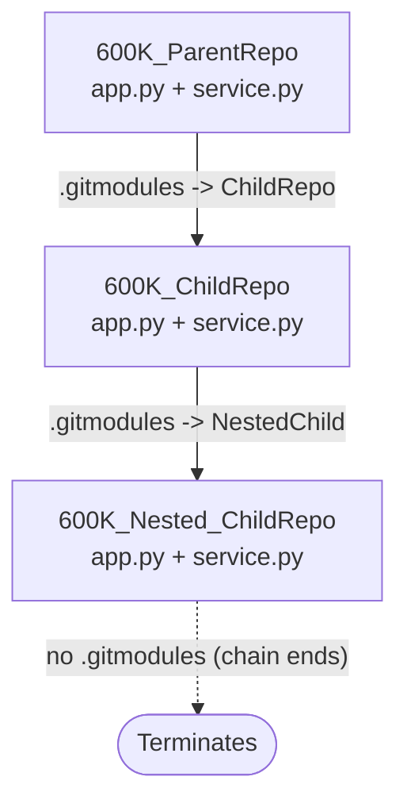
```mermaid
flowchart TD
    Parent["600K_ParentRepo<br/>app.py + service.py"]
    Child["600K_ChildRepo<br/>app.py + service.py"]
    Nested["600K_Nested_ChildRepo<br/>app.py + service.py"]
    Parent -->|".gitmodules -> ChildRepo"| Child
    Child -->|".gitmodules -> NestedChild"| Nested
    Nested -.->|"no .gitmodules (chain ends)"| Stop([Terminates])
```

Within a single working tier, the runtime component relationship is a thin entry point delegating computation to a local library and emitting results to the console:

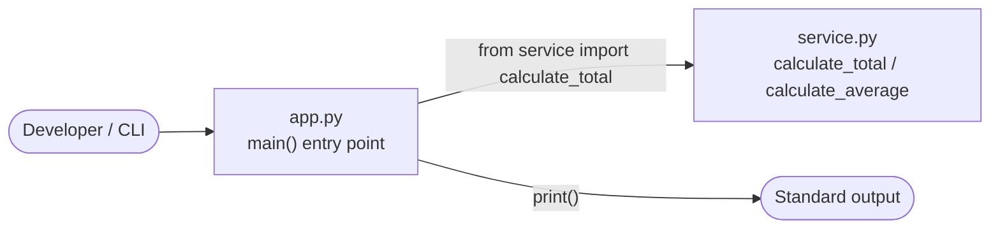
```mermaid
flowchart LR
    Dev(["Developer / CLI"]) --> App["app.py<br/>main() entry point"]
    App -->|"from service import calculate_total"| Svc["service.py<br/>calculate_total / calculate_average"]
    App -->|"print()"| Out(["Standard output"])
```

### 1.2.3 Success Criteria

The repository defines **no formal objectives, targets, service levels, or performance indicators**. The criteria below are therefore expressed as observable acceptance signals derived from directly verified behavior, not as business KPIs.

**Measurable objectives (observable acceptance signals).**

| Objective | Observed / Verifiable Result |
| --- | --- |
| Root application runs to completion | `python app.py` exits `0` and prints `Total: 100`, then `10`, `20`, `30`, `40`, then `Application completed` |
| Child application runs to completion | `ChildRepo` `python app.py` produces identical output and exits `0` |
| Submodule wiring is resolvable | `.gitmodules` entries are present; `git submodule status` reports `ChildRepo` pinned at commit `a1c62944…` |

**Critical success factors.** Correct execution depends on (1) the co-location of a valid `service.py` — one that actually defines `calculate_total` — alongside `app.py` (satisfied at the root and `ChildRepo` tiers, but not at `NestedChild`); (2) proper initialization/update of the Git submodules so the child directories are populated; and (3) a Python 3.6+ interpreter.

**Key performance indicators (KPIs).** None are defined in the repository. The system performs no measurement, logging, timing, or telemetry, so no runtime KPI can be reported from the available evidence.

## 1.3 Scope

This scope statement delineates what the repository actually implements versus what it deliberately or incidentally excludes. Because the repository contains no requirements or roadmap documents, "out-of-scope" items are identified by their verified absence from the code, and no future work is asserted beyond what the evidence supports.

### 1.3.1 In-Scope

**Core features and functionalities.** The must-have capabilities that the system actually provides are the following, each traceable to a specific source file:

| Capability | Description | Evidence |
| --- | --- | --- |
| Total aggregation | Sum the elements of an in-memory list of numbers | `service.py` — `calculate_total` |
| Average calculation | Mean of a list with an empty-input guard (library API only; not invoked by the app) | `service.py` — `calculate_average` |
| Console workflow | Compute the total of `[10, 20, 30, 40]`, then print the total, each number, and `Application completed` | `app.py` — `main()` |
| Submodule composition | Embed a child repository at a fixed path via a declared remote | `.gitmodules` (root and `ChildRepo`) |

**Primary user workflow.** The single supported workflow is command-line execution: a developer runs `python app.py` from a tier that contains a valid `service.py` (verified at the root and `ChildRepo` tiers) and observes deterministic standard-output. A secondary, library-style workflow is importing `service.py` to call `calculate_total` or `calculate_average` directly.

**Essential integrations.** The only integration in scope is Git submodule composition (declared in `.gitmodules`), used to assemble the parent → child → nested chain at version-control time. No runtime integrations are in scope.

**Key technical requirements.** A Python 3.6+ interpreter (implied by f-string usage); a valid `service.py` co-located with `app.py`; and, for a full-chain checkout, initialized/updated Git submodules.

**Implementation boundaries.** The table below states the boundaries of the system as observed.

| Boundary Dimension | In-Scope Definition |
| --- | --- |
| System boundary | A single-process command-line script whose only external effect is writing to standard output |
| User groups | Developers, submodule integrators, and technical readers (inferred from code shape; the code defines no roles, accounts, or permissions) |
| Geographic / market coverage | Not applicable — the code has no deployment target, localization, or market-specific behavior |
| Data domains | A single domain: an in-memory list of integers (`[10, 20, 30, 40]`); numeric aggregation only, with no external data sources |

### 1.3.2 Out-of-Scope

**Explicitly excluded capabilities.** The following are absent from the repository and are therefore out of scope. Each exclusion reflects the verified absence of any corresponding code.

| Excluded Capability | Basis for Exclusion |
| --- | --- |
| Networking, HTTP, or any API surface | No server, client, or network code exists |
| Graphical or web user interface | Output is limited to `print` to standard output |
| Data persistence / databases | No storage, files, or database access is implemented |
| Authentication / authorization | No identity, roles, or access control exist |
| Configuration / environment management | No config files, flags, or environment variables are read |
| Logging, telemetry, or monitoring | No logging or metrics instrumentation exists |
| Concurrency / asynchronous execution | All code is synchronous and single-process |
| Error handling / input validation | No exception handling or validation is present |
| Automated tests / CI | No test suite or pipeline definition exists |
| Dependency management / packaging | No manifest, lockfile, or packaging metadata exists |
| Dynamic or user-supplied input | The input list is hard-coded in `main()` |

**Future phase considerations.** The repository documents no roadmap, milestones, or planned phases; consequently, no future work is in scope, and this specification does not speculate about it. Two latent items are noted purely for accuracy — the unused `calculate_average` function and the non-functional `NestedChild` tier — but neither is declared as planned work anywhere in the repository.

**Integration points not covered.** No runtime integration is provided or planned: databases, message queues, external/third-party APIs, cloud services, and inter-process communication are all out of scope. Notably, there is no cross-repository integration at runtime — each `app.py` imports only its own local `service` module, so the submodule relationship is compositional (source assembly) rather than a runtime dependency.

**Unsupported use cases.** The following are explicitly unsupported: executing the deepest tier's entry point (`ChildRepo/NestedChild/app.py`), which fails with a circular-import `ImportError`; supplying custom or dynamic input to the calculation; any production, multi-user, or enterprise deployment; and ingesting external data of any kind, since the application reads no files or external inputs.

## 1.4 References

The following repository files, folders, and verification actions were examined as evidence for this Introduction. No external web sources were used.

**Files**

- `app.py` — Root entry point; established `main()`, the fixed input list `[10, 20, 30, 40]`, the `calculate_total` import from the local `service`, the `print` workflow, and the `__main__` guard.
- `service.py` — Root computation module; established the `calculate_total` and `calculate_average` functions and their empty-input behavior.
- `README.md` — Root readme; established that documentation is minimal (single heading `# app.py`).
- `.gitmodules` — Root submodule descriptor; established the `ChildRepo` submodule declaration and its remote URL.
- `ChildRepo/app.py` — Child-tier entry point; confirmed identical content to the root and verified to run successfully.
- `ChildRepo/service.py` — Child-tier computation module; confirmed identical to the root `service.py`.
- `ChildRepo/README.md` — Established the child readme content (`# 600K_ChildRepo`).
- `ChildRepo/.gitmodules` — Established the `NestedChild` submodule declaration and its remote URL.
- `ChildRepo/NestedChild/app.py` — Nested-tier entry point; confirmed identical to the root `app.py`.
- `ChildRepo/NestedChild/service.py` — Established the anomaly: this file duplicates `app.py` and does not define `calculate_total`/`calculate_average`, causing the nested entry point to fail with a circular-import `ImportError`.
- `ChildRepo/NestedChild/README.md` — Established the nested readme content (`# 600K_Nested_ChildRepo`).
- `.blitzyignore` (root, `ChildRepo/`, `ChildRepo/NestedChild/`) — Each contains only `*.csv`; honored by excluding all CSV files from inspection and documentation.

**Folders**

- `` (repository root) — Established the top-level structure and the minimal, dependency-free composition.
- `ChildRepo/` — The first embedded submodule tier.
- `ChildRepo/NestedChild/` — The nested submodule tier and terminus of the chain (contains no `.gitmodules`).

**Verification actions**

- Direct execution with Python 3.12.3 — Confirmed the root and `ChildRepo` applications print `Total: 100`, the four numbers, and `Application completed` (exit `0`), and that the `NestedChild` application exits `1` with a circular-import `ImportError`.
- `git submodule status` and branch inspection — Confirmed the working checkout is on branch `1307_01` and that `ChildRepo` is pinned at commit `a1c629449c281ae95d86c1672c3890541d683654`.
- Repository-wide file search — Confirmed the absence of any package manifest, lockfile, test suite, CI configuration, Dockerfile, or Makefile.

# 2. Product Requirements

## 2.1 Feature Catalog

This catalog decomposes `600K_ParentRepo` into discrete, testable features derived strictly from observed source code and directly verified runtime behavior. Because the repository contains no product brief, requirements document, roadmap, or business narrative (each `README.md` is a single heading line), no commercial or market-oriented features are asserted — the feature set below reflects only what the code actually implements. The scope basis for these features is documented in Section 1.3 (Scope); this section formalizes them as numbered, traceable requirements.

Four discrete features are present across the repository, mirroring the four in-scope capabilities enumerated in Section 1.3.1: two computation-library primitives (`calculate_total`, `calculate_average`), one console application workflow (`app.py`), and one build-time repository-composition capability (`.gitmodules`). No other feature is evidenced anywhere in the repository, and none is invented here.

### 2.1.1 Feature Inventory Overview

| Feature ID | Feature Name | Category | Priority |
| --- | --- | --- | --- |
| F-001 | Numeric Total Aggregation | Core Computation (Calculation Library) | Critical |
| F-002 | Numeric Average Calculation | Core Computation (Calculation Library) | Low |
| F-003 | Console Application Workflow | Application Entry Point / Console Presentation | High |
| F-004 | Nested Git Submodule Composition | Repository Composition / Build-time Integration | Medium |

The priority assignments are grounded in observed dependency and invocation relationships rather than any stated ranking: F-001 is **Critical** because it is the only computation the shipped entry point actually invokes and both F-002 and F-003 depend on it; F-003 is **High** as the sole executable user workflow; F-004 is **Medium** as the repository's defining structural characteristic that nonetheless has no runtime effect; and F-002 is **Low** because it is implemented in `service.py` but is never invoked by `app.py` (a latent library API).

### 2.1.2 F-001 — Numeric Total Aggregation

**Feature Metadata**

| Attribute | Value |
| --- | --- |
| Unique ID | F-001 |
| Feature Name | Numeric Total Aggregation |
| Feature Category | Core Computation (Calculation Library) |
| Priority Level | Critical |
| Status | Completed |

**Description**

| Aspect | Detail |
| --- | --- |
| Overview | `service.calculate_total(numbers)` initializes an accumulator to literal `0`, iterates the supplied iterable in source order, adds each element via augmented assignment, and returns the accumulated sum; an empty iterable returns `0`. |
| Business Value | No commercial value is defined anywhere in the repository. The demonstrable value is technical: a pure, dependency-free aggregation primitive that models a reusable calculation library. |
| User Benefits | Provides a deterministic, importable summation API for other modules; verified to return `100` for the input `[10, 20, 30, 40]`. |
| Technical Context | Implemented in `service.py` (root and `ChildRepo`, a 14-line module) with no imports, no type annotations, no classes, and no error handling. Synchronous, in-memory, single-pass O(n) computation. |

**Dependencies**

| Dependency Type | Detail |
| --- | --- |
| Prerequisite Features | None. |
| System Dependencies | A CPython interpreter (the repository's floor is Python 3.6+ due to f-string usage in `app.py`; verified on Python 3.12.3). |
| External Dependencies | None — no third-party libraries are used. |
| Integration Requirements | Consumed by F-002 (`calculate_average`) and F-003 (`app.py` `main()`) through the local import `from service import calculate_total`. |

### 2.1.3 F-002 — Numeric Average Calculation

**Feature Metadata**

| Attribute | Value |
| --- | --- |
| Unique ID | F-002 |
| Feature Name | Numeric Average Calculation |
| Feature Category | Core Computation (Calculation Library) |
| Priority Level | Low |
| Status | Completed (latent — implemented but not invoked by the shipped entry point) |

**Description**

| Aspect | Detail |
| --- | --- |
| Overview | `service.calculate_average(numbers)` returns literal `0` when `numbers` is falsey (empty-input guard); otherwise it returns `calculate_total(numbers) / len(numbers)`. |
| Business Value | No commercial value is defined in the repository. Technical value is a reusable arithmetic-mean primitive that guards against empty input. |
| User Benefits | Provides an importable average API; verified to return `25.0` for `[10, 20, 30, 40]` and `0` for `[]`. It is not surfaced to any console user because `app.py` never calls it. |
| Technical Context | Defined in `service.py` alongside `calculate_total`. Performs floating-point division (returns the float `25.0`) and requires a sized collection (uses `len()`). Direct inspection confirms it is never invoked by `app.py` at any tier. |

**Dependencies**

| Dependency Type | Detail |
| --- | --- |
| Prerequisite Features | F-001 — its return value is computed by delegating to `calculate_total(numbers)`. |
| System Dependencies | A CPython interpreter (per the repository floor noted for F-001). |
| External Dependencies | None. |
| Integration Requirements | Available to any importer of `service.py`; deliberately not integrated into the console workflow (F-003). |

### 2.1.4 F-003 — Console Application Workflow

**Feature Metadata**

| Attribute | Value |
| --- | --- |
| Unique ID | F-003 |
| Feature Name | Console Application Workflow |
| Feature Category | Application Entry Point / Console Presentation |
| Priority Level | High |
| Status | Completed (verified at the root and `ChildRepo` tiers; non-functional at the `NestedChild` tier) |

**Description**

| Aspect | Detail |
| --- | --- |
| Overview | `app.py`'s `main()` constructs the literal list `[10, 20, 30, 40]`, computes its total via `calculate_total`, prints `Total: <total>`, prints each number on its own line in source order, and prints `Application completed`. `main()` executes only under the `if __name__ == "__main__":` guard. |
| Business Value | No commercial value is defined in the repository. Value is a runnable, fully deterministic reference that demonstrates a clean split between a thin entry point and a calculation library. |
| User Benefits | A developer runs `python app.py` and observes deterministic output (`Total: 100`, then `10`, `20`, `30`, `40`, then `Application completed`) with exit code `0`. |
| Technical Context | Thin entry point that imports `calculate_total` from the local `service` module; performs console I/O via `print` only; accepts no arguments, stdin, or environment input; uses an f-string (Python 3.6+). At `NestedChild` the co-located `service.py` is a broken duplicate of `app.py`, so this workflow fails there (see F-003 implementation considerations). |

**Dependencies**

| Dependency Type | Detail |
| --- | --- |
| Prerequisite Features | F-001 — `main()` imports and calls `calculate_total`. |
| System Dependencies | A valid `service.py` co-located in the same directory that actually defines `calculate_total`; Python 3.6+. |
| External Dependencies | None. |
| Integration Requirements | Invoked via the command line (`python app.py`); relies on Python same-directory module resolution to locate the sibling `service` module. |

### 2.1.5 F-004 — Nested Git Submodule Composition

**Feature Metadata**

| Attribute | Value |
| --- | --- |
| Unique ID | F-004 |
| Feature Name | Nested Git Submodule Composition |
| Feature Category | Repository Composition / Build-time Integration |
| Priority Level | Medium |
| Status | Completed |

**Description**

| Aspect | Detail |
| --- | --- |
| Overview | The repository is the head of a three-tier Git submodule chain declared through `.gitmodules`: `600K_ParentRepo` embeds `ChildRepo`, which embeds `NestedChild`; the chain terminates at `NestedChild`, which contains no `.gitmodules`. |
| Business Value | No commercial value is defined in the repository. Technical value is a concrete, reproducible example of composing repositories through nested Git submodules. |
| User Benefits | Integrators can add or update the repository as a Git submodule of a parent project; `git submodule` tooling resolves each tier at a pinned commit. |
| Technical Context | A version-control/build-time integration only — there is no runtime cross-repository import. The root `.gitmodules` declares `ChildRepo` (`https://github.com/lakshya-blitzy/600K_ChildRepo.git`) and `ChildRepo/.gitmodules` declares `NestedChild` (`https://github.com/lakshya-blitzy/600K_Nested_ChildRepo.git`). `git submodule status` reports `ChildRepo` pinned at commit `a1c629449c281ae95d86c1672c3890541d683654` on branch `1307_01`. |

**Dependencies**

| Dependency Type | Detail |
| --- | --- |
| Prerequisite Features | None — independent of F-001, F-002, and F-003 at runtime. |
| System Dependencies | Git with submodule support. |
| External Dependencies | GitHub-hosted remotes (`github.com/lakshya-blitzy/600K_ChildRepo.git` and `.../600K_Nested_ChildRepo.git`) and network access to initialize/update the submodules. |
| Integration Requirements | `git submodule` initialization/update per the `.gitmodules` descriptors; no runtime coupling to any other feature. |

## 2.2 Functional Requirements

This section specifies the functional requirements for each feature as testable requirement statements. Every acceptance criterion is drawn from directly verified behavior (execution on Python 3.12.3 and source inspection). Requirement priority uses the Must-Have / Should-Have / Could-Have scale; complexity uses High / Medium / Low. The repository defines **no performance SLAs, KPIs, or throughput targets** (see Section 1.2.3), so "Performance Criteria" rows report only the observed algorithmic characteristics rather than any contractual target.

Because each feature's `.gitmodules` and source files are duplicated across the root and `ChildRepo` tiers (and, for `app.py`, the `NestedChild` tier), the requirements below apply to every tier that contains the corresponding valid source, except where a tier-specific exception is explicitly noted.

### 2.2.1 F-001 — Numeric Total Aggregation Requirements

**Requirement Details**

| Requirement ID | Description | Priority | Complexity |
| --- | --- | --- | --- |
| F-001-RQ-001 | Sum all elements of the supplied iterable in source order, starting from an accumulator of `0` | Must-Have | Low |
| F-001-RQ-002 | Return `0` when the supplied iterable is empty | Must-Have | Low |

**Acceptance Criteria**

| Requirement ID | Acceptance Criteria |
| --- | --- |
| F-001-RQ-001 | `calculate_total([10, 20, 30, 40])` returns `100`; elements are processed in source order |
| F-001-RQ-002 | `calculate_total([])` returns `0` |

**Technical Specifications**

| Aspect | Detail |
| --- | --- |
| Input Parameters | `numbers` — a single positional argument expected to be an iterable of numeric elements; no type annotation or validation |
| Output/Response | The numeric sum of all elements (an `int` for integer inputs); `0` for empty input |
| Performance Criteria | Single-pass O(n) traversal; synchronous and in-memory; no SLA defined in the repository |
| Data Requirements | Operates solely on the in-memory iterable passed by the caller; no external data source |

**Validation Rules**

| Category | Detail |
| --- | --- |
| Business Rules | Accumulator initialized to `0`; each element added via augmented assignment (`total += number`) in iteration order |
| Data Validation | None — no type or numeric validation; a non-iterable or non-numeric element raises an unhandled exception |
| Security Requirements | None applicable — pure function with no I/O, no external input, and no side effects |
| Compliance Requirements | None defined in the repository |

### 2.2.2 F-002 — Numeric Average Calculation Requirements

**Requirement Details**

| Requirement ID | Description | Priority | Complexity |
| --- | --- | --- | --- |
| F-002-RQ-001 | Return the arithmetic mean as `calculate_total(numbers) / len(numbers)` for non-empty input | Must-Have | Low |
| F-002-RQ-002 | Return `0` when the input is empty or otherwise falsey (empty-input guard) | Must-Have | Low |

**Acceptance Criteria**

| Requirement ID | Acceptance Criteria |
| --- | --- |
| F-002-RQ-001 | `calculate_average([10, 20, 30, 40])` returns the float `25.0` |
| F-002-RQ-002 | `calculate_average([])` returns `0` |

**Technical Specifications**

| Aspect | Detail |
| --- | --- |
| Input Parameters | `numbers` — a sized collection of numeric elements that must support `len()`; no type annotation or validation |
| Output/Response | The float quotient of total over count for non-empty input; the integer `0` for empty/falsey input |
| Performance Criteria | One `calculate_total` pass (O(n)) plus one `len()` call; synchronous and in-memory; no SLA defined |
| Data Requirements | In-memory collection only; no external data source |

**Validation Rules**

| Category | Detail |
| --- | --- |
| Business Rules | The empty-input guard (`if not numbers: return 0`) precedes division to prevent division-by-zero |
| Data Validation | Only the falsey guard; no type checking. A non-sized iterable (e.g., a generator) would raise `TypeError` at `len()` |
| Security Requirements | None applicable — pure function with no I/O |
| Compliance Requirements | None defined in the repository |

### 2.2.3 F-003 — Console Application Workflow Requirements

**Requirement Details**

| Requirement ID | Description | Priority | Complexity |
| --- | --- | --- | --- |
| F-003-RQ-001 | Compute and print the total of the hard-coded list `[10, 20, 30, 40]` | Must-Have | Low |
| F-003-RQ-002 | Print each input number on its own line in source order | Must-Have | Low |
| F-003-RQ-003 | Print the terminal message `Application completed` and exit successfully | Must-Have | Low |
| F-003-RQ-004 | Execute `main()` only when the module is run directly (under the `__main__` guard) | Should-Have | Low |

**Acceptance Criteria**

| Requirement ID | Acceptance Criteria |
| --- | --- |
| F-003-RQ-001 | The first standard-output line is exactly `Total: 100` |
| F-003-RQ-002 | The next four lines are `10`, `20`, `30`, `40`, each on its own line |
| F-003-RQ-003 | The final line is `Application completed` and the process exits with code `0` (verified at the root and `ChildRepo` tiers) |
| F-003-RQ-004 | Importing `app` does not execute `main()`; running `python app.py` directly does |

**Technical Specifications**

| Aspect | Detail |
| --- | --- |
| Input Parameters | None — the input list is a hard-coded literal; no CLI arguments, stdin, environment variables, or files are read |
| Output/Response | Six lines to standard output (total, four numbers, completion message); exit code `0` on success |
| Performance Criteria | Deterministic, effectively constant-time output for the fixed four-element list; single process; no SLA defined |
| Data Requirements | The literal list `[10, 20, 30, 40]` constructed in `main()`; no external data |

**Validation Rules**

| Category | Detail |
| --- | --- |
| Business Rules | `calculate_total` must be imported from the co-located `service` module; output order is total → each number → completion message |
| Data Validation | None — no argument or input validation is performed |
| Security Requirements | None applicable — console output only; no untrusted input, no network, and no file or persistence access |
| Compliance Requirements | None defined in the repository |

> Tier-specific exception: F-003 is verified functional at the root and `ChildRepo` tiers. At the `NestedChild` tier the co-located `service.py` is a broken duplicate of `app.py`, so `python app.py` exits with code `1` and raises `ImportError: cannot import name 'calculate_total' from partially initialized module 'service' (most likely due to a circular import)`. This is a defect at that tier, not a functional variation of the requirement.

### 2.2.4 F-004 — Nested Git Submodule Composition Requirements

**Requirement Details**

| Requirement ID | Description | Priority | Complexity |
| --- | --- | --- | --- |
| F-004-RQ-001 | Declare each child submodule in `.gitmodules` with a `path` and a remote `url` | Must-Have | Low |
| F-004-RQ-002 | Pin the embedded submodule to a specific commit in the parent's index | Should-Have | Low |
| F-004-RQ-003 | Terminate the chain at the nested tier (no further `.gitmodules`) | Could-Have | Low |

**Acceptance Criteria**

| Requirement ID | Acceptance Criteria |
| --- | --- |
| F-004-RQ-001 | Root `.gitmodules` declares `ChildRepo` → `https://github.com/lakshya-blitzy/600K_ChildRepo.git`; `ChildRepo/.gitmodules` declares `NestedChild` → `https://github.com/lakshya-blitzy/600K_Nested_ChildRepo.git` |
| F-004-RQ-002 | `git submodule status` reports `ChildRepo` pinned at commit `a1c629449c281ae95d86c1672c3890541d683654` |
| F-004-RQ-003 | `ChildRepo/NestedChild` contains no `.gitmodules` file |

**Technical Specifications**

| Aspect | Detail |
| --- | --- |
| Input Parameters | `.gitmodules` INI-style entries: submodule name, `path`, and remote `url` |
| Output/Response | Populated submodule working directories after `git submodule init/update`, each checked out at the recorded commit |
| Performance Criteria | A build/VCS-time operation only; not on any runtime path; no SLA defined |
| Data Requirements | Submodule descriptors (name/path/url) plus the recorded commit SHA stored in the parent's git index |

**Validation Rules**

| Category | Detail |
| --- | --- |
| Business Rules | Each submodule `path` matches the embedded directory name; the chain nests parent → child → nested and terminates where no `.gitmodules` exists |
| Data Validation | None enforced by the repository beyond Git's own `.gitmodules` parsing |
| Security Requirements | Remotes use public HTTPS GitHub URLs; no credentials or secrets are stored in the repository |
| Compliance Requirements | None defined in the repository |

## 2.3 Feature Relationships

This section documents only the feature relationships that are directly evidenced in the source code. The system is intentionally small, so the relationship graph is sparse: two features depend on a single shared computation, one feature is a build-time concern with no runtime coupling, and one implemented feature (F-002) participates in no consumer relationship because nothing invokes it.

### 2.3.1 Feature Dependency Map

The runtime dependency graph below is derived from the `import` statement and function calls observed in `app.py` and `service.py`. F-004 (submodule composition) appears with no runtime edges because it operates only at build/version-control time — it assembles the source tiers that *contain* the other features but introduces no runtime coupling between them.

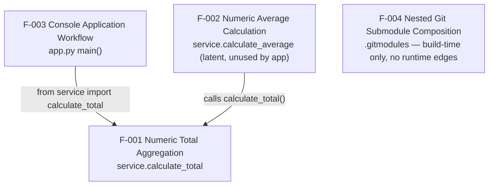
```mermaid
flowchart TD
    F003["F-003 Console Application Workflow<br/>app.py main()"]
    F002["F-002 Numeric Average Calculation<br/>service.calculate_average (latent, unused by app)"]
    F001["F-001 Numeric Total Aggregation<br/>service.calculate_total"]
    F004["F-004 Nested Git Submodule Composition<br/>.gitmodules — build-time only, no runtime edges"]

    F003 -->|"from service import calculate_total"| F001
    F002 -->|"calls calculate_total()"| F001
```

**Dependency relationships (evidence-based)**

| Source Feature | Target Feature | Relationship | Evidence |
| --- | --- | --- | --- |
| F-002 | F-001 | Calls `calculate_total(numbers)` internally to compute the mean | `service.py` — `calculate_average` body |
| F-003 | F-001 | Imports and calls `calculate_total` on the hard-coded list | `app.py` — `from service import calculate_total` |
| F-004 | (none) | No runtime coupling; assembles source tiers at build time | `.gitmodules` (root and `ChildRepo`) |

Two relationships that a reader might expect but that are **explicitly absent** in the code are worth recording for accuracy: F-003 does **not** depend on F-002 (`app.py` never calls `calculate_average`), and there is **no** runtime dependency between tiers of the submodule chain (each `app.py` imports only its own sibling `service` module, never a module from another repository).

### 2.3.2 Integration Points

| Integration Point | Type | Detail |
| --- | --- | --- |
| `from service import calculate_total` | Intra-tier module import (runtime) | `app.py` resolves the sibling `service` module located in the same directory; this is the only runtime integration in the system |
| `.gitmodules` submodule declarations | Build / version-control-time composition | The parent embeds `ChildRepo`, and `ChildRepo` embeds `NestedChild`; resolved by `git submodule` tooling, not at runtime |

No other integration points exist: the system integrates with no databases, network services, message brokers, third-party APIs, cloud platforms, or environment-based configuration (consistent with Section 1.3.2).

### 2.3.3 Shared Components

| Shared Component | Shared By | Detail |
| --- | --- | --- |
| `service.py` module | F-001, F-002, F-003 | The single computation library; hosts both calculation functions and is the import target of `app.py` |
| `calculate_total` function | F-002, F-003 | The one computation reused by both the average calculation (internal call) and the console workflow (imported call) |
| Two-file pattern (`app.py` + `service.py`) | Root and `ChildRepo` tiers | Byte-identical copies of both files recur at the root and `ChildRepo` tiers; `app.py` also recurs at `NestedChild`, though `NestedChild/service.py` is a broken duplicate |

### 2.3.4 Common Services

The only common service in the system is `calculate_total` (F-001). It is the shared computational primitive on which both the higher-level average calculation (F-002) and the user-facing console workflow (F-003) depend. There is no other service layer — no configuration service, logging service, persistence service, or network service exists anywhere in the repository. The `calculate_average` function (F-002), although implemented as a reusable library routine, functions as a *potential* common service only: no component in the shipped codebase currently consumes it.

## 2.4 Implementation Considerations

This section captures the implementation considerations for each feature, grounded in the observed code. Several constraints are cross-cutting and apply system-wide: there is no error handling or input validation, no automated tests or CI, no dependency manifest, and no logging, configuration, persistence, or concurrency anywhere in the repository (see Section 1.3.2). The considerations below therefore emphasize the specific constraints, characteristics, and maintenance risks that attach to each individual feature.

### 2.4.1 F-001 — Numeric Total Aggregation

| Consideration | Detail |
| --- | --- |
| Technical Constraints | No input validation or type checking; the function assumes an iterable of numeric elements. A non-iterable or non-numeric argument raises an unhandled exception. Pure function with no annotations. |
| Performance Requirements | Single-pass O(n) accumulation; synchronous and in-memory. No repository-defined SLA; runtime is bounded only by the size of the caller-supplied iterable. |
| Scalability Considerations | Single-threaded and single-process; the entire iterable must fit in memory. No streaming, chunking, or concurrency is implemented. |
| Security Implications | Minimal — a pure function with no I/O, no external input, and no side effects; it cannot access resources or leak data. The only exposure is an unhandled exception on malformed input. |
| Maintenance Requirements | The 14-line `service.py` is duplicated byte-identically at the root and `ChildRepo` tiers, so any behavioral change must be replicated across tiers to keep them consistent. No tests exist to guard the behavior. |

### 2.4.2 F-002 — Numeric Average Calculation

| Consideration | Detail |
| --- | --- |
| Technical Constraints | Requires a *sized* collection because it calls `len()`; a non-sized iterable (e.g., a generator) raises `TypeError`. Depends on F-001. The empty-input guard prevents division-by-zero; the result is a float. |
| Performance Requirements | One `calculate_total` pass (O(n)) plus a `len()` call; synchronous and in-memory. No SLA defined. |
| Scalability Considerations | Same profile as F-001, with the added constraint that the input must be materialized (sized), so it cannot operate on lazy or streaming inputs. |
| Security Implications | Minimal — a pure function with no I/O; the same malformed-input exception risk applies. |
| Maintenance Requirements | Implemented but never invoked, making it a latent API with dead-code risk; present at the root and `ChildRepo` tiers but absent from `NestedChild/service.py` entirely. Its unused status should be documented, or `app.py` extended to consume it if surfacing the average is intended. No tests exist. |

### 2.4.3 F-003 — Console Application Workflow

| Consideration | Detail |
| --- | --- |
| Technical Constraints | The input `[10, 20, 30, 40]` is hard-coded; no CLI arguments, stdin, environment variables, or files are read. Requires a valid co-located `service.py` that defines `calculate_total`, and a Python 3.6+ interpreter (f-string). No error handling; output is limited to standard output. |
| Performance Requirements | Deterministic and effectively constant-time for the fixed four-element list; single process. No SLA defined. |
| Scalability Considerations | Not designed to scale — fixed input, single invocation, no concurrency or batching; output volume is a constant six lines. |
| Security Implications | Minimal — console output only, with no untrusted input and no network or file access. The material risk is the `NestedChild` tier's circular-import failure (exit code `1`), a correctness/availability defect confined to that tier. |
| Maintenance Requirements | `app.py` is duplicated byte-identically across all three tiers. The `NestedChild` tier is broken because its `service.py` is a duplicate of `app.py` rather than the calculation library; correcting that tier requires replacing `NestedChild/service.py` with the real `service` module. No tests exist. |

### 2.4.4 F-004 — Nested Git Submodule Composition

| Consideration | Detail |
| --- | --- |
| Technical Constraints | Requires Git with submodule support and network access to the public GitHub remotes; submodules must be initialized/updated to populate the child directories. `ChildRepo` is pinned to a specific commit, and the chain terminates where no `.gitmodules` exists. This is a build/version-control-time concern only. |
| Performance Requirements | Not on any runtime path; the relevant cost is that of `git submodule init/update` (network-bound). No SLA defined. |
| Scalability Considerations | Nesting depth is bounded by manual configuration (three tiers here); each additional tier needs its own `.gitmodules`, and deeper chains increase clone/update time and operational complexity. |
| Security Implications | Remotes are public HTTPS GitHub URLs and no credentials or secrets are stored in the repository. Commit pinning aids reproducibility, but a pinned commit does not automatically receive upstream fixes. |
| Maintenance Requirements | The pinned commit (`a1c629449c281ae95d86c1672c3890541d683654`) must be advanced deliberately to adopt child changes, and the remote URLs must remain valid. Because `app.py`/`service.py` are duplicated across tiers, submodule updates can drift from the parent's copies; no automation keeps the tiers synchronized. |

## 2.5 Requirements Traceability Matrix

This matrix traces every requirement back to the specific source evidence that implements it and to the specification/verification basis that confirms it. It also records how features apply across the three submodule tiers, links the related process diagrams, and captures the assumptions and constraints under which these requirements hold.

### 2.5.1 Requirement-to-Source Traceability Matrix

| Requirement ID | Parent Feature | Source Evidence | Spec / Verification |
| --- | --- | --- | --- |
| F-001-RQ-001 | F-001 | `service.py` — `calculate_total` accumulation loop | §1.3.1; verified `calculate_total([10,20,30,40]) == 100` |
| F-001-RQ-002 | F-001 | `service.py` — `calculate_total` (zero-init, empty loop) | Verified `calculate_total([]) == 0` |
| F-002-RQ-001 | F-002 | `service.py` — `calculate_average` division branch | Verified `calculate_average([10,20,30,40]) == 25.0` |
| F-002-RQ-002 | F-002 | `service.py` — `calculate_average` empty-input guard | Verified `calculate_average([]) == 0` |
| F-003-RQ-001 | F-003 | `app.py` — `print(f"Total: {total}")` | §1.2.3; verified first line `Total: 100` |
| F-003-RQ-002 | F-003 | `app.py` — `for number in numbers: print(number)` | Verified `10`,`20`,`30`,`40` lines |
| F-003-RQ-003 | F-003 | `app.py` — `print("Application completed")` | Verified final line + exit code `0` |
| F-003-RQ-004 | F-003 | `app.py` — `if __name__ == "__main__": main()` | Source inspection of the entry guard |
| F-004-RQ-001 | F-004 | `.gitmodules` (root and `ChildRepo`) — `path` + `url` | §1.2.1; source inspection of both descriptors |
| F-004-RQ-002 | F-004 | Parent git index — recorded submodule commit | Verified `git submodule status` → `a1c62944…` |
| F-004-RQ-003 | F-004 | Absence of `ChildRepo/NestedChild/.gitmodules` | Verified chain terminus (no descriptor) |

### 2.5.2 Feature-to-Tier Applicability

The same features recur across tiers, but their operational status differs at the `NestedChild` tier. The matrix below states where each feature is present and functional.

| Feature | Root | ChildRepo | NestedChild |
| --- | --- | --- | --- |
| F-001 Numeric Total Aggregation | Present, functional | Present, functional | Absent — `service.py` is a broken duplicate of `app.py` |
| F-002 Numeric Average Calculation | Present, unused | Present, unused | Absent |
| F-003 Console Application Workflow | Functional (exit `0`) | Functional (exit `0`) | Present but fails (circular-import `ImportError`, exit `1`) |
| F-004 Nested Git Submodule Composition | Declares `ChildRepo` | Declares `NestedChild` | None (chain terminus) |

### 2.5.3 Related Diagrams and Specification Links

| Reference | Location | Purpose |
| --- | --- | --- |
| Submodule composition chain diagram | §1.2.2 System Overview | Depicts the `ParentRepo → ChildRepo → NestedChild` build-time chain (traces F-004) |
| Runtime component relationship diagram | §1.2.2 System Overview | Depicts `Developer/CLI → app.py → service.py → standard output` (traces F-001/F-003) |
| Feature Dependency Map | §2.3.1 (this section) | Runtime feature dependencies (F-002→F-001, F-003→F-001) |
| Scope definitions | §1.3.1 In-Scope / §1.3.2 Out-of-Scope | Establishes the capability boundaries these requirements formalize |

### 2.5.4 Requirement Baseline and Versioning

The repository declares no version number, release tag, `VERSION` file, package manifest, or changelog, so no upstream product version can be cited. For traceability, this requirements set is captured as an initial documentation baseline against the observed checkout.

| Attribute | Value |
| --- | --- |
| Requirements baseline version | 1.0 (initial capture) |
| Source branch | `1307_01` |
| Submodule pin | `ChildRepo` @ `a1c629449c281ae95d86c1672c3890541d683654` |
| Repository-declared version | None (no tag, `VERSION` file, manifest, or changelog present) |

### 2.5.5 Assumptions and Constraints

| Ref | Type | Statement |
| --- | --- | --- |
| A-01 | Assumption | A CPython 3.6+ interpreter is available (f-string floor); behavior verified on Python 3.12.3. |
| A-02 | Assumption | For F-003, a valid `service.py` defining `calculate_total` is co-located with `app.py` (holds at root and `ChildRepo`). |
| A-03 | Assumption | For F-004, Git and network access to the public GitHub remotes are available and submodules are initialized/updated. |
| C-01 | Constraint | F-003 input is hard-coded (`[10, 20, 30, 40]`); no dynamic, CLI, stdin, file, or environment input is supported. |
| C-02 | Constraint | No error handling, input validation, tests, CI, manifests, persistence, networking, configuration, logging, or concurrency exists anywhere in the repository. |
| C-03 | Constraint | F-002 (`calculate_average`) is implemented but never invoked by any shipped component (latent library API). |
| C-04 | Constraint | The `NestedChild` tier's console workflow is non-functional due to a circular-import defect in its `service.py`. |
| C-05 | Constraint | CSV files (`large.csv` at each tier) are excluded from scope per the `.blitzyignore` (`*.csv`) rule and were not examined or documented. |

## 2.6 References

The following repository files, folders, verification actions, and specification sections were examined as evidence for this Product Requirements section. No external web sources were used. CSV files (`large.csv` at every tier) were excluded from inspection per the `.blitzyignore` (`*.csv`) rule.

**Files**

- `app.py` — Root entry point; established F-003 (the `main()` workflow, hard-coded `[10, 20, 30, 40]`, the `calculate_total` import, the `print` sequence, and the `__main__` guard).
- `service.py` — Root computation module; established F-001 (`calculate_total`) and F-002 (`calculate_average`) and their empty-input behavior.
- `README.md` — Root readme; confirmed the absence of any product/business narrative (single heading line `# app.py`).
- `.gitmodules` — Root submodule descriptor; established F-004-RQ-001 (the `ChildRepo` declaration and its remote URL).
- `ChildRepo/app.py` — Child-tier entry point; confirmed byte-identical to the root `app.py` and verified to run successfully.
- `ChildRepo/service.py` — Child-tier computation module; confirmed byte-identical to the root `service.py`.
- `ChildRepo/.gitmodules` — Established the `NestedChild` submodule declaration and its remote URL (F-004-RQ-001).
- `ChildRepo/NestedChild/app.py` — Nested-tier entry point; confirmed identical to the root `app.py`.
- `ChildRepo/NestedChild/service.py` — Established the anomaly underpinning the F-003 tier-specific defect: it duplicates `app.py` and defines neither `calculate_total` nor `calculate_average`, causing the circular-import `ImportError`.
- `.blitzyignore` (root, `ChildRepo/`, `ChildRepo/NestedChild/`) — Each contains only `*.csv`; honored by excluding all CSV files from inspection and documentation (constraint C-05).

**Folders**

- `` (repository root) — Established the top-level structure (`app.py`, `service.py`, `README.md`, `.gitmodules`, `ChildRepo/`) and the minimal, dependency-free composition.
- `ChildRepo/` — The first embedded submodule tier; source of the child-tier feature copies.
- `ChildRepo/NestedChild/` — The nested submodule tier and terminus of the chain (contains no `.gitmodules`).

**Verification actions**

- Direct execution on Python 3.12.3 — Confirmed the root and `ChildRepo` applications print `Total: 100`, the four numbers, and `Application completed` (exit `0`), and that the `NestedChild` application exits `1` with a circular-import `ImportError`.
- Function-level checks — Confirmed `calculate_total([10,20,30,40]) == 100`, `calculate_total([]) == 0`, `calculate_average([10,20,30,40]) == 25.0`, and `calculate_average([]) == 0`.
- `git submodule status` and branch inspection — Confirmed the checkout is on branch `1307_01` and that `ChildRepo` is pinned at commit `a1c629449c281ae95d86c1672c3890541d683654` (F-004-RQ-002).
- Repository-wide file enumeration — Confirmed the absence of any package manifest, lockfile, test suite, CI configuration, Dockerfile, or Makefile.

**Cross-referenced specification sections**

- `1.1 Executive Summary` — Confirmed the repository identity (`600K_ParentRepo`, branch `1307_01`) and the demonstration/pedagogical nature that frames feature business value.
- `1.2 System Overview` — Provided the system capabilities, component model, verified success signals, and the process flowcharts referenced in §2.5.3.
- `1.3 Scope` — Established the in-scope capabilities that this section formalizes as F-001–F-004 and the out-of-scope exclusions cited throughout.
- `1.4 References` — Cross-checked the evidentiary basis and verified-behavior claims reused here.

# 3. Technology Stack

## 3.1 Programming Languages

The system is implemented in a **single programming language, Python (CPython)**, across every component and every tier of the submodule chain. A full enumeration of source files (excluding `.git` internals and `*.csv`, which is excluded by `.blitzyignore`) yields only Python sources: six `.py` files — `app.py` and `service.py` at each of the three tiers (repository root, `ChildRepo`, and `ChildRepo/NestedChild`). No other language sources (JavaScript, TypeScript, Java, Go, Swift, Kotlin, C/C++, shell, SQL, etc.) exist anywhere in the repository.

#### Language Inventory by Component

| Language | Version (evidence-based) | Component / Scope | Source Evidence |
| --- | --- | --- | --- |
| Python (CPython) | Floor **3.6+** (f-strings); verified running on **3.12.3** | Entire application — both the console entry point and the computation library, replicated at all three tiers | `app.py`, `service.py`; bytecode `__pycache__/service.cpython-312.pyc` |

At the level of individual components, both files that make up a working tier are Python: `app.py` is the executable entry point (input construction, orchestration, and console output under the `if __name__ == "__main__":` guard), and `service.py` is the pure computation library (`calculate_total`, `calculate_average`). This two-file, single-language structure is duplicated byte-for-byte at the root and `ChildRepo` tiers.

#### Language Features and Runtime Characteristics

The code exercises only the Python language core and its built-ins — there is not even a `import` of a standard-library module; the sole import statement anywhere is the repository-local `from service import calculate_total`. The observed language surface is limited to:

- **Built-in functions**: `print()` for console output and `len()` for average calculation.
- **Formatted string literals (f-strings)**: `print(f"Total: {total}")` — the single most version-significant feature, establishing the interpreter floor.
- **Core control flow and data types**: `for` loops, `if` guards, list literals (`[10, 20, 30, 40]`), integer accumulation, and float division.
- **Dynamic typing**: functions are unannotated (`def calculate_total(numbers):`), relying on duck typing rather than static type declarations.

#### Version Constraints and Dependencies

- **Interpreter floor — Python 3.6+.** The use of f-strings (PEP 498) requires a Python 3.6 or newer interpreter. This is the only language feature that constrains the minimum version.
- **Verified runtime — Python 3.12.3.** The presence of `service.cpython-312.pyc` in each `__pycache__` directory, together with successful direct execution, confirms the code has been run under CPython 3.12.
- **No pinned version.** There is no `.python-version`, `.tool-versions`, `pyproject.toml`, `setup.py`, or any other file declaring or constraining the interpreter version. The runtime version is therefore supplied entirely by the host environment; any CPython 3.6+ interpreter is expected to execute the working tiers identically.
- **No type-safety guarantees.** Because functions are unannotated and no validation is performed, correct behavior depends on callers supplying numeric iterables; the language does not enforce this.

**Selection rationale (as evidenced by the code).** Python is a natural fit for the system's demonstrable scope — a small, procedural, synchronous computation (`sum`/`average`) followed by console printing. This workload requires nothing beyond the language core and its built-ins, so Python's batteries-included interpreter delivers the full functionality with zero external tooling. The single-language, single-runtime choice also keeps the nested-submodule composition uniform: each tier presents the identical `app.py` + `service.py` Python pair, so the same interpreter runs every tier without additional toolchains.

## 3.2 Frameworks & Libraries

**The system uses no application framework and no third-party library.** There is no web framework, no CLI framework, no AI/ML framework, no ORM, and no utility library. An exhaustive scan of every `import` statement across all three tiers returns exactly one imported module name — `service` — which is the repository's own local module (`from service import calculate_total`). No standard-library module (e.g., `os`, `sys`, `json`, `argparse`, `logging`, `csv`) is even imported.

#### Core Framework

None. The application is plain, procedural CPython. This directly reconciles the project's **Default Technology Stack** against reality: the defaults (Flask, Langchain, React, TailwindCSS, React-Native, etc.) are **not adopted** by this repository and appear nowhere in the code. Documenting them as in-use would be inaccurate; they are recorded here only to note their deliberate absence.

#### Supporting Libraries — Python Standard Library (built-ins only)

The only "library" the code relies upon is the **Python Standard Library**, and then only its built-in namespace. Because these facilities ship with the interpreter, their effective version is identical to the interpreter version (floor 3.6+, verified 3.12.3); they are not independently versioned or installed.

| Facility | Type | Usage in Code | Evidence |
| --- | --- | --- | --- |
| `print()` | Built-in function | Console output of the total, each number, and the completion message | `app.py` lines 8, 11, 13 |
| `len()` | Built-in function | Divisor in average calculation | `service.py` line 14 |
| f-string formatting | Language feature (PEP 498) | `f"Total: {total}"` | `app.py` line 8 |

#### Compatibility Requirements

- **Runtime compatibility:** any CPython interpreter at version **3.6 or newer** (the f-string floor). No library-level compatibility matrix exists because there are no libraries to reconcile.
- **No dependency resolution:** with zero third-party packages, there are no inter-library version conflicts, no minimum/maximum pins, and no transitive-dependency constraints to manage.

#### Justification and Security Implications

**Justification.** The functional scope — aggregate a list of integers and print results — is fully satisfied by the language built-ins, so introducing a framework would add dependency, configuration, and version-management burden with no functional benefit. The "no framework" choice is consistent with the system's characterization elsewhere in this specification as plain, procedural, synchronous CPython that uses only the built-in `print` and a local module import.

**Security implication.** Relying solely on the standard-library built-ins eliminates framework- and library-level vulnerability exposure entirely: there is no third-party framework whose CVEs must be tracked or patched, and no framework configuration surface (routing, deserialization, templating) that could be misconfigured or attacked.

## 3.3 Open Source Dependencies

**The repository declares and consumes zero open-source package dependencies.** No dependency manifest or lockfile of any kind is present at any tier. This was verified by explicitly checking for — and finding none of — the following: `requirements.txt`, `requirements-dev.txt`, `Pipfile`, `Pipfile.lock`, `pyproject.toml`, `setup.py`, `setup.cfg`, `poetry.lock`, `package.json`, `package-lock.json`, `yarn.lock`, `go.mod`, `Cargo.toml`, `pom.xml`, `build.gradle`, and `Gemfile`.

#### Package Dependencies, Registries, and Versions

| Dimension | Finding |
| --- | --- |
| Third-party packages | None — no PyPI (or any other registry) package is imported or required |
| Package manager | None — no `pip`, `poetry`, `pipenv`, `conda`, `npm`, etc. configuration exists |
| Package registry | None referenced — the repository resolves no packages from PyPI or any index |
| Lockfile / pinned versions | None — there are no dependency version pins because there are no dependencies |

The only externally-sourced code enters the project through **Git submodules**, not through a package registry. Those submodules (`ChildRepo`, `NestedChild`) are pinned by commit SHA and fetched from public GitHub over HTTPS; they are a version-control-time *composition* mechanism rather than runtime package dependencies, and are documented under Section 3.6 (Development & Deployment). Notably, each submodule tier is itself dependency-free, so pulling the submodules introduces no third-party packages either.

#### Justification and Security Implications

**Justification.** Because the functional scope is met entirely by Python's built-ins (Section 3.2), there is no need to draw in open-source packages, and the repository therefore omits dependency management altogether.

**Security implication.** A zero-dependency posture means the software supply-chain attack surface is effectively nil: there are no transitive dependencies to audit, no registry accounts or tokens to protect, no dependency-confusion or typosquatting exposure, and nothing to patch for third-party CVEs. The trade-off is that the project also inherits no upstream security *fixes*, because there is no upstream package to update — an acceptable posture given that no external code executes at runtime.

## 3.4 Third-Party Services

**The system integrates with no third-party services at runtime.** The code performs no network I/O of any kind — there are no HTTP clients, no SDK imports, no service endpoints, no connection strings, and no environment-variable-driven configuration. Consequently, none of the service categories below is present.

| Service Category | Status | Evidence |
| --- | --- | --- |
| External APIs / integrations | None | No HTTP client, no API SDK, no network call anywhere in the source |
| Authentication services | None | No auth library or provider (e.g., Auth0); no login, token, or credential handling |
| Monitoring / observability | None | No logging, metrics, tracing, or telemetry code; the program emits only `print()` output |
| Cloud services | None | No cloud SDK (e.g., AWS) and no cloud resource references |

This again reconciles the **Default Technology Stack** against the actual repository: the default entries for Auth0 (authentication) and AWS (cloud) are **not adopted** and appear nowhere in the code.

#### The Only External Touchpoint — Public GitHub (VCS-time only)

The sole external system the project references is **GitHub**, used strictly at version-control time to host the submodule remotes: `https://github.com/lakshya-blitzy/600K_ChildRepo.git` (declared in the root `.gitmodules`) and `https://github.com/lakshya-blitzy/600K_Nested_ChildRepo.git` (declared in `ChildRepo/.gitmodules`). This is a *source-fetch* dependency exercised by `git submodule` operations during cloning/updating — not a runtime service call. At execution time (`python app.py`) the application makes no contact with GitHub or any other host.

#### Integration and Security Implications

- **Integration requirement:** the only integration prerequisite is Git with submodule support plus network access to the public GitHub HTTPS remotes, and only when initializing/updating submodules (see Section 3.6). There are no API keys, service accounts, or endpoint URLs to configure for runtime.
- **Security implication:** because the remotes are public HTTPS GitHub URLs and no credentials or secrets are stored in the repository, there is no stored-secret exposure. With no runtime service calls, there is no outbound network egress at execution time and therefore no service-integration attack surface (no request forgery, credential leakage, or third-party outage dependency) while the application runs.

## 3.5 Databases & Storage

**The system uses no database and no persistent storage.** There is no database engine, no ORM or driver, no caching layer, and no object/file/blob storage. The application neither opens files nor performs any disk, network, or database I/O — its only I/O is writing to standard output via `print()`.

| Storage Category | Status | Evidence |
| --- | --- | --- |
| Primary database | None | No DB engine, driver, or client (e.g., MongoDB) is imported or configured |
| Secondary database | None | No secondary datastore of any kind |
| Caching solution | None | No in-memory cache library or external cache (e.g., Redis) |
| Object / file storage | None | No file I/O (`open`), no filesystem writes, no storage SDK |

This reconciles the **Default Technology Stack** entry for MongoDB as **not adopted** — no database technology is present in the repository.

#### Data Persistence Strategy

The persistence strategy is, deliberately, **no persistence — everything is in-memory and transient**. The single dataset is the literal list `[10, 20, 30, 40]` constructed in `app.py`'s `main()` on each invocation; the computed total is held in a local variable and written to the console. Nothing is stored, cached, or retained between runs, so the program produces the identical deterministic output (`Total: 100`, then each number, then `Application completed`) every time it executes. The application performs no file reads either — it does not consume any on-disk data files at runtime.

#### Security Implications

With no datastore and no persistence there is **no data at rest and no data in transit**: there are no connection strings, database credentials, or storage keys to protect; no persisted records that could be exfiltrated; and no injection surface (SQL/NoSQL) because no query is ever constructed or executed. The absence of any stored state also means the system carries no data-retention, encryption-at-rest, or backup obligations.

## 3.6 Development & Deployment

The development and deployment toolchain is intentionally minimal. It consists of a **Python interpreter** for execution and **Git (with submodule support)** for version control and composition. There is **no build system, no containerization, and no CI/CD pipeline** — verified by the absence of any `Makefile`, `Dockerfile`, `docker-compose.*`, `.dockerignore`, `.github/` workflows, or infrastructure-as-code (Terraform) at any tier. This reconciles the **Default Technology Stack** entries for Docker, Terraform, GitHub Actions, and AWS as **not adopted** by this repository.

#### Development Tools

| Tool | Version (evidence) | Role |
| --- | --- | --- |
| CPython interpreter | 3.6+ floor; verified 3.12.3 | Executes `app.py`; compiles `service.py` to bytecode on import |
| Git | Not pinned (host-provided) | Version control; branch `1307_01` |
| Git submodules | Native Git feature | Composes the three-tier repository chain via `.gitmodules` |

#### Build System

There is **no build system** — the application is interpreted, not compiled. The only build-time artifacts are the CPython bytecode caches (`__pycache__/service.cpython-312.pyc`) that the interpreter generates automatically when `service.py` is first imported; these are byproducts of running the program, not the output of any configured build step. No packaging (wheel/sdist), bundling, or transpilation is performed.

#### Containerization

**None.** No `Dockerfile`, `docker-compose` definition, `.dockerignore`, or container manifest exists. The application is intended to run directly on a host interpreter.

#### CI/CD

**None.** There is no `.github/` directory, no pipeline or workflow definition, and no test suite for a pipeline to execute. There are consequently no automated build, test, lint, or deployment stages.

#### Deployment / Execution Model

Deployment is **direct interpreter execution**: a developer runs `python app.py` from within a tier directory. Each working tier requires (1) a co-located `service.py` that defines `calculate_total`, and (2) a CPython 3.6+ interpreter. Under these conditions the root and `ChildRepo` tiers run to completion (exit code `0`); the `ChildRepo/NestedChild` tier is a known non-functional deployment target because its `service.py` duplicates `app.py` and therefore does not define `calculate_total`, causing a circular-import `ImportError` (exit code `1`) as documented in Sections 1.2 and 2.4.

#### Composition via Git Submodules (versions and integration)

The repository is composed as a three-tier submodule chain, pinned by commit SHA for reproducibility:

| Submodule | Remote (public HTTPS) | Pinned Commit | Declared In |
| --- | --- | --- | --- |
| `ChildRepo` | `github.com/lakshya-blitzy/600K_ChildRepo.git` | `a1c629449c281ae95d86c1672c3890541d683654` (branch `1307_01`) | root `.gitmodules` |
| `NestedChild` | `github.com/lakshya-blitzy/600K_Nested_ChildRepo.git` | `915ff60a2ef846af380b0b2288b0ab09676ae63c` | `ChildRepo/.gitmodules` |

The chain terminates at `NestedChild`, which contains no `.gitmodules`. Populating the child tiers requires `git submodule update --init --recursive`, which needs Git submodule support and network access to the public GitHub remotes — a version-control-time integration requirement only, with no bearing on the runtime of any single tier.

The end-to-end toolchain — from source acquisition through execution — is depicted below:

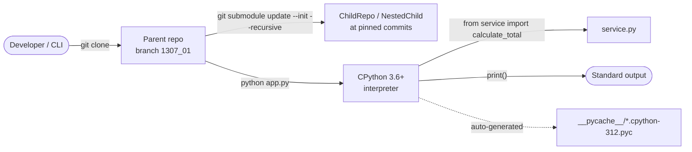
```mermaid
flowchart LR
    Dev(["Developer / CLI"]) -->|"git clone"| Repo["Parent repo<br/>branch 1307_01"]
    Repo -->|"git submodule update --init --recursive"| Subs["ChildRepo / NestedChild<br/>at pinned commits"]
    Repo -->|"python app.py"| Py["CPython 3.6+<br/>interpreter"]
    Py -->|"from service import calculate_total"| Svc["service.py"]
    Py -->|"print()"| Out(["Standard output"])
    Py -.->|"auto-generated"| Pyc["__pycache__/*.cpython-312.pyc"]
```

#### Security Implications

- **No stored secrets:** the submodule remotes are public HTTPS GitHub URLs, and no credentials, tokens, or secrets are committed anywhere in the repository.
- **Reproducibility vs. patching:** commit pinning makes submodule composition deterministic and reproducible, but a pinned commit does not automatically receive upstream fixes and must be advanced deliberately.
- **Trust boundary:** running the composed tiers executes code fetched from the configured GitHub remotes, so the integrity of those remotes and pinned commits is the primary supply-chain trust boundary for the build/composition step.
- **No pipeline hardening surface:** with no CI/CD, containers, or IaC, there are no pipeline credentials, registry tokens, or deployment infrastructure to secure.

## 3.7 References

The following repository files, folders, cross-referenced specification sections, and verification commands were examined as the evidence base for this Technology Stack section. No external/web sources were required.

**Files**

- `app.py` (repository root) — Established Python as the language, the f-string (`print(f"Total: {total}")`) that sets the 3.6+ interpreter floor, the sole local import `from service import calculate_total`, and the `print()`/`len()` built-in usage; confirms no framework or third-party import.
- `service.py` (repository root) — Confirmed a pure computation library (`calculate_total`, `calculate_average`) with **no** import statements, no annotations, and no I/O.
- `.gitmodules` (repository root) — Declared the `ChildRepo` submodule and its public HTTPS GitHub remote.
- `ChildRepo/.gitmodules` — Declared the `NestedChild` submodule and its public HTTPS GitHub remote.
- `.blitzyignore` (root, `ChildRepo/`, `ChildRepo/NestedChild/`) — Each contains only `*.csv`; honored by excluding all CSV files from inspection and documentation.
- `__pycache__/service.cpython-312.pyc` (present at each tier) — Bytecode cache confirming CPython 3.12 execution and that the only build artifact is auto-generated interpreter bytecode.
- `ChildRepo/app.py`, `ChildRepo/service.py` — Second-tier Python pair (byte-identical to root), confirming single-language uniformity across tiers.
- `ChildRepo/NestedChild/app.py`, `ChildRepo/NestedChild/service.py` — Third-tier sources; `service.py` duplicates `app.py` (does not define `calculate_total`), the basis for the non-functional deployment target at that tier.

**Folders**

- `` (repository root) — Top-level structure: `app.py`, `service.py`, `README.md`, `.gitmodules`, and the `ChildRepo/` submodule; confirmed the absence of any manifest, lockfile, CI, IaC, or container file.
- `ChildRepo/` — Second submodule tier repeating the two-file Python pattern.
- `ChildRepo/NestedChild/` — Terminal submodule tier (contains no `.gitmodules`).

**Cross-referenced specification sections**

- `1.2 System Overview` — Corroborated "plain, procedural, synchronous CPython… no third-party libraries — only the built-in `print` and a local module import," and the Python 3.6+/verified-3.12.3 characterization.
- `2.4 Implementation Considerations` — Corroborated the submodule integration requirements (Git submodule support, network access to public GitHub remotes) and that "no credentials or secrets are stored."

**Verification commands (evidence, not files)**

- `find` enumeration of files/extensions and targeted manifest checks — Established that Python is the only language and that no dependency/build/CI/container/IaC files exist.
- `grep` of all `import` statements across every `.py` — Established that the only imported module is the local `service` (zero third-party imports).
- `git submodule status --recursive` — Established the pinned commits: `ChildRepo` at `a1c629449c281ae95d86c1672c3890541d683654` (branch `1307_01`) and `NestedChild` at `915ff60a2ef846af380b0b2288b0ab09676ae63c`.
- `python3 --version` and direct execution — Confirmed the verified runtime CPython 3.12.3.

# 4. Process Flowchart

## 4.1 System Workflows

The `600K_ParentRepo` system is a minimal, synchronous, single-process CPython console application; it exposes no web server, network listener, scheduler, or message consumer. Its "workflows" are therefore short-lived, deterministic command-line executions rather than long-running service interactions. This section models every process the repository actually performs — grounded in the source of `app.py` and `service.py` and in behavior verified by direct execution on Python 3.12.3 — using Mermaid.js flowcharts and sequence diagrams. The workflows map directly to the features catalogued in Section 2.1: the console application workflow (F-003), the two calculation primitives (F-001 total aggregation, F-002 average calculation), and the build-time nested Git submodule composition (F-004).

Because the system has a single actor (a developer/integrator at the command line) and no runtime external systems, swim lanes are drawn around the logical boundaries that actually exist: the invoking **Actor**, the `app.py` entry point, the `service.py` calculation library, and the operating-system **standard-output** stream. No workflow crosses a network, database, cache, queue, or authentication boundary because none exists in the repository (Section 2.3.2).

### 4.1.1 High-Level System Workflow

The high-level workflow below traces a single successful run of `python app.py` from invocation to exit, spanning the actor and three system boundaries. The only branch on the primary path is the `if __name__ == "__main__":` guard in `app.py`, which determines whether `main()` executes at all.

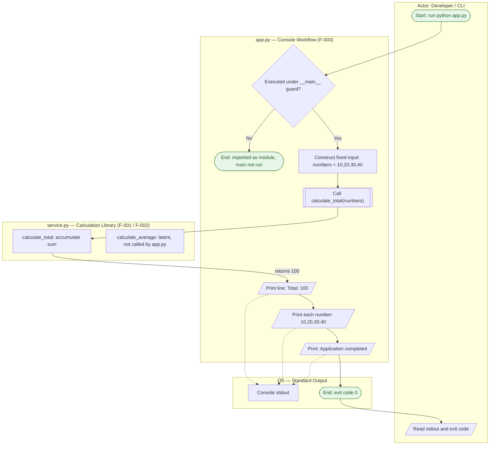
```mermaid
flowchart TD
    subgraph Actor["Actor: Developer / CLI"]
        Start(["Start: run python app.py"])
        Observe[/"Read stdout and exit code"/]
    end

    subgraph AppLane["app.py — Console Workflow (F-003)"]
        Guard{"Executed under __main__ guard?"}
        NotMain(["End: imported as module, main not run"])
        Build["Construct fixed input: numbers = 10,20,30,40"]
        CallTotal[["Call calculate_total(numbers)"]]
        PrintTotal[/"Print line: Total: 100"/]
        PrintNums[/"Print each number: 10,20,30,40"/]
        PrintDone[/"Print: Application completed"/]
    end

    subgraph LibLane["service.py — Calculation Library (F-001 / F-002)"]
        Sum["calculate_total: accumulate sum"]
        Avg["calculate_average: latent, not called by app.py"]
    end

    subgraph OSLane["OS — Standard Output"]
        Stdout["Console stdout"]
        ExitOK(["End: exit code 0"])
    end

    Start --> Guard
    Guard -->|No| NotMain
    Guard -->|Yes| Build
    Build --> CallTotal
    CallTotal --> Sum
    Sum -->|returns 100| PrintTotal
    PrintTotal --> PrintNums
    PrintNums --> PrintDone
    PrintDone --> ExitOK
    PrintTotal -.-> Stdout
    PrintNums -.-> Stdout
    PrintDone -.-> Stdout
    ExitOK --> Observe

    classDef term fill:#e8f5e9,stroke:#2e7d32,color:#1b5e20;
    class Start,NotMain,ExitOK term;
```

- **System boundaries & swim lanes:** the run is partitioned into four lanes — the Actor (developer/CLI), the `app.py` console workflow (F-003), the `service.py` calculation library (F-001/F-002), and the OS standard-output sink. All lanes execute inside one synchronous CPython process; the `app.py` ↔ `service.py` boundary is a logical module boundary resolved by same-directory import, not a process or network boundary.
- **User touchpoints:** exactly two — the developer invokes `python app.py`, and the developer reads the six lines of standard output plus the process exit code. There is no interactive prompt, CLI argument, stdin, environment variable, or file read; the input is hard-coded (F-003-RQ-001).
- **Decision points:** the sole decision is the `__main__` guard; when `app.py` is imported rather than run directly, `main()` is skipped and no output is produced (verified — F-003-RQ-004). `calculate_average` (F-002) appears in the library lane with no incoming edge because `app.py` never calls it (Section 2.3.1).
- **Timing / SLA considerations:** the repository defines no SLA, KPI, latency budget, or throughput target (Section 1.2.3). The run is deterministic and effectively constant-time for the fixed four-element input, completing in a single synchronous pass with an output volume of exactly six lines and exit code 0 (Sections 2.2.3, 2.4.3).

### 4.1.2 Core Business Process Flows

There are three core computational/application processes. Each is a pure, synchronous, in-memory routine; none performs I/O except the console workflow's `print` calls. The flows below detail start/end points, process steps, decision diamonds, and terminal states for each.

**F-001 — Numeric Total Aggregation.** `service.calculate_total(numbers)` is the critical shared primitive (Section 2.3.4) consumed by both F-002 and F-003. It initializes an accumulator to `0` and performs a single-pass augmented-addition loop in source order.

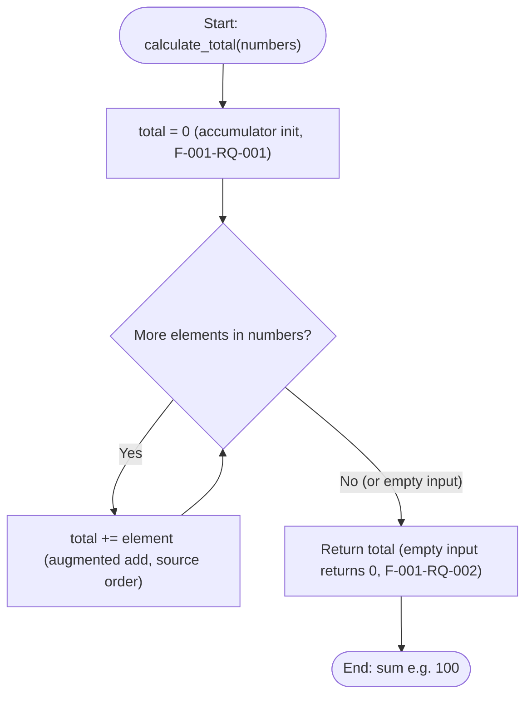
```mermaid
flowchart TD
    A(["Start: calculate_total(numbers)"]) --> B["total = 0 (accumulator init, F-001-RQ-001)"]
    B --> C{"More elements in numbers?"}
    C -->|Yes| D["total += element (augmented add, source order)"]
    D --> C
    C -->|"No (or empty input)"| E["Return total (empty input returns 0, F-001-RQ-002)"]
    E --> F(["End: sum e.g. 100"])
```

The loop-termination diamond is the only control decision: while elements remain, add the current element via augmented assignment and continue; when the iterable is exhausted, return the accumulated `total` (business rule, F-001-RQ-001). An empty iterable never enters the loop body and returns `0` (F-001-RQ-002; verified). There is no validation branch — a non-iterable or non-numeric element raises an unhandled exception at this step (see Section 4.3.2).

**F-002 — Numeric Average Calculation.** `service.calculate_average(numbers)` is implemented but latent — no shipped caller invokes it (Sections 2.1.3, 2.3.1). Its distinguishing control feature is the empty-input guard that precedes division.

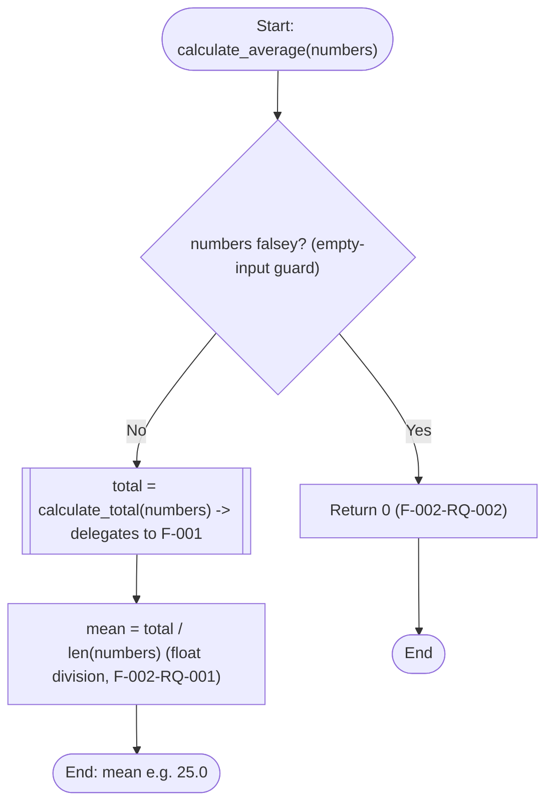
```mermaid
flowchart TD
    A(["Start: calculate_average(numbers)"]) --> B{"numbers falsey? (empty-input guard)"}
    B -->|Yes| C["Return 0 (F-002-RQ-002)"]
    B -->|No| D[["total = calculate_total(numbers) -> delegates to F-001"]]
    D --> E["mean = total / len(numbers) (float division, F-002-RQ-001)"]
    E --> F(["End: mean e.g. 25.0"])
    C --> G(["End"])
```

The first and only decision diamond evaluates `if not numbers:`; a falsey (e.g., empty) input returns `0` immediately, preventing division-by-zero (business rule, F-002-RQ-002; verified). Otherwise the function delegates to F-001 for the sum and divides by `len(numbers)`, returning the float mean (`25.0` for the reference list; F-002-RQ-001, verified). A non-sized input such as a generator raises `TypeError` at `len()` (Section 4.3.2).

**F-003 — Console Application Workflow.** `app.py`'s `main()` orchestrates the end-to-end user journey: construct the fixed list, delegate summation to `service.calculate_total`, and emit results in a fixed order (total → each number → completion message). The print loop is a second decision diamond.

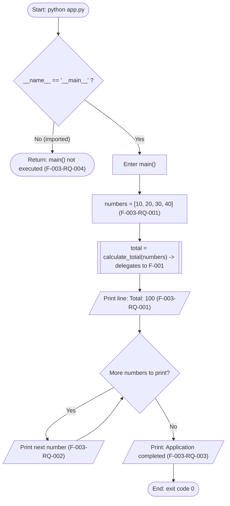
```mermaid
flowchart TD
    A(["Start: python app.py"]) --> B{"__name__ == '__main__' ?"}
    B -->|"No (imported)"| Z1(["Return: main() not executed (F-003-RQ-004)"])
    B -->|Yes| C["Enter main()"]
    C --> D["numbers = [10, 20, 30, 40] (F-003-RQ-001)"]
    D --> E[["total = calculate_total(numbers) -> delegates to F-001"]]
    E --> F[/"Print line: Total: 100 (F-003-RQ-001)"/]
    F --> G{"More numbers to print?"}
    G -->|Yes| H[/"Print next number (F-003-RQ-002)"/]
    H --> G
    G -->|No| I[/"Print: Application completed (F-003-RQ-003)"/]
    I --> J(["End: exit code 0"])
```

The process starts at `python app.py` and passes the `__main__` guard (F-003-RQ-004). It builds the literal `[10, 20, 30, 40]` (F-003-RQ-001), delegates to F-001 for the sum, prints `Total: 100`, iterates the list printing each element on its own line in source order (F-003-RQ-002), prints `Application completed`, and exits `0` (F-003-RQ-003). The only error state on this path arises when the co-located `service` module cannot supply `calculate_total` — the `NestedChild`-tier defect detailed in Section 4.3.2; at the root and `ChildRepo` tiers this path is verified to complete successfully.

### 4.1.3 Integration Workflows

The system has exactly two integration points (Section 2.3.2), operating on two different timelines: a runtime intra-process module import, and a build/version-control-time Git submodule composition. No other data flow between systems exists.

**Runtime data flow — module import resolution (F-003 → F-001).** The only runtime "integration" is the local import `from service import calculate_total`, resolved from the same directory as `app.py`. The sequence below shows control and data flow across the interpreter, the two modules, and stdout for a successful run.

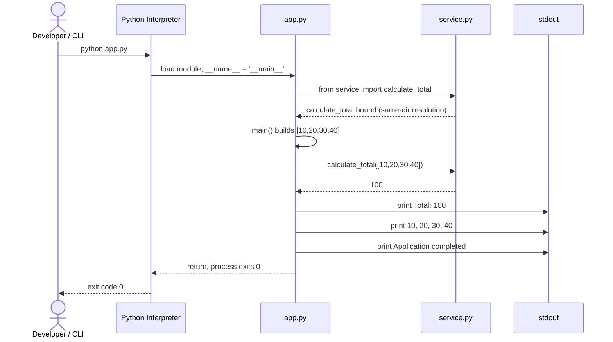
```mermaid
sequenceDiagram
    actor Dev as Developer / CLI
    participant Py as Python Interpreter
    participant App as app.py
    participant Svc as service.py
    participant Out as stdout
    Dev->>Py: python app.py
    Py->>App: load module, __name__ = '__main__'
    App->>Svc: from service import calculate_total
    Svc-->>App: calculate_total bound (same-dir resolution)
    App->>App: main() builds [10,20,30,40]
    App->>Svc: calculate_total([10,20,30,40])
    Svc-->>App: 100
    App->>Out: print Total: 100
    App->>Out: print 10, 20, 30, 40
    App->>Out: print Application completed
    App-->>Py: return, process exits 0
    Py-->>Dev: exit code 0
```

Data flow is entirely in-memory: the hard-coded list flows from `app.py` into `calculate_total`, the integer `100` flows back, and six text lines flow to stdout. No serialization, network hop, or persistence occurs. This mirrors the runtime component relationship documented in Section 1.2.2.

**Build-time data flow — nested Git submodule composition (F-004).** The repository's defining structural integration is the three-tier submodule chain declared in `.gitmodules` (Section 2.1.5). It is resolved by Git tooling at clone/checkout time and has no runtime effect. The sequence below shows how an integrator materializes all three tiers.

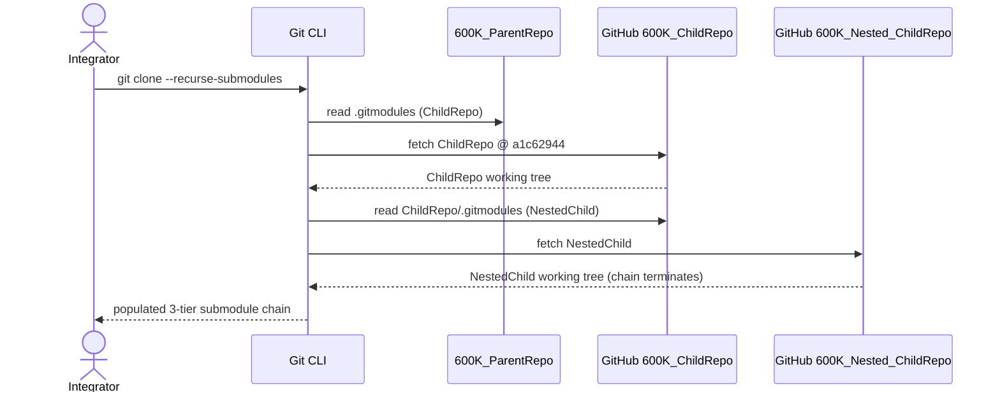
```mermaid
sequenceDiagram
    actor Int as Integrator
    participant Git as Git CLI
    participant Parent as 600K_ParentRepo
    participant GH1 as GitHub 600K_ChildRepo
    participant GH2 as GitHub 600K_Nested_ChildRepo
    Int->>Git: git clone --recurse-submodules
    Git->>Parent: read .gitmodules (ChildRepo)
    Git->>GH1: fetch ChildRepo @ a1c62944
    GH1-->>Git: ChildRepo working tree
    Git->>GH1: read ChildRepo/.gitmodules (NestedChild)
    Git->>GH2: fetch NestedChild
    GH2-->>Git: NestedChild working tree (chain terminates)
    Git-->>Int: populated 3-tier submodule chain
```

`git clone --recurse-submodules` reads the root `.gitmodules` (declaring `ChildRepo` at `https://github.com/lakshya-blitzy/600K_ChildRepo.git`, pinned at commit `a1c629449c281ae95d86c1672c3890541d683654`), fetches and checks out `ChildRepo`, then reads `ChildRepo/.gitmodules` (declaring `NestedChild`) and fetches it; the chain terminates at `NestedChild`, which has no `.gitmodules` (F-004-RQ-001/002/003). The cost is network-bound and incurred at build time only; no SLA is defined (Section 2.4.4).

**Absent integration workflows.** API interactions, event-processing flows, message-queue/broker consumption, streaming pipelines, and multi-system batch-processing sequences are all absent from the repository — there is no network client or server, no scheduler, no queue, and no external service (Sections 2.3.2, 3.4). The single CLI execution is itself a one-shot, fixed-input batch run: it processes the hard-coded four-element list once and exits, rather than iterating over external batches or records.

## 4.2 Flowchart Requirements and Validation Rules

This subsection defines the notation used by every diagram in Section 4 and consolidates the validation rules that govern each workflow step. Because the repository implements no input validation, authorization, or compliance controls (Sections 2.2, 2.4), the catalog below distinguishes clearly between the business rules that **are** enforced in code and the control categories that are **absent**.

### 4.2.1 Workflow Element Standards

Every flowchart and sequence diagram in Section 4 follows a consistent visual grammar so that start/end points, process steps, decision diamonds, system boundaries, user touchpoints, and error states are unambiguous.

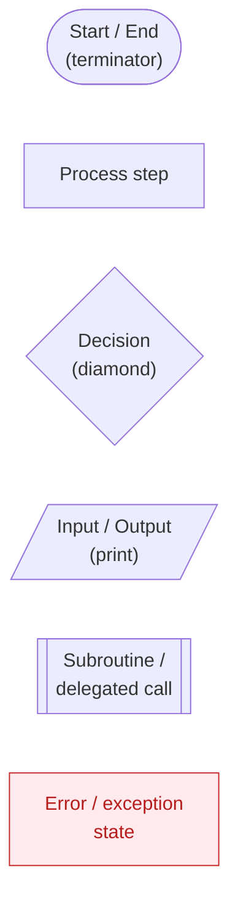
```mermaid
flowchart LR
    S(["Start / End<br/>(terminator)"])
    P["Process step"]
    D{"Decision<br/>(diamond)"}
    IO[/"Input / Output<br/>(print)"/]
    Sub[["Subroutine /<br/>delegated call"]]
    Err["Error / exception<br/>state"]

    classDef err fill:#ffebee,stroke:#c62828,color:#b71c1c;
    class Err err;
```

| Element | Notation | Represents | Example in this section |
| --- | --- | --- | --- |
| Start / End | `([ ... ])` stadium | A workflow entry or terminal state (including exit code) | `Start: python app.py`; `End: exit code 0` (4.1.1) |
| Process step | `[ ... ]` rectangle | A synchronous, in-memory operation | `total = 0` (F-001, 4.1.2) |
| Decision | `{ ... }` diamond | A branch/predicate evaluated in code | `__name__ == '__main__' ?` (4.1.2) |
| Subroutine call | `[[ ... ]]` | A delegated call to another function/feature | `Call calculate_total(numbers)` (4.1.1) |
| Input / Output | `[/ ... /]` parallelogram | A `print()` to standard output (or a read of it) | `Print: Application completed` (4.1.2) |
| Error / exception state | red-filled rectangle | An unhandled-exception path ending in exit code 1 | see Section 4.3.2 |

Additional conventions applied throughout Section 4:

- **System boundaries / swim lanes.** Flowchart `subgraph` blocks denote the logical lanes that exist in this system — the Actor (developer/CLI), the `app.py` entry point, the `service.py` library, and the OS standard-output stream; sequence-diagram participants play the same role. All lanes execute inside one CPython process, so the only cross-lane boundary crossings are the local module import and the `print` calls.
- **User touchpoints.** Rendered as the Actor lane and its two interactions: invoke `python app.py`, and read the resulting stdout and exit code.
- **Timing / SLA notation.** The repository defines no SLA, latency, or throughput target (Section 1.2.3), so timing is annotated qualitatively as deterministic, single-pass, and synchronous. Where a real cost exists but sits off the runtime path (the submodule fetch), it is labeled build-time / network-bound (Section 2.4.4).

### 4.2.2 Validation Rules & Checkpoints

The prompt's four validation categories map onto this system as follows: **business rules** are the small set of invariants enforced in `service.py` and `app.py`; **data validation**, **authorization checkpoints**, and **regulatory compliance checks** are all absent by design (Sections 2.2, 2.4). The table maps each workflow step to its enforced business rule, its data validation (if any), and the observed behavior on invalid input.

| Workflow step | Business rule enforced (in code) | Data validation | Behavior on invalid input |
| --- | --- | --- | --- |
| F-001 accumulator init | `total` initialized to `0` before the loop (F-001-RQ-001) | None — no type/numeric check | Non-iterable argument raises `TypeError` (unhandled) |
| F-001 accumulate | Elements added via `+=` in source order | None | Non-numeric element raises `TypeError` at `total += number` |
| F-001 empty input | Empty iterable returns `0` (F-001-RQ-002) | None (loop body never runs) | n/a |
| F-002 empty-input guard | `if not numbers: return 0` precedes division (F-002-RQ-002) | Falsey guard only | Non-sized input raises `TypeError` at `len()` |
| F-002 mean | `calculate_total(numbers) / len(numbers)` (F-002-RQ-001) | None | as above |
| F-003 entry guard | `main()` runs only under `__main__` (F-003-RQ-004) | None | Import does not execute `main()` (by design) |
| F-003 import | `calculate_total` imported from co-located `service` | None | Missing/invalid `service` raises `ImportError` (NestedChild tier) |
| F-003 output order | Order is total → each number → completion (F-003-RQ-002/003) | None | n/a |
| F-004 submodule decl | Each `.gitmodules` entry has `path` + `url`, `path` matches dir (F-004-RQ-001) | Git parses `.gitmodules` | Git reports a submodule error |
| F-004 pin / terminate | Child pinned to a commit; chain ends where no `.gitmodules` exists (F-004-RQ-002/003) | Git index SHA | n/a |

**Authorization checkpoints — none.** The system performs no authentication or authorization at any step: there is no user identity, session, token, role, or permission check anywhere in the repository (Sections 2.2, 3.4). All computation is pure and local; the console workflow reads no credentials and writes only to standard output.

**Regulatory compliance checks — none defined.** No personal, financial, health, or otherwise regulated data is processed; the sole input is the hard-coded integer list `[10, 20, 30, 40]`. No compliance gate, audit log, data-retention rule, or consent control exists (every feature's "Compliance Requirements" row in Section 2.2 reads *None defined*). The submodule remotes are public HTTPS GitHub URLs with no stored credentials or secrets (Section 2.4.4).

**Data-validation summary.** The single defensive branch in the entire codebase is `calculate_average`'s empty-input guard (F-002-RQ-002). Every other routine assumes well-formed input; malformed input propagates an unhandled `TypeError` (or `ImportError` at the `NestedChild` tier) and terminates the process with exit code 1 — detailed in Section 4.3.2.

## 4.3 Technical Implementation Flows

This subsection documents how the system manages state and errors — two areas where the repository is deliberately spartan. It contains no persistence layer, cache, transaction manager, or error-handling framework: state is transient and in-memory, and error handling is entirely Python's default behavior (Sections 1.2, 2.4).

### 4.3.1 State Management

The only mutable application state within a run is the accumulator `total` in `calculate_total` and the function-local `numbers` list in `main()`. Both live only for the duration of the process. The diagram traces the accumulator's transient state for the reference input and shows that no persistence, cache, or transaction boundary is ever crossed.

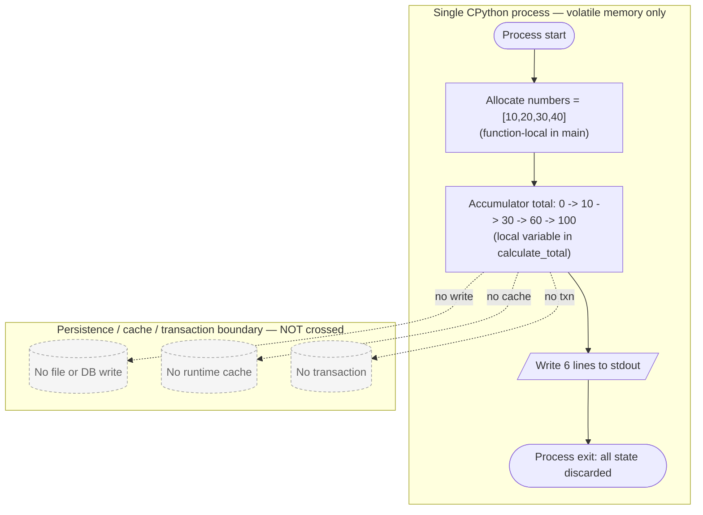
```mermaid
flowchart TD
    subgraph Process["Single CPython process — volatile memory only"]
        Startp(["Process start"])
        Alloc["Allocate numbers = [10,20,30,40]<br/>(function-local in main)"]
        Acc["Accumulator total: 0 -> 10 -> 30 -> 60 -> 100<br/>(local variable in calculate_total)"]
        Emit[/"Write 6 lines to stdout"/]
        Endp(["Process exit: all state discarded"])
    end

    subgraph Boundary["Persistence / cache / transaction boundary — NOT crossed"]
        Disk[("No file or DB write")]
        Cache[("No runtime cache")]
        Txn[("No transaction")]
    end

    Startp --> Alloc
    Alloc --> Acc
    Acc --> Emit
    Emit --> Endp
    Acc -. no write .-> Disk
    Acc -. no cache .-> Cache
    Acc -. no txn .-> Txn

    classDef none fill:#f5f5f5,stroke:#9e9e9e,color:#616161,stroke-dasharray: 4 3;
    class Disk,Cache,Txn none;
```

- **State transitions.** `total` evolves `0 → 10 → 30 → 60 → 100` across the four loop iterations, then is returned and discarded (F-001). This transient evolution is modeled as a state machine in Section 4.4.
- **Data persistence points — none.** No file, database, or external store is written or read at runtime (Section 3.5). The only on-disk artifact the system leaves behind is `__pycache__/service.cpython-312.pyc` — a CPython bytecode cache, i.e., an interpreter/build artifact rather than application data. All application data is volatile and lost at process exit.
- **Caching requirements — none.** The system performs no memoization or result caching; each run recomputes from the hard-coded input (Section 3.5). The `.pyc` bytecode cache is an interpreter optimization, not an application cache.
- **Transaction boundaries — none.** With no database, there are no ACID transactions. The effective unit of work is the single process invocation, which is all-or-nothing only in a trivial sense: it either runs to completion (exit 0) or aborts on an unhandled exception (exit 1), with no partial state to roll back because nothing is persisted.

### 4.3.2 Error Handling

The repository contains no `try`/`except`, no error-handling framework, no logging, and no retry or fallback machinery anywhere (Sections 1.2.1, 2.4). Error handling is therefore entirely Python's default: an uncaught exception unwinds the stack, prints a traceback to standard error, and terminates the process with exit code 1. The flowchart below shows the failure modes verified to exist and their common default-handling path.

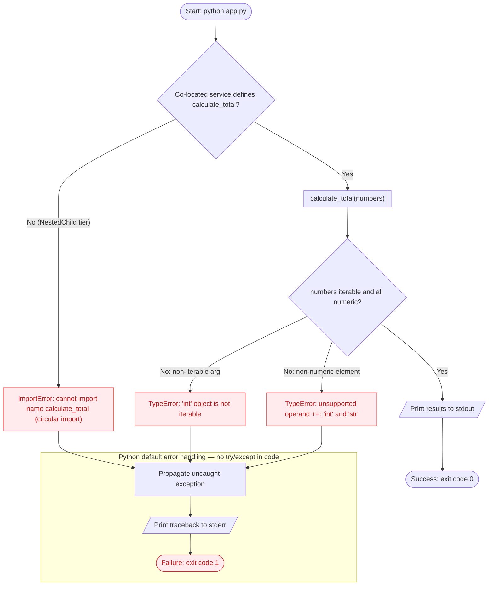
```mermaid
flowchart TD
    A(["Start: python app.py"])
    B{"Co-located service defines calculate_total?"}
    E1["ImportError: cannot import name calculate_total (circular import)"]
    C[["calculate_total(numbers)"]]
    D{"numbers iterable and all numeric?"}
    E2["TypeError: 'int' object is not iterable"]
    E3["TypeError: unsupported operand +=: 'int' and 'str'"]
    F[/"Print results to stdout"/]
    G(["Success: exit code 0"])

    subgraph Default["Python default error handling — no try/except in code"]
        H["Propagate uncaught exception"]
        I[/"Print traceback to stderr"/]
        J(["Failure: exit code 1"])
    end

    A --> B
    B -->|"No (NestedChild tier)"| E1
    B -->|Yes| C
    C --> D
    D -->|"No: non-iterable arg"| E2
    D -->|"No: non-numeric element"| E3
    D -->|Yes| F
    F --> G
    E1 --> H
    E2 --> H
    E3 --> H
    H --> I
    I --> J

    classDef err fill:#ffebee,stroke:#c62828,color:#b71c1c;
    class E1,E2,E3,J err;
```

The failure triggers below were each reproduced directly on Python 3.12.3:

| Trigger | Exception (verified) | Origin | Result |
| --- | --- | --- | --- |
| Run `app.py` at the NestedChild tier | `ImportError: cannot import name 'calculate_total' ... (circular import)` | `NestedChild/service.py` duplicates `app.py` and re-imports from itself | Traceback to stderr; exit 1 |
| Non-iterable argument to `calculate_total` | `TypeError: 'int' object is not iterable` | `for number in numbers:` | Traceback; exit 1 |
| Non-numeric element | `TypeError: unsupported operand type(s) for +=: 'int' and 'str'` | `total += number` | Traceback; exit 1 |
| Non-sized input to `calculate_average` | `TypeError: object of type 'generator' has no len()` | `len(numbers)` | Traceback; exit 1 |

Mapping the prompt's four error-handling concerns onto the observed system:

- **Retry mechanisms — none.** No operation is retried; there is no loop, backoff, timeout, or attempt counter around any call.
- **Fallback processes — one, narrow.** The only fallback-like behavior is `calculate_average`'s empty-input guard, which substitutes a default return of `0` for empty/falsey input to avoid division-by-zero (F-002-RQ-002). No other routine has a fallback, and the shipped `app.py` path has none.
- **Error notification flows — default only.** Notification is limited to the interpreter writing the traceback to standard error and setting a non-zero exit code. There is no logging, metrics, alerting, email, or external error-reporting integration (Section 3.4).
- **Recovery procedures — manual.** No automated recovery exists. For the NestedChild defect, recovery is structural: replacing `NestedChild/service.py` with the real `service` module (defining `calculate_total`/`calculate_average`) restores the workflow (Section 2.4.3). For malformed-input errors, the caller must supply a valid iterable of numeric elements.

## 4.4 State Transition Diagrams

This subsection expresses the system's behavior as explicit finite-state machines. Because the application is a short-lived batch process with no runtime persistence, there are only two application-level state machines — the process lifecycle and the transient accumulator — plus the Git-managed lifecycle of the declared submodule (F-004), which is the only state that persists between runs (in the Git index and working tree). Each machine below is grounded in behavior verified by execution on Python 3.12.3.

### 4.4.1 Console Application Process Lifecycle

The console workflow (F-003) transitions through a small set of states from invocation to exit. The import of `calculate_total` occurs at module-load time, *before* the `__main__` guard is evaluated; this is why the `NestedChild`-tier `ImportError` is modeled as a transition out of the `Loading` state (Section 4.3.2).

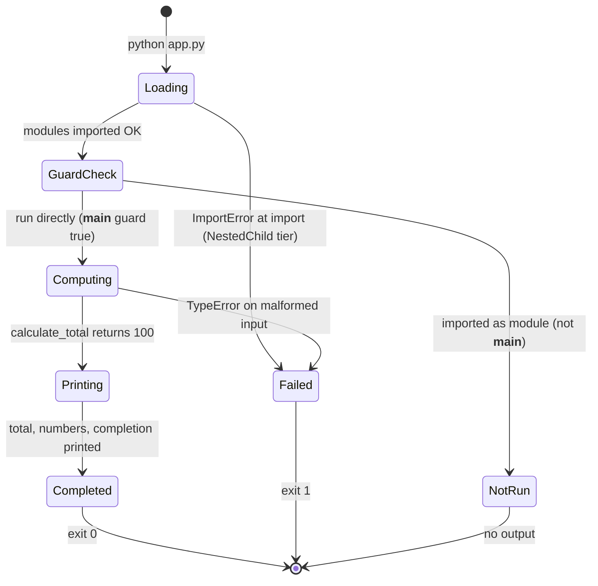
```mermaid
stateDiagram-v2
    [*] --> Loading: python app.py
    Loading --> Failed: ImportError at import (NestedChild tier)
    Loading --> GuardCheck: modules imported OK
    GuardCheck --> NotRun: imported as module (not __main__)
    GuardCheck --> Computing: run directly (__main__ guard true)
    Computing --> Printing: calculate_total returns 100
    Computing --> Failed: TypeError on malformed input
    Printing --> Completed: total, numbers, completion printed
    Completed --> [*]: exit 0
    Failed --> [*]: exit 1
    NotRun --> [*]: no output
```

The states are: **Loading** (the interpreter imports `app.py` and its sibling `service` dependency); **GuardCheck** (evaluate `__name__ == "__main__"`); **Computing** (build the list and call `calculate_total`); **Printing** (emit the total, each number, and the completion message); and the terminal states **Completed** (exit 0), **Failed** (exit 1), and **NotRun** (module imported, `main()` not executed — F-003-RQ-004). Verified transitions: the root and `ChildRepo` tiers reach `Completed`; the `NestedChild` tier reaches `Failed` from `Loading`; importing `app` reaches `NotRun`.

### 4.4.2 Accumulator State Transitions

Within `calculate_total` (F-001), the accumulator `total` is the system's only evolving runtime state. For the reference input `[10, 20, 30, 40]` it advances monotonically and then terminates by returning; an empty input short-circuits directly to the returned state with value `0` (F-001-RQ-002).

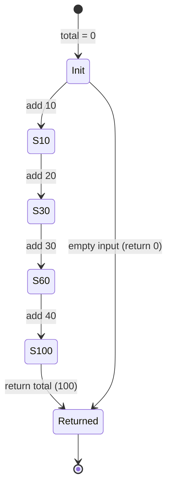
```mermaid
stateDiagram-v2
    [*] --> Init: total = 0
    Init --> S10: add 10
    S10 --> S30: add 20
    S30 --> S60: add 30
    S60 --> S100: add 40
    S100 --> Returned: return total (100)
    Init --> Returned: empty input (return 0)
    Returned --> [*]
```

Each transition is one loop iteration performing `total += number` in source order (business rule, F-001-RQ-001). The machine has a single accepting transition — `return total` — reached either after the final element (value `100`) or immediately for empty input (value `0`). This is the state-machine view of the process shown procedurally in Section 4.1.2.

### 4.4.3 Submodule Composition Lifecycle

Feature F-004 is the only state that persists across runs — not in application memory but in the Git index and working tree. The diagram models the standard Git submodule lifecycle as applied to this repository's declarations: the root `.gitmodules` declares `ChildRepo` (path + URL), pinned at commit `a1c629449c281ae95d86c1672c3890541d683654` (F-004-RQ-001/002).

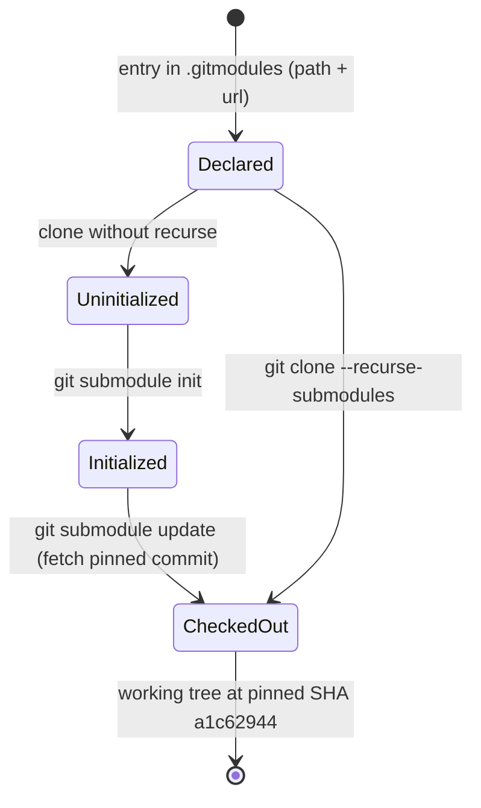
```mermaid
stateDiagram-v2
    [*] --> Declared: entry in .gitmodules (path + url)
    Declared --> Uninitialized: clone without recurse
    Uninitialized --> Initialized: git submodule init
    Initialized --> CheckedOut: git submodule update (fetch pinned commit)
    Declared --> CheckedOut: git clone --recurse-submodules
    CheckedOut --> [*]: working tree at pinned SHA a1c62944
```

A plain clone leaves the submodule **Declared** but **Uninitialized**; `git submodule init` followed by `update` (or a single `git clone --recurse-submodules`) fetches the pinned commit and **checks out** the working tree. The same lifecycle applies one tier deeper for `ChildRepo`'s `NestedChild` declaration; the chain terminates at `NestedChild`, which declares no further submodule (F-004-RQ-003). This lifecycle is build/version-control-time only and carries no runtime state (Section 2.4.4).

## 4.5 References

The diagrams and narrative in this section were derived exclusively from the following repository evidence and previously authored specification sections. Per the repository `.blitzyignore` rules (each containing `*.csv`), all CSV files were excluded from inspection and are not referenced here.

**Repository files (evidence):**

- `app.py` — Root console entry point; established the F-003 workflow, the `if __name__ == "__main__":` guard, the fixed input `[10, 20, 30, 40]`, the print order (total → each number → completion), and the `from service import calculate_total` runtime integration.
- `service.py` — Root calculation library; established F-001 `calculate_total` (accumulator initialized to `0`, augmented-add loop, empty→`0`) and F-002 `calculate_average` (empty-input guard, `total/len` mean).
- `.gitmodules` — Root submodule descriptor; established the F-004 declaration of `ChildRepo` (path + GitHub URL).
- `README.md` — Single-line heading (`# app.py`); confirmed the absence of any business/process documentation.
- `ChildRepo/app.py`, `ChildRepo/service.py` — Byte-identical middle-tier copies; verified that the workflow also completes successfully (exit 0) at this tier.
- `ChildRepo/.gitmodules` — Declares the `NestedChild` submodule (F-004), extending the chain.
- `ChildRepo/README.md` — Single-line heading (`# 600K_ChildRepo`).
- `ChildRepo/NestedChild/app.py` — Standard entry point at the deepest tier.
- `ChildRepo/NestedChild/service.py` — Anomalous duplicate of `app.py`; established the `ImportError` (circular import) failure path documented in Sections 4.3.2 and 4.4.1.
- `ChildRepo/NestedChild/README.md` — Single-line heading (`# 600K_Nested_ChildRepo`).

**Repository folders (evidence):**

- `` (repository root) — Top-level structure; confirmed there are no CI/CD, configuration, test, or manifest files.
- `ChildRepo/` — Middle submodule tier; contains the repeated two-file pattern and the `NestedChild` declaration.
- `ChildRepo/NestedChild/` — Deepest submodule tier and chain terminus (no `.gitmodules`).
- `__pycache__/` — CPython 3.12 bytecode cache (`service.cpython-312.pyc`); the only on-disk artifact, corroborating the interpreter version and that no application data is persisted (Section 4.3.1).

**Cross-referenced specification sections:**

- Section 1.2 System Overview — High-level component relationships, deterministic behavior, and the no-SLA/no-KPI basis.
- Section 2.1 Feature Catalog — Feature identifiers F-001 through F-004 and their status/priority.
- Section 2.2 Functional Requirements — Requirement identifiers (F-00x-RQ-00y) and per-feature validation rules.
- Section 2.3 Feature Relationships — Runtime dependency edges and the two integration points.
- Section 2.4 Implementation Considerations — State/error constraints, the NestedChild recovery action, and submodule commit pinning.
- Section 3.4 Third-Party Services — Corroborated the absence of external services, APIs, and error-notification integrations.
- Section 3.5 Databases & Storage — Corroborated the absence of persistence and caching.

**Verification:** Runtime behavior underpinning every diagram (successful runs at the root and `ChildRepo` tiers, the `NestedChild` `ImportError`, the `__main__`-guard behavior, and the `TypeError` failure modes) was reproduced by direct execution on **Python 3.12.3**. No web sources were used for this section.

# 5. System Architecture

## 5.1 High-Level Architecture

This section describes the architecture exactly as it exists in the repository, grounded in the observed source files (`app.py`, `service.py`, `.gitmodules`) and in behavior verified by direct execution on Python 3.12.3. The system is intentionally minimal, so the architecture is best understood along **two orthogonal dimensions**: a **runtime execution architecture** (what runs when the program is invoked) and a **source-composition architecture** (how the source is assembled across repositories via Git submodules). These dimensions never intersect at runtime — each executable tier is fully self-contained.

### 5.1.1 System Overview

**Architecture style and rationale.** The runtime architecture is a **single-tier, single-process, monolithic command-line application** implemented as a two-module procedural program in plain CPython. A thin **entry-point/presentation module** (`app.py`) orchestrates the workflow and performs console I/O, delegating all computation to a **pure computation library** (`service.py`). Execution is synchronous, in-memory, and deterministic, with **zero third-party dependencies** — the only import anywhere in the codebase is the repository-local `from service import calculate_total`, and the only runtime facility used is the built-in `print`. This style is the natural fit for the system's demonstrable purpose: the repository ships no manifests, network clients, datastores, configuration, or concurrency primitives, so a dependency-free single process maximizes simplicity, portability, determinism, and minimal supply-chain surface.

The **source-composition architecture** is a **three-tier nested Git submodule chain**. The parent repository (`600K_ParentRepo`) embeds `600K_ChildRepo`, which in turn embeds `600K_Nested_ChildRepo`, each declared through a `.gitmodules` descriptor. This composition is resolved by Git tooling at clone/checkout time only; it introduces **no runtime coupling** between tiers, because each `app.py` imports only its own sibling `service` module.

**Key architectural principles and patterns (as observed):**

- **Separation of concerns** — orchestration and I/O (`app.py`) are cleanly separated from stateless computation (`service.py`).
- **Thin two-layer decomposition** — a presentation/orchestration layer over a computation layer; there is no data-access, integration, or infrastructure layer because none is needed.
- **Pure, stateless functions** — `calculate_total` and `calculate_average` have no imports, no shared state, and no side effects; output depends solely on the argument.
- **Unidirectional dependency** — `app.py → service.py` is one-way; `service.py` depends on nothing, keeping the computation core reusable and side-effect-free.
- **Convention over configuration** — the `if __name__ == "__main__"` guard and same-directory module resolution replace any configuration file; there are no environment variables or CLI arguments.
- **Composition via nested submodules** — code is reused across repositories by embedding rather than packaging/publishing.
- **Fail-fast with no interception layer** — apart from the single empty-input guard in `calculate_average`, there is no error handling; faults propagate to the interpreter's default handler.

**System boundaries.** The system spans exactly three boundaries: (1) an **OS process boundary** — a single CPython 3.12 interpreter process holding all volatile state; (2) a **console I/O boundary** — `stdout` for results and `stderr` for tracebacks; and (3) a **version-control boundary** — the public HTTPS GitHub remotes referenced by `.gitmodules`, touched only by Git tooling at composition time. There is deliberately **no network, database, service, or message-broker boundary**.

**Major interfaces.** The architecture exposes five interfaces: the **CLI invocation contract** (`python app.py`); the **intra-process module-import interface** (`from service import calculate_total`); the **function API** of the computation library (`calculate_total(numbers)` and `calculate_average(numbers)`); the **stdout text-stream output contract** (`Total: <total>`, each number on its own line, then `Application completed`); and the **submodule declaration interface** in `.gitmodules` (path + remote URL per child).

The two dimensions and the boundaries between them are shown below.

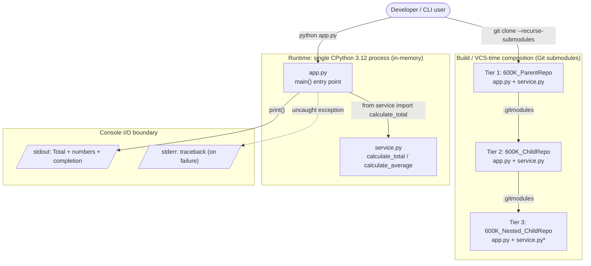
```mermaid
flowchart TB
    Dev(["Developer / CLI user"])

    subgraph VCS["Build / VCS-time composition (Git submodules)"]
        direction TB
        T1["Tier 1: 600K_ParentRepo<br/>app.py + service.py"]
        T2["Tier 2: 600K_ChildRepo<br/>app.py + service.py"]
        T3["Tier 3: 600K_Nested_ChildRepo<br/>app.py + service.py*"]
        T1 -->|".gitmodules"| T2
        T2 -->|".gitmodules"| T3
    end

    subgraph Proc["Runtime: single CPython 3.12 process (in-memory)"]
        direction LR
        Entry["app.py<br/>main() entry point"]
        Lib["service.py<br/>calculate_total / calculate_average"]
        Entry -->|"from service import calculate_total"| Lib
    end

    subgraph Console["Console I/O boundary"]
        direction TB
        Out[/"stdout: Total + numbers + completion"/]
        Err[/"stderr: traceback (on failure)"/]
    end

    Dev -->|"git clone --recurse-submodules"| T1
    Dev -->|"python app.py"| Entry
    Entry -->|"print()"| Out
    Entry -.->|"uncaught exception"| Err
```

*Tier 3's `service.py` is a misplaced duplicate of `app.py` and does not define the computation functions; the runtime consequence is documented in Sections 5.2 and 5.4.

**Architectural assumptions (explicit).** Correct operation assumes: (1) a Python 3.6+ interpreter (f-strings), verified on 3.12.3; (2) a valid, co-located `service.py` defining `calculate_total` beside `app.py` — satisfied at the root and `ChildRepo` tiers but **not** at `NestedChild`; (3) submodules initialized/updated so child working trees are populated; and (4) well-formed input (an iterable of numbers), since no validation exists.

### 5.1.2 Core Components

The runtime and composition components below recur identically at each working tier of the submodule chain. The first table captures responsibilities, dependencies, and integration points; the second captures the critical considerations for each (split to respect the four-column limit).

| Component | Primary Responsibility | Key Dependencies | Integration Points |
| --- | --- | --- | --- |
| `app.py` — Entry point | Build the list `[10,20,30,40]`, orchestrate the calculation, and emit console output under the `__main__` guard | `service.calculate_total` (local import); CPython runtime; `stdout` | Imports the `service` module; invoked via `python app.py`; writes results to `stdout` |
| `service.py` — Computation library | Provide the pure in-memory `calculate_total` and `calculate_average` functions | None (imports nothing) | Imported by `app.py` (`calculate_total`); `calculate_average` internally reuses `calculate_total` |
| `.gitmodules` — Composition descriptor | Declare the embedded child submodule and its remote URL | Git + submodule tooling; GitHub HTTPS remotes | Root → `ChildRepo`; `ChildRepo` → `NestedChild`; resolved at VCS/build time only |
| CPython 3.12 runtime | Launch the process, resolve imports at module-load time, and manage the bytecode cache | Host OS | Executes `app.py`; produces `__pycache__/*.pyc`; sets the process exit code |
| Console (`stdout`/`stderr`) | Act as the sink for program output and for tracebacks | OS standard streams | Receives `print()` output on `stdout`; receives tracebacks on `stderr` |

| Component | Critical Considerations |
| --- | --- |
| `app.py` — Entry point | Input is hard-coded (no arguments/config); no error handling; byte-identical copies at the root and `ChildRepo` tiers, both of which run correctly |
| `service.py` — Computation library | Pure and stateless but unannotated/untyped with **no input validation** (non-iterable or non-numeric input raises `TypeError`); `calculate_average` is latent — never invoked by `app.py` |
| `.gitmodules` — Composition descriptor | Pins `ChildRepo` at commit `a1c62944…`; `git submodule status --recursive` reports `NestedChild` uninitialized; the chain terminates at `NestedChild` (no `.gitmodules`) |
| CPython 3.12 runtime | f-strings require ≥ 3.6 (verified 3.12.3); the `NestedChild` tier fails during import with a circular-import `ImportError` |
| Console (`stdout`/`stderr`) | The only observability channel — no logging or metrics; a successful run emits six `stdout` lines and exits `0` |

The single-line `README.md` at each tier is a repository marker rather than an architectural component and carries no configuration.

### 5.1.3 Data Flow

**Primary data flow.** The system performs one synchronous, single-pass, in-memory flow per invocation. `main()` allocates the literal list `[10, 20, 30, 40]` and passes it to `calculate_total`, which iterates the elements in source order, accumulating them into a function-local `total` (`0 → 10 → 30 → 60 → 100`) and returning the scalar `100`. `main()` interpolates that value into an f-string and writes `Total: 100` to `stdout`, then iterates the same list writing each element on its own line, then writes the constant string `Application completed`. Control returns to the interpreter and the process exits `0`. This flow is depicted procedurally in Section 4.1.2 and as a state machine in Sections 4.4.1–4.4.2.

**Data transformation points.** There are two transformations on the active path — a **list → scalar** reduction (`calculate_total` summing the iterable) and a **scalar → formatted-string** projection (the f-string `Total: {total}`). A third, latent **list → float mean** transformation exists in `calculate_average` (`calculate_total(numbers) / len(numbers)`), but no shipped caller exercises it.

**Integration patterns and protocols.** The sole runtime integration pattern is an **in-process, synchronous, direct function call** reached through a local module import — there is no inter-process communication, network protocol, or serialization. The only other integration is **build/VCS-time**: Git pulls each pinned submodule commit over HTTPS on demand (a pull-based fetch), with no runtime involvement.

**Key data stores and caches.** There are **none**. The system has no database, file store, or cache; the only data are the volatile in-memory `numbers` list and `total` accumulator, both discarded at process exit. The lone on-disk artifact is `__pycache__/service.cpython-312.pyc`, a CPython bytecode cache (an interpreter optimization, not application data). A `large.csv` file exists on disk at each tier, but the code performs **no file I/O** and never reads it; it is additionally excluded from this specification by the repository's `.blitzyignore` (`*.csv`).

### 5.1.4 External Integration Points

At runtime the system integrates with **no external systems**. The only external touchpoints are the two public GitHub remotes referenced by the `.gitmodules` descriptors, which are contacted exclusively by Git tooling at clone/update time.

| System Name | Integration Type | Data Exchange / Protocol | SLA Requirements (Observed) |
| --- | --- | --- | --- |
| `github.com/lakshya-blitzy/600K_ChildRepo` | Git submodule (build/VCS-time) | Pull-based fetch of a pinned commit over git-HTTPS | None defined in the repository |
| `github.com/lakshya-blitzy/600K_Nested_ChildRepo` | Git submodule (nested, build/VCS-time) | Pull-based fetch of a pinned commit over git-HTTPS | None defined in the repository |

No runtime external integrations exist — there is no database, network API, message broker, third-party service, cloud platform, or authentication provider anywhere in the codebase. The two remotes are public HTTPS URLs, and **no credentials or secrets are stored** in the repository. Because the artifact defines no monitoring, timing, or service-level commitments, **no SLA can be reported** for any integration point; the values above reflect the absence of any documented target rather than an inferred one.


## 5.2 Component Details

This section details each major component along five axes — purpose/responsibilities, technologies/frameworks, key interfaces/APIs, data persistence, and scaling considerations — and then presents the component-interaction, key-flow sequence, and component state-transition diagrams. All statements reflect the source verified on Python 3.12.3.

### 5.2.1 Entry-Point Component (`app.py`)

- **Purpose and responsibilities.** The sole executable component and orchestrator of the console workflow (feature F-003). Under the `__main__` guard it constructs the input, invokes the computation primitive, and renders results to the console; it owns all I/O and holds no business logic itself.
- **Technologies and frameworks.** Plain, procedural CPython with **no framework**; uses only the built-in `print` and an f-string. The f-string implies Python ≥ 3.6; behavior was verified on 3.12.3.
- **Key interfaces and APIs.** *Consumes:* the CLI invocation contract `python app.py` and the module-import interface `from service import calculate_total`. *Exposes:* a zero-argument `main()` callable and the `stdout` output contract (`Total: <total>`, each number on its own line, then `Application completed`). The `__main__` guard means importing `app` as a module does **not** run `main()` (F-003-RQ-004).
- **Data persistence requirements.** None. The `numbers` list is function-local and volatile; the component reads and writes no files, databases, or caches.
- **Scaling considerations.** Single-threaded and synchronous. The workflow is O(n) in the input length (n = 4, hard-coded), dominated by n independent `print` calls. There is no concurrency, batching, or argument parsing; "scaling" is limited to editing the literal list or launching additional independent processes.

### 5.2.2 Computation Library Component (`service.py`)

- **Purpose and responsibilities.** Provide the pure, in-memory calculation primitives: `calculate_total` (ordered summation, feature F-001) and `calculate_average` (mean with an empty-input guard, feature F-002). The library performs no I/O and has no side effects.
- **Technologies and frameworks.** Plain CPython with **no imports, no classes, no decorators, and no type annotations**; relies on augmented assignment (`+=`), `len()`, and floating-point division.
- **Key interfaces and APIs.** `calculate_total(numbers)` returns the ordered sum, or `0` for an empty iterable (F-001-RQ-001/002). `calculate_average(numbers)` returns `0` when the input is falsey, otherwise `calculate_total(numbers) / len(numbers)` (F-002-RQ-001/002); it **internally reuses** `calculate_total`. Both are synchronous and unannotated.
- **Data persistence requirements.** None. The functions are stateless and referentially transparent; the `total` accumulator is function-local and discarded on return.
- **Scaling considerations.** `calculate_total` is O(n) time and O(1) auxiliary space; `calculate_average` is O(n) (one `calculate_total` pass plus `len`). Purity makes the functions safe to reuse or parallelize across calls, but there is **no memoization or caching** — each call recomputes. There is no input validation, so scale/robustness is bounded only by Python semantics (arbitrary-precision integers, `TypeError` on non-iterable or non-numeric input).

### 5.2.3 Composition and Runtime Components

- **`.gitmodules` — Composition descriptor.** *Purpose:* declare each embedded child submodule (path + remote URL) so Git can assemble the source tiers (feature F-004). *Technology:* the Git submodule mechanism. *Interface:* a `[submodule "<name>"]` stanza plus a pinned commit recorded in the gitlink (`ChildRepo` at `a1c62944…`). *Persistence:* the pinned SHA is the **only state that persists across runs**, living in the Git index/working tree, not in application memory. *Scaling:* expressed as composition depth (three tiers here); it has no runtime effect.
- **CPython 3.12 runtime.** *Purpose:* launch the process, resolve `import` statements at module-load time (before the `__main__` guard), and manage the bytecode cache. *Interface:* process launch and the numeric exit code (`0` success / `1` on unhandled exception). *Persistence:* emits `__pycache__/*.pyc` — an interpreter cache artifact, not application data. *Scaling:* one process per invocation; single-threaded (the Global Interpreter Lock is not a factor because no threads are created).
- **Console (`stdout`/`stderr`).** *Purpose:* serve as the output sink for results (`stdout`) and tracebacks (`stderr`). *Interface:* OS standard text streams. *Persistence:* none unless the operator redirects streams externally. *Scaling:* sequential, line-oriented writes.

### 5.2.4 Component Interaction and Behavioral Diagrams

**Component interaction.** Within a working tier, the entry point resolves the `calculate_total` symbol from the local `service` module, invokes it with the reference input, and writes results to `stdout`. The `calculate_average` primitive is present and reuses `calculate_total` but sits on a latent (dashed) path because no shipped component calls it.

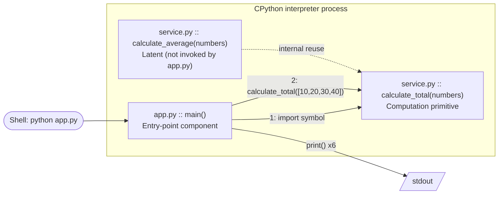
```mermaid
flowchart LR
    CLI(["Shell: python app.py"])
    subgraph Runtime["CPython interpreter process"]
        direction LR
        Main["app.py :: main()<br/>Entry-point component"]
        CT["service.py :: calculate_total(numbers)<br/>Computation primitive"]
        CA["service.py :: calculate_average(numbers)<br/>Latent (not invoked by app.py)"]
        Main -->|"1: import symbol"| CT
        Main -->|"2: calculate_total([10,20,30,40])"| CT
        CA -.->|"internal reuse"| CT
    end
    CLI --> Main
    Main -->|"print() x6"| STDOUT[/"stdout"/]
```

**Key-flow sequence.** The end-to-end execution of the console workflow — from shell invocation through import resolution, computation, and the six output lines — is shown below. (This complements the module-import and submodule-composition sequences in Section 4.1.3, which focus on resolution rather than end-to-end execution.)

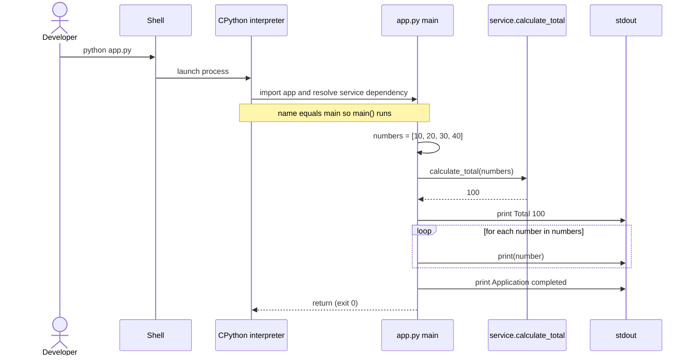
```mermaid
sequenceDiagram
    actor Dev as Developer
    participant Sh as Shell
    participant Py as CPython interpreter
    participant App as app.py main
    participant Svc as service.calculate_total
    participant Out as stdout

    Dev->>Sh: python app.py
    Sh->>Py: launch process
    Py->>App: import app and resolve service dependency
    Note over Py,App: name equals main so main() runs
    App->>App: numbers = [10, 20, 30, 40]
    App->>Svc: calculate_total(numbers)
    Svc-->>App: 100
    App->>Out: print Total 100
    loop for each number in numbers
        App->>Out: print(number)
    end
    App->>Out: print Application completed
    App-->>Py: return (exit 0)
```

**Component state transitions.** The entry-point component passes through a small set of runtime states. This is the coarse-grained, architecture-level view; the authoritative fine-grained finite-state machine (with the `GuardCheck`/`NotRun` states) is documented in Section 4.4.1. Note that import resolution occurs during `Initializing`, which is why the `NestedChild`-tier `ImportError` is a transition into `Faulted` before any computation begins.

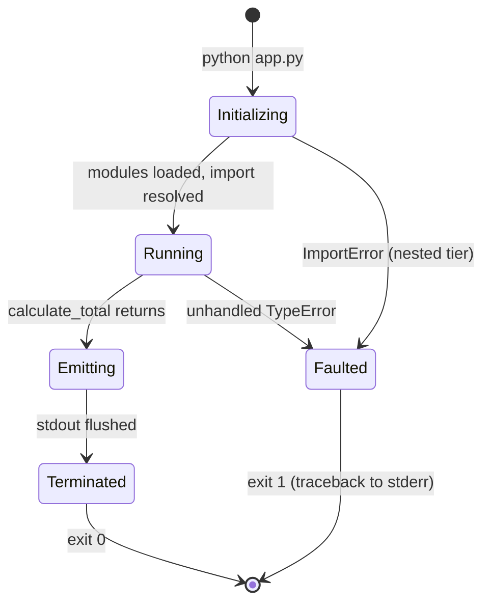
```mermaid
stateDiagram-v2
    [*] --> Initializing: python app.py
    Initializing --> Running: modules loaded, import resolved
    Initializing --> Faulted: ImportError (nested tier)
    Running --> Emitting: calculate_total returns
    Running --> Faulted: unhandled TypeError
    Emitting --> Terminated: stdout flushed
    Terminated --> [*]: exit 0
    Faulted --> [*]: exit 1 (traceback to stderr)
```


## 5.3 Technical Decisions

The repository contains **no formal architecture-decision documents**; the decisions below are reconstructed as "as-built" choices inferred directly from the observed implementation (source files, `.gitmodules`, and verified runtime behavior). Each is justified against the system's demonstrable scope — a dependency-free, deterministic calculation demonstration composed across nested Git submodules.

### 5.3.1 Decision Drivers and Decision Tree

The dominant drivers are **simplicity, determinism, portability, and minimal supply-chain surface**, together with a desire to **reuse source across repositories**. Because the system needs no persistence, no network exposure, no third-party capabilities, and no concurrency, each corresponding decision resolves to the simplest option; the one affirmative driver (cross-repository reuse) selects Git submodule composition. The decision logic is summarized below.

```mermaid
flowchart TD
    Start(["Architecture driver:<br/>small deterministic calculation demo"])
    Q1{"Persist data<br/>between runs?"}
    Q2{"Expose over<br/>network / API?"}
    Q3{"Need third-party<br/>capabilities?"}
    Q4{"Concurrent or<br/>parallel work?"}
    Q5{"Reuse source across<br/>repositories?"}
    D1["No datastore:<br/>in-memory only"]
    D2["No server:<br/>local CLI process"]
    D3["No dependencies:<br/>Python builtins only"]
    D4["No concurrency:<br/>single-threaded synchronous"]
    D5A["Git submodule<br/>composition (nested)"]
    D5B["Single standalone repo"]
    Outcome(["Single-process, in-memory,<br/>synchronous CLI; 2-module split;<br/>submodule-composed source"])
    Start --> Q1
    Q1 -->|No| D1 --> Q2
    Q2 -->|No| D2 --> Q3
    Q3 -->|No| D3 --> Q4
    Q4 -->|No| D4 --> Q5
    Q5 -->|Yes| D5A --> Outcome
    Q5 -->|No| D5B --> Outcome
```

### 5.3.2 Decision Summary and Tradeoffs

The following table consolidates the five decision areas called for by this specification (architecture style, communication pattern, data storage, caching, security) plus the two composition-level choices that shape the system.

| Decision Area | Decision (as-built) | Rationale | Tradeoff / Consequence |
| --- | --- | --- | --- |
| Architecture style | Single-process, in-memory, synchronous, two-module CLI | Simplest design that satisfies a dependency-free deterministic demo | No horizontal scaling and no networked reuse; acceptable within scope |
| Communication pattern | In-process synchronous function call via local `import` | No network needed; lowest possible latency and complexity | Cannot distribute; `app.py → service.py` coupling (unidirectional, acceptable) |
| Data storage | In-memory only — no database or file store | Nothing needs to persist between runs; input is hard-coded | No system of record; all state lost at process exit |
| Caching | None (only CPython `__pycache__` bytecode) | O(n) computation is trivial; nothing is worth memoizing | Each run recomputes from scratch (negligible cost) |
| Security | No auth/secrets; public HTTPS submodule remotes | No runtime network surface, no data, and no users to protect | Supply-chain trust rests on the pinned submodule commit |
| Dependency management | Zero third-party dependencies (builtins only) | Minimal supply-chain surface and maximum portability | No ecosystem leverage; anything beyond builtins must be hand-rolled |
| Source reuse | Nested Git submodule composition with commit pinning | Embed/reuse source across repositories without publishing packages | Manual updates and recursive init required; a broken tier (`NestedChild`) can ship undetected |

### 5.3.3 Architecture Decision Records (ADRs)

Each ADR records an observed decision, its context, and its consequences. All are **Accepted (as-built)** — they describe the shipped state rather than a proposed change.

**ADR-001 — Separate the entry point from the computation library.**
*Context:* the workflow needs both orchestration/I/O and reusable calculation. *Decision:* split responsibilities across `app.py` (entry point) and `service.py` (pure functions), with a one-way dependency (`from service import calculate_total`). *Consequences:* (+) clean separation of concerns and a reusable, side-effect-free computation core; (−) resolution depends on a valid, co-located `service.py`, which the `NestedChild` tier violates.

**ADR-002 — Depend only on the Python standard runtime (builtins).**
*Context:* the functionality (sum, mean, print) is fully expressible with builtins. *Decision:* use no third-party packages and ship no manifest or lockfile. *Consequences:* (+) near-zero supply-chain surface, trivial portability across Python 3.6+; (−) no framework support for configuration, logging, testing, or validation — each would have to be built by hand.

**ADR-003 — Execute synchronously in a single process.**
*Context:* the task is a short, bounded computation. *Decision:* run one CPython process, single-threaded, top-to-bottom. *Consequences:* (+) fully deterministic and easy to reason about; (−) no throughput scaling beyond launching independent processes.

**ADR-004 — Keep all data in memory; persist nothing.**
*Context:* there is no cross-run state to retain. *Decision:* operate on a function-local list and accumulator only; write no files, databases, or caches. *Consequences:* (+) no storage, migration, or consistency concerns; (−) no auditability or recoverable state; nothing to recover after exit (see Section 5.4.6).

**ADR-005 — Hard-code input and emit only to stdout.**
*Context:* the demo must be reproducible with a fixed result. *Decision:* build the literal `[10, 20, 30, 40]` in `main()` and report exclusively via `print`. *Consequences:* (+) deterministic output (`Total: 100`) with no configuration; (−) no external input path and no structured logging — `stdout`/`stderr` are the only channels.

**ADR-006 — Compose source through nested Git submodules with commit pinning.**
*Context:* the same two-file pattern is reused across three repositories. *Decision:* embed children via `.gitmodules` (`ChildRepo`, then `NestedChild`), pinning `ChildRepo` to commit `a1c62944…`. *Consequences:* (+) reproducible, versioned composition without a package registry; (−) manual `git submodule update`, pinning drift over time, and a required recursive initialization; the deepest tier ships a defect undetected.

**ADR-007 — Adopt a fail-fast model with no interception layer.**
*Context:* the program is small and run interactively. *Decision:* add no `try`/`except`, logging, retry, or fallback beyond the single empty-input guard in `calculate_average`. *Consequences:* (+) failures surface immediately and loudly via tracebacks and a non-zero exit code; (−) no graceful degradation, and malformed input aborts the process (detailed in Section 5.4).


## 5.4 Cross-Cutting Concerns

Most cross-cutting concerns typical of a distributed system are **deliberately absent** from this repository, and this section reports them as such rather than inventing mechanisms. The system is a stateless, single-process CLI program with no network surface, no persistence, and no users, so its observability, security, and recovery posture follows directly from that scope. The summary table precedes the per-concern detail.

| Concern | Status | Mechanism / Evidence | Note |
| --- | --- | --- | --- |
| Monitoring & observability | Absent | No metrics/telemetry; only `stdout` output and the process exit code | Exit code is the sole health signal |
| Logging & tracing | Absent (implicit) | No logging framework; `print` to `stdout`; tracebacks to `stderr` | No levels, structure, or correlation IDs |
| Error handling | Minimal | No `try`/`except`; one empty-input guard; interpreter default handling | Fail-fast; exit `1` on any fault |
| Authentication & authorization | Not applicable | No users/endpoints/data; public HTTPS remotes; no secrets stored | Delegated to the developer's Git environment |
| Performance & SLAs | None defined | O(n) linear compute; deterministic; no measurement | No targets exist in the repository |
| Disaster recovery | Not applicable | No persistent state; re-run or re-clone at pinned commit | Reproducibility via commit pinning |

### 5.4.1 Monitoring and Observability

The system contains **no monitoring, metrics, health-check, or telemetry instrumentation** — no such libraries are imported anywhere. Its only observable signals are (1) the deterministic `stdout` output (six lines ending in `Application completed`) and (2) the process **exit code** (`0` for success, `1` for an unhandled exception). There are no dashboards, counters, timers, or alerting; correctness is confirmed by direct execution and inspection, and the exit code is the single machine-readable health indicator.

### 5.4.2 Logging and Tracing

There is **no logging or tracing framework** (the `logging` module is never imported). The de-facto reporting channel is the built-in `print` writing results to `stdout`; on failure, the CPython interpreter writes a traceback to `stderr`. Consequently there are no log levels, structured/JSON logs, log files, correlation IDs, or distributed traces — and nothing is distributed to trace. The only file the runtime leaves behind is the `__pycache__` bytecode cache, which is an interpreter artifact, not a log.

### 5.4.3 Error Handling

The architecture has **no error-interception layer**: there is no `try`/`except`, and the only defensive branch in the entire codebase is `calculate_average`'s empty-input guard (returning `0` to avoid division by zero). Faults therefore propagate outward across the component boundaries — the module-load boundary (import resolution), the function-call boundary, and the I/O boundary — to the **process boundary**, where the interpreter's default handler prints a traceback to `stderr` and terminates with exit code `1`. There is no retry, no fallback beyond the single guard, and no notification beyond `stderr`; recovery is manual. The architecture-level propagation model is shown below; the verified catalog of specific exceptions (the `NestedChild` circular-import `ImportError`, and `TypeError` for non-iterable, non-numeric, and non-sized input) is documented in Section 4.3.2.

```mermaid
flowchart TD
    Origin{"Where does the fault arise?"}
    L["Module-load boundary:<br/>import resolution"]
    C["Function-call boundary:<br/>calculate_total / calculate_average"]
    IO["I/O boundary:<br/>print() to stdout"]
    NoInterceptor["No try/except, logging,<br/>retry, or fallback layer"]
    Guard["Only defensive branch:<br/>calculate_average empty-input guard -> 0"]
    Proc["Process boundary:<br/>interpreter default handler"]
    Traceback[/"Traceback written to stderr"/]
    Exit1(["Exit code 1"])
    Exit0(["Exit code 0 (normal path)"])
    Origin -->|"import error"| L
    Origin -->|"bad input"| C
    Origin -->|"normal path"| IO
    L --> NoInterceptor
    C --> NoInterceptor
    C -.->|"empty input only"| Guard
    Guard --> IO
    NoInterceptor --> Proc
    Proc --> Traceback --> Exit1
    IO --> Exit0
```

### 5.4.4 Authentication and Authorization

Authentication and authorization are **not applicable at runtime**: the system has no users, no network endpoints, and no protected resources, and it stores no credentials or secrets. The only access-controlled interaction is Git's fetch of the submodule remotes, which are **public HTTPS URLs** requiring no authentication for read access. Any credential handling or authorization is delegated entirely to the developer's Git/GitHub environment and is outside the boundary of this repository.

### 5.4.5 Performance Requirements and SLAs

The repository defines **no performance targets, SLAs, SLOs, or KPIs**, and it performs no timing, benchmarking, or measurement — so none can be reported from the evidence. Algorithmically, `calculate_total` is O(n) time and O(1) auxiliary space, and the console workflow is O(n) in the input length (n = 4, hard-coded), making runtime effectively constant and trivial. The design's determinism guarantees byte-identical output on every run at the root and `ChildRepo` tiers. No latency or throughput figure is asserted, because none exists in the source.

### 5.4.6 Disaster Recovery

Conventional disaster-recovery procedures are **not applicable**: there is no persistent state, database, or externalized data to back up or restore, and thus no meaningful RPO/RTO, backup schedule, or failover. Because the process is stateless and idempotent, recovery from any runtime failure is simply to **re-run** the program; recovery of the source is to **re-clone with `--recurse-submodules`** at the pinned commit (`a1c62944…`), which deterministically reproduces the exact working tree. The one structural defect — the `NestedChild` tier's circular-import failure — is remediated structurally by replacing `NestedChild/service.py` with a correct computation module (Sections 2.4.3 and 4.3.2). There is nothing stateful to protect, so continuity rests entirely on the reproducibility of the pinned, version-controlled source.


## 5.5 References

The following repository files, folders, cross-referenced specification sections, and verification activities were used as evidence for this section. CSV files (`*.csv`, e.g. `large.csv`) were excluded per the `.blitzyignore` rule at every tier and were not inspected.

**Repository files examined**

- `app.py` — established the entry-point component: the `from service import calculate_total` import, the hard-coded `[10, 20, 30, 40]` input, the `print`-based output contract, and the `__main__` guard.
- `service.py` — established the computation library: the pure `calculate_total` (ordered sum, empty → `0`) and `calculate_average` (empty-input guard, `calculate_total(numbers)/len(numbers)`).
- `.gitmodules` — established the root composition descriptor declaring the `ChildRepo` submodule and its `https://github.com/lakshya-blitzy/600K_ChildRepo.git` remote.
- `README.md` — established the single-line repository marker (`# app.py`).
- `ChildRepo/app.py`, `ChildRepo/service.py` — confirmed byte-identical copies of the root entry point and computation library (working tier).
- `ChildRepo/.gitmodules` — established the tier-2 → tier-3 composition to `https://github.com/lakshya-blitzy/600K_Nested_ChildRepo.git`.
- `ChildRepo/README.md` — repository marker (`# 600K_ChildRepo`).
- `ChildRepo/NestedChild/app.py` — confirmed the standard entry point at the deepest tier.
- `ChildRepo/NestedChild/service.py` — established the structural defect: a misplaced duplicate of `app.py` (does not define `calculate_total`/`calculate_average`), the root cause of the circular-import failure.
- `ChildRepo/NestedChild/README.md` — repository marker (`# 600K_Nested_ChildRepo`).
- `.blitzyignore` (root, `ChildRepo/`, `ChildRepo/NestedChild/`) — established the `*.csv` exclusion rule honored throughout this section.

**Repository folders examined**

- `` (repository root) — established the top-level structure (`app.py`, `service.py`, `README.md`, `.gitmodules`, `ChildRepo/`) and the absence of any manifest, lockfile, test, CI, container, or configuration asset.
- `ChildRepo/` — the tier-2 Git submodule working tree.
- `ChildRepo/NestedChild/` — the tier-3 nested Git submodule working tree (chain terminus; no `.gitmodules`).
- `__pycache__/` — contained `service.cpython-312.pyc`, evidence that execution occurred under CPython 3.12 (an interpreter artifact, not application data).

**Verification activities**

- Direct execution on Python 3.12.3: root and `ChildRepo` `python app.py` print `Total: 100`, then `10`/`20`/`30`/`40`, then `Application completed` (exit `0`); `NestedChild` `python app.py` fails with a circular-import `ImportError` (exit `1`).
- Static inspection (`grep`) confirming the only import anywhere is `from service import calculate_total` and the absence of any file I/O, network, database, logging, concurrency, or configuration usage.
- `git submodule status` confirming `ChildRepo` pinned at commit `a1c629449c281ae95d86c1672c3890541d683654` on branch `1307_01`.

**Cross-referenced specification sections**

- `1.2 System Overview` — component terminology (Entry point / Computation library / Composition descriptor / Repository marker), the two-dimension framing, and the existing submodule-chain and runtime-component diagrams.
- `2.3 Feature Relationships` — feature identifiers (F-001…F-004), the dependency map, integration points, and shared components (`service.py`, `calculate_total`).
- `2.4 Implementation Considerations` — the `NestedChild` remediation guidance and submodule constraints referenced in Sections 5.4.6.
- `4.1 System Workflows` — the procedural process flow and the module-import / submodule-composition sequences complemented by Section 5.2.
- `4.3 Technical Implementation Flows` — the state-management flow and the verified exception catalog referenced by Sections 5.4.3 and 5.4.6.
- `4.4 State Transition Diagrams` — the authoritative fine-grained finite-state machines complemented by the coarse-grained state diagram in Section 5.2.4.


# 6. SYSTEM COMPONENTS DESIGN

## 6.1 Core Services Architecture

### 6.1.1 Applicability Assessment

**Core Services Architecture is not applicable for this system.**

The repository does not implement a microservices, service-oriented, or otherwise distributed architecture. As established in Section 5.1, the system is a *single-tier, single-process, synchronous, in-memory CPython command-line program*, replicated identically across a three-tier Git submodule chain (`600K_ParentRepo` → `600K_ChildRepo` → `600K_Nested_ChildRepo`). That multi-repository chain is a **build / version-control-time composition** resolved by Git at clone or checkout; it is **not** a runtime service topology — each tier is a standalone copy with no cross-repository runtime linkage.

Consequently there are no independently deployable services, no inter-service communication, no service discovery, no load balancing, no circuit breakers, and no clustering or scaling infrastructure to document. The single module named `service.py` is a repository-local computation library imported in-process through `from service import calculate_total`; here "service" is a *file name*, not a networked or separately deployable service.

The table below records, with evidence, the absence of every defining characteristic of a service-based or distributed architecture.

| Distributed-System Characteristic | Present? | Supporting Evidence |
| --- | --- | --- |
| Independently deployable service processes | No | One `app.py` entry point per tier under an `if __name__ == "__main__"` guard; no daemon/server loop or service definition |
| Inter-service / network communication | No | The only import anywhere is the in-process `from service import calculate_total`; no `socket`/`http`/`requests`/`grpc`/broker imports exist |
| Service discovery / registry | No | No registry client, service mesh, or DNS/discovery configuration |
| Load balancer / reverse proxy | No | No nginx/haproxy/envoy configuration and no proxy layer |
| Message broker / event bus / queue | No | No Kafka/RabbitMQ/Redis/Celery usage anywhere in the source |
| Containerization / orchestration | No | No Dockerfile, docker-compose, Kubernetes/Helm, or `*.yaml` manifests (see Section 3.6) |
| Persistent / shared datastore | No | No database driver or ORM; data is in-memory only (see Sections 3.5 and 5.1.3) |
| Dependency / build manifests | No | No `requirements.txt`, `pyproject.toml`, or `package.json` (see Section 3.3) |

Because none of these elements exist, the sub-sections that follow do not invent them. Section 6.1.2 documents the actual topology that substantiates this determination, and Sections 6.1.3–6.1.5 systematically evaluate each area this section would normally cover — **Service Components**, **Scalability Design**, and **Resilience Patterns** — recording with evidence why each is not applicable. Section 6.1.6 lists all references.

### 6.1.2 Observed System Topology and Execution Model

The determination in Section 6.1.1 rests on the system's actual topology, which spans two orthogonal dimensions defined in Section 5.1 — neither of which is a distributed runtime:

- **Runtime execution architecture** — a single CPython 3.12 process. A thin entry point (`app.py::main()`) constructs the fixed list `[10, 20, 30, 40]`, delegates to the computation library, and writes results to `stdout`. All state is volatile and in-memory.
- **Source-composition architecture** — a three-tier nested Git submodule chain declared in `.gitmodules` (root → `ChildRepo` → `NestedChild`). This is resolved only by Git tooling at clone/checkout time and introduces **no runtime coupling**; each tier's `app.py` imports only its own sibling `service` module.

The sole runtime "interaction" is therefore a single **in-process function call**: `main()` calls `service.calculate_total(numbers)`, receives an integer, and prints it — with no network hop, serialization, endpoint, or second process involved. Direct execution confirms this model: at the root and `ChildRepo` tiers, `python app.py` prints `Total: 100`, then each number on its own line, then `Application completed`, and exits `0`; the `NestedChild` tier instead fails during import with a circular-import `ImportError` (a structural defect examined in Sections 4.3.2 and 5.4.3) and exits `1`.

Diagram 6.1.2-1 depicts this sole interaction alongside the service constructs that are deliberately absent.

```mermaid
flowchart TB
    Dev(["Developer / CLI user"])
    subgraph Proc["Single OS process (CPython 3.12, in-memory)"]
        direction LR
        Main["app.py : main()<br/>orchestration and console I/O"]
        Svc["service.py : calculate_total<br/>in-process computation module"]
        Main -->|"in-process call: from service import calculate_total"| Svc
        Svc -->|"return int total"| Main
    end
    Dev -->|"python app.py"| Main
    Main -->|"print()"| Out[/"stdout"/]
    NoNet["Absent: second service, network/IPC socket,<br/>service discovery, load balancer, message broker"]
    Main -.->|"no remote calls"| NoNet
```

**Diagram 6.1.2-1: Service Interaction — Sole In-Process Call (No Inter-Service Communication).** The only runtime edge is the in-process import/call between `app.py` and `service.py` within a single process; there is no second service, network/IPC socket, service discovery, load balancer, or message broker.

### 6.1.3 Service Components Assessment

This sub-section evaluates each *Service Components* concern required by Section 6.1 against the repository. Every concern is **not applicable**, because the system runs as one process with a single intra-process code boundary rather than as cooperating services.

| Service Component Concern | Applicability | Basis in Repository |
| --- | --- | --- |
| Service boundaries & responsibilities | Not applicable (intra-process module split only) | The only boundary is the `app.py` orchestration/I-O layer over the `service.py` computation layer — an in-process code boundary, documented as components in Sections 5.1.2 and 5.2 |
| Inter-service communication patterns | Not applicable | The sole interaction is the in-process call `from service import calculate_total`; there is no synchronous or asynchronous network protocol |
| Service discovery mechanisms | Not applicable | There are no services to locate; the interpreter resolves the import statically at module-load time by same-directory lookup |
| Load balancing strategy | Not applicable | A single one-shot process handles no concurrent traffic; there are no replicas or balancer |
| Circuit breaker patterns | Not applicable | There are no remote or fallible downstream dependencies to protect, and no such library is present |
| Retry & fallback mechanisms | Not applicable (one input guard only) | No retry logic exists anywhere; the only defensive branch is `calculate_average`'s empty-input guard returning `0` (Sections 4.3.2 and 5.4.3) |

The only architecturally meaningful decomposition is the two-module separation *within a single process* — orchestration/presentation (`app.py`) over stateless computation (`service.py`). That boundary is crossed by a direct function call, not by messaging or RPC, so none of the service-to-service concerns above apply. The `calculate_average` function in `service.py` is a latent library API that no shipped caller invokes, and it likewise participates in no service interaction.

### 6.1.4 Scalability Design Assessment

The repository defines no scalability mechanisms and no performance targets (see Section 5.4.5). Each run processes a fixed, hard-coded four-element list in O(n) time and O(1) auxiliary space, making per-invocation work trivial and effectively constant. The concerns below are therefore not applicable in the distributed sense; where a limited "lever" exists, it is noted.

| Scalability Concern | Applicability | Basis in Repository |
| --- | --- | --- |
| Horizontal / vertical scaling approach | Not applicable (vertical + independent re-invocation only) | A single one-shot process; greater throughput is possible only on a faster host or by independently re-running the script — there is no clustering, sharding, or shared state |
| Auto-scaling triggers & rules | Not applicable | No orchestrator or autoscaler exists, and no metrics or thresholds are defined |
| Resource allocation strategy | Not applicable | No resource requests/limits; the process uses whatever the OS grants, with no container or cgroup configuration |
| Performance optimization techniques | Not applicable (none defined) | No caching, connection pooling, concurrency, or async; a single-threaded synchronous loop (Section 5.4.5) |
| Capacity planning guidelines | Not applicable | No load model, SLA/SLO, or capacity target appears anywhere in the repository |

Because the program is stateless and every invocation is fully isolated, the only available "scaling" actions are to run it on a larger host (vertical) or to launch additional independent one-shot processes; there is no coordinator, shared state, or autoscaling policy to describe. Diagram 6.1.4-1 illustrates this model.

```mermaid
flowchart TB
    Manual["Invocation: manual / OS shell only<br/>(no load balancer, no service registry, no scheduler)"]
    subgraph Host["Single host - OS process scheduler (no orchestrator / no autoscaler)"]
        direction LR
        P1["Run #1: python app.py<br/>one-shot process, exits 0"]
        P2["Run #2: independent<br/>isolated, no shared state"]
        Pn["Run #N: independent<br/>isolated, no shared state"]
    end
    Manual --> P1
    Manual --> P2
    Manual --> Pn
    V["Vertical scaling lever:<br/>faster CPU / more memory on the host"]
    Repl["Horizontal lever = independent re-invocation only;<br/>no coordinated cluster, no autoscaling triggers"]
    P1 -.-> V
    P1 -.-> Repl
```

**Diagram 6.1.4-1: Scalability Model — Single-Process Execution with Vertical and Independent-Re-invocation Levers Only.** No orchestrator, autoscaler, load balancer, or service registry participates; each process run is isolated with no shared state.

### 6.1.5 Resilience Patterns Assessment

The system follows a **fail-fast** model with no resilience layer, consistent with Sections 5.4.3 and 5.4.6. Each concern below is not applicable; the single narrow exception (an input guard) is noted.

| Resilience Concern | Applicability | Basis in Repository |
| --- | --- | --- |
| Fault tolerance mechanisms | Not applicable (fail-fast) | No `try`/`except` anywhere; uncaught exceptions propagate to the interpreter's default handler, which prints a traceback to `stderr` and exits `1` |
| Disaster recovery procedures | Not applicable | No persistent state to back up or restore; recovery is to re-run the program, or to re-clone with `--recurse-submodules` at the pinned commit `a1c62944…` (Section 5.4.6) |
| Data redundancy approach | Not applicable | No data at rest; only the volatile in-memory `numbers` list and `total` accumulator exist, both discarded at process exit (Section 5.1.3) |
| Failover configurations | Not applicable | No replicas, standby instances, or high-availability topology; a single process runs to completion |
| Service degradation policies | Not applicable (one input guard) | No graceful-degradation logic; the only defensive branch is `calculate_average`'s empty-input guard returning `0` |

The one structural fault in the codebase — the `NestedChild` tier's circular-import failure — has no runtime mitigation; it is remediated structurally by replacing `NestedChild/service.py` with a correct computation module (Sections 2.4.3 and 4.3.2). Diagram 6.1.5-1 shows the fail-fast propagation path and the manual recovery actions.

```mermaid
flowchart TD
    Start(["python app.py"])
    Import{"Import resolves?<br/>(service.calculate_total available)"}
    Run{"Input well-formed<br/>iterable of numbers?"}
    Success(["stdout output<br/>Exit code 0"])
    Guard["Only defensive branch:<br/>calculate_average empty-input guard to 0"]
    Fault["Uncaught exception<br/>(ImportError / TypeError)"]
    NoPattern["No circuit breaker - No retry<br/>No fallback - No failover - No replica"]
    Stderr[/"Traceback to stderr"/]
    Exit1(["Exit code 1"])
    Recover["Recovery = MANUAL:<br/>re-run, or re-clone --recurse-submodules at pinned commit"]
    Start --> Import
    Import -->|"yes"| Run
    Import -->|"no (NestedChild tier)"| Fault
    Run -->|"yes"| Success
    Run -->|"no"| Fault
    Run -.->|"empty input only"| Guard
    Guard --> Success
    Fault --> NoPattern
    NoPattern --> Stderr
    Stderr --> Exit1
    Exit1 --> Recover
    Recover -.->|"re-run"| Start
```

**Diagram 6.1.5-1: Resilience Model — Fail-Fast Propagation and Manual Recovery.** Faults are not intercepted (there is no circuit breaker, retry, fallback, failover, or replica); the only defensive branch is the empty-input guard, and recovery is a manual re-run or a re-clone at the pinned commit.

### 6.1.6 References

**Repository files examined** (checkout root `/tmp/blitzy/600K_ParentRepo/1307_01_6e42dc/`):

- `app.py` - established the sole in-process import (`from service import calculate_total`), the hard-coded input, and the console workflow under the `__main__` guard
- `service.py` - established the pure `calculate_total`/`calculate_average` functions and the only defensive branch (the empty-input guard)
- `.gitmodules` - established the build/VCS-time submodule composition (root → `ChildRepo`; `ChildRepo` → `NestedChild`) and confirmed it is not a runtime service topology
- `README.md` - single-line repository marker; confirmed no service/deployment documentation exists
- `.blitzyignore` - confirmed the `*.csv` exclusion scope, honored at every tier
- `ChildRepo/app.py`, `ChildRepo/service.py` - second tier; confirmed byte-identical replication (a standalone copy, not a distinct service)
- `ChildRepo/NestedChild/service.py` - third tier; confirmed the misplaced-duplicate defect that causes the circular-import failure

**Repository folders examined:**

- root repository `/` (with `ChildRepo/` and `ChildRepo/NestedChild/`) - established the full file inventory and the absence of manifests, orchestration, and service definitions
- `__pycache__/` - CPython 3.12 bytecode cache; corroborated the interpreter version

**Cross-referenced Technical Specification sections:**

- 5.1 High-Level Architecture - single-tier/single-process monolithic CLI style, system boundaries, and the runtime-vs-composition dimensions
- 5.2 Component Details - `app.py`/`service.py` component responsibilities
- 5.4 Cross-Cutting Concerns - monitoring, performance/SLA, disaster-recovery, and error-handling posture (5.4.3, 5.4.5, 5.4.6)
- 4.3 Technical Implementation Flows - verified exception catalog and error-propagation model (4.3.2)
- 3.3 Open Source Dependencies, 3.4 Third-Party Services, 3.5 Databases & Storage, 3.6 Development & Deployment - absence of third-party dependencies, external services, databases, and containerization/orchestration

No web sources were used; all findings derive from direct inspection of the repository.

## 6.2 Database Design

### 6.2.1 Applicability Assessment

**Database Design is not applicable to this system.**

The repository implements no database and no persistent storage of any kind, so there is no schema, no data model, no indexing or partitioning scheme, no replication or backup topology, and no data-management or query-optimization machinery to document. As established in Section 3.5 (Databases & Storage) and Section 5.1.3 (Data Flow), the application is a single-tier, single-process, synchronous CPython 3.12 command-line program whose only I/O is writing to standard output via `print()`; it opens no files and performs no disk, network, or database I/O.

Every candidate persistence capability is absent, as evidenced below by direct inspection of the entire source tree (root, `ChildRepo`, and `ChildRepo/NestedChild`).

| Persistence Capability | Present? | Supporting Evidence |
| --- | --- | --- |
| Relational or NoSQL database engine | No | No DB driver or client is imported or configured; a keyword scan for `sql`/`sqlite`/`postgres`/`mysql`/`mongo` across all source returns no matches |
| ORM / ODM data-access layer | No | No SQLAlchemy, Django ORM, or ODM; the only import anywhere is the in-process `from service import calculate_total` |
| File / object / blob storage | No | No `open()` call, no filesystem write, and no storage SDK; the program's only I/O is `print()` to `stdout` |
| In-memory or external cache | No | No cache library (e.g., Redis) and no memoization; each run recomputes from the literal list |
| Migration / schema-definition tooling | No | No migration files, DDL, or `.sql`/schema descriptors exist anywhere in the tree |
| Persistence configuration or credentials | No | No connection string, `.env`, or configuration file of any kind is present |

This determination reconciles the MongoDB entry of the project's Default Technology Stack as **not adopted** — no database technology appears anywhere in the repository, consistent with Section 3.5. The only data the program handles is the literal list `[10, 20, 30, 40]` constructed in `app.py`'s `main()` on each invocation, reduced to an in-memory integer total and written to the console; nothing is stored, cached, or retained between runs. The sole on-disk artifacts are CPython bytecode caches (`__pycache__/*.pyc`, an interpreter optimization rather than application data) and `.blitzyignore`-excluded `*.csv` files that no code path ever opens or reads.

Diagram 6.2.1-1 depicts the actual transient, in-memory data flow alongside the persistence tier that is deliberately absent.

```mermaid
flowchart LR
    Dev(["Developer / CLI"])
    subgraph Proc["Single CPython 3.12 process - volatile in-memory only"]
        direction LR
        Lit["Literal list built in main()<br/>[10, 20, 30, 40]"]
        Calc["calculate_total()<br/>reduce list to scalar (O(n))"]
        Acc["total accumulator<br/>int = 100"]
        Fmt["f-string projection<br/>'Total: 100'"]
        Lit --> Calc --> Acc --> Fmt
    end
    Dev -->|"python app.py"| Lit
    Fmt -->|"print()"| Out[/"stdout (console)"/]
    Discard["All state discarded at process exit<br/>no write-back, no flush, no persistence"]
    Absent["ABSENT persistence tier:<br/>no database, no file/object store,<br/>no cache, no ORM/driver, no connection"]
    Proc -.->|"process exit"| Discard
    Proc -.->|"no read / no write"| Absent
```

**Diagram 6.2.1-1: Data Flow — Transient In-Memory Path with No Persistence Tier.** The entire data lifecycle is contained within a single process: a literal list is reduced to a scalar, projected to a string, and written to `stdout`; all state is discarded at exit, and no database, file store, or cache participates.

Because no datastore exists, Sections 6.2.2 through 6.2.5 systematically evaluate each area this section would normally cover — **Schema Design**, **Data Management**, **Compliance Considerations**, and **Performance Optimization** — recording, with evidence, why each is not applicable rather than inventing structures the code does not contain. Section 6.2.6 lists all references.

### 6.2.2 Schema Design Assessment

There is no database schema because there is no datastore. The program defines no tables, collections, entities, documents, or typed records; its only data structures are transient Python objects that live in process memory for the duration of a single run. The table below evaluates each schema-design concern required by this section against the repository.

| Schema Design Concern | Applicability | Basis in Repository |
| --- | --- | --- |
| Entity relationships | Not applicable | No entities/tables/collections; the only data is a flat list and a derived scalar, with no keys, cardinality, or joins |
| Data models & structures | Not applicable (transient objects only) | Three in-memory values — a `list[int]`, an `int` accumulator, and an output `str`; no classes, annotations, or records (Section 5.2) |
| Indexing strategy | Not applicable | No tables to index; the only index is the Python list's positional index (`0..3`) used during iteration |
| Partitioning approach | Not applicable | No dataset to partition; a fixed four-element list processed in a single pass |
| Replication configuration | Not applicable (data); source-copy only | No DB replica, WAL shipping, or cluster; only build-time byte-identical code copies across submodule tiers |
| Backup architecture | Not applicable | No data at rest; recovery is re-run or re-clone at the pinned commit `a1c62944…` (Section 6.1.5) |

**Entity relationships.** There are no entities and therefore no relationships — no primary or foreign keys, no cardinality, and no joins. The only "structure" is a flat list of four integers and a scalar derived from it.

**Data models and structures.** The complete data model is three ephemeral in-process values: the input list `[10, 20, 30, 40]` (a `list[int]`), the `total` accumulator (an `int`, progressing `0 → 100`), and the formatted output line (a `str`). None is a typed model, ORM entity, or serialized record; `service.py` and `app.py` declare no classes, type annotations, or constants (consistent with Section 5.2).

**Indexing strategy.** Not applicable — there are no tables to index. The only "index" present is the positional index of the Python list, traversed sequentially by the accumulation loop; it is a language construct, not a database index.

**Partitioning approach.** Not applicable — there is no dataset to partition. Each run processes the same fixed four-element list in a single pass.

**Replication configuration.** No data replication exists (no primary/replica, no write-ahead-log shipping, no clustering). The only "replication" in the repository is build/VCS-time duplication of source code across the submodule tiers — the root and `ChildRepo` hold byte-identical copies — which is not data replication (see Diagram 6.2.2-2 and Section 5.1).

**Backup architecture.** Not applicable — there is no data at rest to back up. Recovery of the stateless program is achieved by re-running it or re-cloning the repository at the pinned submodule commit `a1c62944…`, as documented in Section 6.1.5.

To satisfy this section's requirement to document all indexes and constraints, the catalog below records their complete absence.

| Catalog Object | Count | Notes |
| --- | --- | --- |
| Tables / collections | 0 | No datastore is defined or connected |
| Indexes (primary or secondary) | 0 | No tables exist to index |
| Constraints (PK / FK / unique / check / not-null) | 0 | No DDL or schema descriptor exists |

Diagram 6.2.2-1 renders the only "data model" the system has — the transient in-memory objects of a single run — expressed as an entity-relationship diagram purely for illustration. None of these structures is persisted, keyed, or stored in any datastore; the connectors denote in-memory computational derivations rather than stored foreign-key relationships.

```mermaid
erDiagram
    TRANSIENT_NUMBERS_LIST {
        int element_at_index_0 "value 10 - not persisted"
        int element_at_index_1 "value 20 - not persisted"
        int element_at_index_2 "value 30 - not persisted"
        int element_at_index_3 "value 40 - not persisted"
    }
    DERIVED_TOTAL_SCALAR {
        int total "value 100 - transient accumulator"
    }
    CONSOLE_OUTPUT_STRING {
        string line "'Total: 100' then each element - written to stdout"
    }
    TRANSIENT_NUMBERS_LIST ||--|| DERIVED_TOTAL_SCALAR : "reduced in-memory by calculate_total()"
    DERIVED_TOTAL_SCALAR ||--|| CONSOLE_OUTPUT_STRING : "projected by f-string, not stored"
```

**Diagram 6.2.2-1: Conceptual Data Model (ERD) — Transient In-Memory Objects Only.** The diagram illustrates the three ephemeral runtime values and their computational derivation; there are no persistent tables, keys, indexes, or constraints, and nothing is written to a datastore.

Diagram 6.2.2-2 contrasts the absent runtime data-replication topology with the build/VCS-time source-code replication that does exist across the nested submodule chain.

```mermaid
flowchart TB
    subgraph Data["Runtime DATA replication - NONE"]
        direction LR
        P["Single CPython process<br/>(one in-memory dataset per run)"]
        NoPrimary["No primary DB node"]
        NoReplica["No read replica / standby"]
        P -.->|"no WAL / log shipping"| NoReplica
        P -.->|"no clustering / no failover"| NoPrimary
    end
    subgraph Source["Build/VCS-time SOURCE replication (code copies, not data)"]
        direction LR
        T1["600K_ParentRepo<br/>app.py + service.py"]
        T2["600K_ChildRepo<br/>byte-identical copy"]
        T3["600K_Nested_ChildRepo<br/>copy (service.py defective)"]
        T1 -->|".gitmodules @ pinned commit a1c62944"| T2
        T2 -->|".gitmodules"| T3
    end
    Data -.->|"unrelated dimension"| Source
```

**Diagram 6.2.2-2: Replication Architecture — No Data Replication; Build-Time Source Copies Only.** The system has no primary/replica database topology, WAL shipping, or clustering. The only duplication is version-control-time replication of identical source files across the submodule tiers, which carries no runtime data.

### 6.2.3 Data Management Assessment

With no datastore, none of the data-management disciplines this section would normally cover exist in the repository. Each concern is evaluated below.

| Data Management Concern | Applicability | Basis in Repository |
| --- | --- | --- |
| Migration procedures | Not applicable | No schema/data to migrate; no Alembic, Flyway, or Django-migration tooling — only Git and submodule pinning (Section 3.6) |
| Versioning strategy | Not applicable (data); Git for source | No data or schema version; source is versioned via Git branch `1307_01` and pinned commit `a1c62944…` |
| Archival policies | Not applicable | No data survives process exit; nothing to archive, tier, or expire |
| Data storage & retrieval | In-memory only | "Storage" is process RAM; "retrieval" is variable access plus list iteration; no query layer, serialization, or I/O |
| Caching policies | Not applicable (no data cache) | No cache library or memoization; only CPython's bytecode cache (`__pycache__/*.pyc`), which caches code, not data |

**Migration procedures.** Not applicable — there is no schema or data to migrate, and no migration framework (e.g., Alembic, Flyway, Django migrations) is present. The only change-management mechanism in the repository is Git version control and submodule commit pinning (Section 3.6).

**Versioning strategy.** No data versioning exists because no data is stored. Source is versioned with Git (branch `1307_01`, with `ChildRepo` pinned at commit `a1c62944…`); there is no schema version, no data-format version, and no record-level version column.

**Archival policies.** Not applicable — no data survives process exit, so there is nothing to archive, tier, or expire. The in-memory list and total are released when the interpreter terminates.

**Data storage and retrieval mechanisms.** The only "storage" is process RAM, and the only "retrieval" is direct variable access and sequential list iteration inside `calculate_total`. There is no query language, no I/O layer, no serialization or deserialization, and no external store to read from or write to.

**Caching policies.** No application cache exists — no cache library, no memoization, and no result reuse; the total is recomputed from scratch on every run (a trivial O(n) operation over four elements). The only caching anywhere is CPython's automatic bytecode cache (`__pycache__/service.cpython-312.pyc`), which caches compiled code rather than application data and is an interpreter optimization, not a data-management policy.

### 6.2.4 Compliance Considerations Assessment

Because the system persists no data, transmits nothing over a network, and collects no personal information, the data-oriented compliance controls this section would normally document have no subject matter. Each concern is assessed below, consistent with the security implications recorded in Section 3.5.

| Compliance Concern | Applicability | Basis in Repository |
| --- | --- | --- |
| Data retention rules | Not applicable | No data retained past process exit; volatile state is discarded, so no retention period applies |
| Backup & fault-tolerance | Not applicable (data) | No data at rest to back up; fail-fast runtime, recovery = re-run or re-clone at commit `a1c62944…` (Section 6.1.5) |
| Privacy controls | Not applicable | Input is a hard-coded integer list; no PII, no data collection, no data at rest or in transit (Section 3.5) |
| Audit mechanisms | Not applicable | No audit or access log, no change-data-capture, no telemetry; the only output channel is `stdout` (Section 5.1.2) |
| Access controls | Not applicable | No DB users/roles/grants and no application auth; no credentials stored (Section 3.5); OS file permissions are the only, external, control |

**Data retention rules.** Not applicable — no data is retained beyond the lifetime of a single process. The volatile `numbers` list and `total` accumulator are discarded at exit, so there is no retention period to define and no retention obligation to meet.

**Backup and fault-tolerance policies.** Not applicable to data — there is no data at rest to back up. The runtime follows a fail-fast model with no interception layer (Section 6.1.5); the only recovery action is to re-run the program or re-clone the repository at the pinned commit `a1c62944…`.

**Privacy controls.** Not applicable — the program processes only a hard-coded literal list of integers (`[10, 20, 30, 40]`). There is no personally identifiable information, no user data, and no data collection, and therefore nothing subject to encryption-at-rest, masking, anonymization, or consent management. Section 3.5 confirms there is no data at rest and no data in transit.

**Audit mechanisms.** Not applicable — the repository defines no audit log, no access log, no change-data-capture, and no telemetry. The single observability channel is `stdout` (Section 5.1.2), which emits the deterministic result of a run and records no security- or data-access events.

**Access controls.** Not applicable — there is no database and therefore no database users, roles, grants, or row-/column-level security; there is likewise no application authentication or authorization layer. No connection strings, credentials, or storage keys are stored in the repository (Section 3.5). The only access boundary is the operating-system file-permission model governing the source files, which is external to the application.

### 6.2.5 Performance Optimization Assessment

The database-performance techniques this section would normally cover presuppose a datastore, queries, and connections — none of which exist here. The repository also defines no performance targets or SLAs (Section 6.1.4). Each concern is assessed below.

| Performance Concern | Applicability | Basis in Repository |
| --- | --- | --- |
| Query optimization patterns | Not applicable | No queries; only an O(n)/O(1) single-pass sum over a fixed four-element list — no planner or statistics |
| Caching strategy | Not applicable | No data or query-result cache; the total is recomputed cheaply on each run (Section 6.2.3) |
| Connection pooling | Not applicable | No database, network, or file connections are opened; there is no pool to size or manage |
| Read/write splitting | Not applicable | No datastore reads/writes and no primary/replica topology to route across (Diagram 6.2.2-2) |
| Batch processing approach | Not applicable | No batch job or scheduler; a one-shot synchronous run over a fixed list in a single pass (Section 6.1.4) |

**Query optimization patterns.** Not applicable — the program issues no queries. Its only computation is a single-pass summation (`calculate_total`) that runs in O(n) time and O(1) auxiliary space over a fixed four-element list; there is no query planner, execution plan, or statistics to tune.

**Caching strategy.** Not applicable — there is no data cache or query-result cache; the total is recomputed on each invocation at negligible cost (see Section 6.2.3).

**Connection pooling.** Not applicable — the program opens no database, network, or file connections, so there is no pool, no pool sizing, and no connection lifecycle to manage.

**Read/write splitting.** Not applicable — there are no reads from or writes to any datastore, and no primary/replica topology across which to route traffic (see Diagram 6.2.2-2).

**Batch processing approach.** Not applicable — there is no batch job, scheduler, or bulk-load path. Execution is a single one-shot, synchronous run that processes the entire fixed list in one in-memory pass and then exits, consistent with the single-process model in Section 6.1.4.

### 6.2.6 References

**Repository files examined** (checkout root `/tmp/blitzy/600K_ParentRepo/1307_01_6e42dc/`):

- `app.py` - established the in-memory literal input `[10, 20, 30, 40]`, the sole import (`from service import calculate_total`), and console-only output; confirmed no file or database I/O
- `service.py` - established the pure `calculate_total`/`calculate_average` functions with no imports, no persistence, and no data structures beyond a local accumulator
- `.gitmodules` - established the build/VCS-time submodule composition and the pinned `ChildRepo` commit used for reproducibility (the only recovery mechanism)
- `README.md` - single-line marker; confirmed no data, schema, or storage documentation exists
- `.blitzyignore` - confirmed the `*.csv` exclusion is honored at every tier; the excluded CSV files are never opened by any code path
- `ChildRepo/app.py`, `ChildRepo/service.py` - confirmed byte-identical replication of the source (build-time code copies, not data replication)
- `ChildRepo/NestedChild/service.py` - confirmed the misplaced-duplicate file; irrelevant to persistence, as no datastore exists at any tier

**Repository folders examined:**

- root repository `/` (with `ChildRepo/` and `ChildRepo/NestedChild/`) - established the full file inventory and the absence of any database, migration, schema, or configuration assets
- `__pycache__/` - CPython 3.12 bytecode cache; the only on-disk runtime artifact, holding compiled code rather than application data

**Cross-referenced Technical Specification sections:**

- 3.5 Databases & Storage - corroborated "no database and no persistent storage," the not-adopted MongoDB default, and the no-data-at-rest/in-transit security posture
- 5.1 High-Level Architecture - single-process in-memory model, the transient data flow, and "Key data stores and caches: none" (Section 5.1.3)
- 6.1 Core Services Architecture - the not-applicable, evidence-table documentation pattern; fail-fast recovery and single-process model (Sections 6.1.4 and 6.1.5)
- 3.6 Development & Deployment - Git and submodule version control as the only change-management mechanism
- 5.2 Component Details - `app.py`/`service.py` responsibilities and the absence of classes, types, and constants

No web sources were used; all findings derive from direct inspection of the repository.

## 6.3 Integration Architecture

### 6.3.1 Integration Architecture Applicability and Scope

**Runtime Integration Architecture is not applicable for this system.** The repository implements a self-contained, single-process CPython command-line program that integrates with no external systems or services at execution time. It exposes no network interface, consumes no external API, and depends on no message broker, database, cloud service, or authentication provider. As established in Sections 3.4, 5.1, and 6.1, the only import anywhere in the codebase is the repository-local `from service import calculate_total`, and the only runtime side effect is `print()` to `stdout`. A full-keyword scan of all six `.py` files returned zero matches for network, API, messaging, queue, or authentication constructs.

The single external touchpoint in the entire project is **GitHub**, referenced exclusively at version-control / build time through nested Git submodule declarations (`.gitmodules`). This is a *source-composition* dependency resolved by Git tooling during `clone` / `checkout`; it is **not** a runtime integration and involves no application-level protocol, API, or data exchange while the program runs. Because the section prompt requires that *all* external dependencies be documented, this VCS-time touchpoint is fully specified in Section 6.3.4 rather than omitted.

This determination rests on the following directly observed evidence.

| Integration Capability | Present? | Evidence |
| --- | --- | --- |
| Inbound/outbound network API (REST, GraphQL, gRPC, SOAP) | No | No web framework or server (no Flask/FastAPI/Django/gRPC); no `socket`/`http` import; no listening port anywhere in the six `.py` files |
| External API / service client (HTTP client, SDK) | No | No `requests`/`urllib`/`aiohttp`/`boto3` or any SDK import; the only import is the local `from service import calculate_total` |
| Message queue / event bus / stream | No | No Kafka/RabbitMQ/Redis/Celery usage; no publisher, consumer, or broker code |
| Database / external datastore | No | No driver, ORM, or connection string; all state is in-memory only (see Section 6.2) |
| Authentication / authorization provider | No | No users, endpoints, tokens, or credentials; no auth library (see Section 5.4.4) |
| API gateway / reverse proxy / service mesh | No | No gateway/proxy configuration (no nginx/envoy/Kong); no `*.yaml` or Dockerfile manifests exist |
| Configuration for external endpoints | No | No `.env`, config, or manifest files; input is the hard-coded list `[10, 20, 30, 40]` |
| VCS-time source composition (Git submodules) | Yes — build/VCS-time only | Two `.gitmodules` descriptors reference public GitHub HTTPS remotes, resolved by Git at clone/checkout, never at runtime (documented in Section 6.3.4) |

The diagram below contrasts the two orthogonal dimensions of the system: the **runtime execution** dimension, which performs a single in-process function call and writes to `stdout` with no external contact, and the **VCS/build-time composition** dimension, in which Git tooling — not the application — contacts GitHub to fetch submodule content.

```mermaid
flowchart TB
    Dev(["Developer / CLI user"])

    subgraph Runtime["Runtime execution: python app.py (single CPython 3.12 process)"]
        direction LR
        App["app.py : main()"]
        Svc["service.py : calculate_total"]
        Out[/"stdout"/]
        App -->|"in-process import and call"| Svc
        Svc -->|"return int"| App
        App -->|"print()"| Out
    end

    subgraph VCS["VCS / build-time composition (Git tooling only)"]
        direction TB
        GM[".gitmodules descriptors"]
        GH["github.com/lakshya-blitzy remotes<br/>(public HTTPS, read-only)"]
        GM -->|"git submodule fetch"| GH
    end

    NoExt["Absent at runtime: no HTTP/REST/gRPC API,<br/>no DB, no message broker, no cloud SDK, no auth"]

    Dev -->|"python app.py (no network)"| App
    Dev -->|"git clone --recurse-submodules"| GM
    App -.->|"makes no external calls"| NoExt
```

**Diagram 6.3.1-1: Integration Boundary — Runtime (No External Integration) vs. VCS/Build-Time (GitHub Submodule Composition).** At runtime the process performs only the in-process `app.py → service.py` call and writes to `stdout`; the sole external contact (GitHub) occurs only when Git tooling resolves submodules at clone/checkout time.

**Scope of the remaining sub-sections.** Because the required integration domains are not implemented at runtime, the sub-sections that follow do not invent them. Instead they systematically evaluate each area the prompt enumerates and record, with evidence, why it is absent — while fully documenting the one genuine external dependency:

- **Section 6.3.2 API Design** evaluates protocol specifications, authentication methods, authorization framework, rate limiting, versioning, and documentation standards — all not applicable, with the actual (non-network) interfaces noted.
- **Section 6.3.3 Message Processing** evaluates event processing, message queues, stream processing, batch processing, and error-handling strategy — all not applicable, with the sole synchronous in-process data flow documented.
- **Section 6.3.4 External Systems Integration** documents the single VCS-time GitHub dependency (third-party integration pattern and external service contracts) and records legacy-system interfaces and API-gateway configuration as absent.
- **Section 6.3.5 References** lists every file, folder, and cross-referenced specification section used as evidence.

### 6.3.2 API Design

**API Design is not applicable for this system.** The program exposes no application programming interface over any network transport. There is no HTTP/REST, GraphQL, gRPC, SOAP, or WebSocket surface; no web framework or server is imported; and no process binds a listening port. The only ways to interact with the code are entirely local: invoking the CLI (`python app.py`) or importing the `service` module in-process. Each API-design concern required by the prompt is evaluated below against the repository, with its evidentiary basis.

| API Design Aspect | Status | Evidence |
| --- | --- | --- |
| Protocol specifications | Not applicable | No network protocol is used; there is no HTTP/REST, GraphQL, gRPC, SOAP, or WebSocket layer. The only "protocols" are the local process-invocation contract and the in-process import contract |
| Authentication methods | Not applicable | No endpoints or service clients exist to authenticate; no token, API key, session, or credential handling anywhere (corroborated by Section 5.4.4) |
| Authorization framework | Not applicable | No protected resources, users, roles, scopes, or policy checks; the code is pure functions plus console output |
| Rate limiting strategy | Not applicable | No request-serving surface to throttle; a one-shot process serves no concurrent traffic and has no quota, throttle, or backpressure logic |
| Versioning approach | Not applicable (no API); source pinned via Git | No API version namespace, header, or media-type negotiation exists; source-level versioning is handled by Git submodule commit pinning instead (see Section 6.3.4) |
| Documentation standards | Not applicable | No OpenAPI/Swagger, AsyncAPI, RAML, or API-doc tooling; each `README.md` is a single heading line. Function-level behavior is documented in Sections 2.2 and 5.2 |

**Actual interfaces in lieu of an API.** Although there is no network API, the system does expose a small set of *local* interfaces (consistent with the "Major interfaces" enumerated in Section 5.1). These constitute the entire interaction contract and are documented here for completeness.

| Local Interface | Kind | Contract |
| --- | --- | --- |
| `python app.py` | CLI process invocation | Zero arguments; runs `main()` only under the `if __name__ == "__main__"` guard; exits `0` on success |
| `from service import calculate_total` | In-process module import | Local same-directory import that binds the `calculate_total` function; no packaging or network resolution |
| `calculate_total(numbers)` / `calculate_average(numbers)` | In-process function API | Accept an iterable of numbers and return `int`/`float`; no input validation is performed (see Section 2.2) |
| `stdout` text stream | Console output contract | Emits `Total: <total>`, then each input number on its own line, then `Application completed` |

The diagram below depicts this actual "API architecture": local consumers (a CLI user or a Python importer) reach an in-process function API within a single process that binds no port and exposes no network endpoint.

```mermaid
flowchart LR
    subgraph Client["Consumers (local only)"]
        direction TB
        CLI(["CLI user: python app.py"])
        Importer(["Python importer: import service"])
    end

    subgraph Proc["Single CPython process (no network listener, no bound port)"]
        direction TB
        Entry["app.py : main()<br/>orchestration and I/O"]
        API["service module function API<br/>calculate_total(numbers)<br/>calculate_average(numbers)"]
        Entry -->|"from service import calculate_total"| API
    end

    Sink[/"stdout text stream:<br/>Total: 100, then numbers, then Application completed"/]
    NoNet["Absent: REST/GraphQL/gRPC/SOAP endpoint,<br/>HTTP server, OpenAPI/Swagger doc,<br/>auth, rate limiting, versioned API"]

    CLI -->|"process invocation contract"| Entry
    Importer -.->|"in-process module-import contract"| API
    Entry -->|"print()"| Sink
    Entry -.->|"exposes no network API"| NoNet
```

**Diagram 6.3.2-1: API Architecture — Local Interfaces Only.** The only consumer paths are the CLI process-invocation contract and the in-process module-import/function API; there is no network endpoint, HTTP server, API documentation artifact, authentication, authorization, rate limiting, or API versioning.

### 6.3.3 Message Processing

**Message Processing is not applicable for this system.** There is no message-oriented middleware, event system, or stream/batch framework anywhere in the repository. Each invocation performs a single synchronous, in-memory computation and writes the result to `stdout`; there is no producer, consumer, topic, queue, broker, subscription, or event loop. The keyword scan across all six `.py` files found no messaging library (no Kafka, RabbitMQ/`pika`, Redis, Celery, or SQS). Each concern required by the prompt is evaluated below.

| Message Processing Concern | Status | Evidence |
| --- | --- | --- |
| Event processing patterns | Not applicable | No event emitters, handlers, callbacks, or event loop; execution is a single linear `main()` call path with no `asyncio` and no observer/pub-sub construct |
| Message queue architecture | Not applicable | No queue or broker (no Kafka/RabbitMQ/SQS/Redis/Celery); no enqueue/dequeue, acknowledgement, or dead-letter handling |
| Stream processing design | Not applicable | No stream framework or windowing; the input is a fixed, bounded list processed in one pass — not an unbounded stream |
| Batch processing flows | Not applicable (one-shot CLI) | No scheduler, job runner, or batch framework (no cron/Airflow/task queue); the program is a single one-shot run over one hard-coded dataset |
| Error handling strategy | Fail-fast; no message-level handling | No `try`/`except`, retry, dead-letter, or compensation logic; the only defensive branch is `calculate_average`'s empty-input guard. Faults propagate to the interpreter, printing a traceback to `stderr` and exiting `1` (see Sections 5.4.3 and 4.3.2) |

**The sole "message flow" is an in-process data flow.** The nearest analog to message movement in this system is the synchronous passing of a value between two functions in the same process: `main()` constructs the in-memory list `[10, 20, 30, 40]`, passes it to `calculate_total`, receives the scalar `100`, projects it into an f-string, and writes it to `stdout`. No serialization, transport, envelope, topic, or delivery guarantee is involved. Likewise, the closest analog to a "batch" is that a single one-shot execution processes one fixed dataset end-to-end — but it employs no batch scheduler or framework and no partitioning, checkpointing, or offset management.

```mermaid
flowchart LR
    Start(["main() invocation"])
    Data["In-memory list<br/>[10, 20, 30, 40]"]
    Reduce["calculate_total<br/>synchronous reduce to 100"]
    Fmt["f-string projection<br/>Total: 100"]
    Out[/"stdout"/]
    Start --> Data --> Reduce --> Fmt --> Out

    NoMsg["Absent: message queue, event bus,<br/>stream processor, pub/sub topic,<br/>broker, consumer group, offset/ack"]
    Reduce -.->|"no messages emitted or consumed"| NoMsg
```

**Diagram 6.3.3-1: Message Flow — Sole Synchronous In-Process Data Flow.** The only "message" movement is the in-process transfer of the list and its reduced total between functions in one process; there is no queue, broker, stream, event bus, or delivery/acknowledgement semantics. The error-handling strategy is fail-fast with no message-level retry or dead-lettering, consistent with the architecture-level propagation model documented in Sections 5.4.3 and 4.3.2.

### 6.3.4 External Systems Integration

The system has exactly **one** external dependency, and it is exercised only at version-control / build time: **GitHub**, which hosts the two nested Git submodule remotes that compose the source tree. There is no runtime external system of any kind. This sub-section documents that single dependency in full and records the remaining External-Systems concerns (legacy interfaces, API gateway) as absent, consistent with Sections 3.4, 3.6, and 5.1.4.

| External Systems Concern | Status | Detail / Evidence |
| --- | --- | --- |
| Third-party integration patterns | Present — Git submodule composition (VCS-time only) | Pull-based fetch of pinned commits over git-HTTPS at clone/checkout; unidirectional (Git tooling reads public GitHub remotes); introduces no runtime coupling between tiers |
| Legacy system interfaces | None | No legacy adapters, batch file drops, FTP/SFTP, SOAP/EDI, or mainframe bridges; no such code or configuration exists anywhere |
| API gateway configuration | None | No gateway, reverse proxy, or service mesh (no nginx/Kong/Apigee/envoy); there is no network traffic to route, secure, or aggregate |
| External service contracts | Declarative `.gitmodules` descriptors + pinned commits | The only "contract" is source-composition: each descriptor pins a submodule path and remote URL, and the superproject index pins an exact commit SHA (see the dependency table). No runtime API or SLA contract exists |

**Third-party integration pattern — nested Git submodule composition.** The parent repository embeds `600K_ChildRepo`, which embeds `600K_Nested_ChildRepo`, forming a three-tier chain declared through two `.gitmodules` descriptors. The integration is **pull-based and unidirectional**: Git tooling on the developer or CI machine fetches the pinned commit objects from GitHub over HTTPS during `git clone --recurse-submodules` or `git submodule update`. Commit pinning gives **deterministic, reproducible checkouts** (each tier resolves to an exact SHA) at the cost of no automatic upstream updates. The remotes are **public, read-only HTTPS URLs**, so no credentials or secrets are stored in the repository and there is no runtime network egress (see Sections 3.4 and 5.4.4). Critically, this composition is a *source-assembly* mechanism only — at runtime each tier's `app.py` imports solely its co-located `service.py`, so there is no cross-repository call and no network activity.

The diagram below shows the composition topology and the strict separation between the VCS-time GitHub touchpoint and the no-coupling runtime.

```mermaid
flowchart TB
    subgraph Local["Local working tree (developer machine / CI)"]
        direction TB
        Parent["600K_ParentRepo (root)<br/>.gitmodules -> ChildRepo"]
        Child["ChildRepo<br/>.gitmodules -> NestedChild"]
        Nested["ChildRepo/NestedChild<br/>(no .gitmodules: chain terminates)"]
        Parent -->|"embeds @ pinned commit a1c62944"| Child
        Child -->|"embeds @ pinned commit 915ff60"| Nested
    end

    subgraph GitHub["GitHub (public HTTPS remotes, read-only)"]
        direction TB
        R1["600K_ChildRepo.git"]
        R2["600K_Nested_ChildRepo.git"]
    end

    Git["Git submodule tooling"]
    Runtime["Runtime app.py: imports only local service.py<br/>(no cross-repo call, no network)"]

    Git -->|"fetch + checkout at clone time"| Parent
    Parent -.->|"submodule url"| R1
    Child -.->|"submodule url"| R2
    Nested -.->|"no runtime coupling"| Runtime
```

**Diagram 6.3.4-1: External Integration Flow — Nested Git Submodule Composition.** The two `.gitmodules` descriptors reference public GitHub HTTPS remotes; Git tooling fetches and checks out pinned commits at clone time. The runtime application (`app.py`) imports only its local `service.py` and never contacts any external system.

**Key integration flow (sequence).** The sequence diagram below traces the only flow that touches an external system — a recursive clone. All GitHub contact is confined to this VCS-time operation; program execution afterward is fully offline.

```mermaid
sequenceDiagram
    actor Dev as Developer / CI
    participant Git as Git submodule tooling
    participant GH as GitHub HTTPS remotes
    participant FS as Local working tree

    Dev->>Git: git clone --recurse-submodules parent
    Git->>GH: fetch parent repository objects
    GH-->>Git: parent objects and .gitmodules
    Git->>FS: checkout parent app.py and service.py
    Git->>GH: fetch ChildRepo at pinned commit a1c62944
    GH-->>Git: ChildRepo objects
    Git->>FS: checkout ChildRepo submodule
    Note over Git,GH: NestedChild pinned at 915ff60 and fetched only when the submodule is initialized or updated
    Git->>FS: checkout NestedChild submodule when initialized
    Note over Dev,FS: VCS-time only. Running python app.py makes no network calls and imports only local service.py
```

**Diagram 6.3.4-2: Key Integration Sequence — `git clone --recurse-submodules` Against GitHub.** GitHub is contacted only by Git tooling during clone/update; the observed checkout has `ChildRepo` initialized at its pinned commit and `NestedChild` left uninitialized until an explicit submodule update.

**External service contracts and dependency inventory.** The complete set of external dependencies is the two submodule remotes below. The "contract" for each is declarative: a path + URL in `.gitmodules` plus an exact pinned commit recorded in the superproject index (verified via `git submodule status --recursive`). There is no runtime API contract, schema, or SLA — none is defined anywhere in the repository (see Section 5.1.4).

| External Dependency (remote) | Submodule Path | Pinned Commit (observed state) | Integration Time / Protocol |
| --- | --- | --- | --- |
| `github.com/lakshya-blitzy/600K_ChildRepo.git` | `ChildRepo` | `a1c629449c281ae95d86c1672c3890541d683654` (checked out, `heads/1307_01`) | VCS/build-time; git over HTTPS (pull-based fetch) |
| `github.com/lakshya-blitzy/600K_Nested_ChildRepo.git` | `ChildRepo/NestedChild` | `915ff60a2ef846af380b0b2288b0ab09676ae63c` (uninitialized in checkout) | VCS/build-time; git over HTTPS (pull-based fetch) |

Because the sole integration is a read-only, VCS-time source fetch, the integration attack surface at runtime is nil (no outbound requests, no third-party outage dependency, no credential handling), and reproducibility is guaranteed by commit pinning as described in Sections 5.4.6 and 6.1.5.

### 6.3.5 References

**Repository files examined** (checkout root `/tmp/blitzy/600K_ParentRepo/1307_01_6e42dc/`):

- `app.py` — established the sole import (`from service import calculate_total`), the hard-coded input, and the console-only workflow; confirmed no network, API, messaging, or external-service code
- `service.py` — established the pure `calculate_total`/`calculate_average` functions with no imports, and the empty-input guard that constitutes the only defensive branch (fail-fast error handling)
- `.gitmodules` — established the root → `ChildRepo` submodule declaration (path + public GitHub HTTPS remote), the only external touchpoint
- `ChildRepo/.gitmodules` — established the `ChildRepo` → `NestedChild` submodule declaration (path + public GitHub HTTPS remote)
- `ChildRepo/app.py`, `ChildRepo/service.py` — confirmed byte-identical replication of the root logic with no integration code
- `ChildRepo/NestedChild/app.py`, `ChildRepo/NestedChild/service.py` — confirmed the third tier contains no integration code and that the chain terminates (no `.gitmodules`)
- `README.md` (all tiers) — single-line headings; confirmed no API/integration documentation (no OpenAPI/Swagger)
- `.blitzyignore` (all tiers) — confirmed the `*.csv` exclusion, honored throughout (no `.csv` viewed or documented)

**Repository folders examined:**

- root repository `/` (including `ChildRepo/` and `ChildRepo/NestedChild/`) — established the full file inventory and the absence of manifests, config, API frameworks, message brokers, and gateway/proxy configuration
- `__pycache__/` — CPython 3.12 bytecode cache; an interpreter artifact, not an integration surface

**Verification commands** (used to ground the External Systems documentation):

- `git config --file .gitmodules --list` (root and `ChildRepo`) — confirmed submodule paths and public GitHub HTTPS remote URLs
- `git submodule status --recursive` — confirmed pinned commits and initialization state (`ChildRepo` @ `a1c62944`, checked out; `ChildRepo/NestedChild` @ `915ff60`, uninitialized)
- keyword scan across all six `.py` files — confirmed zero network/API/messaging/queue/auth constructs

**Cross-referenced Technical Specification sections:**

- 3.3 Open Source Dependencies — confirmed zero third-party/OSS runtime dependencies
- 3.4 Third-Party Services — confirmed no runtime third-party services; GitHub is the only touchpoint (VCS-time only)
- 3.6 Development & Deployment — confirmed Git + nested submodules only; no containerization, CI/CD, or IaC
- 5.1 High-Level Architecture (5.1.4 External Integration Points) — the two GitHub remotes, git-HTTPS pull-based fetch, and absence of any runtime integration or SLA
- 5.4 Cross-Cutting Concerns (5.4.3 Error Handling, 5.4.4 Authentication and Authorization, 5.4.6 Disaster Recovery) — fail-fast model, auth not applicable, reproducibility via commit pinning
- 6.1 Core Services Architecture — the "not applicable" Applicability-Assessment pattern mirrored here
- 6.2 Database Design — confirmed no persistence or external datastore
- 2.2 Functional Requirements and 4.3 Technical Implementation Flows (4.3.2) — function behavior, absence of input validation, and the verified error-propagation model

No web sources were used; all findings derive from direct inspection of the repository.

## 6.4 Security Architecture

### 6.4.1 Security Architecture Applicability and Trust Zones

**Detailed Security Architecture is not applicable for this system.**

The repository is a self-contained, single-process CPython 3.12 command-line demonstration program. Its complete runtime behavior consists of `app.py` invoking `main()`, which constructs a hard-coded integer list `[10, 20, 30, 40]`, calls `calculate_total` from the repository-local `service.py`, and writes results to `stdout` via `print()`. There is no authenticated actor, no network listener, no persisted data, no privileged operation, and no untrusted input anywhere in the codebase. Consequently, the classic security-architecture concerns — authentication, authorization, and data protection — have no subject matter to govern at runtime. Rather than omit this section, the remainder of §6.4 documents the *standard* security practices that do apply, so the posture is explicit and auditable.

This determination is consistent with the sibling assessments already recorded in the specification: §5.4 Cross-Cutting Concerns classifies authentication and authorization as *Not applicable*, and §6.3 Integration Architecture concludes that *Runtime Integration Architecture is not applicable* because the only external touchpoint is a build/VCS-time Git submodule composition.

#### 6.4.1.1 Applicability Assessment

The following assessment enumerates each security domain against direct repository evidence. A security keyword sweep across every `.py`, `.md`, and `.gitmodules` file (covering `auth`, `login`, `password`, `token`, `jwt`, `oauth`, `session`, `cookie`, `encrypt`, `crypto`, `hash`, `tls`, `ssl`, `https`, `secret`, `credential`, `permission`, `role`, `rbac`, `acl`, `certificate`, `cipher`, `sign`, `api key`, `bcrypt`, `argon`, `pbkdf`, `access control`, `authoriz`, `authentic`, `ldap`, `saml`, `cors`, `csrf`, and input-handling terms) returned only two matches — both the literal string `https` inside submodule remote URLs in `.gitmodules`. No security-relevant code exists.

| Security Domain | Present in Repository? | Evidence |
| --- | --- | --- |
| Authenticated users / identity store | No | No user model, login flow, or identity provider; the sole input is the hard-coded literal list `[10, 20, 30, 40]` in `app.py` |
| Network / API attack surface | No | No web framework, HTTP server, or bound socket; no `socket`, `http`, `urllib`, or `requests` import in any `.py` file |
| Authorization / access control | No | No roles, permissions, scopes, or policy checks; logic is pure functions (`calculate_total`, `calculate_average`) plus `print()` |
| Sensitive data at rest or in transit | No | No database, file persistence, or configuration read; all state is in-memory integers; the only output sink is `stdout` |
| Secrets / credentials / keys | No | No `.env`, key material, tokens, or credentials committed anywhere; submodule remotes are public read-only HTTPS URLs |
| Third-party / runtime dependencies | No | Zero third-party imports; the only import is the repository-local `from service import calculate_total` |
| External touchpoint (VCS-time only) | Yes — build-time | Two `.gitmodules` descriptors reference public GitHub HTTPS remotes, resolved by Git tooling at clone/checkout, never at runtime |

#### 6.4.1.2 Standard Security Practices Applied Instead

Because no bespoke controls are warranted, the system relies on the standard, environment-provided security practices summarized below. Each is expanded with evidence in the sub-sections that follow.

- **Supply-chain integrity via commit pinning.** Submodules are pinned to exact commits — `ChildRepo` @ `a1c629449c281ae95d86c1672c3890541d683654` and `NestedChild` @ `915ff60a2ef846af380b0b2288b0ab09676ae63c` — so composed code is deterministic and tamper-evident, as documented in §6.3 and §3.6.
- **No stored secrets.** All remotes are public read-only HTTPS URLs; nothing sensitive is committed, so there is no secret-management requirement.
- **Delegated transport security.** The only network interaction (Git fetching submodule objects) occurs over HTTPS/TLS handled entirely by the developer's Git/GitHub tooling, outside the application boundary.
- **Delegated host and access controls.** Read/execute authorization for the source tree and the `python app.py` invocation is enforced by the operating system's user and file-permission model, not by application code.
- **Interpreter hygiene.** The runtime security baseline is keeping the CPython interpreter (verified 3.12.3) patched at the host level.

#### 6.4.1.3 Trust Zones and Security Boundaries

Although the program has no runtime security surface, it does cross one meaningful trust boundary — but only at version-control time, when Git fetches submodule code from GitHub. The diagram below partitions the system into three trust zones and shows that all untrusted-network interaction is confined to the VCS/build phase; at runtime the process performs no network egress and touches only in-memory data and `stdout`.

```mermaid
flowchart TB
    Dev(["Developer / CLI user"])

    subgraph ExternalZone["Zone 1 — External / Untrusted (VCS-time only)"]
        direction TB
        GH["GitHub public remotes<br/>600K_ChildRepo.git and 600K_Nested_ChildRepo.git<br/>read-only, git over HTTPS/TLS"]
    end

    subgraph HostZone["Zone 2 — Local Trusted Host (developer / CI machine)"]
        direction TB
        Git["Git submodule tooling<br/>clone / submodule update"]
        FS["Working tree + filesystem<br/>guarded by OS user / file permissions"]

        subgraph RuntimeZone["Zone 3 — Runtime Process (single CPython 3.12 process)"]
            direction TB
            App["app.py : main()"]
            Svc["service.py : calculate_total / calculate_average"]
            Console[/"stdout (console)"/]
            App -->|"in-process import + call"| Svc
            App -->|"print()"| Console
        end

        Git -->|"checkout pinned commits"| FS
        FS -->|"python app.py"| App
    end

    Dev -->|"git clone --recurse-submodules"| Git
    Dev -->|"python app.py (no network)"| App
    Git -.->|"fetch objects (anonymous read over TLS)"| GH
```

The trust boundary between Zone 1 and Zone 2 is the primary — and only — supply-chain trust boundary, as identified in §3.6: the integrity of the GitHub remotes plus the pinned commit SHAs is what guarantees the composed code is authentic. Once checkout completes, Zone 3 executes in isolation with no inbound or outbound network path.

### 6.4.2 Authentication Framework

No authentication framework exists in this system and none is required. There is no user, account, principal, or identity model in any source file; the program neither prompts for nor verifies any credential. The only credential-adjacent event in the entire lifecycle occurs outside the application, at version-control time: when Git fetches submodule objects from GitHub. Because those remotes are public, that fetch is an **anonymous, unauthenticated read** — no username, password, token, or key is presented or required.

#### 6.4.2.1 Authentication Concern Assessment

Each standard authentication concern is assessed below against repository evidence, together with the standard practice that governs it in the absence of an application-level mechanism.

| Concern | Applicable? | Repository Evidence | Standard Practice Followed |
| --- | --- | --- | --- |
| Identity management | No | No user, account, or identity model in `app.py` or `service.py`; sole input is the hard-coded list `[10, 20, 30, 40]` | Process runs under the invoking OS user identity; no application principals to manage |
| Multi-factor authentication | No | No login or authentication flow of any kind; keyword sweep found no `auth`/`login`/`mfa` tokens | Not exercised at runtime; anonymous read requires no factors |
| Session management | No | Single short-lived process; no sessions, cookies, or persisted state; `main()` returns and the process exits | Lifetime is bounded by one synchronous `main()` invocation |
| Token handling | No | No API tokens, JWTs, or bearer credentials; no `token`/`jwt`/`oauth` usage found | Submodule fetch is anonymous over HTTPS; no tokens stored or transmitted by the app |
| Password policies | No | No passwords or credentials anywhere in the tree; no `.env` or secret store | No credential store exists, so no password policy applies |

#### 6.4.2.2 Authentication Flow

The diagram traces the only authentication-relevant path in the system — the VCS-time submodule fetch — and confirms that the runtime path (`python app.py`) contains no authentication step whatsoever. For this repository the "public?" decision always resolves to *Yes*, so the anonymous-read branch is taken; the credentialed branch is shown only to illustrate what a private remote would require and is not exercised here.

```mermaid
flowchart TD
    Start(["Developer initiates<br/>git clone --recurse-submodules"]) --> Connect["Git connects to GitHub<br/>over HTTPS/TLS"]
    Connect --> Public{"Submodule remote<br/>public?"}
    Public -->|"Yes (this repo)"| Anon["Anonymous read granted<br/>no credentials presented"]
    Public -->|"No (not this repo)"| Creds["Git credential helper<br/>supplies token / SSH key"]
    Anon --> Fetch["Fetch objects at<br/>pinned commit SHA"]
    Creds --> Fetch
    Fetch --> Checkout["Checkout working tree"]
    Checkout --> Runtime["Runtime: python app.py"]
    Runtime --> NoAuth["No authentication step:<br/>reads hard-coded data,<br/>prints to stdout, exits"]
```

The pinned commit SHAs referenced by the fetch step are `a1c629449c281ae95d86c1672c3890541d683654` (`ChildRepo`) and `915ff60a2ef846af380b0b2288b0ab09676ae63c` (`NestedChild`), establishing that the fetched content is fixed and verifiable even though the transfer itself is anonymous.

### 6.4.3 Authorization System

No authorization system exists in this system and none is required. The code defines no roles, permissions, scopes, guards, middleware, or policy checks; it is a set of pure functions plus `print()` statements that operate exclusively on hard-coded in-memory data. The only authorization decisions in the lifecycle are made entirely **outside the application** by two standard, environment-provided authorities: GitHub (which authorizes the anonymous read of the public submodule repositories at VCS-time) and the host operating system (which authorizes read/execute access to the source files at runtime).

#### 6.4.3.1 Authorization Concern Assessment

| Concern | Applicable? | Repository Evidence | Standard Practice Followed |
| --- | --- | --- | --- |
| Role-based access control | No | No roles, groups, or scopes defined in any source file | Access governed by the OS user/group model at the host level |
| Permission management | No | No permission model, ACL, or grant logic in `app.py` or `service.py` | POSIX file-mode bits on the working tree control read/execute |
| Resource authorization | No | No protected resources — no database, no files written, no endpoints exposed | OS mediates filesystem access; GitHub mediates repo read (public = allow-all read) |
| Policy enforcement points | No | No decorators, middleware, or interceptors; execution flows straight through `main()` | Enforcement delegated to the OS kernel and Git/GitHub; no in-application PEP |
| Audit logging | No | No logging framework; the only output is `print()` to `stdout` | Git commit history provides change provenance; host and GitHub access logs live outside the repository boundary |

#### 6.4.3.2 Authorization Flow

The diagram shows both external authorization decisions and makes explicit that the application itself performs none. At VCS-time GitHub authorizes an anonymous read because the submodule repositories are public; at runtime the operating system authorizes execution based on the invoking user's file permissions. Once the interpreter starts, the program contains no authorization check of any kind.

```mermaid
flowchart TD
    Actor(["Developer / CLI user"])

    subgraph VCSAuthz["VCS-time authorization (GitHub)"]
        direction TB
        ReadReq["Read request for<br/>submodule repository"]
        GHDecision{"Repository<br/>visibility?"}
        GHAllow["Authorize anonymous read"]
        GHDeny["Would require access grant<br/>(not this repo)"]
        ReadReq --> GHDecision
        GHDecision -->|"Public (this repo)"| GHAllow
        GHDecision -->|"Private"| GHDeny
    end

    subgraph OSAuthz["Runtime authorization (operating system)"]
        direction TB
        Invoke["python app.py invoked"]
        FSDecision{"OS user has read/execute<br/>on source files?"}
        Run["Interpreter executes process"]
        Refuse["OS denies with<br/>permission error"]
        NoAppCheck["Program performs<br/>NO authorization checks"]
        Invoke --> FSDecision
        FSDecision -->|"Permitted"| Run
        FSDecision -->|"Denied"| Refuse
        Run --> NoAppCheck
    end

    Actor -->|"git clone / submodule update"| ReadReq
    GHAllow -->|"objects checked out to filesystem"| Invoke
    Actor -->|"runs"| Invoke
```

This delegation of all authorization to the OS and to GitHub is the standard practice for a dependency-free local CLI program: there are no application-owned resources to protect, so introducing an in-process authorization layer would add attack surface without protecting any asset.

### 6.4.4 Data Protection

Data protection is largely not applicable because the system processes no sensitive data and persists nothing. The complete data inventory is a hard-coded integer list `[10, 20, 30, 40]` and a few constant format strings defined in `app.py`, transformed by arithmetic in `service.py`, and emitted to `stdout`. Classified against any standard data-sensitivity scale, all of this data is **non-sensitive and public**: there is no personally identifiable information (PII), no protected health information (PHI), no payment/cardholder data (PCI), no authentication material, and no business-confidential content. Nothing is written to disk, a database, or the network, so there is no data-at-rest or data-in-transit protection obligation originating from the application.

#### 6.4.4.1 Data Protection Concern Assessment

| Concern | Applicable? | Repository Evidence | Standard Practice Followed |
| --- | --- | --- | --- |
| Encryption standards | No | No data persisted and no cryptographic library imported; no `crypto`/`encrypt`/`cipher` usage found | No data at rest exists to encrypt |
| Key management | No | No keys, keystores, or KMS references anywhere in the tree | No key material is generated, stored, or rotated |
| Data masking rules | No | Data is a non-sensitive hard-coded integer list; no PII/PHI/PCI fields | No sensitive fields exist that would require masking or redaction |
| Secure communication | Delegated | No application network I/O; the only transport is Git's submodule fetch over HTTPS/TLS (see §6.4.4.2) | TLS is provided by the Git/GitHub tooling, outside the application boundary |
| Compliance controls | No | No regulated data category is present or processed | Standard secure-development hygiene; no regulatory regime is triggered (expanded in §6.4.5) |

#### 6.4.4.2 Secure Communication (Transport)

The single genuine data-in-transit element in the system is the transfer of submodule Git objects from GitHub to the local host. As documented in §6.3 and §3.6, both submodule remotes are declared with `https://` scheme URLs in `.gitmodules` (`https://github.com/lakshya-blitzy/600K_ChildRepo.git` and `https://github.com/lakshya-blitzy/600K_Nested_ChildRepo.git`). Consequently the fetch is carried over HTTPS/TLS, which provides confidentiality and integrity for the transfer.

Two properties are important for an accurate posture statement:

- **The application does not implement or configure this transport.** TLS negotiation, certificate validation, and cipher selection are handled entirely by the developer's Git client and GitHub's servers. The repository contains no TLS configuration, certificate, or transport code.
- **This transport is VCS-time only.** It executes during `git clone`/`git submodule update`, never during `python app.py`. At runtime there is no open socket, so there is no data-in-transit surface at all.

Integrity of the transferred content is further reinforced beyond TLS by Git's content-addressable model and by pinning each submodule to an exact commit SHA (`a1c629449c281ae95d86c1672c3890541d683654` for `ChildRepo`, `915ff60a2ef846af380b0b2288b0ab09676ae63c` for `NestedChild`), so any tampering with fetched objects would produce a hash mismatch.

### 6.4.5 Standard Security Practices and Compliance Controls

This sub-section consolidates the standard security practices that govern the system in place of a bespoke security architecture, and documents the compliance posture. Every control listed is either an inherent property of the design (e.g., no third-party dependencies) or is enforced by the surrounding environment (the operating system and the Git/GitHub toolchain). None requires application code, which is consistent with the not-applicable determination in §6.4.1.

#### 6.4.5.1 Security Control Matrix

| Control Area | Control Applied | Enforced By | Evidence / Reference |
| --- | --- | --- | --- |
| Supply-chain integrity | Submodules pinned to exact commit SHAs (tamper-evident, deterministic) | Git submodule mechanism | `.gitmodules` + pinned SHAs; §6.3, §3.6 |
| Transport security | git-over-HTTPS/TLS for submodule object fetch | Git client + GitHub | `https://` URLs in `.gitmodules`; §6.4.4.2 |
| Secret management | No secrets, tokens, or keys committed; public read-only remotes | Repository hygiene | Keyword sweep found no credentials; §3.6 |
| Host access control | Read/execute governed by OS user and file permissions | Operating system | §6.4.3 |
| Dependency risk reduction | Zero third-party runtime dependencies (standard library only) | Design (stdlib-only) | Only import is local `from service import calculate_total`; §3.3 |
| Input trust | No untrusted input; all inputs are hard-coded literals | Design | Hard-coded list `[10, 20, 30, 40]` in `app.py` |
| Runtime isolation | No network listener and no network egress at runtime | Design | No `socket`/`http`/`urllib` import; §6.4.1 |
| Interpreter hygiene | Keep the CPython interpreter patched at the host level | Host maintenance | Verified runtime CPython 3.12.3 |
| Change provenance | Version history and branch tracking for auditability | Git VCS | Commit SHAs on branch `1307_01` |

#### 6.4.5.2 Compliance Posture

No regulatory or industry compliance regime is triggered by this system because it neither collects, processes, transmits, nor stores any regulated data category, and it is a technical demonstration rather than a deployed service handling customer data. The table below records the assessment against common regimes; all resolve to *Not Triggered*.

| Regime / Standard | Applicable? | Rationale |
| --- | --- | --- |
| GDPR / general privacy | Not Triggered | No personal data is collected, processed, or stored; data is a hard-coded integer list |
| HIPAA | Not Triggered | No protected health information is present or handled |
| PCI-DSS | Not Triggered | No cardholder or payment data exists anywhere in the system |
| SOC 2 / ISO 27001 | Not Triggered | No customer-facing service, production infrastructure, or managed data; demonstration scope only |

Although no regime is mandatory, the system voluntarily follows standard secure-development hygiene: deterministic supply-chain composition via commit pinning, no committed secrets, a minimal attack surface (no dependencies, no network, no persistence), and transport encryption for the only external transfer. These are the appropriate baseline controls for a dependency-free demonstration program, and they should be re-evaluated only if the system evolves to introduce users, network endpoints, persisted data, or third-party dependencies.

### 6.4.6 References

The following repository artifacts and previously authored specification sections were examined as direct evidence for the assessments in §6.4.

**Files examined**

- `app.py` - Established the single entry point, the hard-coded input list `[10, 20, 30, 40]`, and the `print()`-to-`stdout` behavior; confirmed the absence of authentication, network, and untrusted-input handling.
- `service.py` - Established the pure calculation functions `calculate_total` and `calculate_average`; confirmed no security, cryptographic, or access-control logic.
- `README.md` - Single `# app.py` heading; confirmed no security documentation or configuration is present.
- `.gitmodules` - Established the two public GitHub HTTPS submodule remotes (`600K_ChildRepo.git`, `600K_Nested_ChildRepo.git`) — the only external touchpoint, active at VCS-time only.

**Folders examined**

- `` (repository root) - Established the minimal structure: no package manifest, lockfile, CI configuration, database, secrets store, or auth module.
- `ChildRepo/` - First submodule tier (pinned commit `a1c629449c281ae95d86c1672c3890541d683654`); repeats the same dependency-free pattern.
- `ChildRepo/NestedChild/` - Nested submodule tier (pinned commit `915ff60a2ef846af380b0b2288b0ab09676ae63c`, uninitialized); confirmed the recursive composition.

**Cross-referenced specification sections**

- §1.2 System Overview - Confirmed the technical-demonstration nature, absence of runtime integrations, and the verified CPython 3.12.3 runtime.
- §3.3 Open Source Dependencies - Confirmed zero third-party runtime dependencies.
- §3.6 Development & Deployment - Supplied the Security Implications analysis (no stored secrets, commit pinning, supply-chain trust boundary).
- §5.4 Cross-Cutting Concerns - Confirmed the authentication/authorization *Not applicable* determination.
- §6.3 Integration Architecture - Supplied the sibling "not applicable" applicability-assessment pattern, the pinned commit SHAs, and the public read-only HTTPS integration characterization.

No external web sources were required; all conclusions are grounded in the repository and the cross-referenced sections above.

## 6.5 Monitoring and Observability

### 6.5.1 Applicability Assessment

**Detailed Monitoring Architecture is not applicable for this system.**

The repository is a single-process, one-shot CPython 3.12 command-line program in which `app.py` invokes `service.py` through an in-process function call, prints a fixed six-line result to standard output, and terminates. It runs to completion in milliseconds, holds no persistent state between runs, exposes no network listener, spawns no long-running daemon, and serves no requests. Because there is no continuously running service, no traffic, and no infrastructure to instrument, there is nothing for a metrics collector, log aggregator, tracing backend, alert manager, or dashboard server to observe. This determination is consistent with the disposition recorded in §5.4.1 (Monitoring and Observability) and mirrors the "not applicable" pattern established for §6.1 (Core Services Architecture).

The following facts, verified directly against the repository, drive this conclusion:

- **No dependency manifests and no third-party libraries.** No `requirements.txt`, `pyproject.toml`, `setup.py`, `Pipfile`, `package.json`, `Dockerfile`, or any `.yaml`/`.toml`/`.ini`/`.cfg`/`.env` configuration exists anywhere in `app.py`, `service.py`, the `ChildRepo/` submodule, or the `ChildRepo/NestedChild/` submodule. The only `import` statement across the entire codebase is the local `from service import calculate_total`.
- **No monitoring or telemetry code.** The standard-library `logging`, `socket`, and `http` modules are never imported, and no observability agent, exporter, or SDK (Prometheus, Grafana, OpenTelemetry, StatsD, CloudWatch, etc.) is present.
- **No hosting surface for monitoring agents.** Per §3.6 (Development & Deployment) there is no build system, no containerization, and no CI/CD pipeline; deployment is a direct `python app.py` invocation, leaving no runtime platform on which a sidecar, agent, or scrape target could run.

#### 6.5.1.1 Monitoring Requirement Evidence

The table below evaluates each condition that would normally justify a dedicated monitoring architecture. Every driver is absent, confirming that formal monitoring infrastructure is unwarranted.

| Monitoring Driver | Present? | Repository Evidence |
| --- | --- | --- |
| Long-running / resident process | No | One-shot script; `main()` returns and the interpreter exits immediately |
| Network endpoint or listener | No | No `socket`/`http` server; no bound port |
| External dependency to instrument | No | No manifests; only local import `from service import calculate_total` |
| Persistent state / datastore | No | No files written; input hard-coded as `[10, 20, 30, 40]` |
| Defined SLA / SLO / KPI | No | None declared anywhere (see §5.4.5) |
| Multi-instance / distributed topology | No | Single process, single tier (see §6.1) |

#### 6.5.1.2 Basic Monitoring Practices Followed

In place of a monitoring stack, the system relies on the three lightweight, evidence-based practices that its execution model actually supports. These are the practices the system does follow:

1. **Exit-code observation.** The process exit status is the single machine-readable health signal — `0` denotes success and a non-zero code denotes failure. This was verified by direct execution: the root program and the `ChildRepo` submodule both exit `0`, while `ChildRepo/NestedChild` exits `1` because of a circular-import `ImportError`.
2. **Standard-stream inspection.** On success the program emits a deterministic six-line block to standard output; on failure an uncaught exception writes a Python traceback to standard error. Reading these two streams is the primary functional-health check (see §5.4.2).
3. **Manual functional verification.** An operator (or a CI step, were one added) compares the printed output against the known-good baseline `Total: 100`, `10`, `20`, `30`, `40`, `Application completed` to confirm correct behavior.

The complete set of signals a human or automated caller can observe is enumerated below. These four signals constitute the entire observable surface of the system.

| Observable Signal | Emitted By | Success Indication | Failure Indication |
| --- | --- | --- | --- |
| Standard output (stdout) | `print()` calls in `app.py` | Exact six-line block ending `Application completed` | Truncated / missing lines |
| Standard error (stderr) | Uncaught Python exception | Empty | Traceback text (e.g., `ImportError`, `TypeError`) |
| Process exit code | CPython interpreter | `0` | Non-zero (observed: `1`) |
| Wall-clock completion | Shell / operator | Prompt returns near-instantly | Hang (not observed) or immediate error |

The diagram below depicts this minimal observability surface: the one-shot process emits three signals (stdout, stderr, exit code) that are consumed only by manual observation, with no telemetry pipeline present.

```mermaid
flowchart LR
    Operator([Developer / Operator])
    subgraph Runtime["Single CPython 3.12 process (one-shot, no daemon)"]
        direction TB
        App["app.py : main()"]
        Svc["service.py : calculate_total"]
        App -->|"in-process call"| Svc
    end
    Operator -->|"python app.py"| App
    App -->|"print() : six lines"| Stdout[/"stdout (console)"/]
    App -.->|"uncaught exception"| Stderr[/"stderr (traceback)"/]
    App -->|"process exit"| Exit{{"exit code (0 or 1)"}}
    Stdout --> Observe["Manual observation:<br/>console output + shell exit status"]
    Stderr --> Observe
    Exit --> Observe
    Observe -.->|"no telemetry pipeline exists"| Absent["ABSENT: metrics collector, log aggregator,<br/>tracing backend, alert manager,<br/>dashboard server, monitoring agent"]
```

*Diagram 6.5.1-1: Monitoring architecture — the complete observable surface of the system. No metrics, logging, tracing, alerting, or dashboard infrastructure exists; the only signals are the two standard streams and the process exit code, consumed by manual inspection.*

### 6.5.2 Monitoring Infrastructure

No monitoring infrastructure is provisioned for this system. None of the five standard infrastructure capabilities — metrics collection, log aggregation, distributed tracing, alert management, or dashboard design — is present in `app.py`, `service.py`, the `ChildRepo/` submodule, or the `ChildRepo/NestedChild/` submodule. This sub-section documents each capability, confirms its absence with repository evidence, and records the minimal practice that stands in its place.

#### 6.5.2.1 Metrics Collection

There is no metrics collection. The code emits no counters, gauges, histograms, or timers, imports no metrics client, and exposes no scrape endpoint. The only quantitative value the program produces is the computed sum `Total: 100`, which is printed as an application result — not captured as a metric.

| Aspect | Status | Repository Evidence |
| --- | --- | --- |
| Metrics client / exporter | Absent | No third-party imports; no manifests |
| Instrumentation points | None | `app.py`/`service.py` contain only `print()` and arithmetic |
| Scrape / push endpoint | None | No `http`/`socket` server bound |
| Substitute practice | Manual | Operator reads the printed `Total:` line |

#### 6.5.2.2 Log Aggregation

There is no log aggregation. The Python `logging` module is never imported, so there are no log levels, structured records, or correlation identifiers, and no shipper forwards output to a central store (see §5.4.2). Diagnostic output is limited to `print()` writes on standard output and interpreter-generated tracebacks on standard error, both of which are ephemeral console text tied to the terminal session.

| Aspect | Status | Repository Evidence |
| --- | --- | --- |
| Logging framework | Absent | `logging` never imported |
| Log destination | Console only | `print()` → stdout; tracebacks → stderr |
| Retention / rotation | None | No files written; output is ephemeral |
| Aggregation backend | None | No ELK / Loki / CloudWatch shipper present |

#### 6.5.2.3 Distributed Tracing

Distributed tracing is not applicable. The runtime is a single process with one synchronous, in-process function call (`main()` → `calculate_total()`); there is no network hop, message queue, or service boundary to trace. No tracing SDK is present and no spans, trace contexts, or correlation IDs are generated. The only multi-repository relationship — the Git submodule chain (root → `ChildRepo` → `NestedChild`) — is a build-time / version-control composition, not a runtime call path (see §6.3), so there is no cross-service transaction to correlate.

| Aspect | Status | Repository Evidence |
| --- | --- | --- |
| Tracing SDK | Absent | No OpenTelemetry / Jaeger / Zipkin import |
| Service boundaries | None | Single in-process call `main()` → `calculate_total()` |
| Span / context propagation | None | No trace or correlation IDs generated |
| Cross-repo relationship | Build-time only | Git submodule chain, not a runtime hop (§6.3) |

#### 6.5.2.4 Alert Management

There is no alert manager. No rules engine, notification channel, or paging integration exists. In practice the process **exit code** functions as the sole de-facto alert trigger: a non-zero exit (observed as `1` for `ChildRepo/NestedChild`) is the only automatable signal a wrapping shell or CI step could react to. Detection is otherwise manual — an operator noticing missing stdout lines or a stderr traceback.

| Aspect | Status | Repository Evidence |
| --- | --- | --- |
| Alert rules engine | Absent | No configuration files of any kind |
| Notification channels | None | No email / Slack / PagerDuty integration |
| De-facto trigger | Exit code | Non-zero exit (`1`) on unhandled exception |
| Detection mode | Manual | Operator inspects stdout/stderr |

#### 6.5.2.5 Dashboard Design

No graphical or web dashboard exists. There is no Grafana, Kibana, or CloudWatch console, and no charts, gauges, or time-series widgets are rendered. The operator terminal is the sole visualization surface: each `python app.py` invocation "repaints" the view by printing the result block to stdout, the shell exit status conveys health, and stderr surfaces diagnostics on failure.

| Aspect | Status | Repository Evidence |
| --- | --- | --- |
| Dashboard platform | Absent | No web/GUI server; no config |
| Visualization widgets | None | Plain text lines via `print()` |
| Sole display surface | Terminal | stdout / stderr / exit status in the shell |
| Refresh model | Per-run | Each `python app.py` reprints the output |

The diagram below models the terminal as the only "dashboard," organized into the three conceptual panels a reader actually consults — result (stdout), health (exit status), and diagnostics (stderr) — and contrasts them with the conventional dashboard widgets that are deliberately absent.

```mermaid
flowchart TB
    Invoke(["python app.py - refresh trigger (each run repaints the view)"])
    subgraph Console["Operator terminal: the sole monitoring surface (no GUI/web dashboard)"]
        direction TB
        Panel1["RESULT PANEL (stdout)<br/>Line 1: Total: 100<br/>Lines 2-5: 10 / 20 / 30 / 40<br/>Line 6: Application completed"]
        Panel2["HEALTH PANEL (exit status)<br/>exit 0 -> healthy<br/>exit 1 -> failed"]
        Panel3["DIAGNOSTICS PANEL (stderr)<br/>empty on success<br/>traceback text on failure"]
    end
    Invoke --> Panel1
    Invoke --> Panel2
    Invoke --> Panel3
    Panel2 -.->|"contrast"| Absent["NOT PRESENT: time-series charts, gauges,<br/>heatmaps, log search, Grafana / Kibana / CloudWatch"]
```

*Diagram 6.5.2-1: Dashboard layout — the operator terminal is the only monitoring surface. It comprises a result panel (stdout), a health panel (process exit status), and a diagnostics panel (stderr). No web/GUI dashboard, charts, or time-series widgets exist.*

### 6.5.3 Observability Patterns

Observability patterns are evaluated here against the system's one-shot command-line execution model. Four of the five patterns (performance metrics, business metrics, SLA monitoring, capacity tracking) have no implementation; the fifth, health checking, exists only in the minimal form of the process exit code. Each pattern is documented below with the evidence for its status.

#### 6.5.3.1 Health Checks

The system's only health check is the **process exit code** evaluated after the program terminates. There is no liveness or readiness probe, no `/health` endpoint, and no heartbeat — none is possible for a program that runs to completion and exits. The exit code, combined with the deterministic stdout block, tells a caller whether the run was healthy.

Verified behavior across the three tiers:

| Execution Target | Exit Code | Health Interpretation |
| --- | --- | --- |
| Root `app.py` | `0` | Healthy — six-line output produced |
| `ChildRepo/app.py` | `0` | Healthy — identical output produced |
| `ChildRepo/NestedChild` | `1` | Unhealthy — circular-import `ImportError` |

#### 6.5.3.2 Performance Metrics

No performance metrics are captured. The code contains no timing, profiling, or benchmarking instrumentation, and no latency or throughput values are recorded. As documented in §5.4.5, the core computation `calculate_total()` runs in O(n) time and O(1) space over its input list; for the fixed four-element input `[10, 20, 30, 40]` the program completes effectively instantaneously, but this duration is neither measured nor asserted.

| Aspect | Status | Repository Evidence |
| --- | --- | --- |
| Latency / duration timing | None | No `time`/profiler import or timestamps |
| Throughput measurement | None | Single one-shot run; no request loop |
| Algorithmic characteristic | O(n) time, O(1) space | `calculate_total()` iterative sum (§5.4.5) |

#### 6.5.3.3 Business Metrics

No business metrics are tracked. The program is a technical demonstration with no business domain, users, transactions, or revenue events (see §1.2). The numeric result `Total: 100` is a deterministic application output derived from the hard-coded input — it is printed, not recorded, aggregated, or trended, and therefore is not a business KPI.

| Aspect | Status | Repository Evidence |
| --- | --- | --- |
| Domain / business events | None | Demonstration program; no domain model (§1.2) |
| Tracked KPI | None | `Total: 100` is a constant printed result |
| Aggregation / trending | None | No datastore; input hard-coded `[10, 20, 30, 40]` |

#### 6.5.3.4 SLA Monitoring

**No SLAs, SLOs, or KPIs are defined for this system**, and consequently there is nothing to monitor for compliance. This is confirmed in §5.4.5 (no performance targets) and by the absence of any KPI definitions in §1.2. The table below documents the SLA requirements explicitly as "none defined," which is the accurate and complete statement of the system's service-level posture.

| SLA / SLO Dimension | Defined Target | Basis / Evidence |
| --- | --- | --- |
| Availability / uptime | None | One-shot process; no resident service |
| Latency / response time | None | No timing captured (§5.4.5) |
| Error rate / success ratio | None | No error budget or ratio declared |
| Throughput / capacity | None | Single fixed-size run; no load target |

#### 6.5.3.5 Capacity Tracking

Capacity tracking is not applicable. The workload is fixed — a single run over a four-element literal list — with no scaling dimension, no queue depth, and no resource pool to monitor. CPU, memory, disk, and connection utilization are neither measured nor bounded in code; the program allocates a tiny fixed-size list and exits.

| Aspect | Status | Repository Evidence |
| --- | --- | --- |
| Resource utilization tracking | None | No resource sampling in code |
| Scaling dimension | None | Single process; fixed 4-element input |
| Saturation / queue metrics | None | No queue, pool, or concurrency present |

#### 6.5.3.6 Alert Threshold Matrix

Because no alerting system exists, the matrix below expresses the **de-facto thresholds** derived from the only three real signals the system emits. These are the conditions a wrapping shell script, CI job, or operator would use to distinguish a healthy run from a failed one; they are observational conventions, not configured alert rules.

| Signal Source | Healthy Threshold | Alarm Condition | Manual Action |
| --- | --- | --- | --- |
| Process exit code | `= 0` | `!= 0` (observed `1`) | Read stderr, open runbook (§6.5.4) |
| Standard output | Exact six-line baseline | Missing / altered lines | Compare to baseline, re-run |
| Standard error | Empty | Any traceback text | Classify exception, apply fix |

### 6.5.4 Incident Response

There is no automated incident-response tooling, on-call rotation, or paging integration in this repository. Incident response is a manual, developer-driven, fail-fast workflow: a fault manifests immediately as a non-zero exit code and a stderr traceback, the developer reads the traceback, applies a source fix, and re-runs. The subsections below document each incident-response concern and the concrete practice that applies.

#### 6.5.4.1 Alert Routing

No alert-routing system exists — there is no rules engine, message bus, or notification fan-out. A fault "routes" only as far as the console of whoever invoked the program: the non-zero exit code and stderr traceback are surfaced in the same terminal (or the same CI job log, were one configured). Routing to a human is therefore implicit and synchronous with the run.

| Routing Element | Mechanism | Repository Evidence |
| --- | --- | --- |
| Signal carrier | Exit code + stderr | CPython process termination |
| Destination | Invoking terminal / CI log | No notification integration present |
| Fan-out / dedup | None | No alert manager or config files |

#### 6.5.4.2 Escalation Procedures

There are no escalation tiers, severity levels, or on-call schedules. The maintainer who runs the program is also the responder; "escalation" collapses to that individual diagnosing the traceback and committing a fix. Because runs are ephemeral and stateless, there is no time-based auto-escalation and no hand-off between responders.

| Escalation Aspect | Status | Repository Evidence |
| --- | --- | --- |
| Severity tiers / on-call | None | No incident tooling or schedule |
| Responder | Single maintainer | Direct `python app.py` execution model (§3.6) |
| Resolution path | Source fix + commit | Git history is the only remediation record |

#### 6.5.4.3 Runbooks

No runbook documents ship in the repository; the following table codifies the recovery procedures implied by the observed failure modes. The most significant is the known **circular-import defect in the `NestedChild` tier**: `ChildRepo/NestedChild/service.py` contains a duplicate of the application entry point (`from service import calculate_total` plus a `main()`) instead of the arithmetic functions, so importing it triggers `ImportError: cannot import name 'calculate_total' from partially initialized module 'service'` and the process exits `1`. Remediation for this defect is cross-referenced in §2.4.3 and §4.3.2.

| Runbook | Trigger (stderr / symptom) | Remediation |
| --- | --- | --- |
| A — NestedChild circular import | `ImportError: ... partially initialized module 'service'` (exit `1`) | Replace `ChildRepo/NestedChild/service.py` with the correct compute module defining `calculate_total`/`calculate_average`; re-run (see §2.4.3, §4.3.2) |
| B — Bad input type | `TypeError` from `calculate_total`/`calculate_average` | Ensure the argument is an iterable of numbers; correct the call site in `app.py`; re-run |
| C — Missing module / interpreter | `ModuleNotFoundError: service` or command not found | Restore co-located `service.py`; re-clone with `--recurse-submodules` at the pinned commits; verify Python 3.12 |

For Runbook C, the recovery baseline is the pinned submodule state recorded in §3.6: `ChildRepo` at commit `a1c629449c281ae95d86c1672c3890541d683654` and `NestedChild` at commit `915ff60a2ef846af380b0b2288b0ab09676ae63c`. A successful recovery is confirmed when a re-run exits `0` and reproduces the baseline output `Total: 100`, `10`, `20`, `30`, `40`, `Application completed`.

#### 6.5.4.4 Post-Mortem Processes

No formal post-mortem process, template, or blameless-review ritual exists. The only durable record of an incident and its resolution is the **Git commit history** — the root repository's six-commit log demonstrates that changes (including the `.blitzyignore` and submodule additions) are captured as discrete commits. In practice, a fault's root cause and fix are documented informally in the commit message that carries the correction; there is no separate incident report artifact.

| Post-Mortem Element | Status | Repository Evidence |
| --- | --- | --- |
| Formal template / review | None | No `docs/`, `postmortem`, or issue tracker in repo |
| Root-cause record | Commit message | Git log is the sole change record |
| Action-item tracking | Informal | No issue/ticket system present |

#### 6.5.4.5 Improvement Tracking

Improvement tracking is likewise informal and Git-based. There is no backlog tool, issue tracker, or metrics-driven improvement loop in the repository. The set of known defects and enhancements — the `NestedChild` circular import, the hard-coded input that forces the constant `Total: 100`, the absent error handling, the unused `calculate_average` function, and the absence of tests/CI/manifests — is enumerated in the current-limitations discussion of §1.2 and serves as the de-facto improvement backlog. Progress against it would be observed only as future commits.

The diagram below traces the end-to-end incident-response flow from invocation through fail-fast detection, traceback-based triage, runbook selection, and manual recovery back to a healthy re-run.

```mermaid
flowchart TD
    Start(["python app.py invoked"])
    Run{{"Process completed<br/>with exit code 0?"}}
    Healthy(["Healthy: six expected stdout lines<br/>no action required"])
    Detect["Failure detected by:<br/>operator eye / shell exit status / CI step"]
    Triage{{"Classify from stderr traceback"}}
    RB1["Runbook A: ImportError (circular import)<br/>NestedChild tier defect"]
    RB2["Runbook B: TypeError<br/>non-iterable / non-numeric input"]
    RB3["Runbook C: missing service.py / interpreter"]
    Fix1["Replace NestedChild/service.py with<br/>correct computation module; re-run"]
    Fix2["Correct input passed to<br/>calculate_total / calculate_average; re-run"]
    Fix3["Restore co-located service.py;<br/>re-clone --recurse-submodules at pinned commit"]
    Recovered(["Re-run exits 0 -> recovered"])
    Postmortem["Record root cause + fix in commit message<br/>(no automated alerting / paging exists)"]
    Start --> Run
    Run -->|"yes"| Healthy
    Run -->|"no (exit 1)"| Detect
    Detect --> Triage
    Triage -->|"ImportError"| RB1
    Triage -->|"TypeError"| RB2
    Triage -->|"other"| RB3
    RB1 --> Fix1
    RB2 --> Fix2
    RB3 --> Fix3
    Fix1 --> Recovered
    Fix2 --> Recovered
    Fix3 --> Recovered
    Recovered --> Postmortem
```

*Diagram 6.5.4-1: Alert flow — fail-fast detection via exit code, triage from the stderr traceback, selection of the applicable runbook, manual source-level recovery, and informal commit-message post-mortem. No automated alerting, routing, or paging participates in this flow.*

### 6.5.5 References

The following repository files, folders, and technical-specification sections were examined as evidence for this section. All factual claims above are grounded in these sources; where no monitoring artifact exists, that absence was confirmed by inspection and by direct execution.

**Repository files and folders examined**

- `app.py` — Application entry point; established the six-line `print()` output, the hard-coded input `[10, 20, 30, 40]`, and the `if __name__ == "__main__"` execution model that terminates the process.
- `service.py` — Computation module; established `calculate_total()` (O(n) iterative sum) and the unused `calculate_average()`; confirmed no logging, metrics, or telemetry code.
- `ChildRepo/` — First Git submodule; its `app.py`/`service.py` are byte-identical to the root and were verified to run to completion with exit code `0`.
- `ChildRepo/NestedChild/` — Nested Git submodule; established the circular-import defect where `service.py` duplicates the entry point, producing `ImportError` and exit code `1`.
- `.gitmodules` (root and `ChildRepo/`) — Established the submodule composition chain as a build-time / version-control relationship, not a runtime call path.
- `README.md` (all tiers) — Single-line heading files confirming the demonstration nature of the repository and the absence of operational/monitoring documentation.
- `.blitzyignore` (all tiers) — Confirmed the ignore scope (`*.csv`); no monitoring configuration is present in or excluded by these files.
- Absence checks — Confirmed no dependency manifest (`requirements.txt`, `pyproject.toml`, `setup.py`, `Pipfile`, `package.json`), no `Dockerfile`/CI directory, and no `.yaml`/`.toml`/`.ini`/`.cfg`/`.env` configuration exists anywhere in the tree.

**Direct verification performed**

- Executed each tier with CPython 3.12 and captured exit codes (root `0`, `ChildRepo` `0`, `ChildRepo/NestedChild` `1`) and standard-stream output, establishing the observable-signal and health-check facts.
- Validated all three Mermaid diagrams (6.5.1-1, 6.5.2-1, 6.5.4-1) with the Mermaid CLI prior to inclusion.

**Cross-referenced technical-specification sections**

- §1.2 System Overview — Demonstration nature, absence of KPIs, and the current-limitations backlog.
- §2.4.3 Implementation Considerations — Remediation guidance for the `NestedChild` circular import.
- §3.6 Development & Deployment — Direct-execution deployment model; no build/CI/containerization; pinned submodule commits used as the recovery baseline.
- §4.3.2 Technical Implementation Flows — Error-propagation / exception behavior referenced by the runbooks.
- §5.4.1 Cross-Cutting Concerns (Monitoring and Observability) — Authoritative statement that only stdout output and the process exit code are observable.
- §5.4.2 Cross-Cutting Concerns (Logging and Tracing) — Confirmed no logging framework and no tracing.
- §5.4.5 Cross-Cutting Concerns (Performance & SLAs) — Confirmed no SLAs/SLOs/KPIs and the O(n)/O(1) computation characteristic.
- §6.1 Core Services Architecture — Precedent for the "not applicable" applicability-assessment pattern and single-process terminology.
- §6.3 Integration Architecture — Basis for treating the submodule chain as a build-time relationship with no runtime hop to trace.

## 6.6 Testing Strategy

### 6.6.1 Applicability Assessment

**Detailed Testing Strategy is not applicable for this system.**

This determination follows the section's guidance for a simple tool/library that does not require comprehensive testing. The repository is a minimal, dependency-free CPython program: each working tier consists of exactly two files — `app.py`, a thin console entry point, and `service.py`, which defines two pure arithmetic functions, `calculate_total` and `calculate_average` (see §1.2 System Overview and §2.2 Functional Requirements). There is no web service, no API surface, no database, no user interface, no message broker, no external runtime integration, no concurrency, and no configuration. Consequently the categories that make a *comprehensive* testing strategy necessary — service-integration testing, API contract testing, database integration testing, UI/end-to-end automation, cross-browser matrices, and load/performance testing — have nothing in this system to exercise (corroborated by §6.2 Database Design, §6.3 Integration Architecture, §6.4 Security Architecture, and §6.5 Monitoring and Observability, each of which is itself recorded as "not applicable").

The repository also contains **no test assets of any kind**. Direct inspection confirms the absence of test files, `pytest.ini`, `setup.py`/`setup.cfg`/`pyproject.toml`, `requirements*.txt`, `tox.ini`, `conftest.py`, `.coveragerc`, `Pipfile`, and any `.github/` CI workflow anywhere in the three-tier submodule chain (`app.py`, `service.py`, `ChildRepo/`, `ChildRepo/NestedChild/`). This is consistent with §3.6 Development & Deployment, which records "no test suite for a pipeline to execute," and with §1.2, which lists "No tests, CI, or manifests" among the system's current limitations.

The table below evaluates each condition that would normally justify a dedicated, multi-layer testing strategy. Every driver is absent, confirming that a comprehensive strategy is unwarranted.

| Testing Driver (would justify a comprehensive strategy) | Present? | Repository Evidence |
| --- | --- | --- |
| Network endpoint / HTTP API to contract-test | No | No `socket`/`http`/framework import; only import is local `from service import calculate_total` |
| Database or persistent store to integration-test | No | No DB engine, driver, ORM, or file I/O (§6.2) |
| User interface / browser front-end | No | Output is a fixed six-line `print()` block to stdout; no UI (§1.2) |
| External / third-party service to mock | No | No runtime integrations; the sole touchpoint is build-time Git submodule fetch (§6.3) |
| Concurrency, async, or other non-determinism | No | Single synchronous process; deterministic output verified by execution |
| Declared SLA / SLO / performance target to load-test | No | None defined anywhere (§6.5, §1.2.3) |
| Existing test suite or CI pipeline to extend | No | No test files, no `.github/`, no dependency manifests (§3.6) |

Accordingly, the remainder of this section documents only the **basic unit-testing approach** appropriate for the observed functions (§6.6.2.1 Unit Testing), and — for completeness and to satisfy the section prompt — records concisely why integration testing (§6.6.2.2), end-to-end testing (§6.6.2.3), and heavyweight test-automation and quality-metric practices (§6.6.3, §6.6.4) are not warranted, together with the right-sized minimum that would apply if any of them were later adopted. Because `app.py` and `service.py` are duplicated byte-for-byte at the root and `ChildRepo` tiers, the unit-testing approach applies identically to those tiers; the `ChildRepo/NestedChild` tier is a known-broken target (its `service.py` duplicates `app.py`, causing a circular-import `ImportError`) and is therefore treated as a dedicated regression scenario rather than a passing target (see §2.4.3).

### 6.6.2 Testing Approach

Although a comprehensive, multi-layered testing strategy is not warranted for this system (see 6.6.1), the repository still contains executable behavior that can and should be protected by a minimal, right-sized test suite. This sub-section documents that basic approach across the three conventional layers — unit, integration, and end-to-end — scoping each layer strictly to the behavior actually present in `app.py` and `service.py`. Where a layer targets infrastructure the repository does not contain, its non-applicability is stated explicitly rather than fabricated.

The entire testable surface consists of two pure functions and one console entry point, duplicated byte-for-byte across the root and `ChildRepo` tiers, plus one deliberately broken tier (`ChildRepo/NestedChild`). Consequently the "unit" and "end-to-end" layers carry all meaningful weight, while the "integration" layer degenerates to a single in-process module import.

#### 6.6.2.1 Unit Testing

Unit testing is the primary and most valuable testing layer for this system because the core logic is two deterministic, side-effect-free arithmetic functions in `service.py`: `calculate_total(numbers)` (a summation loop returning `0` for an empty iterable) and `calculate_average(numbers)` (guards the empty case, otherwise returns `calculate_total(numbers) / len(numbers)`).

**Testing Frameworks and Tools**

To remain consistent with the technology stack documented in 3.2 Frameworks & Libraries — which establishes that the repository declares **no third-party libraries** and depends solely on the Python Standard Library — the recommended framework is the standard-library `unittest` module. This preserves the repository's zero-dependency posture: it introduces no `requirements.txt`, `pyproject.toml`, or new install step, and runs on the same CPython interpreter documented in 3.1 Programming Languages (verified as CPython 3.12.3).

| Tool / Framework | Availability | Recommended Role | Dependency Impact |
|---|---|---|---|
| `unittest` (stdlib) | Present in CPython | Primary test runner and assertions | None (zero-dependency) |
| `doctest` (stdlib) | Present in CPython | Optional docstring-embedded examples | None (zero-dependency) |
| `pytest` | Available in host env only; **not** a declared repo dependency | Optional ergonomic runner | Introduces the repo's first third-party dependency |
| `coverage` / `hypothesis` | Not installed | Not required at this scale | Would add dependencies |

Because `pytest` is not declared anywhere in the repository, adopting it would introduce the project's first external dependency and contradict the stack described in 3.2; `unittest` is therefore preferred. `doctest` is a viable zero-dependency complement, embedding verifiable examples directly in each function's docstring.

**Test Organization Structure**

Given the flat repository layout (no package structure, source files at each tier root), the recommended organization is one test module per source module, discoverable by `python -m unittest`:

| Source Under Test | Recommended Test Module | Scope |
|---|---|---|
| `service.py` | `test_service.py` | Both functions, both branches each |
| `app.py` | `test_app.py` | `main()` output and exit behavior |

Tests may be colocated at the tier root or placed in a `tests/` directory; either is compatible with `unittest` discovery. The same suite applies unchanged to the root tier and the byte-identical `ChildRepo` tier (see 2.4 Implementation Considerations, which documents the byte-identical duplication of `service.py` across tiers).

**Mocking Strategy**

No mocking is required for `service.py`. Both functions are pure — they take an in-memory iterable and return a number with no I/O, no network, no clock, no filesystem, and no external service (consistent with the absence of any external integration documented in 6.3 Integration Architecture). The only unavoidable side effect in the codebase is `app.py`'s use of `print()` to stdout; that is validated by capturing stdout rather than by mocking (using `unittest.mock.patch` on `sys.stdout` or, preferably, subprocess capture as shown in 6.6.2.3). There are no collaborators to stub, no time or randomness to freeze, and no I/O boundaries to fake.

**Code Coverage Requirements**

Because `coverage` is not installed, coverage is not currently measured. Given the tiny surface, near-complete statement and branch coverage of `service.py` is trivially achievable with four assertions (populated and empty cases for each function). The recommended target and its rationale are formalized in 6.6.4 Quality Metrics. Note that `calculate_average` is dead code at runtime — it is never invoked by `app.py` (documented in 1.2 System Overview and 2.4 Implementation Considerations) — so a unit test is the *only* mechanism that would exercise it at all.

**Test Naming Conventions**

Test names should encode the behavior and the condition, and trace back to the acceptance criteria in 2.2 Functional Requirements so each requirement has an obvious guardian test:

| Convention Element | Pattern | Example |
|---|---|---|
| Method name | `test_<function>_<expected>_<condition>` | `test_calculate_total_returns_100_for_reference_list` |
| Empty-case name | `test_<function>_returns_0_for_empty` | `test_calculate_average_returns_0_for_empty` |
| Traceability | Reference the requirement ID in a comment/docstring | `# F-001-RQ-002` |

**Test Data Management**

All test data is inline Python literals; the repository has no database, fixture files, or data factories to manage (`large.csv` is excluded at every tier by `.blitzyignore` = `*.csv` and is not test data). The canonical inputs and their expected oracles — verified by direct execution on CPython 3.12.3 — are:

| Input | `calculate_total` | `calculate_average` |
|---|---|---|
| `[10, 20, 30, 40]` | `100` | `25.0` (float) |
| `[]` (empty) | `0` | `0` (int) |

The console oracle for `app.py` is the fixed six-line stdout baseline (`Total: 100`, `10`, `20`, `30`, `40`, `Application completed`) with exit code `0`, matching F-003 in 2.2 Functional Requirements.

**Example Test Patterns**

A minimal `unittest` module for `service.py`:

```python
import unittest
from service import calculate_total, calculate_average

class TestService(unittest.TestCase):
    def test_calculate_total_returns_100_for_reference_list(self):  # F-001-RQ-001
        self.assertEqual(calculate_total([10, 20, 30, 40]), 100)

    def test_calculate_total_returns_0_for_empty_list(self):        # F-001-RQ-002
        self.assertEqual(calculate_total([]), 0)

    def test_calculate_average_returns_25_for_reference_list(self): # F-002-RQ-001
        self.assertEqual(calculate_average([10, 20, 30, 40]), 25.0)
```

The equivalent zero-dependency `doctest` form embeds the example in the function's docstring:

```python
def calculate_total(numbers):
    """Return the running sum of numbers.
    >>> calculate_total([10, 20, 30, 40])
    100
    """
```

**Test Data Flow**

The following diagram shows how inline test data flows through the unit and console checks to a pass/fail verdict. There is no external data source, database, or network hop — inputs are literals and the oracle is a fixed expected value.

```mermaid
flowchart LR
    subgraph TestData["Inline test data (literals; no DB/file/network source)"]
        direction TB
        IN["Inputs: list 10-20-30-40, empty list, single-item list"]
        EXP["Expected oracle: total=100, avg=25.0, empty maps to 0, stdout six-line baseline"]
    end
    subgraph Exercise["Exercise the code under test"]
        direction TB
        UT["Unit: call calculate_total / calculate_average"]
        CT["Console: run main() capturing stdout + exit code"]
    end
    Cmp{{"actual == expected?"}}
    IN --> UT
    IN --> CT
    UT -->|"return value"| Cmp
    CT -->|"captured stdout + exit code"| Cmp
    EXP -.->|"oracle"| Cmp
    Cmp -->|"match"| Pass(["PASS: assertion holds"])
    Cmp -->|"mismatch"| Fail(["FAIL: diff reported"])
```

#### 6.6.2.2 Integration Testing

Conventional integration testing — validating interactions between independently deployable services, APIs, message brokers, or a database — **is not applicable to this system.** As established in 6.3 Integration Architecture and 1.2 System Overview, there are no networked services, no HTTP APIs, no database, and no external third-party dependencies to integrate against.

The only genuine integration point that exists is an **in-process module import**: `app.py` imports `calculate_total` from `service.py` (`from service import calculate_total`), and `calculate_average` internally calls `calculate_total`. A single, lightweight test that imports `app` and invokes its `main()` verifies that the source files resolve and compose correctly.

| Integration Concern | Applicable? | Approach for This Repository |
|---|---|---|
| Service-to-service integration | No | No services exist |
| API testing (REST/GraphQL/RPC) | No | No API surface (see 6.3) |
| Database integration testing | No | No database (see 6.2) |
| External service mocking | No | No external services to mock (see 6.3) |
| Module/import composition | Yes | Import `app` and run `main()`; assert clean execution |
| Test environment management | Minimal | Local CPython interpreter only (see 6.6.5) |

**Submodule composition as a build-time integration point.** The repository is assembled from a three-tier Git submodule chain (ParentRepo → `ChildRepo` → `ChildRepo/NestedChild`), documented in 3.6 Development & Deployment. This composition is resolved at checkout time (pinned commits), not at runtime, so it is validated by successfully running each tier's `app.py` rather than by a service integration harness. This "run each tier" verification is covered under end-to-end testing (6.6.2.3), where the `NestedChild` tier's broken import is the key regression to catch.

#### 6.6.2.3 End-to-End Testing

For this system, "end-to-end" reduces to executing the fully assembled program exactly as a user would — `python app.py` — and asserting on the two externally observable signals documented in 6.5 Monitoring and Observability: the **stdout stream** and the **process exit code**. This console-output baseline comparison is the de-facto E2E test and directly validates requirement F-003 from 2.2 Functional Requirements.

**E2E Test Scenarios**

| Scenario / Tier | Expected stdout | Expected Exit Code |
|---|---|---|
| Root tier `python app.py` | `Total: 100` then `10`,`20`,`30`,`40` then `Application completed` | `0` |
| `ChildRepo` tier (byte-identical) | Same six-line baseline as root | `0` |
| `ChildRepo/NestedChild` tier | No baseline; `ImportError` (circular import) | `1` |

The `NestedChild` scenario is a deliberate **regression guard**: as documented in 1.2 System Overview and 2.4 Implementation Considerations, that tier's `service.py` contains `app.py`'s content instead of the service functions, producing a circular-import `ImportError` and a non-zero exit. An E2E assertion that this tier exits `1` locks in the known-broken behavior so any future change is detected.

**UI Automation Approach**

Not applicable. The system has no user interface — it is a non-interactive console program (see 1.2 System Overview). There is no DOM, no browser, and no GUI to drive, so tools such as Selenium/Playwright/Cypress are out of scope.

**Test Data Setup / Teardown**

None required. Input is hard-coded inside `main()` (the fixed list `[10, 20, 30, 40]`), so there is no data to provision before a run and nothing to clean up afterward — each execution is fully self-contained and deterministic. The only "teardown" concern is restoring the working directory when running the correct tier.

**Performance Testing Requirements**

Not applicable. The workload is a constant-size, four-element summation with no declared SLA, SLO, throughput, or latency target anywhere in the repository (confirmed in 6.6.1 and 6.5 Monitoring and Observability). There is no meaningful performance dimension to load-test; formal performance thresholds are addressed — and dismissed with rationale — in 6.6.4 Quality Metrics.

**Cross-Browser Testing Strategy**

Not applicable. With no web or browser-based delivery, cross-browser compatibility is meaningless for this system. The only "environment" dimension is the CPython interpreter version, addressed in 6.6.5.

An example E2E assertion using only the standard library:

```python
import subprocess, sys
result = subprocess.run([sys.executable, "app.py"], capture_output=True, text=True)
assert result.returncode == 0
assert result.stdout.splitlines()[0] == "Total: 100"
assert result.stdout.splitlines()[-1] == "Application completed"
```

### 6.6.3 Test Automation

The repository currently contains **no test automation of any kind** — no test suite, no test runner configuration, and no continuous-integration pipeline. This is confirmed directly by inspection (no `.github/` directory, no CI YAML, no `tox.ini`, no `Makefile`) and is consistent with 3.6 Development & Deployment, which documents that the project has no build system, no containerization, and no CI/CD; the sole "deployment" is running `python app.py` directly. This sub-section therefore documents (a) the minimal *manual* automation the codebase supports today with only the standard library, and (b) a right-sized recommendation for wiring it into CI, without overstating what exists.

**CI/CD Integration**

No CI/CD integration exists. Should automation be desired, the zero-dependency `unittest` suite from 6.6.2 can be driven by a single command (`python -m unittest discover`) that requires no install step, making it trivial to add to any CI runner. A minimal GitHub Actions workflow — checking out submodules recursively (required by the three-tier structure in 3.6), then invoking `python -m unittest` — would be sufficient. This remains a recommendation only; nothing in the repository configures it today.

**Automated Test Triggers**

No automated triggers are configured (no webhook, no scheduler, no CI events). The recommended minimal trigger set, if CI is introduced, is on `push` and on `pull_request` to the default branch. Because the input is fixed and the logic deterministic, there is no need for time-based (cron) runs.

**Parallel Test Execution**

Parallel execution is not required and is not recommended at this scale. The complete meaningful test surface is four unit assertions plus three per-tier console checks, all of which complete in well under a second sequentially. There is no shared mutable state, database, or port contention that parallelization would relieve, and stdlib `unittest` runs the suite serially by default.

**Test Reporting Requirements**

The default reporting mechanism is the stdlib `unittest` `TextTestRunner` console summary (dots/`F`/`E`, a failure/error traceback, and a final `OK`/`FAILED` line). No HTML dashboards or coverage reports are produced because no such tooling is installed (`coverage` is absent, per 6.6.2.1). If CI is added, `unittest` output plus the process exit code is adequate; JUnit-XML reporting would require an additional dependency and is optional.

| Automation Concern | Current State | Recommended Minimal Approach |
|---|---|---|
| CI/CD platform | None (no `.github/`, no CI YAML) | Single GitHub Actions job, `--recursive` submodule checkout |
| Trigger | None | `push` and `pull_request` |
| Parallelism | N/A (serial, sub-second) | Keep serial |
| Reporting | stdlib `unittest` console output | Console output + exit code (JUnit XML optional) |
| Runner command | None configured | `python -m unittest discover` |

**Failed Test Handling**

`unittest` communicates failure through a non-zero process exit code, which naturally halts a CI job and surfaces the failing assertion with a diff/traceback. The most important failure signal for this repository is the exit code itself: a passing tier exits `0`, whereas the `ChildRepo/NestedChild` tier exits `1` due to its circular-import `ImportError` (documented in 1.2 System Overview and 2.4 Implementation Considerations). Failed-test handling therefore hinges on asserting the *expected* exit code per tier rather than merely on "exit 0 everywhere."

**Flaky Test Management**

Flakiness is effectively impossible for this system, so no quarantine/retry machinery is needed. Every test is fully deterministic: the functions in `service.py` are pure (no randomness, clock, network, filesystem, or concurrency — see 6.6.2.1 and 6.3 Integration Architecture), and `app.py` operates on a hard-coded input list with fixed output. The same inputs always yield the same results, as verified by direct execution on CPython 3.12.3. The only source of a differing outcome is an intentional code change, which is precisely what the suite is meant to detect.

**Test Execution Flow**

The following diagram depicts the manual execution flow the suite supports today, with the recommended (currently absent) CI automation shown as an optional path that simply reuses the same command.

```mermaid
flowchart TD
    Start(["Developer initiates test run locally"]) --> Cmd["Invoke python -m unittest discover"]
    Cmd --> Disc["Discover test modules: test_service.py, test_app.py"]
    Disc --> Unit["Run unit tests: calculate_total / calculate_average, populated + empty branches"]
    Unit --> E2E["Run E2E checks: subprocess python app.py per tier"]
    E2E --> Root{{"Root + ChildRepo: stdout baseline and exit 0?"}}
    E2E --> Nested{{"NestedChild: ImportError and exit 1?"}}
    Root -->|"yes"| Agg["Aggregate results"]
    Root -->|"no"| Fail["Mark failure"]
    Nested -->|"yes (expected regression)"| Agg
    Nested -->|"no"| Fail
    Agg --> Verdict{{"All assertions passed?"}}
    Verdict -->|"yes"| Pass(["Exit 0: suite green"])
    Verdict -->|"no"| Fail
    Fail --> Report(["Exit non-zero: failure diff to console"])
    subgraph Optional["Recommended (currently ABSENT) CI automation"]
        direction TB
        CI["CI runner on push / pull_request"]
        CI --> CICmd["Executes same python -m unittest"]
    end
    CICmd -.->|"reuses local flow"| Cmd
```

### 6.6.4 Quality Metrics

No quality metrics, thresholds, or quality gates are currently defined or enforced anywhere in the repository — there is no coverage configuration, no CI gate, and no declared SLA/SLO. The targets below are therefore *recommended, right-sized* metrics proportional to the two-function, single-entry-point surface described throughout 6.6, not commitments discovered in the code. Each is grounded in the verified behavior from 2.2 Functional Requirements and the runtime confirmation on CPython 3.12.3.

**Code Coverage Targets**

Given that the entire logic surface is `calculate_total` and `calculate_average` in `service.py`, and that each has exactly two branches (populated iterable and the empty-collection case), near-complete statement and branch coverage is achievable with the four assertions listed in 6.6.2.1. The recommended target is therefore effectively 100% of `service.py` statements and branches. This is realistic rather than aspirational precisely because the surface is tiny; it also matters because `calculate_average` is dead code at runtime (never called by `app.py`, per 1.2 System Overview), so unit tests are the only path that would ever execute it. Coverage is not measured today because `coverage` is not installed (6.6.2.1).

**Test Success Rate Requirements**

The recommended requirement is a 100% pass rate on every run. This is enforceable rather than optimistic because the system is fully deterministic (fixed input, pure functions, no I/O or concurrency), so a non-passing run indicates a genuine defect or an intended behavior change — never environmental noise (see 6.6.3, Flaky Test Management).

**Performance Test Thresholds**

Not applicable. There is no performance requirement to measure against: no latency, throughput, memory, or concurrency target is declared anywhere in the repository, and the workload is a constant four-element summation (confirmed in 6.6.1 and 6.5 Monitoring and Observability). No performance threshold is defined, and none is meaningful at this scale.

**Quality Gates**

No automated quality gate exists today. The recommended minimal gate — if CI is introduced per 6.6.3 — is a single pass/fail condition composed of two checks:

| Gate Check | Pass Condition | Rationale |
|---|---|---|
| Unit suite | All `service.py` assertions pass | Protects core arithmetic (2.2 F-001/F-002) |
| Console/E2E per tier | Root & `ChildRepo` exit `0` with six-line baseline; `NestedChild` exits `1` | Locks in F-003 and the known `NestedChild` regression |

**Documentation Requirements**

Test documentation should be lightweight and co-located: each test method names the behavior and condition (6.6.2.1) and references its requirement ID (F-001-RQ-001, F-001-RQ-002, F-002-RQ-001, F-002-RQ-002, F-003) from 2.2 Functional Requirements, so the mapping from requirement to guardian test is self-evident. Where `doctest` is used, the docstring example doubles as executable documentation. No separate test-plan document is warranted for a system of this size.

**Test Strategy Matrix**

The following matrix summarizes which layers apply, what each targets, and the recommended metric — reinforcing that unit and console/E2E testing carry all value while service/API/DB/UI/performance layers are not applicable.

| Test Layer | Applicable? | Target / Metric |
|---|---|---|
| Unit (`service.py`) | Yes — primary | ~100% statement + branch coverage |
| Console / E2E (`app.py`) | Yes | Six-line baseline + correct per-tier exit code |
| Module-import integration | Yes — minimal | `app` imports and runs cleanly |
| Service / API / Database | No | No such components (6.2, 6.3) |
| UI / Cross-browser | No | No interface (1.2) |
| Performance / Load | No | No declared SLA/SLO |

**Security Testing Requirements**

Security testing has effectively no attack surface to target on this system, consistent with 6.4 Security Architecture. There is no network listener, no external or user-supplied input at runtime (the input list is hard-coded in `main()`), no authentication or secrets, no filesystem or database access, and — critically — no third-party dependencies, so there is **zero dependency/CVE exposure** to scan (established in 3.2 Frameworks & Libraries). Consequently:

- **Dependency vulnerability scanning (SCA):** not applicable — the dependency graph is empty (Python Standard Library only).
- **Dynamic application security testing (DAST):** not applicable — no running network endpoint to probe.
- **Static analysis (SAST) / linting:** optional and low-value at this scale; a stdlib-adjacent linter could flag the missing input validation noted in 2.4 Implementation Considerations (functions raise `TypeError` on non-iterable input), but this is a robustness observation, not an exploitable security vulnerability.
- **Secrets scanning:** not applicable — no credentials, tokens, or configuration are present in the codebase.

### 6.6.5 Test Environment Architecture and Resource Requirements

The test environment for this system is deliberately minimal: a single machine — a developer workstation or, optionally, a CI runner — with a CPython interpreter and the checked-out source tree. There are no environment tiers, no services to stand up, no database to seed, no message broker, no container runtime, and no network dependency. This mirrors the runtime deployment model in 3.6 Development & Deployment (direct `python app.py` execution) and the absence of any external integration in 6.3 Integration Architecture.

**Test Environment Needs**

| Requirement | Detail | Source |
|---|---|---|
| Interpreter | CPython 3.12.x (verified 3.12.3); floor 3.6+ for f-strings | 3.1 Programming Languages |
| Source acquisition | `git clone --recursive` (three-tier submodule chain, pinned commits) | 3.6 Development & Deployment |
| Working directory | Run per tier from that tier's root so `from service import ...` resolves | `app.py` import statement |
| Runtime dependencies | None — Python Standard Library only | 3.2 Frameworks & Libraries |
| Test dependencies | None — stdlib `unittest`/`doctest` | 6.6.2.1 |

The only environment subtlety is the submodule structure: to test all three tiers (root, `ChildRepo`, `ChildRepo/NestedChild`), the submodules must be checked out recursively at their pinned commits, and each tier's `app.py` must be invoked with that tier as the working directory so the local `service` import resolves.

**Resource Requirements for Test Execution**

Resource needs are negligible. The suite is a handful of arithmetic assertions plus three short subprocess invocations of a program that sums four integers, so it runs in a single process, in well under a second, with trivial CPU and memory footprint and no persistent disk writes. No parallel workers, no build cache, and no service warm-up are needed (consistent with 6.6.3, Parallel Test Execution).

| Resource | Requirement |
|---|---|
| CPU | Single core; sub-second wall-clock for the full suite |
| Memory | Interpreter baseline only (a few small in-memory lists) |
| Disk | Source checkout only; no test artifacts persisted |
| Network | None — fully offline after checkout |

Note that `large.csv` (present at every tier, roughly 15.9 MB each) is **excluded from scope by `.blitzyignore` (`*.csv`) at all three tiers** and is not read by `app.py` or `service.py`; it is therefore not a test input and imposes no additional resource requirement on test execution beyond checkout disk space.

**Security Testing Environment Considerations**

No isolated or hardened security-testing environment is required. As established in 6.6.4 and 6.4 Security Architecture, the system exposes no network surface, consumes no external input at runtime, holds no secrets, and pulls in no third-party dependencies, so there is nothing to sandbox against exfiltration or exploitation. Tests can run safely in the same offline local environment as ordinary development.

**Test Environment Architecture**

The following diagram shows the single-host test environment and explicitly marks the infrastructure tiers this system does **not** require (rendered as dashed, greyed nodes).

```mermaid
flowchart TB
    subgraph Host["Single local developer or CI host (offline, no network required)"]
        direction TB
        Py["CPython 3.12.x interpreter (verified 3.12.3)"]
        Runner["stdlib unittest runner (in-process)"]
        subgraph Tree["Checked-out working tree (git submodules, --recursive)"]
            direction TB
            RootT["Root tier: app.py + service.py"]
            ChildT["ChildRepo tier: app.py + service.py (byte-identical)"]
            NestT["ChildRepo/NestedChild tier: app.py + service.py (broken import)"]
        end
        Py --> Runner
        Runner -->|"import + subprocess"| RootT
        Runner -->|"import + subprocess"| ChildT
        Runner -->|"import + subprocess"| NestT
    end
    NoDB["No database"]:::absent
    NoNet["No network / API server"]:::absent
    NoSvc["No external service or broker"]:::absent
    NoCon["No container runtime"]:::absent
    Host -.->|"not required"| NoDB
    Host -.->|"not required"| NoNet
    Host -.->|"not required"| NoSvc
    Host -.->|"not required"| NoCon
    classDef absent stroke-dasharray: 5 5,fill:#f7f7f7,color:#888;
```

### 6.6.6 References

The following repository files, folders, cross-referenced specification sections, and verification activities were used as evidence for this Testing Strategy section.

**Repository Files Examined**

- `app.py` (root tier) - console entry point; `main()` builds the fixed list `[10, 20, 30, 40]`, computes and prints `Total: 100`, prints each element, then `Application completed`; established the E2E stdout baseline and the sole `from service import calculate_total` integration point.
- `service.py` (root tier) - defines `calculate_total` (summation, `0` for empty) and `calculate_average` (empty-guard, else `calculate_total/len`); established the unit-test surface and the dead-code status of `calculate_average`.
- `README.md` (root tier) - confirmed the trivial, single-purpose nature of the project.
- `.gitmodules` (root and `ChildRepo`) - established the three-tier submodule composition requiring recursive checkout.
- `.blitzyignore` (root, `ChildRepo`, `ChildRepo/NestedChild`) - each contains `*.csv`; confirmed `large.csv` is out of scope and not a test input.

**Repository Folders Examined**

- `` (repository root) - top-level structure; presence of `app.py`, `service.py`, `README.md`, `.gitmodules`, `.blitzyignore`; absence of any test files, test configuration (`pytest.ini`, `setup.cfg`, `pyproject.toml`, `tox.ini`, `conftest.py`, `.coveragerc`), dependency manifests, and CI directories (`.github/`).
- `ChildRepo/` - byte-identical `app.py` and `service.py` to the root tier.
- `ChildRepo/NestedChild/` - the broken tier whose `service.py` duplicates `app.py`, causing the circular-import `ImportError` used as the E2E regression scenario.

**Cross-Referenced Specification Sections**

- `1.2 System Overview` - confirmed the demonstration nature, the fixed input, the unused `calculate_average`, and the `NestedChild` circular-import failure.
- `2.2 Functional Requirements` - supplied the testable acceptance criteria (F-001/F-002 return values, F-003 console baseline and exit code, F-004 submodule wiring) mapped to test cases.
- `2.4 Implementation Considerations` - confirmed absence of input validation, dead-code status of `calculate_average`, byte-identical duplication across tiers, and the broken `NestedChild` tier.
- `3.1 Programming Languages` - confirmed CPython (verified 3.12.3) and the 3.6+ floor.
- `3.2 Frameworks & Libraries` - confirmed the zero third-party dependency posture underpinning the stdlib `unittest` recommendation and the absence of CVE/SCA exposure.
- `3.6 Development & Deployment` - confirmed no build system, no containerization, no CI/CD, and the pinned submodule commits.
- `6.2 Database Design` - confirmed no database (integration/DB testing not applicable).
- `6.3 Integration Architecture` - confirmed no external services/APIs/brokers (integration testing not applicable; no mocking targets).
- `6.4 Security Architecture` - confirmed the absence of an attack surface underpinning the security-testing conclusions.
- `6.5 Monitoring and Observability` - confirmed exit code and stdout/stderr as the only observable signals, and provided the "not applicable" documentation pattern mirrored here.

**Verification Activities**

- Direct execution on CPython 3.12.3 - confirmed `calculate_total([10,20,30,40]) == 100`, `calculate_total([]) == 0`, `calculate_average([10,20,30,40]) == 25.0`, `calculate_average([]) == 0`, the six-line root/`ChildRepo` stdout baseline with exit code `0`, and the `NestedChild` `ImportError` with exit code `1`.
- Test-tooling availability check - confirmed stdlib `unittest` and `doctest` are present, `pytest` is available only in the host environment (not a declared repository dependency), and `coverage`/`hypothesis` are not installed.

# 7. User Interface Design

## 7.1 User Interface Applicability Assessment

> **Determination: No user interface required.**

The repository defines **no user interface of any kind** — there is no web front end, no graphical desktop UI, no interactive terminal user interface (TUI), and no interactive command-line interface. This determination is grounded in an exhaustive inspection of every source and asset file in the repository (`app.py`, `service.py`, `README.md`, and `.gitmodules` at each of the three submodule tiers) and is consistent with the system characterization in Sections 1.2 and 5.1.

The system is a minimal, single-process Python **console application**. Its only user-facing surface is (1) the command-line invocation contract (`python app.py`) and (2) plain, non-interactive text written to standard output. There are no screens to render, no forms to complete, no controls to operate, and no visual styling to apply.

### 7.1.1 Evidence of Absence

The following user-interface constructs were searched for across every `.py` file and against the full repository file inventory, and **none** are present:

| UI Category | Indicators searched for | Result in repository |
| --- | --- | --- |
| Front-end frameworks | React, Vue, Angular, Svelte | None (no matches; no JS/TS assets) |
| Templating engines | Jinja, Handlebars, EJS, `render`, `template` | None |
| Web / server frameworks | Flask, Django, FastAPI, Starlette, routes, WebSocket | None |
| GUI toolkits | Tkinter, PyQt, PySide, wxPython, GTK | None |
| Terminal-UI libraries | curses, urwid, rich, textual | None |
| Web / static assets | `.html`, `.css`, `.js`, `.jsx`, `.ts`, `.tsx`, `.vue`, `.svelte` | None (no such files exist) |
| Interactive input | `input()`, `argparse`, `click` | None (input is hard-coded) |

A repository-wide search of all Python sources for these indicators returned zero matches, and no front-end or web-asset files exist anywhere in the tree. The application uses **zero third-party libraries**; the only runtime facility used for output is the Python built-in `print`.

### 7.1.2 The Only User-Facing Rendering

The sole artifact a user ever observes is text emitted to `stdout`. When the working entry point is executed (`app.py` at the root or `ChildRepo` tier), it computes the total of the hard-coded list `[10, 20, 30, 40]` and prints the following six lines before exiting with status `0`:

```text
$ python app.py
Total: 100
10
20
30
40
Application completed
```

This output is produced by three `print()` calls in `app.py`: `print(f"Total: {total}")`, a loop printing each number on its own line, and `print("Application completed")`. It is unformatted, monospace console text — not a screen, view, page, or widget. (The deepest tier, `ChildRepo/NestedChild`, does not run: its misplaced `service.py` triggers a circular-import `ImportError` on `stderr`, as documented in Sections 1.2 and 5.1.)

There are consequently **no UI screens to reference** in the repository; the console text stream above is the entirety of the user-facing output.

### 7.1.3 Sole Interaction Boundary

Because there is no client/server or presentation/back-end split, the "UI/backend interaction boundary" collapses entirely to the **console I/O boundary**: a developer or operator issues a shell command, a single CPython process runs, and the result is read back as text from `stdout`. There is no network, request/response, or session layer of any kind.

```mermaid
flowchart LR
    User(["Developer / Operator"])
    CLI["CLI invocation<br/>python app.py"]
    Proc["Single CPython process<br/>app.py + service.py"]
    Out[/"Standard output (stdout)<br/>plain text lines"/]
    User -->|"issues run command"| CLI
    CLI --> Proc
    Proc -->|"print()"| Out
    Out -->|"reads result text"| User
```

### 7.1.4 Applicability of Required UI Topics

For completeness and transparency, each user-interface topic enumerated for this section is mapped below to its applicability for this repository:

| Required UI Topic | Applicability | Evidence / Rationale |
| --- | --- | --- |
| Core UI technologies | Not applicable | No front-end, templating, GUI, or TUI technology present; zero third-party dependencies; only the built-in `print` is used |
| UI use cases | Not applicable | The sole actor is a developer/operator who runs the script; there are no user-driven UI flows |
| UI / backend interaction boundaries | Not applicable | No client/server split; a single in-process call chain (`app.py` to `service.py`); the only boundary is the console I/O boundary (see Section 5.1) |
| UI schemas | Not applicable | No forms, view models, DTOs, or serialized UI payloads; output is unstructured plain-text lines |
| Screens required | None | No graphical, web, or terminal screens exist; the only rendered artifact is the `stdout` text shown in Section 7.1.2 |
| User interactions | Not applicable | Non-interactive: no `input()`, controls, or events; inputs are hard-coded `[10, 20, 30, 40]`; the only interaction is issuing the run command |
| Visual design considerations | Not applicable | No layout, styling, theming, typography, color, responsiveness, or accessibility concerns; output is unformatted console text |

In summary, **no user interface is required or present** in this repository. Any future user interface would be a net-new addition rather than a modification of an existing presentation layer.

## 7.2 References

The following repository files, folders, and Technical Specification sections were examined as the evidentiary basis for this section's determination that no user interface exists.

**Repository files and folders** (repository root: `/tmp/blitzy/600K_ParentRepo/1307_01_6e42dc/`)

- `app.py` — Root console entry point; established that the only user-facing output is `print()` to `stdout` (three calls) and that no UI code, interactive input, or CLI argument parsing exists.
- `service.py` — Root computation library (`calculate_total`, `calculate_average`); established that the logic layer performs pure in-memory computation with no I/O or presentation concerns.
- `README.md` — Root repository marker (single line `# app.py`); confirmed the absence of any UI or product documentation.
- `.gitmodules` — Root submodule descriptor; established that repository composition is a build/VCS-time concern, not a runtime UI.
- `ChildRepo/app.py`, `ChildRepo/service.py`, `ChildRepo/README.md`, `ChildRepo/.gitmodules` — Second-tier submodule; confirmed the identical console-application pattern with no UI layer.
- `ChildRepo/NestedChild/app.py`, `ChildRepo/NestedChild/service.py`, `ChildRepo/NestedChild/README.md` — Third-tier submodule; confirmed no UI, and that this tier is non-functional (circular-import failure) and therefore produces no output at all.
- `.blitzyignore` (root, `ChildRepo/`, `ChildRepo/NestedChild/`) — Each contains only `*.csv`; established that the `large.csv` files are excluded and were not read.
- Repository root folder (`""`) — Established the complete top-level structure, confirming there are no `static/`, `templates/`, `views/`, `components/`, `public/`, or other front-end asset directories.

**Technical Specification sections cross-referenced**

- `1.2 System Overview` — Confirmed the "console presentation" workflow (`print()`-only output) and the absence of any UI.
- `5.1 High-Level Architecture` — Confirmed that the CLI invocation contract and the `stdout` text-stream output contract are the only user-facing interfaces, bounded by a console I/O boundary with no network, database, or service boundary.

# 8. Infrastructure

## 8.1 Infrastructure Applicability Assessment

**Detailed Infrastructure Architecture is not applicable for this system.**

This repository is a standalone, dependency-free CPython command-line program that does not require deployment infrastructure. As established in Sections 5.1 (High-Level Architecture), 3.6 (Development & Deployment), and 6.1 (Core Services Architecture), the system is a single-tier, single-process, synchronous, in-memory program in which `app.py` delegates to a local `service.py` module and prints a fixed result to standard output before exiting. It exposes no network listener, provisions no server or datastore, holds no persistent state, and ships no containers, orchestration manifests, infrastructure-as-code, or CI/CD pipeline at any tier of the three-tier Git submodule chain (`600K_ParentRepo` → `600K_ChildRepo` → `600K_Nested_ChildRepo`). There is consequently no compute fleet, network topology, cloud account, or managed service to architect, size, or operate.

In accordance with the section's guidance for standalone applications, this section (1) records the not-applicable determination and its rationale here, (2) documents the only infrastructure that genuinely exists — the minimal build and distribution requirements — in Section 8.2, and (3) explicitly addresses each remaining infrastructure area, recording it as not applicable with supporting evidence: Deployment Environment (8.3); Cloud Services, Containerization, and Orchestration (8.4); CI/CD Pipeline (8.5); and Infrastructure Monitoring (8.6). This mirrors the evidence-based "not applicable" assessment pattern already used in Sections 6.1 and 6.5.

### 8.1.1 System Classification

The classification below drives every downstream applicability determination in this section. Each attribute is grounded in directly observed repository evidence.

| Classification Attribute | Determination | Evidence |
| --- | --- | --- |
| System type | Standalone command-line program (thin entry point + compute library) | `app.py` orchestrates and prints; `service.py` computes (Sections 5.1.1, 5.2) |
| Runtime topology | Single-tier, single-process, synchronous, in-memory | One CPython process; the sole import is `from service import calculate_total` (Sections 5.1.1, 6.1) |
| Deployment model | Direct interpreter execution (`python app.py`) | No packaging, service, daemon, or host provisioning (Section 3.6) |
| Distribution model | Git with nested submodules over public HTTPS | `.gitmodules` at root and `ChildRepo/`; three-tier chain (Sections 5.1.1, 3.6) |
| Persistent state | None | No database, file writes, or externalized data (Section 5.1.3) |

### 8.1.2 Absence of Deployment Infrastructure

A full-tree inspection (excluding `.git` internals and the `.blitzyignore`-excluded `*.csv` files) confirms that no infrastructure artifacts exist at any tier. The table records each infrastructure category, its status, and the verifying evidence.

| Infrastructure Category | Status | Verifying Evidence |
| --- | --- | --- |
| Containerization (Docker/OCI) | Absent | No `Dockerfile`, `docker-compose.*`, or `.dockerignore` at any tier (Section 3.6) |
| Orchestration (Kubernetes/Helm) | Absent | No manifests, charts, or `*.yaml`/`*.yml` files anywhere (Section 6.1) |
| Infrastructure-as-Code | Absent | No Terraform (`*.tf`), CloudFormation, or Pulumi files present |
| CI/CD pipeline | Absent | No `.github/`, `.gitlab-ci.yml`, `.circleci/`, or `Jenkinsfile` (Section 3.6) |
| Cloud services | Absent | No cloud SDKs, credentials, or service configuration (Section 5.1.4) |
| Build system / dependency manifests | Absent | No `Makefile`, `requirements.txt`, `pyproject.toml`, or `setup.py` (Section 3.3) |
| Managed datastore | Absent | No database driver, ORM, or connection configuration (Sections 5.1.3, 6.2) |

**Default Technology Stack reconciliation.** Consistent with the reconciliation recorded in Section 3.6, the assumed Default Technology Stack entries are evaluated against actual repository evidence and confirmed **not adopted**. They are therefore documented here as absent rather than as in-use infrastructure.

| Default Stack Element | Adopted? | Repository Evidence |
| --- | --- | --- |
| AWS (cloud platform) | No | No cloud SDK, IaC, or account configuration present (Section 5.1.4) |
| Docker (containerization) | No | No `Dockerfile`/compose/`.dockerignore` at any tier (Section 3.6) |
| Terraform (IaC) | No | No `*.tf` files or state configuration present |
| GitHub Actions (CI/CD) | No | No `.github/workflows/` directory present (Section 3.6) |

### 8.1.3 Minimal Infrastructure Footprint

The complete "infrastructure" surface of the system reduces to two elements: (1) a single **developer/operator host** that provides a CPython 3.6+ interpreter (verified 3.12.3) on which `python app.py` executes in one OS process, and (2) **Git tooling** that fetches the version-controlled source — including the pinned submodules — from public GitHub HTTPS remotes at clone/checkout (composition) time only. No cloud account, network fabric, container runtime, orchestrator, CI/CD runner, database, load balancer, or monitoring stack participates. The diagram below depicts this minimal footprint and, by contrast, enumerates the infrastructure that is deliberately absent.

```mermaid
flowchart TB
    Dev([Developer / Operator])
    subgraph Host["Single host - one OS process (no cloud, no container, no orchestrator)"]
        direction TB
        Py["CPython 3.6+ interpreter<br/>(verified 3.12.3)"]
        App["app.py entry point"]
        Svc["service.py compute library"]
        Cache["__pycache__/*.pyc bytecode<br/>(auto-generated)"]
        Py --> App
        App -->|"in-process import"| Svc
        App -->|"print()"| Out[/"stdout / stderr (console)"/]
        Py -.->|"on first import"| Cache
    end
    subgraph Remote["Public GitHub HTTPS remotes (VCS / build-time only)"]
        direction TB
        R1["600K_ChildRepo.git<br/>pinned @ a1c62944"]
        R2["600K_Nested_ChildRepo.git<br/>pinned @ 915ff60a"]
        R1 -.->|"nested submodule"| R2
    end
    Dev -->|"git clone --recurse-submodules"| R1
    Dev -->|"python app.py"| App
    Absent["NOT PROVISIONED: cloud account, VPC / network,<br/>containers, orchestrator, CI/CD runners,<br/>database, load balancer, monitoring stack"]
    Dev -.->|"no infrastructure to provision"| Absent
```

*Diagram 8.1.3-1: Minimal infrastructure footprint. Execution occurs in a single CPython process on one host; Git contacts the public GitHub remotes only at composition time. All conventional deployment infrastructure is absent.*


## 8.2 Build and Distribution Requirements

Because no deployment infrastructure exists, the only requirements to document are the minimal build, dependency, distribution, and execution requirements that the repository genuinely imposes. All of the following is grounded in direct inspection and reconciles with Section 3.6 (Development & Deployment).

### 8.2.1 Runtime and Build Requirements

The application is **interpreted, not compiled**, so there is no build system and no configured build step. The single runtime requirement is a CPython interpreter; the only build-time artifact is the bytecode cache (`__pycache__/*.cpython-312.pyc`) that the interpreter generates automatically the first time `service.py` is imported. No packaging (wheel/sdist), bundling, minification, or transpilation is performed.

| Build Aspect | Determination | Evidence |
| --- | --- | --- |
| Build system | None (interpreted, not compiled) | No `Makefile` or build configuration (Section 3.6) |
| Build-time artifact | `__pycache__/*.cpython-312.pyc`, auto-generated on import | Present at each tier; interpreter byproduct, not a configured output |
| Packaging (wheel/sdist) | None | No `setup.py`/`pyproject.toml` (Section 3.3) |

The resource-sizing guidelines below reflect the trivial, fixed workload (a single one-shot run over the hard-coded four-element list). They are grounded in the observed algorithmic characteristics rather than in any declared capacity target, of which the repository defines none (Section 5.4.5).

| Resource | Requirement / Guideline | Basis |
| --- | --- | --- |
| Interpreter | CPython 3.6+ (f-strings); verified on 3.12.3 | `app.py` f-string usage; `__pycache__/*.cpython-312.pyc` (Section 3.6) |
| CPU | Any single core; effectively instantaneous one-shot run | `calculate_total` is O(n) time, O(1) space, n = 4 (Section 5.4.5) |
| Memory | Interpreter baseline (a few MB); negligible application allocation | Volatile 4-element list + integer accumulator, discarded at exit (Section 5.1.3) |
| Disk (source) | ~1.9 KB working-tree source per checkout, plus Git metadata | 16 source files totaling 1.89 KB (excludes `.git`, `__pycache__`, and `.blitzyignore`-excluded `*.csv`) |

### 8.2.2 Dependency Management

There is **no dependency management** and no supply-chain tooling. The codebase declares no dependency manifest and no lockfile, uses no package manager or registry (no PyPI usage), and imports zero third-party or standard-library modules — the only `import` anywhere in the tree is the repository-local `from service import calculate_total`, and the only runtime facility used is the built-in `print`. The single runtime prerequisite is therefore structural: a co-located `service.py` that actually defines `calculate_total` must sit beside `app.py`.

| Dependency Aspect | Status | Evidence |
| --- | --- | --- |
| Third-party / OSS packages | None | Only import is the local `from service import calculate_total` (Section 3.3) |
| Standard-library imports | None | No stdlib module imported; only the built-in `print` is used |
| Package manager / registry (PyPI) | Not used | No `requirements.txt`/`pyproject.toml`/lockfile (Section 3.3) |
| Runtime prerequisite | Co-located `service.py` | `app.py` requires a sibling `service` module defining `calculate_total` |

### 8.2.3 Source Control and Submodule Distribution

Distribution is achieved entirely through **Git with nested submodules** over **public HTTPS GitHub remotes**, with each child tier pinned to a specific commit for reproducibility. Acquiring the full composition requires cloning the parent and initializing the submodule chain (`git clone --recurse-submodules`, or `git submodule update --init --recursive` after a plain clone); this needs Git submodule support and network access to the public remotes and has no bearing on the runtime of any single tier. The chain terminates at `NestedChild`, which declares no further `.gitmodules`.

```mermaid
flowchart LR
    Dev([Developer]) -->|"git clone --recurse-submodules"| Parent["600K_ParentRepo<br/>branch 1307_01"]
    Parent -->|"git submodule update --init --recursive"| Child["ChildRepo<br/>pinned @ a1c62944"]
    Child -->|"nested .gitmodules"| Nested["NestedChild<br/>pinned @ 915ff60a"]
    Parent -->|"python app.py"| Run["CPython 3.6+ execution"]
    Run --> Out[/"stdout: Total: 100 / 10 / 20 / 30 / 40 / Application completed"/]
```

*Diagram 8.2.3-1: Source acquisition and distribution flow. Git resolves the pinned submodule chain at composition time; execution is a separate, local interpreter invocation.*

**External dependencies.** The complete set of external dependencies is limited to two source remotes and two host-provided toolchain components. No runtime external dependency (database, API, broker, cloud service) exists (Section 5.1.4).

| External Dependency | Type | Access | Purpose |
| --- | --- | --- | --- |
| `github.com/lakshya-blitzy/600K_ChildRepo` | Git submodule remote | Public HTTPS; pinned @ `a1c62944` | Second-tier source composition |
| `github.com/lakshya-blitzy/600K_Nested_ChildRepo` | Git submodule remote | Public HTTPS; pinned @ `915ff60a` | Third-tier (nested) source composition |
| CPython interpreter | Runtime toolchain | Host-provided; 3.6+ (verified 3.12.3) | Executes `app.py` and imports `service.py` |
| Git (with submodule support) | VCS toolchain | Host-provided | Clone/checkout and submodule composition |

**Infrastructure cost estimate.** Because no cloud, hosting, container, orchestration, or CI/CD service is provisioned, the recurring infrastructure cost is effectively **US $0**. The only real-world costs are a developer workstation (typically already owned) and engineer time, neither of which is provisioned infrastructure.

| Cost Category | Estimated Recurring Cost | Basis |
| --- | --- | --- |
| Cloud / hosting / compute | $0 | No cloud or hosted service (Section 5.1.4) |
| Container registry / orchestration | $0 | No containers or orchestrator (Section 6.1) |
| CI/CD runners / pipeline minutes | $0 | No pipeline configured (Section 3.6) |
| Source hosting | $0 | Public GitHub HTTPS repositories; no paid tier required |

### 8.2.4 Execution and Deployment Model

"Deployment" is **direct interpreter execution**: a developer runs `python app.py` from within a tier directory. Each working tier requires a co-located `service.py` defining `calculate_total` and a CPython 3.6+ interpreter. Under those conditions the root and `ChildRepo` tiers run to completion and exit `0`; the `ChildRepo/NestedChild` tier is a known non-functional target because its `service.py` duplicates `app.py` and therefore does not define `calculate_total`, causing a circular-import `ImportError` and exit code `1` (Sections 3.6, 6.5).

| Execution Target | Command | Result |
| --- | --- | --- |
| Root `600K_ParentRepo` | `python app.py` | Exit `0`; prints `Total: 100`, then `10`/`20`/`30`/`40`, then `Application completed` |
| `ChildRepo` | `python app.py` | Exit `0`; byte-identical output to root |
| `ChildRepo/NestedChild` | `python app.py` | Exit `1`; circular-import `ImportError` (non-functional tier) |


## 8.3 Deployment Environment

A dedicated deployment environment is **not applicable** to this system: there is no server, cluster, or hosted platform to provision. The "environment" is simply a local developer/operator host that supplies a CPython interpreter. This sub-section nonetheless addresses each Target Environment Assessment and Environment Management concern explicitly, documenting the minimal reality and the evidence for it.

### 8.3.1 Target Environment Assessment

| Assessment Dimension | Determination | Evidence |
| --- | --- | --- |
| Environment type | Local host on a developer/operator workstation (not cloud, on-prem server, or hybrid) | Direct `python app.py` execution; no hosting configuration (Section 3.6) |
| Geographic distribution | None required — a single local one-shot process serves no remote users or regions | No network service or multi-region topology (Section 5.1.4) |
| Compute / memory / storage | Single core; interpreter-baseline RAM (a few MB); ~1.9 KB source on disk | O(n)/O(1) workload and measured footprint (Sections 5.4.5, 8.2.1) |
| Network | None at runtime; HTTPS only at VCS/build time | No bound port or socket; Git fetch over HTTPS (Sections 5.1.1, 8.2.3) |
| Compliance / regulatory | None declared — no PII, data collection, or persistence | No datastore or user data; single-line READMEs (Sections 1.2, 5.4.4) |

### 8.3.2 Environment Management

There is no infrastructure to manage and no promotion across distinct runtime environments, because only one execution model exists (local interpreter invocation). Configuration follows a **convention-over-configuration** approach — the `if __name__ == "__main__"` guard and same-directory module resolution replace any configuration file, and the input `[10, 20, 30, 40]` is hard-coded with no environment variables or CLI arguments (Section 5.1.1). "Promotion" therefore reduces to **source and version progression** in Git: changes are committed on branch `1307_01`, verified manually, published to the public remote, and adopted by consumers only when they deliberately advance the pinned submodule commit. Continuity rests entirely on the reproducibility of the pinned, version-controlled source, as detailed in Section 5.4.6.

| Management Concern | Approach | Evidence |
| --- | --- | --- |
| Infrastructure as Code (IaC) | Not used | No Terraform/CloudFormation/Pulumi (Section 8.1.2) |
| Configuration management | Not used (convention over configuration) | No env vars, CLI args, or config files; hard-coded input (Section 5.1.1) |
| Environment promotion (dev/staging/prod) | No distinct tiers; Git branch + commit-pin progression only | Branch `1307_01`; submodule pins advanced deliberately (Sections 3.6, 5.4.6) |
| Backup & disaster recovery | Re-run (stateless) or re-clone `--recurse-submodules` at pinned commit | No persistent state; reproducibility via commit pinning (Section 5.4.6) |

The diagram models this single-model "promotion" flow. Note that each stage runs the identical local execution model — there is no movement of an artifact across provisioned environments, only progression of the version-controlled source.

```mermaid
flowchart LR
    Edit["Edit source<br/>app.py / service.py"] --> Commit["git commit<br/>on branch 1307_01"]
    Commit --> Verify{"Manual verify:<br/>exits 0 and matches<br/>baseline output?"}
    Verify -->|"no"| Edit
    Verify -->|"yes"| Push["git push to<br/>public GitHub remote"]
    Push --> Adopt["Consumer advances pinned<br/>submodule commit (deliberate)"]
    Adopt --> Reclone["git submodule update<br/>--init --recursive"]
    Reclone --> RunEnv["Run in target working tree<br/>(same local execution model)"]
```

*Diagram 8.3.2-1: Environment promotion flow. With no dev/staging/prod infrastructure, promotion is source/version progression gated only by manual verification; every stage uses the same local interpreter execution model.*

### 8.3.3 Network Architecture

**Network architecture is not applicable at runtime.** The program binds no port, opens no socket, and makes no outbound calls; its only I/O is to standard output and standard error. The single network interaction in the entire lifecycle is Git's HTTPS fetch of the submodule remotes at composition time, already depicted in Diagram 8.2.3-1. No VPC, subnet, load balancer, firewall, DNS zone, or ingress/egress topology exists to document, so no separate network diagram is warranted.

| Network Concern | Status | Evidence |
| --- | --- | --- |
| Runtime listener / bound port | None | No `socket`/`http` server; no port binding (Section 6.1) |
| Outbound runtime calls | None | Only import is local; no network client (Section 5.1.4) |
| VPC / subnet / firewall / DNS | Not applicable | No hosted infrastructure (Section 8.1) |
| Only network touchpoint | Git HTTPS fetch (VCS/build-time) | Public GitHub remotes in `.gitmodules` (Sections 5.1.1, 8.2.3) |


## 8.4 Cloud Services, Containerization, and Orchestration

None of cloud services, containerization, or orchestration apply to this system. Each area is addressed below with its rationale and evidence and is then skipped, in keeping with the section's "state why and skip" guidance for inapplicable areas. All three correspond to Default Technology Stack elements (AWS, Docker, and a container orchestrator) that Section 3.6 and Section 8.1.2 already reconcile as **not adopted**.

| Area | Status | Reason (evidence) |
| --- | --- | --- |
| Cloud services | Not applicable | No cloud SDK, credentials, or configuration; local execution with no network (Section 5.1.4) |
| Containerization | Not applicable | No `Dockerfile`/compose/`.dockerignore`; runs on the host interpreter (Section 3.6) |
| Orchestration | Not applicable | Single one-shot process; no services or containers to orchestrate (Section 6.1) |

### 8.4.1 Cloud Services

**Cloud services are not applicable and this area is skipped.** The system uses no cloud provider: there is no cloud SDK import (no `boto3`, `google-cloud-*`, `azure-*`), no credentials or account configuration, no infrastructure-as-code, and no hosted managed service of any kind (Section 5.1.4). The program executes locally in one CPython process and performs no network I/O at runtime. Because no provider is used, the provider-specific concerns this area would otherwise cover — provider selection and justification, core services and versions, high-availability design, cost optimization, and cloud security/compliance — do not exist and are not documented. The AWS entry of the Default Technology Stack is confirmed not adopted (Section 8.1.2).

### 8.4.2 Containerization

**Containerization is not applicable and this area is skipped.** No container platform is used at any tier: there is no `Dockerfile`, `docker-compose.*`, `.dockerignore`, or OCI image manifest anywhere in the repository (Section 3.6). The application is designed to run directly on a host CPython interpreter via `python app.py`. Because no image is built, the concerns this area would otherwise cover — container platform selection, base image strategy, image versioning, build optimization, and image security scanning — are not applicable and are not documented. The Docker entry of the Default Technology Stack is confirmed not adopted (Section 8.1.2).

### 8.4.3 Orchestration

**Orchestration is not applicable and this area is skipped.** There is nothing to orchestrate: the system is a single, one-shot process with no long-running services, no replicas, and no containers, and there is no Kubernetes, Helm, Nomad, ECS, or Docker Swarm configuration present (Section 6.1). The only "scaling" levers that exist are running the script on a faster host (vertical) or launching additional independent one-shot processes, neither of which requires a coordinator (Section 6.1.4). Because no orchestrator is used, the concerns this area would otherwise cover — orchestration platform selection, cluster architecture, service deployment strategy, auto-scaling configuration, and resource allocation policies — are not applicable and are not documented.


## 8.5 CI/CD Pipeline

**No automated CI/CD pipeline exists.** There is no `.github/` directory, no `.gitlab-ci.yml`, no `.circleci/`, and no `Jenkinsfile` anywhere in the repository, and there is no test suite for a pipeline to execute (Sections 3.6, 6.6). The GitHub Actions entry of the Default Technology Stack is confirmed not adopted (Section 8.1.2). What follows documents the actual, manual developer workflow that stands in place of an automated pipeline, mapping each Build Pipeline and Deployment Pipeline concern to its real (absent or manual) state rather than inventing pipeline stages.

### 8.5.1 Build Pipeline

There is no build pipeline. Changes reach the repository as manual Git commits on branch `1307_01` with no source-control trigger, no dedicated build runner, no dependencies to resolve, and no automated quality gate. The only "artifact" produced is the interpreter's local `__pycache__` bytecode cache, which is neither packaged nor published. The single de-facto quality gate is a manual run confirming the program exits `0` and reproduces the expected output.

| Build Pipeline Element | Actual State | Evidence |
| --- | --- | --- |
| Source control triggers | None; manual commits on branch `1307_01` | No `.github/`, webhook, or workflow definition (Section 3.6) |
| Build environment | CPython 3.6+ and Git on a local host; no dedicated runner | Direct execution model (Sections 3.6, 8.2.1) |
| Dependency management | None to resolve (zero dependencies) | Only the local import; no manifest (Section 8.2.2) |
| Artifact generation / storage | No packaged artifact; local `__pycache__` bytecode only | Interpreter byproduct, not published (Section 8.2.1) |
| Quality gates | None automated; manual output/exit-code check only | No tests, lint, or type-check present (Sections 1.2, 6.6) |

### 8.5.2 Deployment Pipeline

There is no deployment pipeline. Because the system is a one-shot process with no running service to cut over, conventional deployment strategies (blue-green, canary, rolling) do not apply; "deployment" is the direct-execution model of Section 8.2.4, and "promotion" is the source/version progression of Section 8.3.2. Rollback is a version-control operation — re-checkout or re-clone at a prior pinned commit — and, because the process is stateless, recovery from any runtime failure is simply to re-run (Section 5.4.6). Post-deployment validation is the manual functional check described in Section 6.5.1.2: confirm exit code `0` and the exact six-line baseline output. Release management is likewise Git-based, resting on the commit history and deliberate advancement of pinned submodule commits, with no version tags observed across the branch's six commits (Section 6.5.4.4).

| Deployment Pipeline Element | Actual State | Evidence |
| --- | --- | --- |
| Deployment strategy | Direct interpreter execution; no blue-green/canary/rolling | One-shot process, no running service (Sections 6.1, 3.6) |
| Environment promotion workflow | Single-model source/version progression (see 8.3.2) | No distinct environments (Section 8.3.2) |
| Rollback procedure | `git checkout`/re-clone at a prior pinned commit; re-run (stateless) | Reproducibility via commit pinning (Section 5.4.6) |
| Post-deployment validation | Manual: `python app.py` exits `0` and matches six-line baseline | Manual functional verification (Section 6.5.1.2) |
| Release management | Git commit history + submodule commit pinning; no version tags | 6 commits on branch `1307_01`; pinned submodules (Sections 3.6, 6.5.4.4) |

The diagram traces this manual deployment-and-validation workflow, including the version-control rollback path taken when validation fails (for example, the known `NestedChild` circular-import failure).

```mermaid
flowchart TD
    Start([Developer initiates deployment]) --> Clone["git clone --recurse-submodules<br/>at pinned commit"]
    Clone --> Init["git submodule update<br/>--init --recursive"]
    Init --> Run["python app.py (target tier)"]
    Run --> Check{"Exit code 0 and<br/>baseline output?"}
    Check -->|"yes"| Done([Deployed and validated])
    Check -->|"no"| Diagnose["Read stderr traceback<br/>(e.g. NestedChild ImportError)"]
    Diagnose --> Rollback["Rollback: re-checkout / re-clone<br/>at prior pinned commit"]
    Rollback --> Run
```

*Diagram 8.5.2-1: Deployment workflow. Acquisition and execution are manual; validation is a manual exit-code/output check; rollback is a Git re-checkout or re-clone at a prior pinned commit. No automated pipeline stage participates.*


## 8.6 Infrastructure Monitoring

**No infrastructure monitoring is provisioned, because there is no persistent infrastructure to monitor.** The system is a one-shot process that runs to completion in milliseconds, exposes no network listener, provisions no host fleet or managed service, and holds no state between runs. Section 6.5 (Monitoring and Observability) establishes the same determination at the application level and enumerates the complete observable surface: the deterministic six-line `stdout` block, an `stderr` traceback on failure, and the process **exit code** (`0`/`1`) — all consumed by manual inspection, with no metrics collector, log aggregator, tracing backend, alert manager, or dashboard present. The table below evaluates each infrastructure-monitoring dimension required by this section against that reality.

| Monitoring Dimension | Status | Basis / Evidence |
| --- | --- | --- |
| Resource monitoring (CPU/memory/disk/network) | None | No resident process or agent; one-shot run; no host fleet (Section 6.5.3.5) |
| Performance metrics collection | None | No timing/profiling instrumentation; O(n), n = 4 (Sections 6.5.3.2, 5.4.5) |
| Cost monitoring & optimization | Not applicable | $0 provisioned infrastructure; no billed services to track (Section 8.2.3) |
| Security monitoring | None (minimal attack surface) | No network listener, secrets, or datastore; public HTTPS remotes (Section 5.4.4) |
| Compliance auditing | Not applicable | No regulated data or persistence; Git history is the only audit trail (Sections 5.4.4, 6.5.4.4) |

**Resource and performance monitoring.** There is no infrastructure resource to sample and no instrumentation to collect latency, throughput, or utilization metrics; the substitute practice is exit-code observation plus manual comparison of `stdout` against the known-good baseline (Section 6.5.1.2). **Cost monitoring** is unnecessary because no metered cloud, container, or CI/CD resource is consumed — the infrastructure cost is $0 (Section 8.2.3) — so there is nothing to meter or optimize. **Security monitoring** has an intentionally minimal surface: at runtime the program opens no port and reads no secret (Section 5.4.4), and the only security-relevant boundary is the supply-chain integrity of the pinned GitHub submodule commits, which is enforced by deterministic commit pinning rather than by a runtime monitor (Section 3.6). **Compliance auditing** is not applicable — the repository processes no regulated or personal data and declares no regulatory framework; the durable change/audit record is the Git commit history (Section 6.5.4.4). Should monitoring ever become necessary, it would require first introducing a resident service or hosting platform, none of which exists today.


## 8.7 References

All factual claims in this section derive from direct inspection of the repository (checkout root `/tmp/blitzy/600K_ParentRepo/1307_01_6e42dc/`) and from the cross-referenced specification sections listed below. Where an infrastructure artifact was reported as absent, that absence was confirmed by full-tree inspection. No web sources were used.

**Repository files examined**

- `app.py` — Established the direct-execution deployment model (`python app.py`), the hard-coded input, and the six-line `stdout` output that serves as the validation baseline.
- `service.py` — Established the dependency-free computation library (`calculate_total`/`calculate_average`) and the absence of any I/O, logging, or telemetry.
- `README.md` — Single-line heading confirming the demonstration nature and the absence of operational/deployment documentation.
- `.gitmodules` (root) — Established the `ChildRepo` submodule declaration and its public HTTPS GitHub remote (distribution mechanism).
- `ChildRepo/.gitmodules` — Established the nested `NestedChild` submodule declaration and remote; confirmed the composition chain.
- `ChildRepo/app.py`, `ChildRepo/service.py` — Second tier; confirmed byte-identical replication and successful execution (exit `0`).
- `ChildRepo/NestedChild/app.py`, `ChildRepo/NestedChild/service.py` — Third tier; established the misplaced-duplicate defect causing the circular-import `ImportError` (exit `1`), used in the deployment/rollback narrative.
- `.blitzyignore` (all tiers) — Confirmed the `*.csv` exclusion, honored throughout; no infrastructure configuration is present in or excluded by these files.

**Repository folders examined**

- Repository root (`""`) — Established the full file inventory and the absence of manifests, Dockerfiles, CI configuration, and infrastructure-as-code.
- `ChildRepo/`, `ChildRepo/NestedChild/` — Confirmed the three-tier submodule chain and that no tier introduces infrastructure artifacts.
- `__pycache__/` — CPython 3.12 bytecode cache; corroborated the verified interpreter version and identified the only build-time artifact.

**Direct verification performed**

- `git submodule status --recursive` — Confirmed the pinned commits `a1c629449c281ae95d86c1672c3890541d683654` (`ChildRepo`, `heads/1307_01`) and `915ff60a2ef846af380b0b2288b0ab09676ae63c` (`NestedChild`, uninitialized in this checkout).
- Full-tree `find` (excluding `.git`, `__pycache__`, `*.csv`) — Measured the ~1.89 KB source footprint across 16 files and confirmed the absence of all infrastructure artifacts; `git rev-list --count HEAD` reported 6 commits.
- `python3 app.py` (root) — Reproduced the baseline output (`Total: 100`, `10`, `20`, `30`, `40`, `Application completed`) with exit code `0`, on CPython 3.12.3.

**Cross-referenced Technical Specification sections**

- 1.2 System Overview — Demonstration nature; absence of databases, network services, and cloud platforms.
- 3.3 Open Source Dependencies — Confirmed zero third-party/OSS dependencies and no package registry usage.
- 3.6 Development & Deployment — Toolchain (Python + Git submodules); no build/CI/containerization; Default Technology Stack reconciliation; pinned submodule commits.
- 5.1 High-Level Architecture — Runtime-vs-composition dimensions; system boundaries; no network/database boundary.
- 5.4 Cross-Cutting Concerns — Authentication (5.4.4), performance/SLA (5.4.5), and disaster-recovery (5.4.6) posture.
- 6.1 Core Services Architecture — "Not applicable" assessment pattern; single-process topology; scaling levers.
- 6.2 Database Design — Confirmed the absence of any managed datastore.
- 6.5 Monitoring and Observability — Observable signal surface, manual functional verification, runbooks, and Git-based release/audit record.
- 6.6 Testing Strategy — Confirmed the absence of a test suite (quality-gate evidence).


# 9. Appendices

## 9.1 Additional Technical Information

This appendix consolidates low-level technical reference material that supports Sections 1 through 8 but is most useful gathered in one place: the exact file inventory, the Git composition and submodule-pin reference, verified runtime behavior with reproduction commands, the runtime environment and build artifacts, the single known anomaly and its remediation, and the identifier and convention schemes used throughout the document. Every fact below is grounded in direct repository inspection of the working checkout on branch `1307_01`; no behavior is asserted beyond what the preceding sections establish, and all `*.csv` files are excluded per the repository's `.blitzyignore` policy.

### 9.1.1 Repository File Inventory

The complete documentable source footprint of the composed three-tier repository — excluding the `.git/` internals, the auto-generated `__pycache__/` bytecode caches, and the `.blitzyignore`-excluded `*.csv` files — is fourteen small text files. The table records each file with its on-disk size (bytes) and role.

| File Path | Size | Role |
| --- | --- | --- |
| `README.md` | 8 B | Repository marker (single heading `# app.py`) |
| `app.py` | 273 B | Entry point; `main()` prints the total of `[10, 20, 30, 40]` |
| `service.py` | 237 B | Computation module: `calculate_total`, `calculate_average` |
| `.gitmodules` | 102 B | Submodule descriptor (declares `ChildRepo`) |
| `.blitzyignore` | 6 B | Ignore rule (`*.csv`) |
| `ChildRepo/README.md` | 16 B | Repository marker (`# 600K_ChildRepo`) |
| `ChildRepo/app.py` | 273 B | Entry point (byte-identical to root `app.py`) |
| `ChildRepo/service.py` | 237 B | Computation module (byte-identical to root `service.py`) |
| `ChildRepo/.gitmodules` | 113 B | Submodule descriptor (declares `NestedChild`) |
| `ChildRepo/.blitzyignore` | 6 B | Ignore rule (`*.csv`) |
| `ChildRepo/NestedChild/README.md` | 23 B | Repository marker (`# 600K_Nested_ChildRepo`) |
| `ChildRepo/NestedChild/app.py` | 273 B | Entry point (byte-identical to root `app.py`) |
| `ChildRepo/NestedChild/service.py` | 273 B | Anomaly: a copy of `app.py`, not a computation module (see §9.1.5) |
| `ChildRepo/NestedChild/.blitzyignore` | 6 B | Ignore rule (`*.csv`) |

Two quantitative observations reinforce facts stated elsewhere in the specification. First, the three `README.md` sizes (8 B, 16 B, 23 B) correspond exactly to their single-heading contents, confirming the documentation is intentionally minimal. Second, `ChildRepo/NestedChild/service.py` measures 273 B — identical to every `app.py` and distinct from the genuine 237 B `service.py` — which quantitatively corroborates that the nested-tier service file is a copy of the entry point rather than the computation module (§9.1.5).

### 9.1.2 Git Composition and Submodule Reference

The working checkout is on branch `1307_01`. The root repository's commit history comprises six commits, listed below oldest-first.

| Commit | Message |
| --- | --- |
| `13bfbe4` | Initial commit |
| `ffa4b03` | Create app.py |
| `3b04370` | Create service.py |
| `160cb3b` | Create .blitzyignore |
| `a79d4a4` | Add files via upload |
| `c77daf2` | Add child submodule |

The system is composed as a three-tier nested Git submodule chain, pinned by commit SHA for reproducibility. The table adds the per-submodule checkout status observed in this working tree, complementing the remote/pin table in §3.6.

| Submodule | Pinned Commit SHA | Checkout Status |
| --- | --- | --- |
| `ChildRepo` | `a1c629449c281ae95d86c1672c3890541d683654` | Initialized; checked out on branch `1307_01` |
| `ChildRepo/NestedChild` | `915ff60a2ef846af380b0b2288b0ab09676ae63c` | Declared but uninitialized (leading `-` in `git submodule status`) |

The submodule remotes are public HTTPS GitHub URLs — `github.com/lakshya-blitzy/600K_ChildRepo.git` (declared in the root `.gitmodules`) and `github.com/lakshya-blitzy/600K_Nested_ChildRepo.git` (declared in `ChildRepo/.gitmodules`). The chain terminates at `NestedChild`, which contains no `.gitmodules`. Because `NestedChild` is uninitialized in this checkout, the composed parent-and-child runtime is unaffected by the nested-tier anomaly described in §9.1.5.

### 9.1.3 Verified Runtime Behavior and Reproduction Commands

The following commands reproduce the behavior documented across Sections 1, 2, 4, and 8. All were verified with CPython 3.12.3.

| Command (working directory) | Expected Result | Exit Code |
| --- | --- | --- |
| `python app.py` (root) | Prints `Total: 100`, then `10`, `20`, `30`, `40` each on its own line, then `Application completed` | `0` |
| `python app.py` (`ChildRepo`) | Identical output to the root tier | `0` |
| `python app.py` (`ChildRepo/NestedChild`) | Prints a circular-import `ImportError` traceback to `stderr` (see §9.1.5) | `1` |

Function-level results, verified by direct invocation of the `service` module, are: `calculate_total([10, 20, 30, 40])` returns `100`; `calculate_total([])` returns `0`; `calculate_average([10, 20, 30, 40])` returns `25.0` (a `float`); and `calculate_average([])` returns `0` (an `int`, via the empty-input guard).

The system contains no `try`/`except` handling; any unexpected input propagates an uncaught exception to the interpreter's default handler, which prints a traceback to `stderr` and exits with code `1`. The consolidated failure catalog below (cross-referenced from §4.3.2) records the verified fault paths.

| Trigger | Exception | Exit Code |
| --- | --- | --- |
| `python app.py` in `NestedChild` | `ImportError: cannot import name 'calculate_total' ...` (circular import) | `1` |
| `calculate_total(5)` (non-iterable) | `TypeError: 'int' object is not iterable` | `1` |
| `calculate_total([1, 'a', 3])` (mixed types) | `TypeError: unsupported operand type(s) for +=: 'int' and 'str'` | `1` |
| `calculate_average(<generator>)` (no length) | `TypeError: object of type 'generator' has no len()` | `1` |

To acquire the composed source tree, a developer runs `git clone --recurse-submodules <parent-url>`; to populate submodules in an existing clone, `git submodule update --init --recursive`. Both require Git submodule support and network access to the public GitHub remotes, and are version-control-time operations only, with no bearing on the runtime of any single tier (§3.6).

### 9.1.4 Runtime Environment, Build Artifacts, and Excluded Assets

The language runtime is CPython. The code uses f-strings, which establishes a Python 3.6+ floor; execution was verified on Python 3.12.3. No interpreter-version pin file (`.python-version`, `.tool-versions`, or equivalent) exists anywhere in the tree.

The only build-time artifacts are the CPython bytecode caches the interpreter generates automatically on import or execution. There is no configured build step (§3.6); these `.pyc` files are byproducts, not deliverables.

| Bytecode Artifact | Present At |
| --- | --- |
| `__pycache__/app.cpython-312.pyc` | Root tier only |
| `__pycache__/service.cpython-312.pyc` | Root, `ChildRepo`, and `ChildRepo/NestedChild` tiers |

The presence of `app.cpython-312.pyc` at the root tier (but not the child tiers) reflects that the root `app.py` was imported/executed during inspection, whereas the child `service.py` modules were compiled when their applications resolved the `from service import ...` statement. The `cpython-312` tag confirms compilation by CPython 3.12.

Each tier also contains a `large.csv` file. These files are excluded from inspection and documentation by the tier-local `.blitzyignore` rule (`*.csv`); their contents and size are therefore out of scope for this specification. Independently, no application code performs any file I/O, so these files are never opened or consumed at runtime (§5.1.3, §6.2), and they have no effect on the program's behavior.

### 9.1.5 Known Anomaly and Remediation (NestedChild Tier)

A single defect exists in the repository, isolated to the deepest submodule tier. It is referenced in Sections 1.2, 2.4, 3.6, and 4.3.2; this sub-section consolidates the root cause, effect, and remediation for quick reference.

- **Root cause:** `ChildRepo/NestedChild/service.py` (273 B) is a byte-for-byte copy of `app.py` rather than the computation module. It contains `from service import calculate_total` and a `main()` definition, and it does **not** define `calculate_total` or `calculate_average`. Because the module imports the very symbol it is expected to provide, the import is circular.
- **Effect:** Executing `python app.py` from the `NestedChild` directory raises `ImportError: cannot import name 'calculate_total' from partially initialized module 'service' (most likely due to a circular import)` and exits with code `1`. By contrast, the root and `ChildRepo` tiers — whose `service.py` correctly defines both functions (237 B) — run to completion with exit code `0`.
- **Remediation:** Replace `ChildRepo/NestedChild/service.py` with the genuine 237 B computation module (identical to the root and `ChildRepo` `service.py`, defining `calculate_total` and `calculate_average`), then advance the `NestedChild` submodule pin to the corrected commit and initialize it with `git submodule update --init --recursive`.
- **Current blast radius:** `NestedChild` is uninitialized in the present checkout (§9.1.2), so the defect affects only the standalone execution of that tier; it does not impair the root or `ChildRepo` runtime.

### 9.1.6 Document Conventions and Identifier Schemes

For readers navigating the full specification, the identifier schemes used across sections follow a consistent format.

| Scheme | Format | Example |
| --- | --- | --- |
| Feature identifier | `F-NNN` | `F-001` (Numeric Total Aggregation) |
| Functional requirement identifier | `F-NNN-RQ-YYY` | `F-001-RQ-001` |
| Architecture Decision Record | `ADR-NNN` | `ADR-001` |
| Diagram label | `Diagram X.Y-Z` | `Diagram 6.1.2-1` |

The four cataloged features (§2.1) map to the following code artifacts: **F-001 Numeric Total Aggregation** → `service.calculate_total`; **F-002 Numeric Average Calculation** → `service.calculate_average` (implemented but never invoked by `app.py`, i.e. latent code); **F-003 Console Application Workflow** → `app.py` `main()`; and **F-004 Nested Git Submodule Composition** → the `.gitmodules` descriptors.

Two documentation conventions recur throughout Sections 3 through 8 and are worth stating explicitly:

- **Applicability Assessment pattern.** Where a standard architectural concern has no subject matter in this system (Core Services 6.1, Database Design 6.2, Integration 6.3, Security 6.4, Monitoring 6.5, Testing 6.6, User Interface 7, and Infrastructure 8), the relevant section opens with an explicit "<concern> is not applicable for this system" statement backed by an evidence table, rather than silently omitting the topic. This keeps the negative findings auditable.
- **Default Technology Stack reconciliation.** An assumed fallback technology stack (for example, Docker, Terraform, GitHub Actions, and AWS at the infrastructure layer) is explicitly reconciled as **not adopted** wherever it would otherwise be expected (§3.6, §8), because repository evidence shows none of those technologies is present.

All tabular data in the specification is limited to four columns or fewer, and process, architecture, and state relationships are illustrated with Mermaid.js diagrams.


## 9.2 Glossary

The following terms appear throughout this specification. Definitions are given in the context of this repository — a minimal, dependency-free CPython command-line demonstration composed as a three-tier nested Git submodule chain.

| Term | Definition |
| --- | --- |
| Accumulator | A variable that holds a running result while iterating; in `calculate_total`, the local `total` is initialized to `0` and increased by each element. |
| Augmented assignment | The `+=` operator, which adds a value to a variable and reassigns it in one step; used inside `calculate_total`'s loop. |
| Entry point | The module and function where execution begins. Here, `app.py` is the entry-point module and its `main()` is the entry-point function. |
| Computation module | The `service.py` module, which provides reusable calculation functions (`calculate_total`, `calculate_average`) and performs no input/output. |
| Pure function | A function whose result depends only on its arguments and which causes no side effects; both `calculate_total` and `calculate_average` are pure. |
| f-string (formatted string literal) | A Python string prefixed with `f` that embeds expressions inline, e.g. `f"Total: {total}"`. Its use establishes the Python 3.6+ floor for this codebase. |
| `__main__` guard | The `if __name__ == "__main__":` idiom that runs code only when a file is executed directly, not when it is imported; it wraps the call to `main()`. |
| Standard output (stdout) | The default console stream to which `print()` writes; the program's only success-path output sink. |
| Standard error (stderr) | The console stream to which the interpreter writes an uncaught-exception traceback before exiting. |
| Exit code | The integer a process returns to its caller. In this system `0` denotes a successful run and `1` denotes an uncaught fault. |
| Circular import | An import cycle in which a module depends on a symbol that is not yet defined because the module is still initializing; the root cause of the `NestedChild` tier's failure. |
| Git submodule | A mechanism for embedding one Git repository inside another at a specific pinned commit; the sole composition mechanism binding the three tiers. |
| Superproject (parent repository) | The outer repository that references one or more submodules; here `600K_ParentRepo`. |
| Nested submodule chain | A submodule that itself declares a submodule, forming a chain: `600K_ParentRepo` → `600K_ChildRepo` → `600K_Nested_ChildRepo`. |
| Commit pinning | Recording an exact commit SHA for each submodule so the composed source is deterministic and tamper-evident. |
| Working tree | The checked-out files on disk in a Git repository, as distinct from Git's internal object store. |
| Content-addressable storage | Git's model of addressing objects by the hash of their contents, which makes any tampering with fetched submodule objects detectable. |
| Bytecode cache | The compiled CPython bytecode (`.pyc` files under `__pycache__/`) that the interpreter caches to accelerate subsequent imports; a byproduct of execution, not a build deliverable. |
| CPython | The reference implementation of the Python interpreter; execution was verified on CPython 3.12.3. |
| Interpreter | The program (CPython) that executes Python source directly, with no separate compile/build step. |
| Latent (dead) code | Code that exists but is never invoked; `calculate_average` is implemented in `service.py` but never called by `app.py`. |
| Fail-fast | A posture in which errors immediately halt execution rather than being caught and handled; the system has no `try`/`except` blocks. |
| In-memory | Data that lives only in process memory for the duration of a run and is never persisted; the input list and all intermediate results. |
| Synchronous | Sequential, single-threaded execution with no concurrency, parallelism, or asynchronous scheduling. |
| Single-process (single-tier) | An entire runtime that executes within one operating-system process, with no distributed or multi-service components. |
| Monolithic | A single self-contained executable unit, as opposed to a set of independently deployed services. |
| Deterministic output | The property that identical inputs always yield identical output; the fixed list `[10, 20, 30, 40]` always produces `Total: 100`. |
| Applicability Assessment | The documentation pattern of explicitly declaring an architectural concern "not applicable" with supporting evidence, used across Sections 6, 7, and 8 (see §9.1.6). |
| Default Technology Stack | An assumed fallback set of technologies (e.g. Docker, Terraform, GitHub Actions, AWS) that the specification reconciles as not adopted because no repository evidence supports it. |
| Requirements traceability matrix | A table mapping functional requirements to features and verification, presented in §2.5. |
| Supply-chain trust boundary | The point at which externally fetched code must be trusted — here, the integrity of the GitHub submodule remotes together with their pinned commit SHAs. |
| Wheel / sdist | Python built-distribution and source-distribution package formats; noted throughout §3 and §8 as not produced by this repository. |
| Aggregation (reduce) | Collapsing a sequence into a single value; `calculate_total` aggregates a list of numbers into their sum. |


## 9.3 Acronyms

The acronyms below appear across this specification. Because this system is a minimal, dependency-free CPython command-line program, many acronyms are used in "not applicable" assessments (Sections 6, 7, and 8); the usage column indicates how each term enters the document.

| Acronym | Expanded Form | Usage in This Specification |
| --- | --- | --- |
| ACL | Access Control List | §6.4; no application access-control logic exists |
| ADR | Architecture Decision Record | §5.3 records architecture decisions (`ADR-001`, …) |
| API | Application Programming Interface | The `service` function API; no network/web API exists |
| AWS | Amazon Web Services | Default Technology Stack; reconciled as not adopted |
| CI/CD | Continuous Integration and Continuous Delivery/Deployment | §3.6, §8; no pipeline is configured |
| CLI | Command-Line Interface | The program's execution and interaction model |
| CORS | Cross-Origin Resource Sharing | §6.4 security keyword sweep; not applicable |
| CPU | Central Processing Unit | §8 resource-sizing discussion |
| CSRF | Cross-Site Request Forgery | §6.4 security keyword sweep; not applicable |
| CSS | Cascading Style Sheets | §7; no stylesheet assets exist (no UI) |
| DR | Disaster Recovery | §5.4, §8; recovery is re-run or re-clone at a pinned commit |
| E2E | End-to-End (testing) | §6.6; not applicable |
| ERD | Entity-Relationship Diagram | §6.2; empty (no entities/tables) |
| GDPR | General Data Protection Regulation | §6.4; not triggered (no personal data) |
| GUI | Graphical User Interface | §7; none present |
| HA | High Availability | §8; not applicable |
| HIPAA | Health Insurance Portability and Accountability Act | §6.4; not triggered |
| HTML | HyperText Markup Language | §7; no markup assets exist (no UI) |
| HTTP | Hypertext Transfer Protocol | No HTTP server exists in the system |
| HTTPS | Hypertext Transfer Protocol Secure | Scheme of the submodule remote URLs in `.gitmodules` |
| IaC | Infrastructure as Code | §3.6, §8; none present |
| ID | Identifier | Feature and requirement identifiers (e.g. `F-001`) |
| I/O | Input/Output | Console I/O only; no file or network I/O |
| IPC | Inter-Process Communication | §6.1; none |
| ISO | International Organization for Standardization | §6.4 (ISO 27001); not triggered |
| JSON | JavaScript Object Notation | §3/§7; no JSON files are present |
| JWT | JSON Web Token | §6.4; not applicable |
| KB | Kilobyte | §8 source-footprint discussion |
| KMS | Key Management Service | §6.4; no key material or KMS references |
| KPI | Key Performance Indicator | §1.2, §5.4; none defined |
| LB | Load Balancer | §6.1; not applicable |
| LDAP | Lightweight Directory Access Protocol | §6.4; not applicable |
| MB | Megabyte | §8 resource-sizing discussion |
| MFA | Multi-Factor Authentication | §6.4; not applicable |
| NoSQL | Not Only SQL | §3.5; no database of any kind |
| OAuth | Open Authorization | §6.4; not applicable |
| ORM | Object-Relational Mapping | §3.5, §6.2; none present |
| OS | Operating System | Host process boundary and delegated access control |
| PCI-DSS | Payment Card Industry Data Security Standard | §6.4; not triggered |
| PEP | Policy Enforcement Point | §6.4; no in-application enforcement point |
| PHI | Protected Health Information | §6.4; none present |
| PII | Personally Identifiable Information | §6.4; none present |
| POSIX | Portable Operating System Interface | §6.4 file-mode permission model |
| PyPI | Python Package Index | §3.3; not used (no packages installed) |
| RAM | Random-Access Memory | §8 resource-sizing discussion |
| RBAC | Role-Based Access Control | §6.4; not applicable |
| REST | Representational State Transfer | §6.3; no REST API exists |
| RPC | Remote Procedure Call | §6.1; none |
| SAML | Security Assertion Markup Language | §6.4; not applicable |
| SDK | Software Development Kit | §3.4; none integrated |
| SHA | Secure Hash Algorithm | Git commit SHAs used to pin submodules |
| SLA | Service-Level Agreement | §5.4, §6.5; none defined |
| SLO | Service-Level Objective | §5.4, §6.5; none defined |
| SOC | System and Organization Controls | §6.4 (SOC 2); not triggered |
| SQL | Structured Query Language | §3.5, §6.2; no database |
| SSL | Secure Sockets Layer | §6.4; predecessor to TLS, not used in-application |
| TLS | Transport Layer Security | Secures the git-over-HTTPS submodule fetch (VCS-time only) |
| TOML | Tom's Obvious, Minimal Language | §3; no TOML configuration files are present |
| TUI | Text-based User Interface | §7; none present |
| UI | User Interface | §7; no user interface required |
| URL | Uniform Resource Locator | Submodule remote URLs declared in `.gitmodules` |
| VCS | Version Control System | Git; submodule composition is a VCS-time concern |
| YAML | YAML Ain't Markup Language | §3/§8; no YAML files are present |


## 9.4 References

The following repository artifacts, verification actions, and previously authored specification sections were examined as direct evidence for the appendices in §9. No external web sources were used.

**Files examined**

- `app.py` — Root entry point (273 B); established `main()`, the fixed input list `[10, 20, 30, 40]`, the `calculate_total` import, the `print` workflow, and the `__main__` guard.
- `service.py` — Root computation module (237 B); established `calculate_total` and `calculate_average` and their empty-input behavior.
- `README.md` — Root readme (8 B); established the minimal single-heading content (`# app.py`).
- `.gitmodules` — Root submodule descriptor; established the `ChildRepo` declaration and its public HTTPS remote URL.
- `.blitzyignore` — Established the `*.csv` ignore rule honored throughout (root, `ChildRepo/`, `ChildRepo/NestedChild/`).
- `ChildRepo/app.py` — Child-tier entry point (273 B, byte-identical to root).
- `ChildRepo/service.py` — Child-tier computation module (237 B, byte-identical to root).
- `ChildRepo/README.md` — Established the child readme content (`# 600K_ChildRepo`, 16 B).
- `ChildRepo/.gitmodules` — Established the `NestedChild` declaration and its public HTTPS remote URL.
- `ChildRepo/NestedChild/app.py` — Nested-tier entry point (273 B, byte-identical to root).
- `ChildRepo/NestedChild/service.py` — Established the anomaly (273 B, a copy of `app.py` rather than the 237 B computation module) that causes the circular-import `ImportError` documented in §9.1.5.
- `ChildRepo/NestedChild/README.md` — Established the nested readme content (`# 600K_Nested_ChildRepo`, 23 B).

**Folders examined**

- `` (repository root) — Established the top-level structure and the minimal, dependency-free composition on branch `1307_01`.
- `ChildRepo/` — The first embedded submodule tier (pinned commit `a1c629449c281ae95d86c1672c3890541d683654`).
- `ChildRepo/NestedChild/` — The nested submodule tier and chain terminus (pinned commit `915ff60a2ef846af380b0b2288b0ab09676ae63c`, uninitialized in this checkout; contains no `.gitmodules`).
- `__pycache__/` (root and child tiers) — Established the auto-generated CPython 3.12 bytecode artifacts (`app.cpython-312.pyc`, `service.cpython-312.pyc`) enumerated in §9.1.4.

**Verification actions**

- Direct execution with Python 3.12.3 — Confirmed the root and `ChildRepo` applications print `Total: 100`, the four numbers, and `Application completed` (exit `0`), that the `NestedChild` application exits `1` with a circular-import `ImportError`, and the function-level results (`calculate_total` → `100`/`0`; `calculate_average` → `25.0`/`0`).
- Branch inspection and `git log` — Confirmed the checkout is on branch `1307_01` and established the six-commit root history recorded in §9.1.2.
- `git submodule status --recursive` — Confirmed the two pinned submodule commit SHAs and their initialized/uninitialized checkout status.
- File-size and line-count inspection (`wc`) — Established the byte sizes in the §9.1.1 inventory and quantitatively corroborated the 273 B `NestedChild/service.py` anomaly.
- Repository-wide file search and bytecode enumeration — Confirmed the absence of any package manifest, lockfile, test suite, CI configuration, Dockerfile, or Makefile, and enumerated the `__pycache__` `.pyc` artifacts.

**Cross-referenced specification sections**

- §1.2 System Overview and §1.4 References — Confirmed the technical-demonstration nature and the document-wide reference-format convention mirrored here.
- §2.1 Feature Catalog and §2.5 Requirements Traceability Matrix — Supplied the `F-NNN` / `F-NNN-RQ-YYY` identifier schemes in §9.1.6.
- §3.3, §3.5, and §3.6 (Technology Stack) — Supplied the zero-dependency, no-database, and Default-Technology-Stack-reconciliation facts, submodule pins, `__pycache__` artifacts, and wheel/sdist framing.
- §4.3.2 Technical Implementation Flows — Supplied the consolidated failure/exception catalog reproduced in §9.1.3.
- §5.3 Technical Decisions and §5.4 Cross-Cutting Concerns — Supplied the `ADR-NNN` scheme and the SLA/SLO/KPI/DR "not applicable" determinations.
- §6.1–§6.6 (Architecture) and §7 (User Interface), §8 (Infrastructure) — Supplied the "Applicability Assessment" pattern and the bulk of the security, data, integration, monitoring, testing, UI, and infrastructure acronyms cataloged in §9.3.


