# Technical Specification

# 1. Introduction

## 1.1 Executive Summary

This Technical Specification documents a **minimal Python list-summation demonstration** organized as a three-level chain of Git submodules. The top-level project (`600K_ParentRepo`) contains a two-file Python program — a direct-execution entry point (`app.py`) and a reusable calculation utility module (`service.py`) — accompanied by a one-line `README.md` and a `.gitmodules` descriptor that links a child repository (`ChildRepo`), which in turn links a further nested repository (`ChildRepo/NestedChild`).

The evidenced behavior is a single, fixed workflow. `app.py` imports `calculate_total` from `service.py`, sums the hard-coded list `[10, 20, 30, 40]`, and writes the result and each element to standard output. Executing the root `app.py` prints `Total: 100`, the four numbers on separate lines, and the closing line `Application completed`.

**Project at a glance:**

| Attribute | Value (as evidenced in the repository) |
| --- | --- |
| Project / origin | `600K_ParentRepo` (GitHub account `lakshya-blitzy`) |
| Language & runtime | Python; f-string usage in `app.py` requires Python 3.6+ |
| Codebase size | 92 lines across 6 Python files (3 × `app.py`, 3 × `service.py`) |
| Runtime dependencies | None — standard library only; the sole import statement anywhere is `from service import calculate_total` |
| Structure | Parent repository plus two nested Git submodules (`ChildRepo` → `NestedChild`) |
| Manifests / tests / CI | None present (no `requirements.txt`, `setup.py`, `pyproject.toml`, test suite, or CI configuration) |

**Core business problem.** The repository contains no business, product, or requirements documentation; each `README.md` holds only a title heading (`# app.py`, `# 600K_ChildRepo`, `# 600K_Nested_ChildRepo`). Consequently, no business problem is stated within the codebase. Judged strictly on the code, the repository's evidenced purpose is technical rather than commercial: it illustrates (a) a clean separation between an application entry point (`app.py`) and a reusable calculation service (`service.py`), and (b) the composition of repositories through nested Git submodules. It is best characterized as a scaffold / reference example rather than a production business system.

**Key stakeholders and users.** No stakeholder, user persona, or ownership documentation is present in the repository. The only evidenced participants are described below, inferred solely from executable behavior and repository metadata:

| Stakeholder / User | Evidenced role |
| --- | --- |
| Developer / reader | Executes `python app.py` to run the demonstration and reads `service.py` to reuse `calculate_total` / `calculate_average` |
| Hosting account / maintainer | The `lakshya-blitzy` GitHub account that hosts the parent repository and both submodule remotes referenced in `.gitmodules` |

**Expected business impact and value proposition.** The repository does not document any quantified business impact, revenue objective, or value proposition, and none should be inferred. As a demonstration artifact, its value is strictly illustrative: it provides a compact, dependency-free example of the entry-point/service separation pattern and of nested Git submodule composition. One material caveat is documented in this specification: the deepest submodule (`ChildRepo/NestedChild`) is non-functional because its `service.py` is a byte-for-byte copy of `app.py` and therefore does not define `calculate_total`; running that copy raises a circular-import `ImportError`. Only the root and first-level (`ChildRepo`) programs execute successfully.

## 1.2 System Overview

This system overview describes the repository's context, its capabilities and components, and the criteria against which its behavior can be verified. All statements are grounded in the repository's files and observed runtime behavior; where the prompt calls for information the repository does not document, that absence is stated explicitly rather than inferred.

### 1.2.1 Project Context

**Business context and market positioning.** The repository does not document any business context, target market, or competitive positioning. The `README.md` files at every level consist of a single title heading and contain no problem statement, product description, or goals. The Git history reinforces this reading: the parent repository has only six commits with scaffolding-oriented messages (`Initial commit`, `Create app.py`, `Create service.py`, `Create .blitzyignore`, `Add files via upload`, `Add child submodule`). The project is therefore positioned, on the available evidence, as a demonstration/scaffold example rather than a market-facing product.

**Current system limitations.** There is no evidence that this project replaces or upgrades a predecessor system; no legacy references, migration notes, or deprecated modules exist. The relevant limitations are intrinsic to the current code:

- The application operates only on a hard-coded input list (`[10, 20, 30, 40]` in `app.py`); it accepts no arguments, files, or interactive input.
- `service.py` defines `calculate_average`, but no entry point ever calls it, so that capability is present in code yet unexercised by the workflow.
- The deepest submodule `ChildRepo/NestedChild` is broken: its `service.py` is a byte-for-byte copy of `app.py`, so it does not define `calculate_total`, and executing `NestedChild/app.py` raises a circular-import `ImportError`.

**Integration with the existing enterprise landscape.** At runtime the system integrates with nothing external — it has zero third-party dependencies, performs no network, database, or file I/O, and its only import statement anywhere is the intra-repository `from service import calculate_total`. The only integration expressed in the repository is at the source-composition level: `.gitmodules` declares a submodule link from the parent to `ChildRepo` (`https://github.com/lakshya-blitzy/600K_ChildRepo.git`), and `ChildRepo/.gitmodules` declares a further link to `NestedChild` (`https://github.com/lakshya-blitzy/600K_Nested_ChildRepo.git`).

### 1.2.2 High-Level Description

**Primary system capabilities.** The system exposes a small, pure calculation API and a single stdout-oriented workflow:

| Capability | Location | Behavior |
| --- | --- | --- |
| Summation | `service.py` → `calculate_total(numbers)` | Iteratively accumulates and returns the sum; returns `0` for empty input |
| Average | `service.py` → `calculate_average(numbers)` | Returns `0` for falsy input, otherwise `calculate_total(numbers) / len(numbers)` (defined but not invoked by any entry point) |
| Fixed workflow | `app.py` → `main()` | Sums `[10, 20, 30, 40]`, prints `Total: 100`, prints each number, prints `Application completed` |

**Major system components.** The repository comprises the following first-order components, replicated at each of the three submodule levels:

| Component | Type | Responsibility |
| --- | --- | --- |
| `app.py` | Entry point | Defines `main()` under an `if __name__ == "__main__"` guard; orchestrates the workflow |
| `service.py` | Utility module | Provides the pure `calculate_total` / `calculate_average` functions |
| `README.md` | Documentation | One-line title heading only |
| `.gitmodules` | Configuration | Declares the child Git submodule (absent at the deepest level) |
| `ChildRepo`, `NestedChild` | Submodules | Nested repositories mirroring the same two-file structure |

The relationships among these components are summarized below.

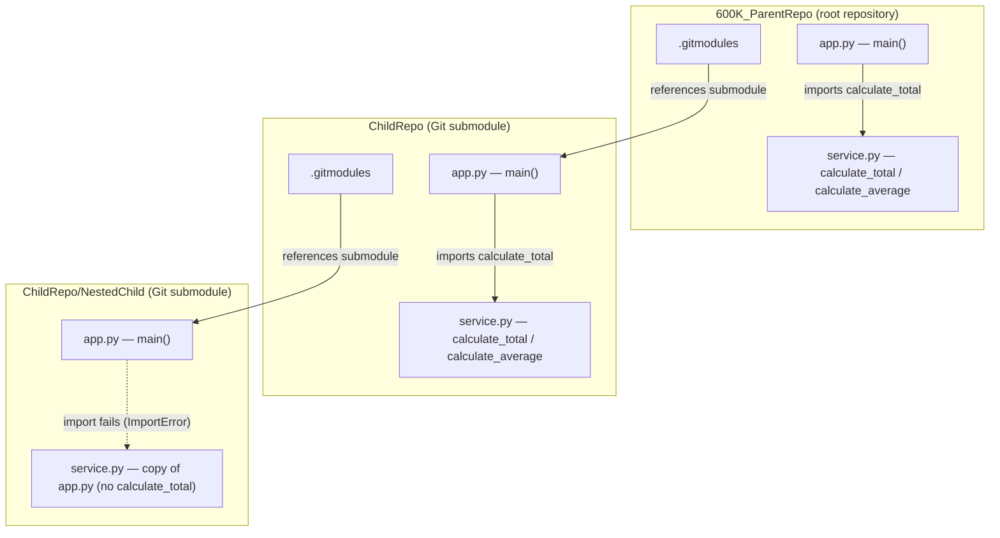
```mermaid
flowchart TD
    subgraph Parent["600K_ParentRepo (root repository)"]
        direction TB
        PGit[".gitmodules"]
        PApp["app.py — main()"]
        PSvc["service.py — calculate_total / calculate_average"]
        PApp -->|"imports calculate_total"| PSvc
    end
    subgraph Child["ChildRepo (Git submodule)"]
        direction TB
        CGit[".gitmodules"]
        CApp["app.py — main()"]
        CSvc["service.py — calculate_total / calculate_average"]
        CApp -->|"imports calculate_total"| CSvc
    end
    subgraph Nested["ChildRepo/NestedChild (Git submodule)"]
        direction TB
        NApp["app.py — main()"]
        NSvc["service.py — copy of app.py (no calculate_total)"]
        NApp -.->|"import fails (ImportError)"| NSvc
    end
    PGit -->|"references submodule"| CApp
    CGit -->|"references submodule"| NApp
```

**Core technical approach.** The design applies a straightforward separation of concerns: `app.py` is a thin orchestrator that delegates arithmetic to `service.py`, whose functions are pure (no I/O, no shared mutable state, no side effects beyond their return values). The program is standard-library-only and portable across Python 3.6+ (the sole version-sensitive feature is f-string formatting in `app.py`). Repository composition is achieved with native Git submodules nested two levels deep, with each level intended to mirror the same minimal two-file structure.

### 1.2.3 Success Criteria

The repository does **not** define any formal objectives, service-level agreements (SLAs), or key performance indicators (KPIs) — there are no performance budgets, monitoring hooks, benchmarks, or acceptance tests anywhere in the codebase. No KPIs are therefore asserted here. What can be stated are the objectively verifiable behaviors observed by executing the code, which serve as the only de-facto acceptance criteria:

| Verifiable behavior (observed) | Expected result |
| --- | --- |
| Run root `python app.py` | Prints `Total: 100`, then `10`, `20`, `30`, `40`, then `Application completed`; exits successfully |
| Run `ChildRepo/app.py` | Produces output identical to the root program |
| `calculate_total([10, 20, 30, 40])` | Returns `100` (empty input returns `0`) |
| `calculate_average(numbers)` | Returns `calculate_total(numbers) / len(numbers)`; returns `0` for empty/falsy input |

**Critical success factor.** Correct execution depends on each `app.py` being co-located with a `service.py` that actually defines `calculate_total`. This factor is satisfied at the root and `ChildRepo` levels but violated at `ChildRepo/NestedChild`, where `service.py` is a copy of `app.py`; consequently `NestedChild/app.py` fails at import time with a circular-import `ImportError`. Full success of the demonstration across all three levels is therefore not currently achieved.

## 1.3 Scope

This section delimits what the repository actually implements (in-scope) versus what it deliberately or incidentally does not (out-of-scope). Both lists are derived strictly from the files present and their observed behavior; the repository contains no scope statement, roadmap, or requirements document, so no forward-looking commitments are inferred.

### 1.3.1 In-Scope

**Core features and functionalities.** The following capabilities are implemented and constitute the whole of the system's behavior:

| Element | In-scope detail |
| --- | --- |
| Summation capability | `calculate_total(numbers)` in `service.py` — the reusable primitive invoked by the workflow; returns the accumulated sum (`0` for empty input) |
| Average capability | `calculate_average(numbers)` in `service.py` — defined and available for reuse; returns `0` for falsy input, otherwise sum ÷ count |
| Primary user workflow | `main()` in `app.py` — sums the fixed list `[10, 20, 30, 40]` and prints `Total: 100`, each number, and `Application completed` |
| Essential integration | Intra-repository import `from service import calculate_total`; source-level composition via nested Git submodules declared in `.gitmodules` |
| Key technical requirements | Python 3.6+ runtime; standard library only; no build, packaging, or dependency-installation step |

**Implementation boundaries.** The system's operating envelope is intentionally narrow:

| Boundary dimension | Coverage (as evidenced) |
| --- | --- |
| System boundary | Single-process, run-to-completion Python script that writes only to standard output; no arguments, configuration, network, or persistence |
| User groups covered | Developers who execute or read the example; no authentication, authorization, or multi-user concepts |
| Geographic / market coverage | Not applicable — no localization, deployment target, or market scope is documented |
| Data domains included | A single in-memory list of integers (`[10, 20, 30, 40]`); no external data source is read |

### 1.3.2 Out-of-Scope

**Excluded and absent capabilities.** The repository implements none of the following, and this specification treats them as out-of-scope:

| Area | Status (as evidenced) |
| --- | --- |
| Input handling (CLI args, stdin, files) | Out of scope — input is hard-coded; no argument parsing or file/stdin I/O exists |
| Error handling & logging | Out of scope — no validation, `try`/`except`, or logging anywhere |
| Configuration & environment | Out of scope — no config files, environment variables, or runtime flags |
| Persistence, database, network / API | Out of scope — no such code and zero external dependencies |
| Concurrency / asynchronous execution | Out of scope — all functions are synchronous |
| Packaging, tests, CI/CD, containerization | Out of scope — no manifests, test suite, pipelines, or `Dockerfile` |

**Data excluded by policy.** CSV data files (pattern `*.csv`, including the ~16 MB `large.csv` present at every level) are excluded from documentation and use per the repository's `.blitzyignore` files; no code reads them in any case.

**Capabilities present but not exercised, and unsupported use cases.**

- `calculate_average` is defined in `service.py` but is never invoked by any entry point; its execution is outside the demonstrated workflow.
- The `ChildRepo/NestedChild` demonstration is an unsupported use case: its `service.py` is a copy of `app.py` and lacks `calculate_total`, so `NestedChild/app.py` fails at import time with a circular-import `ImportError`.
- Any use requiring variable, user-supplied, or streamed input is unsupported, because the workflow operates exclusively on the hard-coded list.

**Future-phase considerations.** The repository documents no roadmap, backlog, milestone, or `TODO`/`FIXME` markers. No future phases are committed within the codebase, and none are asserted here; the observed `NestedChild` defect is recorded above as a factual current-state finding rather than a planned enhancement.

## 1.4 References

The following repository files, folders, and metadata were inspected as evidence for this Introduction. No external web sources were used.

**Root repository (`600K_ParentRepo`)**

- `README.md` — one-line title (`# app.py`); established the absence of narrative documentation.
- `app.py` — entry point defining `main()` under the `__main__` guard; established the fixed-list summation workflow and stdout output.
- `service.py` — established the `calculate_total` and `calculate_average` function definitions and their pure behavior.
- `.gitmodules` — established the `ChildRepo` submodule declaration and its remote URL.
- `.blitzyignore` — established the `*.csv` exclusion rule honored throughout this section.

**First-level submodule (`ChildRepo/`)**

- `ChildRepo/` — folder; the first nested Git submodule mirroring the root structure.
- `ChildRepo/README.md` — one-line title (`# 600K_ChildRepo`).
- `ChildRepo/app.py` — verified byte-identical to the root `app.py` (identical successful runtime output).
- `ChildRepo/service.py` — verified byte-identical to the root `service.py`.
- `ChildRepo/.gitmodules` — established the `NestedChild` submodule declaration and its remote URL.

**Second-level submodule (`ChildRepo/NestedChild/`)**

- `ChildRepo/NestedChild/` — folder; the deepest nested Git submodule.
- `ChildRepo/NestedChild/README.md` — one-line title (`# 600K_Nested_ChildRepo`).
- `ChildRepo/NestedChild/app.py` — verified byte-identical to the root `app.py`.
- `ChildRepo/NestedChild/service.py` — verified byte-identical to `app.py` (the defect: no `calculate_total`, causing the circular-import `ImportError`).

**Repository metadata**

- Git history and configuration (branch `2007_01`, six-commit log, `git submodule status --recursive`, origin remote) — established the scaffolding nature of the project and the nested-submodule topology.
- Runtime execution of `app.py` at each level with Python 3.12.3 — established the verified output and the `NestedChild` failure.

# 2. Product Requirements

## 2.1 Feature Catalog

This section decomposes the repository into discrete, testable features. Because the codebase is a minimal Python list-summation demonstration organized as a three-level Git-submodule chain (see Section 1.2 System Overview), the feature set is small and every feature below is traced directly to observed source files and verified runtime behavior. No business, product, or requirements documentation exists in the repository — each `README.md` contains only a one-line title — so "Business Value" and "User Benefits" are framed in the illustrative/technical terms the code actually supports rather than as commercial claims. No features are inferred beyond what the code implements.

**Feature summary**

| Feature ID | Feature Name | Feature Category | Priority |
| --- | --- | --- | --- |
| F-001 | List Summation Service | Core Calculation Service | Critical |
| F-002 | Arithmetic Mean (Average) Service | Core Calculation Service | Low |
| F-003 | Fixed-List Summation Workflow (Entry Point) | Application Workflow | Critical |
| F-004 | Nested Git Submodule Composition | Repository Composition (build-time) | Medium |

All four features are present and committed on branch `2007_01`; their catalog `Status` is therefore `Completed`, with two documented caveats recorded in the relevant entries: F-002 is implemented but not invoked by any entry point, and the deepest instance of F-004 (`ChildRepo/NestedChild`) is defective.

### 2.1.1 F-001 — List Summation Service

**Feature Metadata**

| Attribute | Value |
| --- | --- |
| Unique ID | F-001 |
| Feature Name | List Summation Service |
| Feature Category | Core Calculation Service |
| Priority Level | Critical |
| Status | Completed |

**Description**

- **Overview:** The function `calculate_total(numbers)` in `service.py` initializes an accumulator to `0`, iterates the supplied iterable adding each element, and returns the accumulated sum. It is defined identically at `service.py` (root) and `ChildRepo/service.py`. Verified behavior: `calculate_total([10, 20, 30, 40])` returns `100`; empty input returns `0`.
- **Business Value:** None is documented in the repository. Judged on the code alone, this is the single reusable arithmetic primitive on which the demonstration's only executed output depends, so it carries the highest intrinsic importance in the codebase.
- **User Benefits:** A developer can import one dependency-free function and reuse it directly; the `total = 0` initialization means empty input yields `0` rather than an error, so callers need no special-casing.
- **Technical Context:** A pure function — no I/O, no side effects, no shared mutable state — implemented with a linear (`O(n)`) accumulation loop using only the Python standard library. It is the common primitive reused by both the workflow (F-003, via import) and the average service (F-002, via internal call).

**Dependencies**

| Dependency Type | Detail |
| --- | --- |
| Prerequisite Features | None |
| System Dependencies | Python 3.6+ runtime (standard library only; observed executing under Python 3.12.3) |
| External Dependencies | None — zero third-party packages |
| Integration Requirements | Must be importable as a module named `service`; consumed via the statement `from service import calculate_total` |

### 2.1.2 F-002 — Arithmetic Mean (Average) Service

**Feature Metadata**

| Attribute | Value |
| --- | --- |
| Unique ID | F-002 |
| Feature Name | Arithmetic Mean (Average) Service |
| Feature Category | Core Calculation Service |
| Priority Level | Low |
| Status | Completed (implemented but not invoked by any entry point) |

**Description**

- **Overview:** The function `calculate_average(numbers)` in `service.py` returns `0` for falsy/empty input; otherwise it returns `calculate_total(numbers) / len(numbers)`. It is defined at `service.py:10` and `ChildRepo/service.py:10`. It is **not** present in `ChildRepo/NestedChild/service.py`, whose contents are a copy of `app.py`.
- **Business Value:** None is documented. Its illustrative value is demonstrating function composition — reuse of the F-001 primitive within a second calculation.
- **User Benefits:** Available for import and reuse; the leading `if not numbers: return 0` guard avoids a division-by-zero error on empty input.
- **Technical Context:** A pure function that depends on F-001. Repository-wide search confirms it is never imported or called by any `app.py` or other module, so it is unexercised by the demonstrated workflow (effectively dead code relative to the entry point).

**Dependencies**

| Dependency Type | Detail |
| --- | --- |
| Prerequisite Features | F-001 (its return value is computed by calling `calculate_total`) |
| System Dependencies | Python 3.6+ runtime (standard library only) |
| External Dependencies | None |
| Integration Requirements | Must be co-located with `calculate_total` in the same `service` module; no caller currently integrates it |

### 2.1.3 F-003 — Fixed-List Summation Workflow (Entry Point)

**Feature Metadata**

| Attribute | Value |
| --- | --- |
| Unique ID | F-003 |
| Feature Name | Fixed-List Summation Workflow (Entry Point) |
| Feature Category | Application Workflow |
| Priority Level | Critical |
| Status | Completed |

**Description**

- **Overview:** The `main()` function in `app.py` defines the hard-coded list `[10, 20, 30, 40]`, computes its total via `calculate_total`, prints `Total: 100`, prints each element on its own line, and prints the sentinel line `Application completed`. Execution is gated by an `if __name__ == "__main__": main()` guard. The file is byte-identical at all three levels.
- **Business Value:** None is documented. This is the single end-to-end demonstration path — the only behavior a user observes when running the project.
- **User Benefits:** Running `python app.py` produces deterministic output and exits successfully with no arguments, configuration, or dependency installation required.
- **Technical Context:** A thin orchestrator that delegates all arithmetic to `service.py` and writes only to standard output; it performs no input handling, error handling, configuration, or persistence. At the `ChildRepo/NestedChild` level the identical entry point cannot run because the co-located `service` module lacks `calculate_total`.

**Process flow (verified runtime behavior)**

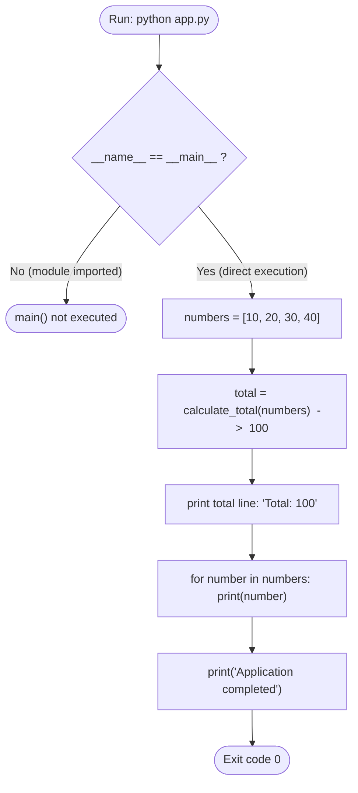
```mermaid
flowchart TD
    Start(["Run: python app.py"]) --> Guard{"__name__ == __main__ ?"}
    Guard -->|"No (module imported)"| Skip(["main() not executed"])
    Guard -->|"Yes (direct execution)"| Init["numbers = [10, 20, 30, 40]"]
    Init --> Call["total = calculate_total(numbers)  ->  100"]
    Call --> P1["print total line: 'Total: 100'"]
    P1 --> Loop["for number in numbers: print(number)"]
    Loop --> Done["print('Application completed')"]
    Done --> Exit(["Exit code 0"])
```

**Dependencies**

| Dependency Type | Detail |
| --- | --- |
| Prerequisite Features | F-001 (imports and calls `calculate_total`) |
| System Dependencies | Python 3.6+ runtime (f-string formatting); standard-output stream |
| External Dependencies | None |
| Integration Requirements | Must be co-located with a `service.py` that defines `calculate_total` (satisfied at root and `ChildRepo`; violated at `ChildRepo/NestedChild`) |

### 2.1.4 F-004 — Nested Git Submodule Composition

**Feature Metadata**

| Attribute | Value |
| --- | --- |
| Unique ID | F-004 |
| Feature Name | Nested Git Submodule Composition |
| Feature Category | Repository Composition (build-time structure) |
| Priority Level | Medium |
| Status | Completed (parent and `ChildRepo` faithful; `NestedChild` instance defective) |

**Description**

- **Overview:** The root `.gitmodules` declares submodule `ChildRepo` (path `ChildRepo`, remote `https://github.com/lakshya-blitzy/600K_ChildRepo.git`); `ChildRepo/.gitmodules` declares submodule `NestedChild` (path `NestedChild`, remote `https://github.com/lakshya-blitzy/600K_Nested_ChildRepo.git`). Each of the three levels is intended to mirror the same two-file (`app.py` + `service.py`) structure. `ChildRepo/NestedChild` itself has no `.gitmodules` (it is the leaf).
- **Business Value:** None is documented. Its illustrative value is demonstrating repository composition through native Git submodules nested two levels deep.
- **User Benefits:** Provides a concrete example of nesting repositories and reusing an identical module layout across levels.
- **Technical Context:** This is a source-composition-level integration only; there is no runtime coupling between the levels (each `app.py` imports only its own sibling `service.py`). The deepest level does not faithfully reproduce the structure: `ChildRepo/NestedChild/service.py` is a byte-for-byte copy of `app.py`, so `calculate_total` is missing there.

**Dependencies**

| Dependency Type | Detail |
| --- | --- |
| Prerequisite Features | None (this feature encapsulates and replicates F-001, F-002, and F-003 at each level) |
| System Dependencies | Git with submodule support |
| External Dependencies | GitHub-hosted submodule remotes `600K_ChildRepo` and `600K_Nested_ChildRepo` (both under the `lakshya-blitzy` account) |
| Integration Requirements | `.gitmodules` `path`/`url` entries at the root and `ChildRepo` levels; population requires `git submodule update --init --recursive` (and network access to the remotes) |

## 2.2 Functional Requirements Table

Each feature from Section 2.1 is expanded below into numbered, testable requirements using the identifier format `F-XXX-RQ-YYY`. Every requirement's acceptance criteria are stated in terms of behavior verified by directly executing the code (Python 3.12.3) or by inspecting the tracked files. A repository-wide observation that applies to **all** features and is therefore not repeated verbosely per row: the codebase contains **no input validation, no error handling, no logging, no authentication/authorization, no compliance controls, and no documented performance budgets, SLAs, or KPIs**. Where a "Performance & Validation" row below reads "None," that absence was verified, not assumed.

### 2.2.1 F-001 — List Summation Service

**Requirement Details**

| Requirement ID | Description | Priority | Complexity |
| --- | --- | --- | --- |
| F-001-RQ-001 | Return the arithmetic sum of the numeric elements of the input iterable | Must-Have | Low |
| F-001-RQ-002 | Return `0` when the input iterable is empty | Should-Have | Low |

**Technical Specifications**

| Requirement ID | Input Parameters | Output / Response | Data Requirements |
| --- | --- | --- | --- |
| F-001-RQ-001 | `numbers` — an in-memory iterable of numeric values | The accumulated sum (an `int` when all inputs are `int`, e.g. `100`) | Single in-memory iterable; no external data source |
| F-001-RQ-002 | `numbers` — an empty iterable (`[]`) | `0` | None |

**Acceptance Criteria (testable)**

- **F-001-RQ-001:** `calculate_total([10, 20, 30, 40])` returns `100`; confirmed end-to-end by running `python app.py`, which prints `Total: 100`.
- **F-001-RQ-002:** `calculate_total([])` returns `0`, because the accumulator is initialized to `0` and the `for` loop body never executes.

**Performance & Validation**

| Dimension | As Evidenced |
| --- | --- |
| Performance Criteria | None documented; algorithmic behavior is a single `O(n)` accumulation pass |
| Business Rules | Empty input yields `0` (accumulator starts at `0`) |
| Data Validation | None — no type or range checks; a non-numeric element would raise an unhandled `TypeError` at runtime |
| Security Requirements | None documented; pure in-memory computation with no I/O |
| Compliance Requirements | None documented |

### 2.2.2 F-002 — Arithmetic Mean (Average) Service

**Requirement Details**

| Requirement ID | Description | Priority | Complexity |
| --- | --- | --- | --- |
| F-002-RQ-001 | Return the arithmetic mean (sum ÷ count) of a non-empty input iterable | Could-Have | Low |
| F-002-RQ-002 | Return `0` for falsy/empty input (division-by-zero guard) | Should-Have | Low |

**Technical Specifications**

| Requirement ID | Input Parameters | Output / Response | Data Requirements |
| --- | --- | --- | --- |
| F-002-RQ-001 | `numbers` — a non-empty in-memory iterable of numeric values | Quotient of `calculate_total(numbers) / len(numbers)` (a `float`, e.g. `25.0`) | Single in-memory iterable; no external data source |
| F-002-RQ-002 | `numbers` — a falsy value such as `[]` | `0` | None |

**Acceptance Criteria (testable)**

- **F-002-RQ-001:** `calculate_average([10, 20, 30, 40])` returns `25.0` (computed as `100 / 4`). Note: this function is not invoked by any entry point, so the criterion is verified by direct call rather than through the `app.py` workflow.
- **F-002-RQ-002:** `calculate_average([])` returns `0` via the leading `if not numbers: return 0` guard, so no division by zero occurs.

**Performance & Validation**

| Dimension | As Evidenced |
| --- | --- |
| Performance Criteria | None documented; `O(n)` (delegates summation to `calculate_total`) |
| Business Rules | Falsy/empty input yields `0` (explicit guard) |
| Data Validation | Guard on falsy input only; no numeric-type checks |
| Security Requirements | None documented; pure in-memory computation with no I/O |
| Compliance Requirements | None documented |

### 2.2.3 F-003 — Fixed-List Summation Workflow (Entry Point)

**Requirement Details**

| Requirement ID | Description | Priority | Complexity |
| --- | --- | --- | --- |
| F-003-RQ-001 | Compute the total of the hard-coded list and print it as the first output line | Must-Have | Low |
| F-003-RQ-002 | Print each element of the list on its own line | Must-Have | Low |
| F-003-RQ-003 | Print the completion sentinel, run only under the `__main__` guard, and exit successfully | Should-Have | Low |

**Technical Specifications**

| Requirement ID | Input Parameters | Output / Response | Data Requirements |
| --- | --- | --- | --- |
| F-003-RQ-001 | None (hard-coded list `[10, 20, 30, 40]`) | Standard-output line `Total: 100` | The fixed in-memory list `[10, 20, 30, 40]` |
| F-003-RQ-002 | None (iterates the same fixed list) | Standard-output lines `10`, `20`, `30`, `40` | The same fixed list |
| F-003-RQ-003 | None | Final line `Application completed`; process exit code `0` | None |

**Acceptance Criteria (testable)**

- **F-003-RQ-001:** Running `python app.py` prints `Total: 100` as the first line.
- **F-003-RQ-002:** The next four lines are `10`, `20`, `30`, and `40`, each on its own line, in order.
- **F-003-RQ-003:** The final line is `Application completed`; the process exits with code `0`; and importing the module (rather than running it) produces no output because `main()` executes only under `if __name__ == "__main__"`. (At `ChildRepo/NestedChild`, this workflow fails at import time — see F-004-RQ-003.)

**Performance & Validation**

| Dimension | As Evidenced |
| --- | --- |
| Performance Criteria | None documented; a single run-to-completion pass over a constant 4-element workload |
| Business Rules | Operates exclusively on the hard-coded list; output is deterministic |
| Data Validation | None — there is no argument, stdin, or file input to validate |
| Security Requirements | None documented; writes only to stdout and accepts no external input |
| Compliance Requirements | None documented |

### 2.2.4 F-004 — Nested Git Submodule Composition

**Requirement Details**

| Requirement ID | Description | Priority | Complexity |
| --- | --- | --- | --- |
| F-004-RQ-001 | Root repository declares the `ChildRepo` submodule with its path and remote URL | Must-Have | Low |
| F-004-RQ-002 | `ChildRepo` declares the `NestedChild` submodule with its path and remote URL | Must-Have | Low |
| F-004-RQ-003 | Each level reproduces the two-file (`app.py` + `service.py`) structure | Should-Have | Medium |

**Technical Specifications**

| Requirement ID | Input Parameters | Output / Response | Data Requirements |
| --- | --- | --- | --- |
| F-004-RQ-001 | Root `.gitmodules` | Entry `[submodule "ChildRepo"]` with `path = ChildRepo` and `url = .../600K_ChildRepo.git` | Git submodule metadata + pinned commit |
| F-004-RQ-002 | `ChildRepo/.gitmodules` | Entry `[submodule "NestedChild"]` with `path = NestedChild` and `url = .../600K_Nested_ChildRepo.git` | Git submodule metadata + pinned commit |
| F-004-RQ-003 | The tracked `app.py`/`service.py` files at each level | Matching two-file structure at each level | The six tracked Python files |

**Acceptance Criteria (testable)**

- **F-004-RQ-001:** The root `.gitmodules` contains the `ChildRepo` submodule stanza with the stated path and GitHub remote (verified).
- **F-004-RQ-002:** `ChildRepo/.gitmodules` contains the `NestedChild` submodule stanza with the stated path and GitHub remote (verified); `ChildRepo/NestedChild` has no `.gitmodules` (it is the leaf).
- **F-004-RQ-003:** `app.py` is byte-identical (MD5 `a7f6989…`) at all three levels and `service.py` is byte-identical (MD5 `12093c1…`) at the root and `ChildRepo`. **Known failure:** `ChildRepo/NestedChild/service.py` is a byte-for-byte copy of `app.py` (MD5 `a7f6989…`) and therefore does not define `calculate_total`; running `ChildRepo/NestedChild/app.py` raises a circular-import `ImportError`. The mirror is thus faithfully reproduced only at the root and `ChildRepo` levels.

**Performance & Validation**

| Dimension | As Evidenced |
| --- | --- |
| Performance Criteria | Not applicable — build-time composition, not a runtime path |
| Business Rules | Each submodule is referenced at a pinned commit; the leaf level carries no `.gitmodules` |
| Data Validation | None — Git does not validate that a submodule's `service.py` defines `calculate_total`, which is exactly the unguarded condition that the `NestedChild` defect violates |
| Security Requirements | None documented; submodule remotes are public GitHub HTTPS URLs |
| Compliance Requirements | None documented |

## 2.3 Feature Relationships

The relationships below are limited to those directly evidenced in the source code. Because the entire repository contains exactly one import statement (`from service import calculate_total`) and one internal cross-function call, the dependency graph is small and unambiguous. Two relationship kinds are distinguished: **runtime dependencies** (a feature executes another's code) and **build-time composition** (a feature packages another's code without runtime coupling).

### 2.3.1 Feature Dependency Map

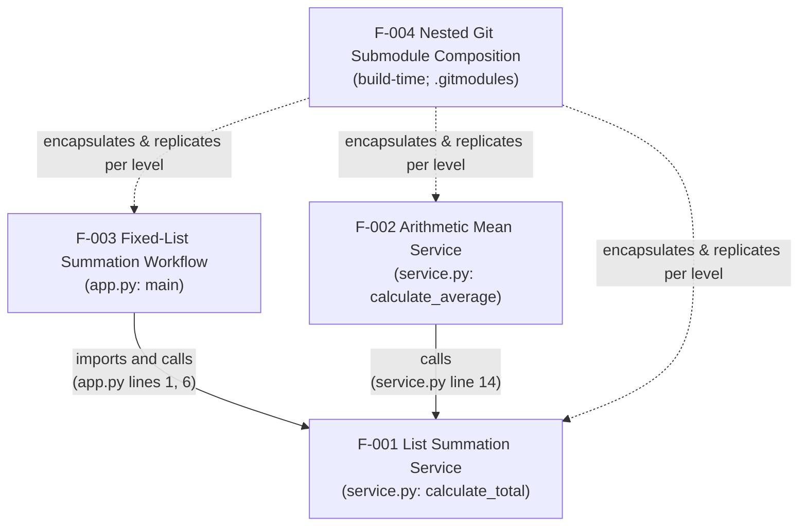
```mermaid
flowchart TD
    F004["F-004 Nested Git Submodule Composition<br/>(build-time; .gitmodules)"]
    F003["F-003 Fixed-List Summation Workflow<br/>(app.py: main)"]
    F002["F-002 Arithmetic Mean Service<br/>(service.py: calculate_average)"]
    F001["F-001 List Summation Service<br/>(service.py: calculate_total)"]

    F003 -->|"imports and calls<br/>(app.py lines 1, 6)"| F001
    F002 -->|"calls<br/>(service.py line 14)"| F001
    F004 -.->|"encapsulates &amp; replicates per level"| F003
    F004 -.->|"encapsulates &amp; replicates per level"| F002
    F004 -.->|"encapsulates &amp; replicates per level"| F001
```

Solid arrows denote runtime dependencies; dashed arrows denote build-time encapsulation. The map shows F-001 as the sole shared dependency: it has no prerequisites of its own, while both F-003 (via module import) and F-002 (via an internal call) depend on it. F-004 is a structural feature that contains the other three at each submodule level but introduces no runtime edges between levels.

| Dependent Feature | Depends On | Relationship Type | Evidence |
| --- | --- | --- | --- |
| F-003 | F-001 | Runtime module import + call | `from service import calculate_total` (`app.py:1`); `calculate_total(numbers)` (`app.py:6`) |
| F-002 | F-001 | Intra-module function call | `calculate_total(numbers)` (`service.py:14`) |
| F-004 | F-001, F-002, F-003 | Build-time encapsulation (per-level replication) | root `.gitmodules`, `ChildRepo/.gitmodules`; identical file sets per level |

There is **no** evidenced relationship between F-002 and F-003: the workflow never calls `calculate_average`, and the average function is not part of the executed path.

### 2.3.2 Integration Points

| Integration Point | Mechanism | Evidence |
| --- | --- | --- |
| Workflow → Summation | Python module import resolving `service` as a sibling module, then a direct function call | `app.py:1` (import), `app.py:6` (call) |
| Average → Summation | In-module function call within `service.py` | `service.py:14` |
| Parent → child source composition | Git submodule reference (path + remote URL) in `.gitmodules` | root `.gitmodules` (`ChildRepo`), `ChildRepo/.gitmodules` (`NestedChild`) |

A critical negative finding: there is **no cross-repository or inter-level runtime integration**. Each `app.py` resolves `service` only from its own directory; no code imports from a parent or child submodule. This is why the `ChildRepo/NestedChild` defect is contained to that level — it breaks only `NestedChild/app.py`, not the root or `ChildRepo` programs.

### 2.3.3 Shared Components and Common Services

| Shared Element | Type | Consumed By |
| --- | --- | --- |
| `service.py` | Module (calculation utility) | F-003 imports it; F-001 and F-002 are defined within it |
| `calculate_total` | Function (common primitive) | F-003 (via import) and F-002 (via internal call) |
| `app.py` `main()` pattern | Entry-point convention | F-003 at each level; replicated by F-004 |

**Common services.** The single common service in the system is the `calculate_total` primitive (F-001). It sits at the center of the dependency map: the workflow depends on it and the average function is built on top of it. `service.py` is the shared component that houses the calculation logic, and the `app.py` entry-point pattern is the shared orchestration convention that F-004 replicates across the three submodule levels — faithfully at the root and `ChildRepo`, and defectively at `ChildRepo/NestedChild` (where `service.py` is a copy of `app.py` and thus provides no shared `calculate_total`).

## 2.4 Implementation Considerations

The considerations below are derived from the observed implementation, not from any design document (none exists). Several constraints are **cross-cutting** and apply to every feature: the code requires Python 3.6+ (f-string usage in `app.py`), uses the standard library only (zero third-party packages), has no build/packaging step, no automated tests, no CI configuration, and no logging or error handling. Execution is single-process, synchronous, and deterministic. These shared constraints are referenced rather than repeated in each feature table below.

### 2.4.1 F-001 — List Summation Service

| Consideration | Detail (as evidenced) |
| --- | --- |
| Technical Constraints | Standard-library-only pure function; relies on `total += number` with `total` initialized to `int` `0`, so elements must support numeric addition; no type guarding is present |
| Performance Requirements | None documented; behavior is a single `O(n)` accumulation pass, adequate for the small in-memory inputs used |
| Scalability Considerations | Operates entirely in memory and synchronously; bounded by the caller-supplied iterable; no streaming, chunking, or parallelism |
| Security Implications | Minimal attack surface — no I/O and no external input; however, the absence of input validation means a non-numeric element would raise an unhandled `TypeError` |
| Maintenance Requirements | Defined in two locations (`service.py` and `ChildRepo/service.py`); edits must be duplicated to keep the copies consistent, and there are no tests to detect regressions |

### 2.4.2 F-002 — Arithmetic Mean (Average) Service

| Consideration | Detail (as evidenced) |
| --- | --- |
| Technical Constraints | Depends on F-001 (`calculate_total`); returns a `float` from `/` division; carries the same implicit numeric-type assumption |
| Performance Requirements | None documented; `O(n)` overall (one summation pass plus `len`) |
| Scalability Considerations | Same profile as F-001 — in-memory and synchronous; no large-input handling |
| Security Implications | Same minimal surface; the `if not numbers` guard prevents `ZeroDivisionError`, but no other validation exists |
| Maintenance Requirements | Unexercised by any caller, creating a risk of silent drift; duplicated across `service.py`/`ChildRepo/service.py`; absent entirely from `ChildRepo/NestedChild/service.py`; no tests |

### 2.4.3 F-003 — Fixed-List Summation Workflow (Entry Point)

| Consideration | Detail (as evidenced) |
| --- | --- |
| Technical Constraints | Requires f-string support (Python 3.6+); must be co-located with a `service.py` that defines `calculate_total`; input is hard-coded, so there are no arguments, stdin, or file inputs |
| Performance Requirements | None documented; a constant 4-element workload executed once to completion |
| Scalability Considerations | Single-process, single-run, no concurrency or asynchronous execution; output volume is fixed |
| Security Implications | Writes only to standard output and consumes no external input; with no error handling, an import failure is uncaught — exactly the outcome observed at `ChildRepo/NestedChild` |
| Maintenance Requirements | The entry point is triplicated (three byte-identical `app.py` files); any change must be propagated to all three levels; no tests or CI guard the behavior |

### 2.4.4 F-004 — Nested Git Submodule Composition

| Consideration | Detail (as evidenced) |
| --- | --- |
| Technical Constraints | Requires Git submodule support and two-level nesting; populating the tree needs network access to the GitHub remotes and `git submodule update --init --recursive` |
| Performance Requirements | Not applicable — this is a build-time composition concern, not a runtime execution path |
| Scalability Considerations | Each added level multiplies the duplicated files; there is no code-sharing mechanism between levels — every level is a full copy of the same two files |
| Security Implications | Submodule remotes are public GitHub HTTPS URLs referenced at pinned commits; there is no verification of submodule contents, which is why the defective `NestedChild` copy was integrated undetected |
| Maintenance Requirements | Highest maintenance burden in the system — six near-duplicate files kept in sync across three repositories; the outstanding `NestedChild` defect (its `service.py` is a copy of `app.py`) causes a reproducible `ImportError` and must be corrected by restoring a `service.py` that defines `calculate_total` |

## 2.5 Traceability Matrix and Requirement Governance

This sub-section links every requirement to its source evidence and verification method, records how the requirements are versioned, and states the assumptions and constraints under which they were derived. All line references are to the tracked files on branch `2007_01` at commit `c77daf2`.

### 2.5.1 Requirements Traceability Matrix

**Feature-to-requirement coverage**

| Feature ID | Requirement IDs | Primary Source |
| --- | --- | --- |
| F-001 | F-001-RQ-001, F-001-RQ-002 | `service.py` |
| F-002 | F-002-RQ-001, F-002-RQ-002 | `service.py` |
| F-003 | F-003-RQ-001, F-003-RQ-002, F-003-RQ-003 | `app.py` |
| F-004 | F-004-RQ-001, F-004-RQ-002, F-004-RQ-003 | `.gitmodules` (+ per-level files) |

**Requirement traceability**

| Requirement ID | Feature | Source Evidence | Verification Method |
| --- | --- | --- | --- |
| F-001-RQ-001 | F-001 | `service.py:1-7` (`calculate_total`) | Dynamic — `python app.py` prints `Total: 100` |
| F-001-RQ-002 | F-001 | `service.py:2,4-5` (accumulator + loop) | Static — code inspection (`total = 0`, empty loop) |
| F-002-RQ-001 | F-002 | `service.py:14` (`calculate_total(numbers) / len(numbers)`) | Dynamic — direct call returns `25.0` |
| F-002-RQ-002 | F-002 | `service.py:11-12` (`if not numbers: return 0`) | Static — code inspection of the guard |
| F-003-RQ-001 | F-003 | `app.py:4,6,8` (fixed list, call, print total) | Dynamic — first stdout line is `Total: 100` |
| F-003-RQ-002 | F-003 | `app.py:10-11` (loop printing each element) | Dynamic — stdout lines `10`, `20`, `30`, `40` |
| F-003-RQ-003 | F-003 | `app.py:13,15-16` (sentinel + `__main__` guard) | Dynamic — last line `Application completed`, exit `0`; import yields no output |
| F-004-RQ-001 | F-004 | root `.gitmodules` (`ChildRepo` stanza) | Static — file inspection |
| F-004-RQ-002 | F-004 | `ChildRepo/.gitmodules` (`NestedChild` stanza) | Static — file inspection |
| F-004-RQ-003 | F-004 | `app.py` / `service.py` at all three levels | MD5 comparison + dynamic run (`NestedChild/app.py` → `ImportError`) |

Every requirement traces to a concrete file and a repeatable verification method; the only requirement with a verified negative outcome is F-004-RQ-003 at the `NestedChild` level.

### 2.5.2 Requirement Versioning

The repository carries no requirements document, roadmap, semantic version, release tag, or `CHANGELOG` (`git tag` returns nothing and no version/release files exist). The requirements in this section are therefore a **baseline (v1.0)** reverse-engineered from the tracked source at the commit below; any change to the six tracked Python files or the two `.gitmodules` descriptors invalidates the affected acceptance criteria and requires re-baselining.

| Governance Item | Value (as evidenced) |
| --- | --- |
| Requirements baseline version | 1.0 (reverse-engineered from current source) |
| Source branch | `2007_01` |
| Source commit (HEAD) | `c77daf2` — "Add child submodule" |
| Total commits in history | 6 |
| Release tags / CHANGELOG | None present |
| Version control | Git, with two nested submodules (`ChildRepo`, `ChildRepo/NestedChild`) |

### 2.5.3 Assumptions and Constraints

**Assumptions**

| ID | Assumption |
| --- | --- |
| A-01 | The four catalogued features constitute the complete functional surface — supported by exhaustive inspection (only six `.py` files and a single import statement repository-wide) |
| A-02 | The `Completed` status reflects committed presence in the repository, because no issue tracker, roadmap, or formal sign-off exists |
| A-03 | Priority and complexity ratings are relative to the demonstration's single executed path (F-001 and F-003 are Critical as the only working end-to-end path; F-002 is Low because it is unexercised) |
| A-04 | The numeric-input expectation of `calculate_total`/`calculate_average` is inferred from the only observed input (`[10, 20, 30, 40]`); no type contract is declared in code |

**Constraints**

| ID | Constraint |
| --- | --- |
| C-01 | No requirements, design, roadmap, or tests exist in the repository; requirements are reverse-engineered and testable only against observed behavior |
| C-02 | CSV files (e.g., `large.csv` at each level) are excluded from analysis by the `.blitzyignore` `*.csv` rule and are not read by any code |
| C-03 | The `ChildRepo/NestedChild` `ImportError` is a verified current-state defect, not a planned future enhancement; no roadmap or commit proposes a fix |
| C-04 | All requirements and acceptance criteria are scoped to branch `2007_01` at commit `c77daf2`; other branches were not used as evidence |

## 2.6 References

The following repository files, folders, metadata, and cross-referenced specification sections were inspected as evidence for this Product Requirements section. No external web sources were used.

**Root repository (`600K_ParentRepo`)**

- `app.py` - established F-003 (the `main()` workflow, `__main__` guard, stdout output) and the F-001 consumer via `from service import calculate_total`.
- `service.py` - established F-001 (`calculate_total`, lines 1-7) and F-002 (`calculate_average`, lines 10-14, including the internal call at line 14).
- `.gitmodules` - established F-004-RQ-001 (the `ChildRepo` submodule path and remote URL).
- `.blitzyignore` - established the `*.csv` exclusion (constraint C-02) honored throughout this section.
- `README.md` - established the absence of any business/requirements documentation (one-line title only).

**First-level submodule (`ChildRepo/`)**

- `ChildRepo/` - folder; the first nested Git submodule mirroring the root two-file structure.
- `ChildRepo/app.py` - verified byte-identical to root `app.py` (MD5 `a7f6989…`); evidence for F-004-RQ-003.
- `ChildRepo/service.py` - verified byte-identical to root `service.py` (MD5 `12093c1…`); evidence for F-004-RQ-003.
- `ChildRepo/.gitmodules` - established F-004-RQ-002 (the `NestedChild` submodule path and remote URL).
- `ChildRepo/README.md` - one-line title (`# 600K_ChildRepo`).

**Second-level submodule (`ChildRepo/NestedChild/`)**

- `ChildRepo/NestedChild/` - folder; the deepest (leaf) submodule, with no `.gitmodules`.
- `ChildRepo/NestedChild/app.py` - verified byte-identical to root `app.py`.
- `ChildRepo/NestedChild/service.py` - verified byte-identical to `app.py` (MD5 `a7f6989…`); the defect behind F-004-RQ-003's negative outcome (no `calculate_total`, causing the circular-import `ImportError`).
- `ChildRepo/NestedChild/README.md` - one-line title (`# 600K_Nested_ChildRepo`).

**Repository metadata and runtime verification**

- Git metadata (branch `2007_01`, HEAD `c77daf2`, six-commit log, empty `git tag` list, `git submodule status --recursive`) - established the versioning baseline (Section 2.5.2) and the nested-submodule topology.
- Runtime execution under Python 3.12.3 at each level - established the dynamic acceptance-criteria outcomes (root and `ChildRepo` succeed; `NestedChild/app.py` raises `ImportError`).
- Repository-wide search for imports and function usages - established the call graph in Section 2.3 (single import statement; `calculate_average` never invoked).

**Cross-referenced specification sections**

- 1.1 Executive Summary - corroborated the demonstration/scaffold characterization and the codebase-size facts.
- 1.2 System Overview - corroborated the component structure and provided the referenced component/data-flow diagram (1.2.2).
- 1.3 Scope - corroborated the in-scope capabilities and out-of-scope absences reflected in the feature set.
- 1.4 References - corroborated the evidentiary file inventory.

# 3. Technology Stack

## 3.1 Programming Languages

The system is implemented in a **single programming language — Python** — across every component and every submodule level. No other programming, scripting, templating, markup, or query language is present anywhere in the repository. The complete source inventory consists solely of `app.py` and `service.py` files (six Python source files, 92 lines in total) and their compiled bytecode, replicated at the root and at each nested submodule level.

### 3.1.1 Language Inventory by Component

Because the repository is a pure-Python demonstration with no web, mobile, native, or infrastructure tiers, the "platform/component" breakdown reduces to the two Python roles that recur at each of the three repository levels (`600K_ParentRepo` root, `ChildRepo`, and `ChildRepo/NestedChild`):

| Component / Platform | Language | File(s) per level | Role |
| --- | --- | --- | --- |
| Application entry point | Python | `app.py` | Defines `main()`; orchestrates the fixed-list workflow and writes to standard output under an `if __name__ == "__main__"` guard |
| Calculation utility module | Python | `service.py` | Provides the pure `calculate_total` / `calculate_average` functions |
| Compiled bytecode cache | CPython bytecode | `__pycache__/service.cpython-312.pyc` | Auto-generated import cache (not hand-written source) |

There is no front-end, back-end service tier, mobile application, native code, or infrastructure-definition language in the repository. Consequently, the multi-platform language categories implied by a full-stack default (web/JavaScript-TypeScript, mobile, native iOS/Android/macOS, desktop) are **not applicable** to this system — only server-side/CLI-style Python exists.

### 3.1.2 Language Version and Runtime

The prompt requires explicit version numbers. Two distinct, individually verifiable version facts apply, and both are reported because they answer different questions (the portability floor versus the toolchain that actually compiled the code):

| Attribute | Value | Evidence |
| --- | --- | --- |
| Minimum language level | **Python 3.6+** | The highest version-sensitive feature used is f-string formatting (`print(f"Total: {total}")` in `app.py`). No walrus operator (`:=`, 3.8+), `match`/`case` (3.10+), or type annotations were found that would raise the floor |
| Observed toolchain | **CPython 3.12** | Every committed `__pycache__/service.cpython-312.pyc` cache carries bytecode magic number `cb0d0d0a` (CPython 3.12), identical to the environment interpreter reported as Python 3.12.3 |
| Runtime execution model | Single-process, synchronous, run-to-completion | `main()` executes once under the `if __name__ == "__main__"` guard; no concurrency, async, or long-running process |

In short, the source is written to a conservative **Python 3.6+** minimum, while the bytecode caches present in the repository were produced by a **CPython 3.12** interpreter. This is consistent with the "Python 3.6+ runtime; standard library only" constraint recorded in the System Overview and Scope sections of this specification.

### 3.1.3 Selection Criteria, Constraints, and Dependencies

**Selection criteria (inferred from the code).** The repository contains no design document that justifies the language choice; the following rationale is inferred only from observable properties and is consistent with Python's fitness for a minimal teaching/scaffold example:

- **Zero-setup execution** — a Python source file runs directly with a system interpreter, with no compilation, build, or dependency-installation step, matching the repository's complete absence of manifests and build files.
- **Readability of a pure-function example** — the summation and average logic in `service.py` is expressed as small, side-effect-free functions, which suits Python's concise syntax and low ceremony.
- **Standard-library-only portability** — relying only on language built-ins removes any external toolchain requirement, aligning with the self-contained demonstration goal.

**Constraints and dependencies.**

- **No external language dependencies.** The only `import` statement anywhere in the repository is the intra-repository `from service import calculate_total`; there is no dependency on any third-party package, and not even a non-built-in standard-library module is imported.
- **Numeric-type assumption.** `calculate_total` relies on `total += number` with the accumulator initialized to integer `0`, so inputs must support numeric addition; there is no type guarding, and a non-numeric element would raise an unhandled `TypeError`.
- **Module co-location constraint.** Each `app.py` must sit beside a `service.py` that actually defines `calculate_total`. This holds at the root and `ChildRepo` levels but is violated at `ChildRepo/NestedChild`, where `service.py` is a byte-for-byte copy of `app.py`; executing `NestedChild/app.py` therefore fails with a circular-import `ImportError`.
- **Security posture (language level).** As a pure-computation program with no I/O, network access, or external input, the language-level attack surface is minimal; the only material caveat is the absence of input validation noted above.


## 3.2 Frameworks and Libraries

The repository uses **no application frameworks and no third-party libraries of any kind.** This is a deliberate, verifiable characteristic of the codebase — confirmed by the total absence of dependency manifests and by static inspection of every import statement — rather than a gap in this specification. The functionality is realized entirely with Python language built-ins.

### 3.2.1 Framework and Library Inventory

The table below records each framework/library category the prompt asks about, together with its verified status in this repository:

| Category | Status | Evidence |
| --- | --- | --- |
| Web / API framework (e.g., Flask, FastAPI, Django) | **Not present** | No web server, routing, WSGI/ASGI, or request-handling code; no such imports |
| Frontend / UI framework (e.g., React, TailwindCSS) | **Not present** | No JavaScript/TypeScript, HTML, or CSS files exist anywhere |
| AI / ML framework (e.g., LangChain) | **Not present** | No AI/ML imports, model code, or prompt orchestration |
| Testing framework (e.g., pytest, unittest) | **Not present** | No test files, fixtures, or test-runner configuration |
| Third-party utility libraries | **Not present** | The only import anywhere is the intra-repository `from service import calculate_total` |
| Python standard-library modules | **None imported** | No `import` of any standard-library module (e.g., `sys`, `os`, `csv`); the code uses only language built-ins (`print`, f-strings, `len`, arithmetic operators, `for`) |

None of the frameworks or libraries named in the default technology stack (Flask, LangChain, React, TailwindCSS, React-Native, ElectronJS, and the native toolkits) appear in the repository. Since no library is used, there are no framework or library **version numbers** to report — the only versioned component in the entire stack is the Python language itself (see §3.1.2).

### 3.2.2 Compatibility Requirements

Because there are no frameworks or libraries, there are **no inter-package version-compatibility constraints, dependency-resolution requirements, or transitive-dependency trees** to manage. The single compatibility requirement is the language-level one established in §3.1.2: a Python interpreter at version **3.6 or newer** (for f-string support). The code runs unchanged on the observed **CPython 3.12** toolchain, and its standard-library-only, built-in-only design makes it forward-compatible with subsequent 3.x releases without any dependency-pinning activity.

### 3.2.3 Justification

The zero-framework, zero-library approach is coherent with the repository's purpose as a minimal list-summation demonstration:

- **Fit for purpose.** The workload — summing a fixed four-element list and printing the result — needs nothing beyond built-in language constructs, so no framework or library would add value.
- **Self-containment.** Avoiding libraries keeps the example runnable with a bare interpreter and eliminates any install step, which matches the observed absence of dependency manifests and lockfiles.
- **Security benefit.** A no-dependency posture removes third-party supply-chain and known-vulnerability (CVE) exposure entirely; there are no external packages to patch, pin, mirror, or audit, and no transitive dependencies that could introduce risk.


## 3.3 Open Source Dependencies

The repository declares and consumes **zero open-source or third-party dependencies.** No package manifests, lockfiles, or vendored packages of any kind exist, and no package registry (PyPI, npm, or otherwise) is referenced. This is confirmed both by a full-tree file scan (no manifests found) and by static analysis of every import statement.

### 3.3.1 Declared Dependencies and Manifests

A scan of the root, `ChildRepo`, and `ChildRepo/NestedChild` levels found none of the dependency-declaration or lock artifacts that a Python or JavaScript project would use:

| Manifest / lockfile type | Present? | Consequence |
| --- | --- | --- |
| `requirements.txt` / `requirements*.txt` | No | No pip-installable dependency set |
| `pyproject.toml` (PEP 517/518) | No | No build-system or dependency declaration |
| `setup.py` / `setup.cfg` | No | Not packaged as a distributable |
| `Pipfile` / `Pipfile.lock` (pipenv) | No | No pipenv-managed environment |
| `poetry.lock` / any `*.lock` | No | No locked dependency graph |
| `package.json` / `package-lock.json` | No | No Node/JavaScript ecosystem dependencies |

Correspondingly, there are no `venv`, `.venv`, `node_modules`, `site-packages`, `dist`, or `build` directories anywhere in the tree.

### 3.3.2 Effective Dependency Graph

Static analysis of every `import` confirms the runtime dependency graph is entirely internal:

- The only import statement anywhere is `from service import calculate_total` — a repository-local module import, not an external package.
- No standard-library module is imported; the code relies only on Python built-ins.

The prompt's requested items — "third-party / open-source libraries identified," "package dependencies," "registries," and "versions" — therefore all resolve to **none** for this system. The only versioned software the system depends on is the Python interpreter/runtime itself (Python 3.6+ minimum; observed CPython 3.12), documented in §3.1.2. The only external *repository* references are the Git submodule remotes (public GitHub HTTPS URLs) declared in `.gitmodules`; these are a source-composition mechanism resolved at checkout time rather than packaged library dependencies, and are detailed in §3.6.

### 3.3.3 Implications

- **Supply-chain security.** With no external packages and no transitive dependencies, the repository has no third-party CVE surface, no dependency-confusion risk, and nothing to pin, mirror, or scan.
- **Reproducibility.** Any Python 3.6+ interpreter reproduces identical behavior with no install step, because there is no dependency resolution to perform.
- **Maintenance.** There is no dependency-update burden (no version bumps, no lockfile regeneration); the only version-management concern in the system is the Python runtime level itself.


## 3.4 Third-Party Services

The system integrates with **no third-party services.** It performs no network, database, or file I/O and embeds no external SDKs, so there are no external APIs, authentication providers, monitoring tools, or cloud services to document. This is consistent with the System Overview finding that, at runtime, "the system integrates with nothing external."

| Service category | Status | Evidence |
| --- | --- | --- |
| External APIs / integrations | **None** | No HTTP client, SDK, or network code; no endpoint or credential configuration |
| Authentication services (e.g., Auth0) | **None** | No auth, identity, token, or session logic; the program has no users or access control |
| Monitoring / observability tools | **None** | No logging, metrics, tracing, error-reporting, or APM instrumentation of any kind |
| Cloud services (e.g., AWS) | **None** | No cloud SDKs, service clients, credentials, or region/endpoint configuration |
| Messaging / queue / streaming services | **None** | No brokers, queues, or event streams |

The only external references anywhere in the repository are the **Git submodule remotes** declared in `.gitmodules` — public GitHub HTTPS URLs for `600K_ChildRepo` (`https://github.com/lakshya-blitzy/600K_ChildRepo.git`) and `600K_Nested_ChildRepo` (`https://github.com/lakshya-blitzy/600K_Nested_ChildRepo.git`). These are source-composition references resolved by Git tooling at checkout time (see §3.6), **not** runtime service integrations. None of the third-party services named in the default stack (Auth0, AWS, and similar) are present.

**Credential / security note.** The repository's tracked source contains no API keys, tokens, secrets, or service credentials. The committed `.gitmodules` files reference the submodules over clean, credential-free HTTPS URLs, so there is no secret material to leak from the repository's versioned content.


## 3.5 Databases and Storage

The system uses **no database and no persistent storage.** It is a stateless, in-memory computation that reads no external data and writes only to standard output; there is no schema, migration, query, transaction, or persistence layer anywhere in the repository.

| Storage concern | Status | Evidence |
| --- | --- | --- |
| Primary database | **None** | No database driver or ORM (e.g., SQLAlchemy, PyMongo, sqlite3); no connection string or DSN |
| Secondary / analytical store | **None** | No secondary datastore of any kind |
| Data persistence strategy | **None (ephemeral)** | State exists only as the in-memory list `[10, 20, 30, 40]` during a single run; nothing is written or saved |
| Caching solution | **None** | No in-process or external cache (e.g., Redis). The `__pycache__` directory is a Python bytecode import cache, not an application data cache |
| Object / file storage | **None** | No file reads or writes; no cloud object storage (e.g., S3) |

The only data the program handles is a **hard-coded, in-memory list of four integers** declared in `app.py`, which is passed to `calculate_total` and printed to standard output. No external data source is opened, and no result is retained after the process exits.

**CSV data note.** A large CSV file (`large.csv`, approximately 16 MB) is present at every repository level, but it is excluded from documentation and use by the repository's `.blitzyignore` files (pattern `*.csv`). Independently of that policy, no code reads it — there is no `csv` import and no file-open call anywhere — so it forms no part of the system's storage architecture. None of the databases named in the default stack (MongoDB and similar) are present.


## 3.6 Development and Deployment

The repository defines **no formal build, packaging, containerization, or CI/CD tooling.** The development-and-deployment model is deliberately minimal: edit Python source, run it directly with a CPython interpreter, and compose the multi-repository tree with native Git submodules. This aligns with the Scope section, where "Packaging, tests, CI/CD, containerization" are explicitly out of scope — "no manifests, test suite, pipelines, or `Dockerfile`" exist.

### 3.6.1 Development Tooling

| Tool category | Status / tool | Evidence |
| --- | --- | --- |
| Language runtime / interpreter | CPython 3.12 (minimum Python 3.6+) | `__pycache__/service.cpython-312.pyc` magic `cb0d0d0a`; interpreter Python 3.12.3 |
| Version control | Git (with submodules) | `.git/`, `.gitmodules`, submodule `.git` gitdir pointer files |
| Editor / IDE configuration | None | No `.editorconfig`, IDE project, or workspace files |
| Linter / formatter / type checker | None configured | No `flake8`, `ruff`, `black`, or `mypy` configuration |
| Test framework / runner | None | No test files or test-runner configuration |
| Dependency / environment manager | None | No manifests, lockfiles, or virtual environments (see §3.3) |

The practical development workflow evidenced by the repository is: edit `app.py` / `service.py`, then run the module directly with a Python 3.6+ interpreter. On first import of `service`, CPython writes a `service.cpython-312.pyc` bytecode cache into `__pycache__`; those caches are the only build-like artifacts present in the repository.

### 3.6.2 Build System

There is **no build system.** No `Makefile`, build script, task runner, or packaging configuration (`setup.py`, `pyproject.toml`) exists. As a standard-library-only Python program, the code requires no compilation or bundling step before execution — the only "build" is the implicit bytecode compilation performed by the interpreter at import time (producing the `__pycache__/*.pyc` files). There is no distributable artifact (no wheel, sdist, or archive) and no packaging metadata.

### 3.6.3 Source Composition — Nested Git Submodules

The single composition mechanism in the repository is **native Git submodules**, nested two levels deep:

- The root `600K_ParentRepo` declares the `ChildRepo` submodule in its `.gitmodules` (`url = https://github.com/lakshya-blitzy/600K_ChildRepo.git`).
- `ChildRepo` declares the `NestedChild` submodule in its own `.gitmodules` (`url = https://github.com/lakshya-blitzy/600K_Nested_ChildRepo.git`).
- The submodule working directories carry gitdir pointer files (`ChildRepo/.git` → `../.git/modules/ChildRepo`; `NestedChild/.git` → `../../.git/modules/ChildRepo/modules/NestedChild`).

Populating the full tree requires network access to the public GitHub remotes and a recursive checkout — `git clone --recursive` or `git submodule update --init --recursive`. The submodules are referenced at pinned commits, and (as recorded in the Implementation Considerations) there is no verification of submodule contents; this is how the defective `NestedChild` copy — whose `service.py` is a byte-for-byte copy of `app.py` — was integrated without detection.

The development-composition-execution toolchain is summarized below:

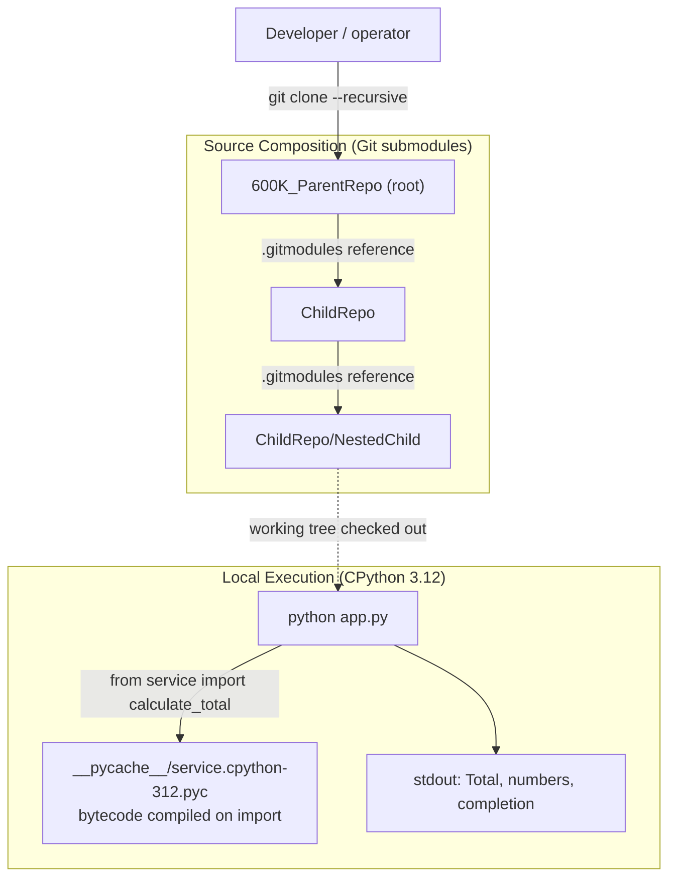
```mermaid
flowchart TD
    Dev["Developer / operator"]
    subgraph VCS["Source Composition (Git submodules)"]
        direction TB
        Parent["600K_ParentRepo (root)"]
        Child["ChildRepo"]
        Nested["ChildRepo/NestedChild"]
        Parent -->|".gitmodules reference"| Child
        Child -->|".gitmodules reference"| Nested
    end
    subgraph Exec["Local Execution (CPython 3.12)"]
        direction TB
        Run["python app.py"]
        Pyc["__pycache__/service.cpython-312.pyc<br/>bytecode compiled on import"]
        Out["stdout: Total, numbers, completion"]
        Run -->|"from service import calculate_total"| Pyc
        Run --> Out
    end
    Dev -->|"git clone --recursive"| Parent
    Nested -.->|"working tree checked out"| Run
```

### 3.6.4 Containerization, CI/CD, and Infrastructure

| Concern | Status | Evidence |
| --- | --- | --- |
| Containerization | **None** | No `Dockerfile`, `docker-compose.yml`, or container manifest |
| CI / CD pipelines | **None** | No `.github/workflows`, and no other CI configuration (GitLab CI, CircleCI, Jenkins, etc.) |
| Infrastructure as Code | **None** | No Terraform (`*.tf`), CloudFormation, or other IaC files |
| Deployment target / orchestration | **None documented** | No deployment descriptor, service definition, or environment configuration |

None of the deployment technologies named in the default stack (Docker, Terraform, GitHub Actions, AWS) are present. The de-facto "deployment" is local execution: obtain the repository recursively (to include the submodules) and run `python app.py`, which prints its output and exits. Because there is no CI/CD, there is also no automated gate that would have caught the `NestedChild` defect prior to integration.


## 3.7 References

The following repository files, folders, and specification sections were examined as evidence for this Technology Stack section. Paths are relative to the repository root. No external web sources were used.

**Repository files:**

- `app.py` - Established Python as the sole language, the f-string usage that sets the Python 3.6+ floor, the intra-repository `from service import calculate_total` import, and the fixed-list stdout workflow.
- `service.py` - Established the pure `calculate_total` / `calculate_average` functions and the complete absence of imports.
- `README.md` - Established the one-line documentation (no setup, dependency, or build instructions).
- `.gitmodules` - Established the `ChildRepo` submodule declaration and its public GitHub HTTPS remote URL.
- `.blitzyignore` - Established the `*.csv` exclusion policy applied throughout this section.
- `__pycache__/service.cpython-312.pyc` - Established the observed CPython 3.12 toolchain via bytecode magic number `cb0d0d0a`.
- `ChildRepo/.gitmodules` - Established the `NestedChild` submodule declaration and its remote URL.
- `ChildRepo/.git`, `ChildRepo/NestedChild/.git` - Established the submodule gitdir pointer structure (nested two levels deep).
- `ChildRepo/app.py`, `ChildRepo/service.py`, `ChildRepo/README.md` - Established the mirrored two-file Python structure at the child submodule level.
- `ChildRepo/NestedChild/app.py` - Established the mirrored entry point at the deepest level.
- `ChildRepo/NestedChild/service.py` - Established the NestedChild defect (a byte-for-byte copy of `app.py` that lacks `calculate_total`).
- `ChildRepo/NestedChild/README.md` - Established the minimal documentation at the deepest level.

**Repository folders:**

- `` (repository root) - Established the top-level structure and the verified absence of any dependency manifests, build files, CI/CD configuration, Dockerfiles, and IaC files.
- `ChildRepo/` - Established the child submodule contents and mirrored structure.
- `ChildRepo/NestedChild/` - Established the nested submodule contents.
- `__pycache__/`, `ChildRepo/__pycache__/`, `ChildRepo/NestedChild/__pycache__/` - Established the CPython 3.12 bytecode caches (identical `cb0d0d0a` magic across all three).

**Excluded by policy (not opened):**

- `large.csv` (present at every repository level) - Excluded per the `.blitzyignore` `*.csv` rule; not read by any code and used here only to confirm its presence and exclusion from the storage architecture (§3.5).

**Cross-referenced specification sections:**

- §1.2 System Overview - Corroborated zero third-party dependencies, standard-library-only design, Python 3.6+ portability, nested Git submodules, and the NestedChild defect.
- §1.3 Scope - Corroborated the "Python 3.6+ runtime; standard library only; no build, packaging, or dependency-installation step" constraint and the out-of-scope status of packaging, tests, CI/CD, and containerization.
- §2.4 Implementation Considerations - Corroborated the absence of build/packaging/tests/CI, the submodule composition constraints (recursive checkout, network access to GitHub remotes), and the lack of submodule-content verification.


# 4. Process Flowchart

## 4.1 System Workflows

The workflows documented in this section reflect the repository's behavior exactly as implemented and verified by execution under Python 3.12.3. The codebase is a minimal, standard-library-only Python demonstration organized as a three-level Git-submodule chain (`600K_ParentRepo` → `ChildRepo` → `ChildRepo/NestedChild`; see Section 1.2 System Overview). Consequently its runtime behavior is a **single, synchronous, deterministic batch computation** driven entirely by hard-coded input, with **no** network calls, database access, file I/O, message/event processing, or background scheduling anywhere in the tree. Every flow below is traced to specific lines of `app.py` and `service.py` and to the features catalogued in Section 2.1 (F-001 through F-004). Where the prompt calls for constructs the code does not contain — external integrations, asynchronous events, retry loops — that absence is stated explicitly rather than inferred.

**Actors and system boundaries.** The workflow involves exactly one human actor and a small set of in-process software boundaries; there are no remote services.

| Actor / Boundary | Role in the Workflow | Evidence |
| --- | --- | --- |
| Developer / Operator | Invokes the program from a shell (`python app.py`); supplies no arguments, stdin, or configuration | `app.py:15-16` (`__main__` guard) |
| Python 3.12 runtime / module loader | Loads `app.py`, resolves the `service` import, evaluates the `__main__` guard | `app.py:1`, `app.py:15` |
| `app.py` — `main()` (F-003) | Orchestrates the workflow: builds the fixed list, requests the total, writes output | `app.py:3-13` |
| `service.py` — `calculate_total` (F-001) | Pure summation primitive invoked by the workflow | `service.py:1-7` |
| Standard output (stdout) | The sole output sink; receives all six printed lines | `app.py:8`, `app.py:11`, `app.py:13` |

The three submodule levels do **not** interact at runtime: each `app.py` resolves `service` only from its own directory, so there is no cross-level data flow (see Section 2.3 Feature Relationships).

### 4.1.1 High-Level System Workflow

The system exposes exactly one end-to-end journey: an operator runs `app.py`, which sums a hard-coded list through the `service` module and prints a deterministic report to standard output (feature F-003, requirements F-003-RQ-001 through F-003-RQ-003). The swim-lane diagram below places each step in the lane of the actor or component that owns it, showing the two system boundaries the data crosses (the Python runtime on entry, and stdout on output).

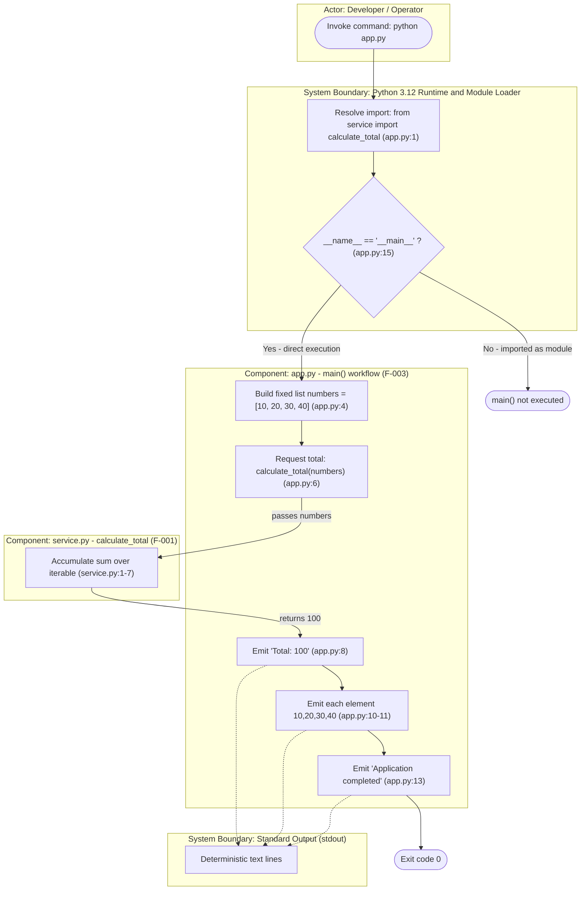
```mermaid
flowchart TB
    subgraph LaneOp["Actor: Developer / Operator"]
        direction TB
        OpStart(["Invoke command: python app.py"])
    end
    subgraph LaneRt["System Boundary: Python 3.12 Runtime and Module Loader"]
        direction TB
        Import["Resolve import: from service import calculate_total (app.py:1)"]
        Guard{"__name__ == '__main__' ? (app.py:15)"}
    end
    subgraph LaneApp["Component: app.py - main() workflow (F-003)"]
        direction TB
        BuildList["Build fixed list numbers = [10, 20, 30, 40] (app.py:4)"]
        CallTotal["Request total: calculate_total(numbers) (app.py:6)"]
        PrintTotal["Emit 'Total: 100' (app.py:8)"]
        LoopPrint["Emit each element 10,20,30,40 (app.py:10-11)"]
        PrintDone["Emit 'Application completed' (app.py:13)"]
    end
    subgraph LaneSvc["Component: service.py - calculate_total (F-001)"]
        direction TB
        Sum["Accumulate sum over iterable (service.py:1-7)"]
    end
    subgraph LaneOut["System Boundary: Standard Output (stdout)"]
        direction TB
        Sink["Deterministic text lines"]
    end
    OpStart --> Import
    Import --> Guard
    Guard -->|"No - imported as module"| Skip(["main() not executed"])
    Guard -->|"Yes - direct execution"| BuildList
    BuildList --> CallTotal
    CallTotal -->|"passes numbers"| Sum
    Sum -->|"returns 100"| PrintTotal
    PrintTotal --> LoopPrint
    LoopPrint --> PrintDone
    PrintTotal -.-> Sink
    LoopPrint -.-> Sink
    PrintDone -.-> Sink
    PrintDone --> ExitOk(["Exit code 0"])
```

**Observed outcome (verified).** Running the root or `ChildRepo` program prints `Total: 100`, then `10`, `20`, `30`, `40`, then `Application completed`, and exits with code `0`. The only branch in the high-level flow is the `__main__` guard (`app.py:15`): when the module is imported rather than executed directly, `main()` is not called and no output is produced (satisfying F-003-RQ-003). No timing or service-level constraints govern this flow; timing is addressed in Section 4.2.1.

### 4.1.2 Core Business Processes

The repository contains **no documented business processes** — each `README.md` is a one-line title and there is no product, domain, or requirements documentation (see Section 1.2.1). The "core processes" are therefore the technical processes the code actually performs. There are three, corresponding to the catalogued features: the end-to-end workflow (F-003) and the two calculation services it is built on (F-001, F-002).

**Process 1 — Fixed-list summation workflow (F-003).** This is the only process a user observes. `main()` builds the constant list `[10, 20, 30, 40]` (`app.py:4`), delegates summation to `calculate_total` (`app.py:6`), prints the total (`app.py:8`), prints each element in order (`app.py:10-11`), and prints the completion sentinel (`app.py:13`). The diagram makes the decision points and the single (implicit) error path explicit.

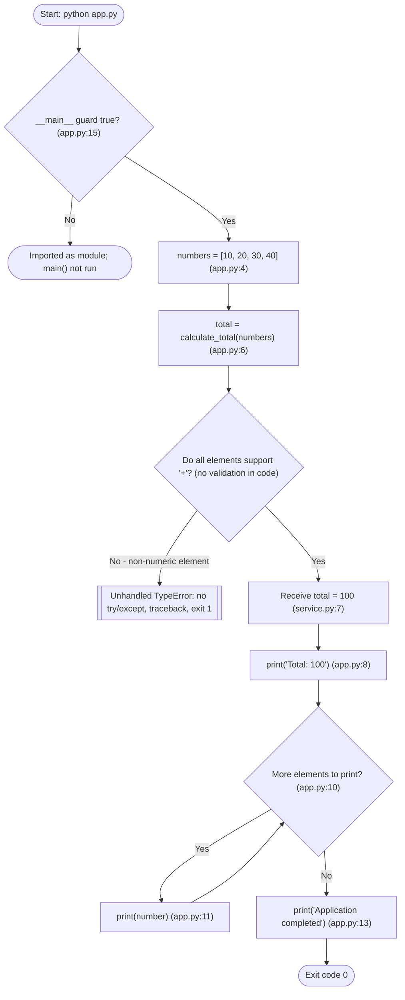
```mermaid
flowchart TD
    Start(["Start: python app.py"]) --> G{"__main__ guard true? (app.py:15)"}
    G -->|"No"| NoRun(["Imported as module; main() not run"])
    G -->|"Yes"| Init["numbers = [10, 20, 30, 40] (app.py:4)"]
    Init --> Call["total = calculate_total(numbers) (app.py:6)"]
    Call --> Numeric{"Do all elements support '+'? (no validation in code)"}
    Numeric -->|"No - non-numeric element"| TErr[["Unhandled TypeError: no try/except, traceback, exit 1"]]
    Numeric -->|"Yes"| Ret["Receive total = 100 (service.py:7)"]
    Ret --> PT["print('Total: 100') (app.py:8)"]
    PT --> Loop{"More elements to print? (app.py:10)"}
    Loop -->|"Yes"| PN["print(number) (app.py:11)"]
    PN --> Loop
    Loop -->|"No"| PD["print('Application completed') (app.py:13)"]
    PD --> End(["Exit code 0"])
```

The decision node "Do all elements support `+`?" represents an **implicit runtime outcome, not a coded check** — `app.py` and `service.py` contain no input validation and no `try`/`except` (verified; see Section 2.2). With the hard-coded numeric list the answer is always "yes," so the executed path never reaches the `TypeError` state; the branch is shown because it is the only way the run-to-completion flow could deviate, and it would surface only if the primitive were reused with non-numeric input.

**Process 2 — List summation service (F-001; requirements F-001-RQ-001, F-001-RQ-002).** The primitive on which everything depends. It initializes an accumulator to `0` (`service.py:2`), adds each element (`service.py:4-5`), and returns the total (`service.py:7`); an empty iterable naturally returns `0` because the loop body never executes.

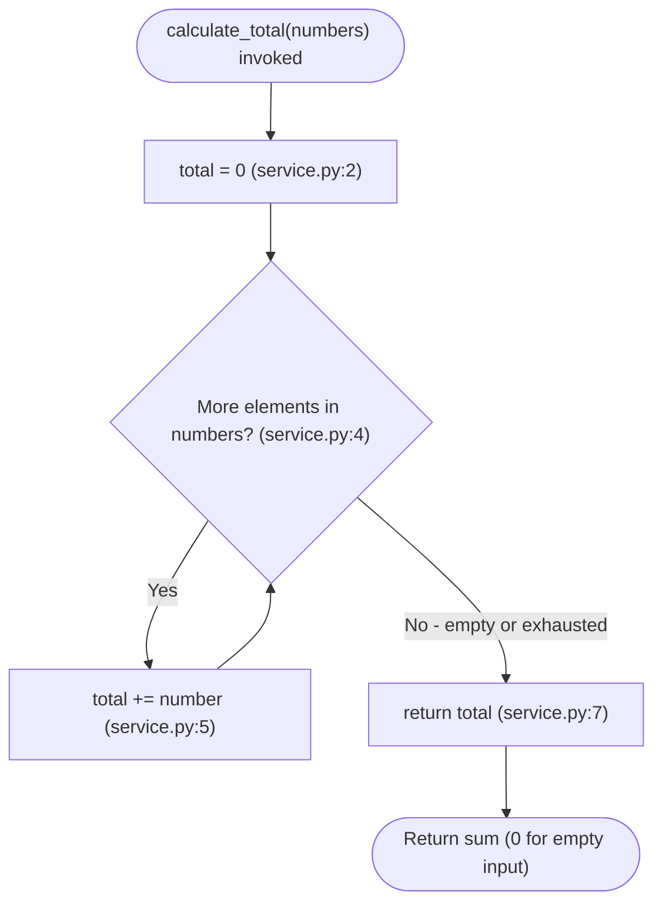
```mermaid
flowchart TD
    S(["calculate_total(numbers) invoked"]) --> Init["total = 0 (service.py:2)"]
    Init --> D{"More elements in numbers? (service.py:4)"}
    D -->|"Yes"| Add["total += number (service.py:5)"]
    Add --> D
    D -->|"No - empty or exhausted"| R["return total (service.py:7)"]
    R --> E(["Return sum (0 for empty input)"])
```

**Process 3 — Arithmetic mean service (F-002; requirements F-002-RQ-001, F-002-RQ-002).** Defined in `service.py` but **not invoked by any entry point** (verified; effectively dead code relative to the workflow — see Sections 2.1.2 and 2.3). It guards falsy/empty input by returning `0` (`service.py:11-12`) and otherwise returns `calculate_total(numbers) / len(numbers)` (`service.py:14`). Its flow is included for completeness because it is a defined capability of the `service` module, though no executed journey reaches it.

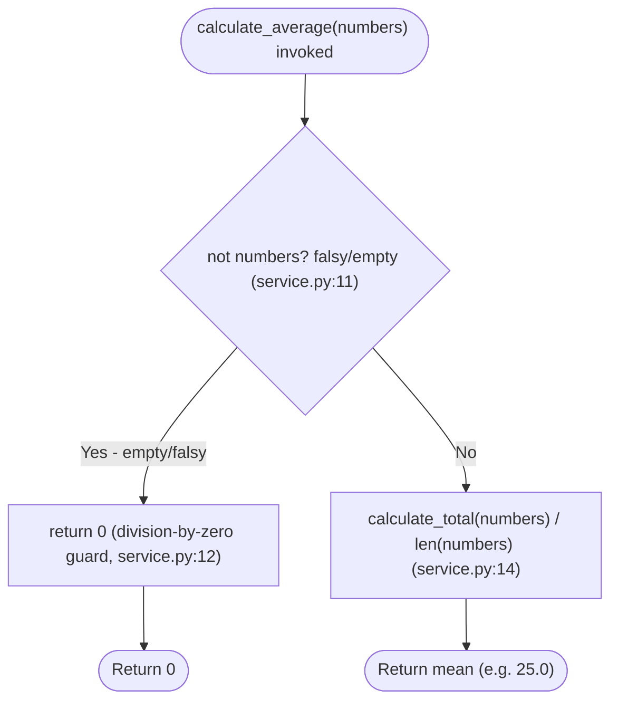
```mermaid
flowchart TD
    S(["calculate_average(numbers) invoked"]) --> G{"not numbers? falsy/empty (service.py:11)"}
    G -->|"Yes - empty/falsy"| Z["return 0 (division-by-zero guard, service.py:12)"]
    G -->|"No"| C["calculate_total(numbers) / len(numbers) (service.py:14)"]
    C --> R(["Return mean (e.g. 25.0)"])
    Z --> R2(["Return 0"])
```

### 4.1.3 Integration Workflows

There are **no external systems to integrate with**: the repository has zero third-party dependencies, and the only import statement anywhere is the intra-repository `from service import calculate_total` (verified across the tree; see Section 3.3). Consequently the integration categories the prompt enumerates map onto this codebase as follows.

| Integration Category | Presence in This Repository | Evidence |
| --- | --- | --- |
| Data flow between systems | None across processes/hosts; a single in-process call passes the list to `calculate_total` and receives an integer back | `app.py:6`, `service.py:7` |
| API interactions | None — no HTTP/REST/RPC or CLI-argument surface; the only "API" is the Python function `calculate_total` consumed via module import | `app.py:1`, `service.py:1` |
| Event processing flows | None — no message queue, event loop, callbacks, or async constructs anywhere in the tree | whole tree (no such imports) |
| Batch processing sequences | The whole program is one run-to-completion batch over the fixed 4-element list; no scheduler or job framework | `app.py:3-13` |

**Runtime integration (module import + call).** The one runtime interaction worth sequencing is the binding and invocation of the summation primitive across the module boundary (F-003 → F-001, per Section 2.3.2). The sequence diagram traces it from shell invocation to process exit.

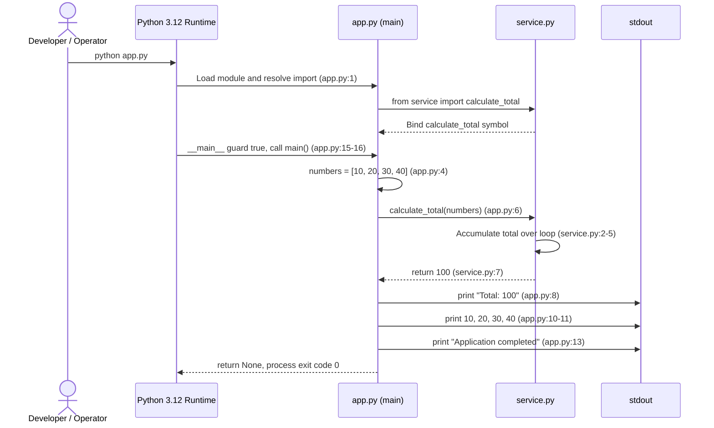
```mermaid
sequenceDiagram
    actor Dev as Developer / Operator
    participant PY as Python 3.12 Runtime
    participant App as app.py (main)
    participant Svc as service.py
    participant Out as stdout
    Dev->>PY: python app.py
    PY->>App: Load module and resolve import (app.py:1)
    App->>Svc: from service import calculate_total
    Svc-->>App: Bind calculate_total symbol
    PY->>App: __main__ guard true, call main() (app.py:15-16)
    App->>App: numbers = [10, 20, 30, 40] (app.py:4)
    App->>Svc: calculate_total(numbers) (app.py:6)
    Svc->>Svc: Accumulate total over loop (service.py:2-5)
    Svc-->>App: return 100 (service.py:7)
    App->>Out: print "Total: 100" (app.py:8)
    App->>Out: print 10, 20, 30, 40 (app.py:10-11)
    App->>Out: print "Application completed" (app.py:13)
    App-->>PY: return None, process exit code 0
```

**Build-time composition (F-004; requirements F-004-RQ-001, F-004-RQ-002, F-004-RQ-003).** The only inter-repository relationship is source composition through native Git submodules, declared in `.gitmodules` at the root and `ChildRepo` levels. This is a checkout/build-time flow, not a runtime data flow — there is no runtime coupling between levels. The diagram also captures the verified `NestedChild` defect: its `service.py` is a byte-for-byte copy of `app.py`, so that level cannot run (see Section 2.2.4).

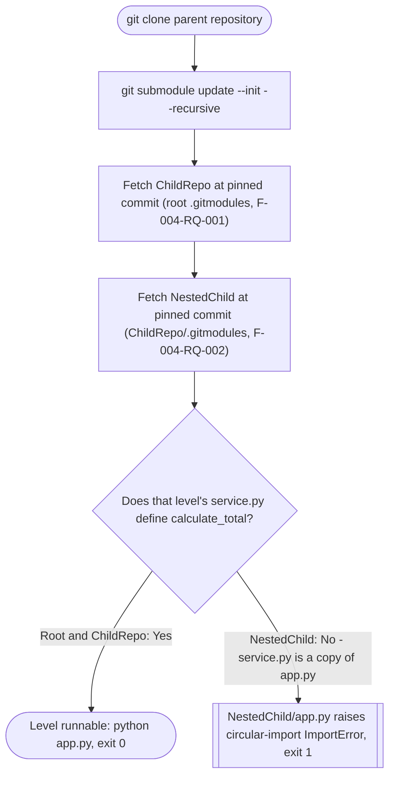
```mermaid
flowchart TD
    Clone(["git clone parent repository"]) --> Init["git submodule update --init --recursive"]
    Init --> C1["Fetch ChildRepo at pinned commit (root .gitmodules, F-004-RQ-001)"]
    C1 --> C2["Fetch NestedChild at pinned commit (ChildRepo/.gitmodules, F-004-RQ-002)"]
    C2 --> Chk{"Does that level's service.py define calculate_total?"}
    Chk -->|"Root and ChildRepo: Yes"| Ok(["Level runnable: python app.py, exit 0"])
    Chk -->|"NestedChild: No - service.py is a copy of app.py"| Broken[["NestedChild/app.py raises circular-import ImportError, exit 1"]]
```

## 4.2 Flowchart Requirements and Validation Rules

This section catalogs, for the workflows in Section 4.1, the standard flowchart elements the prompt enumerates and the validation rules that govern each step. Because the program performs no input handling, network access, or persistence, the *validation*, *authorization*, and *compliance* dimensions are largely records of **verified absence** rather than implemented controls. That absence is consistent with Sections 1.2.3 (no SLAs/KPIs), 2.2 (no validation/security/compliance controls), and 3.4/3.5 (no third-party services, databases, or storage).

### 4.2.1 Workflow Elements, Timing, and SLA Considerations

The table maps each flowchart element required by the prompt to its concrete location in the Section 4.1 diagrams and the source evidence for it.

| Flowchart Element | Where It Appears in the Flows | Evidence |
| --- | --- | --- |
| Start point | The `python app.py` invocation node that opens every flow | `app.py:15-16` |
| End point(s) | `Exit code 0` (success); `main() not executed` (imported); failure exits via `ImportError`/`TypeError` | `app.py:13`, `app.py:15`; runtime |
| Process steps | Build list → request total → accumulate → print total → print each element → print sentinel | `app.py:4`,`6`,`8`,`10-13`; `service.py:2-7` |
| Decision diamonds | `__main__` guard; loop-continuation; empty/exhausted check; falsy-input guard | `app.py:10`,`15`; `service.py:4`,`11` |
| System boundaries | Python runtime (entry/import) and stdout (output) — the two swim lanes the data crosses | `app.py:1`,`8` |
| User touchpoints | A single touchpoint: the shell command (no arguments, no stdin); the operator reads results from stdout | `app.py:15-16` |
| Error states & recovery paths | `TypeError` (if the primitive is reused with non-numeric input) and `ImportError` (the `NestedChild` level); **no recovery path is coded** | `service.py:5`; `NestedChild` runtime |
| Timing / SLA | None documented (see below) | Sections 1.2.3, 2.2 |

**Timing and SLA considerations.** The repository defines **no** service-level agreements, latency or throughput budgets, timeouts, benchmarks, or monitoring hooks — this was verified across the tree and is consistent with Section 1.2.3 (which asserts no SLAs/KPIs) and Section 2.2 (which records no performance budgets). The only timing-relevant properties evidenced in code are algorithmic:

- `calculate_total` is a single `O(n)` accumulation pass over the input (`service.py:4-5`), and `calculate_average` is `O(n)` because it delegates to it (`service.py:14`).
- The executed workflow operates on a constant four-element list (`app.py:4`), so its computational cost is fixed and trivial; wall-clock time is dominated by interpreter startup, not the calculation.
- The workflow is single-process, synchronous, and run-to-completion, with no waits, sleeps, retries, or blocking I/O. Because no timeout or deadline exists anywhere, **no flow contains a timing-based branch** — every branch documented in Section 4.1 is a logical guard, not a time-based one.

### 4.2.2 Validation Rules and Authorization Checkpoints

The diagram below depicts the *control-checkpoint reality* of the program: the three checkpoint categories an enterprise workflow would typically enforce are shown as explicitly **not implemented** (verified), and the single gate that the code actually enforces — the `__main__` execution guard — is highlighted, followed by the only coded business rules.

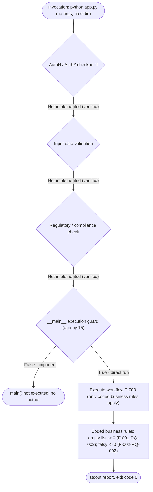
```mermaid
flowchart TD
    In(["Invocation: python app.py (no args, no stdin)"]) --> G1{"AuthN / AuthZ checkpoint"}
    G1 -->|"Not implemented (verified)"| G2{"Input data validation"}
    G2 -->|"Not implemented (verified)"| G3{"Regulatory / compliance check"}
    G3 -->|"Not implemented (verified)"| G4{"__main__ execution guard (app.py:15)"}
    G4 -->|"False - imported"| NoOp(["main() not executed; no output"])
    G4 -->|"True - direct run"| Run["Execute workflow F-003 (only coded business rules apply)"]
    Run --> BR["Coded business rules: empty list -> 0 (F-001-RQ-002); falsy -> 0 (F-002-RQ-002)"]
    BR --> Done(["stdout report, exit code 0"])
```

**Business rules at each step.** The following rules are the *only* logic-level rules the code enforces; each is traced to the corresponding requirement in Section 2.2.

| Workflow Step | Business Rule (as coded) | Evidence / Requirement |
| --- | --- | --- |
| Execution gate | `main()` runs only under direct execution (`__name__ == "__main__"`); importing the module produces no output | `app.py:15-16` (F-003-RQ-003) |
| Fixed input | Operates exclusively on the hard-coded list `[10, 20, 30, 40]`; no external input is accepted | `app.py:4` (F-003-RQ-001) |
| Summation empty-input rule | An empty iterable returns `0` (accumulator initialized to `0`, loop body skipped) | `service.py:2-5` (F-001-RQ-002) |
| Average empty-input rule | Falsy/empty input returns `0` *before* any division (division-by-zero guard) | `service.py:11-12` (F-002-RQ-002) |
| Output contract | Print `Total: <n>`, then each element on its own line, then `Application completed`; exit `0` | `app.py:8`,`10-13` (F-003-RQ-001/002/003) |

**Data validation requirements.** None are implemented. Neither `app.py` nor `service.py` performs type checks, range checks, null checks (beyond the falsy guard in `calculate_average`), or schema validation — this was verified. A non-numeric element passed to `calculate_total` would raise an unhandled `TypeError` at `service.py:5` (see Section 2.2.1). Because the workflow's input is a hard-coded numeric list, no invalid data can reach the code through the executed path.

**Authorization checkpoints.** None exist. There is no authentication, authorization, session, role, or permission logic anywhere in the tree (verified). The only gate in the code is the `__main__` guard, which is an *execution-mode* check, not a security control; the program reads no credentials and accesses no protected resource.

**Regulatory / compliance checks.** None exist. There is no compliance control, audit logging, data-retention policy, or PII handling (verified) — the program processes a constant in-memory integer list and writes only to stdout. The `.blitzyignore` files exclude `*.csv` from tooling scope, but the code itself performs no file or data-governance operations of any kind.

## 4.3 Technical Implementation Flows

This section documents the state-management and error-handling implementation behind the workflows in Section 4.1. As in the preceding sections, most of the technical-implementation dimensions the prompt enumerates — durable persistence, application caching, transactions, retries, fallbacks, and notifications — are recorded as **verified absences**, because the program is a stateless, in-memory, standard-library-only computation with no external resources.

### 4.3.1 State Management

The program holds only **ephemeral, in-process state**; there is no durable state, session, or shared store. The state-transition diagram traces the process lifecycle from invocation through its success/idle terminal states and its two failure terminal states (one of which is reachable only at the defective `NestedChild` level).

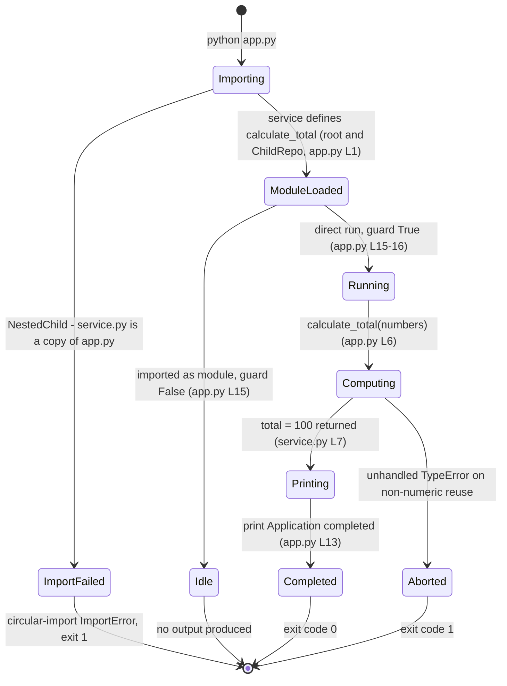
```mermaid
stateDiagram-v2
    [*] --> Importing: python app.py
    Importing --> ModuleLoaded: service defines calculate_total (root and ChildRepo, app.py L1)
    Importing --> ImportFailed: NestedChild - service.py is a copy of app.py
    ImportFailed --> [*]: circular-import ImportError, exit 1
    ModuleLoaded --> Idle: imported as module, guard False (app.py L15)
    Idle --> [*]: no output produced
    ModuleLoaded --> Running: direct run, guard True (app.py L15-16)
    Running --> Computing: calculate_total(numbers) (app.py L6)
    Computing --> Printing: total = 100 returned (service.py L7)
    Printing --> Completed: print Application completed (app.py L13)
    Completed --> [*]: exit code 0
    Computing --> Aborted: unhandled TypeError on non-numeric reuse
    Aborted --> [*]: exit code 1
```

**State transitions.** The only mutable state anywhere is the local accumulator `total` (`service.py:2-5`) and the loop variable `number` (`app.py:10`, `service.py:4`); both are function-local and are discarded when the call returns or the process exits. No state is shared between the three submodule levels, and nothing survives a run.

**Persistence, caching, and transaction boundaries.** The table records the status of each dimension the prompt calls for, all verified against the source.

| Dimension | Status in This Repository | Evidence |
| --- | --- | --- |
| Data persistence points | None — results are written to the transient stdout stream only; no file, database, or network writes occur | `app.py:8`,`11`,`13` |
| On-disk artifacts | The only artifact written to disk is CPython's compiled-bytecode cache, produced by the *interpreter* (not the application) as an import optimization | `__pycache__/service.cpython-312.pyc` |
| Caching requirements | No application caching or memoization; `calculate_total` recomputes on every call | `service.py:1-7` |
| Transaction boundaries | None — no database, atomic unit, or rollback; the process is all-or-nothing in the trivial sense that a crash simply stops further output, with lines already flushed to stdout left in place | `app.py:3-13` |

### 4.3.2 Error Handling

The codebase contains **no error-handling constructs** — there is not a single `try`, `except`, `finally`, `raise`, `with`, or logging call anywhere in the tree (verified; consistent with Section 2.4). Errors therefore propagate as the Python interpreter's default uncaught-exception behavior: a full traceback written to stderr and a non-zero process exit. The flowchart shows the two error conditions that actually exist and the shared, empty recovery path.

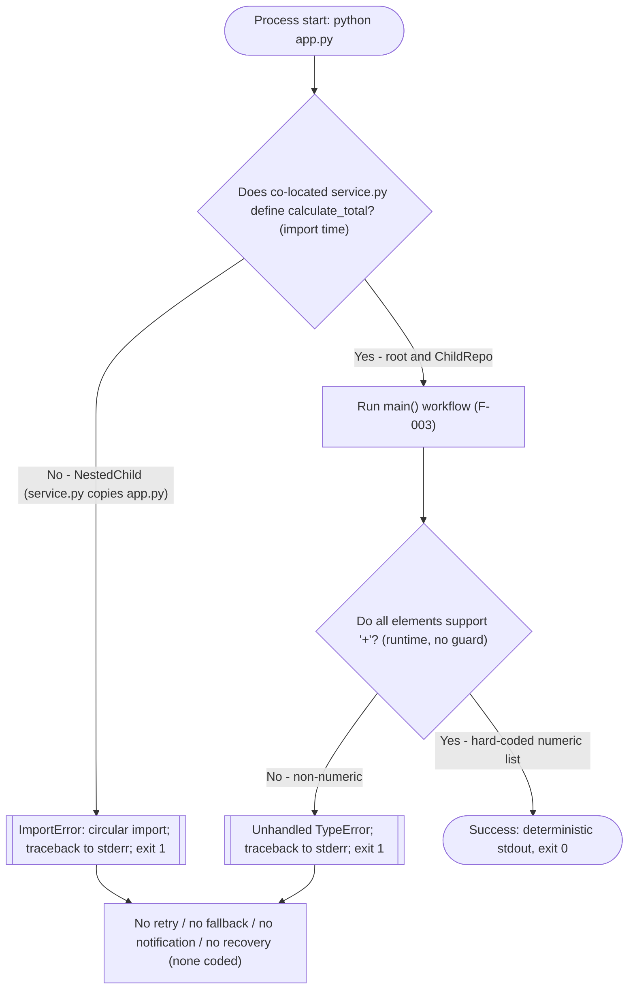
```mermaid
flowchart TD
    Start(["Process start: python app.py"]) --> ImpChk{"Does co-located service.py define calculate_total? (import time)"}
    ImpChk -->|"No - NestedChild (service.py copies app.py)"| ImpErr[["ImportError: circular import; traceback to stderr; exit 1"]]
    ImpChk -->|"Yes - root and ChildRepo"| Run["Run main() workflow (F-003)"]
    Run --> TypeChk{"Do all elements support '+'? (runtime, no guard)"}
    TypeChk -->|"No - non-numeric"| TErr[["Unhandled TypeError; traceback to stderr; exit 1"]]
    TypeChk -->|"Yes - hard-coded numeric list"| Ok(["Success: deterministic stdout, exit 0"])
    ImpErr --> NoRecovery["No retry / no fallback / no notification / no recovery (none coded)"]
    TErr --> NoRecovery
```

**Retry mechanisms, fallback processes, notification, and recovery.** Each of these is a verified absence:

- **Retry mechanisms** — none. There is no loop, backoff, or re-invocation on failure; a failed run simply terminates.
- **Fallback processes** — none. There is no alternative code path or degraded mode; if `calculate_total` cannot be imported or applied, execution stops.
- **Error notification flows** — the only "notification" is the interpreter's default traceback to stderr. There is no logging framework, alerting, metrics emission, or webhook/email notification anywhere in the tree.
- **Recovery procedures** — none are coded at runtime. For the `NestedChild` `ImportError`, the corrective action is a *source-level fix* (replacing `NestedChild/service.py` with a real `service` module that defines `calculate_total`) — a maintenance action, not automated recovery (see Section 2.2.4, requirement F-004-RQ-003).

**Enumerated error conditions (verified).** Exactly two error conditions exist across the tree; the executed root/`ChildRepo` workflow encounters neither and therefore always exits `0`.

| Error Condition | Trigger | Observed Effect | Recovery (as Coded) |
| --- | --- | --- | --- |
| Circular-import `ImportError` | Running `NestedChild/app.py`, whose co-located `service.py` is a byte-copy of `app.py` and lacks `calculate_total` | Traceback to stderr; exit code `1`; no workflow output | None — requires a source-level fix |
| Unhandled `TypeError` | `calculate_total` reused with a non-numeric element (not reachable through the hard-coded workflow) | Traceback originating at `service.py:5`; exit code `1` | None |

## 4.4 References

The following repository files and folders were inspected (and, where noted, executed) to ground every flow, diagram, and claim in this section. All statements are traced to these sources; no web sources were used.

**Files examined**

- `app.py` — Root entry point; established the F-003 workflow flow: import (`L1`), fixed list `[10, 20, 30, 40]` (`L4`), `calculate_total` call (`L6`), `Total:` output (`L8`), element loop (`L10-11`), completion sentinel (`L13`), and the `__main__` guard (`L15-16`).
- `service.py` — Calculation module; established the F-001 summation flow (`calculate_total`, `L1-7`) and the F-002 average flow with its falsy-input guard (`calculate_average`, `L10-14`), including the empty-input business rules.
- `.gitmodules` — Root submodule declaration for `ChildRepo`; established the build-time composition flow (F-004-RQ-001).
- `ChildRepo/.gitmodules` — Submodule declaration for `NestedChild`; established the second level of the composition flow (F-004-RQ-002).
- `ChildRepo/app.py`, `ChildRepo/service.py` — Confirmed the root workflow is faithfully mirrored at the `ChildRepo` level (identical behavior, exit `0`).
- `ChildRepo/NestedChild/app.py` — Confirmed the entry point is byte-identical to the root.
- `ChildRepo/NestedChild/service.py` — Established the verified defect used in the state and error-handling flows: it is a copy of `app.py` (no `calculate_total`), causing the circular-import `ImportError`.
- `README.md` — Confirmed the absence of any business, process, or requirements documentation (one-line title only), supporting the "no documented business processes" finding.
- `.blitzyignore` — Established that `*.csv` files are excluded from scope (they are not read by the code); referenced in the compliance discussion.
- `__pycache__/service.cpython-312.pyc` — Established the CPython 3.12 runtime and the only on-disk artifact relevant to the caching/persistence discussion (interpreter bytecode cache).

**Folders examined**

- `` (repository root) — Established the top-level structure (`app.py`, `service.py`, `README.md`, `.gitmodules`, `ChildRepo/`) and the absence of any build/CI/config/manifest files.
- `ChildRepo/` — The first submodule level; mirrors the root two-file application used in the integration/composition flows.
- `ChildRepo/NestedChild/` — The leaf submodule level; source of the defective-variant error path.

**Runtime behavior verified by execution (Python 3.12.3)**

- Root and `ChildRepo` `python app.py` → `Total: 100`, then `10`/`20`/`30`/`40`, then `Application completed`; exit code `0`.
- `ChildRepo/NestedChild/app.py` → circular-import `ImportError`; exit code `1`.
- Direct calls: `calculate_total([10,20,30,40]) = 100`, `calculate_total([]) = 0`, `calculate_average([10,20,30,40]) = 25.0`, `calculate_average([]) = 0`.

**Cross-referenced Technical Specification sections**

- `1.2 System Overview` — Project context and the explicit absence of SLAs/KPIs (Section 1.2.3), and the component/relationship model.
- `2.1 Feature Catalog` — Feature identifiers F-001 through F-004 and the note that F-002 is defined but not invoked (Section 2.1.2).
- `2.2 Functional Requirements Table` — Requirement identifiers (F-XXX-RQ-YYY) and the verified absence of input validation, error handling, security, and compliance controls.
- `2.3 Feature Relationships` — Integration points and the finding that there is no cross-level runtime coupling (Section 2.3.2).
- `2.4 Implementation Considerations` — Confirmation that execution is single-process, synchronous, deterministic, with no logging or error handling.
- `3.3 Open Source Dependencies` — Confirmation of zero third-party dependencies (standard library only).
- `3.4 Third-Party Services` and `3.5 Databases and Storage` — Confirmation of the absence of external services, databases, and storage, underpinning the "no external systems" integration findings.

# 5. System Architecture

## 5.1 High-Level Architecture

This section describes the architecture of the repository exactly as implemented and verified by execution under Python 3.12.3. Every architectural statement is grounded in the source files (`app.py`, `service.py`, `.gitmodules`) and observed runtime behavior; where the prompt calls for an architectural construct the system does not contain — persistence tiers, network protocols, message brokers, service meshes — that absence is stated explicitly rather than inferred (consistent with Sections 1.2, 3.5, and 4.1).

### 5.1.1 System Overview

**Overall architectural style and rationale.** The system is a **single-process, synchronous, standard-library-only Python application** built as a **two-module modular monolith**. It is not a client–server, distributed, service-oriented, or event-driven system; it is a run-to-completion batch program that computes the sum of a hard-coded list and writes a deterministic report to standard output. The architecture is intentionally minimal: `app.py` is a thin orchestrator that delegates arithmetic to `service.py`, whose functions are pure. This "orchestrator + computation module" split is the single organizing decision of the codebase, and it is chosen for clarity and testability of the pure computation rather than for scale, concurrency, or fault tolerance (none of which the code addresses). The same two-module shape is **replicated at each of the three levels** of a nested Git-submodule chain (`600K_ParentRepo` → `ChildRepo` → `ChildRepo/NestedChild`), so the composition of the whole repository is a second, coarser-grained architectural concern layered on top of the per-level application.

**Key architectural principles and patterns.** The following patterns are directly evidenced in the code:

- **Separation of concerns (two-layer split).** Orchestration/I-O (`app.py` → `main()`, lines 3–13) is separated from computation (`service.py`, lines 1–14). The orchestrator owns input construction and all `print()` output; the service owns arithmetic and returns values only.
- **Pure-function computation.** `calculate_total` (`service.py:1-7`) and `calculate_average` (`service.py:10-14`) have no I/O, no shared mutable state, and no side effects beyond their return values, making them deterministic and referentially transparent.
- **Layered dependency direction.** The dependency arrow points one way only — the orchestration layer imports the computation layer (`app.py:1`, `from service import calculate_total`); the computation layer imports nothing (verified: the only import statement anywhere in the tree is this one line).
- **Zero-dependency / standard-library-only design.** No third-party packages, frameworks, or runtime services are used; the code relies solely on Python built-ins and is portable across Python 3.6+ (the only version-sensitive feature is f-string formatting in `app.py`).
- **Build-time composition via native Git submodules.** Repository assembly uses `.gitmodules`-declared submodules pinned at specific commits, replicating the same application at each nesting level (feature F-004).
- **Convention-based entry point.** Execution is gated by the `if __name__ == "__main__"` guard (`app.py:15-16`), so importing the module is side-effect free while direct invocation runs the workflow.

**System boundaries and major interfaces.** The runtime system boundary is a **single operating-system process** launched by `python app.py`. Within that boundary the only interface is the in-process Python module/function call. Crossing the boundary, the interfaces are:

| Interface | Direction | Nature |
| --- | --- | --- |
| CLI process invocation (`python app.py`) + exit code | Inbound / outbound | Shell → process start; integer exit status back to the shell |
| Standard output (stdout) | Outbound | Line-oriented plain text (six lines for a successful run) |
| Python module import API (`from service import calculate_total`) | Internal | Symbol binding across the module boundary (`app.py:1`) |
| Function-call API (`calculate_total`, `calculate_average`) | Internal | Synchronous call returning a scalar |
| Git submodule declarations (`.gitmodules`) | Build-time | Source composition against GitHub HTTPS remotes at pinned commits |

The three submodule levels do **not** interact at runtime — each `app.py` resolves `service` only from its own directory, so there is no cross-level data flow (see Section 2.3 and Section 4.1). The high-level diagram below places the two runtime layers inside the process boundary and shows the separate build-time composition boundary.

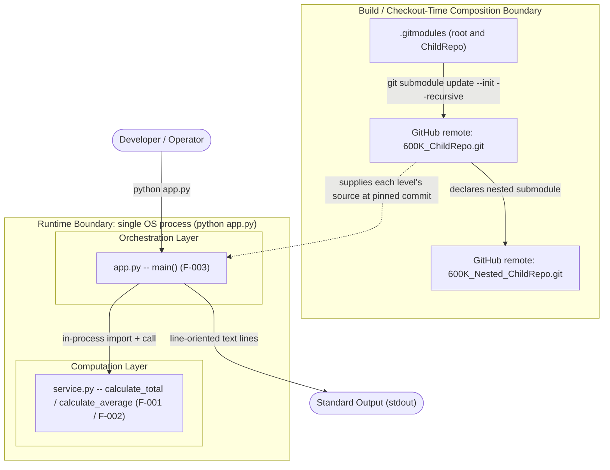
```mermaid
flowchart TB
    Operator(["Developer / Operator"])
    subgraph BuildTime["Build / Checkout-Time Composition Boundary"]
        direction TB
        Gitmods[".gitmodules (root and ChildRepo)"]
        GH1["GitHub remote: 600K_ChildRepo.git"]
        GH2["GitHub remote: 600K_Nested_ChildRepo.git"]
        Gitmods -->|"git submodule update --init --recursive"| GH1
        GH1 -->|"declares nested submodule"| GH2
    end
    subgraph Process["Runtime Boundary: single OS process (python app.py)"]
        direction TB
        subgraph Orchestration["Orchestration Layer"]
            direction TB
            Main["app.py -- main() (F-003)"]
        end
        subgraph Computation["Computation Layer"]
            direction TB
            Svc["service.py -- calculate_total / calculate_average (F-001 / F-002)"]
        end
        Main -->|"in-process import + call"| Svc
    end
    Stdout(["Standard Output (stdout)"])
    Operator -->|"python app.py"| Main
    Main -->|"line-oriented text lines"| Stdout
    GH1 -.->|"supplies each level's source at pinned commit"| Main
```

### 5.1.2 Core Components

The architecture comprises three core components, the first two of which form the per-level application and the third of which composes the repository. (`README.md` is one line of documentation and `__pycache__/service.cpython-312.pyc` is an interpreter-produced bytecode cache; neither is an architectural component.) Because the section-wide formatting rule caps tables at four columns, the component profile is presented as two complementary tables.

**Component responsibilities and dependencies:**

| Component | Primary Responsibility | Key Dependencies |
| --- | --- | --- |
| Application Entry Point — `app.py` → `main()` (F-003) | Orchestrate the workflow: build the fixed list `[10, 20, 30, 40]`, request the total, and write the report to stdout (`app.py:3-13`) | `service.calculate_total` via import (`app.py:1`); Python built-in `print`; Python module loader |
| Computation Service Module — `service.py` (F-001, F-002) | Provide pure arithmetic: `calculate_total` (sum reduction, lines 1–7) and `calculate_average` (mean with empty-input guard, lines 10–14) | None external; `calculate_average` calls `calculate_total` internally (`service.py:14`) |
| Repository Composition — `.gitmodules` + nested submodules (F-004) | Declare and pin the nested submodule chain (root → `ChildRepo` → `NestedChild`), replicating the two-module application at each level | Git submodule tooling; public GitHub HTTPS remotes |

**Component integration points:**

| Component | Integration Points |
| --- | --- |
| Application Entry Point — `app.py` | Inbound: shell invocation via `__main__` guard (`app.py:15-16`). Internal: `service` module. Outbound: stdout (`app.py:8`, `11`, `13`) |
| Computation Service Module — `service.py` | Consumed only through Python import by the co-located `app.py`; exposes no network, CLI, or file interface |
| Repository Composition — `.gitmodules` | `git submodule update --init --recursive` against `600K_ChildRepo.git` (root) and `600K_Nested_ChildRepo.git` (`ChildRepo` level); a build-time relationship only |

**Critical considerations per component:**

| Component | Critical Considerations |
| --- | --- |
| Application Entry Point — `app.py` | Input is hard-coded, not parameterized; there is no input validation and no error handling (no `try`/`except`); correct execution requires a co-located `service.py` that actually defines `calculate_total` |
| Computation Service Module — `service.py` | Functions are stateless, deterministic, and O(n) over the input; `calculate_average` is defined but never invoked by any entry point (effectively dead relative to the workflow); no type checking, so non-numeric input would raise an unhandled `TypeError` |
| Repository Composition — `.gitmodules` | Composition is build/checkout-time only with no runtime coupling; the `NestedChild` instance is **defective** — its `service.py` is a byte-for-byte copy of `app.py`, so `NestedChild/app.py` fails with a circular-import `ImportError`; populating the tree needs network access to GitHub |

### 5.1.3 Data Flow Description

**Primary data flow.** The system has exactly one data flow, and it is entirely in-process. `main()` constructs an in-memory list literal `[10, 20, 30, 40]` (`app.py:4`) and passes it by reference to `calculate_total` (`app.py:6`). `calculate_total` folds the iterable into a function-local accumulator — initializing `total = 0` (`service.py:2`), adding each element (`service.py:4-5`) — and returns the scalar `100` (`service.py:7`). `main()` interpolates that integer into an f-string and writes `Total: 100` to standard output (`app.py:8`), then iterates the same list writing each element on its own line (`app.py:10-11`), and finally writes the completion sentinel `Application completed` (`app.py:13`). Control then returns from `main()` and the process exits with status `0`.

**Data transformation points.** There are two, both trivial and in-memory:

- **Reduction:** the list of integers is transformed into a single scalar sum inside `calculate_total` (`service.py:2-7`). (The defined-but-unused `calculate_average` would additionally divide that sum by `len(numbers)` — `service.py:14` — but no executed path reaches it.)
- **Formatting:** the integer result and each element are converted to text for output via f-string interpolation and `print()` (`app.py:8`, `11`, `13`).

No parsing, deserialization, schema mapping, encoding negotiation, or serialization occurs anywhere; the program neither reads external input nor produces structured output formats.

**Integration patterns and protocols.** The only integration pattern at runtime is a **single synchronous in-process function call** across the Python module boundary — the import binds the `calculate_total` symbol (`app.py:1`) and `main()` invokes it directly (`app.py:6`). There is no network, HTTP/REST, RPC, message queue, event bus, or inter-process communication anywhere in the tree (verified; see Section 4.1.3). The sole output "protocol" is line-oriented plain text on stdout. The only inter-repository pattern is **build-time source composition** via Git submodules (Section 4.1.3), which is not a runtime data flow.

**Key data stores and caches.** There are **none**. All state is ephemeral and in-memory: the list literal and the function-local accumulator and loop variables, all discarded when the call returns or the process exits (see Section 4.3.1). There is no database, file store, object store, or application cache (consistent with Section 3.5). The only artifact written to disk is `__pycache__/service.cpython-312.pyc`, a CPython bytecode **import** cache produced by the interpreter as an optimization — not an application data store. The `large.csv` files present at each level are excluded by `.blitzyignore` and are never opened by any code (there is no `csv` import or file-open call anywhere), so they form no part of the data architecture.

### 5.1.4 External Integration Points

At **runtime the system integrates with nothing external** — it has zero third-party dependencies and performs no network, database, or file I/O (verified; see Sections 1.2.1, 3.3, and 3.4). The only relationships that cross the repository boundary are (a) the Git submodule remotes, consulted at checkout/build time to assemble the source tree, and (b) the operating-environment interfaces (the invoking shell and the stdout stream) exercised at runtime. No component defines or references any service-level agreement, performance budget, or uptime target (see Section 1.2.3), so the SLA column below records those verified absences.

| System / Endpoint | Integration Type | Data Exchange Pattern / Protocol | SLA Requirements |
| --- | --- | --- | --- |
| GitHub remote `600K_ChildRepo.git` (root `.gitmodules`) | Build/checkout-time Git submodule source | One-way fetch/clone of a pinned commit over Git-over-HTTPS | None defined in the repository |
| GitHub remote `600K_Nested_ChildRepo.git` (`ChildRepo/.gitmodules`) | Build/checkout-time Git submodule source (nested) | One-way fetch/clone of a pinned commit over Git-over-HTTPS | None defined in the repository |
| Standard output (stdout) | Runtime output stream to the OS/shell | One-way, line-oriented plain-text writes (`app.py:8`, `11`, `13`) | None defined in the repository |
| Invoking shell + Python 3.x runtime | Runtime process invocation and exit-code contract | CLI `python app.py`; integer exit status returned to the shell | None defined in the repository |

The GitHub remotes are referenced only through the committed, credential-free HTTPS URLs in `.gitmodules`; they participate in composing the source tree (`git submodule update --init --recursive`) and have no role during program execution. Because there are no runtime external integrations, there are correspondingly no runtime failure modes tied to external systems — the only externally influenced failure is a checkout-time inability to reach a submodule remote, which is orthogonal to the in-process computation.

## 5.2 Component Details

This section details each of the three core components identified in Section 5.1.2 along the dimensions the prompt enumerates — purpose and responsibilities, technologies and frameworks, key interfaces and APIs, data-persistence requirements, and scaling considerations — followed by the component-interaction, state-transition, and sequence diagrams for the system's single key flow. The per-level application components (`app.py`, `service.py`) exist identically at the root and `ChildRepo` levels; the `NestedChild` level reproduces `app.py` but ships a defective `service.py` (see 5.2.3).

### 5.2.1 Application Entry Point — `app.py`

- **Purpose and responsibilities.** `app.py` is the sole executable entry point and the workflow orchestrator (feature F-003). Its `main()` function (`app.py:3-13`) constructs the fixed input list `[10, 20, 30, 40]`, delegates summation to the service layer, formats the result, prints the total and each element, and prints the completion sentinel. It owns **all** input construction and output; it performs **no** arithmetic itself.
- **Technologies and frameworks.** Pure Python with **no framework**. It uses only language built-ins — a list literal, a `for` loop, `print()`, and f-string formatting (`app.py:8`). The f-string sets the minimum language floor at Python 3.6+; the observed toolchain is CPython 3.12 (per the compiled bytecode caches). There is no CLI-argument parser (`argparse`/`click`), no configuration loader, and no logging library.
- **Key interfaces and APIs.** Inbound: the CLI invocation contract gated by `if __name__ == "__main__": main()` (`app.py:15-16`), so importing the module is side-effect free. Internal consumer: it imports exactly one symbol, `from service import calculate_total` (`app.py:1`), and calls it once (`app.py:6`). Outbound: the stdout contract — six deterministic text lines for a successful run (`Total: 100`, `10`, `20`, `30`, `40`, `Application completed`). `main()` itself is a zero-argument function returning `None`.
- **Data persistence requirements.** None. `app.py` opens no files, database connections, or sockets; the only state is the local `numbers` list, which is discarded when `main()` returns and the process exits.
- **Scaling considerations.** Single-process, single-threaded, and fully synchronous. Work is O(n) in the input size for both the delegated summation and the print loop (`app.py:10-11`); with the hard-coded four-element list the runtime is effectively constant. There are no concurrency, parallelism, back-pressure, or horizontal-scaling constructs, and — because the input is hard-coded rather than parameterized — the component cannot process larger or variable workloads without a source change.

### 5.2.2 Computation Service Module — `service.py`

- **Purpose and responsibilities.** `service.py` is the reusable computation library and the dependency target of the orchestrator. It provides two pure functions: `calculate_total` (feature F-001) reduces an iterable to its sum (`service.py:1-7`), and `calculate_average` (feature F-002) returns the arithmetic mean with an empty-input guard (`service.py:10-14`). Neither function performs I/O or mutates shared state.
- **Technologies and frameworks.** Pure Python standard library with **zero imports** at the root and `ChildRepo` levels — the module relies solely on built-ins (`for`, `+=`, `len`, `/`). No numeric or scientific library (e.g., NumPy, `statistics`) is used; the summation is a hand-written accumulator loop.
- **Key interfaces and APIs.** `calculate_total(numbers)` accepts any iterable of addable values and returns their sum (returns `0` for empty input because the loop body never executes). `calculate_average(numbers)` returns `0` for falsy/empty input (a division-by-zero guard, `service.py:11-12`) and otherwise returns `calculate_total(numbers) / len(numbers)` (`service.py:14`). The module is consumed purely through Python import; it declares no explicit `__all__` and exposes no network, CLI, or file interface.
- **Data persistence requirements.** None. The module is stateless; the only mutable state is the function-local accumulator `total` (`service.py:2-5`), discarded on return. Nothing is cached or persisted between calls.
- **Scaling considerations.** `calculate_total` is O(n) time and O(1) additional space; `calculate_average` is O(n) as well (one `calculate_total` pass plus `len`). Because the functions are pure and hold no shared state, they are inherently re-entrant and thread-safe and could be invoked concurrently without contention — though nothing in the repository exercises concurrency. There is no memoization, so repeated calls recompute from scratch. Note that `calculate_average` is defined but **never invoked** by any entry point (dead relative to the workflow), and that non-numeric input would raise an unhandled `TypeError` at `service.py:5`.

### 5.2.3 Repository Composition — Nested Git Submodules

- **Purpose and responsibilities.** This component assembles the repository as a two-level-deep nested Git-submodule chain (feature F-004). The root `.gitmodules` declares the `ChildRepo` submodule, and `ChildRepo/.gitmodules` declares the `NestedChild` submodule, each pinned to a specific commit; every level is intended to reproduce the same two-module application.
- **Technologies and frameworks.** Native **Git submodules** configured through INI-style `.gitmodules` files, backed by public **GitHub HTTPS remotes** (`600K_ChildRepo.git` and `600K_Nested_ChildRepo.git`). No package manager, build tool, or dependency manifest participates; the compiled `__pycache__/service.cpython-312.pyc` caches indicate a CPython 3.12 toolchain (see Section 3.6).
- **Key interfaces and APIs.** The interface is declarative: each `.gitmodules` entry specifies a submodule name, checkout path, and remote URL. Populating the tree uses `git submodule update --init --recursive`, which fetches each child at its pinned commit (for example, `ChildRepo` is pinned at commit `a1c6294…`). There is no runtime API — composition is a checkout/build-time concern with no runtime coupling between levels (see Section 4.1.3).
- **Data persistence requirements.** The only "persistence" is source-tree state recorded in Git — the committed submodule pointers (gitlinks) and `.gitmodules` metadata. This is version-control state, not application runtime data.
- **Scaling considerations.** Nesting depth is fixed at two levels; each additional level would simply replicate the same two-file structure and add another network fetch. Composition requires network access to GitHub to populate the submodules. The **`NestedChild` level is non-functional**: its `service.py` is a byte-for-byte copy of `app.py`, so `NestedChild/app.py` raises a circular-import `ImportError` and exits `1` (see Sections 4.3.2 and 5.4.3). Because composition is build-time only, it imposes no runtime scaling constraint.

### 5.2.4 Component Interaction, State, and Sequence Diagrams

**Component interaction.** The diagram below shows the runtime relationships among the components: the Python module loader binds `calculate_total` into the orchestrator, the `__main__` guard invokes `main()`, `main()` calls `calculate_total` and receives the scalar result, and `main()` writes text lines to stdout. `calculate_average` is drawn with its internal call to `calculate_total` but has no inbound caller, reflecting that it is unexercised.

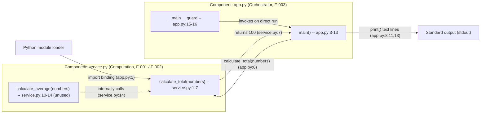
```mermaid
flowchart LR
    Loader["Python module loader"]
    subgraph AppComp["Component: app.py (Orchestrator, F-003)"]
        direction TB
        Guard["__main__ guard -- app.py:15-16"]
        MainFn["main() -- app.py:3-13"]
    end
    subgraph SvcComp["Component: service.py (Computation, F-001 / F-002)"]
        direction TB
        Total["calculate_total(numbers) -- service.py:1-7"]
        Avg["calculate_average(numbers) -- service.py:10-14 (unused)"]
    end
    StdoutNode["Standard output (stdout)"]
    Loader -->|"import binding (app.py:1)"| Total
    Guard -->|"invokes on direct run"| MainFn
    MainFn -->|"calculate_total(numbers) (app.py:6)"| Total
    Total -->|"returns 100 (service.py:7)"| MainFn
    Avg -.->|"internally calls (service.py:14)"| Total
    MainFn -->|"print() text lines (app.py:8,11,13)"| StdoutNode
```

**State transitions.** From an architectural viewpoint, the application component moves through a short, linear lifecycle from module load to a terminal exit state. The diagram includes the two failure terminals — the `NestedChild` import failure and the (unreachable-in-workflow) idle path where the module is imported rather than run. This complements the process-lifecycle view in Section 4.3.1.

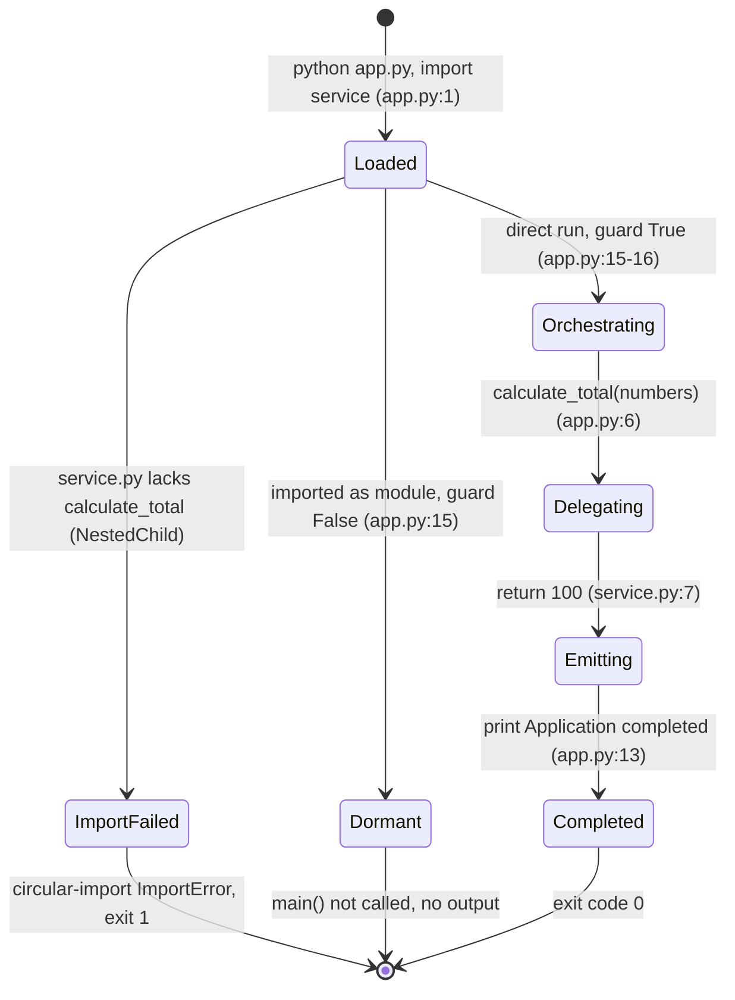
```mermaid
stateDiagram-v2
    [*] --> Loaded: python app.py, import service (app.py:1)
    Loaded --> ImportFailed: service.py lacks calculate_total (NestedChild)
    ImportFailed --> [*]: circular-import ImportError, exit 1
    Loaded --> Dormant: imported as module, guard False (app.py:15)
    Dormant --> [*]: main() not called, no output
    Loaded --> Orchestrating: direct run, guard True (app.py:15-16)
    Orchestrating --> Delegating: calculate_total(numbers) (app.py:6)
    Delegating --> Emitting: return 100 (service.py:7)
    Emitting --> Completed: print Application completed (app.py:13)
    Completed --> [*]: exit code 0
```

**Sequence for the key flow.** The single key flow is the import-bind-call-emit interaction between the two components and stdout. The sequence below focuses on the component interfaces (the operator/runtime-lane view of the same flow appears in Section 4.1.3).

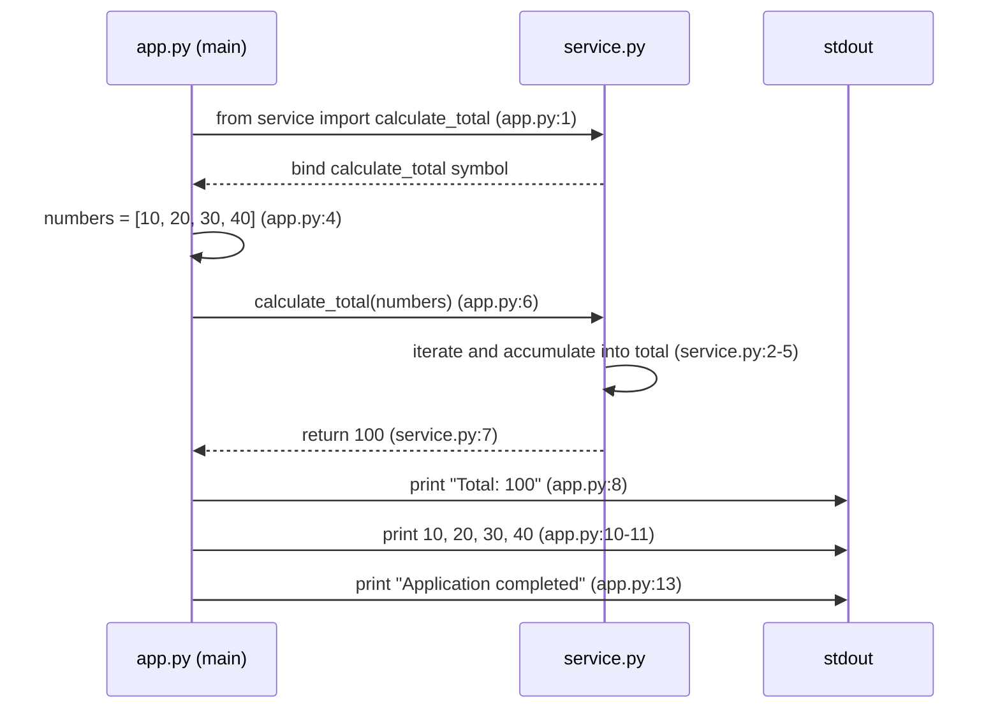
```mermaid
sequenceDiagram
    participant App as app.py (main)
    participant Svc as service.py
    participant Out as stdout
    App->>Svc: from service import calculate_total (app.py:1)
    Svc-->>App: bind calculate_total symbol
    App->>App: numbers = [10, 20, 30, 40] (app.py:4)
    App->>Svc: calculate_total(numbers) (app.py:6)
    Svc->>Svc: iterate and accumulate into total (service.py:2-5)
    Svc-->>App: return 100 (service.py:7)
    App->>Out: print "Total: 100" (app.py:8)
    App->>Out: print 10, 20, 30, 40 (app.py:10-11)
    App->>Out: print "Application completed" (app.py:13)
```

## 5.3 Technical Decisions

This section documents the architectural decisions that the implementation embodies and the tradeoffs each entails. Because the repository contains no design documents, the decisions below are **inferred from the artifacts and observed behavior** and are presented as reverse-engineered Architecture Decision Records; each is tied to concrete evidence. Several decisions are effectively decisions *not* to include a capability (persistence, networking, security), which is appropriate for a fixed-input arithmetic demonstration but is stated explicitly so the boundaries are unambiguous.

### 5.3.1 Architecture Style Decisions and Tradeoffs

The system realizes a **two-module modular monolith** running as a single synchronous process. The table contrasts the realized style with the plausible alternatives a system of this shape could have adopted, and states why the evidence points to the chosen style.

| Candidate Style | Fit for This System | Decision |
| --- | --- | --- |
| Two-module modular monolith (orchestrator + pure service) | Matches the observed `app.py` / `service.py` split with a one-way import dependency | **Chosen** — keeps computation pure/testable while isolating I/O |
| Single-file script | Would collapse `main()` and `calculate_total` into one file | Rejected — loses the separation of concerns that the two files deliberately establish |
| Layered web/framework app (e.g., Flask/Django) | Requires HTTP, routing, templating, and usually persistence — none present | Rejected — no network, UI, or request surface exists |
| Microservices / distributed system | Requires service boundaries, transport, and orchestration | Rejected — there is a single process, no scale or availability driver, and no external interfaces |

**Tradeoffs of the chosen style.** The modular-monolith choice yields maximum simplicity, determinism, and zero operational surface, and it makes the arithmetic independently reusable and easy to reason about. The cost is that the design provides **no** extensibility affordances: input is hard-coded rather than parameterized, there is no test harness, no error handling, and no logging, so the system cannot adapt to variable input, failure conditions, or observability needs without code changes (consistent with Sections 2.4 and 4.3). These are acceptable tradeoffs for a demonstration but would be limiting for any production use.

### 5.3.2 Communication, Storage, Caching, and Security Decisions

The four cross-cutting design choices the prompt calls out are summarized below, each with its evidence and the tradeoff it implies. All four reflect the same underlying driver: a single-process computation over trusted, hard-coded data.

| Decision Area | Choice Made (Evidence) | Rationale and Tradeoff |
| --- | --- | --- |
| Communication pattern | In-process synchronous function call via Python import (`app.py:1`, `app.py:6`); no IPC/RPC/HTTP anywhere | Rationale: everything runs in one process, so a direct call is the simplest and fastest mechanism. Tradeoff: the computation cannot be reached remotely or scaled across processes |
| Data storage | None — data lives only as an in-memory list and is written to stdout (`app.py:4`, `8`); no database, file, or object store (Section 3.5) | Rationale: results need not outlive the run. Tradeoff: no history, audit trail, or reprocessing is possible |
| Caching strategy | None at the application level; the only cache is CPython's `__pycache__` bytecode (an import optimization, not app data) | Rationale: the pure computation is trivial and deterministic, so memoization would add complexity for no benefit. Tradeoff: each call recomputes (negligible at n=4) |
| Security mechanism | None — no authentication, authorization, secrets, input validation, or network exposure | Rationale: the only actor is a local operator running the program over hard-coded data, so there is no attack surface. Tradeoff: the primitive is unsafe if later fed untrusted or non-numeric input (unhandled `TypeError`, Section 4.3.2) |

### 5.3.3 Design Decision Tree

The decision tree traces the reasoning that the observed architecture reflects: at each design question the "No/Yes" branch that the code actually took leads to the realized minimal design, while the alternative branches (marked "not chosen") show the capabilities that were deliberately omitted.

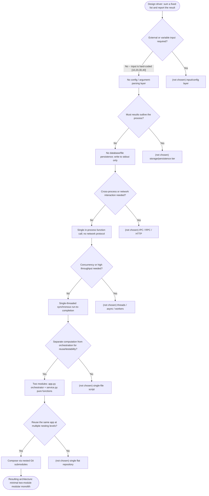
```mermaid
flowchart TD
    Start(["Design driver: sum a fixed list and report the result"])
    Start --> Q1{"External or variable input required?"}
    Q1 -->|"No -- input is hard-coded [10,20,30,40]"| D1["No config / argument-parsing layer"]
    Q1 -->|"Yes"| A1["(not chosen) input/config layer"]
    D1 --> Q2{"Must results outlive the process?"}
    Q2 -->|"No"| D2["No database/file persistence; write to stdout only"]
    Q2 -->|"Yes"| A2["(not chosen) storage/persistence tier"]
    D2 --> Q3{"Cross-process or network interaction needed?"}
    Q3 -->|"No"| D3["Single in-process function call; no network protocol"]
    Q3 -->|"Yes"| A3["(not chosen) IPC / RPC / HTTP"]
    D3 --> Q4{"Concurrency or high throughput needed?"}
    Q4 -->|"No"| D4["Single-threaded synchronous run-to-completion"]
    Q4 -->|"Yes"| A4["(not chosen) threads / async / workers"]
    D4 --> Q5{"Separate computation from orchestration for reuse/testability?"}
    Q5 -->|"Yes"| D5["Two modules: app.py orchestrator + service.py pure functions"]
    Q5 -->|"No"| A5["(not chosen) single-file script"]
    D5 --> Q6{"Reuse the same app at multiple nesting levels?"}
    Q6 -->|"Yes"| D6["Compose via nested Git submodules"]
    Q6 -->|"No"| A6["(not chosen) single flat repository"]
    D6 --> End(["Resulting architecture: minimal two-module modular monolith"])
```

### 5.3.4 Architecture Decision Records (ADRs)

The following reverse-engineered ADRs capture the load-bearing decisions. All are recorded as **Accepted** because they are realized in the shipped code; the "Consequences" note the tradeoffs and, where relevant, the defect they interact with.

| ADR | Decision | Status |
| --- | --- | --- |
| ADR-001 | Separate orchestration (`app.py`) from pure computation (`service.py`) | Accepted |
| ADR-002 | Depend only on the Python standard library (zero third-party dependencies) | Accepted |
| ADR-003 | Hard-code input and emit results to stdout (no config, arguments, or persistence) | Accepted |
| ADR-004 | Gate execution behind the `__main__` guard (importable, side-effect-free module) | Accepted |
| ADR-005 | Compose the repository via nested Git submodules | Accepted |
| ADR-006 | Omit error handling, input validation, and logging (rely on interpreter defaults) | Accepted (with caveats) |

**ADR-001 — Separate orchestration from computation.** *Context:* the program must both drive a workflow and perform arithmetic. *Decision:* place orchestration and I/O in `app.py` and pure arithmetic in `service.py`, with a one-way import dependency (`app.py:1`). *Consequences:* the arithmetic is reusable and trivially testable in isolation, and the orchestrator can evolve independently; however, correct execution now depends on the two files being co-located — the single point of failure that the `NestedChild` defect exploits.

**ADR-002 — Standard library only.** *Context:* the task is elementary arithmetic and printing. *Decision:* use only Python built-ins; introduce no third-party packages and no dependency manifest (verified: the only import anywhere is intra-repository). *Consequences:* the program is maximally portable (Python 3.6+), reproducible, and free of supply-chain risk, at the cost of forgoing any library conveniences (argument parsing, logging, numeric libraries).

**ADR-003 — Hard-coded input, stdout output.** *Context:* the demonstration needs a concrete, repeatable result. *Decision:* embed `[10, 20, 30, 40]` in `main()` (`app.py:4`) and print the report (`app.py:8`, `11`, `13`). *Consequences:* the run is deterministic and dependency-free, but the system cannot process external or variable input and retains nothing after exit.

**ADR-004 — `__main__` guard entry point.** *Context:* `service`-style reuse and direct execution should coexist. *Decision:* invoke `main()` only under `if __name__ == "__main__"` (`app.py:15-16`). *Consequences:* the module can be imported without side effects while still being runnable as a script; this is the idiomatic Python choice and imposes no cost.

**ADR-005 — Nested Git submodule composition.** *Context:* the same application is to appear at multiple nesting levels. *Decision:* declare submodules in `.gitmodules` at the root and `ChildRepo` levels, each pinned to a commit (feature F-004). *Consequences:* levels are independently versioned and composable at checkout time with no runtime coupling; however, populating the tree requires network access to GitHub, and there is no verification of submodule contents — which is how the defective `NestedChild` `service.py` went unnoticed.

**ADR-006 — Omit error handling, validation, and logging.** *Context:* the workflow runs over trusted, hard-coded numeric data. *Decision:* include no `try`/`except`/`finally`/`raise`, no input validation, and no logging framework (verified across the tree). *Consequences:* the happy path is minimal and clear, but any deviation (non-numeric reuse of `calculate_total`, or the `NestedChild` import failure) surfaces only as an uncaught interpreter traceback with a non-zero exit and no diagnostic context (see Section 5.4). This decision is reasonable for a demo but would be unacceptable for production use, hence the "with caveats" status.

## 5.4 Cross-Cutting Concerns

Cross-cutting concerns for this system are dominated by **verified absences**: the codebase is a stateless, single-process, standard-library-only computation with no monitoring, logging, error handling, authentication, SLAs, or runtime external resources anywhere in the tree (consistent with Sections 2.4, 4.2, and 4.3). Rather than assert capabilities the repository does not have, each concern below is reported with its actual status and the evidence for it; the one concern with substantive behavior — error propagation — is diagrammed.

| Cross-Cutting Concern | Status | Evidence |
| --- | --- | --- |
| Monitoring / observability | Absent — no metrics, health checks, or traces | whole tree (no such imports or endpoints) |
| Logging / tracing | Absent — `print()` to stdout is the only output mechanism | `app.py:8`, `11`, `13` |
| Error handling | Absent (implicit) — no `try`/`except`/`finally`/`raise`; interpreter default applies | whole tree (verified) |
| Authentication / authorization | Not applicable — local CLI over hard-coded data; no network or secrets | whole tree |
| Performance requirements / SLAs | None defined — O(n) computation over a fixed n=4 | `service.py:1-7` |
| Disaster recovery | Not applicable at runtime — recoverability is via Git; the `NestedChild` defect needs a source fix | `.gitmodules`, Section 4.3.2 |

### 5.4.1 Monitoring, Observability, Logging, and Tracing

The system has **no monitoring or observability instrumentation** of any kind: there are no metrics counters, no health-check or readiness endpoints, no distributed-tracing spans, and no APM or exporter integrations anywhere in the tree. There is likewise **no logging or tracing strategy** — the codebase contains no use of the `logging` module, no structured-log emitter, and no correlation/trace identifiers. The **only** output mechanism is the standard-library `print()` function writing plain text to stdout (`app.py:8`, `11`, `13`), and the only error output is the Python interpreter's default traceback to stderr (see 5.4.2). Consequently, observability is limited to whatever the invoking operator can read on the console for a single run; nothing is captured, aggregated, timestamped, or retained. The only artifact written to disk during operation is CPython's `__pycache__` bytecode cache, which is an import optimization rather than an observability signal.

### 5.4.2 Error Handling Patterns

The codebase implements **no error-handling constructs** — there is not a single `try`, `except`, `finally`, `raise`, `with`, or logging call anywhere (verified; consistent with Section 4.3.2). The de-facto pattern is therefore *fail-fast with default propagation*: any exception propagates uncaught, the interpreter prints a full traceback to stderr, and the process exits with a non-zero status. Exactly two error conditions exist across the tree, and the executed root/`ChildRepo` workflow encounters **neither**, so those runs always exit `0`:

- **Circular-import `ImportError`** — occurs when running `ChildRepo/NestedChild/app.py`, because that level's `service.py` is a byte-for-byte copy of `app.py` and never defines `calculate_total`; the import at `app.py:1` fails and the process exits `1`.
- **Unhandled `TypeError`** — would occur if `calculate_total` were reused with a non-numeric element (`service.py:5`); it is unreachable through the hard-coded numeric workflow.

There are **no** retry mechanisms, fallback paths, degraded modes, or error-notification flows (no alerting, metrics, or webhooks). Recovery is not automated: correcting the `NestedChild` failure is a source-level maintenance action (restore a real `service` module defining `calculate_total`), and any failing run must simply be re-invoked after the fix. The diagram traces this propagation architecture and the single, empty recovery path.

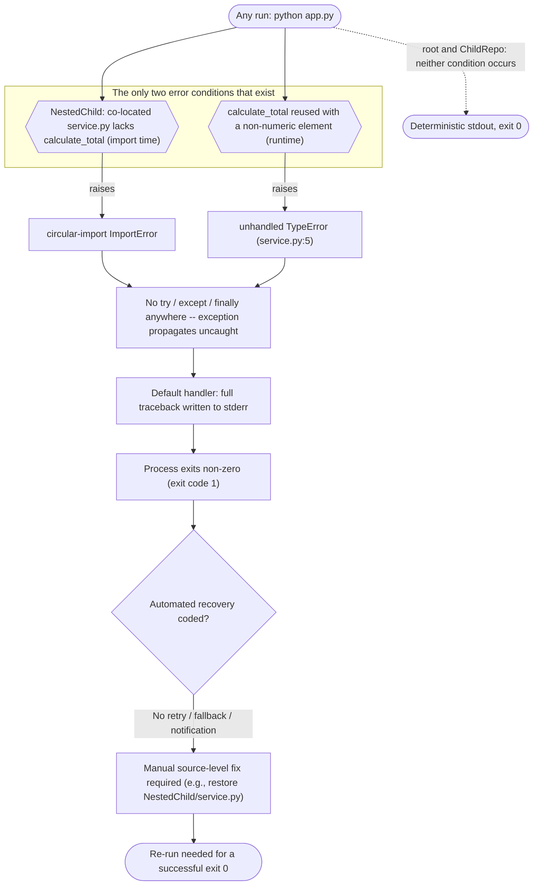
```mermaid
flowchart TD
    Start(["Any run: python app.py"])
    subgraph Sources["The only two error conditions that exist"]
        direction TB
        E1{{"NestedChild: co-located service.py lacks calculate_total (import time)"}}
        E2{{"calculate_total reused with a non-numeric element (runtime)"}}
    end
    Start --> E1
    Start --> E2
    E1 -->|"raises"| Imp["circular-import ImportError"]
    E2 -->|"raises"| Typ["unhandled TypeError (service.py:5)"]
    Imp --> Prop["No try / except / finally anywhere -- exception propagates uncaught"]
    Typ --> Prop
    Prop --> Trace["Default handler: full traceback written to stderr"]
    Trace --> ExitN["Process exits non-zero (exit code 1)"]
    ExitN --> Recov{"Automated recovery coded?"}
    Recov -->|"No retry / fallback / notification"| Manual["Manual source-level fix required (e.g., restore NestedChild/service.py)"]
    Manual --> Rerun(["Re-run needed for a successful exit 0"])
    Start -.->|"root and ChildRepo: neither condition occurs"| Happy(["Deterministic stdout, exit 0"])
```

### 5.4.3 Authentication and Authorization

There is **no authentication or authorization framework**, and none is applicable to the system as built. The program is a local command-line executable that operates on data hard-coded in its own source; it opens no network sockets, exposes no API or UI, reads no credentials or secrets, and integrates with no identity provider. The only trust boundary is the operating-system permission of whoever can execute `python app.py`, which is governed entirely by the host OS and is outside the application. The build-time submodule remotes are referenced through committed, credential-free HTTPS URLs in `.gitmodules` (any access control there is GitHub's, not the application's). No identity, role, scope, token, or policy construct exists anywhere in the repository.

### 5.4.4 Performance Requirements and SLAs

The repository defines **no performance requirements, service-level agreements, latency/throughput targets, or benchmarks** (consistent with Sections 1.2.3 and 4.2.1). What can be characterized is the intrinsic performance profile:

- **Algorithmic cost.** `calculate_total` is O(n) time and O(1) additional space (a single accumulator loop, `service.py:2-5`); the orchestrator's print loop is O(n) (`app.py:10-11`). With the fixed four-element input, the work is effectively constant and negligible.
- **Dominant cost.** End-to-end wall-clock time is dominated by Python interpreter startup and import, not by the computation itself.
- **No large-data path.** The `large.csv` files present at each level are never opened by any code (no `csv` import, no file-open) and are excluded by `.blitzyignore`, so there is no bulk-processing performance concern.

Because there is no monitoring (5.4.1), no performance metric is measured or enforced at runtime; the "acceptance" bar is purely functional (the verified stdout output and exit code documented in Section 1.2.3).

### 5.4.5 Disaster Recovery and Resilience

At **runtime there is nothing to recover**: the process is stateless, holds no session or durable data, and writes only to stdout, so a failed run leaves no partial or corrupt state — re-invocation reproduces identical, deterministic output. There is no redundancy, failover, replication, or backup because there is a single process and no data store (none is warranted for this scope).

At the **repository/source level**, recoverability is provided by Git: the application source and the pinned submodule pointers are version-controlled, so a working tree can be reconstituted in a fresh environment with `git clone` followed by `git submodule update --init --recursive` (feature F-004; see Section 4.1.3), assuming network access to the GitHub remotes. The one standing "disaster" already present in the tree is the **`NestedChild` defect**, which is **not** self-healing: because there is no submodule content verification, the corrupt `service.py` must be corrected by a deliberate source-level fix before that level can run. In short, the system's resilience story is determinism plus version control, not any runtime recovery mechanism.

## 5.5 References

The following repository artifacts, verification activities, and specification sections were examined as evidence for Section 5. All statements above are grounded in these sources; no external web sources were required.

**Repository files examined:**

- `app.py` — Root application entry point / orchestrator; established `main()`, the hard-coded input list (`app.py:4`), the `from service import calculate_total` dependency (`app.py:1`), the delegated call (`app.py:6`), the stdout output lines (`app.py:8`, `11`, `13`), and the `__main__` guard (`app.py:15-16`).
- `service.py` — Root computation service module; established the pure `calculate_total` (lines 1–7) and the defined-but-unused `calculate_average` (lines 10–14), and the absence of imports and side effects.
- `.gitmodules` — Root submodule declaration; established the `ChildRepo` submodule and its credential-free GitHub HTTPS URL (`600K_ChildRepo.git`).
- `ChildRepo/.gitmodules` — Established the nested `NestedChild` submodule declaration (`600K_Nested_ChildRepo.git`).
- `ChildRepo/app.py`, `ChildRepo/service.py` — Established that the `ChildRepo` level mirrors the root application byte-for-byte and behaves identically.
- `ChildRepo/NestedChild/app.py` — Established the mirrored entry point at the deepest level.
- `ChildRepo/NestedChild/service.py` — Established the **defect**: this file is a byte-for-byte copy of `app.py` (it does not define `calculate_total`), causing the circular-import `ImportError`.
- `README.md` (all three levels) — Established that documentation is a single title line only (non-architectural).
- `.blitzyignore` (all three levels) — Established the `*.csv` exclusion policy applied to the `large.csv` files (which are omitted and never read by code).

**Repository folders examined:**

- Repository root (path `""`) — Established the top-level structure and the two-module application shape.
- `ChildRepo/` — Git submodule level; contained the mirrored two-module application and its own `.gitmodules`.
- `ChildRepo/NestedChild/` — Nested Git submodule level; contained the defective instance.
- `__pycache__/` (all three levels) — Contained CPython 3.12 bytecode caches (`service.cpython-312.pyc`), used to confirm the toolchain and to verify the `NestedChild` defect from compiled symbols.

**Verification evidence (direct inspection):**

- Execution under Python 3.12.3 — Confirmed root and `ChildRepo` runs print `Total: 100` / `10` / `20` / `30` / `40` / `Application completed` and exit `0`; confirmed `ChildRepo/NestedChild/app.py` raises a circular-import `ImportError` and exits `1`.
- Bytecode inspection — Confirmed root and `ChildRepo` `service.cpython-312.pyc` export `calculate_total` and `calculate_average`, whereas the `NestedChild` cache exports `main` (proving `service.py` there is an `app.py` copy).
- Git metadata — Confirmed the submodule chain and the pinned `ChildRepo` commit; confirmed the only import statement anywhere is the intra-repository `from service import calculate_total`.

**Cross-referenced specification sections:**

- `1.2 System Overview` — Component inventory, separation-of-concerns technical approach, and verifiable-behavior acceptance criteria.
- `2.1 Feature Catalog` / `2.3 Feature Relationships` — Feature identifiers F-001–F-004 and the absence of cross-level runtime coupling.
- `2.4 Implementation Considerations` — Verified absence of build/test/CI/logging/error handling.
- `3.3 Open Source Dependencies` / `3.4 Third-Party Services` / `3.5 Databases and Storage` — Zero dependencies, no external services, and no database/storage/caching.
- `3.6 Development and Deployment` — Git submodule composition and the CPython 3.12 toolchain.
- `4.1 System Workflows` — Actors/boundaries, the runtime sequence, and build-time submodule composition.
- `4.2 Flowchart Requirements and Validation Rules` — Verified absence of timing/SLA constraints and authorization checkpoints.
- `4.3 Technical Implementation Flows` — State management (ephemeral in-process state) and error-handling behavior (the two error conditions and empty recovery path).

# 6. SYSTEM COMPONENTS DESIGN

## 6.1 Core Services Architecture

### 6.1.1 Applicability Assessment

**Determination: Core Services Architecture is not applicable for this system.**

The repository is a single-process, synchronous, standard-library-only Python program — a two-module modular monolith comprising an orchestrator (`app.py`) and a pure-function computation module (`service.py`) that runs to completion and writes a deterministic report to standard output (see Section 5.1 High-Level Architecture). It contains no microservices, no distributed components, no network-addressable services, and no inter-process or inter-service communication of any kind. The concerns this section is intended to document — service boundaries, inter-service communication, service discovery, load balancing, circuit breakers, retry/fallback, horizontal/vertical scaling, auto-scaling, failover, and data redundancy — presuppose a distributed or service-oriented runtime that this system neither has nor requires.

This determination is not merely an inference from the small size of the codebase; it is grounded in the verified absence of every runtime primitive on which a core services architecture depends. Across the entire tree (root plus the `ChildRepo` and `ChildRepo/NestedChild` submodules), the only import statement anywhere is a local `from service import calculate_total` (`app.py:1`), and an exhaustive search finds no sockets, no HTTP/RPC clients or servers, no message brokers, no `asyncio`/threading/multiprocessing, no subprocess spawning, no service frameworks, and no server-binding calls. The single unit of deployment is one operating-system process launched by `python app.py`, and the single "interaction" within it is an in-process Python function call.

The table below records each prerequisite of a core services architecture against its presence in this system.

**Table 6.1-1 — Core-Services Prerequisites vs. This System**

| Distributed-Systems Prerequisite | Present in System | Evidence |
| --- | --- | --- |
| Two or more independently deployable services | No | Single OS process, one entry point `app.py` (Section 5.1.1) |
| Network-addressable service endpoints / APIs | No | No socket / HTTP / RPC / server code anywhere in the tree |
| Inter-service communication (messaging, RPC, events) | No | Only interaction is the in-process call `app.py:6`; only import `app.py:1` |
| Service discovery / registry | No | No registry or DNS-based lookup; single co-located module |
| Load balancing / API gateway | No | No load balancer, gateway, or reverse proxy present |
| Circuit breaker / retry / fallback | No | No error handling at all (no `try`/`except`); see Section 5.4.2 |
| Independent horizontal/vertical scaling per service | No | Fixed single-process batch; no scaling mechanism (Section 5.4.4) |
| Runtime failover / redundancy / replication | No | Stateless single process, no data store; see Section 5.4.5 |

Because none of these prerequisites is present, the remainder of this section documents the architecture the system actually implements (Section 6.1.2) and then dispositions each distributed-systems capability the prompt enumerates (Section 6.1.3), so that the record is explicit rather than merely asserting non-applicability. This conclusion is consistent with the modular-monolith characterization in Sections 1.2, 5.1, and 5.4.

### 6.1.2 System Topology and Execution Model

To make the non-applicability determination concrete, this subsection describes the topology the system actually implements. The runtime topology is a **single operating-system process** started by `python app.py`; that process is the entire system. Within it there are two logical modules connected by one synchronous, in-process function call, and there is no second process, host, container, or network participant with which to communicate (Section 5.1.1).

**The module boundary is not a service boundary.** Although the computation module is named `service.py`, it is an in-process Python library module of pure functions — `calculate_total` (feature F-001, `service.py:1-7`) and `calculate_average` (feature F-002, `service.py:10-14`) — not a network-addressable or independently deployable service. The orchestrator obtains it through the language import mechanism (`from service import calculate_total`, `app.py:1`) and invokes it with an ordinary function call (`app.py:6`); the module exposes no endpoint, port, or wire protocol (Section 5.1.2). The boundary crossed at runtime is therefore a Python module boundary within a single address space, resolved by the interpreter's module loader — not a service call over a transport.

**The multi-repository structure is build-time composition, not a distributed runtime.** The same two-module application is replicated at each level of a three-level Git-submodule chain (`600K_ParentRepo` → `ChildRepo` → `ChildRepo/NestedChild`), declared in `.gitmodules` (feature F-004). This is source composition performed at checkout/build time via `git submodule update --init --recursive`; the three levels never interact at runtime, because each `app.py` resolves `service` only from its own directory (Sections 4.1.3 and 5.1.4). Consequently, the submodule chain does not constitute a distributed system, a service mesh, or a deployment topology — it is a packaging arrangement of identical, independent copies.

The diagram below — the **Service Interaction Diagram** for this system — shows the sole runtime interaction (an in-process call) and explicitly enumerates the distributed/service constructs that are absent.

**Diagram 6.1-1 — Service Interaction (Actual In-Process Model)**

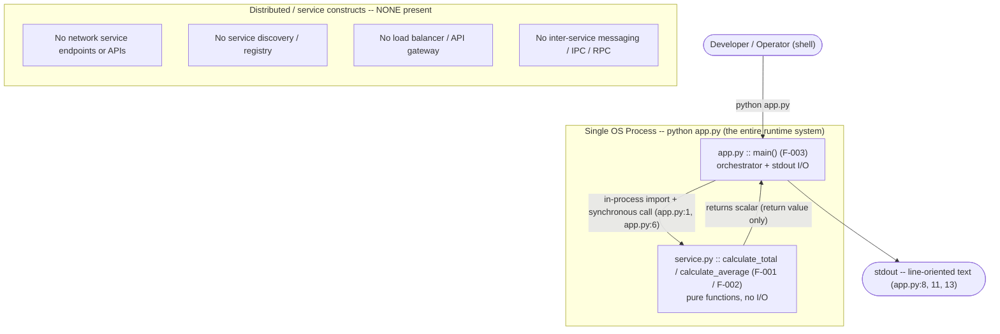
```mermaid
flowchart TB
    Operator(["Developer / Operator (shell)"])
    subgraph Proc["Single OS Process -- python app.py (the entire runtime system)"]
        direction TB
        Main["app.py :: main() (F-003)<br/>orchestrator + stdout I/O"]
        Svc["service.py :: calculate_total / calculate_average (F-001 / F-002)<br/>pure functions, no I/O"]
        Main -->|"in-process import + synchronous call (app.py:1, app.py:6)"| Svc
        Svc -->|"returns scalar (return value only)"| Main
    end
    Stdout(["stdout -- line-oriented text (app.py:8, 11, 13)"])
    Operator -->|"python app.py"| Main
    Main --> Stdout
    subgraph Absent["Distributed / service constructs -- NONE present"]
        direction TB
        NA1["No network service endpoints or APIs"]
        NA2["No service discovery / registry"]
        NA3["No load balancer / API gateway"]
        NA4["No inter-service messaging / IPC / RPC"]
    end
```

As the diagram indicates, the only runtime "interaction" is the orchestrator-to-computation function call inside a single process, and the only externally visible effects are the lines written to stdout and the integer process exit code (Section 5.1.4). There are no network endpoints, no service registry, no load balancer or gateway, and no inter-service messaging to depict, because none exists in the codebase.

### 6.1.3 Disposition of Distributed-Systems Capabilities

Because the system is a single-process modular monolith (Section 6.1.2), each capability enumerated by the prompt under *Service Components*, *Scalability Design*, and *Resilience Patterns* is dispositioned below with its status and the supporting evidence, so the record is explicit. Every status resolves to "none / not applicable / not implemented," and each is grounded in observed code rather than in generic distributed-systems assumptions.

#### 6.1.3.1 Service Components

The prompt's service-component concerns presuppose multiple cooperating services; this system has one process and a single in-process module boundary. Each concern is mapped below.

**Table 6.1-2 — Service-Component Concerns: Disposition**

| Concern | Disposition | Basis |
| --- | --- | --- |
| Service boundaries & responsibilities | One in-process module boundary only: `app.py` orchestrates and performs stdout I/O; `service.py` computes (pure). No service tier exists. | Sections 5.1.1–5.1.2; `app.py:3-13`, `service.py:1-14` |
| Inter-service communication patterns | None — a single synchronous in-process function call; no network, RPC, or messaging | `app.py:1` (import), `app.py:6` (call) |
| Service discovery mechanisms | None — the module is resolved by the interpreter's loader from the co-located directory; no registry or DNS | Section 5.1.3; sole import is local |
| Load balancing strategy | None — no load balancer, gateway, or reverse proxy; a single process serves the single run | Verified absence across the tree |
| Circuit breaker patterns | None — no failure-isolation constructs; no `try`/`except` anywhere | Section 5.4.2 |
| Retry & fallback mechanisms | None — fail-fast default propagation; no retry loop or fallback path | Section 5.4.2 |

Because the two modules share one process and one address space, "communication" between them collapses to a language-level call whose failure semantics are exceptions rather than transport errors. Patterns designed to tolerate partial or network failure (circuit breakers, retries, fallbacks) therefore have no failure domain to protect (Section 5.4.2).

#### 6.1.3.2 Scalability Design

No scalability design is implemented. The workload is a fixed O(n) computation over a hard-coded four-element list, and end-to-end cost is dominated by Python interpreter startup rather than by the computation itself (Section 5.4.4). There is no horizontal or vertical scaling, no auto-scaling, no resource-allocation policy, and no capacity plan. Because `calculate_total` and `calculate_average` are pure, stateless, and deterministic (Section 5.1.1), the only scaling model the code even permits is manual replication of independent, share-nothing process invocations — which is neither implemented nor orchestrated.

**Table 6.1-3 — Scalability Concerns: Disposition**

| Concern | Disposition | Basis |
| --- | --- | --- |
| Horizontal / vertical scaling approach | Not implemented — single fixed process; share-nothing replication is possible but manual and unmanaged | Section 5.4.4; pure functions `service.py:1-14` |
| Auto-scaling triggers & rules | None — no metrics, thresholds, or scaler; no orchestrator | Section 5.4.1 (no metrics/monitoring) |
| Resource allocation strategy | None — no quotas, limits, or reservations; relies on host defaults | No config/infra files present in the tree |
| Performance optimization techniques | None coded — computation is O(n) with n = 4; cost dominated by interpreter startup | Section 5.4.4 |
| Capacity planning guidelines | None defined — no SLAs, throughput/latency targets, or benchmarks | Sections 1.2.3 and 5.4.4 |

**Diagram 6.1-2 — Scalability Architecture (Implemented vs. Available)**

```mermaid
flowchart TB
    subgraph Current["Implemented model: single invocation"]
        direction TB
        P0["1 OS process: python app.py<br/>fixed input [10,20,30,40], O(n) with n=4"]
    end
    subgraph Available["Only scaling the code permits (NOT implemented; manual)"]
        direction TB
        R1["Independent process run #1"]
        R2["Independent process run #2"]
        Rn["Independent process run #N"]
        Note1["Share-nothing: pure, stateless, deterministic functions --> no shared state, no coordination"]
    end
    subgraph NotPresent["Elastic-scaling constructs -- NONE present"]
        direction TB
        X1["No horizontal auto-scaling / HPA"]
        X2["No vertical scaling policy"]
        X3["No load balancer / scheduler / orchestrator"]
        X4["No resource quotas / capacity plan"]
    end
    P0 -.->|"could be replicated manually"| R1
    P0 -.->|"could be replicated manually"| R2
    P0 -.->|"could be replicated manually"| Rn
```

The diagram distinguishes the implemented single-invocation model from the only scaling approach the code permits — manually launching additional independent, share-nothing process runs — and marks the elastic-scaling constructs (auto-scaling, load balancing/orchestration, resource quotas, capacity plan) that are not present.

#### 6.1.3.3 Resilience Patterns

No runtime resilience patterns are implemented. The process is stateless and follows a fail-fast model in which any uncaught exception propagates to the interpreter's default handler (Section 5.4.2). There is no fault tolerance, disaster-recovery automation, data redundancy, failover, or service-degradation policy. As documented in Section 5.4.5, the system's effective resilience story is *determinism plus version control*: a failed run leaves no partial or durable state, so re-invocation reproduces identical output, and source recoverability is provided by Git. The one standing defect — the `NestedChild` submodule whose `service.py` is a byte-for-byte copy of `app.py`, causing a circular-import `ImportError` — is not self-healing and requires a deliberate source-level fix (Section 5.4.2).

**Table 6.1-4 — Resilience Concerns: Disposition**

| Concern | Disposition | Basis |
| --- | --- | --- |
| Fault tolerance mechanisms | None — fail-fast; uncaught exceptions propagate; no isolation | Section 5.4.2 |
| Disaster recovery procedures | Not applicable at runtime — stateless; source recovery via Git (`git clone` + submodule update) | Section 5.4.5; `.gitmodules` |
| Data redundancy approach | Not applicable — no data store; only ephemeral in-memory values and stdout | Sections 5.1.3 and 3.5 |
| Failover configurations | None — a single process with no standby or replica | Section 5.4.5 |
| Service degradation policies | None — no degraded mode; a run either completes deterministically or fails fast | Sections 5.4.2 and 5.4.5 |

**Diagram 6.1-3 — Resilience Pattern Implementation (Actual)**

```mermaid
flowchart TD
    Run(["python app.py (single process)"])
    Run --> Outcome{"Run outcome"}
    Outcome -->|"root / ChildRepo: success"| OK(["Deterministic stdout, exit 0"])
    Outcome -->|"NestedChild: circular-import ImportError"| Fail["Uncaught exception (no try/except anywhere)"]
    Fail --> FailFast["Fail-fast: traceback to stderr, exit 1"]
    FailFast --> Recover{"Automated recovery coded?"}
    Recover -->|"No retry / fallback / failover / circuit breaker"| Manual["Manual: source-level fix and/or re-run<br/>(idempotent -- determinism yields identical output)"]
    Manual --> Run
    subgraph NoPatterns["Resilience patterns -- NONE present"]
        direction TB
        N1["No redundancy / replication / backup"]
        N2["No failover / standby instances"]
        N3["No circuit breaker / bulkhead / timeout"]
        N4["No graceful-degradation policy"]
    end
```

The diagram shows the fail-fast outcome path and the sole (manual) recovery route — a source-level fix and/or re-run, which is idempotent by determinism — alongside the resilience patterns (redundancy, failover, circuit breaker/bulkhead/timeout, graceful degradation) that are not present. This is consistent with the disaster-recovery and resilience treatment in Section 5.4.5.

### 6.1.4 References

Repository files and folders examined as evidence for this section:

- `app.py` - Root entry-point/orchestrator; established the single in-process import and call (`app.py:1`, `app.py:6`) and the stdout output (`app.py:8,11,13`), confirming the absence of any network or service invocation.
- `service.py` - Pure computation module (`calculate_total` at lines 1–7, `calculate_average` at lines 10–14); confirmed pure, stateless, deterministic functions with no I/O, network, or service endpoint.
- `.gitmodules` - Declared the build-time submodule composition (root → `ChildRepo`); established that multi-repo structure is checkout-time, not a distributed runtime.
- `ChildRepo/` - Git submodule replicating the same two-module application; its `.gitmodules` declares the nested `NestedChild` submodule.
- `ChildRepo/NestedChild/` - Defective submodule instance whose `service.py` is a byte-for-byte copy of `app.py`, producing a circular-import `ImportError`; cited as the standing resilience defect.
- `README.md` - One-line documentation at each level; confirmed no architectural or operational service documentation.
- `.blitzyignore` - Excludes `*.csv`; the `large.csv` files are never opened by any code and are excluded from analysis and documentation.
- Repository-wide verification (across all `.py` files, excluding `.git` and `*.csv`) - Confirmed no sockets, HTTP/RPC clients or servers, message brokers, `asyncio`/threading/multiprocessing, subprocess spawning, service frameworks, or server-binding calls, and no dependency manifests, Dockerfiles, CI/CD, or infrastructure/config files.

Technical Specification sections cross-referenced:

- `1.2 System Overview` - Overall characterization as a minimal, standard-library-only Python demonstration.
- `2.1 Feature Catalog` and `2.3 Feature Relationships` - Feature identifiers F-001 (`calculate_total`), F-002 (`calculate_average`, unused), F-003 (`app.py` `main()`), F-004 (nested submodule composition) and their relationships.
- `3.3 Open Source Dependencies`, `3.4 Third-Party Services`, `3.5 Databases and Storage` - Zero third-party dependencies, no external services, and no data store.
- `4.1.3 Integration Workflows` - Distinction between runtime interaction and build-time submodule composition.
- `5.1 High-Level Architecture` - Modular-monolith style, system boundaries, data flow, and external integration points.
- `5.2 Component Details` - Per-component profiles for `app.py`, `service.py`, and the submodule composition.
- `5.4 Cross-Cutting Concerns` - Error handling (5.4.2), performance requirements/SLAs (5.4.4), and disaster recovery/resilience (5.4.5).

## 6.2 Database Design

### 6.2.1 Applicability Assessment

**Database Design is not applicable to this system.**

At the repository root (`app.py`, `service.py`) and across both nested Git submodules (`ChildRepo/`, `ChildRepo/NestedChild/`), the codebase implements a single-process, synchronous, run-to-completion Python program that sums a hard-coded, in-memory list of integers and writes the result to standard output. It defines **no database, no persistent store, no object/file storage, no caching subsystem, and no data-access layer of any kind**. All application state is ephemeral: it exists only in process memory for the duration of a single invocation and is reclaimed when the interpreter exits.

This determination aligns with the technology inventory already recorded elsewhere in this specification. Section 3.5 (Databases and Storage) documents that the system uses no database and no persistent storage, and Section 5.1.3 (Data Flow) documents that there are no data stores or caches. Section 1.2 (System Overview) records that the program performs no network, database, or file I/O and carries zero third-party dependencies — the only `import` statement anywhere in the tree is the intra-repository `from service import calculate_total` (`app.py:1`).

The following table evaluates each prerequisite that a database-design section would normally document against the observed repository evidence.

**Table 6.2-1: Database-Design Prerequisites vs. This System**

| Database-Design Prerequisite | Present? | Evidence in Repository |
|---|---|---|
| Database engine or driver (RDBMS / NoSQL / key-value) | No | No `sqlite3`, `sqlalchemy`, `psycopg`, `pymongo`, `redis`, or `boto3` import in any `.py` file; the sole import anywhere is `from service import calculate_total` (`app.py:1`) |
| Persistence / data-access layer (ORM, repository, DAO) | No | `service.py` and `app.py` contain only pure arithmetic functions; searches for `orm`, `persist`, `Session`, `engine`, `cursor`, `commit` returned zero matches |
| Connection configuration (DSN, pool, credentials) | No | No configuration manifests of any kind exist (`.env`, `.ini`, `.yaml`, `.yml`, `.json`, `.toml`, `.cfg`); no connection string appears in source |
| Schema artifacts (DDL, models, migrations) | No | No `.sql` files, no migration directory, no model/entity classes; no `CREATE TABLE`, `INSERT`, or `SELECT` text anywhere in the tree |
| Durable application state | No | The only application state is the in-memory list literal `[10, 20, 30, 40]` (`app.py:4`) plus function-local variables, discarded at process exit |
| Cache store (Redis / Memcached / equivalent) | No | No cache-client import exists; the `__pycache__/*.pyc` artifact is Python bytecode for import acceleration, not an application data cache |

Two artifacts warrant explicit clarification so their presence is not mistaken for a storage tier:

- **`large.csv`** (present at each level of the tree) is excluded by the `.blitzyignore` rule `*.csv` and is **never opened or read by the application**. No `csv` module is imported and no file-open call (`open(`) exists in any source file, so this file participates in neither input nor output of the program.
- **`__pycache__/service.cpython-312.pyc`** is a CPython bytecode-import cache produced by the interpreter. It caches compiled *code*, not application *data*, and therefore does not constitute a data cache or persistence layer (consistent with Sections 3.5 and 5.1.3).

Because no persistence substrate exists, the schema-design, data-management, compliance, and performance-optimization concerns enumerated for this section have nothing to configure or tune at a data layer. Rather than merely asserting the absence, the remaining sub-sections make it explicit and auditable: sub-section 6.2.2 documents the actual **in-memory, transient** data-handling model the code does exhibit (with the required data-flow and entity diagrams), and sub-section 6.2.3 dispositions each individual database-design concern — including all indexes and constraints — against the repository evidence.

### 6.2.2 Actual Data Handling Model

Although there is no database to design, the program does manipulate data — entirely in memory. This sub-section documents that transient model so the "not applicable" determination is transparent about what the code actually does with values at runtime.

The data lifecycle is a straight, non-persistent pipeline confined to a single OS process:

1. **Construction** — `main()` builds a fixed list literal `numbers = [10, 20, 30, 40]` in RAM (`app.py:4`). There is no external source; the input is embedded in the code.
2. **Reduction** — the list is passed by reference to `calculate_total(numbers)` (`app.py:6`), which initializes a local accumulator `total = 0` (`service.py:2`), iterates the elements adding each to the accumulator (`service.py:4-5`), and returns the scalar sum (`service.py:7`).
3. **Formatting / emission** — `main()` formats the returned scalar with an f-string and prints it, then loops printing each element, then prints a completion line (`app.py:8`, `app.py:11`, `app.py:13`).
4. **Disposal** — no value is written back anywhere; all bindings become unreachable and are reclaimed when the process exits. Nothing is serialized, flushed, or persisted.

Consistent with Section 5.1.3, only two data-transformation points exist — a **reduction** (list → scalar sum in `calculate_total`) and a **formatting** step (integer → text via f-string / `print`). No parsing, deserialization, or serialization occurs anywhere in the tree. A second function, `calculate_average` (`service.py:10-14`), computes a mean by delegating to `calculate_total` and dividing by `len(numbers)` (returning `0` for an empty list), but it is never invoked by any `app.py` and therefore contributes no runtime data flow.

The table below enumerates every transient in-memory structure the running program creates. None of these are stored; they exist only within a single invocation.

**Table 6.2-2: Transient In-Memory Data Structures (No Persistence)**

| Structure | Python Type | Lifetime & Scope | Definition Site |
|---|---|---|---|
| `numbers` (input list) | `list[int]` | Process lifetime; local to `main()` | `app.py:4` (literal `[10, 20, 30, 40]`) |
| `number` (element / loop variable) | `int` | Per-iteration; loop-local | `service.py:4-5`; `app.py:10-11` |
| `total` (accumulator) | `int` | Single function call; local to `calculate_total` | `service.py:2-7` |
| `total` (result holder) | `int` | Process lifetime; local to `main()` | `app.py:6-8` |
| `average` (mean; unused path) | `float` | Single function call; local to `calculate_average` | `service.py:14` |

**Diagram 6.2-1: Runtime Data Flow (Ephemeral, In-Memory)** — the pipeline from list construction to standard output, with an explicit tier showing that no persistence store participates.

```mermaid
flowchart LR
    Operator(["Developer / Operator (shell)"])
    subgraph Proc["Single OS Process (python app.py) -- ALL state ephemeral / in-memory"]
        direction LR
        Lit["List literal [10,20,30,40]<br/>constructed in RAM (app.py:4)"]
        Calc["calculate_total(numbers)<br/>local accumulator 'total' (service.py:2-7)"]
        Fmt["f-string + print() formatting<br/>(app.py:8,11,13)"]
        Lit -->|"passed by reference (app.py:6)"| Calc
        Calc -->|"returns scalar 100 (service.py:7)"| Fmt
    end
    Stdout(["stdout -- line-oriented text"])
    Operator -->|"python app.py"| Lit
    Fmt --> Stdout
    Calc -.->|"discarded on return"| GC["Garbage-collected at process exit<br/>(no write-back)"]
    subgraph NoPersist["Persistence tier -- NONE present"]
        direction TB
        NP1["No database / table / collection"]
        NP2["No file or object store (no open(), no csv/json)"]
        NP3["No cache store (Redis/Memcached absent)"]
    end
```

**Diagram 6.2-2: Transient Data-Structure Entity View (ERD)** — an entity-relationship rendering of the in-memory structures above. It is included to satisfy the ERD requirement while honestly showing that these entities are **not persisted** and carry **no primary keys, foreign keys, or indexes**. The relationships are in-memory value associations only, not table joins.

```mermaid
erDiagram
    INPUT_LIST ||--o{ INTEGER_ELEMENT : "contains (in memory only)"
    INPUT_LIST ||--|| SCALAR_TOTAL : "reduced to (return value)"
    INPUT_LIST {
        list numbers "TRANSIENT; literal [10,20,30,40]; not persisted"
    }
    INTEGER_ELEMENT {
        int value "TRANSIENT operand; iterated/accumulated; not persisted"
    }
    SCALAR_TOTAL {
        int total "TRANSIENT sum; printed then discarded; not persisted"
    }
```

### 6.2.3 Disposition of Database-Design Concerns

This sub-section dispositions every concern enumerated in the section prompt — Schema Design, Data Management, Compliance Considerations, and Performance Optimization — against the repository evidence. Each concern is recorded as **None / Not applicable** with the specific rationale that makes the absence auditable rather than assumed. All tables use three columns.

#### 6.2.3.1 Schema Design

There is no schema: no tables, collections, documents, models, or DDL exist anywhere in the tree. The only data shapes are the transient in-memory structures catalogued in Table 6.2-2. Indexes and constraints are documented explicitly below and are, in every category, absent.

**Table 6.2-3: Schema-Design Concerns**

| Concern | Status | Evidence / Rationale |
|---|---|---|
| Entity relationships | None | No entities/tables/collections are defined; only transient in-memory structures exist (Table 6.2-2) |
| Data models & structures | In-memory only | A single `list[int]` literal plus scalar `int`/`float` locals; no schema, no DDL, no model/entity classes |
| Indexing strategy | None | No datastore exists, so there are zero indexes of any type (primary, secondary, composite, or full-text) |
| Partitioning approach | None | No tables or collections exist to partition; no sharding, range, or hash partitioning is present |
| Replication configuration | None (runtime) | No primary/replica pair or replication stream; see Diagram 6.2-3. The only duplication is build-time Git submodule source composition |
| Backup architecture | None (data) | No data backup, snapshot, or WAL target; source is recoverable via `git clone` + `git submodule update --init --recursive` |
| Indexes (all types, explicit) | None | No index objects are declared — there is nothing to index |
| Constraints (PK / FK / unique / check / not-null) | None | No schema means no declared constraints; the only value guard in code is the empty-input check in `calculate_average` (`service.py:11-12`) |

The prompt requires a replication-architecture diagram. Because no runtime data replication exists, the diagram below contrasts the **absent** data-replication tier against the **build-time Git submodule** composition that does duplicate *source* (never *data*). The nested submodule chain (root → `ChildRepo` → `ChildRepo/NestedChild`) is a source-assembly mechanism resolved at checkout, not a data-replication topology.

**Diagram 6.2-3: Replication Architecture (No Runtime Data Replication)**

```mermaid
flowchart TB
    subgraph DataRepl["Runtime DATA replication / high-availability -- NONE present"]
        direction TB
        D1["No primary/replica database pair"]
        D2["No streaming / logical / snapshot replication"]
        D3["No standby, read replica, or failover node"]
        D4["No backup or WAL/oplog target"]
    end
    subgraph SrcComp["Build-time SOURCE composition (NOT data replication)"]
        direction TB
        Root["600K_ParentRepo (root)"]
        Child["ChildRepo (Git submodule)"]
        Nested["ChildRepo/NestedChild (Git submodule)"]
        Root -->|".gitmodules -> git submodule update"| Child
        Child -->|".gitmodules -> git submodule update"| Nested
    end
    SrcComp -.->|"duplicates SOURCE at checkout, never DATA at runtime"| DataRepl
```

#### 6.2.3.2 Data Management

No data is stored, so the data-management lifecycle collapses to in-memory construction and standard-output emission. The only versioning present is source-control versioning of the code, not schema or data versioning.

**Table 6.2-4: Data-Management Concerns**

| Concern | Status | Evidence / Rationale |
|---|---|---|
| Migration procedures | None | No migration tool, migration directory, or versioned DDL; there is no schema to migrate |
| Versioning strategy | Source-only (Git) | No data or schema versioning; only the code is versioned in Git (branch `2007_01`, HEAD `c77daf2`, six commits) |
| Archival policies | None | No data is retained, so there is nothing to archive |
| Data storage & retrieval mechanisms | In-memory literal + stdout | "Storage" is a code literal (`app.py:4`); "retrieval" is a function return value (`service.py:7`); output is `print` to stdout |
| Caching policies | None | No application-level cache exists; `__pycache__/*.pyc` is interpreter bytecode, not cached application data |

#### 6.2.3.3 Compliance Considerations

The program neither collects nor stores any personal, sensitive, or business data — its input is a hard-coded list of integers. Consequently, no data-layer retention, privacy, audit, or access-control regime is implemented or required. Controls that do exist are limited to the operating system's file and process permissions.

**Table 6.2-5: Compliance Concerns**

| Concern | Status | Evidence / Rationale |
|---|---|---|
| Data retention rules | None | No records are stored; the input is a static integer literal discarded at process exit |
| Backup & fault-tolerance policies | None (data) | No data backup, redundancy, or failover; source is recoverable via Git (see Section 5.4.5) |
| Privacy controls | Not required at data layer | No personal or sensitive data is collected or stored; the input is hard-coded integers (`app.py:4`) |
| Audit mechanisms | None (transient stdout only) | No audit log is persisted; the sole record of a run is transient standard output (`app.py:8`, `app.py:11`, `app.py:13`) |
| Access controls | OS-level only | No data-layer authentication or authorization exists; access is governed solely by OS file and process permissions |

#### 6.2.3.4 Performance Optimization

There is no datastore to tune, so the query-, connection-, and replica-oriented optimizations do not apply. The single meaningful performance characteristic is algorithmic: `calculate_total` performs one linear O(n) pass over the in-memory list (`service.py:4-5`).

**Table 6.2-6: Performance-Optimization Concerns**

| Concern | Status | Evidence / Rationale |
|---|---|---|
| Query optimization patterns | None | No query engine, SQL, or query plans; the only computation is an O(n) single-pass accumulation loop (`service.py:4-5`) |
| Caching strategy | None | No memoization or result cache; each invocation recomputes the sum from the literal |
| Connection pooling | None | No database or network connections exist to pool |
| Read/write splitting | None | No primary/replica topology exists, so there is no read or write traffic to route |
| Batch processing approach | In-memory single pass | The full list is processed synchronously in one pass; there is no batching, chunking, or streaming against any datastore |

### 6.2.4 References

The following repository artifacts were inspected as evidence for the determination and dispositions in this section.

**Files examined:**

- `app.py` — root entry point; established the in-memory list literal `[10, 20, 30, 40]` (`:4`), the `calculate_total` call (`:6`), the standard-output `print` statements (`:8`, `:11`, `:13`), and the sole `import` in the tree (`:1`).
- `service.py` — established the pure arithmetic functions `calculate_total` (`:1-7`, the O(n) accumulation loop) and `calculate_average` (`:10-14`, including the empty-input guard); confirmed no imports, I/O, persistence, or database access.
- `README.md` — confirmed the repository carries only a title heading and no data/storage documentation.
- `.blitzyignore` — established the `*.csv` exclusion rule; confirms `large.csv` is out of scope and never read by the application.
- `.gitmodules` — established the build-time Git submodule declaration used for source composition (not data replication).

**Folders examined:**

- `ChildRepo/` — first-level Git submodule; confirmed a byte-for-byte mirror of the root `app.py`/`service.py`, with no additional storage or persistence artifacts.
- `ChildRepo/NestedChild/` — second-level Git submodule; confirmed no configuration, schema, or storage artifacts (its own `.gitmodules` is absent).

**Repository-wide verification:**

- A tree-wide search for database, ORM, persistence, caching, and serialization primitives (`database`, `postgres`, `mysql`, `sqlite`, `mongo`, `redis`, `sqlalchemy`, `orm`, `migrat`, `schema`, `.sql`, `connection pool`, `persist`, `storage`, `cache`, `open(`, `json`, `pickle`, `csv`) returned **zero matches**.
- A search for configuration/manifest files (`requirements.txt`, `setup.py`, `pyproject.toml`, `package.json`, `Dockerfile`, `.env`, `.ini`, `.yaml`, `.yml`, `.json`, `.toml`, `.sql`, `.db`, `.sqlite`) confirmed **none exist**, establishing that no connection strings, DSNs, or schema artifacts are present.

**Cross-referenced specification sections:**

- Section 1.2 (System Overview) — corroborated zero third-party dependencies and no network, database, or file I/O.
- Section 3.5 (Databases and Storage) — corroborated "no database and no persistent storage."
- Section 5.1 (High-Level Architecture), sub-section 5.1.3 (Data Flow) — corroborated "no data stores or caches" and the two transformation points (reduction and formatting).
- Section 5.4 (Cross-Cutting Concerns), sub-section 5.4.5 — corroborated that source-level recoverability via Git is the only recovery mechanism.
- Section 6.1 (Core Services Architecture) — sibling "not applicable" section providing the structural template and the shared build-time-submodule clarification.

## 6.3 Integration Architecture

### 6.3.1 Applicability Assessment

**Determination: Integration Architecture is not applicable for this system.**

This repository is a self-contained, single-process command-line computation with no integration surface of any kind. Direct inspection of every non-ignored source file across all three repository levels (parent, `ChildRepo/`, and `ChildRepo/NestedChild/`) confirms that the system neither exposes nor consumes any external interface at runtime. The complete program consists of two Python modules — `app.py` (the entry point, feature F-003) and `service.py` (pure arithmetic functions, features F-001 and F-002) — that communicate exclusively through an in-process function call. The single `main()` routine builds a fixed in-memory list `[10, 20, 30, 40]` (`app.py:4`), invokes `calculate_total(numbers)` (`app.py:6`), and writes six deterministic lines to `stdout` (`app.py:8`, `app.py:10-11`, `app.py:13`) before the process exits. There is no other input and no other output.

The following observations, each verified against the source tree, establish the absence of every prerequisite for an integration architecture:

- **No network or transport code.** An exhaustive keyword scan of all `*.py` files matched no `socket`, `http`, `urllib`, `httpx`, `aiohttp`, `request`, `server`, `listen`, `bind`, `port`, `websocket`, or `grpc` construct. The only `import` statement anywhere in the tree is the repository-local, in-process `from service import calculate_total` (`app.py:1`).
- **No API framework.** There is no Flask, FastAPI, Django, or any other web/RPC framework; no route, controller, handler, or endpoint is defined; and there is no OpenAPI/Swagger or interface-definition artifact.
- **No messaging middleware.** There is no Kafka, RabbitMQ, Celery, Redis, SQS, or other broker/queue/stream client, and no event bus, publish-subscribe, callback, or scheduler.
- **No third-party services or SDKs.** There is no `boto3`, database driver, or cloud SDK; no credentials, API keys, tokens, or secrets; and no environment variables are read.
- **No configuration or infrastructure manifests.** The tree contains no `requirements.txt`, `package.json`, `pyproject.toml`, `setup.py`, `Dockerfile`, `*.yml`/`*.yaml`, `*.toml`, `*.ini`, `*.cfg`, `*.env`, or `Makefile` — nothing that could declare an external dependency, gateway, or service binding.

This determination is corroborated by four sibling sections of this specification. Section 3.4 (Third-Party Services) records that the system integrates with no third-party services. Section 5.1 (High-Level Architecture, subsection 5.1.4) states that at runtime the system integrates with nothing external. Section 4.1 (System Workflows, subsection 4.1.3) states that there are no external systems to integrate with. Section 6.1 (Core Services Architecture) independently found the same single-process, standard-library-only topology.

#### 6.3.1.1 Integration Prerequisites Versus System Reality

Table 6.3-1 evaluates each capability that a conventional integration architecture would require against what the repository actually contains.

| Integration Prerequisite | Present? | Evidence in Repository |
|---|---|---|
| Exposed API (REST/GraphQL/gRPC/WebSocket) | No | No framework, route, controller, or server-bind code in any `*.py` |
| Consumed external service / SDK client | No | Sole import is local `from service import calculate_total` (`app.py:1`) |
| Message broker / queue / stream / event bus | No | No broker/queue/stream client or pub-sub primitive anywhere |
| Authentication / authorization layer | No | No auth middleware, credentials, tokens, or secrets |
| API gateway / reverse proxy / load balancer | No | No gateway config or infrastructure manifest of any kind |
| Network or file I/O at runtime | No | Only output is `print()` to `stdout`; no `open()`, socket, or request |
| Dependency / service-binding manifest | No | No `requirements.txt`, `pyproject.toml`, `Dockerfile`, `*.yml`, `*.env` |
| Runtime external relationship | None | Only external references are build-time Git submodule remotes (`.gitmodules`) |

#### 6.3.1.2 Integration-Adjacent Artifacts Noted for Completeness

Although no runtime integration exists, three integration-adjacent artifacts are documented in the remaining subsections so that the disposition of every area the section prompt enumerates is complete and evidence-based:

1. **In-process module interface** — the `app.py` → `service.py` function call, treated as the system's only "API" (dispositioned in 6.3.2).
2. **In-memory data flow** — the fixed integer list reduced to a scalar and rendered to `stdout`, treated as the system's only "message processing" (dispositioned in 6.3.3).
3. **Build-time source composition** — the nested Git submodule chain declared in `.gitmodules` (parent → `ChildRepo` → `NestedChild`), which is a version-control-time source-assembly relationship resolved by `git submodule update --init --recursive`, not a runtime integration (dispositioned in 6.3.4).

Diagram 6.3-1 depicts the system's true boundaries: a single operator-invoked process performing one in-process call and emitting text to `stdout`, alongside the build-time submodule composition, with the entire catalogue of conventional integration constructs shown explicitly as absent.

```mermaid
flowchart TB
    Operator(["Developer / Operator (shell)"])
    subgraph RuntimeProc["Runtime: single OS process (python app.py) -- the entire system"]
        direction TB
        Main["app.py :: main() (F-003)<br/>orchestrator + stdout I/O"]
        Svc["service.py :: calculate_total / calculate_average (F-001 / F-002)<br/>pure functions"]
        Main -->|"in-process import + synchronous call (app.py:1, app.py:6)"| Svc
        Svc -->|"returns scalar by value"| Main
    end
    Stdout(["stdout -- line-oriented text (app.py:8, 11, 13)"])
    Operator -->|"python app.py"| Main
    Main --> Stdout
    subgraph BuildComp["Build/checkout-time composition -- NOT a runtime integration"]
        direction TB
        Gitmods[".gitmodules (root and ChildRepo)"]
        GH1["GitHub remote: 600K_ChildRepo.git"]
        GH2["GitHub remote: 600K_Nested_ChildRepo.git"]
        Gitmods -->|"git submodule update --init --recursive"| GH1
        GH1 -->|"declares nested submodule"| GH2
    end
    subgraph AbsentBox["External integration constructs -- NONE present"]
        direction TB
        NA1["No REST/HTTP/RPC/GraphQL API endpoints"]
        NA2["No message brokers / queues / streams"]
        NA3["No API gateway / reverse proxy / load balancer"]
        NA4["No third-party services / SDKs / credentials"]
    end
    GH1 -.->|"supplies each level's source at a pinned commit"| Main
```

The three subsections that follow (6.3.2 API Design, 6.3.3 Message Processing, and 6.3.4 External Systems) systematically disposition every concern named in the section prompt against this reality, so that the "not applicable" determination is substantiated area-by-area rather than asserted in the abstract.

### 6.3.2 API Design

No network-facing API exists in this system. There is no HTTP/REST, GraphQL, gRPC, or WebSocket surface, no route or controller, no server-bind or listener, and no interface-definition or schema artifact anywhere in the source tree. Consequently, every conventional API-design concern enumerated by the section prompt is dispositioned below as **not applicable**. For completeness, the only interface the system possesses — the in-process Python module boundary between `app.py` and `service.py` — is documented first as the sole "API" surface, because it is the mechanism by which the entry point invokes the computation.

#### 6.3.2.1 In-Process Module Interface (the Only API Surface)

The system's only programmatic contract is the Python module interface exported by `service.py` and bound by `app.py`. The consumer (`app.py :: main()`, feature F-003) binds the provider symbol at import time via `from service import calculate_total` (`app.py:1`) and invokes it synchronously as an ordinary in-language function call at `app.py:6`. Resolution is performed by the CPython module loader against the local working directory; no packaging metadata, entry-point declaration, or explicit `__all__` export list participates. This is a build-and-run-in-one-process coupling — arguments are passed by object reference within a single interpreter, and the result is returned by value on the call stack. There is no serialization, no wire protocol, no marshalling, and no process or network boundary crossed.

Diagram 6.3-2 shows this interface architecture: the consumer, the Python import/binding mechanism, the provider module, and — explicitly labelled as absent — the network API surface that a distributed system would otherwise expose.

```mermaid
flowchart LR
    subgraph Consumer["API Consumer (in-process)"]
        direction TB
        Caller["app.py :: main() (F-003)"]
    end
    subgraph Binding["Interface Binding: Python import mechanism"]
        direction TB
        Import["from service import calculate_total (app.py:1)"]
        Loader["CPython module loader (local-directory resolution)"]
    end
    subgraph Provider["API Provider: service.py module"]
        direction TB
        FnTotal["calculate_total(numbers) -> scalar (F-001, service.py:1-7)"]
        FnAvg["calculate_average(numbers) (F-002, service.py:10-14, unused)"]
    end
    Caller -->|"binds symbol"| Import
    Import --> Loader
    Loader --> FnTotal
    Caller -->|"synchronous call (app.py:6)"| FnTotal
    FnAvg -.->|"internally calls (service.py:14)"| FnTotal
    FnTotal -->|"returns 100 by value"| Caller
    subgraph NoNet["Network API surface -- NONE present"]
        direction TB
        X1["No HTTP/REST route or controller"]
        X2["No OpenAPI/Swagger or IDL schema"]
        X3["No auth / rate-limit / versioning layer"]
    end
```

Table 6.3-2 specifies the two callable symbols that constitute this interface, their contracts, and their invocation status. Because the interface is in-process, the "protocol" for every operation is the Python function-call convention rather than any transport.

| Operation (Symbol) | Binding & Signature | Contract / Return | Invocation Status |
|---|---|---|---|
| `calculate_total` (F-001) | `from service import calculate_total` (`app.py:1`); `calculate_total(numbers)` (`service.py:1`) | Accumulates a running sum over the iterable (`service.py:2-5`); returns the scalar total, `0` for an empty input (`service.py:7`) | Called once by `main()` at `app.py:6` with `[10, 20, 30, 40]`, yielding `100` |
| `calculate_average` (F-002) | Defined in `service.py:10`; not imported by `app.py` | Returns `0` when input is empty/falsey (`service.py:11-12`); otherwise `calculate_total(numbers) / len(numbers)` (`service.py:14`) | Never invoked anywhere in the tree — dead code |

The end-to-end invocation of this interface — from operator command to process exit — is shown as a sequence in Diagram 6.3-3. It is the single "key flow" of the system.

```mermaid
sequenceDiagram
    actor Dev as Developer / Operator
    participant PY as Python 3.12 Runtime
    participant App as app.py (main)
    participant Svc as service.py
    participant Out as stdout
    Dev->>PY: python app.py
    PY->>App: Load module, resolve import (app.py:1)
    App->>Svc: from service import calculate_total
    Svc-->>App: Bind calculate_total symbol
    PY->>App: __main__ guard true, call main() (app.py:15-16)
    App->>Svc: calculate_total([10,20,30,40]) (app.py:6)
    Svc-->>App: return 100 (service.py:7)
    App->>Out: print Total: 100 (app.py:8)
    App->>Out: print 10, 20, 30, 40 (app.py:10-11)
    App->>Out: print Application completed (app.py:13)
    App-->>PY: return None, process exit code 0
```

#### 6.3.2.2 Disposition of API-Design Concerns

Table 6.3-3 addresses each API-design concern named in the section prompt. Every concern is not applicable because no network API exists; the "Rationale / Evidence" column records the specific reason grounded in the source tree.

| API-Design Concern | Status | Rationale / Evidence |
|---|---|---|
| Protocol specifications | Not applicable | No transport protocol; the only interface is an in-language Python call convention (`app.py:1`, `app.py:6`). No HTTP/gRPC/GraphQL/WebSocket code exists |
| Authentication methods | Not applicable | No caller identity is exchanged in an in-process call; no auth library, credential, token, or secret exists in the tree |
| Authorization framework | Not applicable | No protected resource, role, scope, or permission check; a single trusted process executes with no principals |
| Rate limiting strategy | Not applicable | No request ingress to throttle; the single call at `app.py:6` runs exactly once per process invocation |
| Versioning approach | Not applicable | No published contract to version; there is no packaging metadata, API version header, or URI/scheme version — coupling is by direct symbol name only |
| Documentation standards | Not applicable | No OpenAPI/Swagger, IDL, or docstrings; `README.md` contains only the single line `# app.py` |

In summary, the system's only interface is an in-process function boundary that requires none of the cross-cutting machinery (protocol negotiation, identity, authorization, throttling, versioning, or published documentation) that an integration-oriented API would demand.

### 6.3.3 Message Processing

No message-oriented processing infrastructure exists in this system. There is no message queue, topic, or broker; no event bus, publish-subscribe channel, or callback registry; no stream processor or windowing construct; and no asynchronous scheduler or job framework. An exhaustive keyword scan of every `*.py` file returned zero matches for `kafka`, `rabbit`, `celery`, `redis`, `queue`, `stream`, `webhook`, or any comparable primitive. The only data movement in the system is the synchronous, in-memory transformation of a fixed integer list into a scalar and its rendering to `stdout`. That single degenerate flow is documented first, after which every message-processing concern from the section prompt is dispositioned.

#### 6.3.3.1 Batch Model and In-Process Data Flow

The entire program is a single run-to-completion pass over a fixed, in-memory dataset — the closest analogue the system has to "batch processing," and consistent with the characterization in section 4.1 (subsection 4.1.3). The `main()` routine (F-003) constructs the literal list `[10, 20, 30, 40]` (`app.py:4`), passes it by reference to `calculate_total` (`app.py:6`), which accumulates a running sum across the iterable (`service.py:2-5`) and returns the scalar `100` (`service.py:7`). The entry point then formats and emits the result and each element to `stdout` (`app.py:8`, `app.py:10-11`) and prints a terminal completion line (`app.py:13`). No item is enqueued, published, buffered, or scheduled; there is no producer/consumer decoupling and no back-pressure, ordering, delivery-guarantee, or offset concern because there is no channel between components — only a stack-based function call within one interpreter.

Diagram 6.3-4 traces this data flow from the in-memory literal to the reduction to the formatted `stdout` output, and explicitly marks the message-oriented middleware that a distributed system would use as absent.

```mermaid
flowchart LR
    In["In-memory list literal [10, 20, 30, 40] (app.py:4)"]
    Call["Synchronous call: calculate_total(numbers) (app.py:6)"]
    Reduce["Reduce: accumulate sum over iterable (service.py:2-5)"]
    Scalar["Scalar result = 100 (service.py:7)"]
    Fmt["Format via f-string and print() (app.py:8, 11, 13)"]
    Out["stdout: six deterministic text lines"]
    In --> Call --> Reduce --> Scalar --> Fmt --> Out
    subgraph NoMsg["Message-oriented middleware -- NONE present"]
        direction TB
        M1["No message queue / topic / broker"]
        M2["No event bus / publish-subscribe / callbacks"]
        M3["No stream processor / windowing"]
        M4["No async scheduler / job framework"]
    end
```

#### 6.3.3.2 Disposition of Message-Processing Concerns

Table 6.3-4 addresses each message-processing concern named in the section prompt against the repository reality.

| Message-Processing Concern | Status | Rationale / Evidence |
|---|---|---|
| Event processing patterns | Not applicable | No events emitted or consumed; control flow is a straight-line synchronous call (`app.py:6`). No event bus, pub-sub, or callback exists |
| Message queue architecture | Not applicable | No queue, topic, or broker client; no producer/consumer decoupling. Sole data hand-off is a by-reference argument on the call stack |
| Stream processing design | Not applicable | No stream source, sink, or windowing; the input is a finite bounded list, fully materialized in memory (`app.py:4`) |
| Batch processing flows | Degenerate only | The whole program is one run-to-completion pass over a fixed 4-element list; there is no batch scheduler, job orchestrator, partitioning, or checkpointing |
| Error handling strategy | Fail-fast (no handlers) | No `try`/`except`/`finally` anywhere; any exception propagates to terminate the process (per section 5.4). The only defensive guard is `calculate_average` returning `0` on empty input (`service.py:11-12`) |

In summary, the system performs a single synchronous reduction with no messaging middleware, no asynchrony, and no explicit error-handling layer; its "message processing" is limited to passing one list to one function and printing the result.

### 6.3.4 External Systems

The system integrates with no external systems at runtime. Section 3.4 (Third-Party Services) records that the system integrates with no third-party services, and section 5.1 (subsection 5.1.4) records that at runtime the system integrates with nothing external. The only relationships that reach outside the repository are the Git submodule remotes declared in the `.gitmodules` files — a version-control-time source-composition mechanism, not a runtime integration. Those relationships, together with the host execution platform, are documented first, after which each external-systems concern from the prompt is dispositioned.

#### 6.3.4.1 External Dependencies and Build-Time Composition

The repository is a nested Git submodule chain. The parent's `.gitmodules` declares the `ChildRepo` submodule pointing at `https://github.com/lakshya-blitzy/600K_ChildRepo.git`, and `ChildRepo/.gitmodules` declares the `NestedChild` submodule pointing at `https://github.com/lakshya-blitzy/600K_Nested_ChildRepo.git`. These references are resolved once, at checkout/build time, by `git submodule update --init --recursive` (feature F-004). Each is a one-way fetch of source at a pinned commit over Git-over-HTTPS; no data flows back, no service is invoked, and — as section 5.1.4 notes — no service-level agreement is defined or relied upon. Once the working tree is assembled, the running program (`python app.py`) makes no use of the network, so these dependencies are entirely absent from the runtime picture.

Table 6.3-5 documents all external dependencies of the system, spanning both the build-time submodule remotes and the runtime host platform that a single-process CLI necessarily relies upon.

| Dependency | Binding Time | Protocol / Mechanism | Runtime Coupling |
|---|---|---|---|
| `ChildRepo` submodule remote (`600K_ChildRepo.git`) | Build / checkout time | Git-over-HTTPS one-way fetch (`.gitmodules`) | None — source composition only |
| `NestedChild` submodule remote (`600K_Nested_ChildRepo.git`) | Build / checkout time | Git-over-HTTPS one-way fetch (`ChildRepo/.gitmodules`) | None — source composition only |
| CPython interpreter + standard library | Runtime | In-process execution (evidenced by `__pycache__/service.cpython-312.pyc`) | Host platform; no third-party libraries |
| `stdout` stream | Runtime | Line-oriented text via `print()` (`app.py:8`, `10-11`, `13`) | Output sink only |
| Invoking shell / OS process | Runtime | CLI invocation + integer process exit code | Parent process |

Diagram 6.3-5 sequences the build-time composition: the operator clones the parent and recursively initializes submodules, and Git fetches each level's source from its GitHub remote. The note emphasizes that this is a one-way, checkout-time fetch with no runtime coupling.

```mermaid
sequenceDiagram
    actor Dev as Developer / Operator
    participant Git as Git tooling
    participant Root as Root .gitmodules
    participant GH as GitHub HTTPS remotes
    Dev->>Git: git clone parent, then git submodule update --init --recursive
    Git->>Root: read the ChildRepo submodule declaration
    Root-->>Git: path = ChildRepo, url = 600K_ChildRepo.git
    Git->>GH: fetch ChildRepo at pinned commit
    GH-->>Git: ChildRepo source (includes its own .gitmodules)
    Git->>GH: fetch NestedChild at pinned commit (600K_Nested_ChildRepo.git)
    GH-->>Git: NestedChild source
    Note over Git,GH: One-way fetch over Git-over-HTTPS, no runtime coupling
    Git-->>Dev: source tree assembled (checkout-time only)
```

For accuracy, the composition carries a known defect documented in sections 4.1 and 6.1: at the `NestedChild` level, `service.py` is a byte-for-byte copy of `app.py` rather than the arithmetic module, so executing that nested copy raises a circular-import `ImportError`. This is a source-composition defect, not an integration behavior, and does not affect the parent program's self-contained execution.

#### 6.3.4.2 Disposition of External-Systems Concerns

Table 6.3-6 addresses each external-systems concern named in the section prompt.

| External-Systems Concern | Status | Rationale / Evidence |
|---|---|---|
| Third-party integration patterns | Not applicable | No third-party service, SDK, or client; per section 3.4 the system integrates with no third-party services. Only external references are build-time submodule remotes |
| Legacy system interfaces | Not applicable | No adapter, connector, bridge, or interface to any existing/legacy system; no file, database, or socket I/O of any kind |
| API gateway configuration | Not applicable | No gateway, reverse proxy, ingress, or load balancer; no configuration or infrastructure manifest exists in the tree |
| External service contracts | None defined | No service contract, schema, or SLA; the submodule remotes are one-way source fetches with no SLA (section 5.1.4) |

In summary, the system's only outward-facing relationships are checkout-time Git submodule fetches that supply source code; at runtime it depends solely on its host interpreter, the invoking shell, and the `stdout` stream, and it participates in no third-party integration, legacy interface, gateway, or service contract.

### 6.3.5 References

The determinations and evidence in this section were derived from direct inspection of the repository and corroborated against sibling specification sections. All sources cited are listed below.

**Repository files examined**

- `app.py` — Entry point (F-003); established the sole in-process import (`app.py:1`), the fixed input list (`app.py:4`), the synchronous `calculate_total` call (`app.py:6`), the `stdout` output lines (`app.py:8`, `10-11`, `13`), and the `__main__` guard (`app.py:15-16`)
- `service.py` — Established the pure functions `calculate_total` (F-001, `service.py:1-7`) and `calculate_average` (F-002, `service.py:10-14`, never invoked), and the empty-input guard (`service.py:11-12`)
- `README.md` — Confirmed the absence of documentation standards; contains only the single line `# app.py`
- `.gitmodules` (root) — Established the `ChildRepo` submodule declaration and remote `600K_ChildRepo.git`
- `ChildRepo/.gitmodules` — Established the nested `NestedChild` submodule declaration and remote `600K_Nested_ChildRepo.git`
- `ChildRepo/NestedChild/service.py` — Confirmed the known composition defect (a byte-for-byte copy of `app.py` causing a circular-import `ImportError`)
- `__pycache__/service.cpython-312.pyc` — Evidence of the CPython 3.12 runtime that compiled the module

**Repository folders examined**

- `` (repository root) — Established the complete top-level file inventory and the "no manifest/config/infra" finding
- `ChildRepo/` — First-level Git submodule; confirmed the same three-file structure and its own submodule declaration
- `ChildRepo/NestedChild/` — Second-level (nested) Git submodule; confirmed the terminal level of the build-time composition chain

**Cross-referenced specification sections**

- 2.1 Feature Catalog — Source of the feature identifiers F-001 through F-004 used throughout this section
- 3.4 Third-Party Services — Corroborated that the system integrates with no third-party services and holds no credentials
- 4.1 System Workflows (subsection 4.1.3) — Corroborated the absence of external systems and the single run-to-completion batch model; documented the F-004 build-time composition
- 5.1 High-Level Architecture (subsection 5.1.4) — Corroborated that at runtime the system integrates with nothing external; source of the boundary-interface characterization and the "no SLA" finding
- 5.4 Cross-Cutting Concerns — Source of the fail-fast (no `try`/`except`) error-handling posture
- 6.1 Core Services Architecture — Corroborated the single-process, standard-library-only topology and the `NestedChild` circular-import defect; basis for the Applicability Assessment structure

No external (web) sources were required or consulted for this section; every claim is grounded in the repository itself or in the cross-referenced sections above.

## 6.4 Security Architecture

### 6.4.1 Security Architecture Applicability

**Determination: Detailed Security Architecture is not applicable for this system.**

The repository is a minimal, standard-library-only Python demonstration organized as a three-level Git-submodule chain (`600K_ParentRepo` → `ChildRepo` → `ChildRepo/NestedChild`). At every level it is a single-process, run-to-completion command-line program that sums a hard-coded list and writes the result to standard output (`app.py`, `service.py`). Consequently the system has no security-sensitive surface to protect: it authenticates no users, authorizes no actions, persists no data, transmits nothing over a network, and reads no secrets or configuration.

This determination is corroborated by already-documented findings. Section 5.4.3 records that there is no authentication or authorization framework and none is applicable to the system as built, and that the only trust boundary is the operating-system permission of whoever can execute `python app.py`. Section 3.4 records that the system integrates with no third-party services and that its tracked source contains no API keys, tokens, secrets, or service credentials.

Rather than assert controls the code does not implement, the remainder of this section (a) presents the applicability assessment and attack-surface analysis below; (b) gives an honest, evidence-based disposition of every authentication, authorization, and data-protection control enumerated by the specification (Sections 6.4.2 through 6.4.4); and (c) documents the standard security practices that do apply to the system as built, with a security control matrix and compliance posture (Section 6.4.5).

#### 6.4.1.1 Security Domain Applicability

*Table 6.4-1 — Security Domain Applicability*

| Security Domain | Applicable? | Basis |
| --- | --- | --- |
| Authentication framework | No | No users, sessions, credentials, or identity provider (Section 5.4.3) |
| Authorization system | No | No roles, permissions, protected resources, or policy engine (Section 5.4.3) |
| Data protection (encryption / keys) | No | No persisted or transmitted data; no secrets or key material |
| Secure communication (TLS) | Build-time only | No runtime network I/O; only Git-over-HTTPS at checkout (Section 3.4) |
| Compliance controls | No | No personal, financial, health, or otherwise regulated data processed |
| Standard security practices | Yes | Documented with a control matrix in Section 6.4.5 |

#### 6.4.1.2 Attack Surface Analysis

The attack surface is effectively empty. A whole-tree inspection found no network entry points, no external input, and no dangerous language primitives that could be abused.

*Table 6.4-2 — Attack Surface Analysis*

| Potential Attack Vector | Present? | Evidence |
| --- | --- | --- |
| Network / remote entry (socket, HTTP, API, UI) | No | No socket/http/urllib/requests code and no listener anywhere (Section 5.4.3) |
| Untrusted user input | No | Input is the fixed literal `[10, 20, 30, 40]`; no `input()`, `sys.argv`, or stdin reads (`app.py:4`) |
| Injection / dynamic code execution | No | No `eval`, `exec`, `compile`, `__import__`, `os.system`, or `subprocess` |
| Insecure deserialization | No | No `pickle`, `marshal`, `yaml.load`, or parsing of external data |
| Secret / credential exposure | No | No secrets in tracked source; credential-free HTTPS submodule URLs (Section 3.4) |
| Data at rest / in transit | No | No persistence, no file writes, no network transmission (Sections 5.4.5, 3.5) |
| Supply chain (Git submodules) | Build-time | Submodules are pinned but not content-verified (Section 6.4.5) |

The following diagram delineates the system's trust zones. The only runtime zone is a single OS process that reads its own source from the local filesystem and writes text to the console; the network-facing zone is empty, and the sole external relationship — the submodule remotes — is exercised only at checkout time.

*Diagram 6.4-1 — Security Zones and Trust Boundaries*

```mermaid
flowchart TB
    subgraph BUILD["Build-time zone (checkout only, not runtime)"]
        direction TB
        REMOTE["GitHub submodule remotes<br/>public HTTPS, credential-free"]
        FETCH["git submodule update --init --recursive<br/>one-way fetch, NO content verification"]
        REMOTE --> FETCH
    end
    subgraph HOST["Host OS trust zone (outside the application)"]
        direction TB
        OPERATOR["Invoking user / shell<br/>OS-authenticated session"]
        FS["Local filesystem: app.py, service.py, __pycache__<br/>large.csv EXCLUDED via .blitzyignore"]
        subgraph PROC["Application process zone: python app.py"]
            direction TB
            APP["app.py main()<br/>hard-coded list [10,20,30,40]"]
            SVC["service.py calculate_total<br/>in-process pure-function call"]
            APP --> SVC
        end
        OPERATOR --> APP
        FS --> APP
    end
    STDOUT["stdout console text (only runtime output)"]
    subgraph NET["Network-facing zone"]
        direction TB
        NONEN["NONE present<br/>no sockets, no listener, no API/UI, no inbound requests"]
    end
    FETCH -.->|"populates source at checkout"| FS
    APP --> STDOUT
    SVC --> STDOUT
```

### 6.4.2 Authentication Framework

The system implements **no authentication framework**, and none is applicable to its architecture. It is a local command-line program that operates on data hard-coded in its own source (`app.py:4`); it establishes no user identity, issues no credentials, and exposes no interface against which a remote or interactive principal could authenticate (Section 5.4.3). The only principal is the operating-system user who runs `python app.py`, and that user is authenticated by the host OS before the program executes — an authentication boundary that is entirely external to the application.

Each authentication capability enumerated by the specification is dispositioned below against the observed code.

#### 6.4.2.1 Authentication Control Disposition

*Table 6.4-3 — Authentication Control Disposition*

| Authentication Control | Status | Basis / Evidence |
| --- | --- | --- |
| Identity management | Not implemented (N/A) | No user accounts, directory, or identity provider; the sole principal is the external OS user |
| Multi-factor authentication (MFA) | Not implemented (N/A) | No primary authentication exists, so no first or second factor applies |
| Session management | Not implemented (N/A) | Single run-to-completion process; no sessions, cookies, tokens, or session store |
| Token handling | Not implemented (N/A) | No tokens issued or validated; no JWT/OAuth or bearer credentials anywhere in the tree |
| Password policies | Not implemented (N/A) | No passwords collected, stored, or hashed; no `hashlib`/`bcrypt`/`passlib` and no credential store |

The following diagram traces the actual invocation path. There is no credential challenge: control passes directly from invocation to execution, and the "authentication controls" zone is empty.

*Diagram 6.4-2 — Authentication Flow (No Authentication Layer)*

```mermaid
flowchart TD
    START(["Operator runs: python app.py"])
    Q1{"Credential / identity<br/>challenge issued?"}
    subgraph AUTHN["Authentication controls"]
        direction TB
        NONEA["NONE present<br/>no login, no IdP, no MFA,<br/>no session, no token, no password store"]
    end
    EXEC["Process executes immediately<br/>as the invoking OS user"]
    RUN["main() computes sum and writes to stdout"]
    DONE(["Exit 0"])
    START --> Q1
    Q1 -->|"No - no authentication layer exists"| EXEC
    Q1 -.->|"references"| NONEA
    EXEC --> RUN
    RUN --> DONE
```

Should the system ever be extended to authenticate principals (for example, by exposing a network or interactive interface), the standard practices catalogued in Section 6.4.5 would need to be augmented with a dedicated identity mechanism; no such extension exists in the current codebase.

### 6.4.3 Authorization System

The system implements **no authorization system**. Because there is no authenticated identity (Section 6.4.2) and no protected resource, there is nothing to authorize: the process performs a fixed in-memory computation and writes to stdout, running entirely with the privileges of the invoking OS user. Access control is delegated to the host operating system's file permissions — which govern who may read the source and execute the interpreter — and is therefore outside the application boundary (Section 5.4.3).

Each authorization capability enumerated by the specification is dispositioned below against the observed code.

#### 6.4.3.1 Authorization Control Disposition

*Table 6.4-4 — Authorization Control Disposition*

| Authorization Control | Status | Basis / Evidence |
| --- | --- | --- |
| Role-based access control (RBAC) | Not implemented (N/A) | No roles, groups, or role assignments; no identity to which a role could bind |
| Permission management | Not implemented (N/A) | No permission model, grants, scopes, or ACL definitions anywhere in the tree |
| Resource authorization | Not implemented (N/A) | No protected resources; only a hard-coded list in memory and console output |
| Policy enforcement points (PEP / PDP) | Not implemented (N/A) | No policy engine, guard, or middleware; enforcement is host-OS file permissions (external) |
| Audit logging | Not implemented (N/A) | No audit trail; the only output is transient `print()` to stdout, which is not retained (Section 5.4.1) |

The following diagram traces the actual execution path. There is no authorization decision point; the process runs with privileges inherited from the OS user, and both the "authorization controls" and "audit logging" zones are empty.

*Diagram 6.4-3 — Authorization Flow (No Authorization Layer)*

```mermaid
flowchart TD
    START(["Authenticated OS user invokes python app.py"])
    Q1{"Application authorization<br/>decision point?"}
    subgraph AUTHZ["Authorization controls"]
        direction TB
        NONEZ["NONE present<br/>no RBAC, no roles/permissions,<br/>no resource ACLs, no policy engine (PEP/PDP)"]
    end
    PRIV["Actions run with privileges<br/>inherited from the OS user only"]
    OPS["Read source/bytecode from local FS, then write stdout"]
    AUDITN["Audit logging: NONE present<br/>only transient stdout, not retained"]
    DONE(["Exit 0"])
    START --> Q1
    Q1 -->|"No - enforcement delegated to host OS file permissions"| PRIV
    Q1 -.->|"references"| NONEZ
    PRIV --> OPS
    OPS --> AUDITN
    AUDITN --> DONE
```

### 6.4.4 Data Protection

The system has **no data-protection subsystem**, because it processes no sensitive, personal, or persisted data. The only data are non-sensitive integer literals (`[10, 20, 30, 40]`, `app.py:4`) computed in memory and echoed to the console; nothing is written to a datastore, encrypted, masked, or transmitted over a network (Sections 5.4.5, 3.5). The `large.csv` files present at each level are never opened by any code and are excluded from tooling by `.blitzyignore` (Section 5.4.4). A whole-tree search confirmed there is no use of `hashlib`, `hmac`, `secrets`, `cryptography`, or `ssl`, and no environment-variable or credential reads.

#### 6.4.4.1 Data Sensitivity Classification

All data handled by the system is public and transient. There is no field that would warrant encryption, masking, or retention controls.

*Table 6.4-6 — Data Sensitivity Classification*

| Data Element | Classification | Handling |
| --- | --- | --- |
| Input list `[10, 20, 30, 40]` (`app.py:4`) | Non-sensitive / public constant | Held in memory only; discarded at process exit |
| Computed total (100) and per-element echo | Non-sensitive / public | Written to stdout via `print()`; not retained |
| `large.csv` (present, never opened) | Out of scope | Excluded by `.blitzyignore`; no `csv` import or file open |
| `__pycache__` bytecode | Non-sensitive build artifact | Local import cache only; contains no application data |

#### 6.4.4.2 Protection Control Disposition

*Table 6.4-5 — Data Protection Control Disposition*

| Data Protection Control | Status | Basis / Evidence |
| --- | --- | --- |
| Encryption at rest | Not applicable | No persisted data; only ephemeral in-memory values and bytecode cache (Section 3.5) |
| Encryption in transit | Not applicable at runtime | No network transmission; build-time Git fetch relies on GitHub's HTTPS/TLS (Section 3.4) |
| Key management | Not applicable | No cryptographic keys, secrets, or key store (no `hashlib`/`secrets`/`cryptography`) |
| Data masking / redaction | Not applicable | No sensitive or PII fields to mask; output is public numeric data |
| Secure communication | Not applicable at runtime | No sockets/APIs; only credential-free HTTPS submodule URLs at checkout (Section 3.4) |
| Compliance controls | Not applicable | No regulated data processed; full compliance posture in Section 6.4.5 |

### 6.4.5 Standard Security Practices and Security Control Matrix

Although a dedicated security architecture is not warranted, the system as built already embodies several standard, defensive security practices — largely as a consequence of its minimal design. This subsection documents those practices, expresses them as a security control matrix, and records the compliance posture that follows from the data classification in Section 6.4.4.

#### 6.4.5.1 Standard Security Practices in Effect

- **Near-zero attack surface.** The program exposes no network interface, reads no external input, and persists nothing; its only runtime output is text to stdout (Section 5.4.1). There is nothing for a remote or local attacker to reach.
- **Least-privilege execution.** The process runs with exactly the privileges of the invoking OS user — no `setuid`, no privilege escalation, and no `subprocess` or `os.system` calls that could broaden its authority.
- **Secure coding by construction.** The code contains no dynamic-execution or deserialization primitives (`eval`, `exec`, `compile`, `__import__`, `pickle`, `marshal`, `yaml.load`) and consumes no untrusted input, so injection and deserialization classes of vulnerability are structurally absent. The `service.py` functions are pure and deterministic.
- **Secrets hygiene.** The tracked source contains no API keys, tokens, secrets, or credentials, and the committed `.gitmodules` reference the submodules over clean, credential-free HTTPS URLs (Section 3.4).
- **Data-handling hygiene.** Only public numeric literals are processed; the sizable `large.csv` artifacts are excluded from tooling by `.blitzyignore` and are never read.
- **Supply-chain integrity considerations.** The submodules are pinned to specific commits, but there is **no submodule content verification** — the `NestedChild` defect (a `service.py` that is a byte-for-byte copy of `app.py`) demonstrates the risk of consuming unverified submodule content (Sections 5.4.5, 4.3.2). The mitigating practice is to populate the tree from trusted, pinned commits via `git submodule update --init --recursive` and to review submodule changes before adoption.

#### 6.4.5.2 Security Control Matrix

*Table 6.4-7 — Security Control Matrix*

| Control Category | Implemented Measure | Standard-Practice Basis |
| --- | --- | --- |
| Attack-surface minimization | No network/API/UI; hard-coded input; stdout-only | Reduce exposed interfaces |
| Least privilege | Runs as invoking OS user; no escalation, `setuid`, or `subprocess` | Principle of least privilege |
| Input handling | No external or untrusted input; fixed literal only | Avoid untrusted-input processing |
| Injection resistance | No `eval`/`exec`/`compile`/`__import__`/`os.system` | Avoid dynamic code execution |
| Deserialization safety | No `pickle`/`marshal`/`yaml.load` of external data | Avoid insecure deserialization |
| Secrets management | Zero secrets committed; credential-free submodule URLs | No secrets in source control |
| Dependency / supply chain | Zero third-party dependencies; pinned (unverified) submodules | Minimize and pin dependencies |
| Transport security | Build-time Git over HTTPS (GitHub TLS) | Use TLS for remote fetches |

#### 6.4.5.3 Compliance Requirements

No regulatory compliance regime is triggered, because the system collects, stores, and transmits no personal, financial, health, or otherwise regulated data (Section 6.4.4). The posture below is documented for completeness.

*Table 6.4-8 — Compliance Posture*

| Compliance Regime | Applicability | Basis |
| --- | --- | --- |
| GDPR / general data privacy | Not triggered | No personal data collected, stored, or processed |
| PCI-DSS | Not triggered | No cardholder or payment data |
| HIPAA | Not triggered | No protected health information |
| SOC 2 / ISO 27001 | Not applicable | No hosted service, user accounts, or data custody |
| FIPS 140 / cryptographic standards | Not applicable | No cryptography, hashing, or key material used |
| Audit / retention mandates | Not applicable | No audit or log data is generated or retained (Section 5.4.1) |

If the scope of the system were to change — for example, accepting external input, exposing a network interface, or handling sensitive data — the corresponding controls (input validation, authentication and authorization, TLS, encryption and key management, secrets management, and audit logging) would need to be introduced and this section revised accordingly. No such capability exists in the current codebase.

### 6.4.6 References

**Repository files examined**

- `app.py` — Established the entry-point behavior: a hard-coded input list `[10, 20, 30, 40]` (line 4) and stdout-only output; confirmed no external input, network, or authentication surface.
- `service.py` — Established the pure, deterministic `calculate_total`/`calculate_average` functions with no I/O, cryptography, secrets, or persistence.
- `.gitmodules` — Established the build-time submodule declarations over clean, credential-free HTTPS URLs; confirmed no committed secrets.
- `.blitzyignore` — Established the `*.csv` exclusion (e.g., `large.csv`) applied to tooling; supports data-handling hygiene.
- `README.md` — One-line title only; confirmed no security documentation or configuration.

**Repository folders examined**

- `ChildRepo/` — Git submodule mirroring the root's two-file program; same non-security posture at the second level.
- `ChildRepo/NestedChild/` — Nested Git submodule whose defective `service.py` illustrates the unverified-submodule (supply-chain) risk discussed in Section 6.4.5.

**Repository-wide verification**

- Whole-tree inspection — Confirmed the absence of authentication, authorization, cryptography/hashing/secrets/TLS, dynamic-execution/injection/deserialization primitives, and network/file I/O; the sole runtime output is `print()` to stdout. Committed submodule URLs are credential-free; no git access token or secret material appears in tracked content.

**Cross-referenced Technical Specification sections**

- Section 3.3 Open Source Dependencies — Zero third-party dependencies.
- Section 3.4 Third-Party Services — No external services; no API keys, tokens, or credentials; credential-free submodule URLs.
- Section 3.5 Databases and Storage — No persistence or datastore.
- Section 5.4 Cross-Cutting Concerns (5.4.1 Logging, 5.4.3 Authentication and Authorization, 5.4.5 Disaster Recovery and Resilience) — Authentication/authorization not applicable; only trust boundary is the host-OS permission of the invoking user; `print()` to stdout is the sole output.
- Sections 6.1 Core Services Architecture, 6.2 Database Design, and 6.3 Integration Architecture — Sibling "not applicable" determinations that establish the consistent characterization of this minimal, self-contained system.

## 6.5 Monitoring and Observability

### 6.5.1 Monitoring and Observability Applicability Assessment

**Determination: Detailed Monitoring Architecture is not applicable for this system.**

The repository is a single-process, synchronous, standard-library-only Python program — a two-module modular monolith (`app.py` orchestrator plus `service.py` pure-function computation) that runs a fixed workflow to completion and writes a deterministic report to standard output (see Section 5.1 High-Level Architecture and Section 6.1.2). It exposes no network interface, defines no logging or metrics instrumentation, and ships no monitoring, alerting, dashboard, or deployment tooling. Every capability this section is intended to document — metrics collection, log aggregation, distributed tracing, alert management, dashboards, health-check endpoints, SLA monitoring, capacity tracking, and incident-response automation — presupposes a long-running or networked service and an operational platform that this system neither contains nor requires.

This determination is not merely an inference from the small size of the codebase; it is grounded in the verified absence of every runtime and infrastructure primitive on which a monitoring architecture depends. Across the entire tree (root plus the `ChildRepo` and `ChildRepo/NestedChild` submodules), the only import statement anywhere is the local `from service import calculate_total` (`app.py:1`) — there is no `logging` module, no metrics or tracing library (no Prometheus, OpenTelemetry, or StatsD), no HTTP/socket server, and no configuration, CI/CD, or container manifest. The program's only output mechanism is the standard-library `print()` function writing plain text to stdout (`app.py:8`, `11`, `13`), and its only error output is the interpreter's default traceback to stderr. This is consistent with Section 5.4.1 (which records monitoring, observability, logging, and tracing as absent) and Section 3.6.4 (no containerization, CI/CD, or infrastructure-as-code).

The table below records each prerequisite of a monitoring architecture against its presence in this system.

**Table 6.5-1 — Monitoring-Architecture Prerequisites vs. This System**

| Monitoring Prerequisite | Present in System | Evidence |
| --- | --- | --- |
| Long-running / networked service to observe | No | Batch process exits after the fixed workflow; no listener (Section 6.1.2) |
| Instrumentation library (metrics / tracing / logs) | No | Only import anywhere is `from service import calculate_total` (`app.py:1`) |
| Telemetry collector / agent / exporter | No | No Prometheus / OpenTelemetry / StatsD; no config in the tree |
| Log framework / structured emitter | No | Output is `print()` to stdout only (`app.py:8, 11, 13`); no `logging` use |
| Health-check / readiness endpoint | No | No HTTP or socket server anywhere in the tree |
| Alerting / notification pipeline | No | No alert rules, Alertmanager, or notification channels |
| Dashboard / visualization platform | No | No Grafana / Kibana / Datadog config or data source |
| Monitoring deployment infrastructure | No | No Dockerfile / compose / Kubernetes / CI (Section 3.6.4) |

Because none of these prerequisites is present, the remainder of this section (1) documents the minimal observability surface the system actually exposes and the basic monitoring practices that apply to it (Section 6.5.2), and then (2) dispositions each monitoring-infrastructure, observability-pattern, and incident-response capability the prompt enumerates (Sections 6.5.3 through 6.5.5), so the record is explicit rather than merely asserting non-applicability. This conclusion is consistent with the modular-monolith characterization in Sections 1.2, 5.1, 5.4, and 6.1.

**Basic monitoring practices that apply instead.** In lieu of a monitoring architecture, the system is verified operationally by direct observation of its three process-level signals — the standard-output stream, the standard-error stream, and the process exit code — as detailed in Section 6.5.2. These practices require no additional tooling and are sufficient for a deterministic, fixed-input batch program.

### 6.5.2 Observability Surface and Monitoring Architecture

The system's entire observability surface consists of the three signals a single, short-lived operating-system process exposes to whoever invokes it: the standard-output stream, the standard-error stream, and the integer process exit code. Nothing is instrumented, timestamped, aggregated, retained, or exported; observability is limited to what the invoking operator can read on the console for a single run (consistent with Section 5.4.1). The only artifact written to disk during operation is CPython's `__pycache__/service.cpython-312.pyc` bytecode cache, which is an import optimization rather than an observability signal.

**Table 6.5-2 — Observable Signals (Complete Observability Surface)**

| Signal | Source | Observed Content / Meaning |
| --- | --- | --- |
| Standard output (stdout) | `print()` at `app.py:8, 11, 13` | Deterministic report: `Total: 100`, each element `10`/`20`/`30`/`40`, then `Application completed` |
| Standard error (stderr) | Interpreter default exception handler | Full traceback text; emitted only when an uncaught exception occurs |
| Process exit code | Python interpreter | `0` on successful completion; non-zero (e.g. `1`) on an uncaught exception |

The diagram below is the **Monitoring Architecture** for this system as it actually exists: one monitored process, the three signals it emits, the operator who reads those signals directly on the console, and the monitoring-infrastructure tiers (agent/exporter, log store, trace collector/APM, time-series database, dashboards, alert manager) that are not present.

**Diagram 6.5-1 — Monitoring Architecture (Actual Observability Surface)**

```mermaid
flowchart TB
    Operator(["Developer / Operator (terminal)"])
    subgraph Runtime["Monitored unit -- single OS process: python app.py"]
        direction TB
        Proc["app.py :: main()<br/>fixed workflow; in-process call to service.py"]
        Sig1["stdout stream: line-oriented text<br/>Total: 100 / 10 / 20 / 30 / 40 / Application completed (app.py:8,11,13)"]
        Sig2["stderr stream: interpreter default traceback (failure only)"]
        Sig3["process exit code: 0 success / non-zero failure"]
        Proc --> Sig1
        Proc --> Sig2
        Proc --> Sig3
    end
    Operator -->|"python app.py"| Proc
    Sig1 -->|"read on console"| Operator
    Sig2 -->|"read on console"| Operator
    Sig3 -->|"echo $?"| Operator
    subgraph Absent["Monitoring infrastructure -- NONE present"]
        direction TB
        NA1["No metrics agent / exporter (Prometheus / StatsD / OpenTelemetry)"]
        NA2["No log aggregation / shipper / store"]
        NA3["No trace collector / APM"]
        NA4["No time-series DB, dashboards, or alert manager"]
    end
```

As the diagram indicates, the only externally visible effects of a run are the lines written to stdout, an optional traceback on stderr, and the integer exit code; there is no collector, store, dashboard, or alerting tier to depict because none exists in the codebase (Section 6.1.2).

**Basic monitoring practices.** Because there is no monitoring platform, operation is verified by direct, manual observation of the signals above. The practices that apply are:

- **Output verification** — compare the stdout report against the expected fixed output (`Total: 100`, then `10`, `20`, `30`, `40`, then `Application completed`); any deviation indicates a regression. This expected output is the de-facto acceptance criterion recorded in Section 1.2.3.
- **Exit-code check** — inspect the process exit status (for example, `echo $?`); `0` confirms success and a non-zero code indicates an uncaught failure (Section 5.4.2).
- **Failure inspection** — on a non-zero exit, read the stderr traceback to identify the fault; the one standing example in the tree is the `ChildRepo/NestedChild` circular-import `ImportError`, which exits `1` (Section 5.4.2).
- **Re-run for confirmation** — because the workflow is stateless and deterministic, re-invoking the program reproduces identical output and is the primary confirmation mechanism (Section 5.4.5).

These practices require no additional dependencies and match the program's execution model as a fixed-input, single-run batch computation.

### 6.5.3 Monitoring Infrastructure

Because the system is a single-process modular monolith with no telemetry surface (Section 6.5.1), none of the five monitoring-infrastructure capabilities the prompt enumerates is implemented. Each is dispositioned below with its status and supporting evidence, followed by the basic practice that applies in its place. Every status resolves to "none" or "not applicable," and each is grounded in observed code rather than in generic assumptions.

**Table 6.5-3 — Monitoring-Infrastructure Concerns: Disposition**

| Concern | Disposition | Basis |
| --- | --- | --- |
| Metrics collection | None — no counters/gauges/timers or client library | Only import is `from service import calculate_total` (`app.py:1`) |
| Log aggregation | None — `print()` to stdout only; nothing shipped or stored | `app.py:8, 11, 13`; no `logging` (Section 5.4.1) |
| Distributed tracing | Not applicable — single in-process call; no spans or context | Sole interaction is `app.py:6`; no trace library |
| Alert management | None — no rules, thresholds, or notification pipeline | No alerting config anywhere in the tree |
| Dashboard design | None — the console is the only view; no visualization platform | No Grafana / Kibana / Datadog config |

#### 6.5.3.1 Metrics Collection

No metrics are collected. There is no metrics client library (no Prometheus client, StatsD, or OpenTelemetry), no counter/gauge/histogram/timer definitions, and no push or scrape endpoint anywhere in the tree; the only import in the codebase is the local `from service import calculate_total` (`app.py:1`). The program computes a single arithmetic result and prints it — the value in `Total: 100` is a functional output written to stdout (`app.py:8`), not a metric that is sampled, labeled, timestamped, or exported. The intrinsic quantities a metrics system might otherwise capture (for example, run count or wall-clock duration) are neither measured nor recorded by the code. In place of metrics collection, the applicable basic practice is to read the single-run stdout report and exit code directly (Section 6.5.2); the performance characteristics that could in principle be measured are described in Section 6.5.4.2.

#### 6.5.3.2 Log Aggregation

There is no log aggregation, and there are no logs in the conventional sense to aggregate. The codebase makes no use of the `logging` module or any structured-log emitter; its sole output mechanism is `print()` writing three plain-text, unlabeled, untimestamped lines to stdout (`app.py:8`, `11`, `13`), and its sole error output is the interpreter's default traceback to stderr (Sections 5.4.1 and 5.4.2). Nothing is written to a log file, forwarded to a shipper (such as Fluent Bit, Logstash, or Vector), or stored in an aggregation backend (such as Elasticsearch or Loki). Log retention, rotation, indexing, and correlation identifiers are therefore all absent. The applicable basic practice is operator-side console capture — redirecting stdout and stderr to a file at invocation time when a durable record of a specific run is needed (for example, `python app.py > run.log 2>&1`) — which is a shell action rather than a system capability.

#### 6.5.3.3 Distributed Tracing

Distributed tracing is not applicable. Tracing instruments a request as it traverses multiple services or asynchronous boundaries; this system has a single process and exactly one runtime interaction — a synchronous, in-process Python function call from `app.py` to `service.py` (`app.py:6`), resolved within one address space (Section 6.1.2). There are no spans, no trace or correlation identifiers, no context propagation, and no tracing library or collector (no OpenTelemetry, Jaeger, or Zipkin) anywhere in the tree. Because the call graph is a single deterministic path with no network hops, the execution order is fully described by reading the source (`app.py:1`–`13`), and no tracing infrastructure is warranted.

#### 6.5.3.4 Alert Management

No automated alert management exists: there are no alert rules or thresholds, no alert manager (such as Prometheus Alertmanager), and no notification channels (email, SMS, chat, webhook, or paging). Because there is no metrics pipeline (Section 6.5.3.1) and no monitoring platform, an "alert" in this system reduces to a human noticing an abnormal signal on the console — a non-zero exit code or a stderr traceback. The diagram below shows this manual alert flow: the operator observes a run's signals, decides whether the output and exit code match the expected result, and, on a mismatch, performs manual triage and remediation. There is no automated alert pipeline to depict.

**Diagram 6.5-2 — Alert Flow (Manual Observation Model)**

```mermaid
flowchart TD
    Start(["python app.py completes"])
    Start --> Obs["Operator manually observes stdout + stderr + exit code"]
    Obs --> Decide{"Exit code == 0 AND stdout matches expected report?"}
    Decide -->|"Yes (root / ChildRepo)"| OK(["No alert -- run accepted"])
    Decide -->|"No (e.g. NestedChild ImportError, exit 1)"| Detect["Human-detected condition (no automated signal)"]
    Detect --> Triage["Manual triage: read stderr traceback; consult de-facto runbook (6.5.5.3)"]
    Triage --> Act["Manual action: source-level fix and/or re-run"]
    Act --> Start
    subgraph Absent["Automated alert pipeline -- NONE present"]
        direction TB
        NA1["No alert rules / threshold engine"]
        NA2["No Alertmanager / PagerDuty / Opsgenie"]
        NA3["No notification channels (email / SMS / chat / webhook)"]
        NA4["No on-call routing or paging"]
    end
```

Since no thresholds are coded, the matrix below documents the de-facto, qualitative conditions an operator applies by hand. No numeric latency, throughput, or error-rate thresholds are defined anywhere in the repository (Section 5.4.4); the checks are pass/fail conditions derived from the expected behavior recorded in Section 1.2.3.

**Table 6.5-4 — Alert Threshold Matrix (De-Facto Manual Checks)**

| Observed Condition | De-Facto Threshold (Trigger) | Manual Action |
| --- | --- | --- |
| Process exit code | Any non-zero value (expected `0`) | Read the stderr traceback; triage and fix (Section 6.5.5.3) |
| stdout report content | Any deviation from `Total: 100` / `10` / `20` / `30` / `40` / `Application completed` | Treat as a functional regression; inspect source and re-run |
| `NestedChild` execution | `ImportError` at import time (exit `1`) | Apply the known source-level fix (Section 6.5.5.3) |

#### 6.5.3.5 Dashboard Design

No dashboards are designed or configured. There is no visualization platform (no Grafana, Kibana, or Datadog), no dashboard-as-code definition, no chart or panel specification, and no data source to query — consistent with the absence of any metrics or log store (Sections 6.5.3.1 and 6.5.3.2). The only "view" into a run is the operator's terminal, which displays the stdout report, any stderr traceback, and the shell's exit-status indicator. The diagram below represents this sole view as a notional console layout and marks the dashboard platform that is not present.

**Diagram 6.5-3 — Dashboard Layout (Console as the Sole View)**

```mermaid
flowchart TB
    subgraph Console["Sole operator view -- terminal / console (no dashboard tooling)"]
        direction TB
        Panel1["stdout panel (line-oriented)<br/>Total: 100<br/>10 / 20 / 30 / 40<br/>Application completed"]
        Panel2["stderr panel<br/>traceback text (failure only)"]
        Panel3["exit-status indicator<br/>0 success | 1 NestedChild ImportError"]
    end
    subgraph Absent["Dashboard platform -- NONE present"]
        direction TB
        NA1["No Grafana / Kibana / Datadog dashboards"]
        NA2["No charts, panels, or visualization config"]
        NA3["No metric queries or data-source wiring"]
    end
```

Taken together, the five dispositions confirm that no monitoring-infrastructure tier is implemented; the console-observation practices in Section 6.5.2 are the complete substitute for this system's scope.

### 6.5.4 Observability Patterns

The observability patterns below describe how one would ordinarily know the system is healthy, performant, and meeting its objectives. For this fixed-input batch program the answer is uniformly minimal: correctness is verified by the deterministic stdout report and a zero exit code, and no performance, business, SLA, or capacity signal is instrumented. Each pattern is dispositioned below with its status and the supporting evidence.

**Table 6.5-5 — Observability-Pattern Concerns: Disposition**

| Concern | Disposition | Basis |
| --- | --- | --- |
| Health checks | No endpoint; process exit code is the de-facto health signal | No HTTP server; exit `0`/non-zero (Section 5.4.2) |
| Performance metrics | None measured; intrinsic profile only | No timers in code; O(n), n = 4 (Section 5.4.4) |
| Business metrics | None tracked; the computed total is functional output, not a KPI | `app.py:8`; no KPIs (Section 1.2.3) |
| SLA monitoring | No SLA defined or measured | No SLAs/targets (Sections 1.2.3, 5.4.4) |
| Capacity tracking | None; fixed workload, no resource accounting | Fixed input `[10,20,30,40]`; no quotas |

#### 6.5.4.1 Health Checks

The system exposes no health-check, readiness, or liveness endpoint, because it is not a service: there is no HTTP server, socket, or long-running process to probe (Section 6.1.2). Health is instead a terminal property of a single run. The de-facto health signal is the process exit code together with the completion sentinel printed at the end of the workflow — a successful run prints `Application completed` (`app.py:13`) and exits `0`, whereas a failed run emits a traceback to stderr and exits non-zero (Section 5.4.2). The only "health check" that applies is therefore to run the program and confirm both the completion line and a zero exit status. The one known unhealthy case in the tree is `ChildRepo/NestedChild`, whose `service.py` is a byte-for-byte copy of `app.py` and never defines `calculate_total`, so its run fails at import time with a circular-import `ImportError` (Sections 5.4.2 and 6.1.3.3).

#### 6.5.4.2 Performance Metrics

No performance metrics are measured, emitted, or retained; there are no timers, histograms, or counters in the code (Section 6.5.3.1). What can be characterized is the intrinsic, static performance profile of the computation, which is not instrumented at runtime:

- **Algorithmic cost.** `calculate_total` is O(n) time and O(1) additional space — a single accumulator loop over the input (`service.py:1`–`7`) — and the orchestrator's print loop is O(n) (`app.py:10`–`11`). With the fixed four-element input, the work is effectively constant and negligible (Section 5.4.4).
- **Dominant cost.** End-to-end wall-clock time is dominated by Python interpreter startup and module import, not by the computation itself (Section 5.4.4).

The table below defines the performance quantities a monitoring system might capture for this workload and records that each is not instrumented here.

**Table 6.5-6 — Performance Metric Definitions (Not Instrumented)**

| Metric | Definition | Instrumented? |
| --- | --- | --- |
| Execution wall-clock time | Elapsed time from process start to exit | No — obtainable only with external tooling (e.g. `time python app.py`) |
| Computation cost | Work performed by `calculate_total` over n inputs | No — O(n) with n = 4; not timed in code (`service.py:1-7`) |
| Peak memory | Maximum resident memory of the process | No — no in-code measurement; small constant footprint |
| Throughput | Runs completed per unit time | No — a single fixed batch run; not counted |

The applicable basic practice, if a timing figure is ever needed, is to wrap the invocation with an external utility (for example, the shell `time` builtin) — an operator action outside the application.

#### 6.5.4.3 Business Metrics

No business metrics or KPIs are defined or tracked. The repository documents no business context, objectives, or success metrics (Sections 1.2.1 and 1.2.3), so there is nothing of that kind to instrument. The one domain value the program produces — the sum reported in the `Total: 100` line (`app.py:8`) — is the functional result of the fixed workflow, printed once to stdout and neither aggregated, trended, nor associated with any business objective. `service.py` also defines `calculate_average`, but no entry point invokes it, so even that secondary computation is never exercised as a tracked figure (Sections 1.2.2 and 2.1). Consequently there is no business-metric collection, and none is warranted for a demonstration-scope program.

#### 6.5.4.4 SLA Monitoring

No service-level agreements, objectives, or indicators (SLA / SLO / SLI) are defined anywhere in the repository, and none is monitored. There are no latency, throughput, availability, or error-budget targets in the code, configuration, or documentation (Sections 1.2.3 and 5.4.4). Because the program is a stateless batch computation rather than a continuously available service, availability-style SLAs do not apply; the only meaningful acceptance bar is functional correctness for a single run. The table below documents each common SLA dimension against its defined status in this system.

**Table 6.5-7 — SLA Requirements (Defined Status)**

| SLA Dimension | Defined in Repository? | Basis / De-Facto Expectation |
| --- | --- | --- |
| Availability / uptime | No | Not applicable — batch process, not a service (Section 6.1.2) |
| Latency / response time | No | No target; cost dominated by interpreter startup (Section 5.4.4) |
| Throughput | No | No target; a single fixed run |
| Correctness (functional) | No formal SLA | De-facto: exact stdout report plus exit `0` (Section 1.2.3) |

In short, SLA monitoring is not applicable; the de-facto expectation is deterministic functional correctness, verified by the practices in Section 6.5.2.

#### 6.5.4.5 Capacity Tracking

No capacity tracking is implemented. The workload is fixed — a hard-coded four-element list (`app.py:4`) processed once — so there is no variable demand to track, no resource-utilization accounting (CPU, memory, disk, or connections), no quotas or limits, and no capacity plan (Section 6.1.3.2). The program holds no durable state and opens no files or network connections; the `large.csv` files present at each level are never read by any code and are excluded by `.blitzyignore`, so they impose no runtime capacity concern (Section 5.4.4). Because the functions are pure and stateless, the only "scaling" the code permits is manually launching additional independent runs — which is neither orchestrated nor measured (Section 6.1.3.2). No capacity signal is therefore collected, and none is needed at this scope.

### 6.5.5 Incident Response

Incident response — in the operational sense of routed alerts, on-call escalation, and formal post-mortems — presupposes a monitored, continuously running service and an operations team. This system is a manually invoked, deterministic batch program with no alerting pipeline (Section 6.5.3.4), so each incident-response capability the prompt enumerates is dispositioned below as not implemented, with the manual practice that applies in its place. The single, well-understood failure mode in the tree — the `ChildRepo/NestedChild` circular-import defect — provides the one concrete "incident" against which these practices can be described.

**Table 6.5-8 — Incident-Response Concerns: Disposition**

| Concern | Disposition | Basis |
| --- | --- | --- |
| Alert routing | None — no alerts to route | No alert pipeline (Section 6.5.3.4) |
| Escalation procedures | None defined | No on-call, roles, or response-time targets |
| Runbooks | No formal runbook; de-facto manual steps exist | Re-run / source fix (Section 5.4.2) |
| Post-mortem processes | None formal | No incident records or templates in the repo |
| Improvement tracking | Git history plus source fixes | Six commits; `.gitmodules` (Sections 1.2.1, 3.6.3) |

#### 6.5.5.1 Alert Routing

There is no alert routing, because there are no alerts. With no metrics thresholds, no alert manager, and no notification channels (Section 6.5.3.4), there is nothing to route to a recipient, team, or on-call rotation. The only "signal" that a run went wrong is a non-zero exit code and a stderr traceback observed by the person who launched the program (Diagram 6.5-2). Routing therefore collapses to that same operator seeing the failure on their own console; there is no fan-out, deduplication, severity classification, or channel selection to configure.

#### 6.5.5.2 Escalation Procedures

No escalation procedures are defined. The repository documents no on-call schedule, severity tiers, response-time targets, ownership assignments, or escalation paths, and it defines no SLAs against which an escalation clock could run (Sections 1.2.3 and 5.4.4). Because a run either completes deterministically (exit `0`) or fails fast to the invoking operator (Section 5.4.2), the de-facto "escalation" is the operator deciding whether to fix the source and re-run or to defer — a single-actor decision with no tiered hand-off. Repository ownership, evidenced only by the public GitHub remotes declared in `.gitmodules` (Section 3.6.3), is the sole notion of responsibility present, and it is a source-control fact rather than an operational escalation contact.

#### 6.5.5.3 Runbooks

No formal runbooks exist in the repository — there is no operations documentation, and each `README.md` is a single title line (Section 1.2.1). However, the system's deterministic behavior and single known failure mode make the de-facto operational procedure short and unambiguous. The following steps constitute the effective runbook, each grounded in observed behavior:

- **Normal run.** Execute `python app.py` from a level whose `service.py` defines `calculate_total` (root or `ChildRepo`); confirm the stdout report (`Total: 100`, then `10`/`20`/`30`/`40`, then `Application completed`) and a zero exit code (Sections 1.2.3 and 6.5.2).
- **`ImportError` on `NestedChild`.** If running `ChildRepo/NestedChild/app.py` fails with a circular-import `ImportError`, the cause is that its `service.py` is a byte-for-byte copy of `app.py` and does not define `calculate_total`; the remedy is a source-level fix — restore a real `service.py` that defines `calculate_total` — after which the run succeeds (Sections 5.4.2 and 6.1.3.3).
- **Missing submodule content.** If a level's files are absent, populate the tree with `git submodule update --init --recursive`, which requires network access to the public GitHub remotes (Section 3.6.3).
- **Re-run to confirm.** Because the workflow is stateless and deterministic, re-invoking after a fix reproduces identical output and serves as the confirmation step (Section 5.4.5).

#### 6.5.5.4 Post-Mortem Processes

No post-mortem process is defined, and no incident records, templates, or retrospectives exist in the repository. The closest analogue to a documented incident is the standing `NestedChild` defect, which is captured as a known issue in this specification (Sections 1.2.2, 5.4.2, and 6.1.3.3) rather than through any in-repository post-incident workflow. For a deterministic program with no runtime state, a formal blameless-post-mortem process is not warranted; the effective mechanism for learning from a failure is diagnosing the stderr traceback, correcting the source, and committing the fix (Section 6.5.5.5).

#### 6.5.5.5 Improvement Tracking

Improvement tracking is provided solely by version control; there is no issue tracker, backlog, or changelog file committed to the repository. The Git history is the record of change — the parent repository has six scaffolding-oriented commits (for example, `Initial commit`, `Create app.py`, `Create service.py`, and `Add child submodule`), which document how the project was assembled rather than an ongoing operational-improvement loop (Section 1.2.1). Corrective work, such as fixing the `NestedChild` defect, would be tracked the same way: as a source change committed to the appropriate submodule remote declared in `.gitmodules` (Section 3.6.3). In short, "improvement tracking" here is Git commit history plus the pinned submodule pointers, consistent with the determinism-plus-version-control model in Section 5.4.5.

### 6.5.6 References

Repository files and folders examined as evidence for this section:

- `app.py` - Root entry-point/orchestrator; established the sole output mechanism as `print()` to stdout (`app.py:8`, `11`, `13`), the completion sentinel `Application completed` (`app.py:13`), the fixed input list (`app.py:4`), the single local import (`app.py:1`), and the single in-process call (`app.py:6`) — confirming no logging, metrics, health endpoint, or tracing.
- `service.py` - Pure computation module (`calculate_total` at lines 1–7, `calculate_average` at lines 10–14); confirmed the O(n)/O(1) intrinsic performance profile and that no timers, counters, or instrumentation exist.
- `.gitmodules` - Declared the public GitHub submodule remotes; established the only notion of ownership/responsibility (source-control, not operational) referenced by the incident-response subsections.
- `README.md` - One-line title heading at each level; confirmed the absence of any operations, runbook, or monitoring documentation.
- `.blitzyignore` - Excludes `*.csv`; established that the `large.csv` files are never read by any code and impose no runtime capacity or monitoring concern.
- `__pycache__/service.cpython-312.pyc` - CPython 3.12 bytecode cache; cited as an import optimization rather than an observability signal, and as evidence of the CPython 3.12 toolchain.
- `ChildRepo/` - Git submodule replicating the functioning two-module application; the second level whose run exits `0` with the expected report.
- `ChildRepo/NestedChild/` - Defective submodule instance whose `service.py` is a byte-for-byte copy of `app.py`, producing a circular-import `ImportError` (exit `1`); cited as the single concrete "incident," the one unhealthy health-check case, and the de-facto runbook example.
- Repository-wide verification (across all `.py` files, excluding `.git` and `*.csv`) - Confirmed the absence of any `logging`, metrics, tracing, health-check, alerting, or dashboard imports/config, and of any Dockerfile, CI/CD, or infrastructure files anywhere in the tree.

Technical Specification sections cross-referenced:

- `1.2 System Overview` - No business context or KPIs (1.2.1), component roles and the unexercised `calculate_average` (1.2.2), and the de-facto acceptance behavior (expected stdout plus exit `0`) with no SLAs/KPIs (1.2.3); also the six scaffolding commits.
- `2.1 Feature Catalog` - Confirmed `calculate_average` is defined but never invoked by any entry point.
- `3.6 Development and Deployment` - No containerization, CI/CD, or infrastructure-as-code (3.6.4); CPython 3.12 toolchain and nested Git-submodule composition (3.6.1, 3.6.3).
- `5.1 High-Level Architecture` - Modular-monolith characterization framing the single monitored unit.
- `5.4 Cross-Cutting Concerns` - Monitoring/observability/logging/tracing absent (5.4.1), fail-fast error propagation and exit codes (5.4.2), no performance requirements or SLAs (5.4.4), and the determinism-plus-version-control resilience model (5.4.5).
- `6.1 Core Services Architecture` - Single-process, single-in-process-call topology (6.1.2), scalability disposition (6.1.3.2), and the resilience/`NestedChild` defect disposition (6.1.3.3).

No external (web) sources were required; every statement in this section is grounded in the repository or in the cross-referenced specification sections above.

## 6.6 Testing Strategy

### 6.6.1 Applicability Assessment and Testing Scope

**Determination: Detailed Testing Strategy is not applicable for this system.**

The repository is a minimal, standard-library-only Python demonstration — a two-module modular monolith (`app.py` orchestrator plus `service.py` pure-function computation) replicated across a three-level Git-submodule chain (`600K_ParentRepo` → `ChildRepo` → `ChildRepo/NestedChild`). It runs a fixed workflow to completion and writes a deterministic report to standard output (see Section 5.1 High-Level Architecture and Section 6.1.2). It contains **no test suite, no test-runner configuration, no CI/CD pipeline, and no build system.** The elaborate multi-layer testing program this section is normally intended to specify — service-integration suites, API contract tests, database integration tests, cross-browser UI automation, load and performance testing, and flaky-test quarantines — presupposes networked services, persistent data, and a user interface that this system neither has nor requires.

This determination is grounded in verified absence rather than in the small size of the codebase. A whole-tree inspection (root plus the `ChildRepo` and `ChildRepo/NestedChild` submodules) found no test files (no `test_*.py` / `*_test.py`, no `tests/` directory), no `assert` statements, no doctests, no docstrings, and no test-runner or coverage configuration (`pytest.ini`, `tox.ini`, `setup.cfg`, `.coveragerc`). The only import statement anywhere is the local `from service import calculate_total` (`app.py:1`), and there are zero third-party dependencies (Section 3.3). This conclusion is consistent with the sibling "not applicable" determinations for Core Services Architecture (Section 6.1.1), Security Architecture (Section 6.4.1), and Monitoring and Observability (Section 6.5.1).

In accordance with this section's guidance for such systems, the remainder documents the **basic unit-testing approach that applies** to the code as built. Although a comprehensive strategy is not warranted, the system exposes a small, highly testable surface — two pure functions plus one deterministic command-line workflow — for which a lightweight, dependency-free unit-test suite is both feasible and valuable. Such a suite would, among other things, catch the one standing defect in the tree (the `NestedChild` circular-import failure documented in Sections 5.4.2 and 6.1.3.3). Sections 6.6.2 through 6.6.4 therefore (a) specify that basic approach and (b) disposition each testing layer, automation concern, and quality metric the prompt enumerates, so the record is explicit rather than merely asserting non-applicability.

**Table 6.6-1 — Testing-Layer Applicability**

| Testing Layer | Applicable? | Basis / Evidence |
| --- | --- | --- |
| Unit testing of pure functions | Yes — recommended | `calculate_total` / `calculate_average` are pure, deterministic (`service.py:1-14`) |
| CLI / smoke testing of the entry point | Yes — recommended | `app.py` writes a deterministic stdout report; importability guards against the `NestedChild` defect |
| Service / API integration testing | Not applicable | No network services, APIs, RPC, or IPC anywhere in the tree (Section 6.1) |
| Database integration testing | Not applicable | No database, ORM, driver, or persistence (Sections 6.2 and 3.5) |
| End-to-end / UI / cross-browser testing | Not applicable | No UI, frontend, HTML/CSS/JS, or browser surface (Section 3.2) |
| Performance / load testing | Not applicable | No SLAs/targets; O(n) with n = 4; cost dominated by interpreter startup (Section 5.4.4) |
| Security / penetration testing | Minimal | Near-zero attack surface; reduces to dependency scan, static checks, and submodule review (Section 6.4) |

#### 6.6.1.1 System Characteristics Driving the Determination

The following verified characteristics establish why comprehensive testing is not warranted and shape the basic approach that is:

- **Pure, deterministic computation.** `calculate_total` and `calculate_average` take an in-memory list and return a scalar with no side effects, no I/O, and no dependence on external or global state (`service.py:1-14`). Identical inputs always produce identical outputs, which makes exhaustive, assertion-based unit testing straightforward and eliminates test flakiness by construction.
- **Single-process, synchronous execution.** The entire system is one operating-system process launched by `python app.py`; there is no concurrency, no network, and no second process, so there are no timing, ordering, or integration hazards to test for (Section 6.1.2).
- **Stateless workflow.** A run holds no durable or session state and writes only to stdout, so no test fixtures, database seeding, or setup/teardown of external resources is required (Section 5.4.5).
- **Fixed, non-sensitive input.** The workflow operates on the hard-coded literal `[10, 20, 30, 40]` (`app.py:4`); there is no untrusted input, configuration, or data source to parameterize or sanitize during testing (Section 6.4).
- **No error-handling surface.** There is not a single `try`/`except`/`finally`/`raise` anywhere (Section 5.4.2); the failure model is fail-fast propagation, so negative-path testing reduces to confirming that expected exceptions surface (for example, the `NestedChild` `ImportError`).
- **Excluded data artifacts.** The `large.csv` files at each level are excluded by `.blitzyignore` and are never opened by any code, so they are out of scope for all testing (Sections 5.4.4 and 6.4).

#### 6.6.1.2 Testable Surface and Test-Scope Matrix

The system's testable surface is the four features catalogued in Section 2.1, mapped below to the unit under test and the recommended focus of a basic suite.

**Table 6.6-2 — Feature Test-Scope Matrix**

| Feature | Unit Under Test | Recommended Test Focus |
| --- | --- | --- |
| F-001 List summation | `calculate_total(numbers)` (`service.py:1-7`) | Empty list → `0`; typical list → exact sum (`[10,20,30,40]` → `100`); negatives / mixed values |
| F-002 Arithmetic mean | `calculate_average(numbers)` (`service.py:10-14`) | Empty guard → `0`; non-empty → float mean (`[10,20,30,40]` → `25.0`); exercises otherwise-unused code |
| F-003 CLI workflow | `main()` (`app.py`) | Captured stdout equals the expected report; process exit code `0` |
| F-004 Submodule composition | Import / smoke of each level's `service` module | Detects the `NestedChild` circular-import `ImportError` (exit `1`) |

Three scope notes follow from this matrix. First, **`calculate_average` (F-002) is defined but never invoked by any entry point** (Sections 1.2.2 and 2.1); a unit test is therefore the only mechanism that would exercise this otherwise-dead code, and adding one is the highest-value single test in the suite. Second, the **only test double the codebase warrants is stdout capture** for F-003 — because `main()` communicates exclusively through `print()` (`app.py:8, 11, 13`), verifying it requires redirecting standard output (for example, `contextlib.redirect_stdout` or `unittest.mock.patch`) rather than mocking collaborators; the pure functions need no mocking at all. Third, an **importability/smoke check across the submodule levels (F-004) is the test that would have caught the standing defect** in `ChildRepo/NestedChild`, whose `service.py` is a byte-for-byte copy of `app.py` and thus fails to define `calculate_total` (Sections 5.4.2 and 6.1.3.3).

### 6.6.2 Testing Approach

The testing approach appropriate to this system is a small, **dependency-free unit-test suite** built with the Python standard library, complemented by a lightweight command-line smoke check. This choice deliberately preserves the repository's zero-dependency posture (Sections 3.2 and 3.3): adding a third-party runner such as `pytest` would introduce the project's first external dependency for no functional benefit at this scope. The three standard testing layers the prompt enumerates — unit, integration, and end-to-end — are addressed below; only the unit layer carries substantive, recommended content, while the integration and end-to-end layers are dispositioned against the single-process, no-service, no-UI reality of the system.

#### 6.6.2.1 Unit Testing

Unit testing is the primary — and, for this system, the sufficient — layer of verification. The units under test are the two pure functions in `service.py` and the `main()` orchestrator in `app.py` (Section 6.6.1.2).

**Testing frameworks and tools.** The recommended toolchain is entirely standard library, so tests run on a bare interpreter with no install step:

**Table 6.6-3 — Recommended Unit-Testing Tools**

| Tool | Category | Role in the Recommended Suite |
| --- | --- | --- |
| `unittest` (standard library) | Test framework / runner | Primary: `TestCase` classes, assertions, and discovery via `python -m unittest` |
| `doctest` (standard library) | Executable-docstring tests | Optional: verify example outputs embedded in function docstrings |
| `contextlib.redirect_stdout` / `unittest.mock` (stdlib) | Output capture | Capture `print()` output from `main()` for F-003 assertions |
| `trace` (standard library) | Coverage measurement | Optional line coverage via `python -m trace --count --missing` |
| `pytest` / `coverage.py` (third-party) | Alternative runner / coverage | Optional only; would introduce the project's first external dependencies |

**Test organization structure.** Tests should mirror the module layout and use the `unittest` discovery convention: a `test_service.py` (for `calculate_total` and `calculate_average`) and a `test_app.py` (for `main()`), either co-located with the source or under a `tests/` directory, discoverable with `python -m unittest discover`. Because the same two-module application is replicated at each submodule level, the suite is authored once per level (or shared) and run from each level's directory, since each `app.py` resolves `service` only from its own directory (Section 6.1.2).

**Mocking strategy.** Mocking is minimal by design. The pure functions have no collaborators, I/O, or global state, so they are tested directly with concrete inputs and **require no mocks, stubs, or fakes.** The single place a test double is warranted is `main()`, whose only observable effect is text written via `print()` (`app.py:8, 11, 13`); its output is captured by redirecting standard output rather than by mocking dependencies:

```python
with contextlib.redirect_stdout(io.StringIO()) as buf:
    main()
self.assertIn("Total: 100", buf.getvalue())
```

**Code coverage requirements.** The entire testable surface is a handful of pure lines, so **100% line coverage of `service.py` (and of `main()` in `app.py`) is achievable and is the recommended target** for the basic suite. Coverage can be measured with the standard-library `trace` module (`python -m trace --count`) to avoid a dependency, or with third-party `coverage.py` if richer branch reporting is desired. Note that the repository currently defines no coverage tooling or threshold; the target here is a recommendation for the proposed suite, not an observed configuration.

**Test naming conventions.** The suite follows standard `unittest` discovery and readability conventions:

- Test modules are named `test_<module>.py` (e.g., `test_service.py`) so `unittest discover` finds them.
- Test classes are named `Test<UnitUnderTest>` (e.g., `TestCalculateTotal`, `TestCalculateAverage`).
- Test methods begin with `test_` and describe the condition and expected outcome, e.g., `test_empty_list_returns_zero`, `test_average_of_fixed_list_is_25`.

**Test data management.** Test data is trivial and fully in-memory; there are no fixtures, seed files, databases, or factories. The canonical dataset is the same fixed list the application uses — `[10, 20, 30, 40]` (`app.py:4`) — whose verified outputs (`calculate_total` → `100`; `calculate_average` → `25.0`) serve as the primary oracle, alongside the empty-list edge case (`[]` → `0` for both functions) and optional negative/mixed-value lists. Because every function is deterministic, no randomization, seeding, or data cleanup is needed.

**Example test patterns.** The following illustrative patterns cover the three unit types (pure sum, pure mean, and captured-stdout workflow):

```python
class TestCalculateTotal(unittest.TestCase):
    def test_empty_list_returns_zero(self):
        self.assertEqual(calculate_total([]), 0)
    def test_fixed_list_sums_to_100(self):
        self.assertEqual(calculate_total([10, 20, 30, 40]), 100)
```

```python
def test_average_of_fixed_list_is_25(self):
    self.assertEqual(calculate_average([10, 20, 30, 40]), 25.0)
    self.assertEqual(calculate_average([]), 0)   # guard path exercises dead code
```

An equivalent `doctest` embeds the oracle directly in the function's docstring, which both documents and tests the contract:

```python
def calculate_total(numbers):
    """>>> calculate_total([10, 20, 30, 40])
    100"""
```

**Test data flow.** The diagram below shows how in-memory test data flows through the units under test and is compared against expected oracles — the complete test data path, with no external data sources.

```mermaid
flowchart LR
    TD["In-memory test data<br/>lists: [10,20,30,40], [], negatives"]
    subgraph SUT["System under test (in-process, no external I/O)"]
        direction TB
        CT["calculate_total(numbers) -> int"]
        CA["calculate_average(numbers) -> float or 0"]
        MN["main() -> print() to stdout"]
    end
    Cap["Captured stdout buffer<br/>(contextlib.redirect_stdout)"]
    Exp["Expected oracle<br/>100 / 25.0 / 'Total: 100...' + exit 0"]
    Assert{"assertEqual / assertIn"}
    Res(["Result: pass / fail"])
    TD --> CT --> Assert
    TD --> CA --> Assert
    TD --> MN --> Cap --> Assert
    Exp --> Assert
    Assert --> Res
```

#### 6.6.2.2 Integration Testing

Conventional integration testing — verifying interactions across service, API, and database boundaries — is **not applicable**, because the system has exactly one runtime interaction: a synchronous, in-process Python function call from `app.py` to `service.py` within a single address space (`app.py:1, 6`; Section 6.1.2). There are no network services, endpoints, message brokers, or data stores to integrate. The only meaningful "integration" test is therefore the same `main()`-level check described under end-to-end testing: it exercises import resolution, the orchestrator, the computation module, and stdout formatting together in one process.

**Table 6.6-4 — Integration Testing Concerns: Disposition**

| Integration Concern | Status | Basis / Evidence |
| --- | --- | --- |
| Service integration (module wiring) | In-process only | `app.py` imports and calls `service` (`app.py:1, 6`); covered by a `main()`-level test |
| API testing (contract / endpoint) | Not applicable | No HTTP/REST/GraphQL/RPC endpoints anywhere (Section 6.3) |
| Database integration testing | Not applicable | No database, ORM, or driver; nothing to seed or roll back (Sections 6.2, 3.5) |
| External-service mocking | Not applicable | Zero third-party services or dependencies; nothing to stub (Sections 3.3, 3.4) |
| Test environment management | Single local host | CPython 3.6+, standard library only; submodules via `git submodule update --init --recursive` |

**Test environment management.** The test environment is a single developer workstation running a CPython interpreter (minimum 3.6 for f-strings; the observed toolchain is 3.12, per Section 3.1.2). No database, message queue, container, service stub, or CI runner is provisioned, because none is required. The only environment-preparation step beyond having an interpreter is populating the submodule tree recursively (`git submodule update --init --recursive`, which needs network access to the public GitHub remotes; Section 3.6.3). The diagram below depicts this minimal environment and enumerates the external test dependencies that are deliberately absent.

```mermaid
flowchart TB
    Dev(["Developer workstation / shell"])
    subgraph Env["Local test environment (single host, no network dependencies)"]
        direction TB
        Py["CPython 3.6+ interpreter<br/>(observed toolchain: 3.12)"]
        Runner["unittest / doctest runner (standard library)"]
        Src["Source under test:<br/>app.py, service.py"]
        Cache["__pycache__/*.pyc bytecode cache"]
        Py --> Runner
        Runner --> Src
        Src --> Cache
    end
    subgraph Absent["External test dependencies -- NONE present"]
        direction TB
        NA1["No database / fixtures server / seed data"]
        NA2["No network services / APIs / stubs to run"]
        NA3["No containers, CI runners, or test grid"]
        NA4["No browser / Selenium / device farm"]
    end
    Dev -->|"python -m unittest discover"| Py
```

#### 6.6.2.3 End-to-End Testing

For this system, the "end-to-end" path is the command-line run of `app.py` itself: a single process that resolves its import, computes the total, prints the report, and exits. An end-to-end check therefore runs the program (or invokes `main()`), captures its standard output, and asserts both the exact report and the exit code against the de-facto acceptance criteria recorded in Section 1.2.3.

**Table 6.6-5 — End-to-End Scenarios**

| E2E Scenario | Trigger | Expected Result (Oracle) |
| --- | --- | --- |
| Happy-path CLI run (root / `ChildRepo`) | `python app.py` | stdout `Total: 100`, then `10`/`20`/`30`/`40`, then `Application completed`; exit `0` |
| Defective level (`NestedChild`) | `python ChildRepo/NestedChild/app.py` | Circular-import `ImportError`; exit `1` (negative-path assertion) |

**UI automation approach.** Not applicable — the system has no user interface, frontend, or web layer of any kind (no HTML/CSS/JavaScript anywhere; Section 3.2), so there is nothing to drive with a UI-automation tool.

**Test data setup / teardown.** None is required. The workflow is stateless and operates on a hard-coded list, so there is no database to seed, no filesystem state to create, and nothing to tear down after a run; re-invocation reproduces identical output (Section 5.4.5). The `large.csv` artifacts are never read and are excluded by `.blitzyignore`, so they play no part in setup or teardown.

**Performance testing requirements.** Not applicable — the repository defines no SLAs, latency/throughput targets, or benchmarks (Section 5.4.4). The intrinsic profile is O(n) time and O(1) additional space over a fixed four-element input, with end-to-end wall-clock time dominated by interpreter startup rather than computation. If a timing figure were ever needed, it would be obtained by wrapping the invocation with an external utility (for example, the shell `time` builtin) — an operator action outside the application, not an in-code performance test.

**Cross-browser testing strategy.** Not applicable — there is no browser-rendered surface, so no cross-browser matrix, headless-browser grid, or device farm is relevant to this system.

### 6.6.3 Test Automation and CI/CD Integration

**No test automation or CI/CD integration exists in the repository.** There is no `.github/workflows` directory and no other continuous-integration configuration (GitLab CI, CircleCI, Jenkins, etc.), consistent with Section 3.6.4, which records the complete absence of containerization, CI/CD pipelines, and infrastructure-as-code. Because there is also no test suite (Section 6.6.1), there is currently nothing for a pipeline to run and no automated gate that would have caught the standing `NestedChild` defect prior to integration (Sections 3.6.4 and 6.1.3.3). The de-facto execution model is therefore fully manual: a developer runs the program — and, under the recommended approach, the standard-library test suite — from the command line and reads the result on the console.

The following diagram shows the recommended manual test-execution flow and marks the automated-pipeline constructs that are not present.

```mermaid
flowchart TD
    Start(["Developer runs: python -m unittest discover"])
    Start --> Discover["Test discovery (test_*.py)"]
    Discover --> RunUnit["Execute unit tests<br/>calculate_total / calculate_average"]
    RunUnit --> RunSmoke["Execute CLI smoke test<br/>run app.py / main(), capture stdout"]
    RunSmoke --> Collect["Collect results (+ optional coverage via trace)"]
    Collect --> Gate{"All tests passed?"}
    Gate -->|"Yes -- exit 0"| Pass(["Report OK, proceed"])
    Gate -->|"No -- e.g. NestedChild ImportError"| Fail["Report failures + traceback to console"]
    Fail --> Manual["Manual fix (no auto-retry, no CI gate present)"]
    Manual --> Start
    subgraph Absent["Automated pipeline -- NONE present"]
        direction TB
        NA1["No CI runner (.github/workflows, GitLab CI, Jenkins)"]
        NA2["No push / PR / schedule triggers"]
        NA3["No parallel sharding / OS-version matrix"]
        NA4["No flaky-test quarantine (determinism => no flakiness)"]
    end
```

Each automation concern the prompt enumerates is dispositioned below.

**Table 6.6-6 — Test-Automation Concerns: Disposition**

| Automation Concern | Status | Basis / Evidence |
| --- | --- | --- |
| CI/CD integration | None present | No `.github/workflows` or any CI configuration (Section 3.6.4) |
| Automated test triggers | None present | No pipeline; the de-facto trigger is a manual `unittest` invocation |
| Parallel test execution | Not warranted | Sub-second suite over pure functions; a single process suffices |
| Test reporting | Console + exit code | `unittest` OK/FAILED summary; optional `trace` coverage; no dashboards (Section 6.5) |
| Failed-test handling | Fail-fast, manual | Non-zero exit surfaces failure; source-level fix and re-run (Section 5.4.2) |
| Flaky-test management | Not applicable | Deterministic pure functions; no concurrency/network/time; flakiness is structurally impossible |

**CI/CD integration.** None is configured. Should automation ever be desired, the dependency-free nature of the suite makes it trivial: a single CI job that checks out the tree recursively and runs the standard-library suite would suffice and would keep the project's zero-dependency posture intact. The canonical command is:

```bash
python -m unittest discover     # exit code 0 = all tests passed
```

**Automated test triggers.** There are no triggers today (no push, pull-request, tag, or scheduled events, because there is no pipeline). Under an optional CI adoption, the natural triggers would be on push and pull-request to run the suite before merge; this is a recommendation, not an observed configuration.

**Parallel test execution.** Parallelization is unnecessary. The recommended suite comprises only a few sub-second, CPU-bound unit tests over pure functions, so `unittest`'s sequential, single-process execution is more than adequate; there is no I/O wait or long-running case that would benefit from sharding. (`unittest` itself does not parallelize by default; a third-party runner would be required to do so and is not warranted here.)

**Test reporting requirements.** Reporting is limited to what the runner prints to the console — `unittest`'s dotted progress line, per-failure tracebacks, the final `OK` / `FAILED (...)` summary, and the process exit code (`0` when all tests pass, non-zero otherwise). Optionally, the standard-library `trace` module can emit a line-coverage report. There is no test-result database, HTML report, JUnit-XML export, or dashboard, consistent with the console-only observability surface documented in Section 6.5.2.

**Failed-test handling.** Failure handling follows the system's fail-fast model (Section 5.4.2): a failing assertion or an uncaught exception (for example, the `NestedChild` circular-import `ImportError`) causes `unittest` to report the failure with a traceback and exit non-zero. There is no automated retry, rerun, or notification; remediation is a manual source-level fix followed by re-running the suite. Because runs are deterministic, a fix is confirmed simply by observing that the suite subsequently reports `OK` and exits `0`.

**Flaky-test management.** Flaky-test management is not applicable. Flakiness arises from non-determinism — concurrency, network timing, shared mutable state, clocks, or random data — none of which exists here: the functions are pure and deterministic, the process is single-threaded and synchronous, and the input is a fixed literal (Sections 6.1.2 and 6.6.1.1). A test either always passes or always fails for a given source state, so there is no quarantine list, retry-on-failure policy, or flakiness dashboard to maintain.

### 6.6.4 Quality Metrics, Quality Gates, and Security Testing

**The repository currently defines no quality metrics, coverage thresholds, quality gates, or security-testing requirements** — there is no coverage configuration, no CI gate, and no SLA anywhere in the tree (Sections 3.6.4, 5.4.4, and 6.6.3). The targets, gates, and checks specified below are therefore **recommendations for the proposed basic unit-test suite**, not observed configurations. They are deliberately proportionate to the system's scope: a tiny, deterministic, dependency-free program whose correctness oracle is the exact stdout report and exit code recorded in Section 1.2.3.

#### 6.6.4.1 Quality Metrics and Targets

Because the testable surface is small and purely functional, high, absolute metric targets are both meaningful and easily achievable. The success oracle for every metric derives from the verified behavior in Sections 1.2.3 and 6.6.1.2 (`calculate_total([10,20,30,40]) == 100`; `calculate_average([10,20,30,40]) == 25.0`; both return `0` for the empty list).

**Table 6.6-7 — Recommended Quality Metrics and Targets**

| Metric | Recommended Target | Basis / Note |
| --- | --- | --- |
| Line coverage (`service.py`, `main()`) | 100% | Small pure surface; measurable with the stdlib `trace` module (Section 6.6.2.1) |
| Branch coverage (`calculate_average` guard) | 100% | Two branches only: empty → `0`; non-empty → mean (`service.py:11-14`) |
| Unit-test success rate | 100% pass (suite exit `0`) | Deterministic execution; any failure is a genuine defect, never flakiness |
| Performance threshold | None defined (not applicable) | No SLAs or latency/throughput targets; O(n) with n = 4 (Section 5.4.4) |

**Documentation requirements.** The reference contract to document and assert is the deterministic output specified in Section 1.2.3 — `Total: 100`, each element on its own line, then `Application completed`, with exit `0`. For the test suite itself, the recommended documentation practices are: descriptive test method names that state the condition and expected result (Section 6.6.2.1); optional `doctest` examples embedded in `calculate_total` / `calculate_average` docstrings, which serve as both documentation and executable tests; and, if a suite is added, a short note in `README.md` on how to run it (`python -m unittest discover`), since each `README.md` is currently a single title line (Section 1.2.1).

#### 6.6.4.2 Quality Gates

In the absence of CI, the following gates are applied manually by the developer before accepting a change; each maps to a console-observable signal and, if a pipeline were adopted (Section 6.6.3), could be enforced automatically without adding dependencies.

**Table 6.6-8 — Recommended Quality Gates**

| Quality Gate | Pass Condition | Enforcement |
| --- | --- | --- |
| Functional correctness | Suite reports `OK`; process exit code `0` | Manual (console); optional CI |
| Coverage | 100% line/branch of the testable surface | Manual `trace` review; optional CI |
| Submodule importability (F-004) | Each level's `service` module defines `calculate_total` | Smoke test; catches the `NestedChild` defect |
| Secure-coding invariants | No dangerous primitives or untrusted input introduced | Static grep check (Section 6.6.4.3) |

The **submodule-importability gate** is the highest-value gate for this specific codebase: a smoke test asserting that each level's `service` module exposes `calculate_total` is precisely the check that fails on the `ChildRepo/NestedChild` copy (whose `service.py` is a byte-for-byte duplicate of `app.py`) and would have prevented that defect from being integrated (Sections 5.4.2 and 6.1.3.3).

#### 6.6.4.3 Security Testing Requirements

Security testing is minimal by construction, consistent with the near-empty attack surface established in Section 6.4. The system authenticates no users, exposes no network interface, reads no untrusted input, processes no sensitive data, and has zero third-party dependencies (Sections 6.4.1.2 and 3.3). Dynamic application security testing (DAST) and penetration testing are therefore not applicable, and security testing reduces to a few cheap, mostly static checks that confirm these favorable invariants have not regressed.

**Table 6.6-9 — Security Testing Requirements**

| Security Test Type | Applicability | Basis / Evidence |
| --- | --- | --- |
| Dependency / SCA scanning | Trivially satisfied | Zero third-party dependencies to scan; no supply-chain package surface (Section 3.3) |
| Secrets scanning | Recommended (low cost) | No secrets in tracked source; credential-free HTTPS submodule URLs (Section 6.4) |
| Static dangerous-primitive check | Recommended | Confirm continued absence of `eval`/`exec`/`compile`/`__import__`/`os.system`/`subprocess`/`pickle`/`marshal` and of untrusted input (`input()`/`sys.argv`/stdin) (Section 6.4.1.2) |
| Submodule content review | Recommended | Submodules are pinned but not content-verified; the `NestedChild` defect illustrates the supply-chain risk (Section 6.4.5) |
| DAST / penetration testing | Not applicable | No network, API, or UI attack surface to probe (Section 6.4.1.2) |

The two security checks that carry real value here are the **static dangerous-primitive check** — a grep-style scan confirming the code introduces no dynamic-execution, deserialization, or untrusted-input primitives (all currently absent per Section 6.4.1.2) — and **submodule content review**, since the multi-repository composition (F-004) pulls pinned-but-unverified submodule content; reviewing submodule changes before adoption is the mitigating practice recommended in Section 6.4.5. Neither requires additional tooling or dependencies, keeping security testing aligned with the system's dependency-free design.

### 6.6.5 References

**Repository files examined**

- `app.py` — Established the entry-point/orchestrator (feature F-003): the local import (`app.py:1`), the hard-coded input list `[10, 20, 30, 40]` (`app.py:4`), the single in-process call (`app.py:6`), and the `print()` output lines (`app.py:8, 11, 13`). Basis for the CLI end-to-end oracle (`Total: 100` / elements / `Application completed`, exit `0`) and for the sole test double (stdout capture).
- `service.py` — Established the unit-test surface: `calculate_total` (F-001, lines 1–7) and `calculate_average` (F-002, lines 10–14), verified as pure and deterministic (`[10,20,30,40]` → `100` / `25.0`; `[]` → `0` / `0`). Confirmed no mocking is required and that `calculate_average` is defined but unexercised by any entry point.
- `README.md` — One-line title only at each level; established the minimal-documentation baseline underlying the test-documentation recommendation.
- `.gitmodules` — Declared the nested Git-submodule composition (F-004); basis for the submodule-population step (`git submodule update --init --recursive`) in test environment management and for the submodule-content-review security check.
- `.blitzyignore` — Excludes `*.csv`; established that the `large.csv` files are never read by any code and are out of scope for all testing.
- `__pycache__/service.cpython-312.pyc` — CPython 3.12 bytecode cache; cited as evidence of the observed interpreter toolchain for the test environment (minimum language level Python 3.6+).

**Repository folders examined**

- `ChildRepo/` — Git submodule replicating the functioning two-module application; the second level whose run exits `0` with the expected report, confirming the happy-path E2E scenario.
- `ChildRepo/NestedChild/` — Defective submodule instance whose `service.py` is a byte-for-byte copy of `app.py` and therefore never defines `calculate_total`, producing a circular-import `ImportError` (exit `1`); cited as the standing defect that the recommended submodule-importability smoke test and quality gate would catch.

**Repository-wide verification**

- Whole-tree inspection (root plus the `ChildRepo` and `ChildRepo/NestedChild` submodules, excluding `.git` and `*.csv`) — Confirmed the absence of any test files (`test_*.py` / `*_test.py` / `tests/`), `assert` statements, doctests, docstrings, and test-runner/coverage configuration (`pytest.ini`, `tox.ini`, `setup.cfg`, `.coveragerc`), as well as the absence of any CI/CD configuration. Confirmed the only import anywhere is the local `from service import calculate_total` and that there are zero third-party dependencies. Verified runtime behavior and exit codes on CPython 3.12.

**Cross-referenced Technical Specification sections**

- `1.2 System Overview` — De-facto acceptance criteria, i.e., the expected stdout report plus exit `0` (1.2.3); the unexercised `calculate_average` (1.2.2); the single-line `README.md` (1.2.1).
- `2.1 Feature Catalog` — Feature identifiers F-001 (`calculate_total`), F-002 (`calculate_average`, never invoked), F-003 (`app.py` `main()`), and F-004 (nested submodule composition) used throughout the test-scope matrix.
- `3.1 Programming Languages` — Python 3.6+ minimum with the observed CPython 3.12 toolchain (test environment).
- `3.2 Frameworks and Libraries` — No test framework present; zero libraries, underpinning the standard-library-only, dependency-free tooling choice.
- `3.3 Open Source Dependencies` — Zero third-party dependencies; basis for the trivially satisfied SCA/dependency-scan requirement.
- `3.4 Third-Party Services` — No external services; basis for "no external-service mocking."
- `3.5 Databases and Storage` — No database or persistence; basis for "no database integration testing."
- `3.6 Development and Deployment` — No build system, containerization, or CI/CD (3.6.4); nested submodule composition and recursive population (3.6.3).
- `5.1 High-Level Architecture` — Modular-monolith characterization framing the testable surface.
- `5.4 Cross-Cutting Concerns` — Fail-fast error propagation and exit codes (5.4.2); no performance requirements or SLAs (5.4.4); determinism-plus-version-control resilience (5.4.5).
- `6.1 Core Services Architecture` — Single-process, single-in-process-call topology (6.1.2) and the `NestedChild` defect disposition (6.1.3.3); basis for "no service/integration testing."
- `6.2 Database Design` — Confirmed no database (database integration testing not applicable).
- `6.3 Integration Architecture` — Confirmed no APIs or endpoints (API testing not applicable).
- `6.4 Security Architecture` — Attack-surface analysis (6.4.1.2) and standard security practices, including the pinned-but-unverified submodule supply-chain consideration (6.4.5); basis for the security-testing requirements.
- `6.5 Monitoring and Observability` — Console-only observability surface (stdout/stderr/exit code) (6.5.2); basis for the test-reporting disposition.

**External sources**

- None. Every statement in this section is grounded in the repository evidence or in the cross-referenced specification sections above; no web sources were required.

# 7. User Interface Design

## 7.1 User Interface Assessment

**No user interface required.**

This repository does not define, contain, or depend on any user interface. It is a minimal, non-interactive Python program whose only user-facing surface is one-way text written to standard output (`stdout`). It presents no graphical, web, mobile, desktop, or interactive terminal (TUI) interface, and it accepts no interactive user input.

This determination is grounded in a full inspection of every level of the repository — the root project and the nested `ChildRepo` and `ChildRepo/NestedChild` Git submodules, all of which mirror the same two-file Python structure:

- **No frontend or markup assets exist.** The complete file inventory (excluding `.git` and the `.blitzyignore`-excluded `*.csv` files) consists only of Python modules (`app.py`, `service.py`), one-line `README.md` files, and `.gitmodules` / `.blitzyignore` configuration. There are no `.html`, `.css`, `.scss`, `.js`, `.jsx`, `.ts`, `.tsx`, `.vue`, or `.svelte` files, no `package.json`, and no `templates/`, `static/`, `public/`, or asset directories anywhere in the tree.
- **No UI, GUI, or TUI framework is present.** There is no web/UI framework (e.g., Flask, Django, FastAPI, Streamlit, React) and no desktop or terminal-UI toolkit (e.g., Tkinter, PyQt, PySide, `curses`). Consistent with this, Section 3.2 (Frameworks and Libraries) records that a frontend/UI framework is "Not present — No JavaScript/TypeScript, HTML, or CSS files exist anywhere," and the codebase imports no third-party libraries at all.
- **No interactive input is accepted.** `app.py` operates on a hard-coded list (`[10, 20, 30, 40]`) and contains no `input()` prompt, command-line argument parsing (`argparse`, `sys.argv`), CLI framework (`click`, `typer`), or interactive-terminal handling. As Section 1.2 (System Overview) states, the application "accepts no arguments, files, or interactive input."
- **The only output is one-way stdout.** Each `app.py` `main()` calls `print()` to emit results. Executing the root program produces the following fixed console output and then exits successfully:

```text
Total: 100
10
20
30
40
Application completed
```

This standard-output stream is program output, not a designed user interface: it has no screens, layouts, navigation, controls, styling, or bidirectional interaction.

Because no user interface exists, the interface-design topics this section would otherwise document are not applicable. Each is addressed explicitly below for completeness:

| UI design topic | Applicability in this repository |
| --- | --- |
| Core UI technologies | Not applicable — no UI/GUI/web framework or markup/styling assets exist |
| UI use cases | Not applicable — the only workflow is a non-interactive `stdout` computation |
| UI / backend interaction boundaries | Not applicable — no client/server or view/controller boundary; a single synchronous process prints to `stdout` |
| UI schemas | Not applicable — no forms, view models, component props, or UI data contracts |
| Screens required | None — there are no screens, views, pages, or windows |
| User interactions | None — no user input, events, gestures, or navigation are handled |
| Visual design considerations | Not applicable — no layout, theming, typography, color, or accessibility surface exists |

No UI screens were found in the repository to reference, because none exist at any level of the root project or its `ChildRepo` and `ChildRepo/NestedChild` submodules.

## 7.2 References

The following repository files and folders were examined to determine that no user interface exists:

- `app.py` - Root entry point; `main()` operates on a hard-coded list and writes results to `stdout` via `print()`; contains no interactive input, argument parsing, or UI code. Identical at the `ChildRepo` and `ChildRepo/NestedChild` levels.
- `service.py` - Pure calculation functions (`calculate_total`, `calculate_average`); performs no I/O and no rendering.
- `README.md` - One-line title only; documents no user interface.
- `.gitmodules` - Declares the `ChildRepo` Git submodule; no UI relevance.
- `.blitzyignore` - Excludes `*.csv`; honored (CSV files were not inspected or documented).
- `ChildRepo/` - Git submodule mirroring the root two-file Python structure; contains no UI assets.
- `ChildRepo/NestedChild/` - Nested Git submodule mirroring the same structure; contains no UI assets.

Technical Specification sections cross-referenced for consistency:

- `1.2 System Overview` - Confirms the application "accepts no arguments, files, or interactive input."
- `3.2 Frameworks and Libraries` - Confirms no frontend/UI framework and that "No JavaScript/TypeScript, HTML, or CSS files exist anywhere."

Repository-wide verification performed:

- Full-tree file-type inventory - Confirmed the tree contains only `.py`, `.pyc`, `.md`, `.gitmodules`, and `.blitzyignore` files; no frontend, markup, styling, or UI files and no `package.json`.
- Framework and interactive-input scan - Found no web/GUI/TUI framework and no `input()`, `argparse`, `sys.argv`, `click`, `typer`, or `curses` usage in any Python module.
- Live execution of `app.py` (root and `ChildRepo`) - Produced only the fixed `stdout` output shown in Section 7.1 and exited successfully, with no prompt, window, or interactive surface.

# 8. Infrastructure

## 8.1 Infrastructure Applicability Assessment

**Determination: Detailed Infrastructure Architecture is not applicable for this system.**

The repository is a standalone, single-process, standard-library-only Python program — a two-module modular monolith (`app.py` orchestrator plus `service.py` pure-function computation) that runs a fixed workflow to completion and writes a deterministic report to standard output (see Section 5.1 High-Level Architecture and Section 6.1 Core Services Architecture). It is not a deployable service and requires no provisioned infrastructure: it exposes no network interface, defines no persistence, and ships no build, packaging, containerization, CI/CD, orchestration, cloud, or monitoring tooling. Every capability this section is intended to document — cloud provisioning, containerization, orchestration, environment promotion across dev/staging/prod tiers, and infrastructure monitoring — presupposes a hosted or networked deployment target that this system neither contains nor requires.

This determination is not merely an inference from the small size of the codebase; it is grounded in the verified absence of every infrastructure primitive across the entire tree (root plus the `ChildRepo` and `ChildRepo/NestedChild` submodules). The only import statement anywhere is the local `from service import calculate_total` (`app.py:1`); there is no dependency manifest, no `Dockerfile`, no CI/CD configuration, no Infrastructure-as-Code file, and no cloud SDK or monitoring agent. This is consistent with Section 3.6 (no build system, containerization, CI/CD, or infrastructure-as-code), Section 1.3.2 (which records "Packaging, tests, CI/CD, containerization" as explicitly out of scope — "no manifests, test suite, pipelines, or `Dockerfile`"), and Section 5.4 (no monitoring, logging, authentication, SLAs, or runtime external resources).

The table below records each prerequisite of a deployment infrastructure against its presence in this system.

**Table 8.1-1 — Infrastructure Prerequisites vs. This System**

| Infrastructure Prerequisite | Present in System | Evidence |
| --- | --- | --- |
| Hosted / provisioned runtime target (server, VM, cloud) | No | No deployment descriptor, host config, or IaC anywhere in the tree |
| Container image and registry | No | No `Dockerfile`, `docker-compose.yml`, or image manifest (Section 3.6.4) |
| Orchestration platform (scheduler) | No | No Kubernetes/Helm manifests; single OS process (Section 6.1.2) |
| CI/CD automation | No | No `.github/workflows`, GitLab CI, Jenkins, or CircleCI config |
| Infrastructure as Code | No | No Terraform (`*.tf`), CloudFormation, or Pulumi files |
| Build / dependency-management system | No | No manifests or lockfiles; zero third-party dependencies (Section 3.3) |
| Network-addressable service | No | No socket/HTTP/server code; stdout-only batch process (Section 6.1.2) |
| Monitoring / telemetry infrastructure | No | No metrics, logging, or tracing libraries or config (Section 6.5) |

Because none of these prerequisites is present, the remainder of Section 8 documents only the **minimal build and distribution requirements** the system actually has — the local execution model (this subsection), the deployment environment and its management (Section 8.2), and the minimal build/distribution "pipeline" expressed through Git (Section 8.6) — and then dispositions each infrastructure domain the prompt enumerates (Cloud Services in Section 8.3, Containerization in Section 8.4, Orchestration in Section 8.5, and Infrastructure Monitoring in Section 8.7), so the record is explicit rather than merely asserting non-applicability.

#### Actual Infrastructure Model — Local Execution

The system's entire "infrastructure" is a single host — a developer or operator workstation providing a CPython 3.6+ interpreter — on which the source is obtained, compiled implicitly to bytecode on first import, and executed to completion. There is no second host, container, network participant, or hosted service. The only build-time external interaction is an HTTPS fetch from the public GitHub remotes to populate the nested Git-submodule tree (Section 3.6.3); at runtime the process performs no network I/O at all.

The diagram below is the **Infrastructure Architecture** for this system as it actually exists: the single host and its execution components, the build-time source composition over HTTPS, and the deployment-infrastructure tiers (cloud, containers, orchestration, network services, IaC/CI-CD/monitoring) that are not present.

**Diagram 8.1-1 — Infrastructure Architecture (Local Execution Model)**

```mermaid
flowchart TB
    Operator(["Developer / Operator"])
    subgraph Host["Single host -- developer/operator workstation (OS + CPython 3.6+)"]
        direction TB
        Src["Source files: app.py + service.py<br/>(under 2 KB per level)"]
        Interp["CPython interpreter -- python app.py"]
        Pyc["__pycache__/service.cpython-312.pyc<br/>bytecode cache, compiled on import"]
        Stdout["stdout: Total: 100 / 10 / 20 / 30 / 40 / Application completed"]
        Src -->|"from service import calculate_total"| Interp
        Interp --> Pyc
        Interp --> Stdout
    end
    subgraph Composition["Build-time source composition (Git submodules)"]
        direction TB
        GitCli["Git client -- git clone --recursive"]
        Remotes["Public GitHub HTTPS remotes<br/>600K_ChildRepo / 600K_Nested_ChildRepo"]
        GitCli -->|"HTTPS fetch (build-time only)"| Remotes
    end
    Operator -->|"python app.py"| Interp
    Operator -->|"obtain source"| GitCli
    GitCli -->|"checkout working tree"| Src
    Stdout -->|"read on console"| Operator
    subgraph Absent["Deployment infrastructure -- NONE present"]
        direction TB
        NA1["No cloud provider / hosted compute"]
        NA2["No containers or images (no Dockerfile)"]
        NA3["No orchestrator / scheduler (no Kubernetes)"]
        NA4["No load balancer / gateway / network services"]
        NA5["No IaC / CI-CD / monitoring stack"]
    end
```

As the diagram indicates, the only components that exist are the interpreter, the source files, the bytecode cache, and the stdout stream on one host, plus the build-time Git fetch; there is no cloud, container, orchestration, or network tier to depict because none exists in the codebase. This is consistent with the single-process topology documented in Section 6.1.2.

## 8.2 Deployment Environment

Because the system requires no provisioned infrastructure (Section 8.1), its "deployment environment" reduces to a single local host that provides a Python interpreter. This subsection assesses that minimal target environment and how it is managed, documenting resource sizing, cost, and external dependencies as required, and explicitly dispositioning the environment-management concerns (IaC, configuration management, environment promotion, backup/disaster recovery) that a hosted system would otherwise address.

### 8.2.1 Target Environment Assessment

**Environment type.** The only environment is a **local developer/operator workstation** running any operating system with a CPython 3.6+ interpreter. The system is neither on-premises server infrastructure, cloud, hybrid, nor multi-cloud — it is a locally executed command-line program (`python app.py`) with no hosted runtime (Section 6.1.2). The observed toolchain is CPython 3.12 (evidenced by the `__pycache__/service.cpython-312.pyc` caches), while the source itself requires only Python 3.6+ (the sole version-sensitive feature is f-string formatting in `app.py`), per Section 3.1.

**Geographic distribution.** None. There is no deployment target, no region or availability-zone concept, no localization, and no market/geographic scope (consistent with Section 1.3.1, which records geographic/market coverage as "Not applicable"). Execution is a single local run wherever the source and an interpreter are present.

**Network architecture.** Not applicable at runtime. The process opens no sockets, binds no ports, and performs no network I/O; it reads a hard-coded list and writes to stdout (Section 6.1.2). The **only** network interaction anywhere is a build-time HTTPS fetch to the public GitHub remotes declared in `.gitmodules`, performed once to populate the submodule tree (Section 3.6.3); that interaction is depicted in the deployment workflow diagram (Diagram 8.6-1). Because no runtime network topology exists, no separate network-architecture diagram is warranted.

**Resource requirements.** Minimal. The workload is an O(n) summation over a fixed four-element list, and end-to-end wall-clock time is dominated by interpreter startup rather than by the computation (Section 5.4.4). The guidelines below are sizing recommendations for the single execution host; they are not enforced by any code or configuration.

**Table 8.2-1 — Resource Sizing Guidelines (Single Execution Host)**

| Resource | Guideline | Basis |
| --- | --- | --- |
| CPU | Any single modern core; utilization negligible | O(n) with n = 4; cost dominated by interpreter startup (Section 5.4.4) |
| Memory | A few MB (interpreter baseline only) | Small constant footprint; one 4-element in-memory list |
| Disk (source) | Under 2 KB of source per level | Measured tracked source footprint = 1,937 bytes across all three levels |
| Network | Build-time HTTPS to GitHub only; none at runtime | `.gitmodules` remotes; no runtime sockets (Section 6.1.2) |

Note on checkout footprint: a full recursive checkout also materializes large data files (`*.csv`) that are excluded from documentation and use by `.blitzyignore` and are never read by any code (Section 5.4.4); they add disk usage but impose no CPU, memory, or runtime concern.

**Compliance and regulatory requirements.** None documented or applicable. The program is a local CLI operating on data hard-coded in its own source; it handles no personal, financial, or otherwise regulated data, reads no external input, and integrates with no identity provider. There is no authentication or authorization framework — the only trust boundary is the operating-system permission of whoever can execute `python app.py`, which is governed entirely by the host OS and is outside the application (Section 5.4.3). The build-time submodule remotes are referenced through committed, credential-free HTTPS URLs; any access control there is GitHub's, not the application's.

**Infrastructure cost estimate.** Recurring infrastructure cost is **$0** — there is no hosted compute, storage, network, registry, or monitoring to provision, and the toolchain (CPython and Git) is free and open-source.

**Table 8.2-2 — Infrastructure Cost Estimate**

| Cost Category | Estimated Recurring Cost | Notes |
| --- | --- | --- |
| Hosted compute / cloud services | $0 | No cloud or hosted runtime (Section 8.3) |
| Software licensing | $0 | CPython and Git are free/open-source |
| CI/CD, container registry, monitoring | $0 | None provisioned (Sections 8.4–8.7) |
| Total recurring infrastructure | $0 | Runs on an existing local workstation |

**External dependencies.** The application has **zero** third-party runtime package dependencies (the only import anywhere is the local `service` module, per Section 3.3). The external dependencies that do exist are the interpreter, the Git client, and the two build-time submodule source remotes.

**Table 8.2-3 — External Dependencies**

| External Dependency | Type | Purpose |
| --- | --- | --- |
| CPython interpreter (3.6+ required; 3.12 observed) | Runtime prerequisite | Executes `app.py` / `service.py` |
| Git (with submodule support) | Build-time tool | Composes the nested submodule tree |
| `github.com/lakshya-blitzy/600K_ChildRepo.git` | Build-time source | Provides `ChildRepo` submodule content |
| `github.com/lakshya-blitzy/600K_Nested_ChildRepo.git` | Build-time source | Provides `NestedChild` submodule content |

### 8.2.2 Environment Management

Because there is no provisioned infrastructure, environment management is limited to source management under Git; the hosted-environment concerns the prompt enumerates are dispositioned below with the practice that applies in their place.

**Table 8.2-4 — Environment-Management Concerns: Disposition**

| Concern | Disposition | Basis |
| --- | --- | --- |
| Infrastructure as Code (IaC) | None — no Terraform/CloudFormation/Pulumi/Ansible | Verified absence across the tree (Section 3.6.4) |
| Configuration management | None — no config files, env vars, or runtime flags | No configuration surface (Section 1.3.2) |
| Environment promotion (dev/staging/prod) | Not applicable — no distinct tiers; Git branches/pinned submodule commits only | Single local execution model; `.gitmodules` |
| Backup & disaster recovery | Stateless runtime; source recoverability via Git | Nothing to back up at runtime (Section 5.4.5) |

**Infrastructure as Code.** No IaC approach exists — there are no Terraform, CloudFormation, Pulumi, or Ansible artifacts anywhere in the tree (Section 3.6.4). The execution environment is a manually prepared workstation with a Python interpreter; there is nothing to provision or converge.

**Configuration management.** There is no configuration to manage. The program reads no configuration files, environment variables, command-line arguments, or runtime flags (Section 1.3.2); its input is the hard-coded list `[10, 20, 30, 40]` in `app.py`. The only "configuration" that governs a build is the set of pinned submodule commits recorded in the Git index and declared in `.gitmodules` (Section 3.6.3).

**Environment promotion strategy.** There are no dev/staging/prod environments to promote between, because the same local execution model is the only environment (Section 6.1.2). What promotion the project does support is expressed entirely through Git — committing source changes to a branch and advancing the pinned submodule pointer — as detailed in Section 8.6.2 and illustrated in Diagram 8.6-2.

**Backup and disaster recovery.** At runtime there is nothing to recover: the process is stateless, holds no session or durable data, and writes only to stdout, so a failed run leaves no partial or corrupt state and re-invocation reproduces identical output (Section 5.4.5). There is no redundancy, failover, replication, or backup because there is a single process and no data store, and none is warranted for this scope. At the source level, recoverability is provided by Git — the application source and pinned submodule pointers are version-controlled, so a working tree can be reconstituted in a fresh environment with `git clone` followed by `git submodule update --init --recursive`, assuming network access to the GitHub remotes.

**Maintenance procedures.** Maintenance is source-level: edit `app.py`/`service.py` and commit to the appropriate Git remote (Section 3.6.1). The one standing maintenance item in the tree is the `ChildRepo/NestedChild` defect — its `service.py` is a byte-for-byte copy of `app.py` and never defines `calculate_total`, so that level fails at import time with a circular-import `ImportError`; the remedy is a deliberate source-level fix restoring a real `service.py` (Sections 5.4.2 and 6.1.3.3). Because there is no submodule content verification, this defect is not self-healing.

## 8.3 Cloud Services

**Determination: Cloud services are not used by this system; this subsection is not applicable.**

The system uses no cloud provider and no cloud-hosted services. Across the entire tree there is no cloud SDK or CLI (no AWS, GCP, or Azure client), no cloud configuration or credentials, and no Infrastructure-as-Code that would provision cloud resources (Section 3.6.4); the application has zero third-party dependencies and integrates with no external service (Sections 3.3 and 3.4). It executes locally as `python app.py` and performs no network I/O at runtime (Section 6.1.2). The only external network endpoints referenced anywhere are the public GitHub HTTPS remotes used at build time to fetch the Git submodules (Section 3.6.3) — a source-hosting interaction, not a cloud runtime service.

Consequently, the cloud-services concerns the prompt enumerates have no applicable content and are dispositioned below.

**Table 8.3-1 — Cloud-Services Concerns: Disposition**

| Concern | Disposition | Basis |
| --- | --- | --- |
| Cloud provider selection & justification | None — no provider selected or used | No cloud SDK/CLI/config in the tree (Section 3.4) |
| Core services required (with versions) | None — no managed compute, storage, or data services | Local execution only (Section 6.1.2) |
| High-availability design | Not applicable — single local process, no hosted service | No redundancy/failover (Section 6.1.3.3) |
| Cost optimization strategy | Not applicable — recurring cloud cost is $0 | No provisioned resources (Table 8.2-2) |
| Security & compliance considerations | Not applicable — no cloud attack surface | No network runtime; OS-only trust boundary (Section 5.4.3) |

Because the system provisions no cloud resources, the recurring cloud cost is $0 and no cloud security or compliance controls apply.

## 8.4 Containerization

**Determination: Containerization is not used by this system; this subsection is not applicable.**

The system is not containerized. There is no `Dockerfile`, `docker-compose.yml`, OCI image manifest, or any other container definition anywhere in the tree, and no base image, image registry, or build tooling is referenced (Section 3.6.4). The program runs directly on a host interpreter via `python app.py`; the only build-like artifact it produces is CPython's `__pycache__/service.cpython-312.pyc` bytecode cache, written implicitly on first import (Section 3.6.2). This is consistent with Section 1.3.2, which records containerization as explicitly out of scope.

The containerization concerns the prompt enumerates therefore have no applicable content and are dispositioned below.

**Table 8.4-1 — Containerization Concerns: Disposition**

| Concern | Disposition | Basis |
| --- | --- | --- |
| Container platform selection | None — no container platform used | No `Dockerfile`/compose in the tree (Section 3.6.4) |
| Base image strategy | Not applicable — no image is built | Runs directly on host CPython (Section 6.1.2) |
| Image versioning approach | Not applicable — no image to version | No registry or tag scheme present |
| Build optimization techniques | Not applicable — no container build step | Only artifact is `__pycache__` bytecode (Section 3.6.2) |
| Security scanning requirements | Not applicable — no image or dependency layers to scan | Zero third-party dependencies (Section 3.3) |

If containerization were ever introduced, its minimal basis would be a single-stage image over a Python base plus the two source files; no such artifact exists in the repository today, and none is required for the local execution model.

## 8.5 Orchestration

**Determination: Orchestration is not required by this system; this subsection is not applicable.**

The system requires no orchestration. Its runtime topology is a single operating-system process started by `python app.py` that runs to completion and exits (Section 6.1.2). There is nothing to schedule, replicate, coordinate, or scale: no Kubernetes, Helm, Nomad, ECS, or Docker Swarm manifests exist anywhere in the tree, and — because the system is not containerized (Section 8.4) and exposes no service (Section 8.3) — there is no workload for an orchestrator to manage. The functions are pure, stateless, and deterministic, so the only "scaling" the code even permits is manually launching additional independent, share-nothing process runs, which is neither implemented nor orchestrated (Section 6.1.3.2).

The orchestration concerns the prompt enumerates therefore have no applicable content and are dispositioned below.

**Table 8.5-1 — Orchestration Concerns: Disposition**

| Concern | Disposition | Basis |
| --- | --- | --- |
| Orchestration platform selection | None — no orchestrator used | No Kubernetes/scheduler manifests (Section 3.6.4) |
| Cluster architecture | Not applicable — single process, single host | One OS process is the entire runtime (Section 6.1.2) |
| Service deployment strategy | Not applicable — no service is deployed | Batch CLI, run to completion (Section 8.1) |
| Auto-scaling configuration | None — no metrics, thresholds, or scaler | No monitoring or scaler (Sections 6.1.3.2, 6.5) |
| Resource allocation policies | None — relies on host OS defaults | No quotas/limits/reservations in the tree |

In place of orchestration, operation is a direct, manual invocation of the program on a single host; scaling, if ever needed, is limited to independent re-invocations rather than any managed, elastic topology.

## 8.6 CI/CD Pipeline

**There is no automated CI/CD pipeline in this system.** There is no `.github/workflows` directory and no other CI configuration (GitLab CI, CircleCI, Jenkins, etc.) anywhere in the tree (Section 3.6.4), so no pipeline runs on commit, and there is no automated gate that would catch defects prior to integration (which is why the `NestedChild` defect was integrated undetected). What the repository does have is a **minimal, manual build-and-distribution flow** expressed through the CPython interpreter and native Git submodules; this subsection documents that flow in the build-pipeline and deployment-pipeline terms the prompt requests.

### 8.6.1 Build Pipeline

The "build" is deliberately minimal: as a standard-library-only Python program, the code requires no compilation or bundling step before execution — the only build-like output is the bytecode CPython writes to `__pycache__` at import time (Section 3.6.2). The build-pipeline concerns are dispositioned below.

**Table 8.6-1 — Build Pipeline Concerns**

| Build Concern | Status / Mechanism | Basis |
| --- | --- | --- |
| Source-control triggers | None automated; manual Git commits only | No CI configuration (Section 3.6.4) |
| Build environment requirements | A CPython 3.6+ interpreter (3.12 observed); nothing else | `__pycache__/service.cpython-312.pyc` (Section 3.1) |
| Dependency management | None — zero third-party dependencies to resolve | Only import is local `service` (Section 3.3) |
| Artifact generation & storage | No distributable artifact; `__pycache__` bytecode only, kept locally | Section 3.6.2 |
| Quality gates | None — no tests, linters, or type checkers | No test/lint config (Section 3.6.1) |

- **Source-control triggers.** No commit, tag, or pull-request event triggers any automation; the effective "trigger" to (re)build is a developer choosing to run the interpreter.
- **Build environment.** The build/run environment is simply a host with a CPython 3.6+ interpreter. There is no build container, virtual environment, or toolchain to provision (Section 8.2.1).
- **Dependency management.** There are no manifests or lockfiles and nothing to install; the program depends only on the Python standard library and its co-located `service` module (Section 3.3).
- **Artifact generation and storage.** No wheel, sdist, or archive is produced and nothing is published to a registry; the sole build-like artifact is the local `__pycache__/service.cpython-312.pyc` bytecode cache generated implicitly on first import (Section 3.6.2).
- **Quality gates.** No automated quality gates exist — there are no unit tests, linters, formatters, type checkers, or coverage thresholds (Section 3.6.1). The de-facto gate is manual verification of the program's deterministic output (Section 8.6.2).

### 8.6.2 Deployment Pipeline

Because the system is a locally executed batch program with no hosted service (Section 8.1), "deployment" is the act of obtaining the source recursively and running it; there is no blue-green, canary, or rolling strategy because there is no running service instance to shift traffic between. The deployment-pipeline concerns are dispositioned below.

**Table 8.6-2 — Deployment Pipeline Concerns**

| Deployment Concern | Status / Mechanism | Basis |
| --- | --- | --- |
| Deployment strategy | Manual: recursive checkout, then `python app.py`; no blue-green/canary/rolling | No service to deploy (Section 8.1) |
| Environment promotion workflow | Git branches + pinned submodule commits; no dev/staging/prod tiers | `.gitmodules` (Section 3.6.3) |
| Rollback procedures | `git checkout` / `git revert`; reset the pinned submodule pointer | Stateless runtime (Section 5.4.5) |
| Post-deployment validation | Run and verify the stdout report plus a zero exit code | Section 6.5.2 |
| Release management process | Git commits and pinned submodule pointers; no tags or changelog | Six scaffolding commits (Section 6.5.5.5) |

- **Deployment strategy.** Obtain the full tree with `git clone --recursive` (or `git submodule update --init --recursive`), which requires network access to the public GitHub remotes, then execute `python app.py` (Section 3.6.3).
- **Environment promotion workflow.** There are no tiered environments; promotion is expressed only through Git — committing a change to a branch and advancing the parent repository's pinned submodule commit (Diagram 8.6-2).
- **Rollback procedures.** Rollback is a source-control operation — check out or revert to a prior commit, or reset a submodule pointer to a previous pinned commit. Because the runtime is stateless, no data migration or state rollback is involved (Section 5.4.5).
- **Post-deployment validation.** Validation is running the program and confirming both the completion line and a zero exit status: a successful run prints `Total: 100`, then `10`/`20`/`30`/`40`, then `Application completed`, and exits `0` (Section 6.5.2). The one known failing case is `ChildRepo/NestedChild`, which fails at import with a circular-import `ImportError` and exits `1` (Section 6.1.3.3).
- **Release management process.** Releases are informal: the parent repository has six scaffolding-oriented commits, and there is no version tagging, changelog, or issue tracker in the repository (Section 6.5.5.5); a "release" is simply the current pinned set of submodule commits.

**Diagram 8.6-1 — Deployment Workflow (Obtain, Run, Validate)**

```mermaid
flowchart TD
    Start(["Operator obtains source"])
    Start --> Clone["git clone --recursive<br/>or git submodule update --init --recursive"]
    Clone -->|"HTTPS fetch from GitHub remotes"| Fetch["Populate nested submodule tree<br/>ChildRepo + NestedChild"]
    Fetch --> Checkout["Working tree checked out at pinned commits"]
    Checkout --> Run["python app.py"]
    Run --> Compile["CPython compiles service to __pycache__ bytecode on import"]
    Compile --> Exec["main(): sum [10,20,30,40] --> stdout"]
    Exec --> Validate{"exit code == 0 AND stdout matches expected report?"}
    Validate -->|"Yes (root / ChildRepo)"| Done(["Run accepted: Total: 100 / 10 / 20 / 30 / 40 / Application completed"])
    Validate -->|"No (NestedChild: circular-import ImportError, exit 1)"| Fix["Manual source-level fix: restore a real service.py"]
    Fix --> Run
```

The workflow diagram shows the single build-time network interaction (the HTTPS submodule fetch), the implicit bytecode compilation, the deterministic execution, and the manual validate/fix loop that substitutes for automated deployment gates.

**Diagram 8.6-2 — Environment Promotion Flow (Git-Based)**

```mermaid
flowchart LR
    subgraph Local["Developer workstation -- the only environment"]
        direction TB
        Edit["Edit app.py / service.py"]
        Verify["Run + verify stdout and exit 0"]
        Commit["git commit to branch"]
        Edit --> Verify
        Verify --> Commit
    end
    subgraph Vcs["Version control -- the promotion mechanism"]
        direction TB
        Branch["Branch commit (e.g. 2007_01)"]
        Pin["Advance pinned submodule commit in parent"]
        Branch --> Pin
    end
    Commit --> Branch
    Pin -->|"consumers: git pull + git submodule update --init --recursive"| Consume["Fresh checkout reproduces identical deterministic output"]
    subgraph Absent["Tiered environments -- NONE present"]
        direction TB
        NA1["No dev tier"]
        NA2["No staging tier"]
        NA3["No production tier / release gate"]
    end
```

The promotion diagram makes explicit that there are no dev/staging/prod tiers; "promotion" is a Git operation — commit to a branch and advance the pinned submodule pointer — after which any consumer reproduces the identical deterministic result on a recursive checkout.

## 8.7 Infrastructure Monitoring

**There is no infrastructure monitoring in this system.** Because there is no provisioned infrastructure to observe (Section 8.1) and no long-running or networked service (Section 6.1.2), none of the monitoring capabilities the prompt enumerates is implemented: there is no metrics agent or exporter, no log aggregation, no cost-monitoring integration, no security monitoring, and no compliance-audit tooling anywhere in the tree. This is consistent with Section 6.5 (Monitoring and Observability), which determines that a detailed monitoring architecture is not applicable, and with Section 5.4.1 (monitoring, observability, logging, and tracing all absent).

In place of a monitoring stack, operation is verified by **direct console observation** of the three signals a single short-lived process exposes — the standard-output stream, the standard-error stream, and the integer process exit code — as detailed in Section 6.5.2 and depicted in that section's Monitoring Architecture diagram (Diagram 6.5-1). The infrastructure-monitoring concerns are dispositioned below.

**Table 8.7-1 — Infrastructure-Monitoring Concerns: Disposition**

| Concern | Disposition | Basis |
| --- | --- | --- |
| Resource monitoring approach | None — negligible usage; external `time`/OS tooling if ever needed | No agent or metrics (Section 6.5.3.1) |
| Performance metrics collection | None instrumented — intrinsic O(n) with n = 4 only | No timers/counters in code (Section 6.5.4.2) |
| Cost monitoring & optimization | Not applicable — $0 recurring infrastructure cost | No provisioned resources (Table 8.2-2) |
| Security monitoring | None — no network attack surface; OS-only trust boundary | No auth/secrets/network (Section 5.4.3) |
| Compliance auditing | None — audit trail is Git commit history only | No compliance obligations (Section 8.2.1) |

- **Resource monitoring.** No CPU, memory, disk, or network monitoring is configured; resource usage is negligible, and cost is dominated by interpreter startup rather than the computation (Section 5.4.4). If a timing or resource figure is ever needed, an operator can wrap the invocation with external tooling (for example, the shell `time` builtin) — an action outside the application (Section 6.5.4.2).
- **Performance metrics collection.** No performance metrics are emitted or retained; there are no timers, histograms, or counters in the code (Section 6.5.3.1). The intrinsic profile is O(n) time / O(1) space with a fixed n = 4, but it is not measured at runtime (Section 6.5.4.2).
- **Cost monitoring and optimization.** Not applicable — there is no hosted infrastructure whose spend could be tracked or optimized; recurring infrastructure cost is $0 (Table 8.2-2).
- **Security monitoring.** No intrusion detection, audit logging, or security telemetry exists, and none is warranted: the program opens no network sockets, exposes no API, and reads no secrets, so the only trust boundary is the host OS permission of whoever runs `python app.py` (Section 5.4.3).
- **Compliance auditing.** No compliance-audit process or tooling exists; the repository handles no regulated data and documents no compliance obligations (Section 8.2.1). The only audit trail available is the Git commit history and the pinned submodule pointers (Section 6.5.5.5).

These console-observation practices require no additional dependencies and are sufficient for a deterministic, fixed-input batch program at this scope.

## 8.8 References

Repository files and folders examined as evidence for this section:

- `app.py` - Root entry-point/orchestrator; established the local execution model (the single local import at `app.py:1`, the in-process call, and stdout output at `app.py:8, 11, 13`), the fixed workflow input `[10, 20, 30, 40]`, and the absence of any network, server, or deployment code — the basis for the "not applicable" determination and the local-host infrastructure model.
- `service.py` - Pure computation module (`calculate_total`, `calculate_average`); confirmed zero external runtime dependencies (no imports) and stateless functions, supporting the resource-sizing and disaster-recovery discussions.
- `README.md` - One-line title heading at each level; confirmed the absence of any operational, deployment, or infrastructure documentation.
- `.gitmodules` - Declared the two build-time submodule remotes (`600K_ChildRepo.git`, `600K_Nested_ChildRepo.git`) as credential-free GitHub HTTPS URLs; established the source-composition/distribution mechanism and the only external network endpoints referenced anywhere (the External Dependencies table).
- `.blitzyignore` - Excludes `*.csv`; established that the `large.csv` data files are off-limits, are never read by any code, and impose no CPU/memory/runtime concern (only a checkout disk-footprint note).
- `__pycache__/service.cpython-312.pyc` - CPython 3.12 bytecode cache; cited as the observed toolchain (Python 3.12) and as the only build-like artifact produced (Sections 8.6.1 and 3.6.2).
- `ChildRepo/` - Git submodule replicating the two-module application; the second level of the build-time composition tree.
- `ChildRepo/NestedChild/` - Nested submodule whose `service.py` is a byte-for-byte copy of `app.py`, producing a circular-import `ImportError`; cited as the standing source-level maintenance item and the one post-deployment validation failure case.
- Repository-wide verification (across the whole tree, excluding `.git` and `*.csv`) - Confirmed the absence of any `Dockerfile`/compose, Kubernetes/Helm manifest, IaC (Terraform/CloudFormation/Pulumi), CI/CD configuration, cloud SDK/config, monitoring agent, dependency manifest/lockfile, virtual environment, or `.env` file; and measured the tracked source footprint (1,937 bytes total) and the six-commit history used for resource sizing and release-management statements.

Technical Specification sections cross-referenced:

- `1.3 Scope` - Packaging, tests, CI/CD, and containerization recorded as explicitly out of scope; geographic/market coverage "Not applicable"; CSV files excluded by policy.
- `3.1 Programming Languages` - CPython 3.12 observed toolchain and Python 3.6+ minimum runtime.
- `3.3 Open Source Dependencies` - Zero third-party dependencies (dependency-management disposition).
- `3.4 Third-Party Services` - No external services (cloud-services disposition).
- `3.6 Development and Deployment` - No build system, containerization, CI/CD, or infrastructure-as-code; nested Git-submodule composition (`git clone --recursive` / `git submodule update --init --recursive`); `__pycache__` bytecode as the only build-like artifact.
- `5.4 Cross-Cutting Concerns` - No monitoring/logging/authentication/SLAs; disaster recovery as stateless runtime plus Git source recoverability (5.4.5); OS-only trust boundary (5.4.3); intrinsic performance profile (5.4.4).
- `6.1 Core Services Architecture` - Single-process modular-monolith topology (6.1.2); no scaling, failover, or orchestration; manual share-nothing replication only (6.1.3.2, 6.1.3.3).
- `6.5 Monitoring and Observability` - No monitoring architecture; console-observation practices over stdout/stderr/exit code (6.5.2) and the Monitoring Architecture diagram (Diagram 6.5-1) referenced by Section 8.7.

No external (web) sources were required; every statement in this section is grounded in the repository or in the cross-referenced specification sections above.

# 9. Appendices

## 9.1 Additional Technical Information

Sections 1 through 8 of this specification already document the system's behavior, technology stack, architecture, security posture, and the one standing defect in exhaustive detail. This appendix consolidates a small set of supplementary, independently verifiable reference facts — file-level size and line metrics, and the exact Git object identifiers — that are relied upon implicitly elsewhere in the document but are not gathered together in any single place. Every value below was measured directly against the repository at its checkout root and is consistent with the technology and composition model described in Sections 3.1, 3.6, and 5.1. As throughout the document, the `*.csv` artifacts excluded by the repository's `.blitzyignore` files are omitted, and — because no dependency manifest, build, test, container, CI/CD, or infrastructure tooling exists anywhere in the tree — there is no such tooling to document here.

### 9.1.1 Consolidated Source-Artifact Inventory

The entire source of the system is **6 Python files** (three copies of `app.py` and three of `service.py`) totaling **92 lines and 1,566 bytes**. The full tracked, non-CSV footprint across all three repository levels — adding the three single-line `README.md` files, the two `.gitmodules` descriptors, and the three `.blitzyignore` files — is **1,846 bytes (under 2 KB)**. The only build-like artifact present is a CPython 3.12 bytecode cache, `__pycache__/service.cpython-312.pyc`, which exists at each of the three levels as an interpreter import-time optimization rather than hand-written source (consistent with Sections 3.1.1 and 3.6.2).

The per-file Python source inventory is:

| File | Level | Lines | Bytes |
| --- | --- | --- | --- |
| `app.py` | Root (`600K_ParentRepo`) | 16 | 273 |
| `service.py` | Root (`600K_ParentRepo`) | 14 | 237 |
| `app.py` | `ChildRepo` | 16 | 273 |
| `service.py` | `ChildRepo` | 14 | 237 |
| `app.py` | `ChildRepo/NestedChild` | 16 | 273 |
| `service.py` | `ChildRepo/NestedChild` | 16 | 273 |

The inventory itself is the fingerprint of the `NestedChild` defect documented in Sections 1.2.2, 2.4.4, and 5.4.2: at the two functioning levels `service.py` is 14 lines / 237 bytes, whereas at `ChildRepo/NestedChild` the `service.py` is 16 lines / 273 bytes — byte-for-byte identical to `app.py`. That size/line match is exactly why the nested `service.py` defines no `calculate_total` and the level fails with a circular-import `ImportError`.

The remaining tracked, non-source artifacts (each a fixed, tiny file) are:

| Artifact | Root (bytes) | ChildRepo (bytes) | NestedChild (bytes) |
| --- | --- | --- | --- |
| `README.md` (single title line) | 8 | 16 | 23 |
| `.gitmodules` | 102 | 113 | — (none) |
| `.blitzyignore` (pattern `*.csv`) | 6 | 6 | 6 |

The `README.md` files contain only a title heading (`# app.py`, `# 600K_ChildRepo`, `# 600K_Nested_ChildRepo` respectively) with no trailing newline; the `NestedChild` level carries no `.gitmodules` because it is the deepest level of the submodule chain and declares no further child.

### 9.1.2 Git Commit and Submodule-Pin Reference

The document body records that the parent repository has six scaffolding-oriented commits (Sections 1.2.1 and 6.5.5.5) and that the submodules are "referenced at pinned commits" (Sections 3.6.3 and 5.1.4), but it does not enumerate the underlying Git object identifiers. They are consolidated here for reference. All identifiers were read from the repository's own Git metadata; the submodule remotes are the credential-free public HTTPS URLs already declared in `.gitmodules` and cited in Sections 3.6.3 and 5.1.4 (identified below by repository name only).

Parent repository commit history (newest first):

| Short SHA | Commit message |
| --- | --- |
| `c77daf2` | Add child submodule |
| `a79d4a4` | Add files via upload |
| `160cb3b` | Create .blitzyignore |
| `3b04370` | Create service.py |
| `ffa4b03` | Create app.py |
| `13bfbe4` | Initial commit |

Submodule pinned commits (the gitlink recorded in each superproject):

| Submodule path | Declared in (`.gitmodules` → remote) | Pinned commit SHA |
| --- | --- | --- |
| `ChildRepo` | root → `600K_ChildRepo.git` | `a1c629449c281ae95d86c1672c3890541d683654` |
| `ChildRepo/NestedChild` | `ChildRepo` → `600K_Nested_ChildRepo.git` | `915ff60a2ef846af380b0b2288b0ab09676ae63c` |

These commit and submodule-pin identifiers are the concrete anchors behind the reproducible-checkout procedure documented in Section 3.6.3 (`git clone --recursive` or `git submodule update --init --recursive`) and the "determinism plus version control" resilience model in Section 5.4.5. Because there is no submodule content verification (Sections 2.4.4 and 6.4.5), the pinned `NestedChild` commit above is precisely the point at which the defective `service.py` copy entered the composed tree.

## 9.2 Glossary

The following terms are used throughout this specification. Definitions are scoped to how each term applies to this repository — a minimal, standard-library-only Python list-summation demonstration composed as a three-level Git-submodule chain — and are consistent with the usage established in Sections 1 through 8.

| Term | Definition (as used in this document) |
| --- | --- |
| Accumulator | The running-total variable in `calculate_total`, initialized to integer `0` and incremented by each element of the input list before being returned (`service.py:2-7`). |
| Attack surface | The set of points at which an external actor could interact with the system. For this program it is effectively empty: no network interface, no external input, and stdout-only output (Section 6.4.1.2). |
| Batch program (run-to-completion) | A program that performs a fixed task once and then exits, as opposed to a long-running or networked service; `python app.py` runs `main()` a single time and terminates. |
| Bytecode cache | The compiled Python bytecode the interpreter writes on first import to accelerate later imports — here `__pycache__/service.cpython-312.pyc`; an optimization artifact, not source. |
| Bytecode magic number | The four-byte marker at the start of a `.pyc` file that identifies the CPython version which produced it; the observed value `cb0d0d0a` denotes CPython 3.12 (Section 3.1.2). |
| Circular import | An import cycle in which a module is imported before its names are bound, raising `ImportError`. The `NestedChild` `service.py` triggers this by importing `calculate_total` from `service` (itself) rather than defining it. |
| CPython | The reference C implementation of the Python interpreter; the toolchain that compiled the committed bytecode (version 3.12) and runs the program. |
| De-facto acceptance criteria | In the absence of formal tests or SLAs, the observed correct behavior treated as the correctness bar: the exact stdout report plus a zero exit code (Section 1.2.3). |
| Deterministic | Producing identical output for identical input on every execution, with no randomness, concurrency, or external state; a property of the entire workflow. |
| Entry point | The location where execution begins — `main()` in `app.py`, invoked under the `__main__` guard for direct execution (feature F-003). |
| Exit code (exit status) | The integer a process returns to the invoking shell: `0` on success, non-zero on failure (e.g., `1` for the `NestedChild` `ImportError`). |
| Fail-fast | The de-facto error posture in which an unhandled exception immediately halts the process with a stderr traceback and non-zero exit code; no `try`/`except` exists anywhere (Section 5.4.2). |
| f-string | A Python 3.6+ formatted string literal such as `f"Total: {total}"` (`app.py:8`); the highest version-sensitive language feature used, setting the 3.6 minimum. |
| Git submodule | A Git mechanism for embedding one repository inside another at a specific pinned commit, declared in a `.gitmodules` file; the composition mechanism for this repository (feature F-004). |
| Gitlink (submodule pin) | The exact commit SHA a parent repository records for a submodule, fixing which content is checked out; the enumerated pins appear in Section 9.1.2. |
| ImportError | The Python exception raised when a name cannot be imported; the concrete, reproducible failure of `ChildRepo/NestedChild/app.py`. |
| Least privilege | The practice of running with no more authority than required; the process runs solely with the privileges of the invoking OS user (Section 6.4.5). |
| Modular monolith | A single-process application internally separated into modules — here an orchestrator (`app.py`) plus a computation module (`service.py`) — but deployed and run as one unit (Section 5.1.1). |
| Orchestrator (orchestration layer) | The `app.py`/`main()` layer that constructs the input list, requests the total from the service, and writes the report to stdout; owns all I/O. |
| Pure function | A function whose output depends only on its inputs, with no side effects or shared mutable state; both `calculate_total` and `calculate_average` are pure (Section 5.1.1). |
| Reduction (fold) | Collapsing an iterable to a single value by repeated combination; `calculate_total` reduces the list to its sum. |
| Referential transparency | The property that a function call may be replaced by its resulting value without changing program behavior; follows from the purity of `service.py`. |
| Scaffold / reference example | A minimal codebase that illustrates a pattern (here, entry-point/service separation and nested submodule composition) rather than delivering a production product (Section 1.1). |
| Separation of concerns | The design principle of splitting orchestration/I-O (`app.py`) from computation (`service.py`); the single organizing decision of the codebase. |
| Standard library only | Reliance exclusively on modules and builtins shipped with Python, with zero third-party dependencies; the only import anywhere is `from service import calculate_total`. |
| stdout / stderr | The process's standard output and standard error streams; `print()` writes the report to stdout, and uncaught tracebacks go to stderr — the only output channels. |
| Superproject | The parent repository that contains a submodule; the root `600K_ParentRepo` is the superproject of `ChildRepo`, which is in turn the superproject of `NestedChild`. |
| Trust boundary | A line across which trust or privilege changes; the only one present is the host-OS permission of whoever may execute `python app.py` (Section 5.4.3). |
| TypeError | The Python exception that `calculate_total` would raise if given a non-numeric element; unreachable via the hard-coded numeric workflow but noted as a constraint (Sections 2.4.1 and 5.4.2). |
| Unexercised (dead) code | Code that is defined but never reached by any execution path; `calculate_average` is defined in `service.py` yet invoked by no entry point (Sections 1.2.2 and 6.5.4.3). |
| `__main__` guard | The `if __name__ == "__main__":` idiom that runs `main()` only on direct execution, so importing the module has no side effects (`app.py:15-16`). |
| Walrus operator | Python 3.8+ assignment-expression syntax (`:=`); explicitly **not** used in the codebase, which helps keep the language floor at 3.6 (Section 3.1.2). |

## 9.3 Acronyms

The acronyms and initialisms used across this specification are expanded below, grouped by domain for readability. Many appear in the document in the context of capabilities that this minimal, standard-library-only Python program deliberately does not implement (documented as "not applicable" or "absent" in Sections 3, 5, 6, 7, and 8); they are listed here for completeness so the record is self-contained.

**General, Development, and Documentation**

| Acronym | Expanded Form |
| --- | --- |
| API | Application Programming Interface |
| CI/CD | Continuous Integration / Continuous Delivery (and Deployment) |
| CLI | Command-Line Interface |
| CSS | Cascading Style Sheets |
| HTML | HyperText Markup Language |
| ID | Identifier (e.g., feature IDs F-001 through F-004) |
| IDE | Integrated Development Environment |
| KB | Kilobyte |
| MB | Megabyte |
| SDK | Software Development Kit |
| SHA | Secure Hash Algorithm (Git commit and submodule-pin identifiers) |
| VCS | Version Control System |

**Architecture, Runtime, and Protocols**

| Acronym | Expanded Form |
| --- | --- |
| CPU | Central Processing Unit |
| HTTP | HyperText Transfer Protocol |
| HTTPS | HyperText Transfer Protocol Secure |
| I/O | Input/Output |
| JSON | JavaScript Object Notation |
| OS | Operating System |
| REST | Representational State Transfer |
| RPC | Remote Procedure Call |
| UI | User Interface |
| URL | Uniform Resource Locator |

**Security and Compliance**

| Acronym | Expanded Form |
| --- | --- |
| ACL | Access Control List |
| FIPS | Federal Information Processing Standard (e.g., FIPS 140) |
| GDPR | General Data Protection Regulation |
| HIPAA | Health Insurance Portability and Accountability Act |
| IdP | Identity Provider |
| ISO | International Organization for Standardization (e.g., ISO 27001) |
| JWT | JSON Web Token |
| MFA | Multi-Factor Authentication |
| OAuth | Open Authorization |
| PCI-DSS | Payment Card Industry Data Security Standard |
| PDP | Policy Decision Point |
| PEP | Policy Enforcement Point |
| PII | Personally Identifiable Information |
| RBAC | Role-Based Access Control |
| SOC 2 | System and Organization Controls 2 |
| SSL / TLS | Secure Sockets Layer / Transport Layer Security |

**Observability, Operations, and Infrastructure**

| Acronym | Expanded Form |
| --- | --- |
| APM | Application Performance Monitoring |
| CSV | Comma-Separated Values (files excluded from use via `.blitzyignore`) |
| DR | Disaster Recovery |
| IaC | Infrastructure as Code |
| KPI | Key Performance Indicator |
| SLA | Service-Level Agreement |
| SLI | Service-Level Indicator |
| SLO | Service-Level Objective |
| SMS | Short Message Service |
| VM | Virtual Machine |

## 9.4 References

This appendix was assembled entirely from direct repository inspection and cross-referencing of already-authored sections of this specification. No external (web) sources were required or used. Files excluded by the repository's `.blitzyignore` files (pattern `*.csv`) were neither read nor documented.

**Repository files examined**

- `app.py` — Root entry point; established the `main()` workflow, the `from service import calculate_total` import, the `f-string`/`__main__`-guard features, and the 16-line / 273-byte metrics used in Section 9.1.1.
- `service.py` — Root computation module; established the pure `calculate_total` / `calculate_average` functions and the 14-line / 237-byte metrics used in Section 9.1.1.
- `README.md` — Root one-line title (`# app.py`, 8 bytes); a non-source artifact in the inventory.
- `.gitmodules` — Root submodule descriptor (102 bytes) declaring `ChildRepo`; source of the composition/remote reference in Section 9.1.2.
- `.blitzyignore` — Root ignore file (6 bytes, pattern `*.csv`); basis for the CSV-exclusion note.
- `ChildRepo/app.py`, `ChildRepo/service.py`, `ChildRepo/README.md`, `ChildRepo/.gitmodules`, `ChildRepo/.blitzyignore` — Second-level artifacts; confirmed the functioning mirror of the root program and supplied the `ChildRepo` size/line figures and the `NestedChild` submodule declaration.
- `ChildRepo/NestedChild/app.py`, `ChildRepo/NestedChild/service.py`, `ChildRepo/NestedChild/README.md`, `ChildRepo/NestedChild/.blitzyignore` — Deepest-level artifacts; established the defect fingerprint (a 16-line / 273-byte `service.py` byte-identical to `app.py`) referenced in Section 9.1.1.
- `__pycache__/service.cpython-312.pyc` (present at all three levels) — CPython 3.12 bytecode cache; evidence for the interpreter/toolchain note and the "only build-like artifact" statement in Section 9.1.1.

**Repository folders examined**

- `ChildRepo/` — Git submodule mirroring the root two-file program at pinned commit `a1c62944…`.
- `ChildRepo/NestedChild/` — Nested Git submodule at pinned commit `915ff60a…`; the level whose defective `service.py` fails with a circular-import `ImportError`.

**Repository metadata and runtime verification**

- Git commit log and `git submodule status --recursive` — Source of the parent six-commit short SHAs and the two submodule pin SHAs enumerated in Section 9.1.2.
- Direct byte/line measurement (`wc`) across the 14 tracked non-CSV files — Source of the per-file inventory and the 1,566-byte source / 1,846-byte total-footprint figures in Section 9.1.1.
- Runtime execution under CPython 3.12.3 — Confirmed the deterministic root/`ChildRepo` behavior (exit 0) and the `NestedChild` `ImportError` (exit 1) referenced by several glossary entries.

**Cross-referenced Technical Specification sections**

- `1.1 Executive Summary`, `1.2 System Overview`, `1.3 Scope` — Project characterization (scaffold/demonstration), the documented commit messages, versions, submodule URLs, and the de-facto acceptance criteria.
- `2.4 Implementation Considerations` — Feature-level constraints (F-001–F-004), the unverified-submodule maintenance note, and the `TypeError`/duplication findings.
- `3.1 Programming Languages`, `3.6 Development and Deployment` — Python 3.6+ floor vs. CPython 3.12 toolchain, bytecode magic, and the nested-submodule checkout procedure.
- `5.1 High-Level Architecture`, `5.4 Cross-Cutting Concerns` — Modular-monolith framing, pure-function/orchestrator terminology, fail-fast error handling, and the determinism-plus-version-control resilience model.
- `6.4 Security Architecture`, `6.5 Monitoring and Observability` — Attack-surface, trust-boundary, least-privilege, compliance, and observability terminology carried into the glossary and acronym list.
- `8.1 Infrastructure Applicability Assessment` — Local-execution model, absence of cloud/container/orchestration tiers, and the consolidated-footprint context.

**External sources**

- None. Every statement in Section 9 is grounded in the repository or in the cross-referenced specification sections above.

